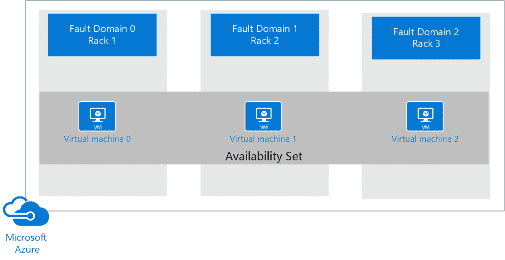
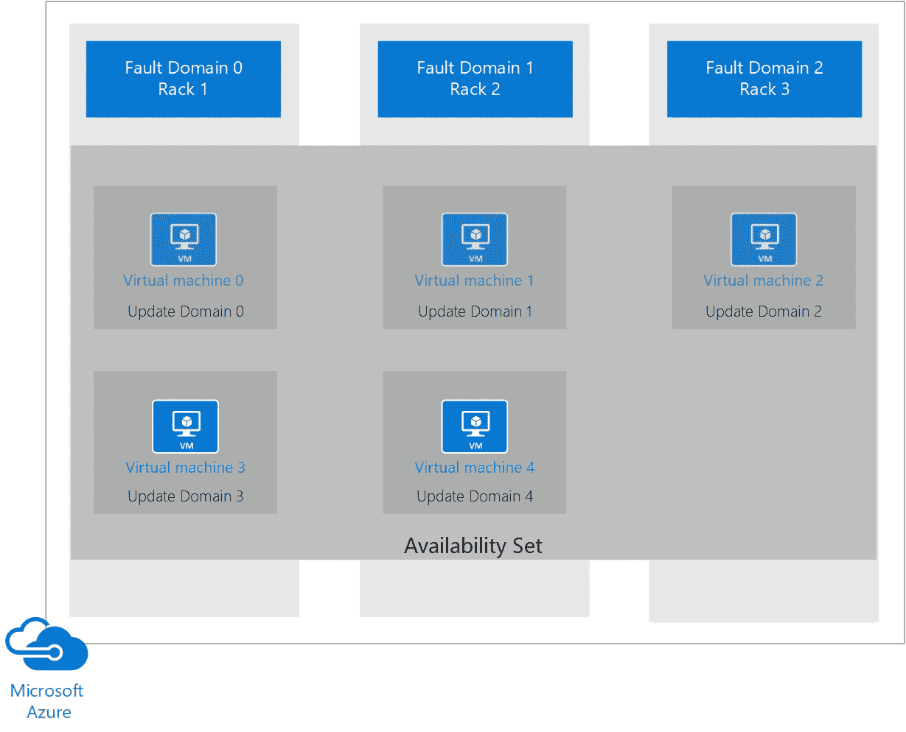
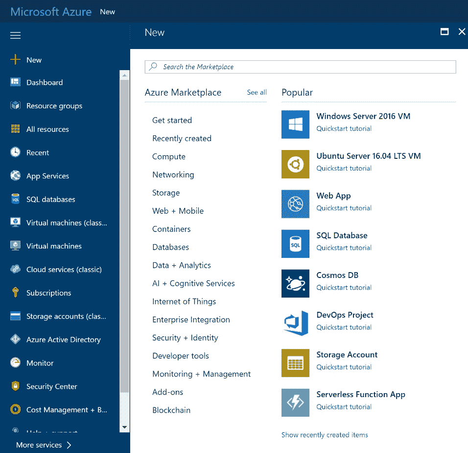
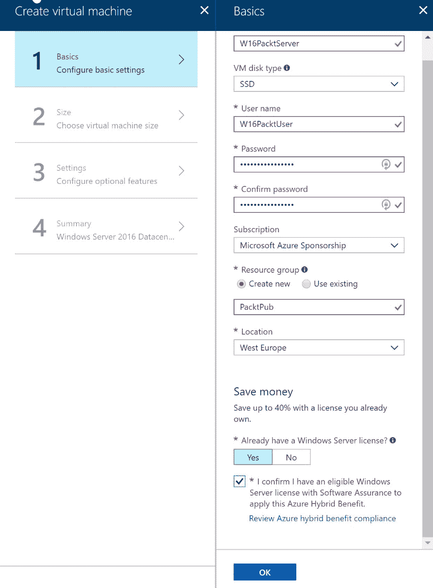
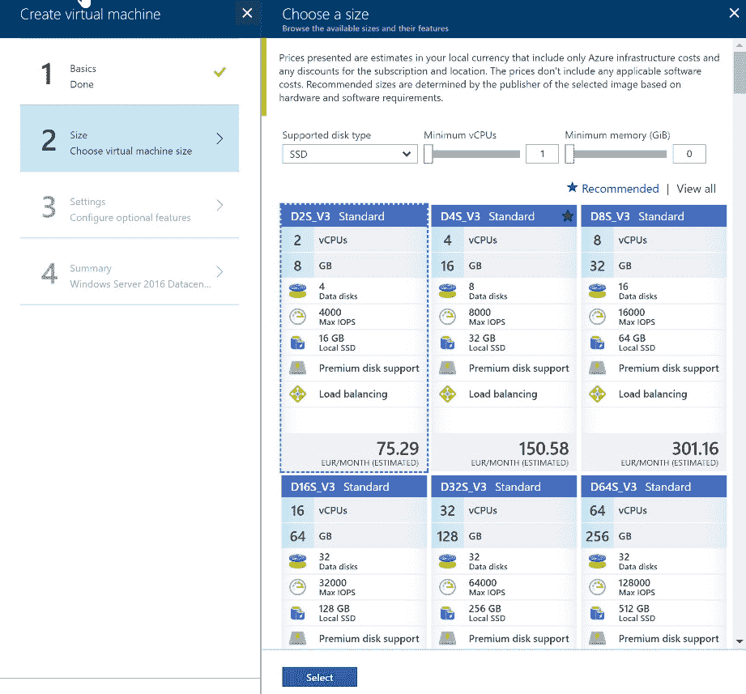
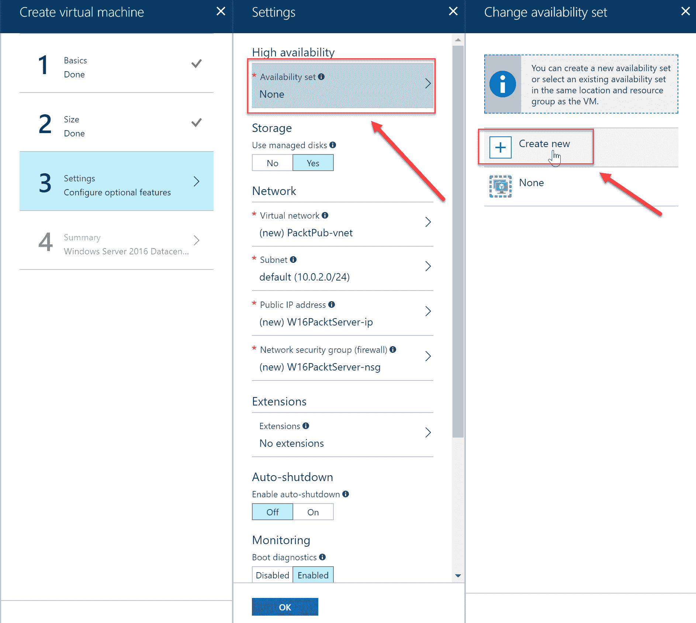
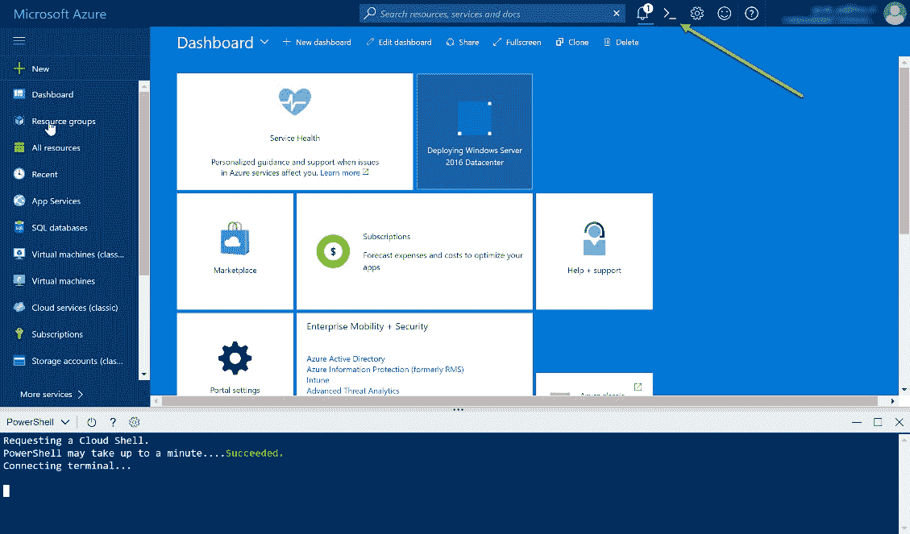
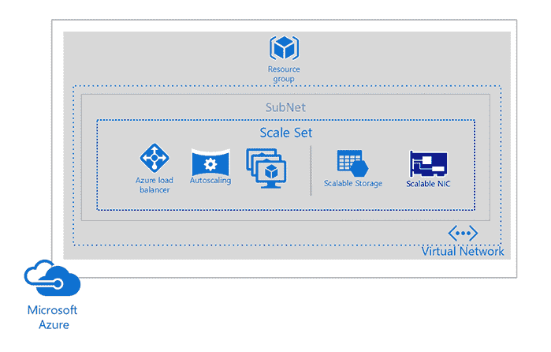
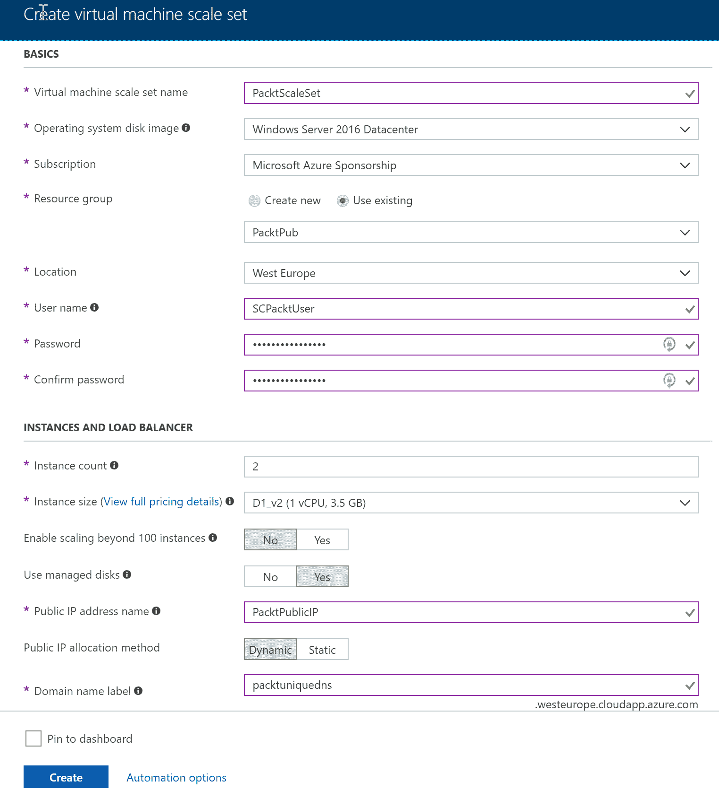

# 第一章：使用 Azure 虚拟机

这是《*设计 Azure 解决方案*》一书的第一章。本书将涵盖 70-535 考试的所有目标。在相关部分，我们将为您提供额外的信息和指导，帮助您在 Azure 平台上设计和架构强大、未来-proof 和有效的解决方案。

本章介绍了 Microsoft Azure **虚拟机**（**VM**）的目标。我们将涵盖虚拟机的系列和规格信息。我们还将讲解如何通过可用性集、故障域和更新域设计虚拟机部署。此外，我们将向您展示如何通过 Azure 门户以及 Azure PowerShell 创建可用性集。最后，我们将介绍如何通过 Azure 门户设计和管理 VM 扩展集。

本章将涵盖以下主题：

+   为虚拟机设计解决方案

+   虚拟机系列和规格

+   可用性集

+   故障域和更新域

+   托管磁盘

+   创建高可用性的虚拟机

+   VM 扩展集

+   灾难恢复

# 技术要求

本章示例使用以下工具：

+   Azure PowerShell: [`docs.microsoft.com/en-us/powershell/azure/install-azurerm-ps?view=azurermps-5.6.0&viewFallbackFrom=azurermps-5.1.1`](https://docs.microsoft.com/en-us/powershell/azure/install-azurerm-ps?view=azurermps-5.6.0&viewFallbackFrom=azurermps-5.1.1)

本章的源代码可以在此下载：

+   [`github.com/SjoukjeZaal/AzureArchitectureBook/tree/master/Chapter%201`](https://github.com/SjoukjeZaal/AzureArchitectureBook/tree/master/Chapter%201)

# 为虚拟机设计解决方案

在 Azure 中，您可以运行 Windows 虚拟机和 Linux 虚拟机。虚拟机有各种大小和价格，从具有少量内存和处理能力的一般用途虚拟机，到可用于 GPU 密集型和高性能计算工作负载的大型虚拟机。

要创建虚拟机，您可以选择多个预定义的镜像。操作系统镜像（如 Windows Server 或 Kali Linux）以及预定义的应用程序（如 SQL Server 镜像和完整的 farm，这些 farm 由多个虚拟机组成，可以一次性部署）都可以选择。例如，三层 SharePoint farm 就是一个 farm 示例。

虚拟机可以通过 Azure 门户、PowerShell 或 CLI 创建和管理。如果您计划使用 PowerShell，请注意 Azure PowerShell 有多个版本，而且 Azure PowerShell 和 *新* Azure PowerShell 之间存在显著差异。要安装和配置 Azure PowerShell，请参阅本章的开头部分。

本书中的演示将使用支持 *新* Azure PowerShell 的版本。我强烈建议您在所有新的部署和解决方案中使用此版本的 PowerShell。经典模型仅应用于之前已使用此模型部署的解决方案。

设计最有效的虚拟机解决方案取决于几个因素，例如决定使用哪个尺寸和系列，决定虚拟机是否需要高可用性，以及解决方案是否需要轻松进行横向扩展和纵向扩展。

# 虚拟机系列和尺寸

Azure 提供了许多不同的虚拟机尺寸可供选择。请注意，从设计角度了解可用选项非常重要，因为选择错误的虚拟机尺寸可能会对虚拟机的性能或安装在虚拟机上的应用程序产生负面影响。在不同选项之间的选择也会对整体成本产生巨大影响。例如，如果您的公司或客户希望通过将数据中心迁移到 Azure 来降低成本，明智地选择虚拟机将决定您的项目是成功还是失败。

Azure 虚拟机按机器系列进行组织，从 A 系列开始，这些虚拟机主要用于通用目的。还有专为计算、内存、存储和 GPU 优化的虚拟机系列，以及高性能计算虚拟机。以下部分将详细解释所有可用的系列和尺寸。

# 可用的虚拟机系列和尺寸

在编写本书时，以下虚拟机系列可供选择：

| **尺寸** | **类型** | **描述** |
| --- | --- | --- |
| A0-7, Av2, B, D, DS, Dv2, DSv2, Dv3, Dsv3 | 通用型 | 这些虚拟机具有平衡的 CPU 与内存比率，适用于测试和开发场景。它们也适用于小型和中型数据库以及低至中等流量的 Web 服务器。 |
| F, Fs, Fsv2 | 计算优化型 | 这些虚拟机具有高 CPU 与内存比率，适用于中等流量的 Web 服务器、应用程序服务器和批处理节点的网络设备。 |
| D, DS, Dv2, DSv2, Ev3, Esv3, G, GS, M | 内存优化型 | 这些虚拟机具有高内存与 CPU 比率，适用于关系型数据库服务器、中到大型缓存和内存分析。 |
| Ls | 存储优化型 | 这些虚拟机具有高磁盘吞吐量和 I/O，适用于大数据、SQL 和 NoSQL 数据库。 |
| NC, NCv2, NCv3, ND, NV | GPU | 这些虚拟机专为重度图形渲染、视频编辑、深度学习应用和机器学习模型训练而设计。此类虚拟机可以选择单个或多个 GPU。 |
| A8-11, H | 高性能计算型 | 这些是最快的虚拟机，提供最强大的 CPU 和可选的高吞吐量网络接口（RDMA）。 |

虚拟机系列会不断更新。新的系列、类型和大小会频繁地添加和移除。要了解这些变化，您可以参考以下网站获取 Windows 虚拟机的大小：[`docs.microsoft.com/en-us/azure/virtual-machines/windows/sizes`](https://docs.microsoft.com/en-us/azure/virtual-machines/windows/sizes)。对于 Linux 虚拟机大小，您可以参考[`docs.microsoft.com/en-us/azure/virtual-machines/linux/sizes?toc=%2fazure%2fvirtual-machines%2flinux%2ftoc.json`](https://docs.microsoft.com/en-us/azure/virtual-machines/linux/sizes?toc=%2fazure%2fvirtual-machines%2flinux%2ftoc.json)。

# 可用性集

要构建一个可靠的基础设施，将虚拟机添加到可用性集是关键。有几个场景可能会影响您 Azure 虚拟机的可用性，具体如下：

+   **非计划的硬件维护事件**：当硬件即将发生故障时，Azure 会触发一个非计划的硬件维护事件。使用实时迁移技术，预测故障并将虚拟机、网络连接、内存和存储迁移到不同的物理机器上，而不会中断客户端。当虚拟机迁移时，性能会暂时下降，因为虚拟机会暂停 30 秒。网络连接、内存和打开的文件仍然被保留。

+   **意外停机**：当发生此事件时，虚拟机会宕机，因为 Azure 需要在同一数据中心内修复您的虚拟机。硬件或物理基础设施故障通常会导致此事件的发生。

+   **计划硬件维护事件**：此类事件是 Microsoft 在 Azure 中定期进行的更新，以改进平台。大多数更新不会对虚拟机的正常运行时间产生重大影响，但其中一些可能需要重启或重新启动。

为了在这些事件期间提供冗余，您可以将两个或更多虚拟机分组到一个可用性集中。通过利用可用性集，虚拟机分布在集群中的多个隔离硬件节点上。这样，Azure 可以确保在发生事件或故障时，只有一部分虚拟机会受到影响，您的整体解决方案仍将保持运行并可用。这样可以确保达到 99.95%的 Azure 服务等级协议（SLA）。

要详细了解 SLA 适用的时机和方式，您可以参考以下概述：[`azure.microsoft.com/en-us/support/legal/sla/virtual-machines/v1_6/`](https://azure.microsoft.com/en-us/support/legal/sla/virtual-machines/v1_6/)。

# 故障域和更新域

当您将虚拟机放入可用性集时，Azure 保证将它们分布在故障域和更新域中。默认情况下，Azure 会为可用性集分配**三个故障域和五个更新域**（最多可增加到 20 个）。

当将虚拟机分布在故障域时，您的虚拟机会分布在 Azure 数据中心的三个不同机架上。因此，在底层平台发生事件或故障时，只有一个机架会受到影响，其他虚拟机仍然可以访问。



虚拟机分布在三个故障域上

更新域在操作系统或主机更新时非常有用。当您将虚拟机分布到多个更新域时，一个域会被更新并重启，而其他域仍然可以访问。



虚拟机分布在五个更新域和三个故障域上

# 托管磁盘

Azure 托管磁盘是在 Azure 门户中创建虚拟机时选择的默认磁盘。它们完全处理您的虚拟机存储。以前，您需要手动创建存储帐户来存储虚拟机硬盘，并且当虚拟机需要扩展时，您还需要添加额外的存储帐户，以确保不会超过每个帐户 20,000 IOPS 的限制。

使用托管磁盘时，这些负担现在由 Azure 为您处理。您现在可以在一个订阅中创建 10,000 个虚拟机磁盘，这样就能在一个订阅中部署成千上万个虚拟机，而无需在存储帐户之间复制磁盘。

如果您仍在使用非托管磁盘，强烈建议您切换到托管磁盘。要将磁盘从非托管转换为托管，请参考以下文章：[`docs.microsoft.com/en-us/azure/virtual-machines/windows/convert-unmanaged-to-managed-disks`](https://docs.microsoft.com/en-us/azure/virtual-machines/windows/convert-unmanaged-to-managed-disks)。

# 灾难恢复

即使您将虚拟机部署到云中，业务连续性和灾难恢复仍然至关重要。Azure 提供了两种不同的服务来处理此问题：**Azure 备份服务**和**Azure 站点恢复服务**。它们共同在云中原生地解决了灾难恢复需求。

# 备份与恢复

Azure 使用 Azure 备份服务来备份虚拟机。您可以使用此服务备份 Azure 虚拟机以及本地虚拟机。您还可以将它用于混合配置中的备份解决方案扩展，或完全用 Azure 备份替代本地备份解决方案。该服务可以备份文件、文件夹、虚拟机、应用程序、工作负载、系统状态和卷。

Azure 备份由以下备份组件组成：

+   **Azure 备份（MARS）代理**：此代理需要安装在运行于 Azure 或您本地基础设施上的 Windows Server 虚拟机上（当前不支持 Linux）。您可以使用它来备份虚拟机、文件、文件夹和系统状态。

+   **保护 System Center 数据保护管理器（DPM）服务器**：您可以在混合设置中与 DPM 服务器一起使用 Azure 备份。DPM 服务器可以部署在您的本地数据中心内或 Azure 的虚拟机上。您可以使用它将旧数据存储在 Azure 备份服务保险库中，并使用磁盘存储新数据，例如。

+   **Azure 备份服务器**：这个组件安装在本地 Windows 服务器或 Azure 的 Windows VM 上。它为 Windows 和 Linux 服务器提供备份支持，并使用 Azure 恢复服务保险库存储备份。

+   **Azure IaaS VM backup**：这包括一个需要安装在您的 Azure 虚拟机上的代理程序。这些虚拟机可以是 Linux 或 Windows 虚拟机。您不能使用此工具备份您的本地服务器。

使用 Azure 备份服务备份您的 VM 时，大部分工作将在准备虚拟机方面。在备份可以从虚拟机中进行快照之前，您的 VM 必须满足先决条件。首先，您需要在 Azure 中创建一个**恢复服务保险库**以存储备份。然后，需要在虚拟机上安装 VM 代理程序。此时还需要检查您的网络连接。当所有先决条件都满足时，您可以将 VM 备份到恢复服务保险库中。这些备份可以轻松地通过 Azure 门户、PowerShell 或 CLI 创建。然后，快照将存储在恢复服务保险库中，您也可以从那里恢复快照。在恢复时，您可以选择恢复整个 VM 或仅恢复单个文件或文件夹。

虚拟机备份的先决条件在以下文章中有详细描述：[`docs.microsoft.com/en-us/azure/backup/backup-azure-arm-vms-prepare`](https://docs.microsoft.com/en-us/azure/backup/backup-azure-arm-vms-prepare)。

# 创建高可用性虚拟机

VM 只能通过创建添加到可用性集。当您希望将现有 VM 添加到可用性集时，这将导致重新创建您的 VM。这是设计解决方案时需要注意的事项。

# 从 Azure 门户创建高可用性虚拟机

按照以下步骤从 Azure 门户创建虚拟机：

1.  打开 [`portal.azure.com/`](https://portal.azure.com/) 导航到 Azure 门户。

1.  点击**新建**，在右侧选择一个镜像（或者您可以在搜索栏中输入镜像名称）。在这个演示中，我们选择了 Windows Server 2016 VM 镜像：



创建 Azure 虚拟机

1.  一个新的面板打开，您可以填写虚拟机的基本设置。添加以下详细信息，然后点击**确定**：



填写基本设置

1.  会打开一个新窗口，在这里你可以选择虚拟机类型和大小。默认情况下，只显示推荐的虚拟机，但你可以通过点击“查看所有”并选择“选择”来显示所有虚拟机，如以下截图所示：



选择虚拟机大小

1.  会打开一个新窗口，在这里你可以配置其他选项。选择“可用性集”，然后点击“创建新建”：



创建高可用性集

1.  默认情况下，虚拟机会被分配两个故障域和五个更新域。接受默认设置，并在提示时点击“确定”两次。

1.  最后一个窗口会打开，提供一个摘要，列出你输入的所有设置。勾选权限框。

1.  点击“创建”，你的虚拟机现在已创建。你应该可以在“创建”按钮旁边看到一个链接，点击该链接可以下载此虚拟机的 ARM 模板。

1.  创建第二个虚拟机，并且不是创建一个新的可用性集，而是将第二个虚拟机添加到我们已经使用前面步骤创建的可用性集中。

你可以下载虚拟机配置的 ARM 模板。此模板也可以用于部署第二个虚拟机。GitHub 上有许多由 Microsoft 和社区创建的模板：[`azure.microsoft.com/en-us/resources/templates/`](https://azure.microsoft.com/en-us/resources/templates/)。

# 从 PowerShell 创建高可用虚拟机

虚拟机和可用性集也可以使用 PowerShell 创建。除了传统的 PowerShell，你还可以使用 **Azure Cloud Shell** 来创建可用性集。通过使用 Azure Cloud Shell，你实际上是在浏览器内使用 PowerShell。在 Azure Cloud Shell 中，Windows 用户可以选择 PowerShell，而 Linux 用户可以选择 Bash。你可以从 Azure 门户打开 Azure Cloud Shell，如以下截图所示：



Azure Cloud Shell

要创建两个虚拟机并将它们添加到可用性集，请将以下 PowerShell 语句添加到 Azure Cloud Shell 或 Windows PowerShell 中（请注意，在使用 Azure Cloud Shell 时，无需登录）：

```
Login-AzureRmAccount
```

如果需要，选择正确的订阅，如下所示：

```
Select-AzureRmSubscription -SubscriptionId "********-****-****-****-***********"

```

创建资源组：

```
New-AzureRmResourceGroup -Name PacktPubPS -Location WestEurope
```

现在，创建一个可用性集：

```
New-AzureRmAvailabilitySet -Location WestEurope -Name AvailabilitySet02 -ResourceGroupName PacktPubPS -Sku Aligned -PlatformFaultDomainCount 2 -PlatformUpdateDomainCount 2
```

接下来，我们需要创建两个虚拟机并将它们添加到可用性集中。这是通过将 `-AvailabilitySetId` 参数设置为可用性集的 ID 来完成的。运行此脚本时，系统将提示输入虚拟机的用户名和密码，如以下片段所示：

```
$availabilitySet = Get-AzureRmAvailabilitySet -ResourceGroupName PacktPubPS -Name AvailabilitySet02

$cred = Get-Credential -Message "Enter a username and password for the virtual machine."

$subnetConfig = New-AzureRmVirtualNetworkSubnetConfig -Name PacktSubnet -AddressPrefix 192.168.1.0/24
$vnet = New-AzureRmVirtualNetwork -ResourceGroupName PacktPubPS -Location WestEurope -Name PacktVnet -AddressPrefix 192.168.0.0/16 -Subnet $subnetConfig

$nsgRuleRDP = New-AzureRmNetworkSecurityRuleConfig -Name PacktNetworkSecurityGroupRuleRDP -Protocol Tcp -Direction Inbound -Priority 1000 -SourceAddressPrefix * -SourcePortRange * -DestinationAddressPrefix * -DestinationPortRange 3389 -Access Allow

$nsg = New-AzureRmNetworkSecurityGroup -Location WestEurope -Name PacktSecurityGroup -ResourceGroupName PacktPubPS -SecurityRules $nsgRuleRDP

# Apply the network security group to a subnet
Set-AzureRmVirtualNetworkSubnetConfig -VirtualNetwork $vnet -Name PacktSubnet -NetworkSecurityGroup $nsg -AddressPrefix 192.168.1.0/24

# Update the virtual network
Set-AzureRmVirtualNetwork -VirtualNetwork $vnet 
for ($i=1; $i -le 2; $i++)
{
 $pip = New-AzureRmPublicIpAddress -ResourceGroupName PacktPubPS -Location WestEurope -Name "$(Get-Random)" -AllocationMethod Static -IdleTimeoutInMinutes 4

 $nic = New-AzureRmNetworkInterface -Name PacktNic$i -ResourceGroupName PacktPubPS -Location WestEurope -SubnetId $vnet.Subnets[0].Id -PublicIpAddressId $pip.Id -NetworkSecurityGroupId $nsg.Id

 # Specify the availability set
 $vm = New-AzureRmVMConfig -VMName PacktVM$i -VMSize Standard_D2_v3 -AvailabilitySetId $availabilitySet.Id

 $vm = Set-AzureRmVMOperatingSystem -ComputerName myVM$i -Credential $cred -VM $vm -Windows -EnableAutoUpdate -ProvisionVMAgent
 $vm = Set-AzureRmVMSourceImage -VM $vm -PublisherName MicrosoftWindowsServer -Offer WindowsServer -Skus 2016-Datacenter -Version latest

 $vm = Add-AzureRmVMNetworkInterface -VM $vm -Id $nic.Id
 New-AzureRmVM -ResourceGroupName PacktPubPS -Location WestEurope -VM $vm
}
```

# 虚拟机规模集

虚拟机规模集用于一次性部署多个虚拟机，无需手动操作或使用脚本。然后，您可以从一个地方管理所有虚拟机。虚拟机规模集通常用于构建大规模基础设施，其中保持所有虚拟机同步是关键。虚拟机的维护，包括同步，它由 Azure 处理。

虚拟机规模集在后台使用可用性集。规模集内的虚拟机会自动由底层平台分布在故障域和更新域中。虚拟机规模集默认使用 Azure 自动扩展。然而，您也可以手动添加或删除实例，而不使用自动扩展。

在创建规模集时，系统会自动为您创建一些资源。除了您指定的虚拟机数量会被添加到规模集中外，还会添加**Azure 负载均衡器**和**Azure 自动扩展**，以及一个虚拟网络和一个公共 IP：



Azure 虚拟机规模集架构

# 从 Azure 门户创建虚拟机规模集

1.  打开[`portal.azure.com/`](https://portal.azure.com/)访问 Azure 门户。

1.  点击“新建”并在搜索框中输入`Scale`。选择虚拟机规模集。

1.  在下一个屏幕中，点击“创建”，并在点击“创建”按钮之前添加以下设置：



创建虚拟机规模集

创建后，您可以通过 Azure 门户、PowerShell 和 CLI 管理虚拟机规模集。

# 访问您的虚拟机规模集

有多种方法可以访问您的虚拟机规模集，具体方法如下：

+   **使用 RDP 或 SSH 连接虚拟机实例**：要使用 RDP 或 SSH 连接虚拟机实例，您可以配置规模集以自动分配公共 IP 地址。默认情况下，此选项是关闭的。虚拟机位于虚拟网络内，因此无法通过 RDP 或 SSH 连接。

+   **使用跳板机连接虚拟机实例**：您可以在同一个虚拟网络内创建一个独立的虚拟机，作为跳板机连接到规模集中的其他实例。独立虚拟机将获得一个公共 IP 地址，可以通过 RDP 或 SSH 连接。一旦连接到该虚拟机，您可以使用它通过内部 IP 地址连接到其他实例。

+   **使用 NAT 规则连接虚拟机实例**：您还可以使用在负载均衡器内部创建的 NAT 规则连接虚拟机实例。这些 NAT 规则将实例分配到不同的 RDP 端口。

+   **使用负载均衡分配流入流量**：流入的流量可以使用轮询方法分配到虚拟机实例。您可以使用 Azure 负载均衡器和 Azure 应用程序网关来实现这一点，前者提供第 4 层负载均衡规则，后者提供第 7 层负载均衡规则。

# 虚拟机规模集模板

你还可以使用 ARM 模板部署 VM 扩展集。ARM 模板是自动部署解决方案的好方法，你甚至可以在模板中嵌入定制和扩展。例如，你可以在容器内部安装应用程序，并在扩展集部署过程中将其部署到 VM 实例中。

微软和社区还提供了一些已经为不同架构配置好的 ARM 模板，这些模板可以下载并部署，以创建 Azure 扩展集，模板中已包含用于管理扩展集的扩展功能。以下是一些模板示例：

+   **简单部署带有 NAT 规则的负载均衡器后面的 Windows VM 扩展集**： [`github.com/Azure/azure-quickstart-templates/tree/master/201-vmss-windows-nat`](https://github.com/Azure/azure-quickstart-templates/tree/master/201-vmss-windows-nat)

+   **简单部署带有 NAT 规则的负载均衡器后面的 Linux VM 的 VM 扩展集**： [`github.com/Azure/azure-quickstart-templates/tree/master/201-vmss-linux-nat`](https://github.com/Azure/azure-quickstart-templates/tree/master/201-vmss-linux-nat)

+   **简单部署带有跳板机的 Linux VM 扩展集**： [`github.com/Azure/azure-quickstart-templates/tree/master/201-vmss-linux-jumpbox`](https://github.com/Azure/azure-quickstart-templates/tree/master/201-vmss-linux-jumpbox)

+   **Windows VM 扩展集与应用网关集成**： [`github.com/Azure/azure-quickstart-templates/tree/master/201-vmss-windows-app-gateway`](https://github.com/Azure/azure-quickstart-templates/tree/master/201-vmss-windows-app-gateway)

# 复制

Azure 站点恢复服务通过协调和自动化 Azure VM 的复制，提供了一种来自 Azure 的业务连续性和灾难恢复解决方案。它可以将工作负载和应用程序从主位置复制到次级位置，以确保在灾难发生时，VM 或应用程序依然可以运行。当主位置恢复时，你还可以轻松地恢复到主位置。

Azure 站点恢复服务提供以下功能和能力：

+   **Azure VM、本地 VM 和工作负载复制**：你可以将 Azure VM 从主区域复制到 Azure 的次级区域进行灾难恢复。你也可以将本地 VM 和物理服务器复制到 Azure 或者复制到次级本地数据中心。你可以复制任何来自本地 Hyper-V 和 VMware VM、Windows/Linux 物理服务器以及 Azure VM 的工作负载。

+   **数据弹性**：复制过程中没有应用数据被拦截。数据存储在 Azure 存储中，并且在故障转移时，VM 是使用 Azure 存储中的数据创建的。

+   **定制的恢复计划**：你可以创建定制的恢复计划，将 VM 分组在一起，或者添加自定义脚本或任务。

+   **BDCR 集成**：你还可以将 Azure 恢复服务与其他 BDCR 解决方案集成。

+   **网络集成**：Azure 恢复服务与 Azure 中的网络功能集成。你可以预留 IP 地址、配置负载均衡器，并集成 Azure 流量管理器以实现网络切换。

+   **一致性应用程序**：你可以在故障恢复过程中通过应用程序一致的快照保持应用程序的一致性。这些快照可以捕捉磁盘数据、内存中的所有数据以及所有正在进行的事务。

要了解 Azure 恢复服务提供的所有功能，您可以参考 [`docs.microsoft.com/en-us/azure/site-recovery/site-recovery-overview`](https://docs.microsoft.com/en-us/azure/site-recovery/site-recovery-overview)。

# 总结

在本章中，我们介绍了虚拟机的目标。我们讲解了 Azure 提供的不同大小和系列。我们还讨论了可用性集、故障和更新域，以及如何创建它们。我们还讲解了托管磁盘，并向你展示了如何创建高可用性的虚拟机。我们讨论了虚拟机规模集及其使用时机，最后我们讲解了虚拟机的备份与恢复。

下一章将讲解使用 Azure 服务和 Azure 批处理的计算密集型应用程序。

# 问题

回答以下问题，测试你对本章内容的理解。你可以在本书最后的*评估*部分找到答案。

1.  创建新虚拟机时，Azure 托管磁盘是否默认被选中？

    1.  是的

    1.  不是

1.  如果你希望在底层基础设施发生故障时，虚拟机仍然可用，是否应该使用可用性集？

    1.  是的

    1.  不是

1.  当你将虚拟机添加到可用性集中时，虚拟机是否默认分布在三个故障域和四个更新域中？

    1.  是的

    1.  不是

# 进一步阅读

你可以查看以下链接，获取更多关于本章所涉及主题的信息：

+   **管理 Azure 中 Windows 虚拟机的可用性**：[`docs.microsoft.com/en-us/azure/virtual-machines/windows/manage-availability`](https://docs.microsoft.com/en-us/azure/virtual-machines/windows/manage-availability)

+   **Windows 虚拟机的示例 Azure 基础架构操作**：[`docs.microsoft.com/en-us/azure/virtual-machines/windows/infrastructure-example`](https://docs.microsoft.com/en-us/azure/virtual-machines/windows/infrastructure-example)

+   **Azure 中虚拟机的计划维护**：[`docs.microsoft.com/en-us/azure/virtual-machines/windows/maintenance-and-updates`](https://docs.microsoft.com/en-us/azure/virtual-machines/windows/maintenance-and-updates)

+   **虚拟机规模集文档**：[`docs.microsoft.com/en-us/azure/virtual-machine-scale-sets/`](https://docs.microsoft.com/en-us/azure/virtual-machine-scale-sets/)

+   **使用自定义 Docker 镜像为容器 Web 应用服务提供支持**: [`docs.microsoft.com/en-us/azure/app-service/containers/tutorial-custom-docker-image`](https://docs.microsoft.com/en-us/azure/app-service/containers/tutorial-custom-docker-image)

+   **Azure 备份功能概述**: [`docs.microsoft.com/en-us/azure/backup/backup-introduction-to-azure-backup`](https://docs.microsoft.com/en-us/azure/backup/backup-introduction-to-azure-backup)

+   **将 Azure 虚拟机备份到恢复服务保管库**: [`docs.microsoft.com/en-us/azure/backup/backup-azure-arm-vms`](https://docs.microsoft.com/en-us/azure/backup/backup-azure-arm-vms)

+   **在 Azure 中规划虚拟机备份基础架构**: [`docs.microsoft.com/en-us/azure/backup/backup-azure-vms-introduction`](https://docs.microsoft.com/en-us/azure/backup/backup-azure-vms-introduction)

+   **站点恢复**: [`docs.microsoft.com/en-us/azure/site-recovery/site-recovery-overview`](https://docs.microsoft.com/en-us/azure/site-recovery/site-recovery-overview)
