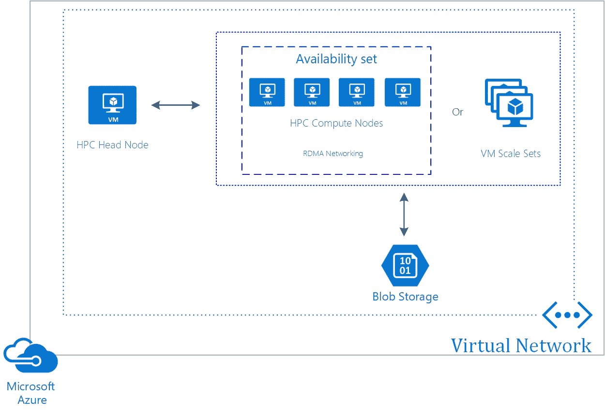

# 第二章：配置计算密集型应用

在上一章中，我们介绍了 Azure 虚拟机（VM）的目标。我们讨论了如何通过分析可用的系列和规格来设计 Azure 虚拟机。我们还讨论了如何利用 Azure 提供的各种功能来设计高可用性和高性能的解决方案。

本章介绍了计算密集型应用的目标。内容将涵盖如何使用 Azure 服务设计高性能计算（HPC）及其他计算密集型应用，如何确定何时使用 Azure 批量处理，以及如何设计无状态组件以适应 Azure 批量处理的规模和容器。

以下主题将被讨论：

+   高性能计算虚拟机

+   Microsoft HPC Pack

+   Azure 批量处理

# 高性能计算虚拟机

Azure 提供多个虚拟机系列和规格，专为计算密集型任务设计和优化。这些虚拟机也被称为计算密集型实例。在撰写本书时，Azure 提供了 A8-A11 系列、N 系列和 H 系列，它们都支持 HPC 工作负载。

这些系列和规格由专为计算密集型、图形密集型和网络密集型应用设计和优化的硬件组成。它们最适合用于建模、仿真和高性能计算集群应用：

+   A 系列提供 RDMA 网络，具有超低延迟和高带宽的网络性能。

+   N 系列旨在支持图形密集型和计算密集型应用。它们配备不同型号的 NVIDIA Tesla GPU，非常适合深度学习应用、游戏应用或虚拟化。

+   H 系列提供专门针对高性能优化的虚拟机。它们配备快速的 Intel Xeon 处理器、基于 SSD 的本地存储和 DDR4 内存。这些虚拟机最适合高性能计算（HPC）工作负载，如批处理、建模和仿真。

关于 N 系列虚拟机的硬件规格，可以参考以下文章：[`docs.microsoft.com/en-us/azure/virtual-machines/windows/sizes-gpu`](https://docs.microsoft.com/en-us/azure/virtual-machines/windows/sizes-gpu)。有关高性能虚拟机的更多信息，请参阅以下文章：[`docs.microsoft.com/en-us/azure/virtual-machines/windows/sizes-hpc?toc=%2Fazure%2Fvirtual-machines%2Fwindows%2Ftoc.json`](https://docs.microsoft.com/en-us/azure/virtual-machines/windows/sizes-hpc?toc=%2Fazure%2Fvirtual-machines%2Fwindows%2Ftoc.json)。

Azure 市场提供多种专为 HPC 设计的虚拟机镜像，如用于 Windows 和 Linux 的 Azure 数据科学虚拟机、D3View 等。你可以通过以下 URL 访问市场：[`azuremarketplace.microsoft.com/en-us/marketplace.`](https://azuremarketplace.microsoft.com/en-us/marketplace)

# Microsoft HPC Pack

微软提供适用于 Windows Server 2012、2016 和 Linux 机器的 HPC Pack。这是一个免费产品，你可以用它在本地服务器和 Azure 虚拟机上创建 HPC 集群。

你可以在 Windows 或 Linux 服务器上安装 HPC Pack。这些机器将自动成为集群的头节点。然后，你可以向集群添加更多节点，并在其上运行任务。该任务将自动分配到所有可用节点上。

它提供以下额外功能：

+   **混合集群**：你可以使用本地服务器和 Azure 虚拟机设置混合集群。

+   **HPC 集群管理器**：一个用于管理、部署和配置 HPC 集群的工具。

+   **PowerShell**：你可以使用 HPC PowerShell 来管理、配置、部署、添加并执行集群上的任务。

你可以使用 HPC Pack 来设计有效的云原生 HPC 解决方案和混合 HPC 解决方案。以下部分将详细解释这两者。

# 云原生 HPC 解决方案

云原生 HPC 解决方案使用 HPC 虚拟机，可以扩展到成千上万的实例和计算核心。它使用一个头节点、若干计算节点和存储。以下 Azure 资源可用于创建云原生 HPC 架构：

+   **HPC 头节点**：头节点在 Azure 上的 Windows 或 Linux 服务器虚拟机中运行。当你在该机器上安装 Azure HPC Pack 时，它将自动成为头节点。

+   **HPC 计算节点**：HPC 计算节点是使用 A8 和 A9 实例创建的。这些实例提供 RDMA 网络，可以用于实现节点之间的高带宽和微秒级延迟。

+   **虚拟机规模集**：你可以将计算节点放置在 **虚拟机规模集** (**VMSS**) 中，以确保冗余和高可用性。使用 RDMA 进行通信的虚拟机会被放置在同一个可用性集中。

+   **虚拟网络**：所有 Azure 资源，如头节点、计算节点和存储层，都被添加到 Azure 虚拟网络中。

+   **存储**：所有不同节点使用的磁盘都存储在 Azure Blob 存储中。

+   **ARM 模板**：你可以使用 ARM 模板将应用程序部署到节点上。

云原生 HPC 架构

# 混合 HPC 架构

混合 HPC 架构使用部分用于云原生 HPC 架构的构建块，结合了本地部分。以下 Azure 资源将在此场景中使用：

+   **HPC 头节点**：头节点运行在你的本地环境中。头节点也可以安装在 Azure 中的虚拟机上，支持 Windows 或 Linux 服务器虚拟机，和云原生架构一样，你可以在其上安装 Azure HPC Pack，它将自动成为头节点。

+   **HPC 计算节点**: 您本地环境中的 HPC 计算节点可以是具有足够计算能力的 Linux 或 Windows 服务器。Azure 中的虚拟机是使用 A8 和 A9 实例创建的，并提供 RDMA 网络支持。

+   **虚拟机规模集 (VMSS)**: 您可以将 Azure 中的计算节点放置在 VMSS 中，以实现冗余和高可用性。使用 RDMA 进行通信的虚拟机会被放置在同一可用性集中。

+   **虚拟网络**: Azure 资源（例如计算节点和存储层）被添加到 Azure 虚拟网络中。

+   **ExpressRoute**: ExpressRoute 提供了一个安全可靠的连接，将您的本地环境与 Azure 连接。这些连接不经过公共互联网，而是使用私有连接，通常是在 ExpressRoute 经纪人和 Azure 之间设置。

+   **VPN Gateway**: VPN 网关提供了 Azure 与您的本地网络之间的端点，能够在 HPC 集群中不同节点之间实现安全的连接和通信。此连接使用公共互联网。

+   **存储**: 在 Azure 中托管的节点使用的磁盘存储在 Azure Blob 存储中。

混合 HPC 架构

# Azure Batch

Azure Batch 是一项帮助开发人员在虚拟机（Windows 或 Linux）或容器上扩展工作负载的服务，无需管理基础设施。通过 Azure Batch，您可以高效地在云中运行大规模的并行和 HPC 应用程序。批处理计算最常用于定期处理、转换或分析大量数据的应用程序。通常，运行在 Azure Batch 上的 HPC 应用程序包括深度学习应用程序、图像渲染应用程序、媒体编码应用程序和蒙特卡洛模拟。Azure 媒体服务也在内部使用 Azure Batch 进行媒体编码。

Azure Batch 服务使用 Azure 计算作为其基础设施，这意味着您可以使用 Windows 或 Linux 虚拟机来托管您的应用程序或工作负载。Azure 内部使用 A8/A9 系列虚拟机和 RDMA 网络为节点提供支持，并且完全负责创建和管理这些虚拟机。Azure 会将节点添加到 Azure Batch 账户中的 **池**。

在 Azure Batch 账户中，可以创建一个**作业**，该作业将在池上运行工作负载。你的工作负载然后被添加到 Batch**队列**中，并被分成若干任务，这样它们可以并行运行。Azure Batch 会自动扩展这些任务，并且它们也可以被安排执行。你的工作负载，称为**任务**，被添加到 Batch 队列中，分布在托管的虚拟机池中，并且可以自动扩展。大部分任务可以完全独立运行，但对于一些 HPC 工作负载，任务之间可能需要相互通信。在这种情况下，Azure Batch 使用持久化存储来存储输出数据，以便其他任务获取。默认情况下，使用 Azure Blob 存储，但你也可以使用其他存储类型。这些任务通过一个称为**消息传递接口**（**MPI**）的运行时相互通信，所有这些不同任务的结果可以汇总成一个单一结果：

Azure Batch 架构

为了自动化创建 Azure Batch 进程，Azure Batch 使用一个 JSON 模板（不要与 ARM 模板混淆，这是不同的）。在这个模板中，你可以自动化创建 Batch 池，包括 VM 大小、操作系统和节点数量（VM 的数量）。你也可以使用 Azure CLI 进行自动化操作。

一个 Batch 池由虚拟机组成，这些虚拟机可以使用 Azure Marketplace 中的镜像、云服务（Azure 的标准来宾镜像）、自定义镜像（来自存储账户的自定义 VHD）和特定的图形及渲染镜像来创建。

你可以使用低优先级虚拟机来执行 Azure Batch。这将大大降低虚拟机的成本。此折扣仅适用于 Azure Batch，适用于 Azure Batch 支持的所有虚拟机大小，并且适用于所有区域。关于这些价格的更多信息，可以参考以下网页：[`azure.microsoft.com/en-us/pricing/details/batch/`](https://azure.microsoft.com/en-us/pricing/details/batch/)。

# 创建 Azure Batch 服务

在这个例子中，我们将通过 Azure 门户创建一个 Batch 池。这将为你提供一些关于 Azure Batch 不同设置的额外信息，例如如何在虚拟机池上启动你的应用程序。

要创建一个 Azure Batch 池，可以参考以下步骤：

1.  第一步是在 Azure 门户中创建一个 Azure Batch 账户。你可以参考以下文章来创建一个：[`docs.microsoft.com/en-us/azure/batch/batch-account-create-portal`](https://docs.microsoft.com/en-us/azure/batch/batch-account-create-portal)。我已经在名为 PacktBatchGroup 的资源组中创建了一个名为 packtpub 的 Azure Batch 账户：

Azure Batch 服务

1.  接下来，点击左侧菜单中的 Pools，然后点击 Add. 添加以下值：

    +   池 ID：packtpool1

    +   显示名称：PactPool

    +   镜像类型：云服务（仅限 Windows）

    +   节点大小：选择标准 A1

    +   扩展模式：自动扩展

    +   公式："$TargetDedicated=0"（有关**自动扩展公式**的更多信息，请参考以下文章：[`docs.microsoft.com/en-us/azure/batch/batch-automatic-scaling`](https://docs.microsoft.com/en-us/azure/batch/batch-automatic-scaling)）

    +   启动任务：禁用（在这里，您可以提供可执行文件或其他工作负载的启动命令）

保留其余设置的默认值。

对于虚拟网络设置，您可以将 Batch 池运行在 VNet 内。这样，虚拟机可以与 Batch 池之外的其他虚拟机通信，如文件服务器或许可证服务器。

1.  点击确认：

Azure Batch 池设置

1.  创建 Batch 池后，您可以从左侧菜单中选择**应用程序包**，上传您的可执行文件、库或与应用程序相关的其他元数据。要上传包，您必须创建或链接一个 Azure 存储账户。应用程序包以 ZIP 文件形式上传，包含所有必要的文件。这些文件会被 Azure 自动安装到虚拟机上：

Azure Batch 应用程序包

1.  您还可以从左侧菜单中提供启动任务属性。

这只是创建 Batch 服务的一种方式。您可以使用更多方法，例如使用 Visual Studio、直接调用 Batch API，或使用 CLI 或 PowerShell。

# 无状态组件

Azure Batch 使用并行操作来处理工作负载。为了充分利用此功能，应用程序需要拆分成单个无状态任务，称为多实例任务。默认情况下，Batch 任务在单个计算节点上执行。通过启用多实例任务，任务将在多个计算节点上执行。

这些**多实例任务**会提交到 Batch 作业中，然后在 Batch 池内的可用节点上分发。Azure Batch 会根据多实例设置自动创建一个主任务和多个子任务。并行运行的任务随后会使用 Azure 存储保存和检索不同任务使用的数据：

Azure Batch 作业和任务

这些**多实例任务**可以通过 Batch .NET SDK 或 Python SDK 在代码中创建。

有关使用 Batch .NET SDK 创建 Azure Batch 解决方案的更多信息，请参考以下教程：[`docs.microsoft.com/en-us/azure/batch/tutorial-parallel-dotnet`](https://docs.microsoft.com/en-us/azure/batch/tutorial-parallel-dotnet)。

# Azure Batch 上的容器

Azure Batch 还支持容器部署。您可以使用 Docker 容器或 Singularity。Singularity 与 Docker 类似，但它主要设计用于在本地环境和超级计算安装的共享 HPC 集群上运行。Singularity 执行容器时不需要 root 权限。它允许应用程序在执行用户的权限范围内利用 GPU 和专用网络。这使得 Singularity 适用于权限受限的 HPC 环境。Docker 最初是为运行 Linux 容器设计的，而 Singularity 可以导入 Docker 镜像并运行 Windows 容器。

Singularity 可以在 Azure Cloud Shell 中运行，无需安装，也可以从 Azure Batch Shipyard 版本中安装。这是一个开放系统，用于在 Azure Batch 上启用基于配置的简单容器执行。在这里不需要任何 Azure Batch .NET SDK 的知识；仅使用配置文件。

关于 Batch Shipyard 上的容器的更多信息，请参阅以下 GitHub 页面：[`github.com/Azure/batch-shipyard`](https://github.com/Azure/batch-shipyard)。

# 概述

本章中，我们已覆盖了计算密集型应用程序的目标。我们讲解了如何使用 Azure 服务设计 HPC 和其他计算密集型应用程序，如何确定何时使用 Azure Batch，以及如何设计无状态组件以适应 Azure Batch 上的扩展和容器。

在下一章中，我们将讲解 Web 应用程序的目标。

# 问题

回答以下问题，以测试您对本章内容的了解。您可以在本书结尾的 *评估* 部分找到答案：

1.  您想在本地环境中创建 HPC 集群。您是否应该使用 Azure Batch？

    1.  是

    1.  否

1.  在创建高性能计算虚拟机时，我们是否应该使用 H 系列？

    1.  是

    1.  否

1.  为了自动化创建 Azure Batch 进程，我们是否应该使用 ARM 模板？

    1.  是

    1.  否

# 深入阅读

您可以查看以下链接，了解更多有关本章所涉及的主题信息：

+   **高性能计算虚拟机规格**: [`docs.microsoft.com/en-us/azure/virtual-machines/windows/sizes-hpc?toc=%2Fazure%2Fvirtual-machines%2Fwindows%2Ftoc.json`](https://docs.microsoft.com/en-us/azure/virtual-machines/windows/sizes-hpc?toc=%2Fazure%2Fvirtual-machines%2Fwindows%2Ftoc.json)

+   **使用 HPC Pack 在 Azure 中创建和管理 Windows HPC 工作负载集群的选项**: [`docs.microsoft.com/en-us/azure/virtual-machines/windows/hpcpack-cluster-options`](https://docs.microsoft.com/en-us/azure/virtual-machines/windows/hpcpack-cluster-options)

+   **批处理文档**: [`docs.microsoft.com/en-us/azure/batch/`](https://docs.microsoft.com/en-us/azure/batch/)

+   **使用 Azure 虚拟机的 HPC、批处理和大规模计算解决方案**：[`docs.microsoft.com/en-us/azure/virtual-machines/linux/high-performance-computing`](https://docs.microsoft.com/en-us/azure/virtual-machines/linux/high-performance-computing)

+   **使用批处理应用程序包将应用程序部署到计算节点**：[`docs.microsoft.com/en-us/azure/batch/batch-application-packages`](https://docs.microsoft.com/en-us/azure/batch/batch-application-packages)

+   **解决方案架构：本地 HPC 实现扩展至 Azure**：[`azure.microsoft.com/en-us/solutions/architecture/hpc-on-prem-burst/`](https://azure.microsoft.com/en-us/solutions/architecture/hpc-on-prem-burst/)

+   **解决方案架构：在云中部署的 HPC 集群**：[`azure.microsoft.com/en-us/solutions/architecture/hpc-cluster/`](https://azure.microsoft.com/en-us/solutions/architecture/hpc-cluster/)

+   **解决方案架构：大规模计算解决方案作为服务**：[`azure.microsoft.com/en-us/solutions/architecture/hpc-big-compute-saas/`](https://azure.microsoft.com/en-us/solutions/architecture/hpc-big-compute-saas/)
