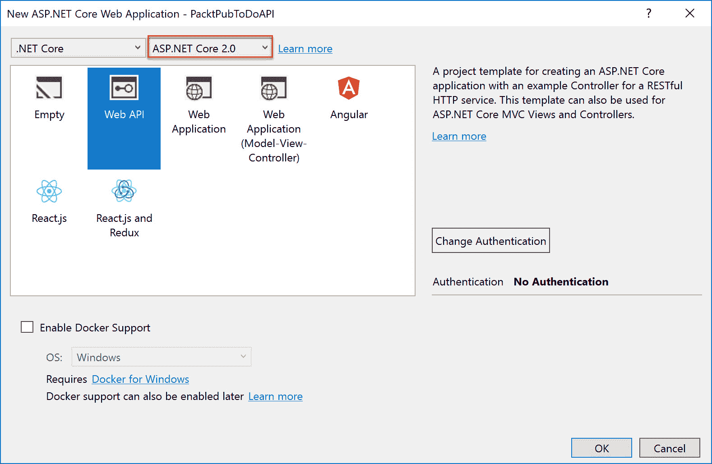

# 设计 Web 应用程序

在上一章中，我们涵盖了计算密集型应用程序的目标。我们讨论了如何设计高性能计算和其他计算密集型应用程序。

本章介绍了 Web 应用程序的目标。它将涵盖有关 Azure Web 应用、不同可用的应用服务计划以及不同应用服务计划的特征的信息。您将了解如何使用 Azure 容器服务和 Docker 设计 Web 应用程序以用于容器，如何使用 Redis 缓存、自动扩展、应用服务环境等设计具有高可用性、可扩展性和性能的 Web 应用程序，以及如何设计自定义 Web API 及 Azure 在保护自定义 API 方面提供的功能。

将涵盖以下主题：

+   Azure Web 应用

+   应用服务计划

+   为容器设计 Web 应用

+   为高可用性、可扩展性和性能设计 Web 应用

+   设计和保护自定义 Web API

# 技术要求

本章示例中使用以下工具：

+   Visual Studio 2017：[`www.visualstudio.com/downloads/`](https://www.visualstudio.com/downloads/)

本章的源代码可以在此处下载：

+   [`github.com/SjoukjeZaal/AzureArchitectureBook/tree/master/Chapter%203/`](https://github.com/SjoukjeZaal/AzureArchitectureBook/tree/master/Chapter%203)

# Azure Web 应用

Azure Web 应用是 Azure 应用服务的一部分，您可以在其中托管您的网站和应用程序。使用 Web 应用，您只需支付您使用的计算资源费用，而不是您的站点或应用程序的实际托管费用。除了网站和应用程序外，您还可以在 Azure Web 应用中托管您的 Web API 和移动后端。

您可以选择任意编程语言开发应用程序。在撰写本文时，Azure Web 应用支持 .NET、.NET Core、Java、Ruby、Node.js、PHP 和 Python。这些应用程序托管在由 Microsoft 完全管理的 Windows 或 Linux 虚拟机上，并可以使用现成的功能轻松进行扩展。除了扩展之外，您还可以利用其他 Azure 功能，例如安全性、负载均衡、洞察和分析。您还可以使用 DevOps 功能，例如从 VSTS、GitHub、Docker Hub 和其他资源进行持续集成和部署、SSL 证书、包管理、暂存环境和自定义域。

# 应用服务计划

Azure Web 应用托管在应用服务计划中。在应用服务计划中，您可以配置所有必需的设置，例如成本、计算资源以及您希望部署应用程序的区域。Azure 提供不同类型的应用服务计划，从与其他客户共享所有资源的免费计划（最适合开发应用程序）到付费计划，您可以选择在 Windows VM 或 Linux VM 上托管您的应用程序，并可以设置可用的 CPU 等。

Azure 提供以下服务计划 SKU：

+   **免费和共享：**您的应用程序与其他应用程序在共享环境中的同一虚拟机上运行。该环境还可能包括来自其他客户的应用程序。每个应用程序都有一个 CPU 配额，且无法进行纵向或横向扩展。这些应用服务计划最适合用于开发和测试应用程序，或者流量较少的应用程序。这两种计划不提供 SLA 支持。共享服务计划提供添加自定义域的能力。


Azure 门户中的免费和共享应用服务计划

+   **基础：**基础层级是第一个层级，您可以在不同的定价范围之间进行选择。它提供三个层级，每个层级的可用核心和内存都会翻倍。应用程序运行在专用的 Linux 或 Windows 虚拟机上，计算资源仅在同一应用服务计划内部署的应用程序之间共享。所有位于同一应用服务计划中的应用程序都驻留在一个隔离的环境中，支持 SSL 和自定义域。基础层级支持扩展到三个实例，但需要手动进行。这一层级最适合开发和测试环境以及流量较少的应用程序。


Azure 门户中的基础应用服务计划

+   **标准：**标准层级也有三个层级可供选择。它提供自定义域和 SSL 支持，支持自动扩展最多 10 个实例，并提供五个部署插槽，可用于测试、暂存和生产应用程序。它还提供每日备份和 Azure 流量管理器。


Azure 门户中的标准应用服务计划

+   **高级：**高级提供两种层级，Premium 和 PremiumV2。它们都提供标准层级的所有功能，但高级层级提供额外的扩展实例和部署插槽。Premium V2 运行在 Dv2 系列虚拟机上，具有更快的处理器和 SSD 驱动器，极大提高了应用程序的性能。


Azure 门户中的高级应用服务计划

+   **隔离：**隔离层级通过提供具有专用虚拟机和虚拟网络的私有环境，为您的应用程序提供完全隔离。您还可以扩展到 100 个实例。为了创建私有环境，应用服务使用 **应用服务环境**（**ASE**），将在下一部分中介绍。所有应用程序都运行在 Dv2 系列虚拟机上，因此提供高性能能力。隔离应用服务计划最适合需要完全隔离的应用程序，例如由于安全需求较高的情况，但又希望利用 Azure Web Apps 提供的所有功能，如自动扩展和部署插槽。


Azure 门户中的隔离应用服务计划

# 应用服务环境（ASE）

ASE 是 Azure 应用服务的一个功能，它为你的 Web 应用、移动应用、API 应用和 Azure 函数提供了一个完全隔离的环境。ASE 部署在 VNet 的子网内，因此提供完全的隔离和安全的网络访问。ASE 最适合需要高规模工作负载的应用，因为它们可以分布在一个或多个 Azure 区域中。由于网络隔离，ASE 也非常适合有高安全要求的应用。

每个 Azure 订阅只能创建一个 ASE，它最多可以托管 100 个实例；从一个 App Service 计划中的 100 个应用实例，到 100 个 App Service 计划，每个计划中有一个应用实例。

ASE 使用前端和工作者，其中前端适用于自动负载均衡 ASE 内的请求，而工作者则托管实际的 Web 应用。它们由 Azure 自动添加。

在写作时，ASE 有两个不同的版本，v1 和 v2。两个版本的区别在于，v2 会根据应用服务计划的规模自动添加前端和工作者到 ASE 中。而在 v1 中，你必须手动添加这些角色，才能扩展你的应用服务计划。

# 创建 ASE

你可以通过以下步骤从 Azure 门户创建 Azure ASE：

1.  通过打开 [`portal.azure.com/`](https://portal.azure.com/) 进入 Azure 门户。

1.  点击“新建”，然后在搜索栏中输入 `App Service Environment`。点击“创建”按钮。

1.  会打开一个新的面板，在这里你可以填写虚拟机的基本设置。请添加以下内容：

    +   名称：`PacktASE`

    +   订阅：在此选择一个订阅

    +   资源组：`` `PacktPubASE` ``

    +   虚拟网络/位置：Azure 将为你自动创建一个新的虚拟网络。如果你想选择现有的虚拟网络，可以通过点击链接更改设置。


在 Azure 门户中创建 ASE

1.  点击“创建”。Azure 将为你创建一个 ASE、一个虚拟网络、一个路由表和一个 NSG。

1.  你现在可以在创建新的 Azure 应用服务计划时选择这个 ASE：


在 Azure 门户中创建 ASE

请注意，创建 ASE 可能会非常昂贵，因此我强烈建议在完成测试后将其删除。

有关 Azure ASE 的更多信息，你可以参考以下微软文档：[`docs.microsoft.com/en-us/azure/app-service/environment/intro`](https://docs.microsoft.com/en-us/azure/app-service/environment/intro)。 [](https://docs.microsoft.com/en-us/azure/app-service/environment/intro)

# 容器化 Web 应用

容器化 Web 应用是 Azure 上的一个服务，它让你能够轻松地在 Azure 上部署和扩展你自己的 Docker 格式镜像。Docker 基于开放标准，这意味着它可以在所有主流的 Linux 发行版和 Windows Server 2016 上运行。

Docker 容器是轻量级的沙箱，运行在操作系统之上。当你的应用部署在 Docker 容器内时，应用无法看到或访问同一操作系统上运行的其他应用或进程。你可以将其与为托管不同类型工作负载或应用而创建的虚拟机进行比较，但没有虚拟化本身带来的开销。Docker 容器还共享相同的操作系统和基础设施，而虚拟机需要在自己的基础设施中安装独立的操作系统。

使用容器时，你可以共享 Docker 主机的底层资源，并构建一个包含运行应用所需一切的 Docker 镜像。你可以从一个基础镜像开始，然后添加所需的所有内容。

Docker 容器也具有极强的可移植性。你可以将包含所有设置（如配置设置、特定运行时、框架和工具）的 Docker 容器部署到安装了 Docker 的虚拟机上。然后，你可以轻松地将同一个容器移至 Azure Linux 上的 App 服务，应用仍然可以按预期运行。这解决了 *它在我的机器上能工作* 的问题，这是几乎所有开发人员都会遇到的。这使得 Docker 不仅仅是虚拟化技术，而是一种应用交付技术。

Docker 容器非常适合构建利用微服务架构的应用，其中应用的各个部分松散耦合，并被分为各自独立的服务，它们之间相互协作。每个服务可以部署到单独的容器中，使用自己编写的编程语言和配置设置。例如，一个服务可以是数据库、Web API 或移动后端。你可以轻松地部署同一个应用或数据库的多个副本。唯一需要注意的是，它们共享同一个操作系统。如果你的应用需要在不同的操作系统上运行，你仍然需要使用虚拟机。

有关 Azure Linux 上的 App 服务的更多信息，可以参考以下网站：[`docs.microsoft.com/en-us/azure/app-service/containers/app-service-linux-intro`](https://docs.microsoft.com/en-us/azure/app-service/containers/app-service-linux-intro)。Microsoft 发布了一个名为 **Developer Finder** 的示例项目，可以在 GitHub 上找到。它将为你提供 Docker 容器的可能性概览，是使用 Docker 开发自己应用的一个良好起点。你可以参考以下网站：[`github.com/azure-app-service/demoapp`](https://github.com/azure-app-service/demoapp)。

# 开始使用 Web 应用容器

可以从 Azure 门户创建 Web 应用容器。请按照以下步骤创建项目：

在这个示例中，我使用 Docker Hub 作为镜像仓库。你可以通过以下链接创建账户：[`hub.docker.com/`](https://hub.docker.com/)。

1.  通过打开 [`portal.azure.com/`](https://portal.azure.com/) 访问 Azure 门户。

1.  点击 **New**，在搜索框中输入 `Web App for Containers`。点击 **Create** 按钮，如下图所示：


在 Azure 门户中创建 Web 应用容器项目

1.  会打开一个新的面板，添加以下值：

    +   应用名称：`PacktContainers`。

    +   订阅：在这里选择一个订阅。

    +   资源组：输入应用名称时，资源组会自动填充。保持默认即可。

    +   应用服务计划/位置：会自动创建一个新的应用服务计划。如果你想选择现有的，或者更改默认设置，可以点击它。


在 Azure 门户中为容器配置 Web 应用设置

+   +   配置容器：这将带你进入实际的 Docker 设置。在这里，选择 Docker Hub 作为镜像源。

    +   镜像和可选标签：`mysql`。


在 Azure 门户中配置容器

# 设计 Web 应用的高可用性、可扩展性与性能

性能是设计 Web 应用时需要牢记的重要问题。那些反应迟钝或者性能差的 Web 应用最终会失去所有访客，他们会直接跳转到其他网站。Azure 提供了多种选项来使你的 Web 应用高可用和可扩展，从而提高性能，保持访客的留存。

除了 Azure 提供的设计高可用性、扩展性和性能的功能外，在设计 Web 应用时，你还可以考虑一些架构模式。你可以参考 Azure 架构中心的以下文章来获取这些模式：[`docs.microsoft.com/en-us/azure/architecture/patterns/category/performance-scalability`](https://docs.microsoft.com/en-us/azure/architecture/patterns/category/performance-scalability)。

# 高可用性与性能

Azure 提供了几种方法来提升 Web 应用的性能并实现高可用性。你可以使用 **内容分发网络**（**CDN**）、缓存，或者将 Web 应用复制到多个区域。

# 使用 CDN

你可以使用 CDN 实现全球网站的扩展。通过使用 CDN，你的静态内容，如 HTML 页面、样式表、客户端脚本、图片、文档和文件，将会在不同区域进行缓存。这样，下载内容的时间会更短，因为静态内容离用户物理上更近，这提升了 Web 应用的性能。

Azure CDN 允许你使用自定义域名访问你的内容。可以在 Azure 门户内进行配置。你可以参考以下文章来添加自定义域名：[`docs.microsoft.com/en-us/azure/cdn/cdn-map-content-to-custom-domain`](https://docs.microsoft.com/en-us/azure/cdn/cdn-map-content-to-custom-domain)。你还可以为你的 CDN 启用 HTTPS：[`docs.microsoft.com/en-us/azure/cdn/cdn-custom-ssl`](https://docs.microsoft.com/en-us/azure/cdn/cdn-custom-ssl)。

# 使用 Redis 缓存

Redis 缓存在 Azure 上基于流行的开源实现 Redis Cache。它提供一个安全的缓存，数据可以从中访问，且运行在 Azure 数据中心。它可以被不同类型的应用程序使用，包括 Web 应用、虚拟机内的应用程序或其他云服务。缓存可以被所有拥有适当访问密钥的应用程序共享。

Azure Redis 缓存有以下几种层级：

+   **基础：**这是单节点缓存，适用于开发、测试环境和非关键工作负载。此层级没有 SLA 服务水平协议。

+   **标准：**提供复制缓存。数据在两个节点之间自动复制。此层级提供 SLA 服务水平协议。

+   **高级：**高级层具有所有标准功能，此外还提供更大的工作负载、更好的性能、灾难恢复和增强的安全性。它还提供 Redis 持久性，将存储在缓存中的数据进行持久化。可以在发生故障时创建和恢复快照和备份。它还提供 Redis 集群，自动将数据分配到多个 Redis 节点上，因此可以创建更大内存（超过 53 GB）的工作负载并获得更好的性能。它还支持 Azure 虚拟网络，允许使用子网、访问控制策略等功能来隔离缓存。你可以通过 Azure 门户使用 ARM 模板来配置 Azure Redis 缓存。


从 Azure 门户配置 Redis 缓存

你可以参考以下文章下载一些示例 ARM 模板，用于部署具有不同配置设置的 Azure Redis 缓存：[`docs.microsoft.com/en-us/azure/redis-cache/cache-redis-cache-arm-provision`](https://docs.microsoft.com/en-us/azure/redis-cache/cache-redis-cache-arm-provision)。

# 使用 Azure Traffic Manager

另一种设计高可用性和可扩展性的方法是将你的 Web 应用程序复制到多个地区或数据中心。Azure 使用 Azure Traffic Manager 来分配工作负载。你可以通过一个单一的 URL 访问你的 Web 应用程序，Azure Traffic Manager 会在 DNS 层面处理负载并找到最接近的地理位置或最合适的区域。


Azure Traffic Manager

在从 Azure 门户创建 Azure Traffic Manager 配置文件时，你可以选择四种不同的路由方法：

+   **性能**：当您的终端位于不同的地理位置，且您希望终端用户使用网络延迟最低的最近端点时，请选择此方法。

+   **加权**：当您希望您的应用程序按某些权重（由您定义）均匀或有条件地分配时，此方法最为适用。

+   **优先级**：当您希望某个端点作为所有流量的主端点，并在主端点或备用端点不可用时提供备份时，请使用此方法。

+   **地理位置**：此方法最适用于需要根据用户的地理区域进行路由的场景。例如，内容的本地化可能是选择此方法的原因。然后，用户将根据其 DNS 查询的来源地理位置被引导到特定的端点。

Azure 流量管理器也在第五章，*强大的网络实现*中进行了讨论。有关更多信息，您可以参考该章节。

# 可扩展性

Azure 提供了扩展 Web 应用的能力。扩展的一个可能性是扩展出，您可以在全球范围内扩展 Web 应用。扩展出意味着向 Web 应用添加或移除节点。这样，当从不同位置访问 Web 应用时，加载时间会减少。另一个选项是扩展上。扩展上意味着向 Web 应用添加或移除资源，例如 CPU 或内存。扩展上时，您会在应用服务计划内切换到另一个定价层，或选择不同的应用服务计划。

关于 Azure 应用服务计划的更多信息，您可以参考本章开头部分。

# 扩展

有多种方法可以扩展您的 Web 应用。您可以手动扩展或使用 **Azure 自动扩展** 自动扩展。要使用自动扩展，请按照以下步骤操作：

1.  在“设置”下，点击“扩展（应用服务计划）”。

1.  在屏幕的右侧，您可以增加或减少实例数量。最大实例数量取决于应用服务计划：


Azure 应用服务计划扩展

1.  在这里，您还可以启用自动扩展（仅适用于标准、预备和隔离的应用服务计划）。您需要命名自动扩展集，并至少添加一个扩展条件。您可以选择基于某个度量或特定实例数量进行扩展。当使用基于度量进行扩展时，您需要添加一个扩展规则：


Azure 应用服务计划自动扩展

Azure Autoscale 允许你配置许多超出本书范围的设置。你可以参考以下网址，了解有关 Azure Autoscale 和可用设置的更多信息：[`docs.microsoft.com/en-us/azure/monitoring-and-diagnostics/monitoring-understanding-autoscale-settings.`](https://docs.microsoft.com/en-us/azure/monitoring-and-diagnostics/monitoring-understanding-autoscale-settings)

# 扩展

你可以选择不同的定价层或应用服务计划来扩展你的网站。你也可以通过 Azure 门户中的应用服务计划设置来实现这一点，例如扩展你的 Web 应用。

在 Azure 门户中导航到 Azure 应用服务设置，并在设置下点击扩展（应用服务计划）。然后你可以选择一个不同的应用服务计划，如下图所示：

Azure 应用服务计划扩展

# 设计并保护自定义 Web API

可以使用 Visual Studio Code 或 Visual Studio 2017 创建自定义 Web API。创建 Web API 时，可以使用以下编程语言：

+   ASP.NET

+   ASP.NET Core

+   Angular

+   React.js

# 设计你的 Web API

本示例将使用 .NET Core 2.0 框架和 Visual Studio 2017 创建。首先，打开 Visual Studio 2017：

1.  点击文件 | 新建 | 项目，在新建项目窗口中选择 ASP.NET Core Web 应用。命名项目并点击确定：

1.  弹出窗口将打开，你可以选择 Web API 模板，选择 ASP.NET Core 2.0，然后点击确定：



从 Visual Studio 2017 创建自定义 Web API

1.  在解决方案资源管理器中添加一个 `Models` 文件夹。右键点击你的项目名称并选择添加 | 新建文件夹。右键点击 `Models` 文件夹，选择添加 | 类，添加一个 `TodoItem` 类。

1.  使用以下代码更新 `TodoItem` 类：

```
namespace PacktPubToDoAPI.Models
{
    public class TodoItem
    {
        public long Id { get; set; }
        public string Name { get; set; }
        public bool IsComplete { get; set; }
    }
}
```

1.  下一步是添加数据库上下文类，该类协调实体框架功能。将一个 `TodoContext` 类添加到 `Models` 文件夹，并用以下代码替换：

```
using Microsoft.EntityFrameworkCore;
using PacktPubToDoAPI.Models;

namespace PacktPubToDoAPI.Models
{
    public class TodoContext : DbContext
    {
        public TodoContext(DbContextOptions<TodoContext> options)
            : base(options)
        {
        }

        public DbSet<TodoItem> TodoItems { get; set; }

    }
}
```

1.  下一步是将数据库上下文与依赖注入容器进行注册。你可以通过将`StartUp.cs`中的代码替换为以下内容来实现：

```
using Microsoft.AspNetCore.Builder;
using Microsoft.EntityFrameworkCore;
using Microsoft.Extensions.DependencyInjection;
using PacktPubToDoAPI.Models;

namespace PacktPubToDoAPI
{
    public class Startup
    {
        public void ConfigureServices(IServiceCollection services)
        {
            services.AddDbContext<TodoContext>(opt => opt.UseInMemoryDatabase("TodoList"));
            services.AddMvc();
        }

        public void Configure(IApplicationBuilder app)
        {
            app.UseMvc();
        }
    }
}
```

1.  在解决方案资源管理器中，右键点击 `Controllers` 文件夹并添加一个名为 `TodoController` 的控制器。用以下代码替换控制器：

```
using System.Collections.Generic;
using Microsoft.AspNetCore.Mvc;
using PacktPubToDoAPI.Models;
using System.Linq;

namespace PacktPubToDoAPI.Controllers
{
    [Route("api/[controller]")]
    public class TodoController : Controller
    {
        private readonly TodoContext _context;

        public TodoController(TodoContext context)
        {
            _context = context;

            if (_context.TodoItems.Count() == 0)
            {
                _context.TodoItems.Add(new TodoItem { Name = "Item1" });
                _context.SaveChanges();
            }
        }
    }
}
```

1.  这段代码在构造函数中使用依赖注入，将`TodoContext`注入到控制器内部。该上下文用于对数据进行**创建**、**读取**、**更新**、**删除**（**CRUD**）操作。如果内存数据库为空，构造函数会添加一项数据。

1.  下一步是实现 CRUD 方法。将以下代码添加到构造函数中，处理 `Get` 请求：

```
[HttpGet]
public IEnumerable<TodoItem> GetAll()
{
    return _context.TodoItems.ToList();
}

[HttpGet("{id}", Name = "GetTodo")]
public IActionResult GetById(long id)
{
    var item = _context.TodoItems.FirstOrDefault(t => t.Id == id);
    if (item == null)
    {
       return NotFound();
     }
       return new ObjectResult(item);
 }
```

1.  在 `Post` 请求下方添加以下内容：

```
[HttpPost]
public IActionResult Create([FromBody] TodoItem item)
{
   if (item == null)
   {
        return BadRequest();
   }

    _context.TodoItems.Add(item);
    _context.SaveChanges();

    return CreatedAtRoute("GetTodo", new { id = item.Id }, item);
   }
  [HttpPut("{id}")]
  public IActionResult Update(long id, [FromBody] TodoItem item)
  {
      if (item == null || item.Id != id)
      {
          return BadRequest();
      }

      var todo = _context.TodoItems.FirstOrDefault(t => t.Id == id);
      if (todo == null)
      {
          return NotFound();
      }

      todo.IsComplete = item.IsComplete;
      todo.Name = item.Name;

       _context.TodoItems.Update(todo);
       _context.SaveChanges();
       return new NoContentResult();
  }       
```

1.  最后，在 `Post` 请求下方添加 `Delete` 请求：

```
[HttpDelete("{id}")]
     public IActionResult Delete(long id)
     {
        var todo = _context.TodoItems.FirstOrDefault(t => t.Id == id);
         if (todo == null)
         {
              return NotFound();
          }

          _context.TodoItems.Remove(todo);
          _context.SaveChanges();
          return new NoContentResult();
      }
```

1.  现在，您可以使用 Visual Studio 2017 中的 发布 功能将此 Web API 部署到 Azure。右键点击解决方案资源管理器，并点击 发布。发布向导将会打开。在其中，选择 Microsoft Azure App Service，选择 选择现有，点击 发布：


从 Visual Studio 2017 发布 Web API 到 Azure

1.  在下一个屏幕中，从本章前面的部分中选择已存在的 Azure Web App，然后点击 OK 按钮：


从 Visual Studio 2017 选择 Azure 订阅

1.  Web API 现已发布到 Azure。

该示例应用程序基于 Microsoft 网站上的一个示例。当您需要关于示例应用程序的更多说明或信息时，请参考以下 Microsoft 网站：[`docs.microsoft.com/en-us/aspnet/core/tutorials/first-web-api`](https://docs.microsoft.com/en-us/aspnet/core/tutorials/first-web-api)。

# 保护您的 Web API

为了保护您的 Web API，您可以使用多种选项。您可以使用 Azure 提供的选项，也可以使用您自己的身份验证提供程序。然而，最佳实践是使用 Azure App Services 中提供的标准身份验证选项。

您可以使用 Azure 中的以下服务来保护您的 Web API：

+   **Azure Active Directory (Azure AD)**：Azure AD 提供传统的用户名和密码身份管理、角色和权限管理等功能。除此之外，它还提供更多企业解决方案，如多因素身份验证、应用程序监控、解决方案监控和告警。

+   **Azure Active Directory 商业对消费者**：Azure Active Directory 商业对消费者（B2C）是一个面向移动和 Web 应用程序的云身份管理解决方案。它提供了现成的身份验证提供程序，您可以在您的应用程序和自定义 API 中使用这些提供程序。现成的身份验证提供程序示例包括 Facebook 和 Google。

+   **Active Directory 联合服务**：您可以使用 Active Directory 联合服务（ADFS）来使用您组织中的本地身份保护 Web API。ADFS 可以与 Azure AD 在混合模式下配置。然后，您可以使用相同的 API，例如 Microsoft Graph，在仅使用 Azure AD 时连接到您的本地身份。

+   **API 管理**：您也可以使用 API 管理来保护您的 Web API。您可以使用高级安全策略、API 密钥、流量限制来防止 DDoS 攻击等，为您的 Web API 增加一层额外的安全性。

在第九章的*设计、安全性与身份识别*部分，*保护您的资源*，我们将更详细地介绍可用的身份验证提供程序。本节简要概述了在您的 Web API 中使用的提供程序。

API 管理在 第四章中有更详细的介绍，*实施无服务器和微服务*。

# 总结

在本章中，我们已经介绍了设计 Web 应用程序的目标。我们讨论了 Azure Web 应用程序、App Service 计划、如何为容器设计 Web 应用程序、如何为高可用性、可扩展性和性能设计 Web 应用程序，以及如何设计和保护自定义 Web API。

在下一章中，我们将继续进行无服务器和微服务目标的学习。

# 问题

请回答以下问题以测试你对本章内容的掌握情况。你可以在本书最后的*评估*部分找到答案：

1.  Redis Cache 是一种内存键值数据存储吗？

    1.  是

    1.  否

1.  Redis Cache 的基础层是否适合生产环境？

    1.  是

    1.  否

1.  你能将 Azure B2B 用作应用程序的身份验证提供者吗？

    1.  是

    1.  否

# 进一步阅读

你可以查看以下链接，获取更多关于本章所涵盖主题的信息：

+   **Web 应用程序文档**: [`docs.microsoft.com/en-us/azure/app-service/`](https://docs.microsoft.com/en-us/azure/app-service/)

+   **Azure App Service 计划概述**: [`docs.microsoft.com/en-us/azure/app-service/azure-web-sites-web-hosting-plans-in-depth-overview`](https://docs.microsoft.com/en-us/azure/app-service/azure-web-sites-web-hosting-plans-in-depth-overview)

+   **宣布 App Service Isolated，更多的能力、扩展性和易用性**: [`azure.microsoft.com/nl-nl/blog/announcing-app-service-isolated-more-power-scale-and-ease-of-use/`](https://azure.microsoft.com/nl-nl/blog/announcing-app-service-isolated-more-power-scale-and-ease-of-use/)

+   **Linux 上的 App Service 文档**: [`docs.microsoft.com/en-us/azure/app-service/containers/`](https://docs.microsoft.com/en-us/azure/app-service/containers/)

+   **CDN 文档**: [`docs.microsoft.com/en-us/azure/cdn/`](https://docs.microsoft.com/en-us/azure/cdn/)

+   **Redis Cache 文档**: [`docs.microsoft.com/en-us/azure/redis-cache/`](https://docs.microsoft.com/en-us/azure/redis-cache/)

+   **将应用程序与 Azure Active Directory 集成**: [`docs.microsoft.com/en-us/azure/active-directory/develop/active-directory-integrating-applications`](https://docs.microsoft.com/en-us/azure/active-directory/develop/active-directory-integrating-applications)

+   **Active Directory B2C 文档**: [`docs.microsoft.com/en-us/azure/active-directory-b2c/`](https://docs.microsoft.com/en-us/azure/active-directory-b2c/)
