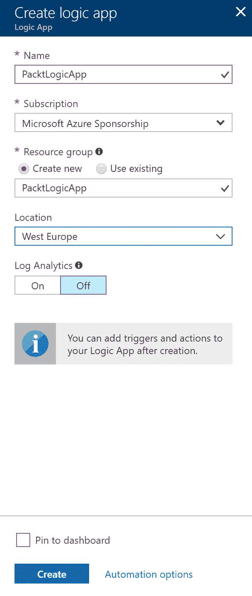

# 实现无服务器和微服务

在上一章中，我们介绍了 Web 应用程序的目标。您了解了 Web 应用程序、App Service 计划、容器、Web API 等内容。现在，您应该知道何时使用这些不同的功能。

本章介绍了无服务器和微服务。它将涵盖无服务器计算及 Azure 在创建无服务器应用程序方面的提供，如 Azure Functions 和 Azure Logic Apps。您将了解如何使用 Azure 容器和 API 管理设计无服务器计算。最后，还将讨论基于微服务的解决方案。您将了解微服务容器及其可用的不同平台。

以下主题将涵盖：

+   使用 Azure Functions 的事件驱动操作

+   使用 Azure Functions 和 Logic Apps 设计应用程序

+   使用 Azure 容器实例设计无服务器计算

+   容器编排及不同的容器编排平台

+   Azure Service Fabric

+   API 管理

+   云原生部署与资产迁移

# 技术要求

本章使用以下工具进行示例演示：

+   Azure PowerShell：[`docs.microsoft.com/en-us/powershell/azure/install-azurerm-ps?view=azurermps-5.1.1`](https://docs.microsoft.com/en-us/powershell/azure/install-azurerm-ps?view=azurermps-5.1.1)

本章的源代码可以从这里下载：

+   [`github.com/SjoukjeZaal/AzureArchitectureBook/tree/master/Chapter%204`](https://github.com/SjoukjeZaal/AzureArchitectureBook/tree/master/Chapter%204)

# 使用 Azure Functions 的事件驱动操作

Azure Functions 是一个无服务器计算服务，使您能够创建事件驱动的操作和触发器，而无需配置或管理自己的基础设施。在 Azure Functions 中，您可以运行响应 Azure、第三方服务或本地系统事件的脚本或自定义代码。您可以构建基于 HTTP 的 API 端点（称为 HTTP 触发器），这些端点可以被各种应用程序、移动设备和物联网设备访问。您还可以创建 **定时触发器**，根据计划运行。使用 Azure Functions，您只需为实际消耗的资源付费。

Functions 使用 Azure 存储账户来存储代码和配置绑定。它使用标准的 Azure Storage，提供 Blob、表格和队列存储，用于存储文件和触发器。您可以为函数使用与 Web 应用程序和 API 相同的 App Service 计划。Azure Functions 还可以部署在 **应用服务环境**（**ASEs**）中。

有关 Azure Functions 及其支持的事件和触发器的更多信息，您可以参考以下网站：[`docs.microsoft.com/en-us/azure/azure-functions/functions-overview`](https://docs.microsoft.com/en-us/azure/azure-functions/functions-overview)。

有关不同应用服务计划和 ASE 的更多信息，请参阅第三章，*设计 Web 应用程序*。

Azure Functions 可以从 Azure 门户和 Visual Studio 2017 创建，并可以使用多种编程语言创建，例如 C#、F#、Node.js、Java、PHP、Batch、PowerShell、JavaScript、Python 和 TypeScript。它们还可以使用 ARM 模板创建。它们可以部署在 Windows 或 Linux 上，并且可以使用持续部署。在编写本书时，它支持 Bitbucket、Dropbox、外部存储库（Git 或 Mercurial）、本地 Git 存储库、GitHub、OneDrive 和 Visual Studio Team Services 作为部署源。可以从 Azure 门户配置持续部署。


Azure Functions 的持续部署

Visual Studio 中的 Azure Functions 工具自 15.3 版本发布以来已包含在内。如果要使用 Visual Studio 2017 创建它们，请将 Visual Studio 更新至至少 15.3 版本或更高版本。

# 消耗应用服务计划

对于 Azure Functions，Microsoft 引入了一种新的托管计划，其中您与其他客户的函数共享一组实例。此计划称为**消耗计划**。与其他可用的应用服务计划相比，此计划更具成本效益，因为它会根据工作负载自动缩减和扩展。当您的函数未运行时，您不需要支付任何费用；当函数运行时，实例会根据传入事件的数量动态添加和删除。在消耗计划上托管的函数最长可以运行 10 分钟（默认超时为 5 分钟，但可以增加到 10 分钟）。Azure Function 代码和绑定配置存储在单独的存储帐户 Azure File Storage 上。

当你需要让你的函数持续运行，或者让它与其他函数在同一个应用服务计划中运行，或者需要更多的 CPU 功率，或者你想在 Linux 上托管你的函数时，最好为你的函数使用专用的应用服务计划。所有其他可用的应用服务计划也可以用于 Azure Functions。

# 使用 Azure Functions 设计应用程序解决方案

在此演示中，我们将从 Azure 门户创建一个 Azure Function。此函数将监听 HTTP 触发器，然后将消息添加到队列中：

1.  打开[`portal.azure.com/`](https://portal.azure.com/)导航到 Azure 门户。

1.  单击“New”，在搜索栏中键入`Function App`，然后单击“Create”按钮。

1.  会打开一个新的面板，你可以在其中填写函数的基本设置。对于托管计划，我们使用队列来存储消息。使用消费计划时，队列存储不是存储帐户的一部分，因为它仅使用 Azure 文件存储来存储函数文件。对于应用服务计划，你可以创建一个新的应用服务计划，或者选择一个现有的计划。你也可以选择一个 ASE。对于存储，默认情况下，会创建一个新的存储帐户。如果你想使用现有存储帐户，也可以选择它。填写以下详细信息并点击创建：


从 Azure 门户创建 Azure 函数

1.  创建后，从 Azure 门户打开函数，在左侧菜单中，选择**函数应用**下的**函数 | 新建函数**：


从 Azure 门户的 Azure Functions 向导

1.  在下一个屏幕上，选择 HTTP 触发器：


选择 HTTP 触发器

1.  下一步是 HTTP 触发器设置。填写以下值。对于授权级别，目前可以选择**匿名**。然而，这仅用于演示目的；对于生产环境的函数不应该选择该选项。点击创建，触发器将被创建：


HTTP 触发器设置

1.  配置队列设置，点击**集成 | 新输出**，然后选择**Azure 队列存储**。点击选择：


配置队列

1.  在**Azure 队列存储**输出中，保持默认设置并点击保存：


配置队列

1.  在左侧菜单中，选择你的函数。代码编辑器将打开。用以下代码替换现有代码：

```
using System.Net;

public static async Task<HttpResponseMessage> Run(HttpRequestMessage req, ICollector<string> outputQueueItem, TraceWriter log)
{
    log.Info("C# HTTP trigger function processed a request.");

    // parse query parameter
    string name = req.GetQueryNameValuePairs()
        .FirstOrDefault(q => string.Compare(q.Key, "name", true) == 0)
        .Value;

    // Get request body
    dynamic data = await req.Content.ReadAsAsync<object>();

    // Set name to query string or body data
    name = name ?? data?.name;

    outputQueueItem.Add("Name passed to the function: " + name); 

    return name == null
        ? req.CreateResponse(HttpStatusCode.BadRequest, "Please pass a name on the query string or in the request body")
        : req.CreateResponse(HttpStatusCode.OK, "Hello " + name);
}
```

1.  上述代码会向队列中添加一条消息，接着你需要点击保存：

1.  要测试代码，点击屏幕右侧的**测试**标签。你可以在 JSON 调用中提供一条消息，并点击保存并运行：


测试函数

1.  默认代码会生成一个输出消息，并显示在输出窗口中。要查看添加到队列的内容，打开 Azure Storage Explorer 并使用凭证连接到你的 Azure 帐户。在左侧树视图中，导航到函数存储帐户并点击队列。可以在那里找到已添加的消息：


在 Azure Storage Explorer 中的队列消息

Azure Storage Explorer 是 Visual Studio 的一部分 Azure 工具。你可以查看来自存储帐户的 Blob、队列和表数据。你还可以通过此直接链接下载 Azure Storage Explorer：[`go.microsoft.com/fwlink/?LinkId=708343&clcid=0x409`](https://go.microsoft.com/fwlink/?LinkId=708343&clcid=0x409)。

# 持久化函数

在编写本书时，Durable Functions 仍处于预览阶段。Durable Functions 是 Azure Functions 和 Azure WebJobs 的扩展，它提供了创建具有状态管理功能、检查点和重启机制的有状态函数的能力。

它引入了一种新的协调器功能，具有一些优势，具体如下：

+   工作流可以通过代码创建；不需要 JSON 架构。

+   它可以同步和异步地调用其他函数。输出可以存储在本地变量中。

+   它保存函数的状态，当虚拟机等待或重启时。

# 使用 Logic Apps 的工作流驱动应用程序

Logic Apps 是 Azure 提供的无服务器服务之一，它与 Azure Functions 有很多重叠。两者都可以用于集成应用程序或服务。两者之间的主要区别在于，Azure Functions 是事件驱动的，而 Logic Apps 更侧重于工作流驱动。你可以使用 Logic Apps 通过 Azure 门户中的可视化设计器来自动化业务流程（开发人员也可以在 Visual Studio 中创建它们），而 Azure Functions 完全由代码编写。然而，你仍然可以在 Logic App 中调用 Azure Functions。

使用 Logic Apps，你可以构建集成多个云服务和本地应用程序的应用程序。这些可以是 Azure 服务、第三方云服务、不同的数据存储和数据库以及 LOB 应用程序。Azure Logic Apps 提供了许多内置的连接器，你可以在工作流中利用这些连接器。此外，你还可以使用 Visual Studio 创建自己的连接器。每个连接器都提供一个 API，可以在 Logic App 中调用。此连接器也添加了身份验证。

你可以参考以下文章，了解所有可用的 Azure Logic Apps 连接器概述：[`docs.microsoft.com/en-us/azure/connectors/apis-list`](https://docs.microsoft.com/en-us/azure/connectors/apis-list)。

除了使用可视化编辑器外，你还可以手动创建和调整工作流定义语言（WDL）架构。此架构使用 JSON 创建，可以在 Visual Studio 中从头开始创建，或者在 Azure 门户中调整。它们都使用代码视图编辑器（Visual Studio 使用与 Azure 门户相同的编辑器）。

一些功能只能直接添加到架构中，不能通过可视化编辑器创建。例如，日期和时间格式化以及字符串连接。Logic App 定义文件可以添加到 ARM 模板中，并通过 PowerShell、CLI 或 REST API 部署。

这是 JSON 后台代码文件的一个示例：

```
{
  "$schema": "https://schema.management.azure.com/providers/Microsoft.Logic/schemas/2016-06-01/workflowdefinition.json#",
  "contentVersion": "1.0.0.0",
  "parameters": {
    "order": {
      "defaultValue": {
        "quantity": 10,
        "id": "mycustomer-id"
      },
      "type": "Object"
    }
  },
  "triggers": {
    "Request": {
      "type": "request",
      "kind": "http"
    }
  },
  "actions": {
    "order": {
      "type": "Http",
      "inputs": {
        "method": "GET",
        "uri": "http://www.packt.com/?id=@{parameters('customer').id}"
      }
    },
    "ifTimingWarning": {
      "type": "If",
      "expression": "@less(actions('customer').startTime,addseconds(utcNow(),-1))",
      "actions": {
        "timingWarning": {
          "type": "Http",
          "inputs": {
            "method": "GET",
            "uri": "http://www.packt.com/?recordLongOrderTime=@{parameters('customer').id}&currentTime=@{utcNow('r')}"
          }
        }
      },
      "runAfter": {
        "order": [
          "Succeeded"
        ]
      }
    }
  },
  "outputs": {}
}
```

# 使用 Logic Apps 设计应用程序解决方案

在这个演示中，我们创建了与之前的 Azure Function 演示相同的功能。我们将消息添加到队列中。通过这种方式，你可以看到事件驱动方法和工作流驱动方法之间的区别。步骤如下：

1.  通过打开[`portal.azure.com/`](https://portal.azure.com/)导航到 Azure 门户。

1.  点击**新建**，并在搜索框中输入`Logic App`。点击**创建**按钮。

1.  一个新的窗格将打开，你可以在其中填写逻辑应用程序的基本设置。添加以下内容并点击**创建**：



Azure 逻辑应用程序设置

1.  当你在 Azure 门户中导航到逻辑应用程序时，设计器将被打开。点击**HTTP 请求触发器**：


Azure 逻辑应用程序设计器

1.  工作流画布将打开。点击顶部动作，**当接收到 HTTP 请求时**，并向其中添加以下 JSON 架构：

```
{
    "type": "object",
    "properties": {
        "name": {
            "type": "string"
        }
    }
}
```


Azure 逻辑应用程序设计器

1.  点击**新建步骤**以添加一个动作。点击**添加动作**，在搜索框中输入`Azure Queue`。选择**Azure 队列 - 将消息放入队列**：


在 Azure 逻辑应用程序设计器中添加动作

1.  给你的连接命名，比如`PacktQueueConnection`。然后，你可以从 Azure 订阅中的不同存储帐户中选择一个。选择同样用于 Azure 函数的存储帐户。点击**创建**。

1.  选择`outqueue`并添加以下消息：`传递给逻辑应用程序的名称:`。然后在冒号后添加名称参数，点击**保存**：


配置消息

1.  转到逻辑应用程序的概览设置页面并将回调 URL 复制到剪贴板：


检索 API 请求 URL

1.  现在打开 Postman，或其他 API 测试工具，并粘贴请求 URL。将与我们在 Azure 函数示例中使用的相同消息添加到 Body 中，然后按回车键：


在 Postman 中创建 POST 请求

1.  再次打开 Azure 存储资源管理器工具，你将在其中看到由逻辑应用程序创建的队列消息：


由逻辑应用程序创建的队列消息

Postman 可以从以下网址下载：[`www.getpostman.com/`](https://www.getpostman.com/)。

# 使用 Azure 容器实例设计无服务器计算

容器是一种广泛接受的开放标准，并且显著改变了应用程序的开发和部署方式。容器是一种应用程序打包和部署机制，它简化了我们开发和部署软件的方式。通过使用容器，我们可以将所有使应用程序运行的不同工件（如配置文件、数据库和 Web API）放入一个隔离的包中，并将其部署到任何地方。这消除了在将软件部署到不同环境（如开发、测试或生产环境）时通常出现的意外故障。而且，不再需要了解这些不同环境的任何信息，例如它使用的操作系统是什么。如果你的应用程序在开发环境中运行，它将在所有环境中运行。由于隔离，容器还解决了运行不同版本的运行时或应用程序之间可能相互干扰的问题。

Azure 提供了**Azure 容器实例**（**ACI**），它提供了一个托管的环境，可以在 Azure 中运行容器，而无需管理虚拟机和底层基础设施。一个 ACI 是一个单独的 Docker 容器，你只需为所消耗的资源付费（每个运行实例按秒计费）。它提供了**基于角色的访问控制**（**RBAC**）来管理实例，你可以在单个容器级别追踪资源使用情况。容器可以部署在 Windows 和 Linux 上。

容器可以通过 PowerShell、CLI 或 Azure 门户来创建。

# 创建容器

容器可以很容易地创建。在这个示例中，容器是通过 CLI 创建的，仅需要几个参数。要创建容器，请从 Azure 门户打开 Azure Cloud Shell，选择`Bash`选项卡，并添加以下代码：

这一步是可选的。如果你想检查并更改默认选择的 Azure 订阅，可以使用此步骤：

```
az account show
az account set -s "Your-Subscription-Name"
```

接下来，创建资源组和容器：

```
az group create --name packtcontainergroup --location "West Europe"
az container create -g packtcontainergroup --name packtcontainer --image library/nginx --ip-address public
```

你也可以使用以下 URL 在 Windows 设备上安装 CLI 2.0：[`azure.microsoft.com/nl-nl/blog/azure-cli-2-0-new-commands-features-available-now-in-azure-cloud-shell/`](https://azure.microsoft.com/nl-nl/blog/azure-cli-2-0-new-commands-features-available-now-in-azure-cloud-shell/)。

# 容器编排

一组容器由容器编排进行管理。编排提供了一个统一的实体，供你管理调度、扩展、健康监控、故障转移、网络和应用程序升级等任务。此外，持续集成和持续部署也在编排级别处理。

ACI 提供了一种分层方法来编排容器。ACI 为您提供了管理单个容器的功能。它可以管理简单应用程序、任务自动化以及孤立容器的构建任务。对于更高级的场景，当您需要完整的容器编排，包括跨多个容器的服务发现、自动扩展和协调的应用升级时，您需要使用编排平台。

编排平台处理管理容器集群的任务。编排平台仅负责多容器架构，不需要担心底层基础设施，因为这些都由 Azure 处理（使用 ACI）。

容器编排提供以下功能和能力：

+   **扩展**：编排者可以添加或删除容器实例。此操作可以手动完成，也可以自动完成。

+   **服务发现**：该功能允许容器相互定位，即使 IP 地址发生变化，或者容器在物理主机之间移动时。

+   **网络**：该功能提供一个网络，供底层容器在多个主机机器之间进行通信。

+   **调度**：调度器将使用容器镜像和资源请求来定位适合运行容器的虚拟机。

+   **健康监控**：该功能监控容器的健康状态，并能自动提供重新调度。

+   **应用升级**：该功能提供协调的容器升级和回滚。

+   **故障切换**：该功能检查机器的当前状态，并将容器从不健康的机器重新调度到健康的机器上。

+   **亲和性/反亲和性**：该功能决定一组容器应该靠近运行，以提高应用性能，或者远离运行，以提高应用的可用性。

Azure 提供对不同编排平台的支持。Azure 支持的平台包括 Azure 容器服务（AKS）、Kubernetes、DC/OS（由 Apache Mesos 提供支持）、Docker Swarm 和 Azure Service Fabric。

# Azure Service Fabric

Azure Service Fabric 是 Microsoft 提供的一个编排平台，用于部署、管理和打包微服务与容器。它类似于 Docker Cloud 和 Kubernetes，而 Service Fabric 完全集成在 Azure 平台中。

三者之间的区别在于，Service Fabric 是唯一一个完全绑定 Azure 平台的编排平台。与 Azure 平台的紧密集成的例子包括 Azure Service Fabric 可以直接使用 API 管理、事件中心（Event Hub）和物联网中心（IoT Hub）作为无状态网关。使用其他提供商时，无状态网关通常是手动构建的。您也可以在 Azure Fabric 中导入 Docker 镜像，但 Docker 容器的编排将完全由 Azure Service Fabric 处理。

Azure Service Fabric 提供了一个轻量级的运行时，用于构建分布式、可扩展、无状态和有状态的微服务，这些微服务可以运行在容器内。使用 Service Fabric，你可以将微服务和容器部署到一组机器的集群中。此外，它还提供了全面的应用管理功能，用于在容器中部署、配置、升级、打补丁、删除和监控应用程序和服务。Service Fabric 量身定制用于创建完整的云原生应用程序，这些应用程序可以从小规模起步，并随着时间的推移扩展到数千台机器。

Service Fabric 也可以在你自己的数据中心内部署，运行在 Windows Server 机器上。在 Azure 上，Service Fabric 可以部署在 Windows、Linux 和 Azure Stack 上。有许多基于 Service Fabric 运行的 Azure PaaS 解决方案或资源，例如 Azure SQL 数据库、Cosmos DB、Intune、IoT Hub、Event Hubs、Skype、Cortana、Power BI 和 Microsoft Dynamics。


Azure Service Fabric 概述

应用程序使用 Service Fabric 编程模型来创建和管理你的服务。有 Service Fabric API 可用于自定义应用程序，以充分利用平台的功能和应用框架。你可以部署不使用 Service Fabric API 的来宾可执行文件，它们可以利用底层平台的能力。来宾可执行文件被视为无状态服务，并在集群中的不同节点之间进行部署。它们可以从亲和性、反亲和性和故障转移、应用生命周期管理、发现能力等方面获益。

Service Fabric 支持两种不同的编程模型，可以用于在 Visual Studio 2017 中构建可扩展和有状态的服务。它们分别是称为可靠服务（Reliable Services）和可靠演员（Reliable Actor）编程模型。通过在代码中利用这些模型，Azure 可以保证服务在 Azure Service Fabric 内是一致的、可扩展的、可靠的并且可用的。Service Fabric 还与 ASP.NET Core 集成，因此你可以编写无状态和有状态的 ASP.NET Core 应用程序，利用这些可靠的集合和 Service Fabric 的编排能力。

关于 Azure Service Fabric 可用的编程模型的更多信息，可以参考 Microsoft 文档：[`docs.microsoft.com/en-us/azure/service-fabric/service-fabric-reliable-services-introduction`](https://docs.microsoft.com/en-us/azure/service-fabric/service-fabric-reliable-services-introduction)。关于可靠演员编程模型的更多信息，可以参考：[`docs.microsoft.com/en-us/azure/service-fabric/service-fabric-reliable-actors-introduction`](https://docs.microsoft.com/en-us/azure/service-fabric/service-fabric-reliable-actors-introduction)。

# 生命周期管理

使用 Azure Service Fabric，您可以管理微服务应用程序的整个生命周期。它支持从开发微服务到部署、管理和维护的所有不同任务。为了实现这一目标，Azure Service Fabric 提供了可以独立操作的不同角色。这些不同的角色如下：

+   **服务开发者**：开发可以在不同应用程序中使用的通用微服务。开发者使用可靠服务和可靠 Actor 编程模型来创建微服务。

+   **应用程序开发者**：使用服务开发者开发的各种服务创建应用程序。应用程序开发者创建应用程序清单。

+   **应用程序管理员**：创建应用程序配置文件并创建部署包。管理员使用 PowerShell 创建应用程序包。

+   **运维人员**：部署应用程序，在部署后监控应用程序的健康状态和性能，并维护物理基础设施。运维人员使用 PowerShell、CLI 或 REST API 部署应用程序。

有关 Service Fabric 应用程序生命周期功能的更多信息，请参阅以下文章：[`docs.microsoft.com/en-us/azure/service-fabric/service-fabric-application-lifecycle`](https://docs.microsoft.com/en-us/azure/service-fabric/service-fabric-application-lifecycle)。

# API 管理

API 管理是一个 Azure 服务，可以用来将不同类型的应用程序作为 API 暴露到外部。您可以导入自定义 API 或无服务器应用程序，如 Azure Functions、Web API、Logic Apps 或 Service Fabric 应用程序。

您还可以将 API 管理用于您的内部组织，并将其作为所有开发人员可以用来组合他们的应用程序或服务的服务库。

API 管理提供 API 网关、管理门户和开发者门户，以下部分将详细介绍这些内容。

# API 网关

API 网关充当您的应用程序与外部世界之间的桥梁。这个应用程序可以是自定义 API，也可以是任何其他后端应用程序。API 网关接受 API 调用并将其路由到后端。它提供额外的功能，如通过添加策略和身份验证方法增强安全性。它可以验证 API 密钥、JWT 令牌、证书等。您可以在不使用代码修改的情况下创建转换，并强制执行使用配额和速率限制。它还支持缓存和限流，并可以记录调用元数据以供分析使用。

# API 管理门户

API 管理门户是你定义和导入自定义 API 的地方。你也可以在这里将你的 API 打包成 **产品**。在 API 管理中，API 被作为产品向开发者公开，可以配置标题、描述和使用条款。产品可以是 **开放的** 或 **受保护的**。对于受保护的 API，开发者需要订阅。开放 API 可以在没有订阅的情况下使用。

API 管理使用 **组** 来管理产品在开发者中的可见性。有三种不同类型的组：

+   **管理员**：管理员可以创建 API、操作和产品，供开发者使用，并管理 API 管理服务实例。

+   **开发者**：开发者是使用你的 API 构建应用程序的用户。开发者门户的用户属于这一群体。他们可以获得访问开发者门户的权限，并在他们的自定义应用中使用这些 API。

+   **访客**：访客用户仅被授予对开发者门户的只读访问权限。他们可能是未来的客户或开发者，或者仅需查看不同产品的用户。

在 API 管理门户中，你可以设置策略，如访问限制策略和转换策略。你可以通过分析获取洞察，并创建 API 的不同版本。

# 开发者门户

API 管理还提供开发者门户，开发者可以从中访问你的 API 并阅读 API 文档。它提供一个控制台，开发者可以在其中测试 API。开发者还可以从那里订阅不同的产品。未来的客户可以访问门户，查看包含操作的产品，并注册订阅。开发者也可以从中获取关于他们使用情况的洞察。

开发者门户的外观和风格可以自定义。你可以向门户添加自定义内容、样式以及公司的品牌标识。

# 云原生部署与资产迁移

大多数组织迁移到云端是为了降低成本并加速应用程序的开发过程。将应用程序迁移到 Azure，你可以使用几种策略。选择哪种策略取决于应用程序的类型以及组织的优先事项和需求。

组织正在迁移到云端，以降低成本并加速应用程序的开发过程。你可以使用几种策略将应用程序迁移到云端。使用哪种策略取决于应用程序的类型以及组织的需求和优先级。并非所有应用程序都值得投入资金迁移到 PaaS 模式或开发云原生应用。对于现代应用，你可以选择迁移到云优化或云原生应用，但对于现有或遗留资产应用，关键是要尽量节省时间和成本（无需重新架构或修改代码），同时将它们迁移到云端，以实现其中的显著利益。

有三个不同的迁移级别可以选择：

+   **云基础设施准备就绪**：在这种方法中，你只需将当前的应用程序迁移并将其托管在 Azure 虚拟机中。此方法无需对代码进行更改。

+   **云 DevOps 准备就绪**：使用这种方法，你将使用容器来开发和部署应用程序。这将应用程序与基础设施层解耦，从而减少由应用程序依赖性引起的故障。你还可以在编排层面上利用持续开发和集成，这使得部署过程更加快速。

+   **云优化**：此迁移方法旨在现代化你的关键业务应用程序。这种现代化通常需要你为云环境重新架构应用程序。需要编写新的代码，你可以创建云原生应用程序并利用微服务架构。

# 总结

本章内容涵盖了无服务器和微服务。我们讲解了 Azure Function、Azure Logic Apps 以及它们之间的主要区别。我们还介绍了 Azure 容器服务和容器编排。我们解释了什么是 Azure Service Fabric 以及什么是 API 管理。接下来，我们讨论了何时选择将资产迁移到云端，何时选择云原生部署模型。

本章结束了设计计算基础设施目标，下一章将开始设计网络实施目标，从强大的网络实施开始。

# 问题

请回答以下问题，以测试你对本章信息的理解。你可以在本书末尾的*评估*部分找到答案。

1.  你能否将 API 管理用作托管在 Azure Service Fabric 上的微服务的无状态网关？

    1.  是

    1.  不

1.  你能否将 Kubernetes 容器部署到 Azure 容器实例中？

    1.  是

    1.  不

1.  Azure Service Fabric 是否适合 DevOps 环境？

    1.  是

    1.  不

# 进一步阅读

你可以查看以下链接，获取更多关于本章中涉及的主题的信息：

+   **介绍 Azure Functions**：[`azure.microsoft.com/nl-nl/blog/introducing-azure-functions/`](https://azure.microsoft.com/nl-nl/blog/introducing-azure-functions/)

+   **Azure Functions 文档**：[`docs.microsoft.com/en-us/azure/azure-functions/`](https://docs.microsoft.com/en-us/azure/azure-functions/)

+   **Durable Functions 概述**：[`docs.microsoft.com/en-us/azure/azure-functions/durable-functions-overview`](https://docs.microsoft.com/en-us/azure/azure-functions/durable-functions-overview)

+   **Azure Logic Apps 文档**：[`docs.microsoft.com/en-us/azure/logic-apps/`](https://docs.microsoft.com/en-us/azure/logic-apps/)

+   **API 管理文档**：[`docs.microsoft.com/en-us/azure/api-management/`](https://docs.microsoft.com/en-us/azure/api-management/)

+   **Azure 容器实例文档**: [`docs.microsoft.com/en-us/azure/container-instances/`](https://docs.microsoft.com/en-us/azure/container-instances/)

+   **Azure 容器实例与容器协调器**: [`docs.microsoft.com/en-us/azure/container-instances/container-instances-orchestrator-relationship`](https://docs.microsoft.com/en-us/azure/container-instances/container-instances-orchestrator-relationship)

+   **Azure 服务结构文档**: [`docs.microsoft.com/en-us/azure/service-fabric/`](https://docs.microsoft.com/en-us/azure/service-fabric/)
