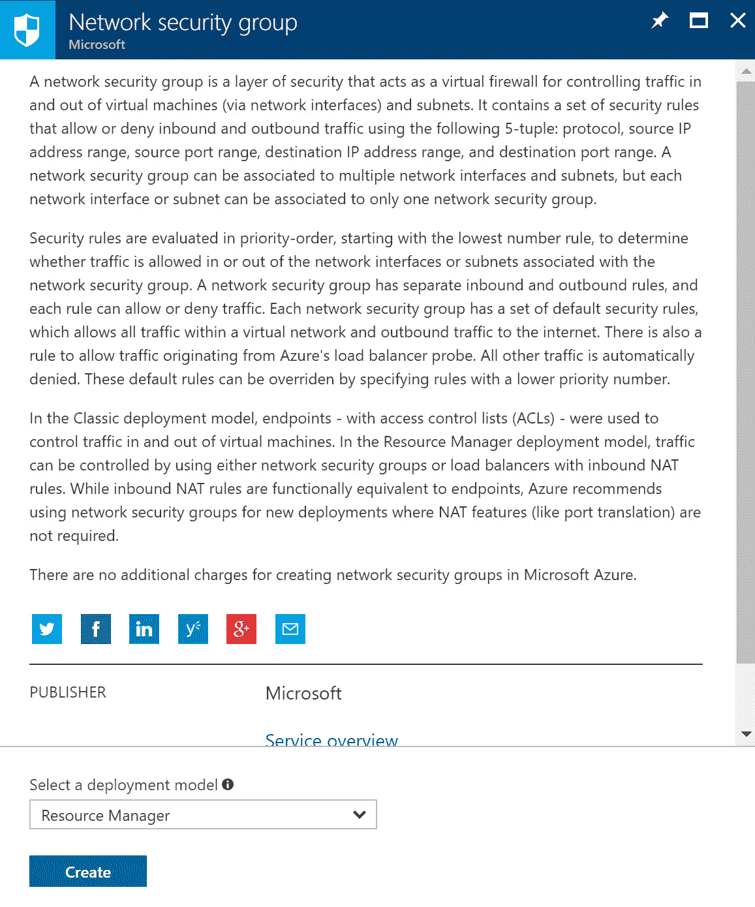
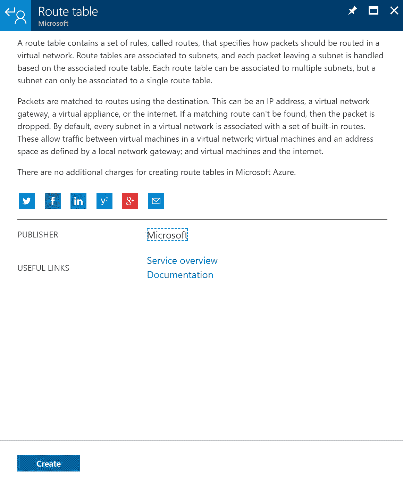

# 第五章：强大的网络实施

在上一章中，我们介绍了无服务器和微服务的目标。我们讨论了如何设计无服务器计算以及 Azure 提供的创建这些服务的功能。我们还介绍了基于微服务的解决方案，以及不同的 Azure 功能之间的差异及其适用场景。

本章介绍了网络目标。它从如何设计 Azure 虚拟网络开始，包括使用 Azure 网络服务设计的解决方案，例如使用 Azure 负载均衡器和 Azure 流量管理器的负载均衡设计，定义 DNS、DHCP 和 IP 策略，确定何时使用 Azure 应用程序网关，以及何时使用多节点应用程序网关、流量管理器和负载均衡器。

接下来，本章介绍如何为 Azure 虚拟网络设计外部连接。你将学习如何确定何时使用 Azure VPN、ExpressRoute、虚拟网络对等架构，何时使用**用户定义路由**（**UDRs**），以及何时使用 VPN 网关站点对站点故障切换功能来支持 ExpressRoute。

最后，本章介绍如何通过确定何时使用网络虚拟设备、如何设计边界网络（DMZ）以及确定何时使用**Web 应用程序防火墙**（**WAF**）、**网络安全组**（**NSG**）和虚拟网络服务隧道来设计安全策略。

本章将涵盖以下主题：

+   设计 Azure 虚拟网络

+   何时使用 Azure 应用程序网关

+   何时使用多节点应用程序网关、Azure 流量管理器和负载均衡器

+   设计 Azure 虚拟网络的外部连接

+   设计安全策略

# 技术要求

本章使用以下工具进行示例：

+   Azure PowerShell: [`docs.microsoft.com/en-us/powershell/azure/install-azurerm-ps?view=azurermps-5.1.1`](https://docs.microsoft.com/en-us/powershell/azure/install-azurerm-ps?view=azurermps-5.1.1)

本章的源代码可以在此下载：

+   [`github.com/SjoukjeZaal/AzureArchitectureBook/tree/master/Chapter%205`](https://github.com/SjoukjeZaal/AzureArchitectureBook/tree/master/Chapter%205)

# Azure 虚拟网络

**Azure 虚拟网络**（**VNet**）是传统网络的虚拟化表示，托管在云中。它完全基于软件，与传统网络使用电缆、路由器等设备不同。虚拟网络提供安全的隔离环境，并将 Azure 资源相互连接。默认情况下，不同的资源不能从虚拟网络外部访问。然而，你可以将多个虚拟网络互连，或将虚拟网络连接到本地网络。所有连接在同一虚拟网络中的 Azure 资源必须位于同一区域和订阅下。

当你创建虚拟网络时，一个子网会自动创建。你可以在同一个虚拟网络内创建多个子网（每个虚拟网络最多允许 1000 个子网）。将多个虚拟网络连接在一起称为 **虚拟网络对等连接**。每个 Azure 订阅最多允许 10 个对等连接。

在 Azure 中，最小的子网是 /29 子网，包含 8 个地址，最大的子网是 /8，包含 1600 万个地址。

如需了解更多关于子网划分的信息，你可以参考子网掩码备忘单：[`www.aelius.com/njh/subnet_sheet.html`](https://www.aelius.com/njh/subnet_sheet.html)。

# IP 地址

Azure 中的虚拟网络可以拥有私有和公共 IP 地址。私有 IP 地址只能在虚拟网络内访问，而公共 IP 地址可以从互联网访问。你可以通过 VPN 网关或 ExpressRoute 连接访问私有 IP 地址。私有和公共 IP 地址都可以是静态或动态的，但当你创建新的虚拟网络时，IP 地址默认是静态的。你可以通过 Azure 门户、PowerShell 和 CLI 将 IP 地址更改为静态。


Azure 门户中的动态和静态 IP 地址配置

+   **动态**：动态 IP 地址由 Azure 自动分配，并从虚拟网络中配置的子网地址范围内选择。IP 地址在 Azure 资源创建或启动时分配给该资源。当资源停止并释放时（例如你从 Azure 门户停止虚拟机时，虚拟机会自动释放），该 IP 地址将被 Azure 添加回子网的可用地址池中。

+   **静态**：静态 IP 地址（包括私有和公共）是预先分配的，并且在你删除分配之前会保持不变。你可以手动选择静态私有 IP 地址。它们只能分配给非互联网连接，比如内部负载均衡器。你还可以将私有 IP 地址分配给与你本地网络的连接或 ExpressRoute 电路。公共静态 IP 地址由 Azure 自动创建，并可以分配给面向互联网的连接，例如外部负载均衡器。

# 公共 IP 地址

公共 IP 地址可以用于 Azure 服务之间的内部通信以及通过互联网进行的外部通信。你可以使用 IPv4 和 IPv6 作为公共 IP 地址，但对 IPv6 的支持有限。写作时，你只能将 IPv6 地址分配给外部负载均衡器。

Azure 在 Azure 资源启动或创建时，会将公共 IP 地址分配给网络接口。当发起外部连接时，Azure 会将私有 IP 地址映射到公共 IP 地址（SNAT）。返回流量也会被允许进入资源。

公共 IP 地址通常用于虚拟机、面向互联网的负载均衡器、VPN 网关和应用程序网关。每个订阅最多可以有 60 个动态公共 IP 地址和 20 个静态公共 IP 地址。前五个静态 IP 地址是免费的，其余的需要付费。

以下文档超出了本书的范围，但绝对值得一读——*理解 Azure 中的出站连接*：[`docs.microsoft.com/en-us/azure/load-balancer/load-balancer-outbound-connections?toc=%2fazure%2fvirtual-network%2ftoc.json`](https://docs.microsoft.com/en-us/azure/load-balancer/load-balancer-outbound-connections?toc=%2fazure%2fvirtual-network%2ftoc.json)。

# 私有 IP 地址

私有 IP 地址支持 IPv4 和 IPv6，但对 IPv6 的支持也有限。它们只能动态分配，并且 IPv6 地址在 VNet 内部无法相互通信。唯一使用 IPv6 地址的方法是将其分配给面向互联网的负载均衡器，其中前端 IP 地址是 IPv4 地址，后端是 IPv6 地址。

私有 IP 地址通常用于虚拟机、内部负载均衡器和应用程序网关。VPN 无法拥有私有 IP 地址，因为它总是面向互联网。每个 VNet 最多可以拥有 4096 个私有 IP 地址。然而，你可以创建多个 VNet（每个订阅最多 50 个）。

这些限制基于以下页面的默认限制：[`docs.microsoft.com/en-us/azure/azure-subscription-service-limits?toc=%2fazure%2fvirtual-network%2ftoc.json#networking-limits`](https://docs.microsoft.com/en-us/azure/azure-subscription-service-limits?toc=%2fazure%2fvirtual-network%2ftoc.json#networking-limits)。你可以提交支持请求来提高这些限制。根据限制表的描述，限制不能超过最大限制。

# 创建公共 IP 地址

在以下示例中，我们将使用 PowerShell 创建一个静态公共 IP 地址：

1.  通过打开 [`portal.azure.com/`](https://portal.azure.com/) 进入 Azure 门户。

1.  打开 Azure Cloud Shell，并确保选择了 PowerShell。

1.  添加以下命令：

如果需要，选择正确的订阅：

```
Select-AzureRmSubscription -SubscriptionId "********-****-****-****-***********"
```

创建 IP 地址：

```
New-AzureRmPublicIpAddress -Name PublicPacktIP -ResourceGroupName PacktPub -AllocationMethod Static -Location "West Europe"
```

1.  这是创建静态 IP 地址的最简单方法。然而，你仍然需要将它分配给一个 Azure 资源。此时它只是刚刚创建。为了本示例，我使用了一个现有的资源组。如果你没有资源组，需要在创建 IP 地址之前先创建一个资源组。

# DNS

除了 IP 地址，虚拟机还可以通过使用主机名或 **完全限定域名**（**FQDN**）来访问。你可以为此在公共 IP 地址上配置 DNS 标签。对于所有托管在同一 VNet 内的 Azure 服务，可以使用 Azure 内部 DNS 进行名称解析。如果你想在多个 VNet 中使用 DNS，则必须设置自己的 DNS 服务器。例如，如果你添加 DNS 标签 `packtuniquedns`，FQDN 将变为 packtuniquedns.westeurope.cloudapp.azure.com。此 FQDN 将映射到 Azure 资源的公共 IP 地址。


内置 DNS 名称解析

你也可以通过添加 CNAME 记录将 DNS 指向 Azure 资源。因此，你可以使用 Azure DNS 为资源分配自定义主机名，而不是使用默认的 DNS 后缀。如果你希望通过主机名访问 Azure 资源且没有 `www` 前缀，你需要添加 A 记录。CNAME 仅适用于带有 `www` 前缀的情况。

有关此方面的更多信息，你可以参考以下文章——*在 Azure 门户为 Linux 虚拟机创建完全限定的域名*：[`docs.microsoft.com/en-us/azure/virtual-machines/linux/portal-create-fqdn`](https://docs.microsoft.com/en-us/azure/virtual-machines/linux/portal-create-fqdn) 和 *使用 Azure DNS 为 Azure 服务提供自定义域名设置*：[`docs.microsoft.com/en-us/azure/dns/dns-custom-domain?toc=%2fazure%2fvirtual-network%2ftoc.json#public-ip-address`](https://docs.microsoft.com/en-us/azure/dns/dns-custom-domain?toc=%2fazure%2fvirtual-network%2ftoc.json#public-ip-address)。

# 创建带有两个子网的 VNet

在本示例中，我们将从 Azure 门户创建一个带有两个子网的 VNet。你也可以使用 PowerShell、CLI 或 ARM 模板。我们将根据以下示意图创建 VNet 和子网：


带有两个子网的 VNet

按照以下步骤创建 VNet：

1.  通过打开 [`portal.azure.com/`](https://portal.azure.com/) 访问 Azure 门户。

1.  点击“新建”，在搜索框中输入`virtual network`以创建一个新的虚拟网络：


创建新的虚拟网络

1.  将打开一个新的面板，你可以在其中填写设置。添加以下值：


VNet 和子网设置

1.  点击“创建”。在从 Azure 门户创建 VNet 时，你只能创建一个子网。因此，第二个子网需要在创建 VNet 后添加。

1.  进入 VNet 设置，从左侧菜单选择“子网”，然后点击顶部菜单中的“+ 子网”，如下图所示：


添加第二个子网

1.  将打开一个新的面板。输入以下值并点击“确定”：


第二个子网设置

# Azure 负载均衡器

Azure 负载均衡器是一种可以用于虚拟机、容器和应用的负载均衡器。它在传输层（OSI 网络参考模型中的第四层）工作，通过在同一 Azure 数据中心内分发网络流量。它提供外部负载均衡器和内部负载均衡器。

外部负载均衡器提供一个带有公共 IP 地址的单一端点，所有客户端应用和服务都会调用此端点，然后将传入流量分发到多个健康的虚拟机、容器或应用上，以提供扩展、高可用性和性能。内部负载均衡器与外部负载均衡器具有相同的功能，但它使用私有 IP 地址。


外部和内部负载均衡器

Azure 负载均衡器有两个版本：

+   **基本版**：基本版负载均衡器是免费的。它可以配置为面向互联网的负载均衡器、内部负载均衡器，并可以将流量转发到特定的虚拟机。对于面向互联网的负载均衡器，公共 IP 地址通过负载均衡器映射到私有 IP 地址。当流量进入时，Azure 使用内部 IP 地址将流量分配到 Azure 资源。

    它提供基于哈希的分发、端口转发、在扩展或缩减时的自动重新配置、服务监控和源 NAT。

+   **标准版**：在撰写本文时，标准版负载均衡器仍处于预览阶段。除了基本负载均衡器提供的所有功能外，标准版还提供了企业级扩展。您可以使用独立虚拟机或最多 1000 个虚拟机实例来使用标准版负载均衡器。它还提供了公共和内部负载均衡器配置的诊断信息，通过使用 HA 端口提供高可靠性，并为每个端口提供规则。您可以使用 NSG（稍后将在本章中讨论）和可用性区域。

欲了解有关标准版负载均衡器的更多信息，您可以参考以下文章：[`docs.microsoft.com/en-us/azure/load-balancer/load-balancer-standard-overview`](https://docs.microsoft.com/en-us/azure/load-balancer/load-balancer-standard-overview)。

# 探针

Azure 负载均衡器使用探针来定义利用负载均衡器的服务器和服务的健康状况。探针有两种不同的类型：HTTP 探针和 TCP 探针。

对于云服务（如虚拟机、Web 应用、API 等），它使用**来宾代理探针**。在这种情况下，您的虚拟机上安装了一个来宾代理，该代理会返回一个 HTTP 200 OK 响应。负载均衡器每 15 秒向云服务发送一条消息，来宾代理会做出响应。您还可以创建一个自定义的 HTTP 探针，使用您自己的逻辑覆盖默认来宾代理的逻辑。TCP 探针通过三次握手建立连接。

启用健康日志记录后，数据会存储在 Azure 存储帐户中。您可以通过使用不同的 Azure 工具（如 PowerShell 或 CLI、REST API 或 Azure 门户）来查看这些日志数据。您还可以使用 Power BI 来可视化和分析数据，通过 *Azure 审计日志内容包 for Power BI* 提供的预定义仪表板。

如需更多信息并下载 Power BI 的 Azure 审计日志内容包，您可以参考 [`docs.microsoft.com/en-us/power-bi/service-connect-to-azure-audit-logs`](https://docs.microsoft.com/en-us/power-bi/service-connect-to-azure-audit-logs)。

# Azure Traffic Manager

Azure Traffic Manager 将工作负载分散到全球多个地区和数据中心。它将处理负载并在 DNS 层面定位最接近的地理区域或最合适的区域。客户端发出 DNS 请求，Azure Traffic Manager 会根据 DNS 的位置确定最近的 Azure 区域，并通过 DNS 响应将该位置返回给客户端。然后，客户端直接调用该位置，Azure Traffic Manager 不再干预。Traffic Manager 还会监控端点，因此，如果某个地区发生故障，Traffic Manager 会返回另一个健康区域的端点。

这与 Azure 负载均衡器不同，后者客户端调用负载均衡器的 IP 地址，负载均衡器将流量分发到多个云服务上，如虚拟机、容器或 Web 应用。此外，Azure 负载均衡器将流量分发到同一地区和数据中心中的多个实例，而 Traffic Manager 可以跨多个地区和数据中心进行流量分发。

您可以在高可用且高性能的架构中同时使用 Azure 负载均衡器和 Azure Traffic Manager，如下图所示：


Azure Traffic Manager

Azure Traffic Manager 也在 第三章，*设计 Web 应用程序* 中的关于 Web 应用的高可用性和性能的部分进行了讨论。那里还描述了 Azure Traffic Manager 提供的不同路由方法。

# Azure 应用程序网关

Azure 应用程序网关提供 **应用交付控制器** (**ADC**)，该控制器在应用层（OSI 网络参考模型中的第七层）上运行。

它提供了 web 负载均衡，因此它在第七层提供负载均衡，仅适用于 HTTP(S)。它还提供了一个 web 应用程序防火墙，可以用于保护您的应用免受常见的基于 web 的攻击，如跨站脚本、SQL 注入和会话劫持（在本章的 *网络安全策略* 部分中有更详细的描述）。它可以解密 HTTPS 流量，因此您可以将 SSL 证书安装在应用程序网关上，而不是安装在不同的 web 服务器上。这样，web 服务器就不必处理这些问题，管理也会更容易，因为所有内容都集中在一个地方。然后，应用程序网关将在响应发送回客户端之前对其进行加密。它还可以提供基于 URL 的内容路由，因此流量可以路由到特定的后端。例如，可以直接调用托管在专用后端上的 CDN，这样可以减少不必要的路由。它还提供健康监控和高级诊断功能。


Azure 应用程序网关

有关 Azure 应用程序网关及其不同功能的更多信息，请参阅 [`docs.microsoft.com/en-us/azure/traffic-manager/traffic-manager-overview`](https://docs.microsoft.com/en-us/azure/traffic-manager/traffic-manager-overview)。此页面还概述了 Azure 负载均衡器、Azure 流量管理器和 Azure 应用程序网关之间的所有差异。

# Azure 虚拟网络的外部连接

云计算的普及程度日益增加，但在接下来的几年里，大多数组织仍将拥有并维护本地基础设施。事实上，一些组织由于业务需求或某些仍在使用的遗留系统，可能永远不会完全迁移到云端。安全性要求也可能是将部分数据保留在本地的原因。因此，混合环境的需求将永远存在。从网络的角度来看，Azure 提供了多种功能，可以建立从本地基础设施到 Azure 以及反向连接的无缝连接。

# Azure VPN

Azure VPN 提供一个安全的网关，可以用来将您的本地基础设施与 Azure 连接，并通过将加密消息从一个位置发送到另一个位置来连接多个虚拟网络（VNet）。大多数组织使用 VPN 连接来让远程工作人员连接到他们的私有网络。

Azure VPN 提供多种方式来建立安全连接，例如站点到站点 VPN、点对站点 VPN 和 ExpressRoute。它们在以下章节中进行了描述。当为这些连接类型之一设置 Azure 网络网关时，您必须在 Azure 提供的不同 SKU 之间进行选择。Azure VPN 提供以下 SKU：

+   **基础版**: 提供最多 10 个站点到站点 / VNet 到 VNet 隧道，最多支持 128 个点对站点连接。平均带宽为 100 Mbps。

+   **VpnGw1**: 提供最多 30 个站点到站点 / VNet 到 VNet 隧道，最多支持 128 个点对站点连接。平均带宽为 650 Mbps。

+   **VpnGw2**: 提供最多 30 个站点到站点 / VNet 到 VNet 隧道，最多支持 128 个点对站点连接。平均带宽为 1 Gbps。

+   **VpnGw3**: 提供最多 30 个站点到站点 / VNet 到 VNet 隧道，最多支持 128 个点对站点连接。平均带宽为 1.25 Gbps。

您可以设置基于路由或基于策略的 VPN 类型。使用哪种类型取决于您的 VPN 设备的兼容性以及您希望使用的 VPN 连接类型。

基于策略意味着您必须编写自己的路由表条目。这可能适用于小型组织，但大多数组织会选择动态配置。基于策略的路由也有一些限制；您只能使用 IKEv1 设置一个站点到站点 VPN 隧道，且不能设置点对站点隧道。

基于路由意味着路由表条目是动态添加的，您可以使用所有 VPN 连接类型和 IKEv2。

# 站点到站点 VPN

**站点到站点** (**S2S**) VPN 旨在通过互联网在某个位置（例如办公室）与 Azure 之间创建安全连接。然后，您可以使用相同的 VPN 连接从该位置的每台服务器或计算机进行连接。它需要一个兼容的 VPN 设备或 **路由和远程访问服务** (**RRAS**)，并且您的 VPN 设备需要一个公共 IP 地址。可以通过启用远程访问服务器角色在 Windows 服务器上部署 RRAS。

S2S VPN 网关通过 IPsec/IKE（IKEv1 或 IKEv2）VPN 隧道创建连接。**互联网协议安全** (**IPSec**) 是一个用于通过互联网安全连接的开放标准，**互联网密钥交换** (**IKE**) 是与 IPSec 一起使用的密钥管理协议标准。这是一种用于交换加密和身份验证密钥的方法。


站点到站点 VPN 连接

有关兼容的 VPN 设备和支持的 VPN 类型的列表，请参考以下概述：[`docs.microsoft.com/en-us/azure/vpn-gateway/vpn-gateway-about-vpn-devices`](https://docs.microsoft.com/en-us/azure/vpn-gateway/vpn-gateway-about-vpn-devices)。

# VNet 到 VNet VPN

VNet 到 VNet 是一种可以设置的连接类型。在这种情况下，您正在创建多个 Azure VNet 之间的连接。设置这种连接的典型原因可能是为了地理冗余。这种连接类型与 S2S 连接类型相同。

# 点对站点 VPN

**点对站**（**P2S**）VPN 是设计用于通过 IKEv2 或 SSTP 在客户端计算机之间建立安全连接的。连接是通过从客户端计算机启动并使用脚本进行建立的。这些连接适用于远程工作者，他们从不同位置登录私有网络，或者在需要少量客户端连接到 VPN 时使用。

**安全套接字隧道协议**（**SSTP**）是一种通过 SSL/TLS 通道建立连接的 VPN 隧道。通过在端口`443`上使用 SSL/TLS，连接可以通过所有防火墙和代理服务器。

P2S 连接不需要 VPN 设备或客户端计算机的公共 IP 地址。它们可以与 S2S 连接一起使用，或者通过相同的 VPN 网关使用，只要两个连接的要求相同。


点对站 VPN 连接

# ExpressRoute

ExpressRoute 是最先进的 VPN 连接类型。它通过您的内部 WAN 提供从本地基础设施到 Azure 的快速连接，而与 S2S 连接通过互联网不同。通过使用您的 WAN，ExpressRoute 可以提供比 S2S 连接更快的速度、更低的延迟和更高的安全性。每个 ExpressRoute 电路可以提供的最大带宽为 10 GBps。通过 ExpressRoute，您还可以与 Office 365 和 Dynamics 365 设置混合连接。ExpressRoute 还保证连接的正常运行时间 SLA，而 S2S 连接则没有。

ExpressRoute 提供以下连接模型：

+   **任意对任意（IPVPN）**：通过这种类型的连接，您可以使用 IPVPN 提供商将您的 WAN 与 Azure 集成。提供商负责在本地网络和 Azure 之间建立安全连接。WAN 提供商通常提供第三层连接。

+   **点对点以太网**：通过这种类型的连接，您可以通过点对点以太网链路进行连接。点对点提供商通常提供第二层连接。

+   **位于云交换中心**：通过这种类型的连接，您可以通过提供商的以太网交换机订购连接。这些提供商通常提供第二层交叉连接和管理的第三层交叉连接。


ExpressRoute VPN 连接

# 网络安全策略

由于如今的黑客攻击事件频发，强大的网络安全策略至关重要。仅创建一个公共 IP 地址并将您的 Azure 资源暴露在互联网上并不安全，这会让您容易受到攻击。设计您的网络时应考虑安全性，并减少暴露于互联网的内容。您可以使用 Azure 提供的功能来保护您的网络。Azure 提供对不同安全策略的支持，接下来的部分将进行描述。

# DMZ

**非军事区**（**DMZ**）或外围网络是组织内部网络和外部网络之间的物理或逻辑边界。外部网络可以是互联网。其目的是为内部网络增加一层额外的安全保护。你不从内部网络打开任何端口到互联网，而是仅仅开放端口到 DMZ。Azure 提供了多个功能，你可以用来创建 DMZ，例如 **网络安全组**（**NSG**）、防火墙和 **用户定义路由**（**UDR**）。

下图显示了使用前端 VNet 创建的物理 DMZ 示例，VNet 中有两个虚拟机。只有这个 VNet 与互联网连接。


简单的 DMZ 示例

# 网络安全组

NSG 是 Azure 内的一个访问控制列表，你可以在其中添加入站和出站规则。当虚拟机、虚拟网络或其他云服务之间建立连接时，会检查此列表，看看连接是否被允许或拒绝。

NSG 可以应用于一个或多个子网或单个**网络接口**（**NIC**）。这意味着所有与此子网或 NIC 关联的资源将自动应用所有规则。

NSG 规则按优先级顺序处理，较低的数字优先于较高的数字，它们可以应用于入站或出站流量。

# 创建 NSG

按照以下步骤创建 NSG：

1.  通过打开[`portal.azure.com/`](https://portal.azure.com/)来导航到 Azure 门户。

1.  点击“新建”，在搜索栏中输入`Network Security Group`，然后创建一个新的 NSG：



新的 NSG

1.  打开一个新的面板。添加以下设置并点击“创建”：


新的 NSG 设置

1.  一个 NSG 会创建一些默认的入站和出站安全规则。它们是低优先级规则，因为它们的编号较高，因此有很大的空间来添加自定义规则。要添加自定义规则，请点击左侧菜单中的“入站安全规则”：


NSG 默认入站和出站规则

1.  点击“添加”按钮，并添加以下值以创建允许来自端口`80`的流量的规则：


新规则

1.  现在，你可以通过点击左侧菜单中的“网络接口”或“子网”来将此 NSG 与 NIC 或子网关联：


将 NSG 与 NIC 或子网关联

# 用户定义路由（UDR）

当你创建子网时，Azure 会创建系统路由，使子网中的所有资源能够相互通信。你可以通过创建用户定义路由（UDR）来覆盖这些系统路由。通过这种方式，你可以强制流量遵循特定的路由。

例如，假设你有一个由两个子网组成的网络，并且你希望添加一个虚拟机（VM）作为 DMZ，并在其上安装防火墙。你希望流量只能通过防火墙，而不是在这两个子网之间传输。

要创建 UDR 并启用 IP 转发，必须在 Azure 中创建路由表。当此表创建并包含自定义路由时，Azure 会优先选择自定义路由，而不是默认的系统路由。

# 创建用户定义路由

创建 UDR 的步骤如下：

1.  通过打开 [`portal.azure.com/`](https://portal.azure.com/) 进入 Azure 门户。

1.  点击 **New**，在搜索栏中输入 `Routing Table`，然后创建一个新的路由表。



创建一个新的路由表

1.  添加以下值：


路由表设置

1.  创建了一个新的空路由表。要添加自定义路由，点击左侧菜单中的 **Routes**：


空路由表

1.  点击顶部菜单中的 **Add** 按钮，并添加以下值以创建自定义路由。在这个示例中，我们希望所有互联网流量都通过防火墙。因此，添加 `0.0.0.0/0` 作为 **Address prefix**。接下来，选择 **Next hop type** 为 `Virtual appliance`，即防火墙。最后，设置 **Next hop address** 为防火墙的内部 IP 地址：


添加自定义路由

了解如何创建 UDP 和虚拟设备的详细说明，请参考以下教程：[`docs.microsoft.com/en-us/azure/virtual-network/create-user-defined-route-portal`](https://docs.microsoft.com/en-us/azure/virtual-network/create-user-defined-route-portal)。

# 虚拟网络服务隧道

**虚拟网络服务隧道**会强制所有外部流量通过站点到站点的 VPN 隧道。如果没有这个功能，外部流量将直接从 Azure 传输到互联网。这给你提供了审计流量的机会。

强制隧道使用 UDR 定义路由。你现在选择虚拟网络网关，而不是虚拟设备：


虚拟网络服务隧道

了解有关虚拟网络服务隧道的更多信息以及如何使用 PowerShell 创建它的示例，可以参考以下教程：[`docs.microsoft.com/en-us/azure/vpn-gateway/vpn-gateway-forced-tunneling-rm`](https://docs.microsoft.com/en-us/azure/vpn-gateway/vpn-gateway-forced-tunneling-rm)。

# Web 应用防火墙

WAF 是应用程序网关的一部分，它提供防火墙来保护你的 Web 应用免受黑客攻击。它基于 OWASP 核心规则集 3.0。它最多可以保护 20 个应用程序，并通过 Azure Monitor 对你的应用进行监控（未来，监控功能也会添加到 Azure 安全中心）。

OWASP 是一个开放的应用安全标准。如需了解规则集的更多信息，可以参考 OWASP 网站：[`www.owasp.org/index.php/Category:OWASP_ModSecurity_Core_Rule_Set_Project`](https://www.owasp.org/index.php/Category:OWASP_ModSecurity_Core_Rule_Set_Project)。

默认情况下，它保护你的应用免受以下攻击：

+   来自 SQL 注入攻击

+   来自跨站脚本攻击

+   来自命令注入、HTTP 请求走私、HTTP 响应拆分和远程文件包含攻击

+   针对 HTTP 协议违规和异常

+   针对机器人、爬虫和扫描器

+   它能够检测常见的应用配置错误

你还可以添加或自定义规则和规则组，以适应你应用的需求。你可以参考以下教程来自定义规则：[`docs.microsoft.com/en-us/azure/application-gateway/application-gateway-customize-waf-rules-portal`](https://docs.microsoft.com/en-us/azure/application-gateway/application-gateway-customize-waf-rules-portal)。

# 总结

本章内容涵盖了网络目标。我们讨论了如何设计 Azure 虚拟网络，介绍了 IP 地址和 Azure DNS。同时，我们还讨论了何时使用 Azure 应用程序网关、Azure 流量管理器和 Azure 负载均衡器。接着，我们探讨了如何使用不同的 VPN 连接设计 Azure VNet 的外部连接，最后，我们讨论了设计不同的安全策略。

在下一章中，我们将讨论混合应用。

# 问题

回答以下问题以测试你对本章信息的理解。你可以在本书末尾的*评估*部分找到答案：

1.  当你在 Azure 中创建新的路由表时，系统路由表会被删除吗？

    1.  是的

    1.  不是的

1.  NSG 规则是否按照优先级从高到低进行处理？

    1.  是的

    1.  不是的

1.  DMZ 是否包括防火墙？

    1.  是的

    1.  不是的

# 进一步阅读

你可以查看以下链接以获取有关本章所涵盖主题的更多信息：

+   **Azure 虚拟网络**：[`docs.microsoft.com/en-us/azure/virtual-network/virtual-networks-overview`](https://docs.microsoft.com/en-us/azure/virtual-network/virtual-networks-overview)

+   **虚拟网络对等连接**：[`docs.microsoft.com/en-us/azure/virtual-network/virtual-network-peering-overview`](https://docs.microsoft.com/en-us/azure/virtual-network/virtual-network-peering-overview)

+   **Azure 负载均衡器概述**：[`docs.microsoft.com/en-us/azure/load-balancer/load-balancer-overview`](https://docs.microsoft.com/en-us/azure/load-balancer/load-balancer-overview)

+   **流量管理器概述**：[`docs.microsoft.com/en-us/azure/traffic-manager/traffic-manager-overview`](https://docs.microsoft.com/en-us/azure/traffic-manager/traffic-manager-overview)

+   **应用程序网关概述**: [`docs.microsoft.com/en-us/azure/application-gateway/application-gateway-introduction`](https://docs.microsoft.com/en-us/azure/application-gateway/application-gateway-introduction)

+   **关于 VPN 网关**: [`docs.microsoft.com/en-us/azure/vpn-gateway/vpn-gateway-about-vpngateways`](https://docs.microsoft.com/en-us/azure/vpn-gateway/vpn-gateway-about-vpngateways)

+   **ExpressRoute 概述**: [`docs.microsoft.com/en-us/azure/expressroute/expressroute-introduction`](https://docs.microsoft.com/en-us/azure/expressroute/expressroute-introduction)

+   **使用网络安全组过滤网络流量**: [`docs.microsoft.com/en-us/azure/virtual-network/virtual-networks-nsg`](https://docs.microsoft.com/en-us/azure/virtual-network/virtual-networks-nsg)

+   **用户定义路由**: [`docs.microsoft.com/en-us/azure/virtual-network/virtual-networks-udr-overview#custom-routes`](https://docs.microsoft.com/en-us/azure/virtual-network/virtual-networks-udr-overview#custom-routes)

+   **Web 应用防火墙**: [`docs.microsoft.com/en-us/azure/application-gateway/application-gateway-web-application-firewall-overview`](https://docs.microsoft.com/en-us/azure/application-gateway/application-gateway-web-application-firewall-overview)
