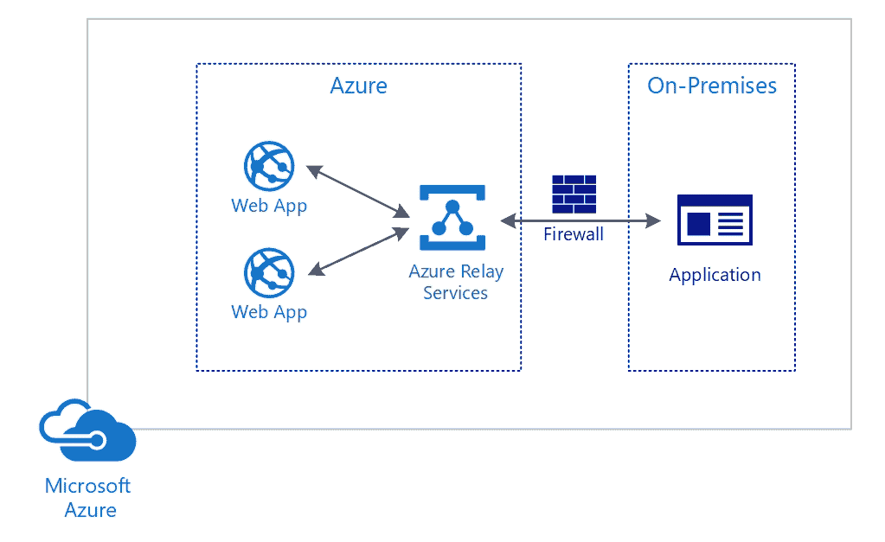
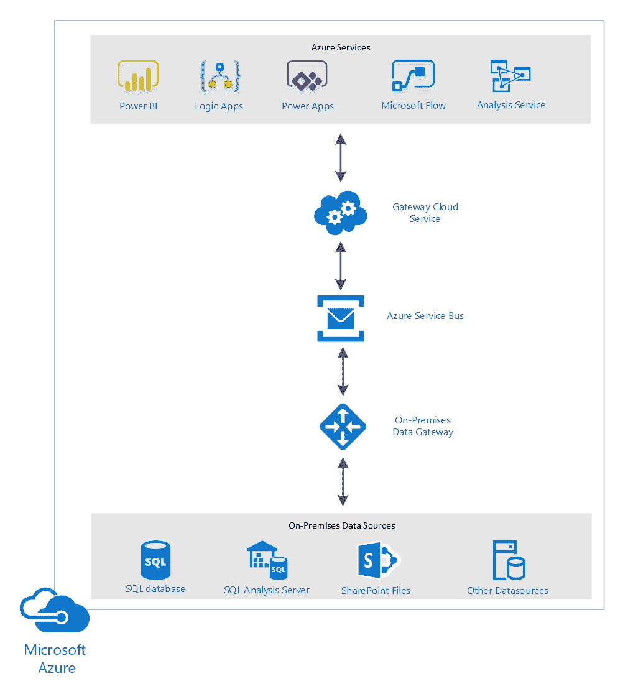
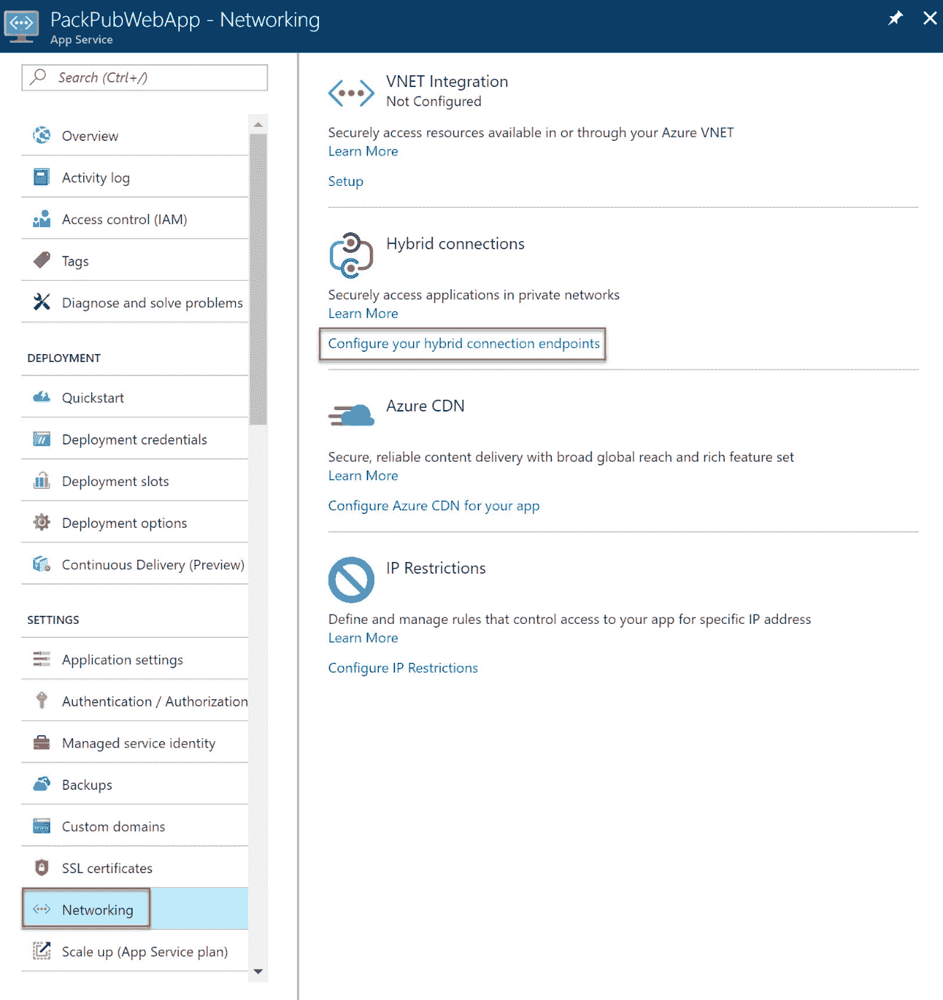
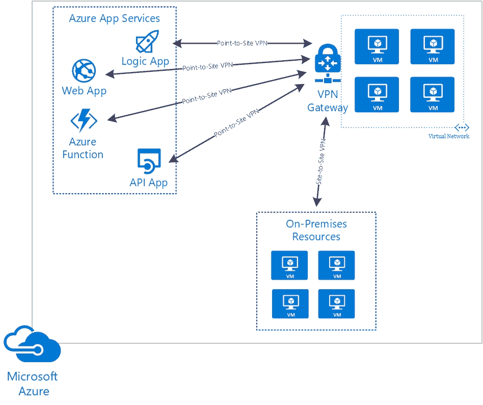
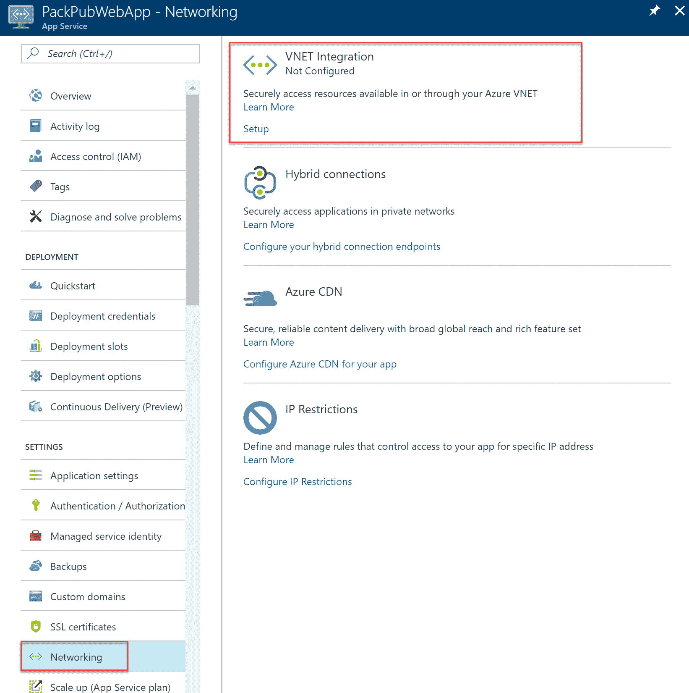
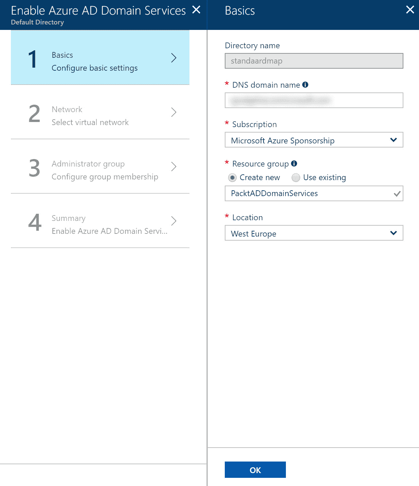
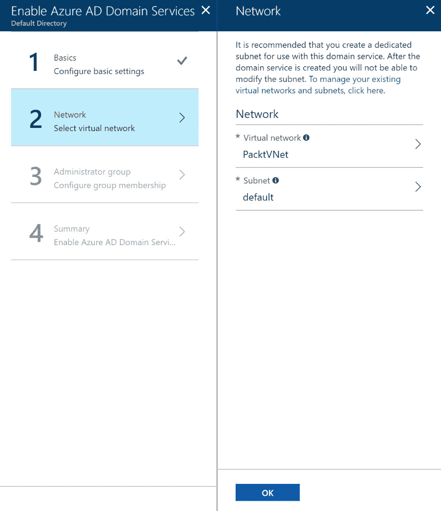
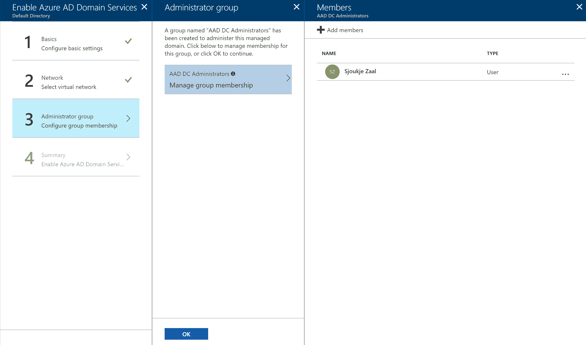
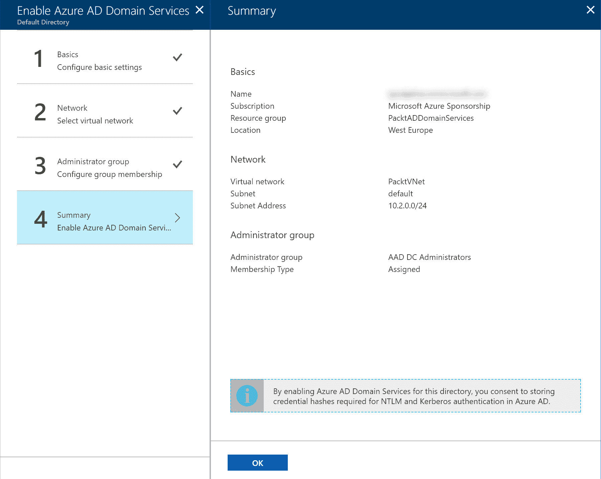
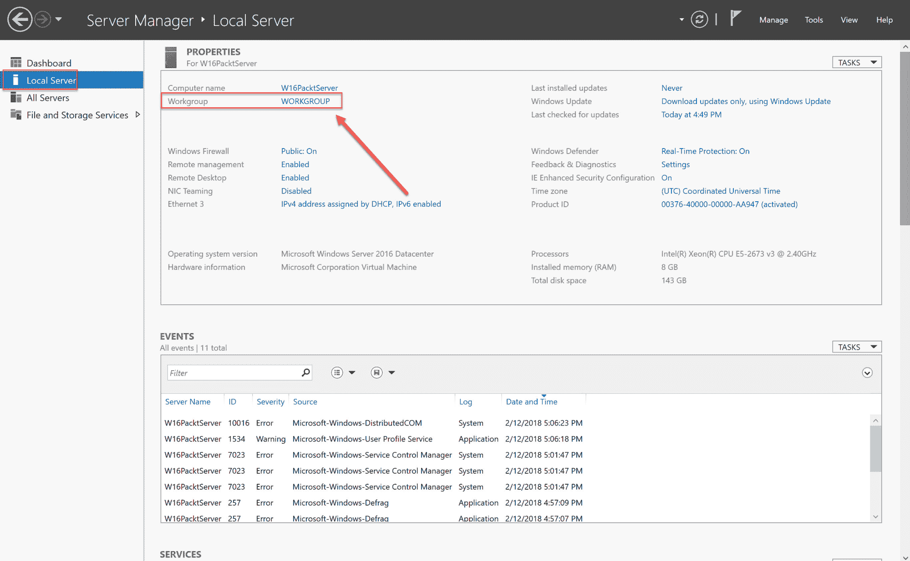

# 连接混合应用程序

在上一章中，我们介绍了网络目标。我们讲解了如何设计 Azure 中的虚拟网络，以及如何设计使用虚拟网络的解决方案。我们还讲解了 Azure VNet 的外部连接性，以及如何设计网络解决方案的安全策略。

本章介绍了为混合应用程序目标设计连接性。它首先讲解了如何使用 Azure 提供的不同服务设计从 Azure 应用程序到本地数据的连接。

以下主题将被覆盖：

+   Azure Relay 服务

+   Azure 数据管理网关用于数据工厂

+   Azure 本地数据网关

+   Azure 应用服务混合连接

+   Azure 应用服务虚拟网络集成

+   Azure AD 应用程序代理

+   将虚拟机加入域

# Azure Relay 服务

使用 Azure Relay 服务，你可以将本地应用程序与 Azure 中的网关连接，而无需打开防火墙连接或对本地网络进行其他重大调整。

你可以在 Azure 门户中创建一个 Azure Relay 服务。在 Azure Relay 服务内部，通过使用出站端口和与本地应用程序的双向连接来创建一个安全连接。此连接专门为一个客户端提供，并使用**传输层安全性**（**TLS**）进行加密。本地应用程序导入 Azure Relay 命名空间，并使用访问密钥进行身份验证，调用 Azure 门户中的 Azure Relay 服务：

Azure Relay 服务

Azure Relay 服务支持点对点流量、单向流量、请求/响应流量、发布/订阅场景和双向套接字通信，以提高点对点效率。

使用 Azure Relay 服务而不是 VPN 创建混合连接的区别在于，Azure Relay 服务可以限定为单台机器上的一个应用程序，而不是为所有类型的连接使用一个连接。

Azure Relay 服务提供两种功能，混合连接和 WCF 中继，它们是不同的实现方式，但都共享相同的网关。

# 混合连接

使用混合连接时，在云中建立了一个会合点。应用程序可以使用 HTTP 和 Web 套接字连接到此点。你可以使用所有支持 Web 套接字的编程语言，如 .NET Core、JavaScript 和 NodeJS，以及多种远程过程模型。

有关 Azure Relay 混合连接协议的更多信息，请参考以下网站：[`docs.microsoft.com/en-us/azure/service-bus-relay/relay-hybrid-connections-protocol`](https://docs.microsoft.com/en-us/azure/service-bus-relay/relay-hybrid-connections-protocol)。

如需了解如何开始使用中继混合连接，您可以参考以下教程：[`docs.microsoft.com/en-us/azure/service-bus-relay/relay-hybrid-connections-dotnet-get-started`](https://docs.microsoft.com/en-us/azure/service-bus-relay/relay-hybrid-connections-dotnet-get-started)。

# WCF 中继

WCF 中继（前身为服务总线中继）使用 .NET 框架和 WCF 建立连接并发送消息。内部应用程序使用 WCF 中继绑定，创建与 Azure 服务总线集成的 WCF 通道。

如需了解如何使用 Azure Relay WCF 中继与 .NET，您可以参考以下文章：[`docs.microsoft.com/en-us/azure/service-bus-relay/relay-wcf-dotnet-get-started`](https://docs.microsoft.com/en-us/azure/service-bus-relay/relay-wcf-dotnet-get-started)。

# Azure 数据管理网关用于数据工厂

Azure 数据工厂提供了一项数据集成服务，您可以使用它创建自动化的数据迁移和转换工作流。通过数据工厂，您可以创建聚合来自不同数据存储的数据、使用 Azure 服务（如 Azure 机器学习、Azure HDInsight Hadoop 和 Azure 数据湖分析）转换和处理数据，并将输出数据存储到不同的数据存储中。

Azure 数据管理网关用于数据工厂充当连接本地环境与云的桥梁。它由一个客户端代理组成，安装在本地系统上，然后连接到 Azure 数据工厂。此代理将您的数据复制到云中。通过在多个本地环境中安装代理并增加可以同时运行的节点数据迁移任务，可以扩展网关。数据通过作业并行处理。

您无需打开防火墙端口即可复制数据。它通过 HTTP 使用证书安全地传输数据。它还提供了从 Azure 数据工厂在 Azure 门户中进行监控和管理的功能。

Azure 数据管理网关用于数据工厂支持多种数据源，具体数据源列表请见：[`docs.microsoft.com/en-us/azure/data-factory/v1/data-factory-data-movement-activities#supported-data-stores-and-formats`](https://docs.microsoft.com/en-us/azure/data-factory/v1/data-factory-data-movement-activities#supported-data-stores-and-formats)。

# Azure 本地数据网关

Azure 本地数据网关充当您的本地数据源与 Azure 之间的桥梁。它可以连接多个 Azure 服务，例如 Azure 分析服务、Azure 逻辑应用、Microsoft Flow、Power Apps 和 Power BI。在本地端，有多个产品可以连接到网关，如 SQL Server、SQL 分析服务、SharePoint 等。

关于支持 Azure 本地数据网关的本地数据源的概述，你可以参考以下网站：[`docs.microsoft.com/en-us/azure/analysis-services/analysis-services-datasource`](https://docs.microsoft.com/en-us/azure/analysis-services/analysis-services-datasource)。

要使用 Azure 本地数据网关，必须在本地环境中安装客户端。该客户端由一个 Windows 服务组成，负责与 Azure 建立连接。在 Azure 中，需要创建一个网关云服务。客户端然后使用 Azure Service Bus 与网关云服务通信。

当某个 Azure 服务创建数据请求时，云网关服务创建一个查询并加密本地凭据。然后，这个查询和凭据被发送到网关中的队列。接着，网关将查询发送到 Azure Service Bus。

本地客户端定期轮询 Azure Service Bus，当 Service Bus 中有消息等待时，它解密本地数据源的凭据，然后运行查询以检索数据。

数据通过再次使用 Azure Service Bus 返回到网关云服务。网关云服务负责在不同的 Azure 服务之间路由数据。

Azure 本地数据网关架构

# Azure App Service 混合连接

Azure App Service 混合连接既是 Azure App Service 的一部分，又是 Azure 中的独立功能。它使用 Azure Relay 服务在 Azure 上托管的应用程序和托管在本地环境中的应用程序之间建立连接。它在云中创建一个应用程序端点，供你的应用程序连接。然后，Azure Relay 服务负责建立连接。

混合连接管理器连接到 Azure Relay 服务，应用程序本身也连接到 Azure Relay 服务。然后，Azure Relay 服务负责建立一个 TCP 隧道，通过该隧道它们可以安全地通信。通过使用 TCP 连接，你不需要在本地服务器上打开防火墙端口。

在 Azure App Service 中，创建一个混合连接以访问本地环境中的应用程序资源。你可以通过 Azure Relay 服务创建混合连接，但最好通过 Azure 中的应用设置来创建连接：

Azure App Service 混合连接设置

# Azure App Service 虚拟网络集成

你可以使用 Azure App Service 虚拟网络集成将应用程序部署到 VNet 内。这样可以使你的应用程序访问部署在同一 VNet 内的其他服务、虚拟机或数据库。

为了从您的应用程序建立到 VNet 的连接，Azure 应用服务 VNet 集成使用带有动态路由网关的点对站点 VPN。通过使用点对站点类型的 VPN 连接，只有一个连接会为托管您的应用程序的虚拟机创建。其他部署在同一应用服务计划中的资源不会连接。当您想要为这些资源也设置连接时，必须为每个驻留在应用服务计划中的资源设置单独的点对站点 VPN 连接。

此点对站点 VPN 连接到 Azure VPN 网关，该网关连接到 VNet。当一个 VNet 通过 Azure VPN 网关和站点对站点 VPN 连接到您的本地网络时，您可以使用该连接将资源与驻留在本地网络中的资源连接。

Azure 应用服务 VNet 集成。

应用 VNet 集成支持通过 UDP 和 TCP 进行通信。您可以使用应用程序的私有 IP 地址进行连接。无需为您的应用程序创建公共 IP 地址。所有部署在同一 VNet 内的服务都可以通过它们的私有 IP 地址访问。

VNet 集成可以用于使用基本版、标准版或隔离版应用服务计划的应用程序。在应用服务计划内，您最多可以创建五个 VNet。但每次只能将您的应用程序分配给一个 VNet。

VNet 集成可以通过 Azure 门户中的“应用设置”下的“网络”选项进行设置：

Azure 应用服务 VNet 集成（通过 Azure 门户）

另一种为您的应用程序提供 VNet 集成的方法是使用**应用服务环境**（**ASE**），该内容在第三章，*设计 Web 应用程序*中有详细描述。ASE 同样部署在 VNet 内部。

使用 VNet 集成时，对于应用程序有一些限制。VNet 集成无法为您的应用程序启用私有站点访问。私有站点访问使得您的应用程序只能从同一虚拟网络内部的资源访问。私有站点访问只能通过配置了**内部负载均衡器**（**ILB**）的应用服务环境来实现。

有关如何创建带有 ILB 的 ASE 的更多信息，您可以参考以下文章：[`docs.microsoft.com/en-us/azure/app-service/environment/create-ilb-ase`](https://docs.microsoft.com/en-us/azure/app-service/environment/create-ilb-ase)。

# Azure AD 应用程序代理

使用 Azure Active Directory 应用程序代理，您可以从云端访问本地 Web 应用程序。它提供 **单一登录**（**SSO**）和安全的远程访问功能。应用程序与 Azure Active Directory 集成，并通过 Azure 门户发布。您无需对本地网络进行任何调整，也无需使用 VPN 连接来为您的应用程序使用 Azure AD 应用程序代理。

可以与 Azure AD 应用程序代理一起使用的应用程序类型包括：Web API、使用集成 Windows 身份验证的 Web 应用程序、使用基于表单或基于头部的访问、与 **Active Directory 身份验证库**（**ADAL**）集成的应用程序，以及托管在远程桌面网关后面的应用程序。

Azure AD 应用程序代理使用两个需要配置的组件：

+   **连接器**：连接器是需要安装在本地网络中的 Windows 服务器上的轻量级代理。它促进了本地应用程序与 Azure 中的应用程序代理服务之间的网络连接。它仅使用出站连接，因此您无需将其安装在 DMZ 中或打开任何入站端口。

+   **外部端点**：外部端点是用户访问 Web 应用程序的方式。可以是直接的 URL，也可以通过 MyApps 门户访问。用户通过 Azure AD 进行身份验证后，会通过连接器将他们引导到本地应用程序。

MyApps 门户可以通过以下 URL 访问：[`myapps.microsoft.com`](https://myapps.microsoft.com)。它提供了一个 Web 门户，所有拥有 Azure AD 账户的用户都可以查看和启动他们被授予访问权限的应用程序。

# 将虚拟机加入域

创建混合应用程序的最后一种方式是通过将 Azure 虚拟机加入到本地域。您可以使用 Azure AD 域服务将已部署应用程序的 Azure 虚拟机与本地域连接。要设置此连接，您无需在 Azure 中安装和管理域控制器。

Azure AD 域服务是可以在您的 Azure 订阅中启用的功能。它创建一个完全与 Azure AD 租户集成的托管域，并在 Azure VNet 内部可用。然后，本地虚拟机和 Azure 虚拟机可以加入此托管域，并使用 Azure AD 的用户名、密码和组成员资格进行登录或身份验证。部署在这些虚拟机中的应用程序也能从中受益。

Azure AD 域服务提供与 Windows Server Active Directory 兼容的组策略、LDAP 和 Kerberos/NTLM 身份验证功能。您可以将此功能用于仅云的 Azure AD 租户和混合型 Azure AD 租户，在这种情况下，本地身份与 Azure 使用 Azure AD Connect 同步。

# 启用 Azure AD 域服务

要在你的 Azure 租户中启用 Azure AD 域服务，可以按照以下步骤操作：

1.  通过打开 [`portal.azure.com/`](https://portal.azure.com/) 进入 Azure 门户。

1.  点击“新建”，在搜索框中输入 `Azure AD 域服务`。

1.  Azure AD 域服务会自动映射到你的 Azure AD 租户，因此在下一个面板中你只需指定资源组和位置，并点击确定：

启用 Azure AD 域服务

1.  在下一个面板中，你可以创建一个新的虚拟网络（VNet）或将 Azure AD 域服务与一个 VNet 关联。请注意，建议为此创建一个单独的子网，然后点击确定：

设置 VNet

1.  系统会自动创建一个名为 AAD DC 管理员的组。你可以在这里将用户添加到该组：

添加管理员

1.  最后一个面板提供了设置的总结。点击确定以创建服务：

总结

# 将虚拟机添加到托管域

接下来是将虚拟机添加到在上一步骤中创建的托管域：

1.  打开早先创建的虚拟机，或者创建一个新的虚拟机。确保虚拟机部署在与 Azure AD 域服务相同的虚拟网络（VNet）中，但在不同的子网中。

1.  启动虚拟机，连接到虚拟机并使用创建虚拟机时提供的凭据登录。

1.  打开服务器管理器 | 本地服务器，并点击 WORKGROUP，如下图所示：

本地服务器设置

1.  添加 Azure AD 域服务的托管域名，并将虚拟机添加到其中。

# 总结

在本章中，我们覆盖了为混合应用程序设计连接的目标。我们介绍了 Azure 提供的不同服务，帮助连接本地应用程序、数据和服务与 Azure。你现在应该知道，在你的解决方案和架构中何时使用这些不同的功能。

下一章将重点介绍 Azure 提供的不同存储解决方案。

# 问题

请回答以下问题，测试你对本章内容的理解。你可以在本书末尾的 *评估* 部分找到答案。

1.  你希望使用 Azure 应用程序 VNet 集成来保护你的应用程序免受外部访问。这能行得通吗？

    1.  是

    1.  不

1.  你希望将本地域与 Azure Active Directory 连接尽可能简单。我们能否在不使用 Azure AD Connect 的情况下使用 Azure AD 域服务？

    1.  是

    1.  不

1.  我们能否将部署在 Azure 应用服务中的应用程序添加到 VNet？

    1.  是

    1.  不

# 进一步阅读

你可以查看以下链接，了解本章涵盖的相关主题：

+   **什么是 Azure 中继？**：[`docs.microsoft.com/en-us/azure/service-bus-relay/relay-what-is-it`](https://docs.microsoft.com/en-us/azure/service-bus-relay/relay-what-is-it)

+   **服务总线中继文档**: [`docs.microsoft.com/zh-cn/azure/service-bus-relay/`](https://docs.microsoft.com/zh-cn/azure/service-bus-relay/)

+   **数据管理网关**: [`docs.microsoft.com/zh-cn/azure/data-factory/v1/data-factory-data-management-gateway`](https://docs.microsoft.com/zh-cn/azure/data-factory/v1/data-factory-data-management-gateway)

+   **使用 Azure 本地数据网关连接到本地数据源**: [`docs.microsoft.com/zh-cn/azure/analysis-services/analysis-services-gateway`](https://docs.microsoft.com/zh-cn/azure/analysis-services/analysis-services-gateway)

+   **Azure 应用服务混合连接**: [`docs.microsoft.com/zh-cn/azure/app-service/app-service-hybrid-connections`](https://docs.microsoft.com/zh-cn/azure/app-service/app-service-hybrid-connections)

+   **如何为本地应用提供安全的远程访问**: [`docs.microsoft.com/zh-cn/azure/active-directory/active-directory-application-proxy-get-started`](https://docs.microsoft.com/zh-cn/azure/active-directory/active-directory-application-proxy-get-started)

+   **将 Windows Server 虚拟机加入受管域**: [`docs.microsoft.com/zh-cn/azure/active-directory-domain-services/active-directory-ds-admin-guide-join-windows-vm-portal`](https://docs.microsoft.com/zh-cn/azure/active-directory-domain-services/active-directory-ds-admin-guide-join-windows-vm-portal)
