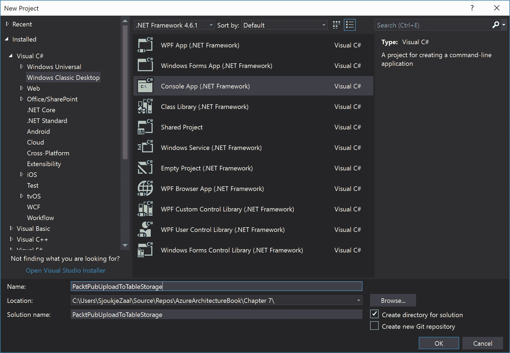
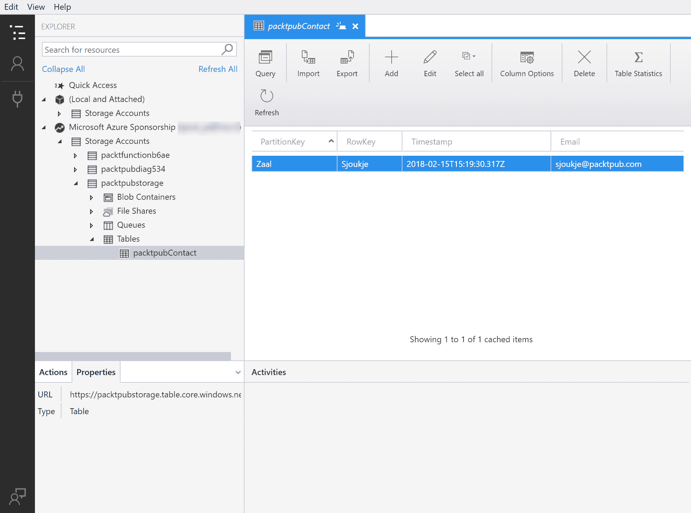
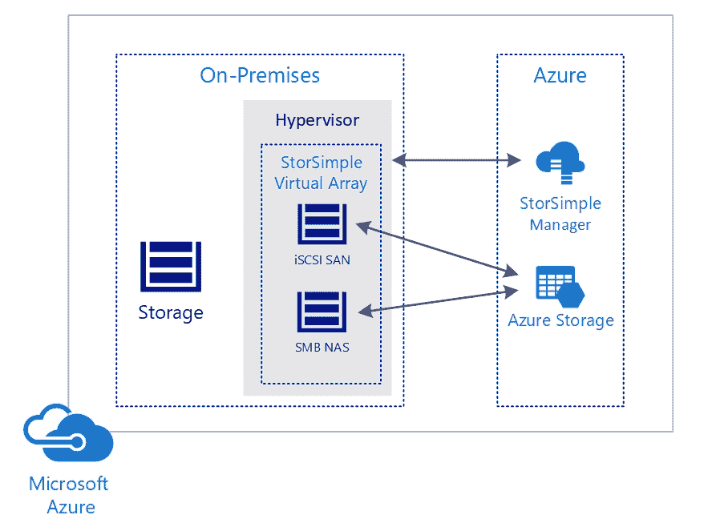
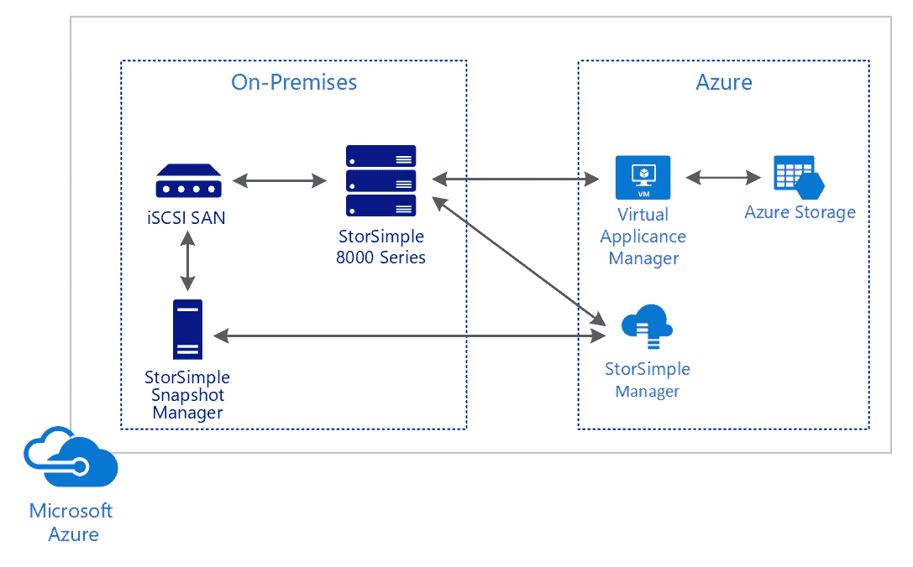
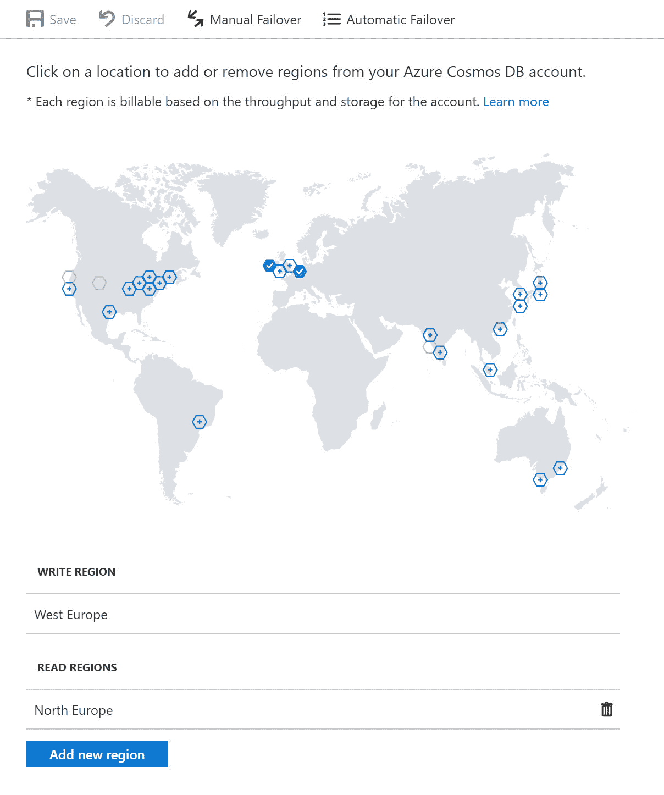
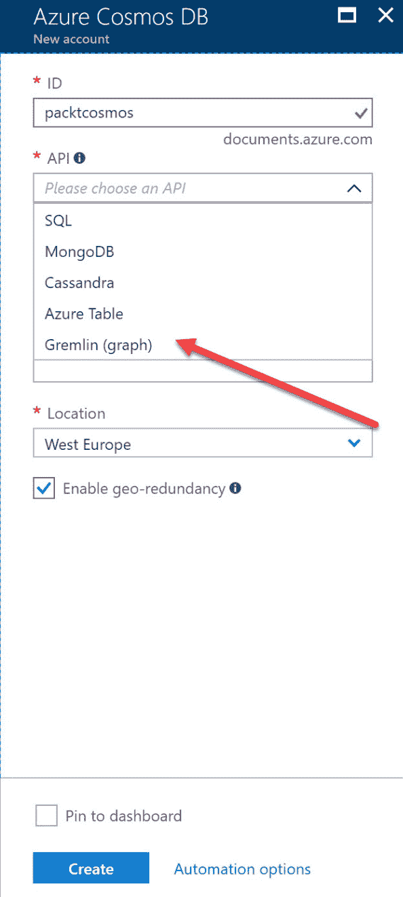

# 使用存储解决方案

在上一章中，我们介绍了混合应用程序连接设计的目标。我们讨论了如何设计混合应用程序。我们还讲解了 Azure 虚拟网络的外部连接以及如何设计网络解决方案的安全策略。

本章通过从存储解决方案开始，介绍了数据实现设计的目标。本章涵盖了 Azure 中可用的不同存储解决方案，如 Azure Blob 存储和 Azure 文件存储。它还将帮助你确定何时使用这些存储解决方案中的一种。它还涵盖了为 NoSQL 存储设计的内容以及何时使用 Azure 中的不同 NoSQL 服务，如 Azure 表存储和 Cosmos DB。最后，它介绍了如何使用 Azure 搜索对数据进行检索。

阅读完本章后，你应该知道在你的解决方案中何时使用哪种存储选项。

以下主题将被涵盖：

+   Azure 存储类型与复制类型

+   Azure Blob 存储

+   Azure 表存储

+   Azure 队列存储

+   Azure 文件存储

+   Azure 磁盘存储

+   StorSimple

+   Cosmos DB 存储

+   Azure 搜索

# 技术要求

本章示例使用了以下工具：

+   Azure PowerShell: [`docs.microsoft.com/en-us/powershell/azure/install-azurerm-ps?view=azurermps-5.1.1`](https://docs.microsoft.com/en-us/powershell/azure/install-azurerm-ps?view=azurermps-5.1.1)

+   Visual Studio 2017: [`www.visualstudio.com/downloads/`](https://www.visualstudio.com/downloads/)

本章的源代码可以通过以下链接下载：

+   [`github.com/SjoukjeZaal/AzureArchitectureBook/tree/master/Chapter%207`](https://github.com/SjoukjeZaal/AzureArchitectureBook/tree/master/Chapter%207)

# Azure 存储和复制类型

每个应用程序都需要某种存储解决方案。Azure 提供了几种不同类型的存储，从存储文件和文档到存储数据集。第一步是创建存储账户。当你创建存储账户时，你需要决定是否希望数据可以在本地或全球访问。另一个需要考虑的因素是选择哪种账户类型。

# 存储账户类型

Azure Blob 存储提供三种不同的账户类型，可用于 Blob、表、文件和队列存储。Azure 提供以下存储类型。

# 通用型 v1 (GPv1)

通用型存储 (V1) 账户是最早的存储账户类型。它提供对页面 blob、块 blob、文件、队列和表的存储，但它不是最具成本效益的存储账户类型。它是唯一可以用于经典部署模型的存储账户类型。不支持最新的功能，如访问层。

# Blob 存储

Blob 存储账户提供 StorageV2 账户的所有功能，唯一的区别是它仅支持块 Blob（和追加 Blob）。不支持页面 Blob。它提供访问层，包括热存储、冷存储和归档存储，后续章节会详细介绍。

# 通用型 v2（GPv2）

StorageV2 是最新的存储账户类型，它将 V1 存储与 Blob 存储结合在一起。它提供了所有最新功能，如 Blob 存储的访问层，并降低了成本。Microsoft 推荐使用此账户类型，优于 V1 和 Blob 存储账户类型。

V1 存储账户可以升级为 V2。

有关这些不同账户类型的定价和计费的更多信息，请参阅以下定价页面：[`azure.microsoft.com/en-us/pricing/details/storage/`](https://azure.microsoft.com/en-us/pricing/details/storage/)。

# 存储复制类型

存储在 Azure 中的数据始终会进行复制，以确保持久性和高可用性。这样，它就能在计划外和计划内的事件（如网络或电力中断、自然灾害和恐怖袭击）中得到保护。它还确保在这些事件发生期间，你的存储账户仍能满足 SLA 要求。

数据可以在同一数据中心内进行复制，也可以在同一区域内的区域数据中心之间复制，甚至跨区域进行复制。这些复制类型分别称为 **本地冗余存储**（**LRS**）、**区域冗余存储**（**ZRS**）和 **地理冗余存储**（**GRS**），并将在后续章节中详细介绍。

创建新存储账户时，你需要选择一种复制类型。存储账户可以在 Azure 门户中创建，也可以通过 PowerShell 或 CLI 创建。

# 本地冗余存储

LRS 是最便宜的选项，它将在同一数据中心内将数据复制三次。当你对存储账户发出写请求时，该请求将会同步写入所有三个副本。当数据完全复制时，请求才会提交。使用 LRS 时，数据将在一个存储规模单元内跨多个更新域和故障域进行复制。

# 区域冗余存储

ZRS 当前处于预览阶段，仅在美国东部 2 区和美国中部可用。它在两个或三个数据中心之间复制三份数据。数据会同步写入所有三个副本，这些副本位于一个或两个区域。它还像 LRS 一样，在数据所在的同一数据中心内复制三份数据。

# 地理冗余存储

GRS 在同一地区内将数据复制三次（类似于 ZRS），同时还会异步复制三份数据到其他地区。

# Azure Blob 存储

Azure Blob 存储提供云中的非结构化数据存储。它可以存储各种数据，如文档、VHD、图像和音频文件。

你可以创建两种类型的 blob。**页面 blob**用于存储磁盘。因此，当你需要存储 VHD 并将其附加到虚拟机时，你将创建一个页面 blob。页面 blob 的最大大小为 1 TB。另一种是 **块 blob**，它基本上包含了你可以在 Azure 中存储的所有其他类型的数据，如文件和文档。块 blob 的最大大小为 200 GB。然而，还有一种名为追加 blob 的第三种类型，但它仅由 Azure 内部使用，不能用来存储实际文件。

有几种方法可以将 blob 复制到你的 blob 存储账户。你可以使用 Azure 门户（一次只能操作一个），或使用 Azure 存储资源管理器，或者通过 .NET、PowerShell 或 CLI 编程方式，或者调用 REST API 来复制文件。

# 访问层

Blob 存储账户使用访问层来确定数据的访问频率。根据此访问层，你将会收到相应的计费。Azure 提供三种存储访问层：Hot、Cool 和 Archive。

# Hot

Hot 访问层最适合存储频繁访问的数据和正在使用的数据。例如，你会将网站的图片和样式表存储在 Hot 访问层中。与其他访问层相比，这个层级的存储成本较高，但访问文件的费用较低。

Hot 访问层专为存储频繁访问的数据而优化。它的存储成本比 Cool 和 Archive 存储层更高，但访问文件的费用较低。这个访问层最适合存储正在使用的数据。

# Cool

Cool 访问层最适合存储不常访问的数据（30 天内访问不到一次）。与 Hot 访问层相比，Cool 访问层的存储成本较低，但访问文件的费用更高。这个层级最适合存储备份和不常查看的旧内容。

# 存档

存档存储层是在 blob 级别设置的，而不是在存储级别设置的。与 Hot 和 Cool 访问层相比，它的存储成本最低，但访问数据的成本最高。这个层级适合存储至少需要存档 180 天的数据，且访问时需要几小时的延迟。这个层级最适合长期备份或合规性和存档数据。

存储在 Archive 访问层中的 blob 是离线状态，无法读取（元数据除外）、复制、覆盖或修改。

# Azure 表格存储

Azure 表存储是一个 NoSQL 数据存储，适用于大量半结构化的非关系数据。与关系数据库相比，它更具成本效益，因为它将数据存储在更便宜的服务器上，这些服务器提供水平扩展和高性能。NoSQL 使用无模式设计，数据是基于键/属性值进行存储的。您可以在其中存储灵活的数据集，并且它可以在一个表中存储任意数量的实体，最多可达存储帐户的最大容量（500 TB）。

Azure 表存储最适合处理不需要复杂联接、存储过程和外键的数据集。您可以通过 OData 协议和 LINQ 查询访问数据。

# 创建存储帐户

在上传任何数据或文件到 Azure 存储之前，需要创建一个存储帐户。可以使用 Azure 门户、PowerShell、CLI 或 Visual Studio 来完成此操作。

在本示例中，我们将使用 PowerShell 创建一个存储帐户：

```
Login-AzureRmAccount
```

如有必要，选择正确的订阅：

```
Select-AzureRmSubscription -SubscriptionId "********-****-****-****-***********"

```

创建一个资源组：

```
New-AzureRmResourceGroup -Name PacktPubStorage -Location WestEurope
```

创建存储帐户：

```
New-AzureRmStorageAccount -ResourceGroupName PacktPubStorage -AccountName packtpubstorage -Location WestEurope -SkuName "Standard_GRS"
```

# 向 Azure 表存储上传数据

在本示例中，我们将使用 Visual Studio 2017 向之前步骤中创建的存储帐户中的 Azure 表上传数据。

1.  点击文件 | 新建 | 项目，在新建项目窗口中选择 Windows Classic Desktop | 控制台应用程序。命名项目并点击确定：



创建一个新项目

1.  接下来是导入 NuGet 包。有两个需要安装的包：

    +   **Windows Azure 存储**：该库提供对 Azure 存储帐户及其数据的访问。它可以用于处理 blobs、文件、表格和队列。

    +   **Microsoft Windows Azure 配置管理器**：该库提供了一个统一的 API 来加载配置设置，无论应用程序托管在哪里。

1.  将以下 XML 代码添加到 `App.config` 文件中。实际的 `ConnectionString` 值可以从 Azure 门户中的访问密钥设置中获取：

```
<configuration>
  <startup>
    <supportedRuntime version="v4.0" sku=".NETFramework,Version=v4.5.2" />
  </startup>
  <appSettings>
    <add key="StorageConnectionString" value="DefaultEndpointsProtocol=https;AccountName=packtpubstorage;AccountKey=account-key" />
  </appSettings>
</configuration>
```

1.  向项目中添加一个新类，并命名为 `Contact.cs`。然后用以下代码替换它：

```
using Microsoft.WindowsAzure.Storage.Table;

namespace PacktPubUploadToTableStorage
{
    class Contact : TableEntity
    {
        public Contact(string lastName, string firstName)
        {
            this.PartitionKey = lastName;
            this.RowKey = firstName;
        }

        public Contact() { }

        public string Email { get; set; }
    }
}
```

1.  将以下代码添加到 `Program.cs` 的 `Main()` 方法中：

```
using Microsoft.Azure;
using Microsoft.WindowsAzure.Storage;
using Microsoft.WindowsAzure.Storage.Table;

namespace PacktPubUploadToTableStorage
{
    class Program
    {
        static void Main(string[] args)
        {
            CloudStorageAccount storageAccount = CloudStorageAccount.Parse(CloudConfigurationManager.GetSetting("StorageConnectionString"));
            // Create the table client.

            // Create the table client.
            CloudTableClient tableClient = storageAccount.CreateCloudTableClient();

            // Retrieve a reference to the table.
            CloudTable table = tableClient.GetTableReference("packtpubContact");

            // Create the table if it doesn't exist.
            table.CreateIfNotExists();

            // Create a new contact entity.
            Contact contact1 = new Contact("Zaal", "Sjoukje");
            contact1.Email = "sjoukje@packtpub.com";

            // Create the TableOperation object that inserts the contact.
            TableOperation insertOperation = TableOperation.Insert(contact1);

            // Execute the insert operation.
            table.Execute(insertOperation);
        }
    }
}
```

1.  运行项目。然后，你可以打开 Azure Storage Explorer，导航到存储帐户和容器。你将看到已添加的数据行：



已添加的数据行

若要了解如何使用 .NET 操作 Azure 表存储，您可以参考以下教程：[`docs.microsoft.com/en-us/azure/cosmos-db/table-storage-how-to-use-dotnet`](https://docs.microsoft.com/en-us/azure/cosmos-db/table-storage-how-to-use-dotnet)。

# Azure 队列存储

Azure 队列存储提供了一个可以供应用程序使用的消息队列。消息队列提供了一种异步通信机制，发送方将消息添加到队列中，接收方可以在稍后的时间接收这些消息。应用程序可以从中受益，因为它们可以解耦组件，组件可以独立扩展。

你可以使用 Azure 存储客户端库和 REST API 从队列存储发送和接收消息。

Azure 队列存储在第十三章，*实现消息传递解决方案*中有更详细的介绍。

# Azure 文件存储

使用 Azure 文件存储，你可以在云中创建文件共享。你可以使用服务器消息块（SMB）协议访问文件，这是一种行业标准，可以在 Linux、Windows 和 macOS 设备上使用。Azure 文件还可以像本地驱动器一样在这些设备上挂载，并且可以通过 Azure 文件同步（预览版）在 Windows 服务器上缓存，以实现快速访问。

文件共享可以跨多个机器使用，这使其适合存储多个机器访问的文件或数据，例如开发机器的工具、配置文件或日志数据。Azure 文件共享是 Azure 存储客户端库的一部分，并提供 Azure 存储 REST API，开发人员可以在其解决方案中利用该 API。

# Azure 磁盘存储

用于虚拟机的磁盘存储在 Azure Blob 存储中作为页面 Blob。Azure 为每个虚拟机存储两个磁盘，一个是虚拟机的实际操作系统（VHD），另一个是用于短期存储的临时磁盘。当虚拟机关闭或重新启动时，这些数据会被擦除。

Azure 提供了两种不同的性能层次：标准磁盘存储和高级磁盘存储。

# 标准磁盘存储

标准磁盘存储提供用于存储数据的 HDD 驱动器，是你可以选择的最具性价比的存储层。它仅支持 LRS 或 GRS 来保证数据和应用程序的高可用性。

标准磁盘存储提供 HDD，并且具有更高的性价比。标准磁盘存储仅支持 LRS 或 GRS。

# 高级磁盘存储

使用高级磁盘存储时，数据存储在 SSD 上。并非所有 Azure 虚拟机系列都可以使用这种类型的存储。它只能与 DS、DSv2、GS、LS 或 FS 系列 Azure 虚拟机一起使用。它提供高性能和低延迟的磁盘支持。

# 非托管磁盘与托管磁盘

托管磁盘在第一章中有所介绍，*与 Azure 虚拟机一起使用*，它为您处理存储帐户的创建。与传统的非托管磁盘不同，后者用于虚拟机时，您需要手动创建存储帐户，然后在创建虚拟机时选择该帐户。使用托管磁盘时，Azure 为您处理这一负担。您只需选择磁盘类型和性能层（标准或高级），托管磁盘即会自动创建，并且会自动处理扩展。

微软推荐使用托管磁盘而非非托管磁盘。

# StorSimple

**StorSimple**是一个集成的存储解决方案，跨越本地环境和云存储。它通过提供一个混合解决方案，解决了许多存储问题，如数据增长、容量管理、备份、归档和灾难恢复，该解决方案由一个集成的云存储系统和 Azure 云存储组成。

使用 StorSimple，您可以将活动数据存储在本地存储系统中，提供更低的延迟和更高的吞吐量。例如，数据库文件是活动数据的一部分。较少活跃的数据，如文档、SharePoint 文件、归档数据和虚拟机存储，更适合存储在云中。通过使用 StorSimple，您可以将这些数据存储在 Azure 云存储中。

StorSimple 支持 iSCSI 和 SMB 连接到您的数据，与更经济的云存储相比，它消除了冗余数据并对其进行压缩以减少成本。您可以结合使用 Azure Premium 存储和 StorSimple，以获得更高的性能和更低的延迟。

为实现这一目标，StorSimple 提供以下存储区域网络（SAN）解决方案：StorSimple 虚拟阵列和 StorSimple 8000 系列。

# StorSimple 虚拟阵列

StorSimple 虚拟阵列运行在您现有的本地虚拟化平台基础设施上，管理本地环境和 Azure 云存储之间的存储。它还提供云备份、快速恢复、灾难恢复功能和项目级恢复。它支持 Hyper-V 2008 R2 及更高版本，以及 VMWare 5.5 及更高版本。

StorSimple 虚拟阵列是最具性价比的 StorSimple 解决方案，因为它提供了一个可以安装在 Hyper-V 或 VMWare 虚拟机上的下载版，部署在您的数据中心或办公室中。然后，它可以被配置为 iSCSI 服务器（SAN）或文件服务器（NAS）。可以通过 Azure 门户中的 StorSimple Manager 服务进行管理：



StorSimple 虚拟阵列

若想了解更多关于 StorSimple 虚拟阵列的信息，请参考[`docs.microsoft.com/zh-cn/azure/storsimple/storsimple-ova-overview`](https://docs.microsoft.com/zh-cn/azure/storsimple/storsimple-ova-overview)。

# StorSimple 8000 系列

使用 StorSimple 8000 系列，微软提供了一种可以租赁并安装在本地环境中的物理设备。它为最活跃的数据使用 SSD 硬盘，为使用频率较低的数据使用 HDD 硬盘，并将归档数据存储在 Azure 云存储中。它还提供冗余控制器来管理存储分层和自动故障切换。

StorSimple 存储阵列安装在本地环境中，并提供 iSCSI 访问。它可以与网络中的其他 SAN 存储设备连接（最多支持六个网络端口）。它使用虚拟设备管理器将数据复制到 Azure 云存储。虚拟设备管理器安装在 Azure 虚拟机中，也可以为 Azure 中的虚拟机提供 iSCSI 接口。StorSimple 管理器帮助你通过 Azure 门户管理数据，它还可以管理存储在本地的快照。快照管理器是 **Microsoft 管理控制台** (**MMC**) 的一个插件，运行在基于 Windows Server 的主机上：



StorSimple 8000 系列

StorSimple 8000 系列提供了用于 StorSimple 的 Windows PowerShell 和 SharePoint 的 StorSimple 适配器。

若想了解更多关于 StorSimple 8000 系列的信息，可以参考 [`docs.microsoft.com/en-us/azure/storsimple/storsimple-overview`](https://docs.microsoft.com/en-us/azure/storsimple/storsimple-overview)。

# Cosmos DB 存储

Cosmos DB（前身为 DocumentDB）存储是 Azure 表存储的高级服务。它是一个多模型、全球分布的数据库服务，旨在水平扩展并将数据复制到任何数量的 Azure 区域。通过复制和扩展数据，Cosmos DB 可以确保全球任何地方的低延迟、高可用性和高性能。你可以通过在 Azure 门户中选择地图上的可用区域，轻松地复制或扩展数据。



在 Azure 门户中扩展和复制数据

这种高可用性和低延迟使得 Cosmos DB 最适合用于移动应用、游戏以及需要全球分布的应用程序。Azure 门户也使用 Cosmos DB 进行数据存储。

Cosmos DB 完全无模式，你可以使用多种现有的 API 和可用的 SDK 与其进行通信。因此，如果你正在使用特定的 API 来处理你的数据，并且希望将数据迁移到 Cosmos DB，只需在应用程序中更改连接字符串，数据便会自动存储在 Cosmos DB 中。Cosmos DB 支持以下 API 来存储和与数据交互：

+   **SQL API**：通过 SQL API，您可以使用 SQL 查询作为针对 Cosmos DB 内数据集的 JSON 查询语言。由于 Cosmos DB 无模式，它提供 JSON 文档的自动索引。数据存储在 SSD 驱动器上，以确保低延迟，并且它是无锁的，因此您可以为数据创建实时查询。Cosmos DB 还支持使用 JavaScript 编写存储过程、触发器和用户定义函数（UDF），并且在集合内支持 ACID 事务。

+   **MongoDB API**：MongoDB 是一个开源文档数据库，默认提供高性能、高可用性和自动扩展。在 Cosmos DB 内使用它时，提供自动分片、索引、复制和数据加密。MongoDB 还提供一个聚合管道，可用于在多个阶段过滤和转换数据。它还支持创建全文索引，并且可以轻松与 Azure Search 和其他 Azure 服务集成。

+   **Gremlin（图形）API**：Gremlin API 是 Apache TinkerPop 项目的一部分，这是一个开源图计算框架。图形是一种基于关系存储对象（节点）的方法。每个对象可以与其他对象有多个关系。您可以使用 JavaScript 与数据进行交互。

+   **Table API**：Azure Table API 可用于针对 Azure Table Storage 编写的应用程序，但需要一些高级功能，如全球分布、自动索引、低延迟和高吞吐量。

+   **Cassandra API**：Cassandra API 可用于针对 Apache Cassandra 编写的应用程序。Apache Cassandra 是一个开源分布式 NoSQL 数据库，提供可扩展性和高可用性。Cosmos DB 在此基础上提供了无操作管理、SLA 和自动索引功能。

未来，Cosmos DB 还将新增新的 API。



Cosmos DB 可用的多模型 API

如果您想开始使用这些多模型 API 开发应用程序，可以参考 [`docs.microsoft.com/en-us/azure/cosmos-db/`](https://docs.microsoft.com/en-us/azure/cosmos-db/)。那里有多个编程语言的示例。

# Azure 搜索

Azure Search 是一个 Azure 服务，提供对存储在 Azure SQL 数据库、Azure Cosmos DB 和 Azure Blob 存储中的内容进行丰富搜索的体验。对于 Azure Blob 存储，它支持对多种文件格式进行索引，例如 CSV、JSON、纯文本文件、RTF、EML、ZIP、XML、HTML、各种 Microsoft Office 格式和 PDF。

它提供全文搜索和文本分析，支持 56 种语言的分析器进行语言学分析，地理搜索，用户体验功能，如搜索建议、分页、排序、命中高亮显示，以及监控和报告功能。

Azure Search 使用分区来存储搜索索引并提供读/写操作的 I/O。Azure Search 提供不同的服务层级，可以在一个租户内进行组合。这些不同的服务层级提供不同的存储容量和可扩展性。对于更昂贵的服务层级，可以创建多个搜索服务实例，这些实例被称为副本。

Azure Search 提供以下服务层级：

+   **免费版**：该服务与 Azure 中的其他租户共享。它提供 50 MB 的存储空间，每个服务最多可以有 3 个索引，每个索引最多包含 10,000 个文档，并且无法进行扩展。

+   **基础版**：该服务提供 2 GB 的存储空间，并且每个服务最多可有 5 个索引。您可以将每个服务的搜索单元扩展至最多 3 个（1 个分区和 3 个副本）。

+   **标准 S1**：此层提供 25 GB 的存储空间，并且每个服务最多可有 50 个索引。您可以将每个服务的搜索单元扩展至最多 36 个（12 个分区和 12 个副本）。

+   **标准 S2**：此层提供与标准 S1 相同的功能，但存储空间为 100 GB，并且每个服务最多可以有 200 个索引。

+   **标准 S3**：此层提供 200 GB 的存储空间，并包含所有标准 S2 功能。

+   **标准 HD**：这是一个可以为标准 S3 定价层启用的选项。在标准 S3 提供的所有功能的基础上，您可以每个服务最多有 1,000 个索引。

建议您每个订阅都始终配置一个免费的搜索服务层级，这样它可以用于测试或轻量级搜索。然后，您可以在其旁边创建其他搜索服务以处理生产工作负载。

欲了解更多关于 Azure Search 可用 SKU 的信息，您可以参考[`docs.microsoft.com/en-us/azure/search/search-sku-tier`](https://docs.microsoft.com/en-us/azure/search/search-sku-tier)。

# 总结

本章我们讨论了数据实现设计的目标。我们介绍了 Azure 中可用的不同存储解决方案以及何时使用它们。我们还讲解了 NoSQL 存储的设计，以及何时使用不同的 Azure 服务，例如 Azure 表存储和 Cosmos DB。最后，我们简要介绍了 Azure Search。

下一章将介绍可扩展的数据实现。

# 问题

请回答以下问题，以测试您对本章内容的理解。您可以在本书最后的*评估*部分找到答案。

1.  Cosmos DB 是否比 Azure 表存储更适合用于游戏应用？

    1.  是的

    1.  不是

1.  您能否将 Azure Search 与 Azure Data Factory 一起使用来搜索数据？

    1.  是的

    1.  不是

1.  您想在 Cosmos DB 中创建图形数据库。MongoDB API 是否适合在您的自定义应用程序中使用？

    1.  是的

    1.  不是

# 进一步阅读

您可以通过以下链接查看更多关于本章涵盖主题的信息：

+   **Azure 存储帐户选项**: [`docs.microsoft.com/en-us/azure/storage/common/storage-account-options`](https://docs.microsoft.com/en-us/azure/storage/common/storage-account-options)

+   **Azure 存储复制**: [`docs.microsoft.com/en-us/azure/storage/common/storage-redundancy`](https://docs.microsoft.com/en-us/azure/storage/common/storage-redundancy)

+   **Azure 表存储概述**: [`docs.microsoft.com/en-us/azure/cosmos-db/table-storage-overview`](https://docs.microsoft.com/en-us/azure/cosmos-db/table-storage-overview)

+   **Azure 文件简介**: [`docs.microsoft.com/en-us/azure/storage/files/storage-files-introduction`](https://docs.microsoft.com/en-us/azure/storage/files/storage-files-introduction)

+   **关于 Azure Windows 虚拟机的磁盘存储**: [`docs.microsoft.com/en-us/azure/virtual-machines/windows/about-disks-and-vhds`](https://docs.microsoft.com/en-us/azure/virtual-machines/windows/about-disks-and-vhds)

+   **StorSimple 文档**: [`docs.microsoft.com/en-us/azure/storsimple/`](https://docs.microsoft.com/en-us/azure/storsimple/)

+   **欢迎使用 Azure Cosmos DB**: [`docs.microsoft.com/en-us/azure/cosmos-db/introduction`](https://docs.microsoft.com/en-us/azure/cosmos-db/introduction)

+   **Azure 搜索文档**: [`docs.microsoft.com/en-us/azure/search/`](https://docs.microsoft.com/en-us/azure/search/)
