# 可扩展的数据实现

在上一章中，我们介绍了存储解决方案目标。我们涵盖了 Azure 提供的不同存储特性，以及何时和如何使用它们。我们还讲解了如何为 NoSQL 存储进行设计，并讨论了何时使用可用的解决方案。

这是领域设计数据实现目标的第二章，内容涵盖了针对 Azure 数据服务的设计，包括对 Azure 提供的服务和解决方案的高层次概述。还涉及 Azure 中的关系型数据库，包括 Azure SQL 数据库，以及如何为性能、可用性进行设计，并介绍了两种开源关系型数据库，如 Azure 上的 MySQL 和 PostgreSQL。

到本章结束时，你应该了解在何时使用哪种数据服务或关系型数据库来解决你的问题。

以下主题将被涵盖：

+   Azure 数据目录

+   Azure 数据工厂

+   Azure SQL 数据仓库

+   Azure 数据湖

+   Azure 分析服务

+   Azure SQL 数据库

+   Azure 数据库 for MySQL

+   Azure 数据库 for PostgreSQL

# 技术要求

本章的源代码可以从 [`github.com/SjoukjeZaal/AzureArchitectureBook/tree/master/Chapter%208`](https://github.com/SjoukjeZaal/AzureArchitectureBook/tree/master/Chapter%208) 下载。

# Azure 数据目录

Azure 数据目录提供了一个中央存储库，你可以在其中找到组织内部使用的所有数据源。大多数组织内的员工不知道企业数据的位置或谁负责这些数据。通过 Azure 数据目录，任何用户（例如开发人员或分析师）都可以从一个中央位置发现并使用数据源。

Azure 数据目录为每个 Azure AD 租户提供一个数据目录，即使你有多个与该租户关联的订阅。数据源的元数据副本以及数据源的位置会被添加到目录中。数据本身仍然保留在原始位置。Azure 数据目录还提供搜索功能，便于轻松发现数据。

你可以使用 Microsoft 提供的工具将数据源导入到 Azure 数据目录中。Azure 数据目录支持多种可以使用导入工具发布的数据源，例如 Azure Blob 存储、Azure 数据湖、SQL Server，以及第三方数据源如 Oracle、MySQL 等。当数据源添加到目录时，可以丰富其元数据，为用户提供额外的信息。

Azure 数据目录有两个版本——**免费**和**标准**：

+   **免费**：提供无限用户和 5,000 个注册数据资产；这些数据资产对所有用户可见

+   **标准**：提供无限用户、100,000 个注册数据资产，并且具备资产级别授权，限制可见性

Azure 数据目录还可以通过调用 Data Catalog REST API 进行编程使用。它提供了注册和删除数据的接口，以及处理注释的功能。

若要全面了解 Azure 数据目录支持的数据源，您可以参考这篇文章：[`docs.microsoft.com/en-us/azure/data-catalog/data-catalog-dsr`](https://docs.microsoft.com/en-us/azure/data-catalog/data-catalog-dsr)。关于 Data Catalog REST API 的更多信息，您可以参考这篇文章：[`docs.microsoft.com/en-us/rest/api/datacatalog/#search-syntax-reference`](https://docs.microsoft.com/en-us/rest/api/datacatalog/#search-syntax-reference)。

# Azure 数据工厂

Azure 数据工厂是一个用于大数据处理和分析的云服务。它利用来自各种数据源的原始数据，为企业决策者、分析师和数据科学家提供有价值的见解。以下功能用于处理和组成数据驱动的工作流：

+   **数据管道**：表示一组执行单元工作的活动。

+   **活动**：一个活动代表管道中的一个步骤。例如，你可以创建一个复制活动，将数据从 Azure Blob 存储帐户复制到 HDInsight 集群。Azure 数据工厂支持三种类型的活动：数据移动活动、数据转换活动和数据控制活动。

+   **数据集**：这些表示来自数据存储的数据，用于输入和输出。

+   **链接服务**：Azure 数据工厂使用链接服务连接到数据源。你可以将其与连接字符串进行类比。链接服务有两种类型——一种用于连接到数据存储，另一种用于连接到计算资源。

+   **触发器**：触发器启动数据管道的执行。数据工厂支持计划触发器和滚动窗口触发器，它们按周期性间隔运行。没有触发器可以从自定义代码启动管道。如果你想从应用程序内部启动它，最佳方法是通过代码更改计划触发器的开始时间为你希望启动操作的时间。

+   **管道运行**：这是数据管道执行的一个实例。

+   **参数**：你可以将参数作为参数传递到管道内，它们是键值对。

+   **控制流**：这表示活动的 orchestration（协调）。你可以按顺序处理活动，创建 for-each 迭代器等。

你可以通过 Azure 门户使用 Azure Data Lake UI（仅限 Edge 或 Chrome 浏览器）、.NET、Python、PowerShell、ARM 或调用 REST API 来创建 Data Factory 服务和数据管道。

在编写本书时，Azure 提供了两个版本的 Azure Data Factory：V1 和 V2。V2 目前处于预览阶段。有关两个版本之间差异的详细概述，您可以参考[`docs.microsoft.com/en-us/azure/data-factory/compare-versions`](https://docs.microsoft.com/en-us/azure/data-factory/compare-versions)。

Azure Data Factory 只能在美国东部、美国东部 2 和西欧地区创建。但是，它们可以访问其他 Azure 区域的数据库存储和计算服务，用于在数据存储之间移动数据或使用计算服务处理数据。

# Azure SQL 数据仓库

Azure SQL 数据仓库在云中提供企业级数据仓库。它结合**大规模并行处理**（**MPP**）和 Azure 存储，提供高性能和可扩展性。为了从存储在数据仓库中的数据中创建有价值的洞察，Azure 使用 Hadoop/Spark 和机器学习技术。

数据存储在具有列式存储的关系型表中。使用列式存储时，数据是按列写入和读取的，而不是传统行式数据库中的按行存储。因此，当您查询数据时，列式存储会通过立即跳转到适当的列来跳过所有无关数据。这将使查询运行得更快。例如，当您想查找所有客户的平均年龄时，列式存储会直接跳转到年龄列，而不是查看每一行的年龄列。这还提供了更好的数据压缩，从而降低了存储成本。

通过使用 MPP，Azure SQL 数据仓库将存储层与计算层解耦，这使得扩展变得更加容易。MPP 使用多个计算节点来处理数据。客户端应用程序或存储解决方案使用 PolyBase T-SQL 命令将数据添加到控制节点。控制节点运行 MPP 引擎，该引擎使用**数据移动服务**（**DMS**）在节点之间移动数据。它还负责优化并行处理的查询。当优化后，MPP 引擎会将查询传递给可用的计算节点，以并行执行。计算节点将负责将数据存储在 Azure 存储中：

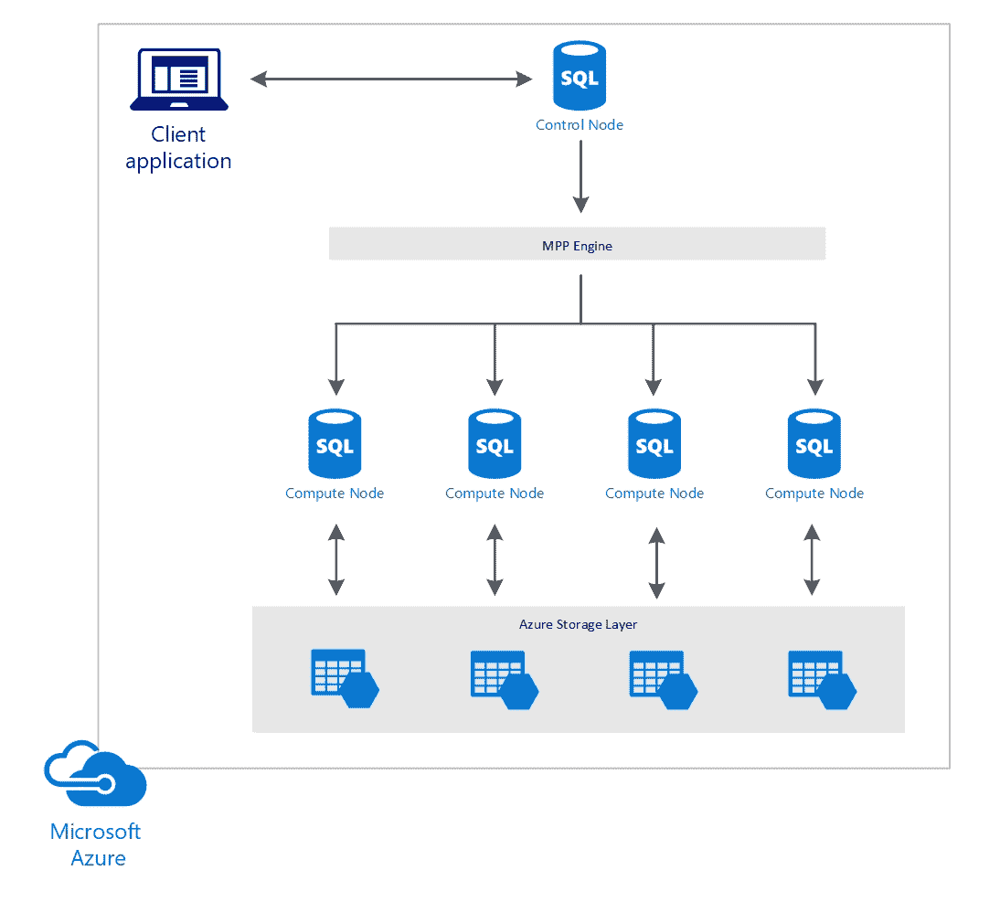

MPP 架构

将存储层与计算层解耦也是一种更具成本效益的方式。您可以独立扩展存储层的计算节点，或者暂停计算能力，这样您只需要为存储付费。

# Azure Data Lake

Azure Data Lake 是一个大数据存储和分析服务，能够存储大量的结构化、半结构化或非结构化数据。它基于 Hadoop 的资源管理平台 YARN，能够在 Azure SQL Server 实例或 Azure SQL 数据仓库实例之间动态扩展。

想了解更多关于 Hadoop YARN 的信息，可以参考 Hadoop 官网：[`hadoop.apache.org/docs/current/hadoop-yarn/hadoop-yarn-site/YARN.html`](https://hadoop.apache.org/docs/current/hadoop-yarn/hadoop-yarn-site/YARN.html)。

Hadoop YARN 提供三种解决方案：

+   Azure 数据湖存储

+   Azure 数据湖分析

+   Azure HDInsight

# Azure 数据湖存储

Azure 数据湖存储是一个大数据工作负载的存储库，在这里你可以存储原始数据。数据湖是一个容器，你可以在其中存储各种类型的数据，如结构化、半结构化和非结构化数据。数据添加到数据湖时仍然是未处理的，这与数据仓库不同，后者存储的是结构化和已处理的数据。

Azure 数据湖存储是为 Hadoop 构建的，可以从 Azure 的 HDInsight 集群中访问。它使用 Hadoop 文件系统来存储数据。应用程序调用与 WebHDFS 兼容的 REST API 将数据添加到文件系统中。它提供无限的存储空间，数据可以使用如 MapReduce 或 Hive 等 Hadoop 分析框架进行分析。Azure HDInsight 集群还可以通过开箱即用的连接来配置，直接访问存储在 Azure 数据湖存储中的数据。你可以在机器学习模型中使用 Azure 数据湖存储的数据，也可以创建批量查询或将数据存储在数据仓库中：

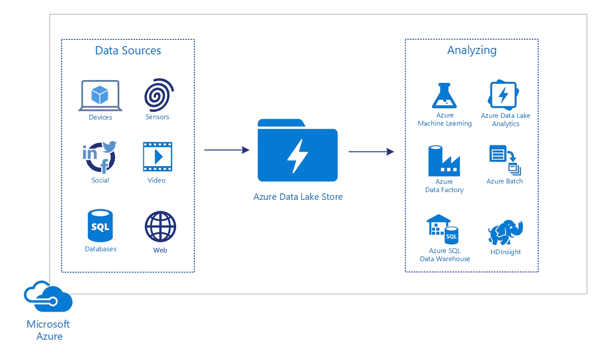

Azure 数据湖存储

# Azure 数据湖分析

Azure 数据湖分析是 Azure 数据湖的一个功能，可以用来分析你的数据。你的数据可以来自不同的数据源，分析后的数据也可以写入不同的数据源。它与 Azure 数据湖存储、Azure Blob 存储和 Azure SQL 数据库兼容。

Azure 数据湖分析采用无服务器方式；你无需管理集群，只需为实际的数据分析付费。它可以动态扩展，并且与 Azure AD 集成用于身份验证。

它提供两种定价套餐：

+   **按需付费**：在这种模式下，你只需按分钟为使用的时间付费，没有额外的承诺。

+   **每月承诺**：这个定价套餐有几种不同的选择，你可以提前支付一定小时数的费用——例如 100 小时、500 小时或 1000 小时等。

想了解更多关于不同定价套餐的信息，可以参考：[`azure.microsoft.com/en-us/pricing/details/data-lake-analytics/`](https://azure.microsoft.com/en-us/pricing/details/data-lake-analytics/)。

Azure 数据分析使用 U-SQL 来分析数据。U-SQL 是大数据查询语言，可以与 C#、R、Python 和认知服务结合使用。你可以通过 Azure 门户创建脚本，并创建作业在数据上执行它们。你还可以使用 Visual Studio、Visual Studio Code、PowerShell 和 CLI 提交 U-SQL 脚本。

# 使用数据湖分析分析你的数据

在本演示中，我们将创建一个 Data Lake Analytics 账户并分析一些数据，然后将其存储在 Azure 数据湖存储中。Data Lake Analytics 必须拥有一个 Azure 数据湖存储账户，因此我们也会创建该账户：

1.  打开 [`portal.azure.com/`](https://portal.azure.com/) 以导航到 Azure 门户。

1.  点击 **新建** 并在搜索框中输入 Data Lake Analytics。

1.  一个新的面板打开了。在写这本书时，Data Lake Analytics 只能在中部美国（Central US）、东部美国 2（East US 2）和北欧（North Europe）地区创建。添加以下设置：

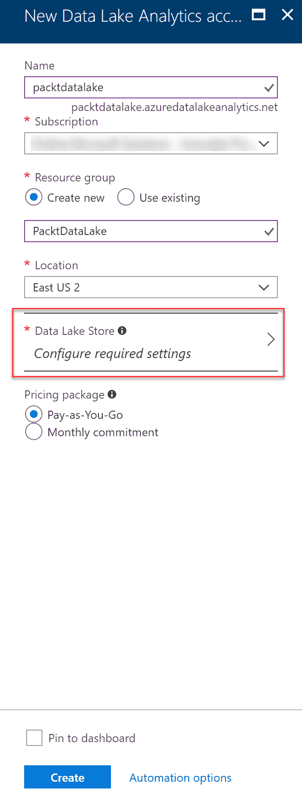

创建 Azure 数据湖分析账户

1.  点击 **Data Lake Store** 来创建存储您数据的账户：

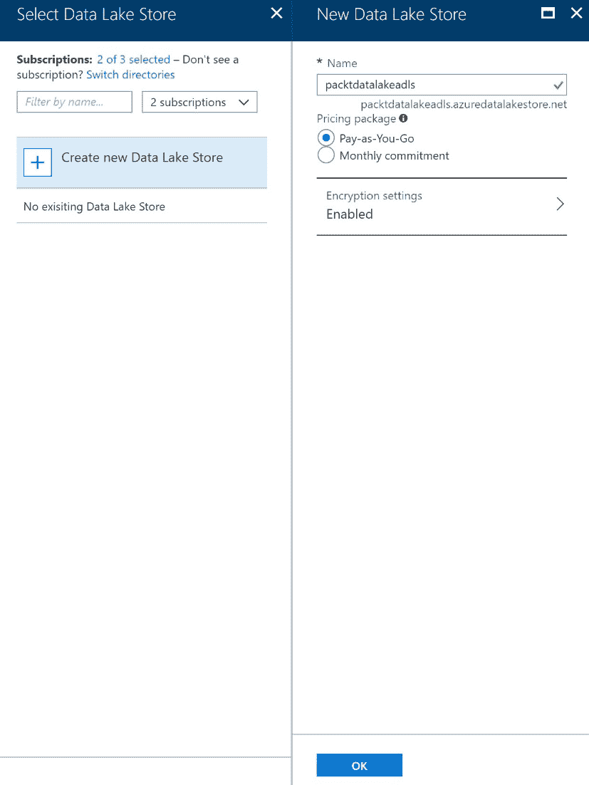

创建一个 Azure 数据湖存储

1.  点击 OK 两次，创建 Data Lake Store 和 Data Lake Analytics 账户。

1.  现在，您可以导航到 Data Lake Analytics 账户。接下来，将示例文件 `SearchLogs.tsv` 上传到 Azure 数据湖存储。点击左侧菜单中的 **数据浏览器**：

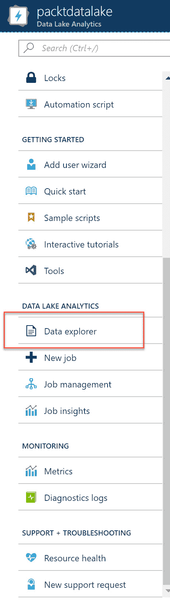

数据浏览器

1.  创建一个新文件夹，并命名为 `input`。将 `SearchLogs.tsv` 上传到该文件夹：

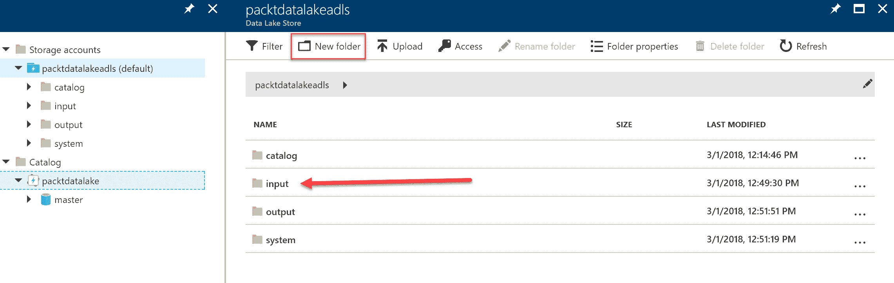

创建一个新的输入文件夹

1.  接下来，点击“新建作业”：

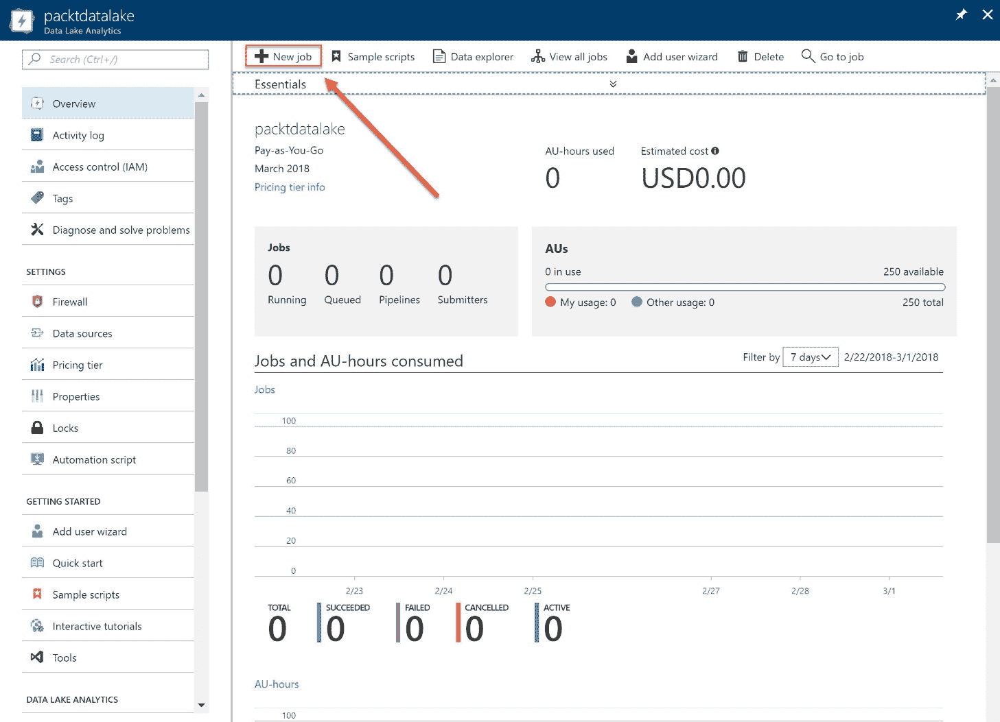

Azure 数据湖概述

1.  为作业命名，并将以下代码添加到其中。该代码从 `SearchLog` 文件中提取原始数据，并创建一个带有标题的新文件，然后将其存储在 Azure 数据湖存储中的 `output` 文件夹中：

```
@searchlog =
    EXTRACT UserId int,
            Start DateTime,
            Region string,
            Query string,
            Duration int?,
            Urls string,
            ClickedUrls string
    FROM "/input/SearchLog.tsv"
    USING Extractors.Tsv();

OUTPUT @searchlog 
    TO "/output/SearchLog-first-u-sql.csv"
    USING Outputters.Csv();
```

1.  运行作业。将显示以下输出：

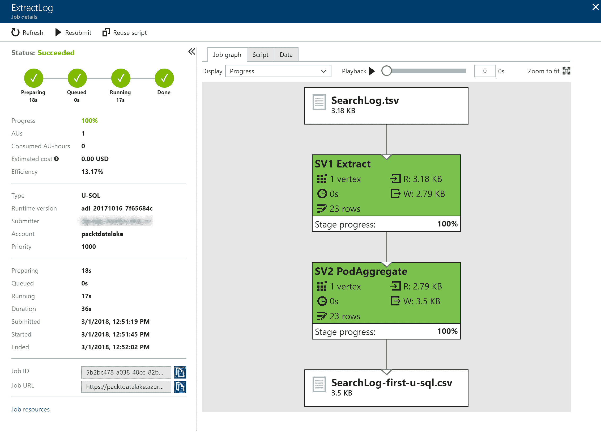

Azure 数据湖输出

1.  现在，您可以在数据浏览器中查看结果。会有一个名为 `output` 的新文件夹，文件存储在该文件夹中。

# Azure HDInsight

Azure HDInsight 是一个服务，它在云中以集群的形式部署 Hadoop 组件。Apache Hadoop 是一个非常流行的开源框架，用于处理和分析大数据。Azure 上的 Hadoop 组件使得数据处理变得非常容易，因为 Azure 处理集群的创建。

HDInsight 提供以下集群类型：

+   **Apache Hadoop**：Hadoop 可以使用 MapReduce 并行处理数据，MapReduce 是一种能够高效处理数据的编程语言。

+   **Apache Spark**：Spark 也可以通过使用内存计算来并行处理数据，以提高性能。您可以将其与 SQL、流数据和机器学习解决方案一起使用。

+   **Apache HBase**：这提供了一个在 Hadoop 上的 NoSQL 数据库，可作为 MapReduce 作业的输入或输出。

+   **Microsoft R Server**：提供用于托管和管理 R 脚本的服务器。R 主要由数据科学家使用，并提供可扩展的方法来分析数据。

+   **Apache Storm**：提供非常快速的数据流处理。您可以使用它来分析实时传感器数据，例如。

+   **Apache 交互式查询（预览）**：Hive 查询现在可以通过内存缓存机制更快地运行。

+   **Apache Kafka**：为数据管道、消息队列和应用程序提供流处理。

Azure HDInsight 使用 Azure Blob 存储和 Azure Data Lake 存储作为存储解决方案。你可以通过使用 HDInsight .NET SDK 等在 Azure HDInsight 上构建应用程序，支持 Java、Python 和 .NET 等语言。

# Azure 分析服务

Azure 分析服务采用与 SQL Server 分析相同的架构，并提供企业级的数据建模功能。

你可以通过将 Azure 分析服务与本地 SQL 分析服务器连接，轻松创建混合环境。然后，可以轻松将来自各种来源的数据（如 SQL Server 分析、SQL Server、Azure SQL Server 等）进行整合。在 Azure 分析服务中，与本地环境相比，模型的处理速度要快得多。这样，像 Power BI、Excel、报告服务以及其他第三方应用程序等客户端应用程序，可以更快速地查询数据并交付仪表盘：

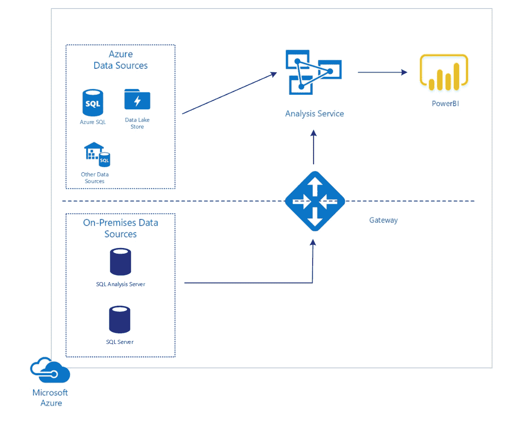

Azure 分析服务

# Azure SQL 数据库

Azure SQL 数据库提供云中的关系数据库。它使用本地 SQL Server 的代码基础，但通过使用 Azure SQL 数据库，而不是本地 SQL Server，你无需管理底层平台、操作系统或购买任何许可证。此外，微软首先发布 Azure SQL 数据库的更新，然后才发布 SQL Server 的更新。

Azure SQL 数据库提供了可扩展性，且不会导致数据库停机。它提供了列式索引，使得查询执行速度更快。还为你的数据库提供了内建监控，并具备自动提高数据库性能的智能功能，同时通过自动备份和时间点恢复提供高可用性。你还可以使用主动地理复制，支持全球应用。

Azure SQL 数据库为你的数据库提供以下层级：

+   **弹性数据库池**：弹性池是一项帮助管理和扩展具有不可预测使用需求的数据库的功能。所有在弹性池中的数据库都部署在同一数据库服务器上，并共享相同的资源。通过管理数据库池而非单个数据库，它们可以共享性能和扩展。此层的性能通过**弹性数据库事务单位**（**eDTU**）来表示。

+   **独立数据库**：如果你有一个性能可预测的数据库，这是一种不错的选择。扩展是为每个数据库单独进行的。此层的性能通过**数据库事务单位**（**DTU**）来表示。

若要了解有关数据库事务单元（DTU）和弹性数据库事务单元（eDTU）的更多信息，请参阅[`docs.microsoft.com/en-us/azure/sql-database/sql-database-what-is-a-dtu`](https://docs.microsoft.com/en-us/azure/sql-database/sql-database-what-is-a-dtu) 文章。

Azure SQL 数据库提供了多种不同的服务计划和定价层次。由于这些定期变化，您可以访问[`azure.microsoft.com/en-us/pricing/details/sql-database/`](https://azure.microsoft.com/en-us/pricing/details/sql-database/)定价页面了解概况。然而，强烈建议您查看适用于 70-535 考试的不同计划。

# SQL Server 扩展数据库

SQL 服务扩展数据库（SQL Service Stretch Database）在 SQL Server 2016 中引入，是一项可以将冷数据从本地 SQL Server 移动或归档到 Azure SQL 数据库的功能。这可以提高本地服务器的性能，同时扩展的数据存储在云端，其他应用程序可以轻松访问。

在 SQL Server 中，您可以将表标记为扩展候选项，SQL Server 会透明地将数据移动到 Azure SQL 数据库。包含大量历史数据的大型事务表可以从启用扩展功能中受益。这些通常是包含数百或数百万行的大型表，不需要频繁查询。

# 高可用性

即使您的数据库托管在 Azure 中，仍然有可能发生故障和停机。在发生停机（例如，完全区域性故障，可能由自然灾害、恐怖袭击、战争、政府行为或外部设备或网络故障等引起）时，您的数据仍然需要能够访问。

若要在 Azure 上创建高可用性的 SQL Server 数据库，您可以使用故障转移组和主动地理复制，这些内容将在接下来的章节中详细介绍。

# 备份和恢复

Azure 会自动为每个服务层创建地理冗余备份。这些备份随后会复制到**只读访问地理冗余存储**（**RA-GRS**）。Azure SQL 数据库每周创建一次完整数据库备份，每小时创建一次差异备份。差异备份会备份自上次完整备份以来发生变化的数据。Azure SQL 数据库还会每 5 到 10 分钟创建一次事务日志备份。

这些备份的保留期限因服务层而异：

+   **基础**：保留期为 7 天

+   **标准**：保留期为 35 天

+   **高级**：保留期为 35 天

这些保留期可以通过创建**长期备份保留策略**进行延长。使用 LTR 策略时，保留期最多可延长至 10 年。备份会被复制到 Azure 恢复服务库，并且数据在静态时进行加密。Azure 恢复服务库管理所有备份，并会自动删除已过期的备份。LTR 策略可以通过 Azure 门户或 PowerShell 创建。

你可以将备份用于以下恢复场景：

+   **时间点恢复**：数据库可以在相同逻辑服务器上的保留策略范围内恢复到任何时间点。将创建一个新的完全可访问的数据库。你可以在每个服务层级以及针对单个数据库和部署在弹性池中的数据库使用时间点恢复。时间点恢复可以通过 Azure 门户、PowerShell 或 REST API 恢复。

+   **已删除数据库恢复**：已删除的数据库可以在删除时恢复到相同的逻辑服务器。你也可以将已删除的数据库恢复到更早的时间点。已删除数据库恢复可以通过 Azure 门户、PowerShell 和 REST API 执行。

+   **地理恢复**：使用地理恢复，你可以将数据库备份恢复到任何区域的任何服务器。只能对地理冗余备份使用地理恢复。手动创建的备份不受支持。此类型的恢复可以通过 Azure 门户、PowerShell 和 REST API 完成。

+   **Azure 恢复服务库恢复**：你可以使用此类型的恢复将数据库恢复到可用保留策略中的某个时间点。通过这种方式，你可以恢复数据库的旧版本，例如用于某个应用程序。此类型的恢复也可以通过 Azure 门户、PowerShell 和 REST API 完成。

# 主动地理复制

地理复制是一项业务连续性功能，允许你在相同或不同的 Azure 区域中复制主数据库，以及最多四个只读的辅助数据库。你可以使用辅助数据库查询数据，或在数据中心发生故障时进行故障切换。主动地理复制必须由用户或应用程序手动设置。

# 故障切换组

故障切换组是一项自动管理故障切换的功能。它自动管理数据库之间的地理复制关系、大规模故障切换以及连接性。要使用故障切换组，主数据库和辅助数据库需要在同一个 Azure 订阅内创建。

自动故障切换支持将同一故障切换组中创建的所有数据库复制到位于不同区域的单个辅助数据库服务器。这与使用主动地理复制不同，后者最多可以复制四个辅助数据库。

你可以通过 Azure 门户、PowerShell、Transact SQL 和 REST API 设置和管理地理复制。

# 配置主动地理复制和故障转移组

在此示例中，我们将为单个数据库设置主动地理复制和故障转移组。请注意，这也可以为弹性池执行：

1.  通过打开 [`portal.azure.com/`](https://portal.azure.com/) 进入 Azure 门户。

1.  首先，创建 SQL 数据库。点击“新建”，然后在搜索框中输入 `SQL 数据库`。

1.  在下一屏幕中，添加创建刀片中的以下设置并点击 **创建**，如下图所示：

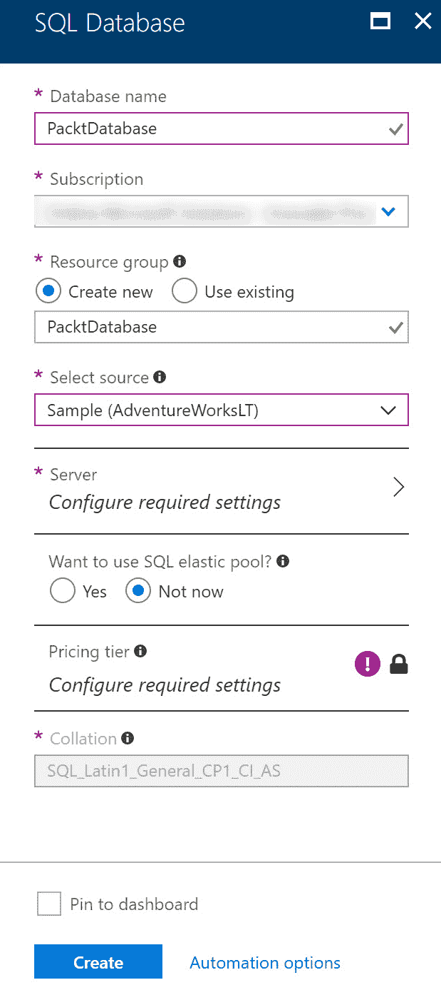

创建 SQL 数据库

1.  点击创建新服务器，添加以下设置，然后点击选择：

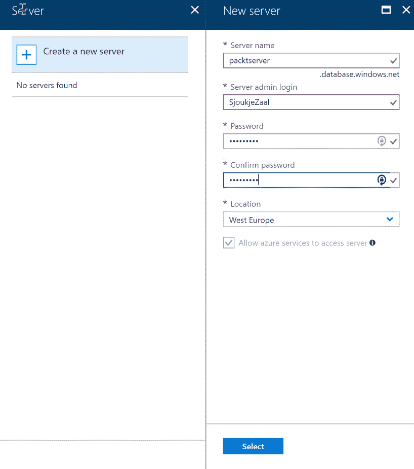

创建 SQL 服务器

1.  点击定价层；在此刀片中，你可以选择定价层以及要为数据库配置的 DTU 和 eDTU。现在，你可以保持默认设置并点击应用：

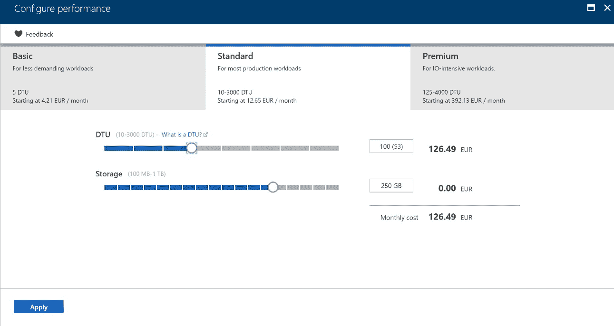

选择定价层

1.  点击创建以创建数据库。

1.  进入数据库，在左侧菜单中点击地理复制。在此，你可以配置希望将数据库复制到哪些区域。你可以选择所有区域，但建议选择配对区域。你还可以点击顶部横幅，为数据库创建故障转移组：

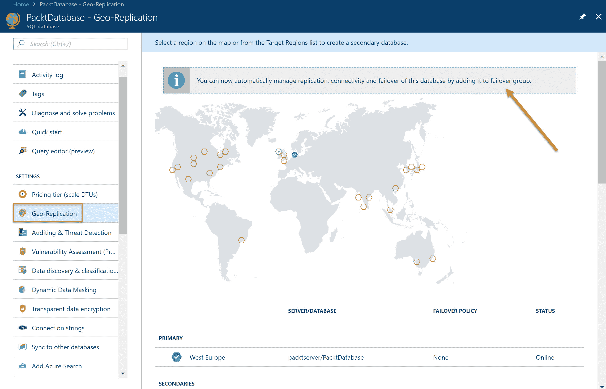

地理复制设置

1.  选择区域后，新的刀片将会弹出。在此处，你需要在新的服务器上创建第二个数据库。创建新服务器的步骤与首次服务器的步骤相同。添加以下设置，然后点击确认：

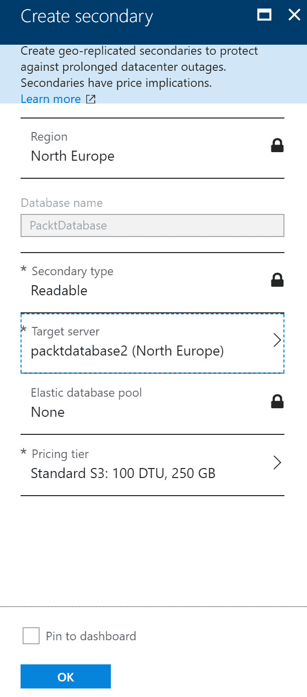

创建辅助服务器

1.  要自动复制数据库，你需要将其添加到故障转移组中。点击横幅并添加以下设置。选择在上一步中创建的辅助数据库作为辅助服务器，然后点击创建：

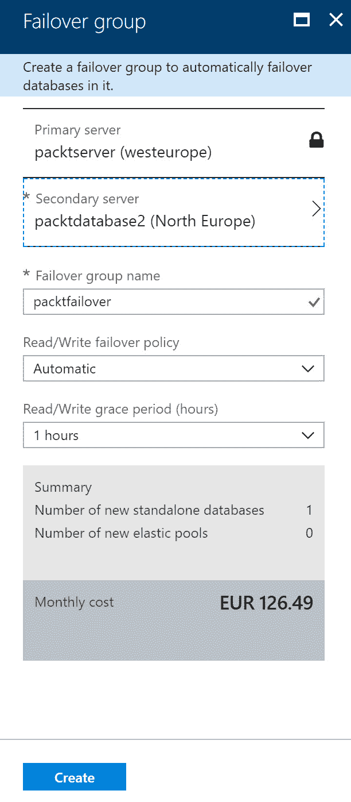

自动故障转移

# Azure MySQL 数据库

Azure MySQL 数据库是云中开源关系型数据库 MySQL 的实现。Azure 提供的服务具有与 MySQL 社区版相同的功能和能力。

MySQL 数据库被 PHP 开发人员广泛使用，许多 PHP 应用程序，如开源 CMS WordPress 等，也使用它。MySQL 提供以下特性和功能：

+   **开源**：MySQL 是开源的，但由 Oracle 拥有。它也提供商业版本。

+   **ACID 合规性**：它提供原子性、一致性、隔离性、持久性（ACID）事务。这确保在发生故障时不会丢失数据。MySQL 在使用 InnoDB 和 NDB 集群存储引擎时提供 ACID 合规性。从 5.6 版本开始，InnoDB 已成为 MySQL 的默认存储引擎。

+   **复制**：MySQL 提供主备复制，包括单个主节点到一个备份节点和多个备份节点、循环复制（A 到 B 到 C，然后返回到 A）和主主复制。

+   **性能**：MySQL 在高负载时可能表现不佳，尤其是在需要执行复杂查询时。它最适合需要简单、直接数据事务的基于 Web 的项目。

+   **安全性**：MySQL 提供基于 **访问控制列表**（**ACLs**）的安全性，适用于所有连接、查询和其他操作。它支持 MySQL 客户端与服务器之间的 SSL 加密连接。

+   **NoSQL 特性**：MySQL 仅提供 JSON 数据类型支持，但不支持 JSON 索引。

+   **可扩展性**：MySQL 不支持可扩展性。

+   **并发性**：MySQL 仅在 InnoDB 中支持多版本并发控制（MVCC）。

+   **编程语言**：只能使用 MySQL 编程语言与数据库中的数据进行通信。

通过在 Azure 上运行 MySQL 数据库，除了 MySQL 提供的所有功能和能力外，微软还提供自动扩展、高可用性、静态数据加密、最多 35 天的自动备份和时间点恢复、企业安全性和合规性等。

Azure 上的 MySQL 提供以下定价层：

+   **基础**：提供最多 1 TB 的存储空间，四个逻辑 CPU 和本地冗余备份。

+   **通用性**：提供最多 1 TB 的存储空间，四个逻辑 CPU，可扩展的 I/O 吞吐量，以及本地冗余和地理冗余备份。

+   **内存优化**：提供最多 1 TB 的存储空间，五个逻辑 CPU，可扩展的 I/O 吞吐量，以及本地冗余和地理冗余备份。

有关 MySQL Community Edition 提供的功能和能力的更多信息，您可以参考 [`www.mysql.com/products/community/`](https://www.mysql.com/products/community/)。

# Azure PostgreSQL 数据库

Azure PostgreSQL 数据库是云中开源关系数据库 PostgreSQL 的一种实现。它也基于开源 PostgreSQL 数据库引擎的社区版本。PostgreSQL 提供了类似 MySQL 的功能，但也有一些差异。

它提供以下功能和能力：

+   **开源**：PostgreSQL 完全开源。

+   **ACID 合规性**：提供 ACID 事务。

+   **复制**：PostgreSQL 提供主备复制，包括单个主节点到一个备份节点和多个备份节点、热备/流复制、双向复制、逻辑日志流复制和级联复制。

+   **性能**：支持各种性能优化，最适合需要执行复杂查询、读写速度至关重要的系统。PostgreSQL 在 OLTP/OLAP 系统和商业智能应用中表现良好。

+   **安全性**：PostgreSQL 提供基于角色的安全性和继承的基于角色的安全性。它为客户端/服务器通信提供本地 SSL 支持，并提供行级安全性。

+   **并发性**：PostgreSQL 拥有完全的多版本并发控制（MVCC）支持，并且在高流量环境中反应极其迅速。

+   **NoSQL 特性**：PostgreSQL 支持 JSON 和其他 NoSQL 特性，如原生 XML 支持、JSON 索引和 HSTORE 中的键值对。

+   **可扩展性**：PostgreSQL 支持可扩展性，例如添加新的函数、类型、新的索引类型等。

+   **编程语言**：提供 JavaScript、.Net、R、C/C++、Java、Perl、Python、Ruby、Tcl 等编程语言扩展。

除了 PostgreSQL 提供的所有功能外，Azure 数据库中的 PostgreSQL 还提供自动扩展、高可用性、静态数据加密、自动备份和时间点恢复等功能。

Azure 上的 PostgreSQL 提供与 Azure 上的 MySQL 相同的定价层：

+   **基础**：提供最多 1 TB 的存储，四个逻辑 CPU，以及本地冗余备份。

+   **通用用途**：提供最多 1 TB 的存储，四个逻辑 CPU，可扩展的 I/O 吞吐量，以及本地冗余和地理冗余备份。

+   **内存优化**：提供最多 1 TB 的存储，五个逻辑 CPU，可扩展的 I/O 吞吐量，以及本地冗余和地理冗余备份。

有关 PostgreSQL 数据库提供的功能和能力的更多信息，您可以参考 [`www.postgresql.org/`](https://www.postgresql.org/)。

# 总结

在本章中，我们已经完成了设计数据实现的目标。我们覆盖了 Azure 提供的各种数据实现解决方案，如各种 Azure 数据服务和 Azure 提供的各种关系型数据库。你现在应该知道在不同的场景中应该使用哪种数据库，如何管理备份和恢复，以及如何设计高可用性和性能。

接下来，我们将开始设计安全性和身份验证解决方案，首先是保护 Azure 资源。

# 问题

回答以下问题，测试你对本章内容的理解。你可以在本书末尾的*评估*部分找到答案：

1.  你可以恢复 Azure 中已删除的数据库吗？

    1.  是的

    1.  不是

1.  你可以使用 SQL Server Stretch Database 将本地数据存储扩展到 Azure 吗？

    1.  是的

    1.  不是

1.  你可以使用 T-SQL 来分析 Azure Data Analytics 中的数据吗？

    1.  是的

    1.  不是

# 进一步阅读

你可以查看以下链接，了解本章涵盖的主题的更多信息：

+   **Azure 数据目录文档**：[`docs.microsoft.com/en-us/azure/data-catalog/`](https://docs.microsoft.com/en-us/azure/data-catalog/)。

+   **开始使用 Azure 数据目录**：[`docs.microsoft.com/en-us/azure/data-catalog/data-catalog-get-started`](https://docs.microsoft.com/en-us/azure/data-catalog/data-catalog-get-started)。

+   **什么是 Azure SQL 数据仓库？**: [`docs.microsoft.com/en-us/azure/sql-data-warehouse/sql-data-warehouse-overview-what-is`](https://docs.microsoft.com/en-us/azure/sql-data-warehouse/sql-data-warehouse-overview-what-is).

+   **Azure 数据湖存储概述**: [`docs.microsoft.com/en-us/azure/data-lake-store/data-lake-store-overview`](https://docs.microsoft.com/en-us/azure/data-lake-store/data-lake-store-overview).

+   **Microsoft Azure 数据湖分析概述**: [`docs.microsoft.com/en-us/azure/data-lake-analytics/data-lake-analytics-overview`](https://docs.microsoft.com/en-us/azure/data-lake-analytics/data-lake-analytics-overview)

+   **Azure HDInsight 介绍及 Hadoop 和 Spark 技术栈**: [`docs.microsoft.com/en-us/azure/hdinsight/hadoop/apache-hadoop-introduction`](https://docs.microsoft.com/en-us/azure/hdinsight/hadoop/apache-hadoop-introduction).

+   **Azure SQL 数据库文档**: [`docs.microsoft.com/en-us/azure/sql-database/`](https://docs.microsoft.com/en-us/azure/sql-database/)

+   **使用 Azure SQL 数据库进行扩展**: [`docs.microsoft.com/en-us/azure/sql-database/sql-database-elastic-scale-introduction`](https://docs.microsoft.com/en-us/azure/sql-database/sql-database-elastic-scale-introduction)

+   **Stretch 数据库**: [`docs.microsoft.com/en-us/sql/sql-server/stretch-database/stretch-database`](https://docs.microsoft.com/en-us/sql/sql-server/stretch-database/stretch-database)

+   **使用 Azure SQL 数据库设计高可用服务**: [`docs.microsoft.com/en-us/azure/sql-database/sql-database-designing-cloud-solutions-for-disaster-recovery`](https://docs.microsoft.com/en-us/azure/sql-database/sql-database-designing-cloud-solutions-for-disaster-recovery)

+   **了解自动 SQL 数据库备份**: [`docs.microsoft.com/en-us/azure/sql-database/sql-database-automated-backups`](https://docs.microsoft.com/en-us/azure/sql-database/sql-database-automated-backups)

+   **使用自动化数据库备份恢复 Azure SQL 数据库**: [`docs.microsoft.com/en-us/azure/sql-database/sql-database-recovery-using-backups`](https://docs.microsoft.com/en-us/azure/sql-database/sql-database-recovery-using-backups)

+   **什么是 Azure MySQL 数据库？**: [`docs.microsoft.com/en-us/azure/mysql/overview`](https://docs.microsoft.com/en-us/azure/mysql/overview).

+   **什么是 Azure PostgreSQL 数据库？**: [`docs.microsoft.com/en-us/azure/postgresql/overview`](https://docs.microsoft.com/en-us/azure/postgresql/overview)
