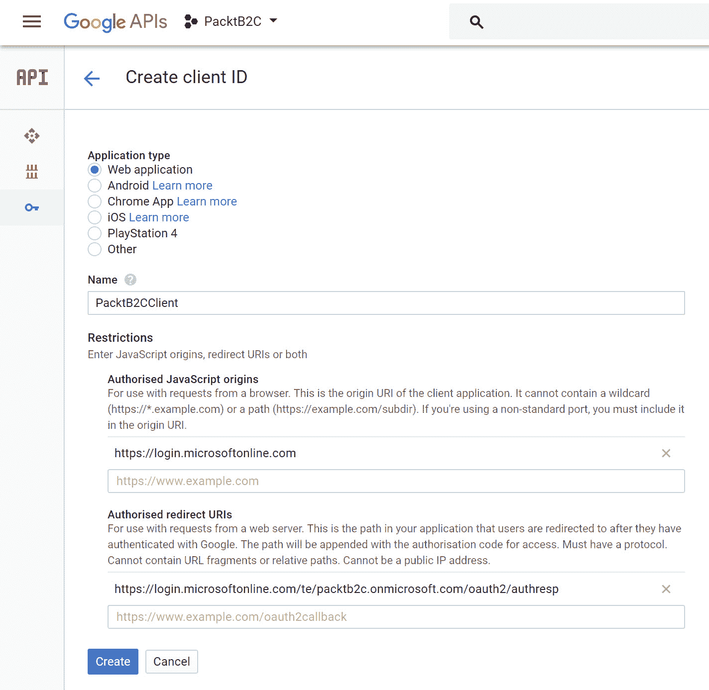

# 第九章：保护您的资源

在上一章中，我们介绍了设计 Azure 数据服务目标的内容。我们涵盖了一些不同的 Azure 数据服务以及 Azure 中的关系数据库。我们还介绍了备份和安全策略以及高可用性和性能设计。

在本章中，您将了解设计安全性和身份解决方案领域的目标，包括如何保护您的资源，例如使用 Azure AD Connect、多因素身份验证（MFA）等。还将介绍如何为您的 Azure 解决方案使用不同的身份提供者。

以下主题将被涵盖：

+   Azure Active Directory（Azure AD）

+   Azure AD Connect

+   Active Directory 联合身份认证服务（ADFS）

+   多因素身份验证

+   Azure Active Directory 企业对企业（Azure AD B2B）

+   Azure Active Directory 企业对消费者（Azure AD B2C）

# 技术要求

本章使用以下工具进行示例：

+   Visual Studio 2017：[`www.visualstudio.com/downloads/`](https://www.visualstudio.com/downloads/)

本章的源代码可以通过以下链接下载：

+   [`github.com/SjoukjeZaal/AzureArchitectureBook/tree/master/Chapter%209/`](https://github.com/SjoukjeZaal/AzureArchitectureBook/tree/master/Chapter%209/)

# Azure Active Directory

Azure Active Directory（Azure AD）提供来自云端的目录和身份管理。它提供传统的用户名和密码身份管理、角色和权限管理。除此之外，还提供更多企业级解决方案，如 MFA、应用监控、解决方案监控和警报。Azure AD 可以轻松与您的本地 Active Directory 集成，以创建混合基础设施。

Azure AD 提供以下定价计划：

+   **Free**：提供最基本的功能，如支持最多 500,000 个对象、SSO、支持 Azure AD Connect 同步和标准安全报告

+   **Basic**：不限制对象数量，提供 99.9% SLA、组功能、自助密码重置和对应用代理的支持

+   **Premium P1**：提供高级报告、MFA、MDM 自动注册、云应用发现和 Azure AD Connect 健康监控

+   **Premium P2**：身份保护和特权身份管理

若要详细了解不同定价计划及每个计划提供的所有功能，您可以参考以下定价页面：[`azure.microsoft.com/en-us/pricing/details/active-directory/`](https://azure.microsoft.com/en-us/pricing/details/active-directory/)。

请注意，Azure AD Premium 是企业移动性 + 安全套件的一部分。

您还可以在自定义应用和 API 中利用 Azure AD 来授权用户并保护您的资源。它支持行业标准协议，如 OAuth2.0 和 OpenID Connect，并支持单租户和多租户应用的身份验证，以及业务线（LOB）应用。

它提供了两个不同的端点，可以在你的自定义应用程序中使用：

+   **V1 端点**：此端点仅支持 Microsoft 工作或学校账户，并使用 Azure Portal 在 Azure AD 中注册应用。它使用 **Azure Active Directory 库**（**ADAL**）SDK 来认证应用程序中的用户。

+   **V2 端点**：此端点同时支持 Microsoft 工作或学校账户和个人账户（如 Outlook.com）。它还提供一个新的注册门户，位于 `apps.dev.microsoft.com`，使得在 Azure AD 中注册应用程序变得更加容易。它使用 **Microsoft 身份验证库**（**MSAL**）来认证应用程序中的用户。使用此端点，你可以为多平台应用创建一个单一的 App ID。如果你的应用程序由独立的 Web、Android 和 iOS 应用组成，它们可以使用相同的 App ID。你可以使用动态授权，在应用程序本身需要权限时再进行授权，而不是在 Azure AD 中注册应用时预先授权。

# Microsoft Graph

Microsoft Graph 是一组 API，它将多个 Azure 服务连接在一起，并为开发者提供一个单一的端点，用于在自定义应用程序中使用。

Microsoft Graph 由各种 Azure 服务之间的关系构成。通过调用特定用户的端点（该用户已添加到 Azure AD 中），你可以检索用户正在处理的文档，找到他的/她的经理，获取用户的会议列表，列出设备等。

Azure AD 也集成在 Microsoft Graph 中，但它不仅仅可以用于 Azure AD 的功能。事实上，几乎所有 Azure 的 SaaS 产品都使用 Azure AD，例如 Office 365、Intune、Dynamic 365 和 Azure SQL。所有这些 Azure 服务都集成在 Microsoft Graph 中，可以在你的应用和 API 中使用。

Microsoft Graph 提供了两个不同的端点，一个是 V1.0 端点，它包含了所有正式发布的 API；另一个是 beta 端点，后者提供的 API 可能会随着时间的推移发生变化。

要开始使用 Graph API 并在 Azure AD 中注册你的应用程序，可以参考：[`developer.microsoft.com/en-us/graph`](https://developer.microsoft.com/en-us/graph)。这是一个很好的起点，你还可以下载适用于多种编程语言的安全示例应用程序。

有关所有集成在 Microsoft Graph 中的 Azure 服务的概述，你也可以参考这个网站。

# Azure AD Connect

Azure AD Connect 是一个服务，允许你将本地 Active Directory 身份与 Azure 同步。这样，你可以在本地环境和云环境及其他 SaaS 应用中使用相同的身份进行身份验证。

Azure AD Connect 同步服务由两个部分组成：Azure AD Connect 同步组件，这是一个安装在您本地环境中单独服务器上的工具，以及 Azure AD Connect 同步服务，这是 Azure AD 的一部分。同步组件可以将数据从 Active Directory 和 SQL Server 同步到 Azure。还有一个名为 Active Directory 联合身份验证服务（ADFS）组件的第三个组件，可以在涉及 ADFS 的场景中使用。要监控本地身份基础设施和不同的 Azure AD 组件，您可以使用一个名为 Azure AD Connect Health 的工具。


Azure AD Connect 架构

有关如何安装 Azure AD Connect 并同步用户帐户和密码的更多信息，请参考 [`docs.microsoft.com/en-us/azure/active-directory/connect/active-directory-aadconnect-select-installation`](https://docs.microsoft.com/en-us/azure/active-directory/connect/active-directory-aadconnect-select-installation)。有关监控健康状况的更多信息，请参考：[`docs.microsoft.com/en-us/azure/active-directory/connect-health/active-directory-aadconnect-health`](https://docs.microsoft.com/en-us/azure/active-directory/connect-health/active-directory-aadconnect-health)。

Azure AD Connect 提供支持，允许用户使用相同的密码登录本地和云资源。为此提供了三种不同的身份验证方法：密码哈希同步方法、直通身份验证方法和联合单点登录方法（与 Active Directory 联合身份验证服务配合使用）。

这三种不同的身份验证方法将在接下来的部分中详细介绍。

# Azure Active Directory 密码哈希同步

大多数组织只需要启用用户登录到 Office 365、SaaS 应用程序和其他基于 Azure AD 的资源。密码哈希同步方法非常适合这种场景。

使用此方法，用户的密码哈希在本地 Active Directory 和 Azure Active Directory 之间同步。当用户密码发生变化时，密码会立即同步，因此用户可以始终使用相同的凭证在本地和 Azure 中登录。

此认证方法还提供 Azure AD 无缝单点登录（SSO）。这样，用户在公司网络上使用域加入设备时，系统会自动登录。使用无缝 SSO 时，用户只需输入用户名。为了使用无缝 SSO，您无需在本地网络上安装额外的软件或组件。您可以通过组策略将此功能推送给用户。

# Azure Active Directory 直通认证

Azure Active Directory 直通认证提供相同的功能，例如 Azure AD 密码哈希同步。用户可以使用相同的凭据登录到其 Azure 资源以及本地资源。不同之处在于，使用直通认证时，密码不会与 Azure AD 同步。密码是在本地 Active Directory 中验证的，完全不会存储在 Azure Active Directory 中。

这种方法适用于那些有安全性和合规性限制的组织，这些组织不允许将用户名和密码发送到本地网络之外。

直通认证需要在本地网络内安装一个代理在域加入的 Windows Server 上。该代理会监听密码验证请求，并仅从您的网络内发起外部连接。它还支持 MFA 和 Azure AD 条件访问策略。

Azure AD 直通认证还提供 Azure AD 无缝 SSO。

# Active Directory 联邦服务

Active Directory 联邦服务（ADFS）是一项基于标准的服务，是 Windows Server 的一项功能，您可以在 Windows Server 机器上启用它。它为外部用户提供一个身份验证提供者，使其能够通过互联网登录到本地环境。

ADFS 提供以下功能：

+   **Web SSO**：当联合用户访问安装在本地数据中心的应用程序时，提供 SSO。

+   **Web 服务（WS）- 互操作性**：不使用 Windows 身份模型但兼容 WS-Federation 规范的应用程序或用户，仍然可以通过 ADFS 服务器对其进行身份验证，并访问本地应用程序。

+   **无外部用户帐户管理**：外部用户可以使用其所属组织或个人凭证进行身份验证。在 ADFS 中，使用外部身份验证提供者和 ADFS 建立信任。然后，用户可以通过安全声明标记语言（SAML）声明进行联合身份验证。

联合 SSO 认证方法使用 Azure AD Connect 与 ADFS 结合，为用户提供联合单点登录。您可以将 ADFS 部署在本地数据中心或使用 Azure 虚拟机。您可以使用相同的 Azure AD API，如 Microsoft Graph，连接到本地身份。Azure Active Directory 负责通过 ADFS 连接到您的本地环境，并处理认证过程。

你还可以使用 ADFS 扩展 Azure AD 的功能。你可以实现自定义声明或条件策略，这些功能在 Azure AD 中不存在，或者使用你的组织登录屏幕，添加额外的通知或信息，或者使用自定义 MFA 提供商。你还可以使用 ADFS 在不同的环境之间创建信任。

# 多因素身份验证

在今天的世界中，保护数据和系统至关重要。MFA 为用户登录增加了第二层安全性，并且现在已成为保护数据的最佳实践。它启用两步验证，你首先使用你所知道的信息登录，然后使用你所拥有的信息进行验证。

Azure MFA 使用以下验证方法：

+   **你知道的东西**：这类似于传统密码。

+   **你拥有的东西**：这类似于手机，通过发送短信、使用验证应用程序或接听电话来进行验证。Azure MFA 还支持第三方 OAUTH 令牌。

+   **你是谁**：这类似于生物识别技术，通过指纹或面部识别进行验证。

Azure MFA 是 Office 365 和 Azure 服务的一部分。它易于设置，你可以选择要为用户使用的验证方法。当你需要将 MFA 添加到未通过 Azure 应用程序代理发布到云中的本地应用程序时，你也可以选择部署本地 MFA 服务器。

如果你想了解更多有关本地 MFA 服务器的信息及其提供的功能，你可以参考：[`docs.microsoft.com/en-us/azure/multi-factor-authentication/multi-factor-authentication-get-started-server.`](https://docs.microsoft.com/en-us/azure/multi-factor-authentication/multi-factor-authentication-get-started-server)

Azure MFA 包含在 Azure Active Directory Premium 计划和企业移动性与安全套件中。你也可以将其作为独立产品购买。

你还可以在自定义应用程序中使用 MFA SDK 来实现 MFA。用户可以使用现有的凭证登录应用程序。该应用程序向 Azure MFA 服务发送请求，Azure MFA 服务将向电话或其他设备发送请求。用户通过身份验证后，Azure MFA 服务将响应返回给应用程序，从而完成用户登录。MFA SDK 支持多种编程语言，如 C#、PHP、Ruby 和 Java。

# 在 Azure 门户中启用 MFA

要在 Azure 门户中启用 MFA，请按照以下步骤操作：

1.  通过打开 [`portal.azure.com/`](https://portal.azure.com/) 导航到 Azure 门户。

1.  在左侧菜单中点击 Azure Active Directory。

1.  在下一个窗格中，点击**用户**。然后在顶部菜单中点击 **多因素身份验证**：


启用 MFA - Azure 门户

1.  将打开 MFA 门户，你可以为每个用户启用 MFA。

# 在 Office 365 中启用 MFA

要在 Office 365 管理中心启用 MFA，请按照以下步骤操作：

1.  通过打开[`portal.office.com/adminportal/home`](https://portal.office.com/adminportal/home) 进入 Office 365 管理中心。

1.  进入“用户 | 活跃用户”。点击“更多 | 设置 Azure 多重身份验证”，如下面的截图所示：


启用 MFA - Office 365 管理中心

1.  Office 365 的 MFA 门户已打开，外观与 Azure MFA 门户基本相同。

# Azure Active Directory Business to Business

Azure Active Directory Business to Business (B2B) 是 Azure Active Directory 的一项功能，使组织能够安全地与外部用户合作。要加入 Azure B2B，外部用户不需要拥有 Microsoft 工作或个人账户，并将其添加到现有的 Azure AD 租户中。各种账户都可以加入 Azure B2B。你无需在 Azure 门户中进行任何配置即可使用 B2B；此功能默认对所有 Azure AD 租户启用。

Azure B2B 与 Office 365 集成，支持外部共享。它还提供可以在自定义应用程序中使用的 API，让内部和外部用户都能进行身份验证。

Azure AD 免费功能对外部用户开放且无需收费。然而，如果你希望外部用户使用 Azure AD Premium 功能，如多重身份验证（MFA）和条件访问，你需要有足够的 Azure AD Premium 许可证，比例为 5:1。这意味着每购买一个 Azure AD Premium 许可证，你可以添加五个外部用户。因此，举例来说，如果你的组织想要添加 50 个外部用户到 Azure B2B，你需要购买 10 个 Azure AD Premium 许可证。

Azure AD B2B 提供以下功能：

+   **管理门户**：为外部组织提供的单独门户，管理员可以在其中添加、管理和删除用户。

+   **组**：你可以为外部用户创建组。你也可以使用动态组。管理员可以设置规则，根据用户属性自动填充组。

+   **条件访问**：通过条件访问，你可以为用户设置某些条件。你可以强制外部用户使用 MFA，或只允许他们访问某些应用程序，或仅允许从特定位置访问。

+   **共享策略**：不仅管理员可以邀请外部用户。你可以使用策略将这些权限委派给其他外部用户。你可以将“访客邀请者”角色分配给用户，这样该用户就可以发送邀请。

+   **审计和报告**：与普通用户一样，也有审计和报告功能。你可以查看邀请历史和接受详情。

# Azure Active Directory Business to Consumer

Azure Active Directory Business to Consumer (B2C) 是一种用于移动和 Web 应用程序的云身份管理解决方案。它提供开箱即用的身份验证提供程序，可以通过 MSAL 在你的应用程序和自定义 API 中使用，这也是其他 Azure AD 应用程序所使用的（使用 V2 端点）。

这意味着开发人员无需手动添加额外的 SDK；所有这一切都由 Microsoft 处理。接下来，除了 Microsoft 提供的身份验证提供程序外，它还提供了添加您自己身份验证提供程序的能力。

Azure AD B2C 提供以下身份验证提供程序：

+   **社交帐户**：它们是 Facebook、Google、LinkedIn 等

+   **企业帐户**：它们使用开放标准协议，如 OpenID Connect 或 SAML

+   **本地帐户**：它们是使用电子邮件地址/用户名和密码的帐户。

您的应用程序需要在 Azure B2C 租户内注册。注册后，可以为该应用配置内置策略，您可以启用不同的身份验证方法、设置声明、启用 MFA 或创建密码重置策略，供应用使用。

然后，您将所需的配置设置添加到您注册在 Azure B2C 租户中的应用程序的代码中，并且所有前面提到的设置都可以在没有进一步配置的情况下使用。

您可以参考以下网站获取更多有关 Azure AD B2C 的信息：[`docs.microsoft.com/en-us/azure/active-directory-b2c/active-directory-b2c-overview`](https://docs.microsoft.com/en-us/azure/active-directory-b2c/active-directory-b2c-overview)。

# 在您的应用程序中利用 Azure AD B2C

在此演示中，我们创建一个利用 Azure AD B2C 功能进行身份验证的应用程序。此过程分为两个步骤，首先是在 Azure 门户中创建一个 Azure AD B2C 租户，然后是创建该应用程序。

在 Azure 门户中创建 Azure AD B2C 租户，请按照以下步骤操作：

1.  通过打开 [`portal.azure.com/`](https://portal.azure.com/) 访问 Azure 门户。

1.  点击新建，在搜索框中输入 `Azure Active Directory B2C`。创建一个新的租户：


创建 Azure B2C 租户

1.  选择创建新的 Azure AD B2C 租户，添加以下设置，然后点击创建：


添加设置

1.  您可以通过打开 Azure 门户右上角的菜单来选择租户：


选择 Azure B2C 租户

1.  创建后，您可以导航到门户中的 Azure B2C 页面。

现在，您可以在 B2C 租户中设置不同的身份验证提供程序。在此演示中，我添加了一个 Google 身份提供程序。要添加此提供程序，您可以参考教程：[`docs.microsoft.com/en-us/azure/active-directory-b2c/active-directory-b2c-setup-goog-app`](https://docs.microsoft.com/en-us/azure/active-directory-b2c/active-directory-b2c-setup-goog-app)。

1.  接下来要做的是注册应用程序。在左侧菜单中点击“应用程序”，然后点击“添加”按钮：


在 Azure B2C 中注册应用程序

1.  我们将创建一个 Web 应用程序来进行 Azure B2C 身份验证。我们使用 OpenID Connect 进行登录，因此你需要启用“允许隐式流”（Allow implicit flow）。你还需要添加回复 URL。添加以下设置并点击“创建”：


添加应用程序设置

1.  当应用程序创建完成后，点击该应用程序。将应用程序 ID 复制到记事本中。还需要复制应用程序密钥。在左侧菜单中点击“密钥”（Keys），然后点击生成密钥（Generate key）：


生成密钥

1.  立即点击保存并将密钥复制到记事本中。

1.  接下来要做的是创建一个 Google 身份提供者。打开左侧菜单中的身份提供者（Identity providers），然后点击“添加”按钮：


添加 Google 身份提供者

1.  在下一个面板中，选择以下设置：


选择 Google

1.  打开一个新的浏览器标签页并访问：[`console.developers.google.com`](https://console.developers.google.com)。创建一个新项目并命名为`PacktB2C`。返回 API 主页并在左侧菜单中点击凭据（Credentials）：


获取应用程序凭据

1.  点击顶部菜单中的 OAuth 同意屏幕设置，添加以下内容，然后点击保存：


OAuth 同意设置

1.  点击顶部菜单中的凭据同意设置（Credentials consent settings），然后添加以下设置：


创建 OAuth 凭据

1.  添加以下设置以创建应用程序：



注册应用程序

1.  一个弹出窗口会显示客户端 ID 和客户端密钥。将其复制到记事本中。

1.  返回 Azure 门户，将客户端 ID 和客户端密钥添加到我们注册身份提供者的面板中，然后点击“确定”：


添加客户端 ID 和客户端密钥

1.  接下来，你需要添加登录策略。在左侧菜单中点击此项，然后点击“添加”（Add）。添加以下设置：


添加策略

1.  选择以下应用程序声明并点击“确定”，然后点击“创建”：


选择 Google 声明

1.  示例应用程序可以从 GitHub 下载。打开应用程序的`Web.config`文件，并用之前复制到记事本中的值更新设置。它应该如下所示：

```
<appSettings>
    <add key="webpages:Version" value="3.0.0.0" />
    <add key="webpages:Enabled" value="false" />
    <add key="ClientValidationEnabled" value="true" />
    <add key="UnobtrusiveJavaScriptEnabled" value="true" /> 
    <add key="ida:Tenant" value="packtb2c.onmicrosoft.com" />
    <add key="ida:ClientId" value="0c321f85-2f11-402a-84d7-0e3823947038" />
    <add key="ida:ClientSecret" value="3Tc\(J3.A7w1emrm.v4r|Dxj" />
    <!--<add key="ida:AadInstance" value="https://login.microsoftonline.com/tfp/{0}/{1}/v2.0/.well-known/openid-configuration" />-->
    <add key="ida:AadInstance" value="https://login.microsoftonline.com/{0}/v2.0/.well-known/openid-configuration?p={1}" />
    <add key="ida:RedirectUri" value="https://localhost:44316/" />
    <add key="ida:SignInPolicyId" value="B2C_1_PacktSigninGoogle" />
  </appSettings>
```

1.  运行应用程序并点击登录按钮。确保应用程序在你已在 Azure 门户配置为回复 URL 的 IP 地址上运行：


登录应用程序

1.  现在，你可以使用你的 Google 账户进行登录。

# 总结

本章中，我们介绍了如何利用 Azure 提供的不同功能来保护你的资源。我们讲解了 Azure Active Directory，以及如何使用 Azure AD Connect 设计混合环境。我们还讨论了 ADFS、Azure B2B 和 Azure B2C。

下一章将讲解如何保护你的数据。

# 问题

回答以下问题，以测试你对本章内容的理解。你可以在本书最后的*评估*部分找到答案：

1.  你正在创建一个利用 Office 365 数据的会议应用程序。用户应该能够使用他们的 Azure Active Directory 凭据登录。你可以使用 Microsoft Graph 来实现吗？

    1.  是

    1.  否

1.  你想创建一个混合环境，并为本地应用程序和云应用程序都使用单一登录。你应该使用 Azure AD Connect 来实现吗？

    1.  是

    1.  否

1.  Azure AD B2B 是否是启用 SharePoint Online 环境中的外部共享的合适解决方案？

    1.  是

    1.  否

# 深入阅读

你可以查看以下链接，获取有关本章涵盖主题的更多信息：

+   **Azure Active Directory 文档**：[`docs.microsoft.com/en-us/azure/active-directory/`](https://docs.microsoft.com/en-us/azure/active-directory/)

+   **Azure AD Connect 同步**：了解和定制同步：[`docs.microsoft.com/en-us/azure/active-directory/connect/active-directory-aadconnectsync-whatis`](https://docs.microsoft.com/en-us/azure/active-directory/connect/active-directory-aadconnectsync-whatis)

+   **Azure AD Connect 用户登录选项**：[`docs.microsoft.com/en-us/azure/active-directory/connect/active-directory-aadconnect-user-signin`](https://docs.microsoft.com/en-us/azure/active-directory/connect/active-directory-aadconnect-user-signin)

+   **Active Directory 联合身份认证服务**：[`msdn.microsoft.com/en-us/library/bb897402.aspx`](https://msdn.microsoft.com/en-us/library/bb897402.aspx)

+   **在 Azure 中部署 Active Directory 联合身份认证服务**：[`docs.microsoft.com/en-us/azure/active-directory/connect/active-directory-aadconnect-azure-adfs`](https://docs.microsoft.com/en-us/azure/active-directory/connect/active-directory-aadconnect-azure-adfs)

+   **多重身份验证文档**：[`docs.microsoft.com/en-us/azure/multi-factor-authentication/`](https://docs.microsoft.com/en-us/azure/multi-factor-authentication/)

+   **什么是 Azure AD B2B 协作？**：[`docs.microsoft.com/en-us/azure/active-directory/active-directory-b2b-what-is-azure-ad-b2b`](https://docs.microsoft.com/en-us/azure/active-directory/active-directory-b2b-what-is-azure-ad-b2b)

+   **Azure Active Directory B2C：为使用 Microsoft 帐户的消费者提供注册和登录功能**：[`docs.microsoft.com/en-us/azure/active-directory-b2c/active-directory-b2c-setup-msa-app`](https://docs.microsoft.com/en-us/azure/active-directory-b2c/active-directory-b2c-setup-msa-app)

+   **Azure Active Directory B2C：为使用 Facebook 账户的消费者提供注册和登录功能**：[`docs.microsoft.com/en-us/azure/active-directory-b2c/active-directory-b2c-setup-fb-app`](https://docs.microsoft.com/en-us/azure/active-directory-b2c/active-directory-b2c-setup-fb-app)

+   **Azure Active Directory B2C：为使用 Google+ 账户的消费者提供注册和登录功能**：[`docs.microsoft.com/en-us/azure/active-directory-b2c/active-directory-b2c-setup-goog-app`](https://docs.microsoft.com/en-us/azure/active-directory-b2c/active-directory-b2c-setup-goog-app)

+   **Azure Active Directory B2C：注册你的应用程序**：[`docs.microsoft.com/en-us/azure/active-directory-b2c/active-directory-b2c-app-registration`](https://docs.microsoft.com/en-us/azure/active-directory-b2c/active-directory-b2c-app-registration)

+   **Azure Active Directory B2C：在面向消费者的应用程序中启用多重身份验证**：[`docs.microsoft.com/en-us/azure/active-directory-b2c/active-directory-b2c-reference-mfa`](https://docs.microsoft.com/en-us/azure/active-directory-b2c/active-directory-b2c-reference-mfa)
