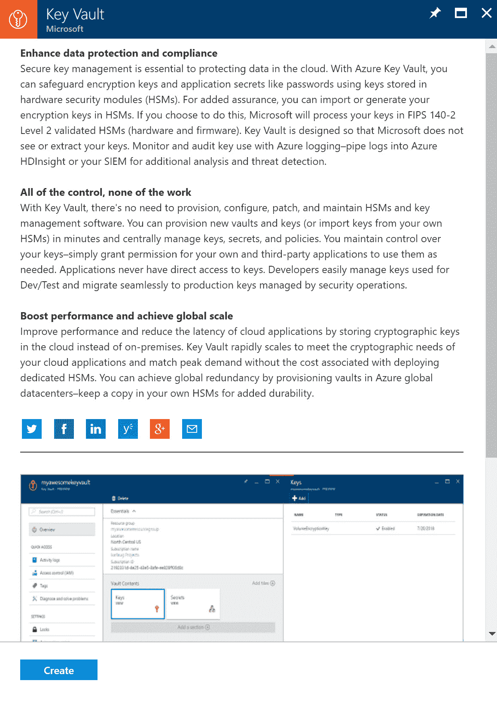
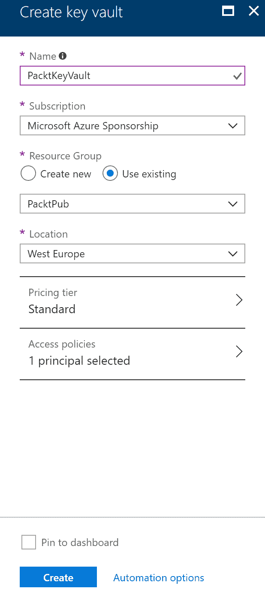
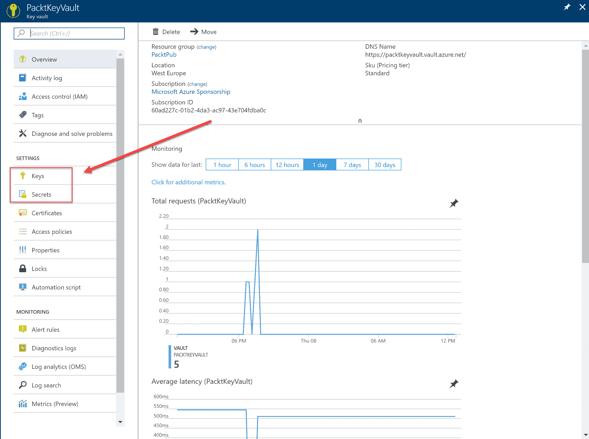
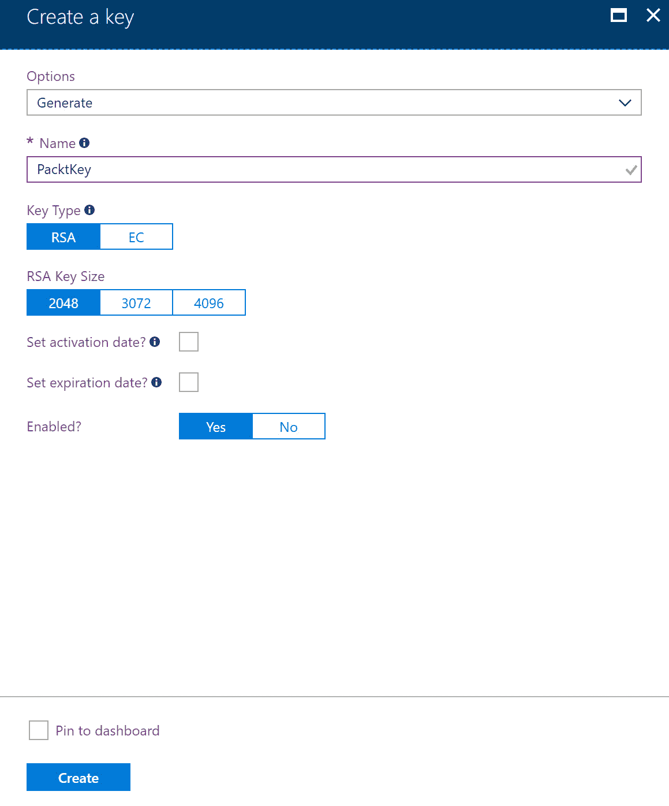
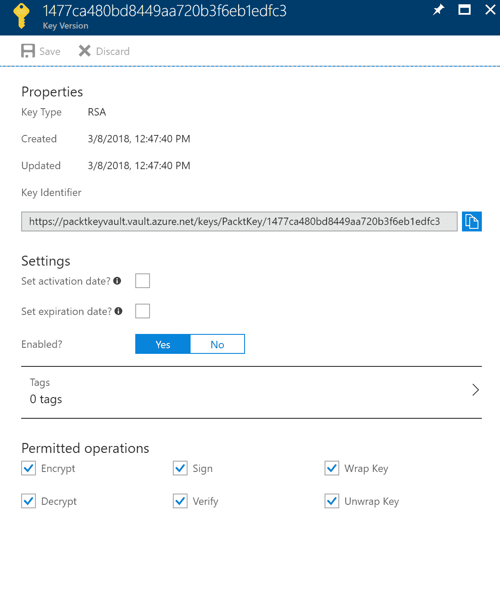
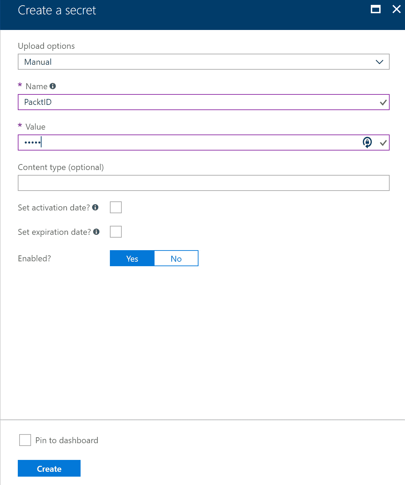
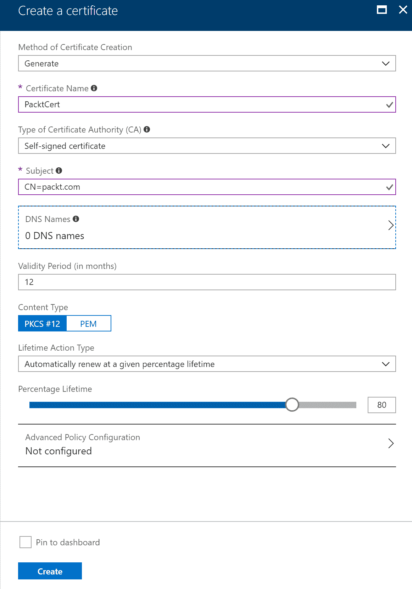
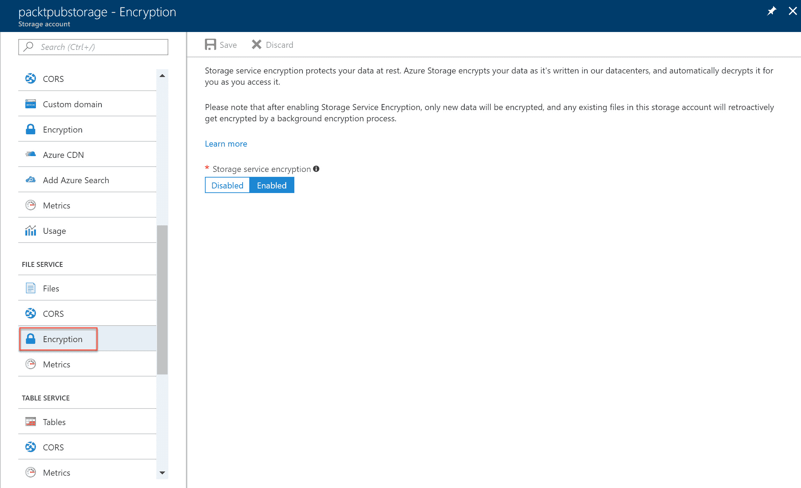
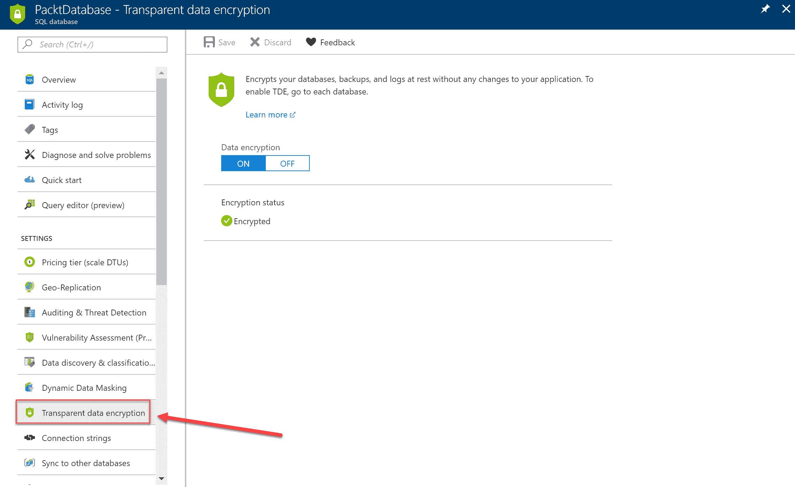
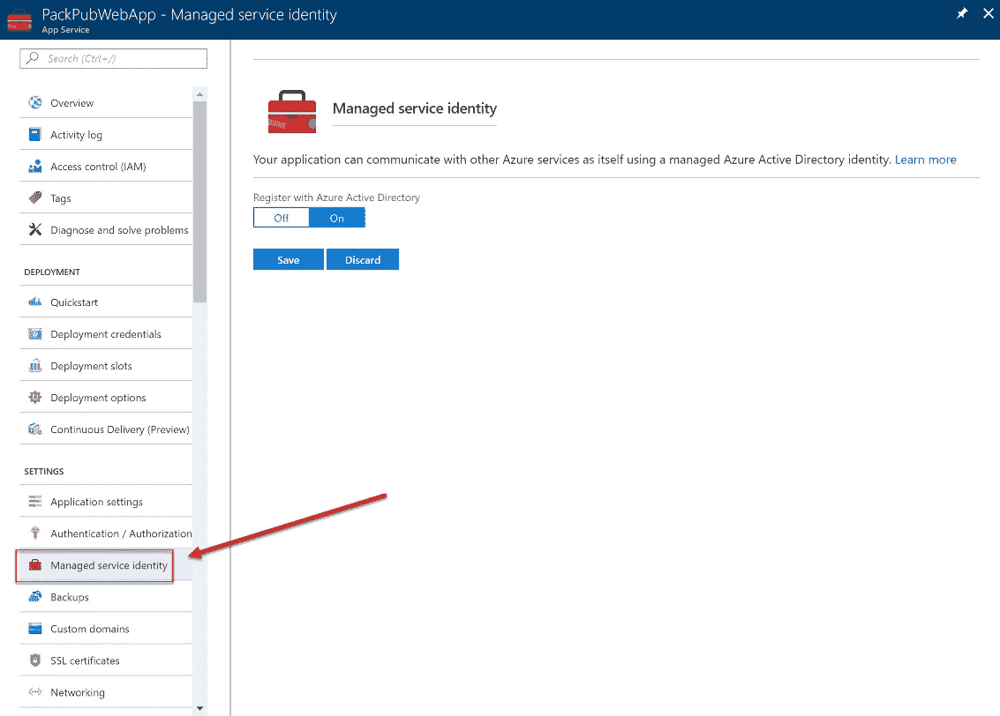

# 保护您的数据

在上一章中，我们介绍了如何保护您的资源。我们讲解了如何使用 Azure Active Directory、Azure B2B 等服务设计解决方案，并讨论了何时使用这些不同的 Azure 服务。

本章将介绍如何为 Azure 服务设计数据安全解决方案，例如使用 Azure 存储加密、Azure 磁盘加密和 Azure 密钥保管库。

本章结束时，您将了解如何使用 Azure 中的不同安全功能来保护您的数据。

以下主题将被涵盖：

+   Azure 密钥保管库

+   Azure 存储加密

+   Azure 磁盘加密

+   Azure SQL 数据库安全

+   Azure AD 托管服务标识

# 技术要求

本章使用以下工具作为示例：

+   Azure PowerShell: [`docs.microsoft.com/en-us/powershell/azure/install-azurerm-ps?view=azurermps-5.1.1`](https://docs.microsoft.com/en-us/powershell/azure/install-azurerm-ps?view=azurermps-5.1.1)

本章的源代码可以从以下链接下载：

+   [`github.com/SjoukjeZaal/AzureArchitectureBook/tree/master/Chapter%2010`](https://github.com/SjoukjeZaal/AzureArchitectureBook/tree/master/Chapter%2010)

# Azure 密钥保管库

您可以将加密密钥和机密存储在 Azure 密钥保管库中，这些密钥可以被各种 Azure 服务和自定义应用程序使用。Azure 使用它来存储 Azure 存储服务加密和 Azure 磁盘加密的密钥，这些将在本章后续介绍。然而，您也可以将应用程序客户端 ID 和密钥存储在其中，并在自定义应用程序中检索它们。这样，您就不再需要将这些 ID 和密钥存储在 web.config 中，而是可以从一个位置进行管理，确保它们安全且受到保护，且该位置位于 Azure 门户中。您还可以存储证书和其他身份验证密钥，并为密钥的使用提供监控解决方案。Azure 密钥保管库与 Azure AD 集成，您可以设置访问策略，控制不同用户和组对存储在其中的密钥的访问权限。

Azure 密钥保管库有两种服务层级：

+   **标准**：提供地理扩展和可用性。

+   **高级**：提供地理可用性和对硬件安全模块（HSM）的支持，通过为 HSM 密钥提供备份。HSM 是专门用于加密操作的计算机。将操作处理交由硬件本身可以提供更好的性能和安全性。密钥和机密在 Azure 密钥保管库中被加密，并且添加了一些额外的属性，确保只能由特定的 HSM 使用。

# 在 Azure 门户中创建 Azure 密钥保管库

在 Azure 门户中创建 Azure 密钥保管库服务并向其中添加密钥、机密和证书，请按以下步骤操作：

1.  通过打开 [`portal.azure.com/`](https://portal.azure.com/) 访问 Azure 门户。

1.  点击“新建”并在搜索栏中输入 `Key Vault`。创建一个新的密钥保管库：



创建新的 Azure 密钥保管库

1.  添加以下设置并点击创建：



添加 Azure 密钥保管库设置

1.  一旦密钥保管库（Key Vault）创建完成，你可以从左侧菜单中添加密钥和密钥：



密钥保管库设置

1.  点击密钥（Keys），然后点击生成/导入。在这里，你可以设置多个选项，如密钥类型和密钥大小。添加以下设置并点击创建：



添加密钥

1.  如果点击密钥并进入其属性，你会看到你可以使用此密钥执行多种操作；你可以加密、解密、签名和验证数据，或者使用封装密钥（Wrap Key）和解封装密钥（Unwrap Key）操作来保护其他密钥：



密钥属性

1.  要创建密钥，请点击左侧菜单中的密钥（Secret），然后点击生成/导入。例如，你可以添加应用程序密钥和应用程序密钥。添加以下设置并点击创建：



添加密钥

1.  要创建或上传证书，请点击左侧菜单中的**证书**，然后点击生成/导入。在这里，你还可以添加证书颁发机构并让它们颁发证书。我们现在为此示例创建一个自签名证书：



创建证书

1.  点击创建。证书创建可能需要一些时间。

# 在 ARM 模板中使用 Azure 密钥保管库的密钥

除了在自定义应用程序中使用 Azure 密钥保管库，你还可以在 ARM 模板中使用密钥。你可以将密钥添加到参数 JSON 文件中。参见以下示例，看看你的参数应该是什么样子：

```
"packtPassword": {
"reference": {
"keyVault": {
    "id": "/subscriptions/<subscription id>/resourceGroups/examplegroup/providers/Microsoft.KeyVault/vaults/<vault-name>"
             },
         "secretName": "packtsecret"
   }
},
```

这应该能给你一个关于如何在 ARM 模板中嵌入密钥的印象。关于如何创建 ARM 模板的完整教程，你可以参考以下文章：[`docs.microsoft.com/en-us/azure/azure-resource-manager/resource-manager-keyvault-parameter`](https://docs.microsoft.com/en-us/azure/azure-resource-manager/resource-manager-keyvault-parameter)。

# Azure 存储服务加密

Azure 存储默认提供数据静态加密（SSE）。当数据在应用程序和 Azure 之间传输时，使用 HTTPS 进行加密；并且当数据写入存储帐户时，使用 256 位 AES 加密进行加密。你还可以使用 SMB 3.0 或 VPN 连接安全地将数据传输到 Azure。一旦数据再次被访问，它会被解密，并通过 HTTPS 发送回去。Azure 自动管理存储加密密钥，保存在 Azure 密钥保管库中。SSE 用于表、文件、队列和 Blob 存储，适用于标准和高级定价计划，支持所有冗余级别和所有地区。

你可以在 Azure 门户、PowerShell、CLI、REST API 和 Azure 存储 SDK 中设置存储帐户的加密。默认情况下已启用，因此你不必在 PowerShell 脚本中手动设置此项：



Azure 存储服务加密设置

你还可以在自定义代码中使用客户端加密。Azure 存储客户端库（.NET）支持此功能。这也与 Azure 密钥保管库配合使用。SDK 创建一个内容加密密钥（CEK），用于在数据发送到存储帐户之前对数据进行加密。加密密钥默认存储在 Azure 密钥保管库中，但你也可以使用自定义提供程序。使用客户端加密将会在数据发送到 Azure 之前以及存储在存储帐户内的瞬间对数据进行加密。

SSE 有一个限制，那就是只有在启用加密时创建的数据才会被加密。因此，如果你曾在某个时间点禁用了存储帐户的加密，存储帐户中的数据将不再被加密。当你决定重新启用加密时，之前存储的数据不会自动加密，因为数据只有在存储时才会被加密。你必须删除并重新上传这些数据才能进行加密。

# Azure 磁盘加密

Azure 磁盘加密可以加密 Windows 和 Linux 虚拟机磁盘。对于 Windows 磁盘，使用 Bitlocker；对于 Linux，使用 dm-crypt，这两者都是行业标准。Azure 密钥保管库用于管理加密密钥，类似于 Azure 存储加密。

对于所有虚拟机类型，Azure 磁盘加密在所有 Azure 区域都可用，并可以通过 PowerShell 设置。你可以使用以下命令来设置加密：

```
Login-AzureRmAccount
```

如有必要，选择正确的订阅：

```
Select-AzureRmSubscription -SubscriptionId "********-****-****-****-***********"
```

我们正在使用 Azure 密钥保管库来存储我们之前创建的加密密钥。我们也在这里使用了第一章中创建的虚拟机（确保虚拟机正在运行，否则脚本会报错）。这两者都创建在同一个资源组中。因此，填写密钥保管库的名称、密钥保管库的资源组以及虚拟机，并对虚拟机进行加密。它使用 Azure AD 中的一个应用程序，该应用程序用于将机密写入密钥保管库。你需要先创建这个应用，并在脚本中替换应用程序 ID 和密钥。完全加密可能需要一些时间：

```
$RGName = "PacktPub"
$VMName = "W16PacktServer"
$AADClientID = "PacktADApp"
$AADClientSecret = "PacktSecret"
$VaultName= "PacktKeyVault"

$KeyVault = Get-AzureRmKeyVault -VaultName $VaultName -ResourceGroupName $RGName
$DiskEncryptionKeyVaultUrl = $KeyVault.VaultUri
$KeyVaultResourceId = $KeyVault.ResourceId

Set-AzureRmVMDiskEncryptionExtension -ResourceGroupName $RGName -VMName $VMName -AadClientID $AADClientID -AadClientSecret $AADClientSecret -DiskEncryptionKeyVaultUrl $DiskEncryptionKeyVaultUrl -DiskEncryptionKeyVaultId $KeyVaultResourceId
```

# Azure SQL 数据库安全性

Azure SQL 数据库还提供了多种数据安全功能。它为传输中的数据、静态数据和使用中的数据提供安全性。为此，它使用了以下功能：

+   **HTTPS**：此协议为传输中的数据提供安全性。数据通过 HTTPS 的安全连接传输。

+   **透明数据加密**：这为静态数据提供安全性。它实时加密和解密数据库、备份文件和日志。它也用于 Azure 数据仓库。它使用一个数据库加密密钥，该密钥默认由 Azure 存储，但也可以存储在 Azure Key Vault 中。新创建的数据库默认是加密的。您可以在 Azure 门户、PowerShell 和 REST API 中的设置内禁用或启用加密：



Azure 门户中的透明数据加密

+   **始终加密**：这为正在使用中的数据提供安全性。它为数据库中的机密数据提供加密。例如，社会保障号码或信用卡号码在数据库中以加密形式存储，并在应用程序内为有权限访问的人解密。您可以使用 SQL Server Management Studio 或 PowerShell 启用**始终加密**功能来加密数据库中的列。为了从应用程序加密敏感数据，您可以使用 .NET Framework 数据提供程序来进行 SQL Server 加密。

# Azure Active Directory 托管服务身份

到本书写作时，Azure Active Directory 托管服务身份仍处于预览阶段。它为所有使用 Azure Active Directory 的 Azure 资源提供托管身份。

当您在 Azure 资源上启用 MSI（例如 Azure 虚拟机、Azure 函数或应用程序）时，Azure 会创建一个服务主体，并将该服务主体的凭据存储到 Azure 资源本身。当需要进行身份验证时，调用 MSI 端点，传递您当前的 Azure AD 凭据和特定资源的引用。MSI 然后从 Azure 资源中检索存储的凭据，传递给 Azure AD，并获取可以用于身份验证 Azure 资源或服务的访问令牌。

您应该注意，服务主体仅在其存储的特定 Azure 资源的边界内可见。如果它还需要对其他资源授予权限，您应该使用 **基于角色的访问控制** (**RBAC**) 在 Azure AD 中分配适当的角色。

您可以在 Azure 门户、PowerShell、CLI 和 ARM 模板中启用 Azure 资源的 MSI：



应用服务的托管服务身份设置

从自定义代码中，您还可以调用 MSI 端点获取访问令牌以进行 Azure 资源的身份验证。对于 .NET 应用程序，您可以使用 `Microsoft.Azure.Services.AppAuthentication` 库来完成此操作。您也可以通过调用 REST API 来实现，但这样您需要手动创建请求。

您可以参考以下 GitHub 页面 [`github.com/Azure-Samples/app-service-msi-keyvault-dotnet`](https://github.com/Azure-Samples/app-service-msi-keyvault-dotnet)，了解一个使用 MSI 的应用程序示例。

# 总结

本章介绍了如何使用 Azure 提供的不同服务来保护数据安全。我们讨论了 Azure 密钥保管库、Azure 存储服务加密、Azure 磁盘加密等内容。现在，你应该知道何时以及如何在解决方案中使用这些技术。

下一章将是本目标的最后一章，*治理与政策*。

# 问题

请回答以下问题，测试你对本章内容的理解。你可以在本书末尾的*评估*部分找到答案。

1.  你希望为应用程序增加额外的安全层。信用卡号需要加密存储在 Azure SQL 数据库中。你应该使用数据掩码吗？

    1.  是

    1.  否

1.  你正在开发一个自定义应用程序，并且不想将应用 ID 和应用密钥添加到 web.config 中。你可以将这些凭据存储在 Azure 密钥保管库中，并在应用程序执行时动态检索吗？

    1.  是

    1.  否

1.  Azure 磁盘加密是否加密静态数据和传输中的数据？

    1.  是

    1.  否

# 深入阅读

你可以查看以下链接，了解更多本章讨论的主题：

+   **密钥保管库文档**：[`docs.microsoft.com/en-us/azure/key-vault/`](https://docs.microsoft.com/en-us/azure/key-vault/)

+   **使用 Azure 密钥保管库在部署期间传递安全参数值**：[`docs.microsoft.com/en-us/azure/azure-resource-manager/resource-manager-keyvault-parameter`](https://docs.microsoft.com/en-us/azure/azure-resource-manager/resource-manager-keyvault-parameter)

+   **使用 Azure 密钥保管库保护应用程序机密**：[`docs.microsoft.com/en-us/azure/architecture/multitenant-identity/key-vault`](https://docs.microsoft.com/en-us/azure/architecture/multitenant-identity/key-vault)

+   **开始使用 Azure 密钥保管库证书**：[`blogs.technet.microsoft.com/kv/2016/09/26/get-started-with-azure-key-vault-certificates/`](https://blogs.technet.microsoft.com/kv/2016/09/26/get-started-with-azure-key-vault-certificates/)

+   **Azure 存储服务加密（静态数据）**：[`docs.microsoft.com/en-us/azure/storage/common/storage-service-encryption`](https://docs.microsoft.com/en-us/azure/storage/common/storage-service-encryption)

+   **保护你的 SQL 数据库**：[`docs.microsoft.com/en-us/azure/sql-database/sql-database-security-overview`](https://docs.microsoft.com/en-us/azure/sql-database/sql-database-security-overview)

+   **始终加密**：[`docs.microsoft.com/en-us/sql/relational-databases/security/encryption/always-encrypted-database-engine`](https://docs.microsoft.com/en-us/sql/relational-databases/security/encryption/always-encrypted-database-engine)

+   **Azure 资源的托管服务身份（MSI）**：[`docs.microsoft.com/en-us/azure/active-directory/managed-service-identity/overview`](https://docs.microsoft.com/en-us/azure/active-directory/managed-service-identity/overview)
