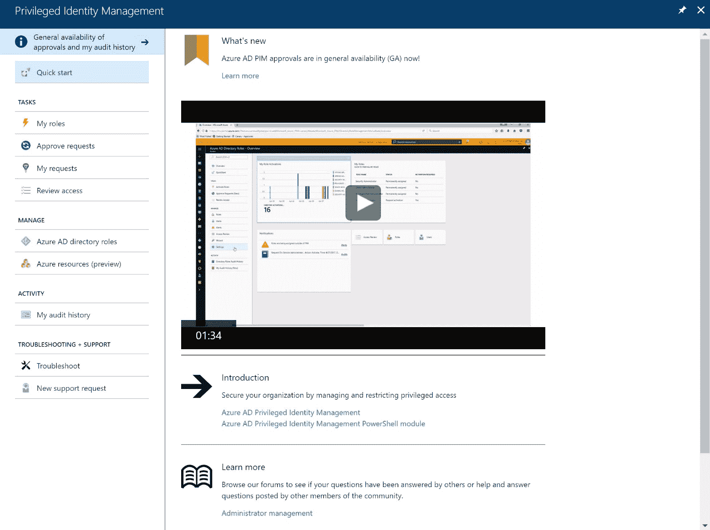

# 第十一章：治理与政策

在上一章中，我们讨论了如何使用 Azure 提供的各种技术来保护您的数据，并介绍了何时使用这些技术。我们讨论了 Azure 密钥保管库、Azure 存储服务加密、Azure 磁盘加密等内容。

在本章中，我们将涵盖治理与政策，诸如 Azure 中的标准和自定义角色、何时使用 Azure 基于角色的访问控制、Azure 资源政策等内容。

本章结束时，您将了解如何设计治理机制和政策，并管理安全风险。

以下主题将被涵盖：

+   Azure 基于角色的访问控制

+   Azure 资源政策

+   Azure AD 特权身份管理

+   Azure AD 身份保护

+   Azure 安全中心

+   操作管理套件 - 安全与合规

# 技术要求

本章的示例使用以下工具：

+   Azure PowerShell: [`docs.microsoft.com/en-us/powershell/azure/install-azurerm-ps?view=azurermps-5.1.1`](https://docs.microsoft.com/en-us/powershell/azure/install-azurerm-ps?view=azurermps-5.1.1)

本章的源代码可以通过以下链接下载：

+   [`github.com/SjoukjeZaal/AzureArchitectureBook/tree/master/Chapter%2011`](https://github.com/SjoukjeZaal/AzureArchitectureBook/tree/master/Chapter%2011)

# Azure 基于角色的访问控制

在 Azure 中使用基于角色的访问控制（RBAC），您可以实施最小权限原则，并为用户提供完成工作所需的精确权限。用户、组和应用程序会被添加到 Azure 中的角色中，这些角色具有某些权限。您可以使用 Azure 提供的内置角色，或者可以在 RBAC 中创建自定义角色。

Azure 中的角色可以添加到特定的范围。范围可以是一个 Azure 订阅、一个 Azure 资源组，或例如 Web 应用。然后，Azure 使用访问继承。添加到父资源的角色会自动赋予对子资源的访问权限。例如，添加到 Azure 订阅的组会获得该订阅下所有资源组及其底层资源的访问权限。添加到虚拟机的用户仅能访问该特定虚拟机：


基于角色的访问控制继承

在每个 Azure 订阅中，您可以授予最多 2,000 个角色分配，这些分配可以通过 Azure 门户、PowerShell、CLI 和 REST API 设置。

# 内置角色

Azure 提供了多种内置角色，您可以使用它们来为用户、组和应用分配权限。RBAC 提供以下三种标准角色，您可以将它们分配给每个 Azure 资源：

+   **所有者**：该角色中的用户可以管理一切，并可以创建新资源。

+   **贡献者**：该角色中的用户可以像所有者角色中的用户一样管理一切，但不能将访问权限分配给其他人。

+   **读者**：该角色中的用户可以读取所有内容，但不允许进行任何更改。

除了标准角色外，每个 Azure 资源还拥有作用于特定资源的角色。例如，你可以将用户、组或应用分配给 SQL 安全管理员角色，在该角色中他们可以管理所有与 Azure SQL 服务器相关的安全策略，或者你可以将他们分配给虚拟机贡献者角色，在该角色中他们可以管理虚拟机，但不能管理与虚拟机连接的虚拟网络或存储账户。

要查看 Azure 提供的所有内置角色概览，你可以参考 [`docs.microsoft.com/en-us/azure/active-directory/role-based-access-built-in-roles`](https://docs.microsoft.com/en-us/azure/active-directory/role-based-access-built-in-roles)。

# 自定义角色

当没有内置角色符合你的需求时，你还可以在 RBAC 中创建自定义角色。自定义角色可以被分配到与内置角色相同的资源，只能通过 PowerShell、CLI 和 REST API 创建。你不能在 Azure 门户中创建它们。在每个 Azure 租户中，最多可以创建 2,000 个角色。

自定义角色是通过 JSON 定义的，部署后它们会存储在 Azure AD 租户中。通过将它们存储在 Azure AD 租户中，它们可以在连接到该 Azure AD 租户的所有不同 Azure 订阅中使用。

# 创建自定义角色

在下一个示例中，我们正在创建一个只能在 Azure 中重启虚拟机的自定义角色。我们还将在 JSON 文件中将该角色分配给我的用户账户：

1.  你可以使用以下 JSON 代码定义自定义角色。你应该将 `Id` 设置为 `null`，因为自定义角色在创建时会自动分配 ID。我们将把自定义角色添加到两个 Azure 订阅中：

```
{
  "Name": "Packt Custom Role",
  "Id": null,
  "IsCustom": true,
  "Description": "Allows for read access to Azure Storage, Network and Compute resources and access to support",
  "Actions": [
    "Microsoft.Compute/*/read",
    "Microsoft.Storage/*/read",
  "Microsoft.Network/*/read",
  "Microsoft.Resources/subscriptions/resourceGroups/read",
    "Microsoft.Support/*"
  ],
  "NotActions": [
  ],
  "AssignableScopes": [
    "/subscriptions/********-****-****-****-***********",
    "/subscriptions/********-****-****-****-***********"
  ]
}
```

1.  将 JSON 文件保存在电脑 `C:` 盘的 `CustomRoles` 文件夹中。然后，运行以下 PowerShell 脚本来创建角色。首先，登录到你的 Azure 账户：

```
Login-AzureRmAccount
```

1.  然后，通过在 PowerShell 中导入 JSON 文件来创建 Azure 中的自定义角色：

```
New-AzureRmRoleDefinition -InputFile "C:\CustomRoles\PacktCustomRole.json"
```

1.  通过打开以下网址，导航到 Azure 门户：[`portal.azure.com/`](https://portal.azure.com/)。

1.  进入 订阅，选择 JSON 文件中已添加角色的订阅之一。然后，点击 访问控制（IAM）| 添加。

1.  在下一个页面中选择角色。自定义角色将出现在列表中：


Azure 门户中的自定义角色

# Azure 资源策略

在 Azure 中，你可以创建策略，在这些策略中定义并强制执行 Azure 资源的规则和操作。Azure 策略与 RBAC 不同，因为它关注的不是需要访问权限的用户、组或应用，而是关于应用你组织的治理策略。Azure 可以扫描你的资源，确保它们符合公司规则和 SLA。例如，你可以创建一个策略，评估所有使用托管磁盘的虚拟机。

创建策略时，用户必须在 RBAC 中被授予所有者角色，或者需要创建自定义角色并将以下权限添加到 JSON 文件中：

+   **定义策略**：`Microsoft.Authorization/policydefinitions/write`

+   **分配策略**：`Microsoft.Authorization/policyassignments/write`

可以通过 Azure 门户、PowerShell 和 CLI 创建策略。

要通过 Azure 门户创建策略，您可以参考以下教程：[`docs.microsoft.com/en-us/azure/azure-policy/assign-policy-definition`](https://docs.microsoft.com/en-us/azure/azure-policy/assign-policy-definition)。

# Azure AD 特权身份管理

Azure AD 特权身份管理（PIM）是 Azure AD Premium P2 或 Enterprise Mobility + Security E5 功能的一部分。通过 PIM，您可以管理和控制 Azure AD 租户内的所有访问权限，例如访问 Azure 资源、Office 365、Intune 和 Azure AD。

在 RBAC 中，您可以授予永久角色访问权限。通过 PIM，您可以将可用角色访问权限授予用户。那些不需要永久访问资源的用户可以在需要特定类型权限时请求访问，且访问时间为预定的时间段。例如，用户可以请求临时的 SharePoint 管理员权限。该请求可以由委派批准人批准，权限在用户完成后会被停用。

PIM 使用以下流程：

+   **用户请求**：用户使用在线表单请求特定权限的访问，并指定预定的时间。

+   **请求审核**：请求会在 PIM 门户内由管理员进行审核。

+   **审批**：请求可以被批准，用户将被添加到所需角色中。

+   **通知**：用户会通过电子邮件收到通知。

+   **用户执行操作**：用户使用多重身份验证（MFA）登录 Azure 资源，并且 Azure AD 特权身份管理（PIM）在特定的时间范围内提升他们的权限。

+   **监控**：监控团队可以跟踪 PIM 门户中的所有权限提升。



Azure AD 特权身份管理概述

# Azure AD 身份保护

Azure AD 身份保护是一个包含在 Azure AD Premium P2 许可证中的功能。它通过检测基于身份的安全问题，为您的 Azure 身份提供高级保护。它帮助发现被破坏的身份，提供条件访问策略，修复安全事件，并支持调查安全事件。Azure 使用机器学习算法进行检测，并生成报告和警报以解决威胁。

Azure AD 身份保护提供以下策略：

+   **MFA 注册**：在此，您可以分配 MFA 策略，并强制要求用户使用 MFA 登录。

+   **用户风险策略**：此策略允许您阻止用户登录，或强制要求他们更改密码为更安全的密码。

+   **登录风险策略**：当用户从不熟悉的位置登录时，此策略提供保护。您可以强制要求他们在该位置登录时使用多因素身份验证（MFA）。


Azure AD 身份保护概览

# Azure 安全中心

Azure 安全中心为所有 Azure 资源提供高级威胁防护和安全管理，这些资源位于 Azure AD 租户内以及混合环境中的本地资源。它集成在 Azure 门户中，提供以下功能：

+   **集中式策略管理**：您可以从一个中心位置管理混合环境中资源的所有安全策略。Azure 资源策略与 Azure 安全中心集成。

+   **持续安全评估**：此功能为所有虚拟机、应用程序、虚拟网络和存储帐户提供安全监控解决方案。

+   **可操作建议**：此功能提供建议，以修复来自 Azure 门户的漏洞和潜在威胁。

+   **高级云防御**：此功能提供端口的 JIT 访问，并对白名单中的虚拟机上部署的应用程序进行管理。

+   **优先级警报和事件**：此功能提供优先级警报，首先关注最大风险和威胁。

+   **集成安全解决方案**：您可以将 Azure 安全中心与第三方解决方案集成，从各种资源收集数据。


Azure 安全中心概览

Azure 安全中心提供两种不同的定价层：

+   **免费**：所有 Azure 订阅都默认获得免费访问层。它提供安全策略、持续的安全评估和可操作的安全建议。

+   **标准**：此计划提供**免费**计划中的所有功能，但现在适用于混合环境。它还提供高级威胁检测，本章稍后将详细讲解，并提供高级云防御。

有关如何创建安全策略的完整教程，您可以参考[`docs.microsoft.com/en-us/azure/security-center/security-center-azure-policy`](https://docs.microsoft.com/en-us/azure/security-center/security-center-azure-policy)。请注意，编写本书时，Azure 策略仍处于预览阶段。

# 高级威胁检测

高级威胁检测监控所有 Azure 资源的安全信息，包括 Azure 订阅内的资源、混合环境和连接的第三方解决方案。它分析数据以检测潜在威胁，当检测到威胁时，会创建一个安全警报。此安全警报提供有关威胁的详细信息，并提供解决威胁的建议。

Azure 使用机器学习算法来帮助检测威胁。这些算法被应用于整个 Azure 云架构中，并可用于所有类型的帐户，如企业帐户、较小组织的帐户以及个人帐户。它们都可以从微软过去十年分析的所有数据中受益。

Azure 安全中心提供三种类型的威胁报告，这些报告是使用高级威胁检测生成的。根据攻击情况，这些报告的内容可能会有所不同：

+   **活动组报告**：这提供了关于攻击者的信息，例如身份或关联、攻击目标，以及攻击者的战术、工具和程序。

+   **攻击活动报告**：这提供了当前和历史攻击活动的信息。

+   **威胁概述报告**：这将合并所有先前提到的报告中的信息。

# Azure 端点保护

Azure 端点保护是一项功能，能够为你的 Azure 虚拟机和连接到 Azure 安全中心的本地虚拟机提供防恶意软件保护。在 Azure 安全中心中，你可以监控虚拟机的防恶意软件保护状态。

要为你的虚拟机启用端点保护，你必须通过 Azure 安全中心来进行操作。

按照以下步骤从 Azure 门户创建虚拟机：

1.  打开以下链接进入 Azure 门户：[`portal.azure.com/`](https://portal.azure.com/)。

1.  点击左侧菜单中的安全中心（Security Center）。确保打开的是概述页面。在“防护”（Prevention）标签下，点击计算（Compute）：


Azure 安全中心中的端点保护

1.  当你的虚拟机未安装端点保护时，你将在报告工具中看到一个推荐。点击推荐（RECOMMENDATIONS）：


Azure 安全中心中的端点保护建议

1.  在下一个面板中，点击 Azure 虚拟机上未安装端点保护：


端点保护设置

1.  你现在可以选择要安装端点保护的虚拟机，并选择安装 Microsoft Antimalware 解决方案：


在虚拟机上安装端点保护

1.  点击创建（Create），然后你可以设置一些附加设置，如排除文件和位置、文件和扩展名，以及进程。保持默认设置并点击“确定”（OK），然后点击“创建”（Create）以安装端点保护到虚拟机上：


在虚拟机上安装端点保护

# 操作管理套件 - 安全与合规

**操作管理套件（Operations Management Suite，OMS）** 是微软的一款混合云和数据管理工具，托管在 Azure 中，旨在从一个地方管理本地和 Azure 基础设施。通过 OMS，你可以轻松管理大型混合环境。除了 Azure，OMS 还可以管理和保护 AWS、Windows Server、Linux、VMware 和 OpenStack 环境及机器。OMS 提供不同的管理解决方案，其中之一是安全性与合规性解决方案。

为了管理和保护虚拟机（VM）和服务器，需要安装一个代理程序，该代理程序会收集所有用于 OMS 的数据。为了从 Azure 收集数据，你需要创建一个**日志分析工作区（Log Analytics Workspace）**。当你将 Azure 订阅与 OMS 关联时，工作区会自动创建。

你可以从以下网址将 OMS 与 Azure 订阅关联：[`www.microsoft.com/en-us/cloud-platform/operations-management-suite`](https://www.microsoft.com/en-us/cloud-platform/operations-management-suite)。

你也可以从 Azure 门户创建日志分析工作区。有关如何创建此工作区的更多信息，请参考：[`docs.microsoft.com/en-us/azure/log-analytics/`](https://docs.microsoft.com/en-us/azure/log-analytics/)。

要安装代理并将 Azure 虚拟机连接到 OMS，你可以从 Azure 门户打开日志分析工作区，点击左侧菜单中的虚拟机，并将虚拟机连接到该工作区：


将虚拟机连接到 OMS

数据现在将在 OMS 门户中显示。OMS 提供一个**安全性和审计（Security and Audit）**仪表板，展示以下信息：

+   **安全领域（Security Domains）**：这将提供关于安全记录的信息，如恶意软件评估、网络安全、身份和访问信息

+   **显著问题**：这将提供当前威胁和问题的信息

+   **检测（预览）**：通过可视化警报来帮助识别攻击模式

+   **威胁情报（Threat Intelligence）**：这可视化了具有不同威胁的服务器总数，并显示来自哪些 IP 地址的威胁


OMS 安全性和审计仪表板

# 总结

本章我们讨论了如何设计治理机制和政策以管理 Azure 资源，并如何使用适当的安全解决方案来管理安全风险。

本章内容结束后，我们将进入下一章，探讨使用平台服务设计解决方案的目标。第一章将讨论人工智能、物联网和 Azure 媒体服务。

# 问题

请回答以下问题，测试你对本章信息的理解。你可以在本书末尾的*评估（Assessments）*部分找到答案。

1.  你能否通过 Azure AD 特权身份管理为用户授予符合条件的角色访问权限？

    1.  是的

    1.  无

1.  您可以使用操作管理套件管理本地和 Azure 基础设施吗？

    1.  是的

    1.  不是

1.  您希望检查您的 Azure 订阅中的所有虚拟机是否都使用托管磁盘。您可以使用 Azure 资源策略来实现这一点吗？

    1.  是的

    1.  不能

# 深入阅读

您可以查看以下链接，了解本章中涵盖的主题的更多信息：

+   **在 Azure 门户中开始使用基于角色的访问控制**：[`docs.microsoft.com/en-us/azure/active-directory/role-based-access-control-what-is`](https://docs.microsoft.com/en-us/azure/active-directory/role-based-access-control-what-is)

+   **使用基于角色的访问控制管理 Azure 订阅资源的访问权限**：[`docs.microsoft.com/en-us/azure/active-directory/role-based-access-control-configure`](https://docs.microsoft.com/en-us/azure/active-directory/role-based-access-control-configure)

+   **创建自定义角色以进行 Azure 基于角色的访问控制**：[`docs.microsoft.com/en-us/azure/active-directory/role-based-access-control-custom-roles`](https://docs.microsoft.com/en-us/azure/active-directory/role-based-access-control-custom-roles)

+   **什么是 Azure 策略？**：[`docs.microsoft.com/en-us/azure/azure-policy/azure-policy-introduction`](https://docs.microsoft.com/en-us/azure/azure-policy/azure-policy-introduction)

+   **什么是 Azure AD 特权身份管理？**：[`docs.microsoft.com/en-us/azure/active-directory/active-directory-privileged-identity-management-configure?toc=%2fazure%2factive-directory%2fprivileged-identity-management%2ftoc.json`](https://docs.microsoft.com/en-us/azure/active-directory/active-directory-privileged-identity-management-configure?toc=%2fazure%2factive-directory%2fprivileged-identity-management%2ftoc.json)

+   **Azure 安全中心文档**：[`docs.microsoft.com/en-us/azure/security-center/`](https://docs.microsoft.com/en-us/azure/security-center/)

+   **Azure 安全中心威胁情报报告**：[`docs.microsoft.com/en-us/azure/security-center/security-center-threat-report`](https://docs.microsoft.com/en-us/azure/security-center/security-center-threat-report)

+   **通过 Azure 安全中心管理端点保护问题**：[`docs.microsoft.com/en-us/azure/security-center/security-center-install-endpoint-protection`](https://docs.microsoft.com/en-us/azure/security-center/security-center-install-endpoint-protection)

+   **什么是操作管理套件 (OMS)？**：[`docs.microsoft.com/en-us/azure/operations-management-suite/operations-management-suite-overview`](https://docs.microsoft.com/en-us/azure/operations-management-suite/operations-management-suite-overview)
