# 第十二章：人工智能、物联网和媒体服务

在上一章中，我们讨论了治理和策略，例如 Azure 中的标准和自定义角色、何时使用 Azure 基于角色的访问安全，以及 Azure 资源策略。

在本章中，你将学习 Azure 为人工智能、物联网以及流媒体内容提供的各种功能和能力。通过本章的学习，你将掌握如何使用 Azure 认知服务、Azure Bot 服务、IoT Hub、Azure 媒体服务等设计最先进的解决方案。

本章将涵盖以下主题：

+   Azure 认知服务

+   Azure Bot 服务

+   Azure 机器学习

+   IoT Hub、事件中心和 IoT Edge

+   Azure 流分析

+   Azure 时间序列洞察

+   Azure 媒体服务

# 技术要求

本章使用以下工具作为示例：

+   Visual Studio 2017: [`www.visualstudio.com/downloads/`](https://www.visualstudio.com/downloads/)

本章的源代码可以从以下链接下载：

+   [`github.com/SjoukjeZaal/AzureArchitectureBook/tree/master/Chapter%2012`](https://github.com/SjoukjeZaal/AzureArchitectureBook/tree/master/Chapter%2012)

# Azure 认知服务

借助 Azure 认知服务，你可以创建现代化和智能的应用程序。它提供各种人工智能和机器学习 API 和 SDK，可在应用程序中使用，使其更加智能，例如语音和面部识别、语音和语言理解等。

认知服务是 Azure 人工智能产品的一部分。它提供可直接使用的 API 以及需要训练的 API，这些 API 可以用于创建自定义的人工智能解决方案。

这些 API 被分为多个类别，如视觉、语音、语言、知识和搜索 API。这些类别以及可用的 API 在接下来的章节中将进行更详细的介绍。

认知服务还提供一组仍处于实验阶段的 API 和 SDK。这些服务被归类为实验室服务。在写作本书时，实验室部分提供手势、事件跟踪、学术知识、本地洞察、知识探索服务和实体链接服务。

# 可用的服务和 API

Azure 认知服务提供以下 API 和服务：

+   **视觉**：

    +   **计算机视觉 API**：此 API 提供图像处理和识别。你可以使用此 API 对图像进行分类、根据内容标记图像、识别手写文本、标记成人内容、裁剪图像、检测人脸等。

    +   **内容审核员**：内容审核员提供自动审核功能，例如检测视频中的潜在成人或不雅内容。它提供了审核工具，自动审核可以与人工参与结合使用。

    +   **自定义视觉服务**：此 API 提供一个工具，用于构建自定义图像分类器。它可以用于识别图像，例如某些花朵或狗等。此 API 需要通过上传图像来进行训练。

    +   **面部 API**：此 API 可以检测图像中的人脸。它可以从图像中提取信息，如姿势、面部毛发、眼镜、性别、年龄和头部姿势。您可以使用此 API 进行人脸验证、人脸分组、人脸识别以及查找相似的人脸。

    +   **情感 API**：此 API 是面部 API 的一部分，也可以作为独立 API 使用。您可以使用它检测图像中人们的情感。

    +   **视频索引器**：此 API 可以使用各种人工智能技术从您的视频中提取见解。此 API 也用于 Azure 媒体服务，稍后在本章中将更详细地介绍。

+   **语音**：

    +   **微软语音 API**：此 API 提供语音功能，如语音命令控制和语音转录与听写。它提供语音转文本功能，将人类语音转换为文本，可用于通过语音控制应用程序；以及文本转语音功能，将文本转换为音频流，可在应用程序中播放。

    +   **自定义语音服务**：此服务使您能够创建定制的语言模型和声学模型，旨在特定用户群体或特定环境中的应用程序。您可以训练 API 学习产品名称或行话。

    +   **语音识别 API**：此 API 提供语音验证功能，可以通过语音命令进行身份验证。它还提供语音识别功能，可以通过声音在一组人群中识别某个人。

    +   **翻译语音 API**：此 API 提供将对话语音从一种语言翻译成另一种语言文本的服务。

+   **语言**：

    +   **语言理解（LUIS）**：LUIS 可以从文本中提取含义。它使用机器学习训练 API。

    +   **必应拼写检查 API**：提供拼写检查和上下文语法工具。它基于必应的所有网页搜索，并使用机器学习动态训练 API。

    +   **语言分析 API**：此 API 提供三种自然语言处理工具，例如句子分割与标记化、词性标注和句法分析。

    +   **文本分析 API**：此 API 提供对原始文本的自然语言处理，并包括此处提到的功能。其中一个功能是语言检测，支持最多 120 种语言。它返回一个语言代码以及一个表示分析强度的得分。它还提供关键词提取功能，通过提取关键短语来识别句子的要点，同时提供情感分析，可以用来分析人们对某些事物的看法。

    +   **翻译文本 API**：此 API 可用于提供超过 60 种不同语言的文本翻译。

    +   **Web 语言模型 API**：此 API 提供多种标准自然语言处理任务。模型是使用 Bing 数据在 Web 规模上训练的。

+   **知识**：

    +   **自定义决策服务**：你可以使用此 API 为用户创建个性化体验。它可以个性化网站或门户上的内容或视频。你可以用它来进行广告投放和商店中的商品排名。

    +   **QnA Maker**：它提供了一个 Web API，可以训练 AI 模型以更自然、对话的方式回答用户的问题。可以通过常见问题、URL/文档等进行训练。

+   **搜索：**

    +   **Bing 搜索 API**：此 API 包含多个 API 和功能。它包括所有 Bing 搜索 API，例如 Bing 网页搜索 API、Bing 图像搜索 API、Bing 视频搜索 API 和 Bing 新闻搜索 API。

    +   **Bing 自动建议 API**：此 API 在你输入一个单词的前几个字符时提供建议。你可以用它来填充搜索框下拉列表。

    +   **Bing 自定义搜索 API**：此 API 提供量身定制的搜索体验。你可以根据兴趣定制结果。因此，不需要让用户通过页面来搜索相关内容，你可以在提供给用户之前先过滤掉不相关的内容。

    +   **Bing 实体搜索 API**：此 API 提供的搜索结果包括可以用于旅游景点等实体和地点。

要查看所有认知服务 API 的完整概述，请参考：[`docs.microsoft.com/en-us/azure/#pivot=products&panel=ai`](https://docs.microsoft.com/en-us/azure/#pivot=products&panel=ai)。想要开始使用认知服务？你可以参考以下页面获取不同 API 的免费试用密钥：[`azure.microsoft.com/en-us/try/cognitive-services/`](https://azure.microsoft.com/en-us/try/cognitive-services/)。这些试用计划有速率限制。Azure 门户有付费服务，你也可以在其中创建认知服务 API。

# 使用计算机视觉 API

在本示例中，我们将创建一个使用计算机视觉 API 分析图片的应用程序。

首先，你需要从 [`docs.microsoft.com/en-us/azure/cognitive-services/Computer-vision/Vision-API-How-to-Topics/HowToSubscribe`](https://docs.microsoft.com/en-us/azure/cognitive-services/Computer-vision/Vision-API-How-to-Topics/HowToSubscribe) 获取一个 API 订阅密钥。

接下来，你需要打开 Visual Studio 2017。

1.  点击 文件 | 新建 | 项目，在新建项目窗口中，选择 控制台应用程序。为项目命名并点击 确定：

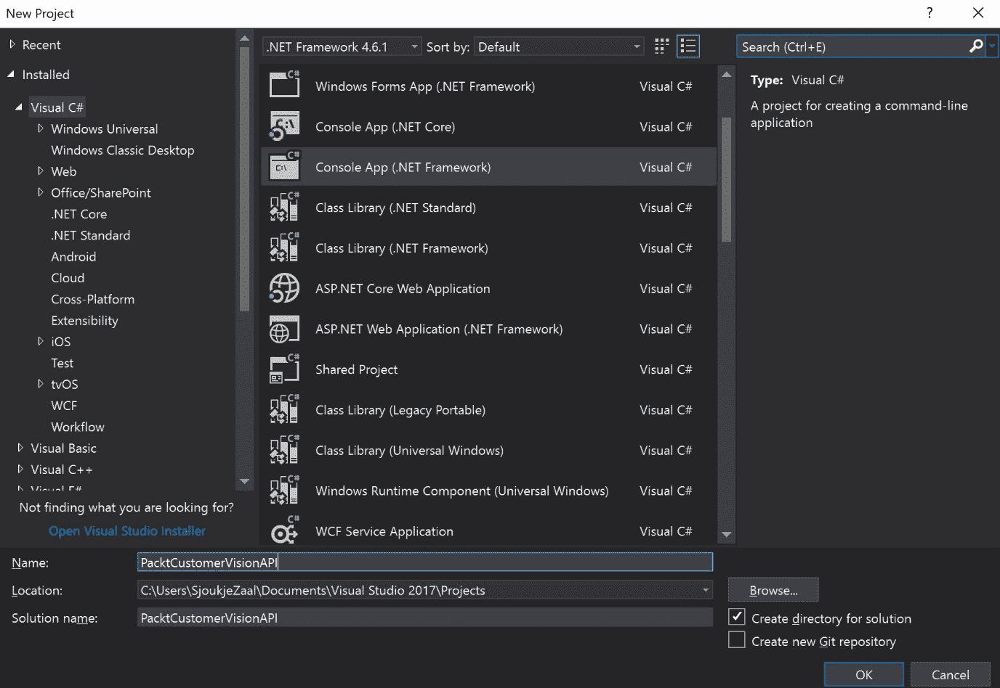

创建控制台应用程序

1.  创建一个新的类，命名为 `Extensions.cs`，并将代码替换为以下内容：

```
using System;
using System.Collections.Generic;

namespace PacktCustomerVisionAPI
{
    static class Extensions
    {
        public static void ForEach<T>(this IEnumerable<T> ie, Action<T> action)
        {
            foreach (var i in ie)
            {
                action(i);
            }
        }
    }
}
```

1.  将以下命名空间添加到 `Main.cs` 中：

```
using System;
using System.Collections.Generic;
using System.IO;
using System.Linq;
using System.Net.Http;
using System.Net.Http.Headers;
using System.Text;
```

1.  向 `Main.cs` 添加以下变量。将 `subscriptionKey` 的值替换为有效的订阅密钥：

```
// Fill in the subscription Key
    const string subscriptionKey = "7c98f3e0aa3a4a729f69b20583a0bc18";

    //API Url in West Central US Region
    const string uriBase = "https://westcentralus.api.cognitive.microsoft.com/vision/v1.0/models/celebrities/analyze";
```

1.  使用以下代码替换 `Main` 方法：

```
static void Main(string[] args)
   {
      Console.Write("Enter the path to an celebrity image: ");
      string imageFilePath = Console.ReadLine();

       MakeAnalysisRequest(imageFilePath);

       Console.WriteLine("\nPlease wait a moment for the results to appear. Then, press Enter to exit ...\n");
        Console.ReadLine();
    }
```

1.  添加以下方法以创建请求，并将其发送到该类的客服 API：

```
static async void MakeAnalysisRequest(string imageFilePath)
{
   HttpClient client = new HttpClient();

   client.DefaultRequestHeaders.Add("Ocp-Apim-Subscription-Key", subscriptionKey);
        string requestParameters = "model=celebrities";
        string uri = uriBase + "?" + requestParameters;
        HttpResponseMessage response;
        byte[] byteData = GetImageAsByteArray(imageFilePath);
        using (ByteArrayContent content = new ByteArrayContent(byteData))
         {
             content.Headers.ContentType = new MediaTypeHeaderValue("application/octet-stream");
             response = await client.PostAsync(uri, content);
             string contentString = await response.Content.ReadAsStringAsync();
               Console.WriteLine("\nResponse:\n");
               Console.WriteLine(JsonPrettyPrint(contentString));
          }
}
```

1.  在之前的方法下方添加以下方法以导入名人图像：

```
static byte[] GetImageAsByteArray(string imageFilePath)
{
    FileStream fileStream = new FileStream(imageFilePath, FileMode.Open, FileAccess.Read);
    BinaryReader binaryReader = new BinaryReader(fileStream);
    return binaryReader.ReadBytes((int)fileStream.Length);
}
```

1.  添加最后一个方法，以便在之前的方法下方显示 JSON 结果：

```
 static string JsonPrettyPrint(string json)
        {
            if (string.IsNullOrEmpty(json))
                return string.Empty;

            json = json.Replace(Environment.NewLine, "").Replace("\t", "");

            string INDENT_STRING = " ";
            var indent = 0;
            var quoted = false;
            var sb = new StringBuilder();
            for (var i = 0; i < json.Length; i++)
            {
                var ch = json[i];
                switch (ch)
                {
                    case '{':
                    case '[':
                        sb.Append(ch);
                        if (!quoted)
                        {
                            sb.AppendLine();
                            Enumerable.Range(0, ++indent).ForEach(item => sb.Append(INDENT_STRING));
                        }
                        break;
                    case '}':
                    case ']':
                        if (!quoted)
                        {
                            sb.AppendLine();
                            Enumerable.Range(0, --indent).ForEach(item => sb.Append(INDENT_STRING));
                        }
                        sb.Append(ch);
                        break;
                    case '"':
                        sb.Append(ch);
                        bool escaped = false;
                        var index = i;
                        while (index > 0 && json[--index] == '\\')
                            escaped = !escaped;
                        if (!escaped)
                            quoted = !quoted;
                        break;
                    case ',':
                        sb.Append(ch);
                        if (!quoted)
                        {
                            sb.AppendLine();
                            Enumerable.Range(0, indent).ForEach(item => sb.Append(INDENT_STRING));
                        }
                        break;
                    case ':':
                        sb.Append(ch);
                        if (!quoted)
                            sb.Append(" ");
                        break;
                    default:
                        sb.Append(ch);
                        break;
                }
            }
            return sb.ToString();
        }
```

1.  现在，下载一个名人图像，运行应用程序，并提供完整的图像路径。

如需详细了解计算机视觉 API 的所有功能，可以参考：[`docs.microsoft.com/en-us/azure/cognitive-services/computer-vision/home#Categorizing`](https://docs.microsoft.com/en-us/azure/cognitive-services/computer-vision/home#Categorizing)。

# Azure Bot 服务

Azure Bot 服务提供了一个完整的环境来构建和部署 Bots。Bot 是一种可以与用户进行对话互动的应用程序。它可以通过语音、文本和卡片与用户进行沟通。你可以创建能够通过自由形式的方式与用户沟通的 Bots，例如用户在聊天框中提问，Bot 给出回答，或者你也可以使用更为引导的方式，在这种方式下，你向用户提供选择项，并根据他们做出的选择采取相应的行动。

你可以在各种类型的应用程序中集成 Bots，例如自定义 Web 应用程序和 Azure Functions。你还可以创建集成到 Azure SaaS 应用程序中的 Bots。Azure Bot 服务提供多种渠道，可以将你的 Bot 连接到 Skype、Facebook、Teams、Slack、SMS 等。Bots 可以通过 .NET 或 Node.js 创建，并且提供了五种不同的模板来帮助你快速入门开发。你可以选择基本 Bot、收集用户输入的表单 Bot、利用 LUIS 的语言理解 Bot、用于常见问题的 Bot，以及能够提醒用户事件的 Bot。

Azure Bot 服务提供以下两种不同的定价方案：

+   **免费**：此方案提供标准通道的无限消息数量，以及每月 10,000 条消息在高级通道上（例如 Microsoft Teams 和 Skype）。

+   **标准 S1**：此方案提供标准通道的无限消息数量，并且你为每次发送 1,000 条消息的高级通道付费。此定价方案还提供 SLA。

你可以通过 Azure 门户或 Visual Studio 2017 使用 Bots。Microsoft 提供了一个完整的构建和部署 Bots 的解决方案，这个解决方案包含在 .NET 的 Bot Builder SDK 中。你需要下载可以安装在 Visual Studio `Template` 文件夹中的模板。该模板将成为开发 Bots 的起点。

# 从 Azure 门户创建一个 Bot

在本示例中，我们将创建一个可以从 Azure 门户部署到 Web 应用中的 Bot：

1.  通过打开以下链接进入 Azure 门户：[`portal.azure.com/`](https://portal.azure.com/)。

1.  点击“新建”，并在搜索栏中键入 `Web App Bot`。

1.  输入以下设置：

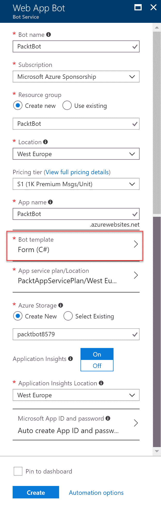

Web 应用程序 Bot 设置

1.  点击“Bot 模板”，选择“表单模板”，然后点击“选择”：

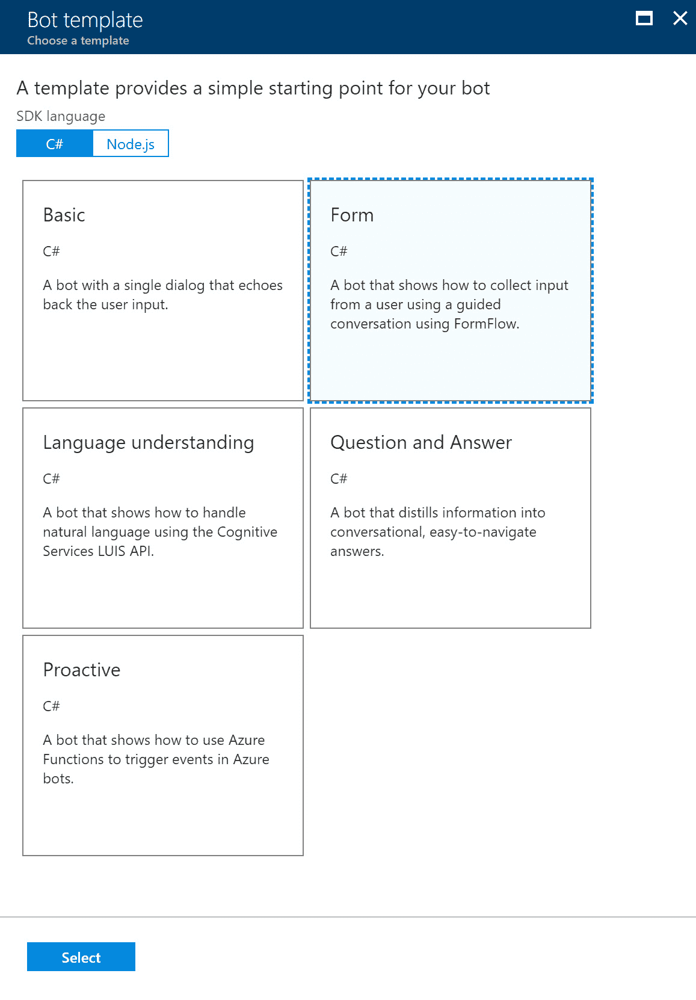

选择 Bot 模板

1.  创建后，你可以在 Azure 门户中导航到 Bot。当你点击左侧菜单中的“构建”时，你可以在在线代码编辑器中对代码进行更改。在线编辑器中集成了一些工具，如 Git、Kudu 等。你也可以下载 ZIP 文件，在 Visual Studio 中进行更改，并配置持续部署：

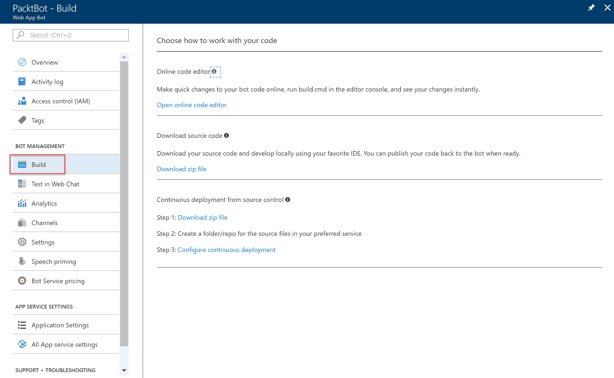

机器人构建设置

1.  要测试机器人，请在左侧菜单中点击“Web Chat 中的测试”。这个机器人提供了一个三明治点单服务示例，采用引导式方法。所以，如果你在消息框中输入任何内容，你将看到一组可以选择的三明治选项。选择一个后，你可以选择三明治的长度：

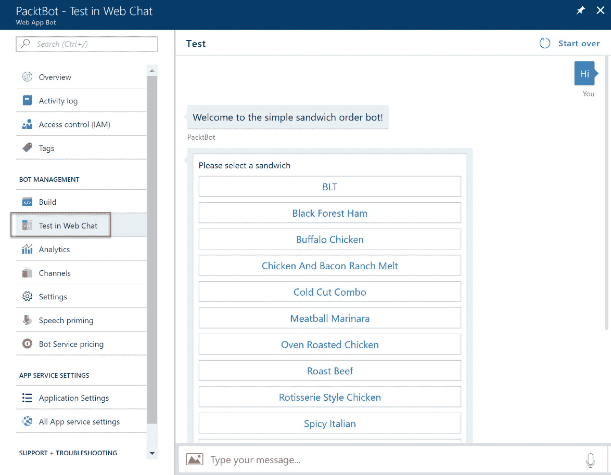

机器人示例

1.  要进行渠道注册，可以点击左侧菜单中的“渠道”。在这里，你可以注册你希望你的 Bot 连接的不同渠道：

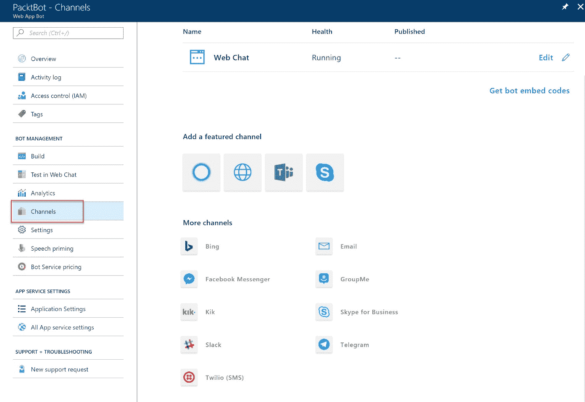

不同的机器人渠道

如需了解如何使用 Visual Studio 2017 创建机器人的更多信息，可以参考[`docs.microsoft.com/en-us/bot-framework/dotnet/bot-builder-dotnet-quickstart`](https://docs.microsoft.com/en-us/bot-framework/dotnet/bot-builder-dotnet-quickstart)。

# Azure 机器学习

如今我们每个人都在产生大量数据。过去产生的数据可以为我们提供未来的宝贵洞察。

机器学习提供了一套算法，可以自动将复杂的数学计算应用于大数据，并最终从这些数据中进行学习。这是一种数据科学技术，可以通过预测结果和趋势来预测未来。使用该技术的应用程序可以从数据和经验中学习，而无需显式编程。机器学习模型可以利用大量历史数据进行训练，应用程序可以基于这些数据采取行动。

欺诈检测、自动驾驶汽车和网站上的个人推荐都是使用机器学习的应用实例。人工智能和机器学习的可能性是无限的，并且在不久的将来将对我们的日常生活产生巨大影响。

Azure 机器学习为数据科学家和开发人员提供了一套工具和能力，帮助他们在应用程序中利用机器学习。提供以下工具和功能：

+   **机器学习工作室**：机器学习工作室是一个拖放工具，你可以用它来创建预测模型。你还可以用它来部署和测试你的解决方案。你可以创建**实验**，并将数据集和数据分析活动（称为**模块**）拖放到其中。你可以用数据集中的部分数据来训练**实验**，当模型训练好后，你可以将其转化为**预测性**实验，并将其发布为 Web 服务。

+   **Azure 机器学习工作台**：在写本书时，这个工具仍处于预览阶段。它为数据科学家提供了一个集成的端到端数据科学解决方案，帮助数据科学家准备数据、开发体验并将模型部署到 Azure 上。

+   **Azure AI 画廊**：AI 画廊提供了各种社区驱动的解决方案，这些解决方案利用了 Azure 的不同 AI 功能。你可以将这些解决方案用于学习目的，或作为开发自定义解决方案的资源。

+   **机器学习模块**：你可以在实验中使用现成的机器学习模型来分析数据。包括机器学习算法、数据输入输出模块、数据转换模块、文本分析模块以及微软特有的模块，后者包含来自 Bing 和 Xbox 的算法。

+   **数据科学**虚拟机：Azure 提供了配置用于数据科学工作负载的虚拟机。有 Windows 和 Linux 数据科学虚拟机以及深度学习虚拟机。你还可以为数据科学工作负载部署容器：

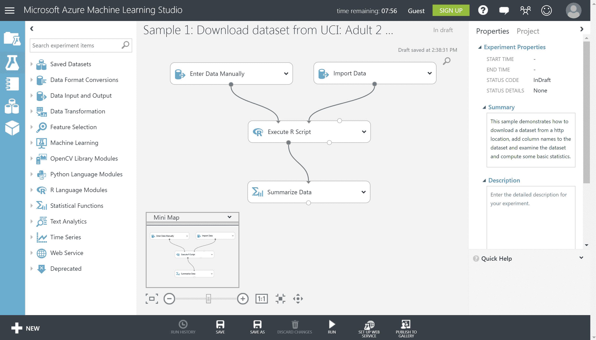

机器学习工作室

数据科学是一项专业技能；然而，微软提供了一系列视频，可以帮助你对数据科学有一些基本的了解。对于这些视频系列，你可以参考：[`docs.microsoft.com/en-us/azure/machine-learning/studio/data-science-for-beginners-the-5-questions-data-science-answers#other-videos-in-this-series`](https://docs.microsoft.com/en-us/azure/machine-learning/studio/data-science-for-beginners-the-5-questions-data-science-answers#other-videos-in-this-series)。

# Azure IoT 中心

在物联网（IoT）解决方案中，设备将大量数据发送到 Azure 进行进一步处理。IoT 中心用于安全连接这些设备，并将来自设备的消息路由到 Azure 中的不同资源，以便进一步处理。

IoT 中心提供以下功能：

+   **双向通信**：它提供设备与 Azure 之间的双向通信功能，如单向消息传递、文件传输和请求-回复消息传递。设备可以将数据发送到 Azure IoT 中心，反之，IoT 中心也可以将数据发送到设备。它支持多种通信协议，如 HTTPS、AMQP 和 MQTT，并提供内置的声明性消息路由功能，将消息路由到其他 Azure 服务。

+   **安全连接**：设备与 IoT Hub 之间的通信可以通过每个设备的安全密钥或 X.509 证书进行加密。Azure IoT Hub 不会主动开启任何连接，所有连接均由已连接的设备发起。IoT Hub 会将消息存储在每个设备的队列中 2 天，等待设备连接。它使用 Azure AD 进行用户身份验证和授权。

+   **扩展性**：IoT Hub 提供了巨大的扩展性，因为它可以扩展到数百万个同时连接的设备和每秒数百万个事件。

+   **监控**：它在 Azure 中提供监控解决方案。IoT Hub 与 Azure Monitor 集成，为你提供关于设备管理操作和连接事件的详细信息。

Azure IoT Hub 提供 Azure IoT SDK，其中包括设备 SDK，可用于创建在 IoT 设备上运行并向 IoT Hub 发送数据的应用程序。该 SDK 还提供了服务 SDK，可用于管理 IoT Hub，并提供 Azure IoT Edge，后者将在本章稍后详细讨论。

IoT Hub 提供以下定价层级：

+   **免费**：此方案每天提供最多 8000 条消息。此层级最适合测试场景。

+   **标准 S1**：此方案每天提供最多 40 万条消息，适用于生成少量数据的场景。

+   **标准 S2**：此方案每天提供最多 600 万条消息，适用于大数据量的场景。

+   **标准 S3**：此方案每天提供最多 3 亿条消息，适用于大数据量的场景。

除了 IoT Hub，Azure 还提供了 Azure Event Hub。Azure Event Hub 提供类似 Azure IoT Hub 的功能，不同之处在于 IoT Hub 提供了更多的高级功能。如果你的架构需要云到设备的通信或按设备的安全性和性能管理，IoT Hub 是最佳解决方案。

Event Hub 在下一节中将详细介绍。Azure 还提供了 IoT Edge，提供额外的功能，并将在下一节中讨论：

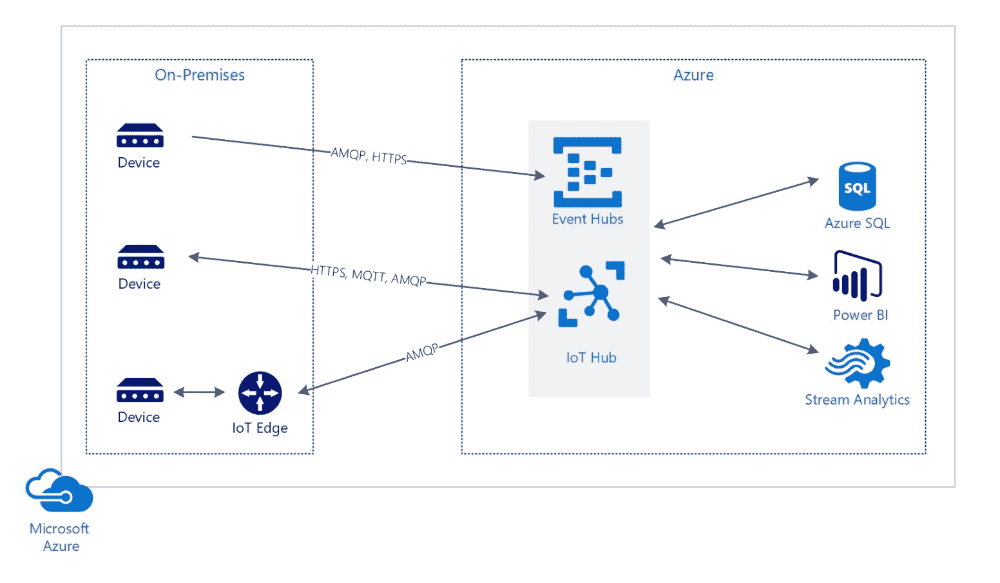

IoT 架构概览

# Azure Event Hub

Azure Event Hub 旨在处理由设备和服务生成的数据流的高吞吐量数据输入。它提供了一个遥测数据摄取服务，能够收集、转换并存储数百万个事件。

它提供了类似 IoT Hub 的功能，但也存在差异。选择使用哪种解决方案取决于具体场景。如果你的解决方案只要求高吞吐量的数据输入，Azure Event Hub 比 IoT Hub 更具成本效益。但是，如果你的解决方案需要双向通信，例如从云端向设备发送数据，IoT Hub 是更好的选择。

为了在 IoT 架构中做出正确的决策，你可以查看以下差异：

+   **设备协议支持**：Azure Event Hub 支持 HTTPS、AMQP 和 AMQP，而 IoT Hub 支持 MQTT、通过 WebSockets 的 MQTT、AMQP、通过 WebSockets 的 AMQP 和 HTTPS，IoT Hub 还支持文件上传。

+   **通信模式**：Event Hub 仅支持事件流入，而 IoT Hub 不仅支持设备到云的通信，还支持云到设备的通信。

+   **安全性**：Event Hub 支持共享访问策略，而 IoT Hub 支持每个设备身份和可撤销的访问控制。

+   **监控**：IoT Hub 提供完整的监控功能，而 Event Hub 仅提供汇总指标。

+   **规模**：IoT Hub 可以扩展到支持数百万个同时连接的设备和每秒数百万个事件，而 Event Hub 只能扩展到每命名空间 5,000 个 AMQP 连接。

+   **SDK**：Event Hubs 支持 .NET 和 C，而 IoT Hub 支持 .NET、C、Node.js、Java 和 Python。

关于 Event Hub 和 IoT Hub 之间差异的完整概述，可以参考：[`docs.microsoft.com/en-us/azure/iot-hub/iot-hub-compare-event-hubs`](https://docs.microsoft.com/en-us/azure/iot-hub/iot-hub-compare-event-hubs)。

Azure Event Hub 提供以下三种不同的定价层：

+   **基础**：提供最多 20 个吞吐量单元，每个单元支持 1 MB/s 的流入和 2 MB/s 的流出。最大消息大小为 256 KB。消息保留期为 1 天，1 个消费者组和 100 个代理连接。

+   **标准**：在基本功能的基础上，标准计划提供更低的吞吐量单元和消息费用。它提供 20 个消费者组和 1,000 个代理连接。

+   **专用**：为客户提供专用环境。提供最大消息大小 1 MB 和 50 个吞吐量单元，保留期为 7 天，支持 25,000 个代理连接。

# Azure IoT Edge

Azure IoT Edge 是 Azure IoT Hub 的附加功能，安装在本地网络的边缘、DMZ 或公司网络内。消息可以发送到 Azure IoT Edge，而不是 Azure，因为它不需要通过本地网络以外的区域，因此发送时间更短。数据也可以在设备上存储和分析。

你可以在 Azure 门户的 IoT Hub 设置页面中注册 IoT Edge。然后可以在 IoT Edge 设备上安装 IoT Edge 运行时。设备可以是 Windows 或 Linux 机器、容器，或者是 Raspberry Pi 等。这个 IoT Edge 设备可以连接到 Azure IoT Hub，从设备收集数据，并将其发送到 IoT Hub。

# Azure 流分析

Azure Stream Analytics 是 Azure IoT 套件的一部分，提供一个用于事件处理和实时分析的管道，适用于来自各种来源的数据流。您可以将其用于需要实时分析的数据场景，例如股票分析、欺诈检测，或者分析来自大量传感器的数据。

数据可以来自各种来源，例如自定义应用程序、传感器、Azure IoT Hub 和 Azure Event Hubs，也可以来自 Blob 存储。Stream Analytics 可以处理每秒高达 1 GB 的数据摄取。您可以创建一个 Stream Analytics **作业**，在其中配置数据源。您还可以创建一个 **转换**，使用类似 SQL 的语言查询数据中的模式或关系。

您可以对数据源中的数据进行过滤、排序或聚合。最后，数据会被发送到输出源，可以是 Azure Data Lake、Power BI（用于创建仪表板）、使用机器学习，或者将其存储在 SQL 数据仓库中：

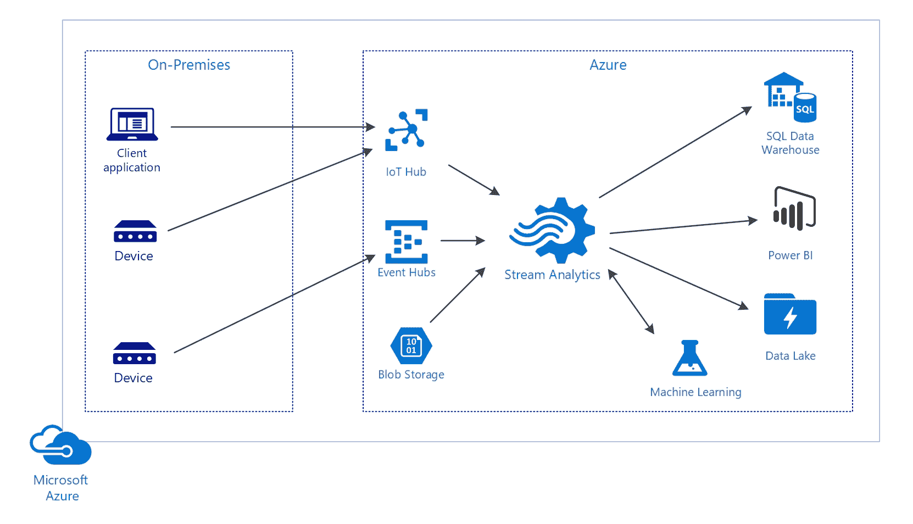

Azure Stream Analytics

# Azure 时间序列洞察

Time Series Insights 提供一个门户，可以用于从您的物联网数据中获取有价值的洞察。它为从 IoT Hub 和 Event Hubs 发送的大量数据提供数据库存储。它可以轻松地结合不同类型的数据，如元数据和遥测数据，并对这些数据进行可视化。

Time Series Insights 提供以下功能：

+   **集成**：它提供与 Azure IoT Hub 和 Event Hub 的开箱即用集成。

+   **数据存储**：Time Series Insights 将数据存储在 SSD 和内存中，最长可保存 400 天。

+   **可视化**：提供一个专门的门户，使用 TSI Explorer 可视化您的数据。

+   **查询服务**：Time Series Insights 在 TSI Explorer 内提供查询服务，并提供可以从自定义应用程序调用的 API。通过将 Time Series Insights 集成到您的应用程序中，您可以将其作为后端来索引、存储和聚合数据。然后，您可以在其基础上构建自定义可视化工具。

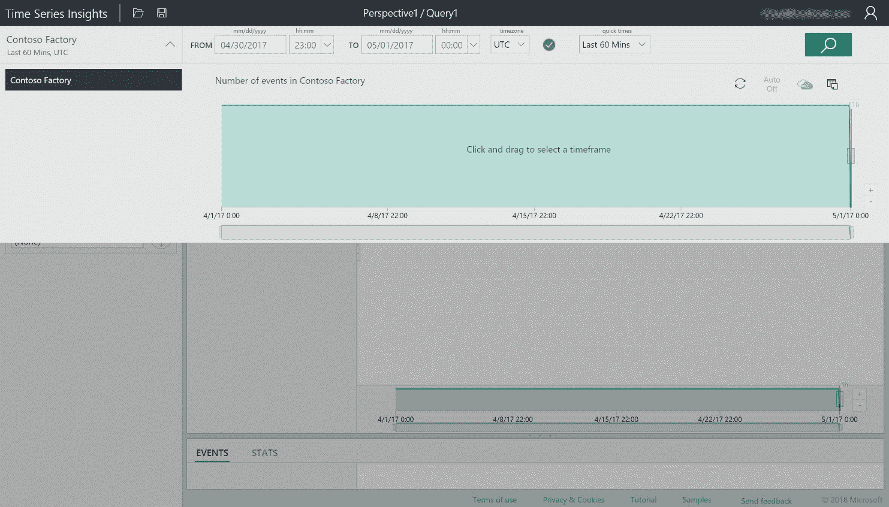

Azure 时间序列洞察 TSI Explorer

# Azure Media Services

Azure Media Services 提供安全且高质量的服务，以便将内容流式传输到各种设备。它可以流式传输视频或音频文件，并提供 REST API 来上传、存储和编码包内容。音频和视频可以通过按需流媒体或直播流传输到客户端，如电视、计算机和移动设备。

Azure Media Services 支持以下流程：

+   **上传**：您可以通过 Azure 门户、.NET SDK、REST API 上传视频，也可以从 Blob 存储中复制文件。

+   **编码**：AMS 提供两种不同的编码服务级别，如媒体编码器标准版和媒体编码器高级工作流版。前者提供编码服务，用于编码视频和音频文件，适用于多种设备播放，如智能手机和个人电脑。后者则为需要更复杂工作流的视频和音频文件提供编码服务。它还提供了一个工作流设计器工具，可以用于合并多个输入文件，或使用动态值和参数创建基于决策的工作流。它还支持广播和电影所需的格式。

+   **安全**：您可以使用动态加密（如高级加密标准（AES-128）或其他主要数字版权管理（DRM）系统）来保护您的媒体。它还为授权客户端提供 AES 密钥和 DRM 许可证。您可以使用 IP 限制保护您的媒体服务频道，确保用户只能从允许的 IP 地址上传媒体内容，并且您可以使用 Azure AD 身份验证访问 Azure Media Services API。AMS 仍然支持使用令牌的 Azure 访问控制服务身份验证模型，但该模型将在不久的将来被弃用，因此 Azure AD 身份验证现在是首选的身份验证方法。

+   **分析**：AMS 提供媒体分析服务，以从媒体内容中提取洞察力。它提供了一系列来自 Azure Cognitive Services 的语音和计算机视觉 API。以下部分将更详细地描述这些内容。

# Azure Media Analytics

Azure Media Analytics 使用各种认知服务 API 来分析媒体内容。它提供以下功能：

+   **索引器**：通过使用索引器，您可以创建闭幕字幕轨道，并使媒体文件可搜索。撰写本文时，索引器提供了两种不同版本的服务，其中 Azure Media Indexer 2（仍在预览中）具有更快的索引速度和更广泛的语言支持。

+   **延时摄影**：该功能提供延时摄影能力，并能够从第一人称或运动摄像机内容中创建稳定的视频。

+   **运动检测器**：该功能提供运动检测，可以用于静态摄像头录像，识别视频中发生运动的部分。它生成一个元数据文件，包含运动发生的时间戳。此功能对于安全摄像头录像非常有用。

+   **视频总结**：该功能可以通过生成来自视频不同部分的片段来为视频创建摘要。这些片段可以作为视频不同部分的概述。

+   **光学字符识别**：Azure Media 光学字符识别（OCR）可以将视频中的文本内容转换为可编辑和可搜索的数字文本。例如，您可以使用此功能使 PowerPoint 演示文稿视频内容在搜索引擎中可搜索。

+   **可扩展的人脸遮挡**：您可以使用可扩展的人脸遮挡功能，自动模糊视频内容中的人物面孔。

+   **内容审核**：Azure 内容审核提供自动审核功能，例如检测视频中的可能成人内容和敏感内容。它提供了审核工具，自动审核可以与人工参与结合使用。

# 使用 Azure 媒体分析索引器

在以下示例中，我们将使用 Azure 媒体分析媒体索引器为视频创建字幕文件。微软建议使用 Azure 媒体分析，而不是使用认知服务的视频 API，因此我们将在此处使用 Azure 媒体分析。我们将使用 Azure 媒体索引器 2 预览版媒体处理器（MP）的语音转文本功能，从控制台应用程序为视频创建字幕。

对于本示例，你需要在 Azure 门户中创建一个媒体服务账户。有关如何创建账户的完整教程，请参阅：[`docs.microsoft.com/en-us/azure/media-services/media-services-portal-create-account`](https://docs.microsoft.com/en-us/azure/media-services/media-services-portal-create-account)。

创建 Azure 媒体服务账户后，可以将 `PacktIndexer` 文件夹从 GitHub 复制到 `C:` 驱动器。你可以从以下网址下载视频并将其与 JSON 文件一起放入 `InputFiles` 文件夹中：[`peach.blender.org/download/`](https://peach.blender.org/download/)。这些文件将用于示例。还需要在 `PacktIndexer` 文件夹中创建一个名为 `OutputFiles` 的新文件夹。

接下来，打开 Visual Studio 2017 并创建一个新项目。

1.  点击 **文件 | 新建 | 项目**，在新建项目窗口中选择 **控制台应用程序**。为项目命名并点击 **确定**：

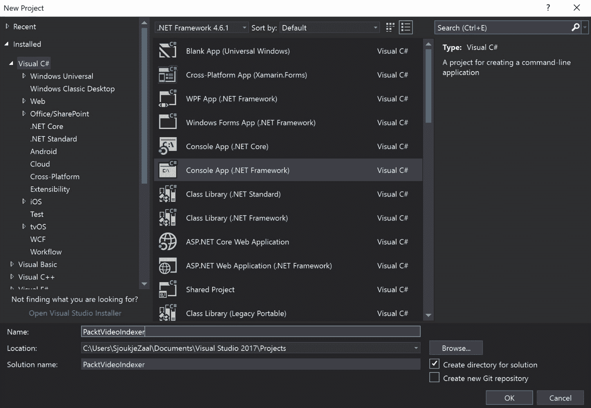

创建一个新的控制台应用程序

1.  安装 `windowsazure.mediaservices.extensions` 和 `windowsazure.mediaservices` NuGet 包。

1.  第一步是将 Azure AD 认证添加到项目中。对于本演示，我们使用 **服务主体认证**。你可以在 Azure 门户的 Azure 媒体服务账户设置的访问页面轻松完成此操作：

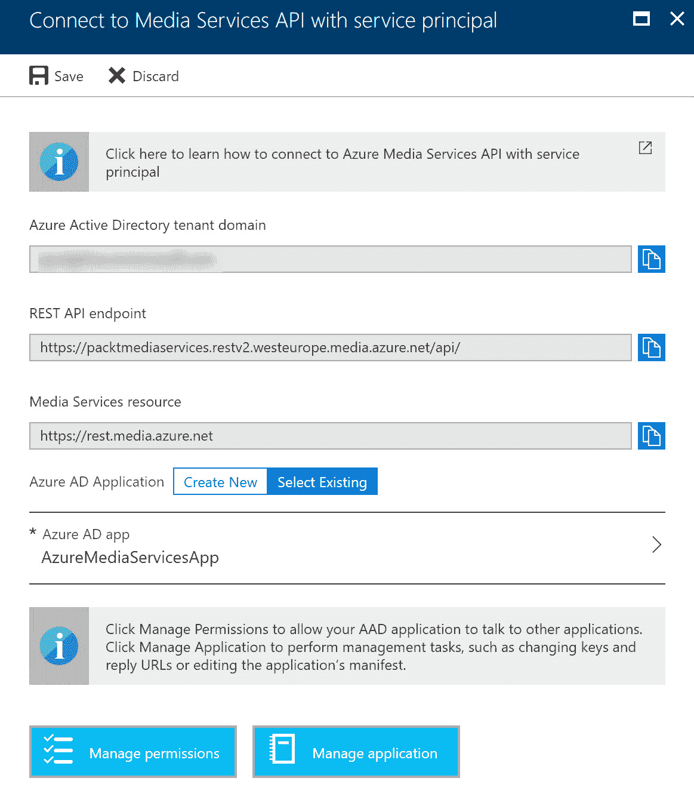

创建一个应用服务主体

1.  从 Azure 门户复制 Azure AD 租户名称、API URL、客户端 ID 和客户端密钥，并将它们添加到以下代码中：

```
var tokenCredentials = new AzureAdTokenCredentials("{YOUR Azure AD TENANT DOMAIN HERE}", new AzureAdClientSymmetricKey("{YOUR CLIENT ID HERE}", "{YOUR CLIENT SECRET}"), AzureEnvironments.AzureCloudEnvironment);

            var tokenProvider = new AzureAdTokenProvider(tokenCredentials);
```

1.  在认证代码下方的 `Main` 方法中添加以下代码：

```
_context = new CloudMediaContext(new Uri("https://packtmediaservices.restv2.westeurope.media.azure.net/api/"), tokenProvider);

            var video = @"C:\PacktIndexer\InputFiles\BigBuckBunny.mp4";
            var config = @"C:\PacktIndexer\InputFiles\config.json";
            var asset = RunIndexingJob(video, config);

            DownloadAsset(asset, @"C:\PacktIndexer\OutputFiles");
```

1.  添加以下方法以创建和运行 `Index Job`：

```
static IAsset RunIndexingJob(string inputMediaFilePath, string configurationFile)
        {
            IAsset asset = CreateAssetAndUploadSingleFile(inputMediaFilePath,
                "Packt Indexing Input Asset",
                AssetCreationOptions.None);

            IJob job = _context.Jobs.Create("Packt Indexing Job");

            string MediaProcessorName = "Azure Media Indexer 2 Preview";

            var processor = GetLatestMediaProcessorByName(MediaProcessorName);
            string configuration = File.ReadAllText(configurationFile);

            ITask task = job.Tasks.AddNew("Packt Indexing Task",
                processor,
                configuration,
                TaskOptions.None);

            task.InputAssets.Add(asset);
            task.OutputAssets.AddNew("Packt Indexing Output Asset", AssetCreationOptions.None);

            job.StateChanged += new EventHandler<JobStateChangedEventArgs>(StateChanged);
            job.Submit();

            Task progressJobTask = job.GetExecutionProgressTask(CancellationToken.None);

            progressJobTask.Wait();

            if (job.State == JobState.Error)
            {
                ErrorDetail error = job.Tasks.First().ErrorDetails.First();
                Console.WriteLine(string.Format("Error: {0}. {1}",
                                                error.Code,
                                                error.Message));
                return null;
            }

            return job.OutputMediaAssets[0];
        }
```

1.  添加以下方法以创建 `Asset`：

```
static IAsset CreateAssetAndUploadSingleFile(string filePath, string assetName, AssetCreationOptions options)
        {
            IAsset asset = _context.Assets.Create(assetName, options);

            var assetFile = asset.AssetFiles.Create(Path.GetFileName(filePath));
            assetFile.Upload(filePath);

            return asset;
        }
```

1.  添加以下方法以在索引后下载 `Asset`：

```
static void DownloadAsset(IAsset asset, string outputDirectory)
   {
     foreach (IAssetFile file in asset.AssetFiles)
      {
        file.Download(Path.Combine(outputDirectory, file.Name));
       }
    }
```

1.  添加以下代码以获取处理视频的 `MediaProcessor`：

```
static IMediaProcessor GetLatestMediaProcessorByName(string mediaProcessorName)
        {
           var processor = _context.MediaProcessors
              .Where(p => p.Name == mediaProcessorName)
              .ToList()
              .OrderBy(p => new Version(p.Version))
              .LastOrDefault();
            if (processor == null)
            throw new ArgumentException(string.Format("Unknown media processor",                                               mediaProcessorName));
            return processor;
        }
```

1.  最后，添加以下代码以在控制台中显示进度：

```
 static private void StateChanged(object sender, JobStateChangedEventArgs e)
    {
         Console.WriteLine("Job state changed event:");
         Console.WriteLine(" Previous state: " + e.PreviousState);
         Console.WriteLine(" Current state: " + e.CurrentState);
           switch (e.CurrentState)
           {
               case JobState.Finished:                       
Console.WriteLine();
               Console.WriteLine("Job is finished.");
               Console.WriteLine();
               break;
                case JobState.Canceling:
                case JobState.Queued:
                case JobState.Scheduled:
                case JobState.Processing:
                   Console.WriteLine("Please wait...\n");
                   break;
               case JobState.Canceled:
               case JobState.Error:
                   IJob job = (IJob)sender;
                   break;
               default:
                   break;
           }
       }
```

1.  运行应用程序，索引完成后，你应该会在 `output` 文件夹中根据 JSON 输入文件的值找到 `WebVtt` 和 `ttml` 文件。

在这个例子中，我们创建了闭字幕文件。你也可以调用其他方法来为视频创建索引。以下网站为你提供了更多关于前面描述的其他功能的示例：[`azuremedialabs.azurewebsites.net/demos/Analytics.html`](http://azuremedialabs.azurewebsites.net/demos/Analytics.html)。

# 小结

本章我们讲解了如何利用 Azure 提供的各种 AI 服务来设计解决方案。我们涵盖了 Azure 机器学习、物联网功能和 Azure 媒体服务。

在下一章中，我们将介绍 Azure 提供的不同消息传递功能以及如何设计有效的消息传递架构。

# 问题

回答以下问题，测试你对本章内容的理解。你可以在本书末尾的*评估*部分找到答案。

1.  你正在使用 IoT Hub 设计一个需要处理每天 500 万个事件的 IoT 解决方案。标准 S1 级别是否符合你的需求？

    1.  是

    1.  否

1.  Azure 媒体服务是否在底层使用了各种 Azure 认知服务 API？

    1.  是

    1.  否

1.  在需要 Azure 与设备之间进行双向通信的场景中，是否应该使用 Azure 事件中心？

    1.  是

    1.  否

# 进一步阅读

你可以通过以下链接了解更多关于本章所涉及主题的信息：

+   **认知服务目录**：[`azure.microsoft.com/en-us/services/cognitive-services/directory/lang/`](https://azure.microsoft.com/en-us/services/cognitive-services/directory/lang/)

+   **关于 Bot 服务**：[`docs.microsoft.com/en-us/bot-framework/bot-service-overview-introduction`](https://docs.microsoft.com/en-us/bot-framework/bot-service-overview-introduction)

+   **Azure 云中的机器学习简介**：[`docs.microsoft.com/en-us/azure/machine-learning/studio/what-is-machine-learning`](https://docs.microsoft.com/en-us/azure/machine-learning/studio/what-is-machine-learning)

+   **什么是 Azure 机器学习工作室？**：[`docs.microsoft.com/en-us/azure/machine-learning/studio/what-is-ml-studio`](https://docs.microsoft.com/en-us/azure/machine-learning/studio/what-is-ml-studio)

+   **在 Azure AI 画廊中共享和发现资源**：[`docs.microsoft.com/en-us/azure/machine-learning/studio/gallery-how-to-use-contribute-publish`](https://docs.microsoft.com/en-us/azure/machine-learning/studio/gallery-how-to-use-contribute-publish)

+   **Azure 机器学习工作台**：[`blogs.msdn.microsoft.com/uk_faculty_connection/2017/09/29/azure-machine-learning-workbench/`](https://blogs.msdn.microsoft.com/uk_faculty_connection/2017/09/29/azure-machine-learning-workbench/)

+   **Azure 机器学习工作室算法与模块参考**：[`docs.microsoft.com/en-us/azure/machine-learning/studio-module-reference/index`](https://docs.microsoft.com/en-us/azure/machine-learning/studio-module-reference/index)

+   **Azure IoT 套件**: [`azure.microsoft.com/en-us/suites/iot-suite/`](https://azure.microsoft.com/en-us/suites/iot-suite/)

+   **Azure IoT Hub 服务概述**: [`docs.microsoft.com/en-us/azure/iot-hub/iot-hub-what-is-iot-hub`](https://docs.microsoft.com/en-us/azure/iot-hub/iot-hub-what-is-iot-hub)

+   **事件中心文档**: [`docs.microsoft.com/en-us/azure/event-hubs/`](https://docs.microsoft.com/en-us/azure/event-hubs/)

+   **Azure IoT Edge**: [`docs.microsoft.com/en-us/azure/iot-edge/`](https://docs.microsoft.com/en-us/azure/iot-edge/)

+   **流分析文档**: [`docs.microsoft.com/en-us/azure/stream-analytics/`](https://docs.microsoft.com/en-us/azure/stream-analytics/)

+   **Azure 时间序列洞察**: [`docs.microsoft.com/en-us/azure/time-series-insights/`](https://docs.microsoft.com/en-us/azure/time-series-insights/)

+   **媒体服务文档**: [`docs.microsoft.com/en-us/azure/media-services/`](https://docs.microsoft.com/en-us/azure/media-services/)
