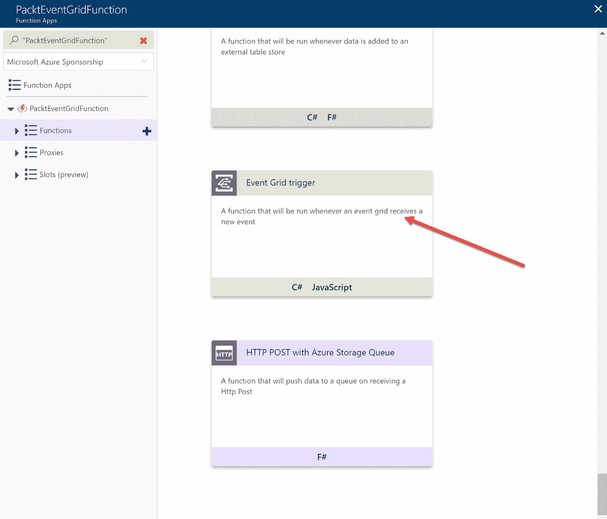
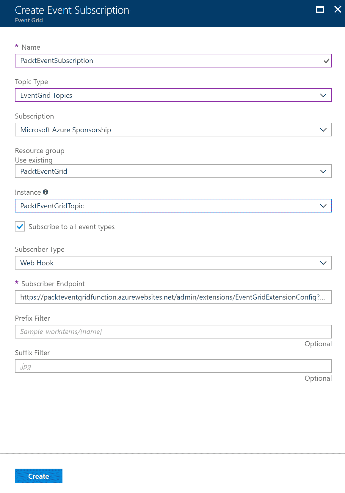

# 第十三章：实现消息传递解决方案

在上一章中，我们讨论了如何使用 Azure 提供的各种人工智能服务设计解决方案。我们涵盖了 Azure 机器学习、物联网功能和 Azure 媒体服务。

在本章中，您将学习如何使用 Azure 服务总线、Azure 队列、通知中心、Azure 事件网格以及前几章中介绍的服务（如 Logic Apps 和 Event Hubs）来设计有效的消息传递架构。

以下主题将被涵盖：

+   Azure 存储队列

+   Azure 服务总线

+   Azure 事件网格

+   通知中心

+   设计有效的消息传递架构

# 技术要求

本章示例使用以下工具：

+   Azure PowerShell: [`docs.microsoft.com/en-us/powershell/azure/install-azurerm-ps?view=azurermps-5.1.1`](https://docs.microsoft.com/en-us/powershell/azure/install-azurerm-ps?view=azurermps-5.1.1)

本章的源代码可以通过以下链接下载：

+   [`github.com/SjoukjeZaal/AzureArchitectureBook/tree/master/Chapter%2013`](https://github.com/SjoukjeZaal/AzureArchitectureBook/tree/master/Chapter%2013)

# Azure 队列存储

我们在第七章的*使用存储解决方案*部分简要介绍了 Azure 队列存储。队列存储提供异步消息处理。它提供了一个可靠和持久的消息传递机制，并提供支持 GET/PUT/PEEK 操作的 REST API。消息队列可用于解耦应用程序，从而实现不同应用组件之间的独立扩展。

Azure 队列存储提供以下功能：

+   单个队列的消息最大可达 64 KB。消息在队列中的最大存留时间为 7 天。

+   当请求队列中的消息时，消息可能对其他读取者变得不可见。在此期间，消息会被锁定，其他应用程序无法处理。默认情况下，这种状态会持续 30 秒。

+   消息处理完毕后，应从队列中删除。如果消息没有从请求消息的应用程序中删除，经过 30 秒的不可见时间后，它将再次变得可见。

# Azure 服务总线

Azure 服务总线是一个高可靠性、经代理的消息传递系统，适用于集成场景和物联网解决方案。它面向企业应用，提供了中间件技术，如消息队列和发布/订阅消息传递。它解耦了应用程序和服务之间的通信。

Azure 服务总线提供以下主要功能：

+   **队列**：此功能提供异步、解耦的消息通信，支持应用程序和服务之间的消息传递。它提供先入先出（FIFO）消息投递，每条消息只会被一个消费者接收。消息存储在队列中，因此发送方和消费者无需同时连接到队列。服务总线队列还提供**会话**，可以使用会话 ID 对消息进行分组。这样，消息可以被隔离并由专门的客户端处理。

+   **主题和订阅**：此功能与队列相同，不同之处在于可以有多个消费者。它使用发布/订阅模式，消息被发送到**主题**。应用程序不会直接连接到该主题，而是连接到**订阅**。然后，订阅连接到主题。订阅可以有过滤器，只订阅一部分消息，称为**过滤表达式**。

+   **WCF 中继**：WCF 中继提供了一个网关，使您可以将本地 WCF 服务连接到 Azure，而无需在您的网络上打开防火墙连接。Azure 中继服务已经在第六章《连接混合应用程序》中详细介绍，*连接混合应用程序*。

有关 Azure Service Bus 功能示例的概览，您可以参考以下 GitHub 页面：[`github.com/Azure/azure-service-bus/tree/master/samples`](https://github.com/Azure/azure-service-bus/tree/master/samples)。

在不同的关键功能中，Azure Service Bus 提供事务能力。它允许所有针对消息的操作要么成功，要么失败。

Azure Service Bus 提供以下几种层级：

+   **基础**：此层提供队列和定时消息功能。消息大小最大可达 256 KB。

+   **标准**：在基础层之上，标准层提供主题和订阅；事务、会话和去重功能也包含在内。

+   **高级**：在标准层之上，高级层提供最大消息大小为 1 MB。

# Azure Event Grid

Azure Event Grid 是 Azure 中的一项服务，支持跨不同 Azure 资源的事件管理。与其在应用程序中创建轮询机制以检查更改，不如在事件发生时，应用程序能够自动收到通知。

Azure Event Grid 提供每秒数百万个事件的吞吐量，并具备 24 小时重试机制。您可以根据发布路径过滤事件，从而仅接收与您的应用程序或资源相关的事件。事件可以通过 Azure 门户配置，无需使用代码即可创建，并被称为内置事件。您还可以创建自定义事件，这些事件可以在您的自定义应用程序、PowerShell 或 CLI 中创建。

Azure 事件网格目前提供以下内置发布者：Azure 订阅、事件中心、自定义主题、IoT Hub、Azure 资源组、Blob 存储、Service Bus 和 V2 存储帐户。对于事件处理程序，事件网格目前提供 Webhook、Azure 自动化、Azure 函数、逻辑应用、事件中心和 Microsoft Flow：


Azure 事件网格

Azure 事件网格会快速添加新的发布者和事件处理程序，因此请关注 [`docs.microsoft.com/en-us/azure/event-grid/overview`](https://docs.microsoft.com/en-us/azure/event-grid/overview)。

# 使用 Azure 事件网格路由事件

在此示例中，我们将事件从事件网格路由到 Azure 函数。

首先，我们需要在 Azure 中创建一个新的事件网格主题。要创建此主题，请按以下步骤操作：

1.  打开 [`portal.azure.com/`](https://portal.azure.com/)，导航至 Azure 门户。

1.  单击**新建**，在搜索栏中输入`事件网格主题`。创建一个新的事件网格主题。

1.  输入以下设置，然后单击**确定**：


创建事件网格主题

1.  接下来，使用以下配置创建一个新的 Azure 函数：


创建 Azure 函数

1.  创建 Azure 函数后，导航到设置，然后单击函数文件：


选择 Azure 函数文件

1.  单击 + 按钮并选择**自定义函数**：


创建自定义函数

1.  在下一个选项卡中，向下滚动并选择**事件网格触发器**：



选择事件网格触发器模板

1.  添加以下设置，然后单击**创建**：


创建触发器

1.  创建触发器后，默认会打开 `run.csx` 文件。单击顶部菜单中的**添加事件网格订阅**链接：


选择事件网格订阅

1.  命名事件订阅，并选择我们之前创建的事件网格：



创建事件订阅

1.  点击**创建**；这将创建一个订阅事件网格主题的新事件订阅。

1.  打开 PowerShell 并从您的桌面运行以下脚本。这将创建一个自定义事件。您可以查看 Azure 函数日志以获取结果：

```
Login-AzureRmAccount
Select-AzureRmSubscription -SubscriptionId "********-****-****-****-***********"

$endpoint = (Get-AzureRmEventGridTopic -ResourceGroupName PacktEventGrid -Name PacktEventGridTopic).Endpoint
$keys = Get-AzureRmEventGridTopicKey -ResourceGroupName PacktEventGrid -Name PacktEventGridTopic

$eventID = Get-Random 99999

#Date format should be SortableDateTimePattern (ISO 8601)
$eventDate = Get-Date -Format s

#Construct body using Hashtable
$htbody = @{
 id= $eventID
 eventType="recordInserted"
 subject="myapp/packtpub/books"
 eventTime= $eventDate 
 data= @{
 title="Architecting Microsoft Solutions"
 eventtype="Ebook"
 }
 dataVersion="1.0"
}

#Use ConvertTo-Json to convert event body from Hashtable to JSON Object
#Append square brackets to the converted JSON payload since they are expected in the event's JSON payload syntax
$body = "["+(ConvertTo-Json $htbody)+"]"

Invoke-WebRequest -Uri $endpoint -Method POST -Body $body -Headers @{"aeg-sas-key" = $keys.Key1}
```

# 通知中心

Azure 中的通知中心提供了一种推送通知服务，用于将后端的通知发送到移动设备上。移动设备上的推送通知通常以弹出窗口或对话框的形式显示给用户。用户可以决定是否查看或关闭消息。您可以将推送通知用于各种场景，例如发送 MFA 的代码、从社交媒体发送通知以及发送新闻。

Notification Hubs 提供跨平台通知，提供适用于 iOS、Android 和 Windows 设备的一套 SDK 和 API。通常，应用程序会使用平台通知系统（PNS），这些是专用的基础设施平台。例如，Apple 提供 Apple 推送通知服务，Windows 提供 Windows 通知服务。Notification Hubs 通过提供单一的 API，消除了在应用程序中手动调用不同 PNS 的复杂性，它通过平台独立性、巨大的扩展性、多种传递模式、丰富的遥测等功能简化了这一过程。

Notification Hubs 提供以下层级：

+   **Free**：此层级每月提供最多 100 万条推送消息，支持 100 个命名空间，每个命名空间有 500 个活动设备，总计支持 100 个中心。

+   **Basic**：除了免费层外，Basic 层每月提供最多 1000 万条推送消息，支持 100 个命名空间，每个命名空间有 20 万个活动设备。此计划涵盖 SLA，并且还提供有限的遥测功能。

+   **Standard**：除了 Basic 层，Standard 层每月提供最多 1000 万条推送消息，支持无限个命名空间，每个命名空间有 1000 万个活动设备。它还提供丰富的遥测、定时推送功能、大规模导入和多租户功能。

# 设计有效的消息传递架构

Azure 提供了多种功能和能力，用于设计和实现消息传递解决方案。为了在 Azure 平台上创建成功的应用程序和解决方案架构，一个有效的消息传递架构至关重要。这将带来强大的解决方案和应用程序，能够充分利用 Azure 平台的扩展能力。同时，它还将为你的应用程序提供高性能，并且实现应用程序之间的解耦。

本书中描述了多个 Azure 资源，你现在应该知道每个资源的功能。接下来的部分将从消息传递和集成的角度再次讲解其中的一些资源。这将为你提供概览，并帮助你在 Azure 平台上设计消息传递和物联网解决方案时做出正确的决策：

+   **Azure Functions 与 Logic Apps**：你可以将 Logic Apps 想象成由事件触发的工作流，将 Azure Functions 想象成由事件触发的代码。因此，当你的解决方案需要自定义代码或自定义转换时，选择 Azure Functions。当你的解决方案需要连接其他 SaaS 解决方案，如 Office 365、Azure 存储和 SalesForce 时，选择 Logic Apps。它提供了大量的连接器，可以通过 HTTPS 轻松连接。此外，当需要图形化编辑器时，选择 Logic Apps。

+   **Azure IoT Hub 与 Azure 事件中心的比较**: Azure IoT Hub 提供设备到 Azure 和 Azure 到设备的双向通信。它可以处理每秒数百万事件，并支持多种设备协议，如 MQTT、MQTT over WebSockets、AMQP、AMQP over WebSockets 和 HTTPS，MQTT、MQTT over WebSockets、AMQP、AMQP over WebSockets 和文件上传。因此，如果您的解决方案需要大规模事件处理和双向通信，请选择 Azure IoT Hub。事件中心仅允许设备到 Azure 的单向通信。因此，当您的解决方案仅需要数据摄取时，事件中心可能是更合适和具有成本效益的解决方案。

+   **Azure 服务总线与 Azure 存储队列的比较**: Azure 服务总线是一个面向企业规模的经纪消息解决方案。它提供了更多的企业消息能力，如事务和会话支持。它还支持更大的消息。Azure 服务总线在高级版中支持最大 1 MB 的消息。Azure 队列存储支持最大 64 KB 的消息。

# 摘要

在本章中，我们介绍了 Azure 为各种类型的应用程序和解决方案提供的不同消息传递解决方案。您还学习了如何在应用程序中使用正确的消息传递解决方案。这结束了设计平台服务目标的最后一章。

接下来，我们将看一下设计运维目标，这将是本书的最后一个目标。它将从不同的应用程序监控和警报策略开始。

# 问题

回答以下问题，测试您对本章信息的了解。您可以在本书结尾的*评估*部分找到答案。

1.  您正在为组织设计一个全球移动应用程序，需要每月处理约 1000 万推送消息。您的管理员有监控要求。基本层是否适合您的应用程序？

    1.  是的

    1.  不

1.  您正在为组织设计一个无服务器解决方案，并且需要在解决方案中调用外部 SDK 进行图像处理。Azure 逻辑应用是否是适当的解决方案？

    1.  是的

    1.  不

1.  您正在为组织设计一个消息传递解决方案，并且需要大约 1 MB 大小的消息。您应该使用 Azure 存储队列来解决这个问题吗？

    1.  是的

    1.  不

# 进一步阅读

您可以查看以下链接，获取本章涵盖的主题的更多信息：

+   **通知中心文档**: [`docs.microsoft.com/en-us/azure/notification-hubs/`](https://docs.microsoft.com/en-us/azure/notification-hubs/)

+   **Azure 事件网格文档**: [`docs.microsoft.com/en-us/azure/event-grid/`](https://docs.microsoft.com/en-us/azure/event-grid/)

+   **Azure 逻辑应用文档**: [`docs.microsoft.com/en-us/azure/logic-apps/`](https://docs.microsoft.com/en-us/azure/logic-apps/)

+   **使用.NET 开始 Azure 队列存储**：[`docs.microsoft.com/en-us/azure/storage/queues/storage-dotnet-how-to-use-queues`](https://docs.microsoft.com/en-us/azure/storage/queues/storage-dotnet-how-to-use-queues)

+   **向您的 Android 应用添加推送通知**：[`docs.microsoft.com/en-us/azure/app-service-mobile/app-service-mobile-android-get-started-push`](https://docs.microsoft.com/en-us/azure/app-service-mobile/app-service-mobile-android-get-started-push)

+   **向您的 iOS 应用添加推送通知**：[`docs.microsoft.com/en-us/azure/app-service-mobile/app-service-mobile-ios-get-started-push`](https://docs.microsoft.com/en-us/azure/app-service-mobile/app-service-mobile-ios-get-started-push)

+   **Azure Logic Apps 文档**：[`docs.microsoft.com/en-us/azure/logic-apps/`](https://docs.microsoft.com/en-us/azure/logic-apps/)

+   **Azure Functions 文档**：[`docs.microsoft.com/en-us/azure/azure-functions`](https://docs.microsoft.com/en-us/azure/azure-functions/)
