# 应用程序监控和告警策略

在上一章中，我们介绍了如何设计有效的消息传递解决方案，通过涵盖 Azure 服务总线和 Azure 队列存储并结合不同的 Azure 资源，构建有效的消息传递架构。

在本章中，我们介绍了面向运营的设计目标，通过概述 Azure 提供的可用解决方案，涵盖了应用程序和平台监控及告警策略。通过本章的学习，您应该能够在 Azure 平台及您的自定义解决方案和配置中出现问题时，知道何时使用不同类型的解决方案。

以下主题将涵盖：

+   Azure 日志分析

+   Azure 监视器

+   应用程序洞察

+   Azure 服务健康

+   Azure 顾问

+   Azure 网络观察器

# Azure 日志分析

Azure 日志分析是一项服务，可以收集并分析来自各种 Azure 资源和本地资源的日志文件。它可以将所有数据收集到一个工作区，并提供查询语言来查询数据。

你可以通过在 Windows 和 Linux 虚拟机上安装代理，将虚拟机中的数据集成到日志分析中，或者也可以连接到 System Center 操作管理器，从现有代理收集遥测数据。大多数 Azure 资源已在日志分析中集成。你只需从 Azure 门户创建一个工作区，即可收集这些资源的数据。然后，你可以使用查询语言直接从工作区查询数据，或者使用可以分析数据的分析工具。分析工具的一些示例包括操作管理套件、Azure 安全中心和应用程序洞察。你还可以将数据导入 Power BI，以创建数据可视化。

数据收集后，将按数据类型组织成数据表。它可以从以下资源收集数据：

+   来自 Azure 监视器的数据可以在日志分析中收集，并使用查询语言进行搜索

+   代理可以安装在 Windows 和 Linux 机器上，将数据发送到日志分析

+   可以将 System Center 操作管理器管理组连接到日志分析，以收集代理的数据

+   应用程序洞察和 Azure 安全中心默认使用日志分析存储数据

+   日志分析提供了可以从 PowerShell 使用的 cmdlet，并且可以在 Azure 自动化 Runbook 中使用

+   它提供了一个 HTTP 数据收集器 API，可以在自定义应用程序中使用，将日志数据发送到日志分析

# 创建日志分析工作区

创建日志分析工作区的步骤如下：

1.  通过打开：[`portal.azure.com/`](https://portal.azure.com/) 进入 Azure 门户。

1.  点击“新建”并在搜索框中输入 `Log Analytics`，然后创建一个新的工作区。

1.  输入以下设置并点击“确定”：

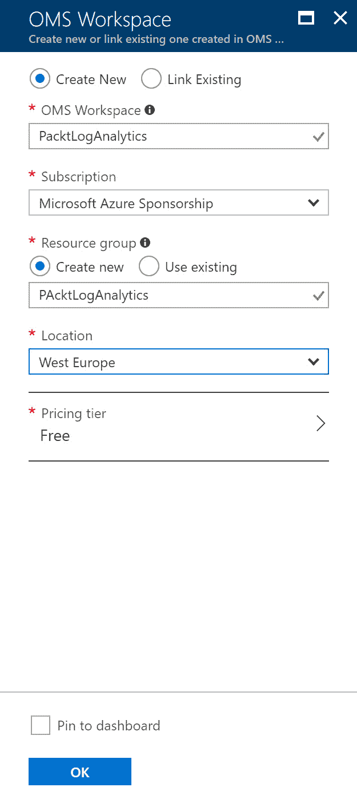

创建日志分析工作区

1.  工作区现在已经创建。

1.  现在，你可以将 Azure 资源连接到工作区。例如，选择在第一章中创建的 PacktPub 资源组，并在 Azure 门户中打开设置。点击左侧菜单中的 **Activity log**：

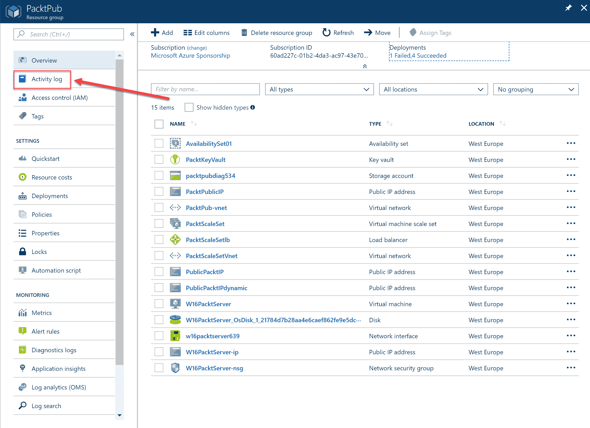

Azure 资源组概览面板

1.  点击顶部菜单中的 **Log Analytics**，点击 **Add** 按钮，选择在前面步骤中创建的工作区并点击 **OK**：

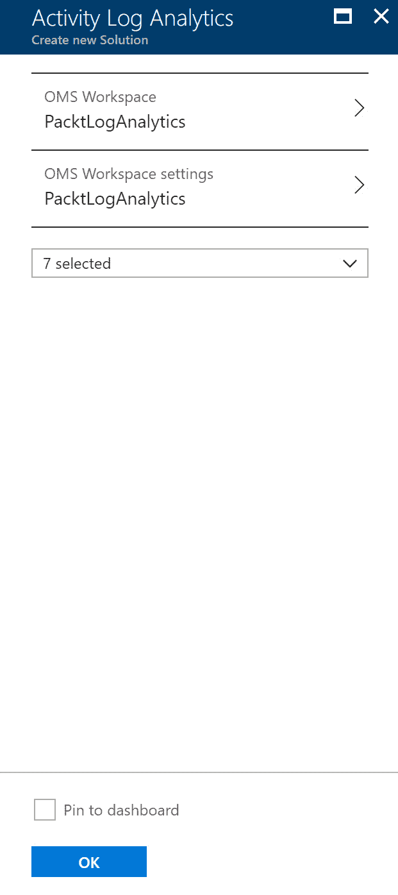

选择工作区

1.  该资源组的日志现在已发送到 Log Analytics 工作区。

1.  当你返回到 Log Analytics 概览面板并点击 **View Designer** 时，会打开一个面板，你可以在其中创建数据视图：

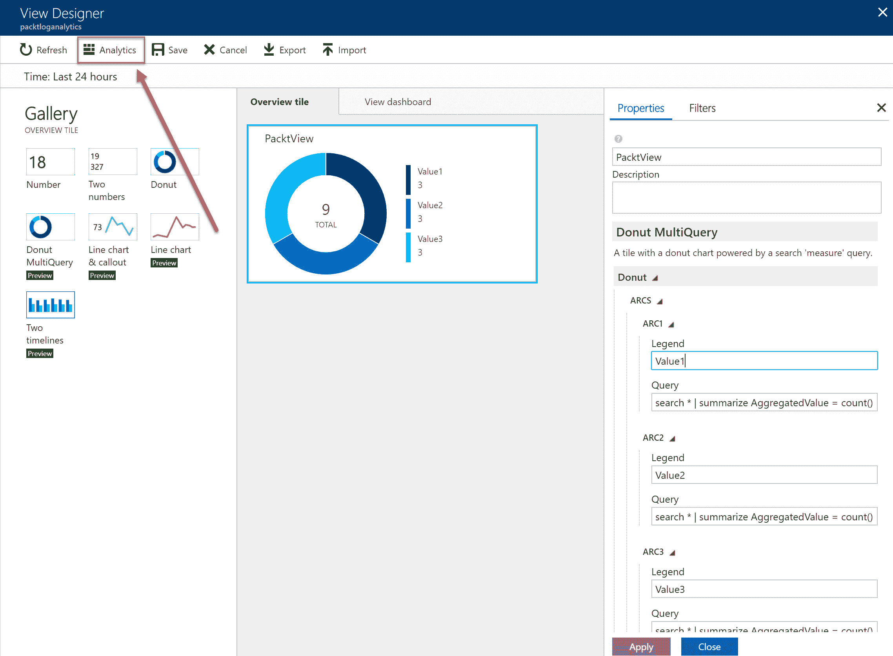

Log Analytics 设计器

1.  你还可以点击顶部菜单中的 **Analytics** 按钮，这将打开 Log Analytics 门户。在这里，你可以使用预定义查询或创建自定义查询。在那里，你可以打开一个新标签页并创建一个新查询。你可以添加以下查询来创建一个按严重性划分、按天（过去 7 天）的警报计数的条形图：

```
Alert 
| where TimeGenerated > ago(7d)
| summarize count() by AlertSeverity, bin(TimeGenerated, 1d)
| render barchart kind=unstacked
```

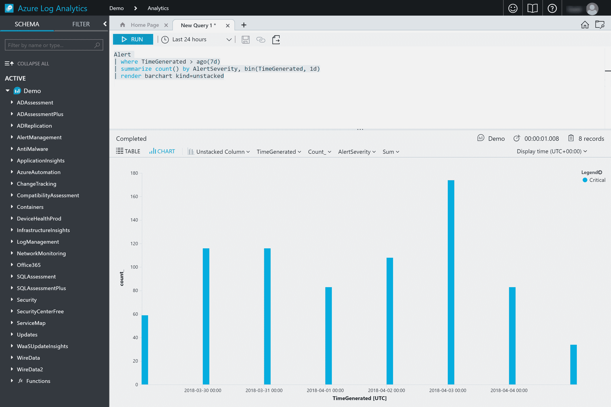

Log Analytics 门户中的查询结果

1.  当你返回 Azure 门户中的 **Log Analytics Overview** 面板并点击 **OMS Portal** 时，Microsoft 操作管理套件应该会打开，在那里你可以查看所有日志和其他活动：

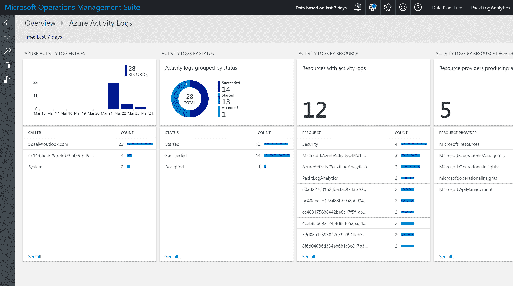

Microsoft 操作管理套件

# Azure Monitor

Azure Monitor 是 Azure 门户中的一种监控解决方案，提供 Microsoft Azure 中几乎所有服务的基础设施度量和日志。在编写本书时，并非所有 Azure 资源都已添加到 Azure Monitor，但未来会有更多资源被添加。

Azure Monitor 提供以下功能：

+   **Activity Log**：活动日志提供关于 Azure 订阅内所有类型事件的信息。这些活动可能包括停止或启动虚拟机、维护活动等。它提供不同的事件类别，如管理、安保、服务健康、自动缩放、警报、建议、政策和资源健康事件。事件会被保存 90 天的保留期。查询可以保存并固定到 Azure 仪表板，也可以导出到存储帐户中，以便长期存储。它们还可以导出到事件中心进行实时流式传输，或发送到 Log Analytics。

+   **诊断设置**： 这提供了关于在 Azure 订阅中某个特定资源内部发生的事件的信息，例如从 Azure Key Vault 检索机密的事件。默认情况下，这些事件不会被收集；需要在 Azure 门户中手动为资源启用，或者在创建资源时通过 ARM 模板、PowerShell 或调用 REST API 来启用。这些事件也可以存储在存储帐户或事件中心，或发送到 Log Analytics，就像活动日志中的事件一样。

+   **指标**：指标提供了基于时间的度量点，就像 Windows Server 中的性能计数器一样。默认情况下，指标是可用的，并且具有 93 天的保留期。你可以检查 Azure 资源的性能并跟踪已用和可用的积分。例如，它们可以发送到事件中心、Azure 流分析，并且你可以使用 REST API 和 PowerShell 检索和查询数据。

+   **警报**：警报部分提供了一个地方来查看和管理所有 Azure 警报。它显示来自活动日志、指标、Application Insights 和 Log Analytics 的警报。你可以创建警报规则，这些规则可以发送电子邮件或短信、Webhook、将数据发送到第三方 IT 服务管理应用程序，或调用自动化运行书。

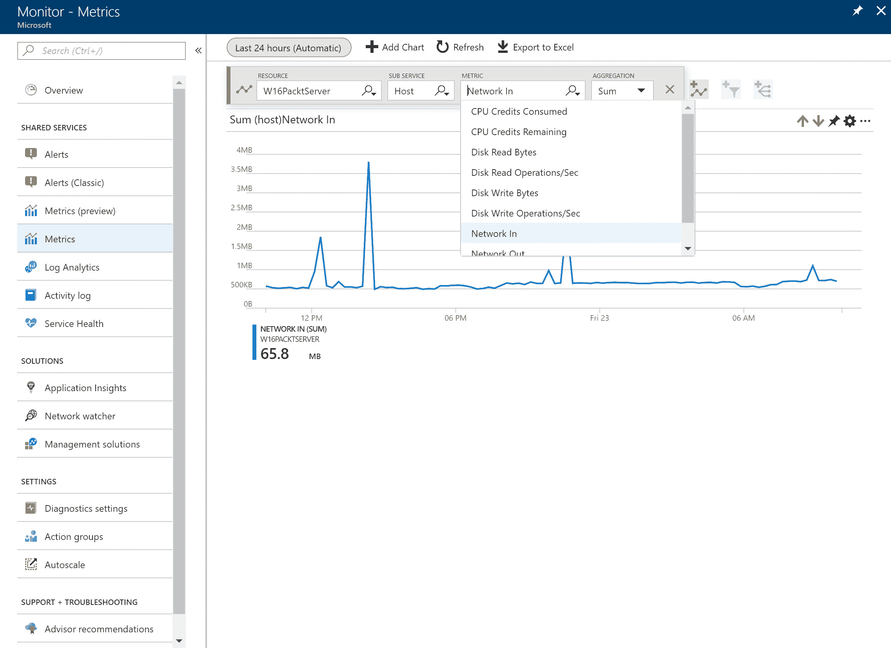

Azure 监控指标

# Application Insights

Application Insights 为在 Azure 中托管的跨平台应用程序和本地应用程序提供了监控解决方案。它面向开发人员，可用于监控性能和检测问题，帮助提高应用程序的可用性。它可以集成到 DevOps 流程和开发工具中，例如 Visual Studio。

开发人员可以在 Azure 中设置一个 Application Insights 资源，并在他们的应用程序中安装一个包。这可以是一个 Azure 应用程序，也可以是本地应用程序，它们都可以连接到 Azure 中的资源。这个包负责将遥测数据发送到 Azure。你也可以添加性能计数器、Docker 日志和诊断日志。

它收集以下类型的应用程序事件：

+   **速率数据**：可以将不同类型的速率数据发送到 Application Insights，例如请求和依赖项速率、响应时间和用户会话计数。

+   **异常**：应用程序内部发生的异常可以发送到 Application Insights。

+   **页面浏览量和性能**：它可以提供有关应用程序页面浏览量和加载性能的信息。

+   **诊断日志**： 这会将 Docker 主机诊断信息发送到 Application Insights，并从应用程序发送追踪日志。

+   **AJAX 调用**：这是 AJAX 调用的性能、失败请求和响应时间。

+   **自定义事件**：你也可以在应用程序中创建自定义事件。

+   **集成**：它可以与 Visual Studio 应用中心和 HockeyApp 集成，以分析来自移动应用程序的遥测数据。

一旦数据发送到 Azure，它可以在 Azure 门户中查看。Azure 门户提供了不同的功能来展示和分析数据。它提供了应用程序映射刀片、实时指标流、指标资源管理器刀片、性能刀片等：

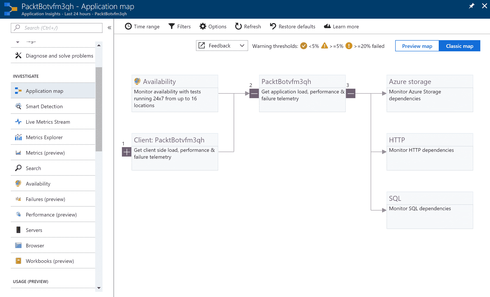

Azure 门户中的应用洞察

# Azure 服务健康

Azure 服务健康在 Azure 门户中提供了一个仪表板，展示了与不同 Azure 资源相关的问题。这可以帮助你了解维护计划，维护计划是可能影响 Azure 资源可用性的平台问题。

它提供以下视图来自 Azure 门户：

+   **服务问题**：这提供了当前所有 Azure 区域内发生的全球问题概览。它还提供了健康历史记录，你可以在此查看或下载历史事件的总结。

+   **计划维护**：这提供了所有已安排的维护事件的概览。

+   **资源健康**：概述了 Azure 订阅中不同资源的当前和历史健康状况。当遇到问题时，你也可以在此运行故障排除工具。

+   **健康警报**：你也可以在这里创建健康警报，以便在安排维护活动或发生服务问题时接收到通知。

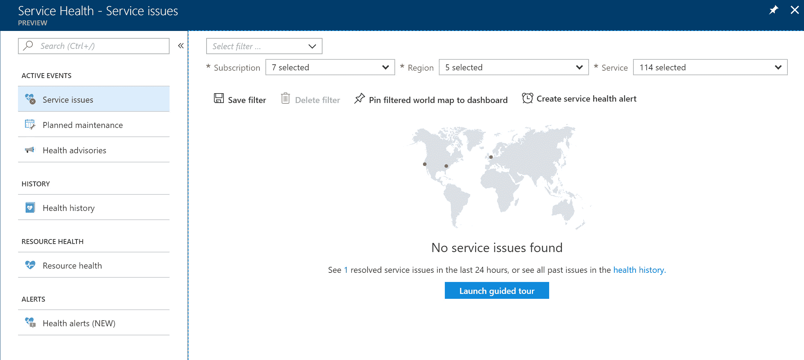

Azure 门户中的 Azure 服务健康

# Azure 顾问

Azure 顾问是一个帮助你遵循 Azure 部署最佳实践的工具。它分析所有 Azure 资源的当前配置，并基于此提供建议。对于大多数建议，你可以直接在 Azure 顾问门户内进行处理。

它提供以下类别：

+   **高可用性**：这提供了若干建议，帮助提高应用程序和其他 Azure 资源的持续性，比如启用备份和创建可用性集。

+   **安全性**：它提供了提高 Azure 资源安全性的建议，并与 Azure 安全中心集成。

+   **性能**：这提供了针对不同 Azure 资源的整体性能建议，如数据库性能和应用服务性能。

+   **成本**：本部分提供了提高成本效益的建议，比如调整虚拟机的大小或关闭虚拟机，或通过消除未配置的 ExpressRoute 电路来降低成本。

# 来自 Azure 顾问的地址建议

若要直接处理 Azure 顾问的建议，请按以下步骤操作：

1.  通过打开以下链接访问 Azure 门户：[`portal.azure.com/`](https://portal.azure.com/)。

1.  从左侧菜单中选择 Azure 顾问。

1.  你将获得所有不同推荐的概览，这些推荐被分类为四个部分：

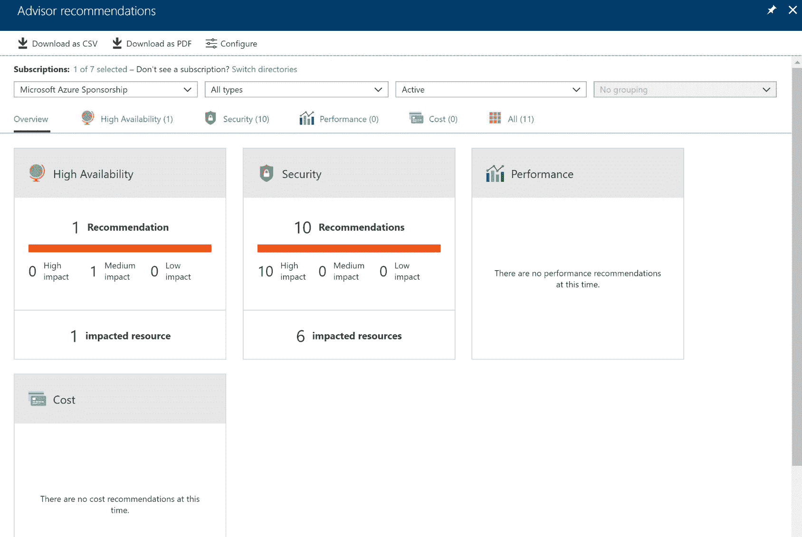

Azure 顾问概览

1.  这些推荐是基于我们为本书创建的所有不同服务。因此，如果你跟随了教程，你的推荐内容将与此相同。对于这个示例，我们选择**安全性**部分，然后选择“跟随安全中心推荐”。挑选一个高严重性的推荐：

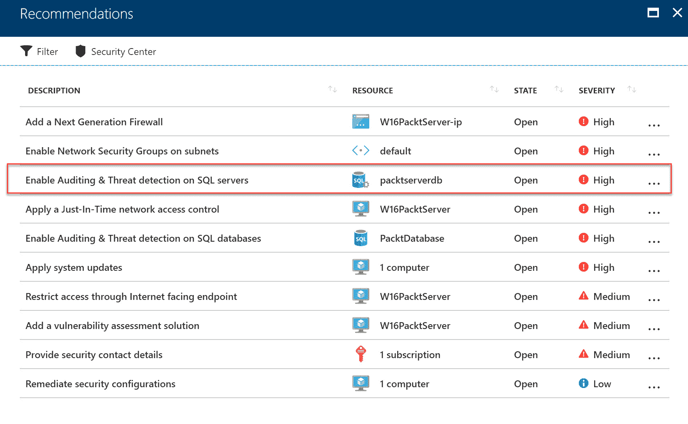

安全推荐

1.  打开一个新窗格，你可以选择数据库。在这里，你可以直接为选定的数据库启用**审计与威胁检测**。

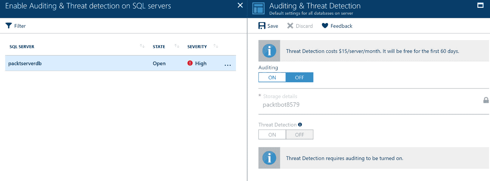

审计与威胁检测设置

# Azure 网络监视器

Azure 网络监视器为所有网络通信提供了一个网络监控解决方案，覆盖 Azure 资源层级。包括虚拟网络（VNets）、ExpressRoute 电路、应用网关流量、负载均衡器等。可以通过 Azure 门户访问，并提供监控工具、诊断工具和来自网络层级的日志。

它提供以下功能：

+   **拓扑**：这通过提供一个图形视图，展示了虚拟网络（VNet）中所有网络资源的概览。通过 Azure 门户，它提供了所有网络部分的子集。要查看完整的资源列表，可以使用 PowerShell 或 REST API。

+   **IP 流量验证**：这提供了虚拟机网络接口允许或拒绝的数据包概览。它帮助管理员快速解决连接性问题。

+   **下一跳**：这提供了数据包目标路由的概览。它有助于确定连接性问题，并检查数据包是否到达目标，例如本地虚拟机。

+   **安全组视图**：这提供了一个概览，展示了所有配置的网络安全组（NSG）和与其相关的规则，从两个不同的层次进行展示，分别是网络接口层和子网层。

+   **VPN 诊断**：这提供了一个 VPN 网关和连接的故障排除解决方案。可以通过 Azure 门户、PowerShell、Azure CLI 或 REST API 调用连接和网关，并返回结果。

+   **数据包捕获**：你可以捕获网络流量数据包以诊断网络异常。它需要安装在虚拟机上的扩展来捕获数据包。数据包可以存储在虚拟机本地或 Azure Blob 存储中，以便进一步分析。

+   **连接故障排除**：这提供了一个故障排除解决方案，用于检查虚拟机到虚拟机、IPv4 地址、URI 以及完全限定域名（FQDN）的 TCP 连接。通过收集所有配置，它帮助检测连接性问题。它使用与数据包捕获功能相同的扩展，并且可以通过 PowerShell、CLI 和 REST API 检查连接性。

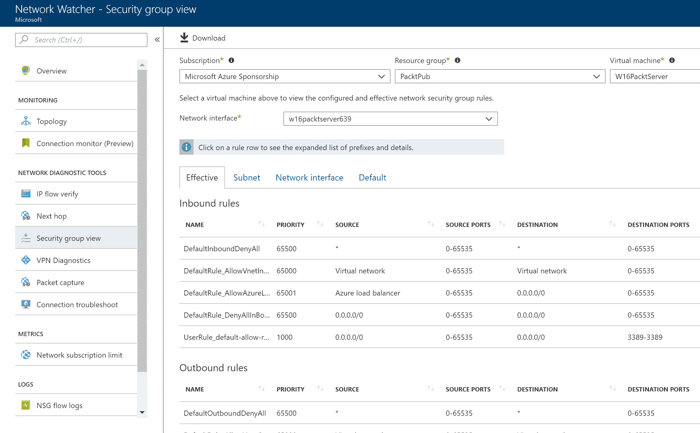

网络监视器概览

# 总结

本章中，我们介绍了 Azure 从平台和应用程序的角度提供的不同监控解决方案，如 Application Insights、Network Watcher 和 Azure Log Analytics。

下一章将是本目标的最后一章，也是本书的最终章，第十五章，*探索操作自动化策略*。

# 问题

回答以下问题以测试您对本章信息的理解。您可以在本书末尾的*评估*部分找到答案：

1.  您正在设计一个 IoT 解决方案，并希望为管理员提供实时监控工具。您应该使用 Azure Log Analytics 吗？

    1.  是的

    1.  不是

1.  Azure Network Watcher 是一个需要在您的计算机上安装的独立应用程序吗？

    1.  是的

    1.  不是

1.  您希望了解 Azure 平台上所有已安排的维护事件概况。您可以从 Azure 服务健康中获取此信息吗？

    1.  是的

    1.  不是

# 进一步阅读

您可以查看以下链接以获取更多有关本章所涵盖主题的信息：

+   **什么是 Azure Log Analytics？**： [`docs.microsoft.com/en-us/azure/log-analytics/log-analytics-overview`](https://docs.microsoft.com/en-us/azure/log-analytics/log-analytics-overview)

+   **使用日志分析中的视图设计器创建自定义视图**： [`docs.microsoft.com/en-us/azure/log-analytics/log-analytics-view-designer`](https://docs.microsoft.com/en-us/azure/log-analytics/log-analytics-view-designer)

+   **Azure Monitor 文档**： [`docs.microsoft.com/en-us/azure/monitoring-and-diagnostics/`](https://docs.microsoft.com/en-us/azure/monitoring-and-diagnostics/)

+   **Azure Monitor 概述**： [`docs.microsoft.com/en-us/azure/monitoring-and-diagnostics/monitoring-overview-azure-monitor`](https://docs.microsoft.com/en-us/azure/monitoring-and-diagnostics/monitoring-overview-azure-monitor)

+   **Application Insights 文档**： [`docs.microsoft.com/en-us/azure/application-insights/`](https://docs.microsoft.com/en-us/azure/application-insights/)

+   **Azure 服务健康文档**： [`docs.microsoft.com/en-us/azure/service-health/`](https://docs.microsoft.com/en-us/azure/service-health/)

+   **Azure Advisor 简介**： [`docs.microsoft.com/en-us/azure/advisor/advisor-overview`](https://docs.microsoft.com/en-us/azure/advisor/advisor-overview)

+   **Azure Network Watcher 文档**： [`docs.microsoft.com/en-us/azure/network-watcher/`](https://docs.microsoft.com/en-us/azure/network-watcher/)
