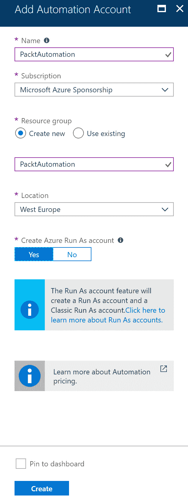
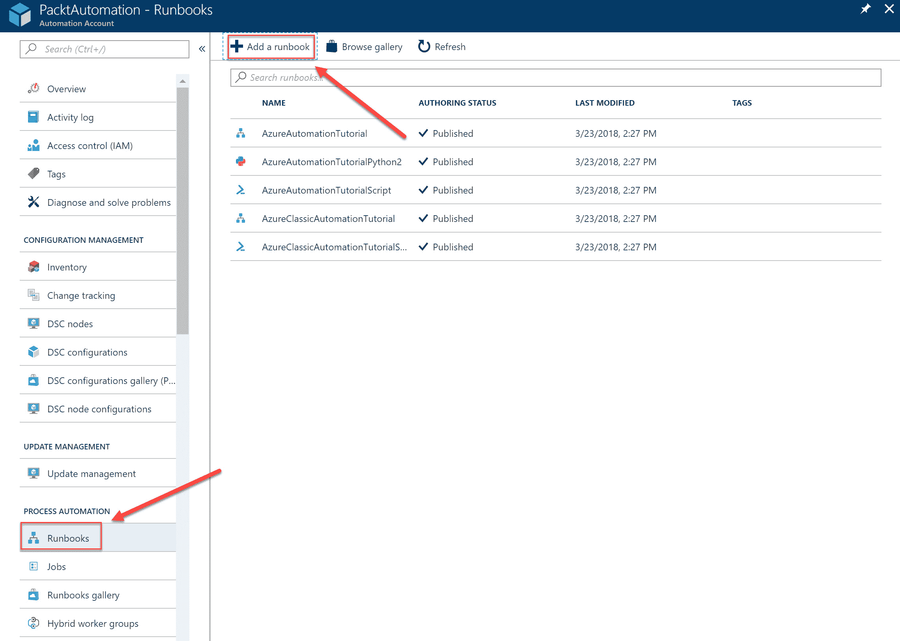
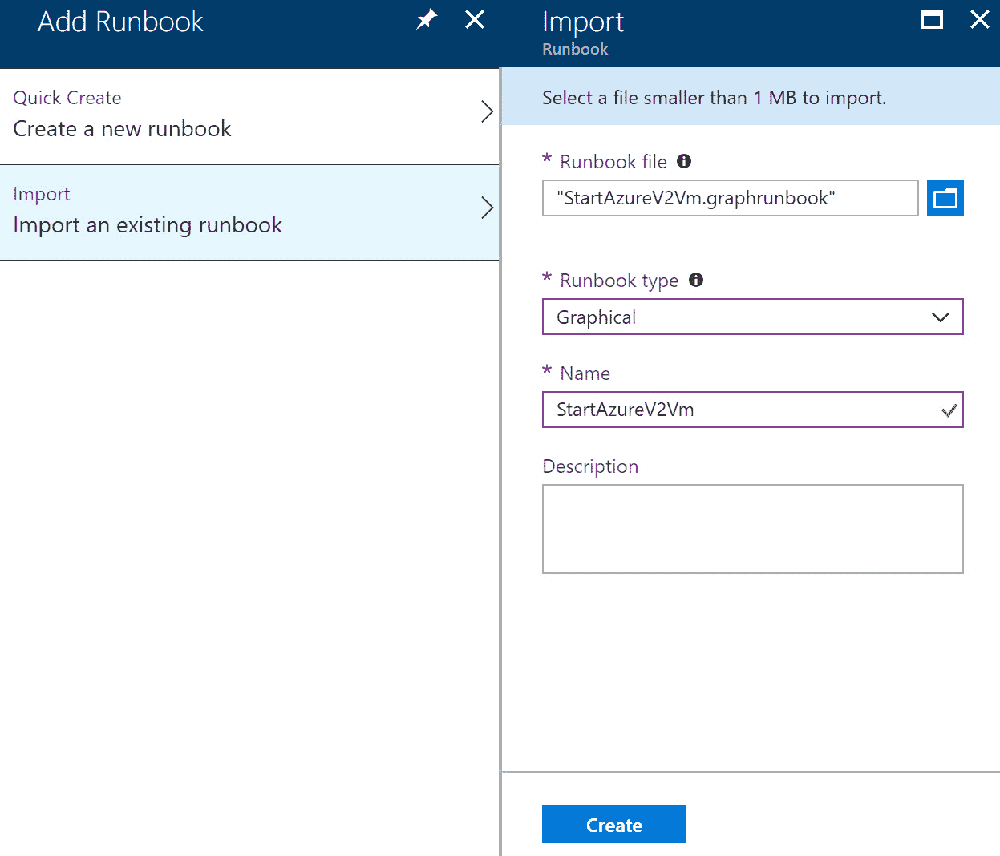
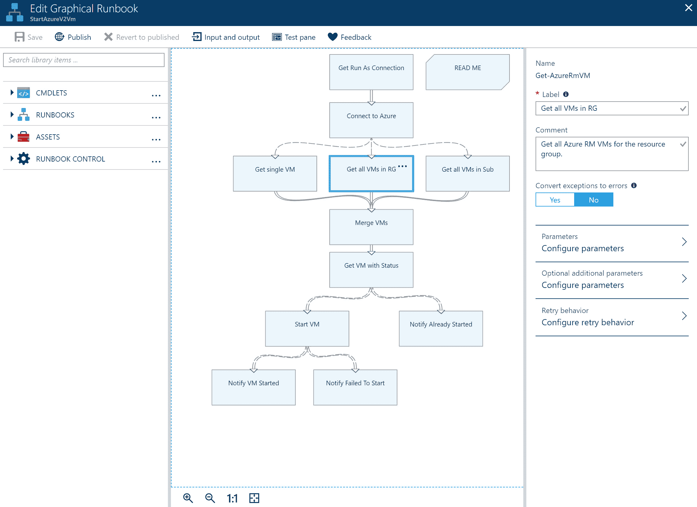
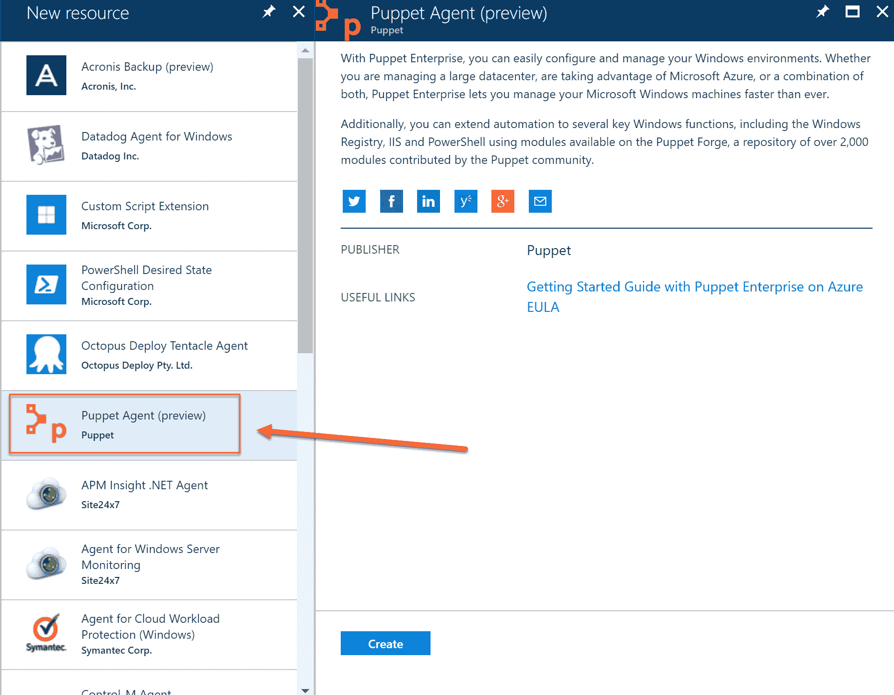
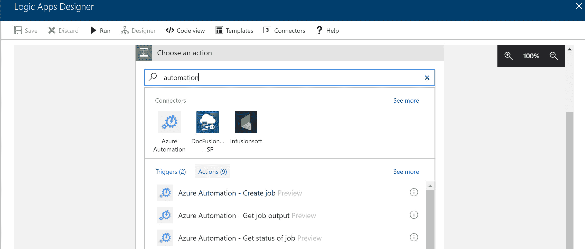

# 探索运营自动化策略

在上一章中，我们通过介绍应用程序和平台监控及警报策略，讲解了“运营设计”目标。

本章介绍了如何使用 Azure 自动化、Chef、Puppet、PowerShell、期望状态配置 (DSC)、事件网格、Azure 逻辑应用程序设计运营自动化策略，并如何定义自动扩展策略。

将涵盖以下主题：

+   设计运营自动化策略

+   设计自动扩展策略

# 设计运营自动化策略

在 Azure 中实现自动化步骤是确保部署一致性和节省时间的一个好方法。它减少了在开发、测试、验收和生产 (DTAP) 架构中需要在不同环境之间部署应用程序时出现的错误。对于需要重复部署的资源（例如，为开发团队配置多个开发虚拟机），它也节省了大量时间。

Azure 提供了不同的解决方案和方法来设计成功的自动化策略，以下章节将详细描述这些方法。

# Azure PowerShell

Azure PowerShell 可用于创建 Azure 资源、管理和配置资源，以及实现自动化。

本书中使用 Azure PowerShell 的多个示例来自动化不同的任务，例如创建虚拟机和创建网络接口。它可以在本地计算机上使用，也可以在 Azure Cloud Shell 中使用。你可以使用 PowerShell 完成 Azure 门户中几乎所有的任务，甚至对于一些 Azure 资源，PowerShell 提供了更多的功能，而这些功能在 Azure 门户中无法配置。

# 期望状态配置

DSC 是强制在系统上应用配置的过程。它使用由 PowerShell 脚本组成的配置文件。这些脚本负责对系统进行所需的配置，并确保系统保持同步。例如，当你创建一个 DSC 文件来配置 Windows Server 上的 IIS，并且管理员将其删除时，DSC 文件会重新安装并再次配置 IIS。

DSC 使用三项关键功能来配置机器：

+   **配置**：一组配置资源的 PowerShell 脚本。这些脚本还确保系统保持在期望状态。它使用 **节点** 来定义正在配置的资源。

+   **资源**：这些是需要在机器上配置的不同构建块。例如，这可以是 WindowsFeature 资源或 Environment 资源。

+   **本地配置管理器 (LCM)**：这是将脚本部署到机器上的引擎。LCM 会定期轮询不同的机器，以确保机器的期望状态得以保持。如果系统不同步，LCM 会运行脚本，重新安装并根据脚本中的资源配置系统。

请查看以下 DSC 文件示例：

```
Configuration PacktDscConfiguration {
    param(
        [string[]]$ComputerName="PacktMachine"
    )
    Node $ComputerName {
        WindowsFeature PacktFeatureInstance {
            Ensure = "Present"
            Name = "RSAT"
        }
        WindowsFeature PacktFeatureInstance2 {
            Ensure = "Present"
            Name = "Bitlocker"
        }
    }
}
PacktDscConfiguration -ComputerName $ComputerName
```

# Azure 自动化

Azure 自动化是 Azure 中的一项服务，提供对本地和 Azure 环境中部署与管理操作的完全控制。它支持 Windows 和 Linux 机器，并提供一个社区画廊，内含预定义的配置和自动化运行书，可以作为起点使用。

要管理这些类型的工作负载，Azure 自动化提供了以下功能和能力：

+   **流程自动化**：你可以使用流程自动化来自动化 Azure 和本地环境中的管理任务以及可重复的配置任务。自动化过程中可以集成各种 Azure 服务和资源。它使用 **自动化运行书**，自动化不同的步骤。Azure 提供了一个图形编辑器，可以通过 Azure 门户创建运行书，或者你可以通过 PowerShell 创建它们。你可以创建不同类型的运行书，如图形化运行书、图形化 PowerShell 工作流、PowerShell、PowerShell 工作流和 Python 运行书。这些工作流可以从自动化帐户导出，并导入到其他自动化帐户。然而，Azure 中的自动化运行书默认无法访问本地基础设施和其他云环境。你需要安装 Azure 自动化的混合运行书工作器功能，以便在这些环境中运行运行书。

+   **配置管理**：对于配置管理，Azure 自动化提供了一个用于 PowerShell DSC 脚本的 DSC 服务器。该服务器可以用来编写、管理和编译 PowerShell DSC。它提供了一个所需状态配置拉取服务，能够自动将配置发送到节点。你还可以获取已安装应用程序和其他配置项的相关信息。

+   **更新管理**：这项功能提供有关更新合规性的详细信息和可视化展示，适用于你的 Azure、本地和其他云环境。它提供了协调和安排更新部署的能力。

+   **共享功能**：Azure 自动化提供了各种共享资源，可以用来自动化和配置你的环境，例如基于角色的访问控制。你可以存储凭据和证书以保证安全，创建连接字符串、计划任务、源代码控制集成以及 PowerShell 模块。

有关 Windows PowerShell 所需状态配置的更多信息，请参考 [`docs.microsoft.com/en-us/powershell/dsc/overview`](https://docs.microsoft.com/en-us/powershell/dsc/overview)。有关所需状态配置拉取服务的更多信息，请参考 [`docs.microsoft.com/en-us/powershell/dsc/pullserver`](https://docs.microsoft.com/en-us/powershell/dsc/pullserver)。

# 创建 Azure 自动化运行书

在这个示例中，我们将创建一个包含 DSC 配置的 Azure Runbook。在创建 Azure 自动化 Runbook 之前，首先需要创建一个自动化账户。

要创建 Azure 自动化账户，请按照以下步骤操作：

1.  通过打开[`portal.azure.com/`](https://portal.azure.com/)导航到 Azure 门户。

1.  在搜索栏中输入`Automation`并创建一个新账户。添加以下属性并点击创建：



创建 Azure 自动化账户

1.  创建后，导航到自动化账户。从那里你可以打开图形编辑器创建一个自动化 Runbook。此示例使用了一个预配置的图形 Runbook，可以导入。此 Runbook 可以从本书的源代码下载，源代码位于 GitHub 页面上。

1.  要导入 Runbook 文件，请从左侧菜单中选择 Runbooks 并添加一个 Runbook：



新建 Runbook

1.  选择“导入”，选择 Runbook 文件，以下属性会自动添加：



导入 runbook

1.  点击“创建”。你现在可以选择新添加的 Runbook 并对其进行修改。选择它并点击顶部菜单中的“编辑”。这将打开图形编辑器，你可以在其中查看工作流中的不同步骤并进行更改。你可以选择不同的步骤并配置参数、配置重试行为等。



图形化 Runbook 编辑器

1.  当你根据自己的环境完成设置更改后，可以发布并安排 Runbook 的执行。

# Chef

Chef 是一个第三方解决方案，提供一个用于 Linux、Windows 和 Mac 设备的 DevOps 自动化平台。它可以用于虚拟和物理服务器配置。它需要在虚拟机或服务器上安装代理，该代理连接到 Chef 服务器，检查是否有可用的更新和其他配置。你还可以使用 Chef Automate 平台来打包和部署应用程序。

要将 Azure 虚拟机与 Chef 服务器连接，需要从 Azure 下载发布设置文件，并将其导入 Chef 服务器，并且需要在连接的设备上安装代理以与 Chef 通信。然后，你可以在服务器上创建 Chef Cookbook，其中包含用于管理设备和自动化部署的脚本和指令。

# Puppet

Puppet 也是一个第三方解决方案，具有与 Chef 类似的功能。你可以在 Azure 门户中创建虚拟机时自动启用对 Puppet 的支持。创建新虚拟机时，可以将其作为扩展添加。它将安装 Puppet 代理，连接到 Puppet 主服务器。

你需要提供 Puppet 主服务器的名称，虚拟机将在创建时集成该服务器：



安装 Puppet 代理

# Azure 事件网格

Azure 事件网格也支持自动化任务。Azure 事件网格提供一个 Azure 自动化订阅者，能够响应发送到 Azure 事件网格的不同事件。因此，当创建 Azure 资源时，可以调用自动化运行书自动执行一系列步骤。例如，在 Azure 中创建虚拟机时，可以通过事件网格调用自动化运行书，以在特定时间创建启动和停止虚拟机的计划。

要获取有关将 Azure 自动化与 Azure 事件网格及 Microsoft Teams 集成的完整步骤，请参考 [`docs.microsoft.com/en-us/azure/event-grid/ensure-tags-exists-on-new-virtual-machines`](https://docs.microsoft.com/en-us/azure/event-grid/ensure-tags-exists-on-new-virtual-machines)。

# Azure 逻辑应用

Azure 逻辑应用还支持调用自动化运行书。它提供**操作**，可以从您的逻辑应用中调用，以创建自动化任务、收集输出或获取运行书的状态。这可以用于从各种工作流中创建自动化，并可以与各种 Azure 资源集成。



Azure 逻辑应用自动化操作

# Visual Studio 团队服务

Visual Studio 团队服务提供针对自定义应用程序的持续集成和交付（CI/CD）解决方案。它由一组 DevOps 服务组成，可以从 Azure 使用，也可以通过安装 Team Foundation Server (TFS) 安装在本地服务器上。

VSTS 提供以下功能和能力：

+   **版本控制**：持续集成、交付和测试的起点是版本控制服务器。VSTS 提供两种不同的版本控制形式，Git 和团队基金版本控制。它支持多种版本控制仓库，如 Subversion、Bitbucket 和 GitHub。

+   **持续集成**：当在 VSTS 中配置 CI 时，任何提交的代码更改都会自动构建和验证。要配置 CI，您需要创建一个新的构建定义，其中包含构建和测试源代码的任务。它支持构建 .NET、Java、Node、Android、Xcode 和 C++ 应用程序。您可以使用持续测试功能在 VSTS 中自动验证已提交的代码。它支持多种测试框架，如单元测试和 Selenium。您还可以在自动化中运行 PowerShell、CLI 和命令行脚本。

+   **持续部署**：下一步是创建一个发布定义。你可以用它自动将应用程序部署到一个或多个环境中。发布定义还包括一组任务。VSTS 和 TFS 都支持将应用程序部署到 PaaS 服务上，例如 Web 应用和 Azure 函数。你还可以将代码部署到虚拟机、容器、本地环境和其他云平台，并将移动应用发布到商店。

# 设计自动扩展策略

自动扩展为 Azure 资源和应用程序提供了一种解决方案，以满足性能要求并遵守 SLA。它可以增加额外的资源，如增加虚拟机和虚拟机的 CPU，以及其他 Azure 资源，当这些资源不再需要时，可以移除以最小化成本。这个过程由 Azure 处理。

自动扩展是云技术的关键优势之一，因为你可以轻松甚至自动地添加和移除额外的资源，而无需管理这些资源。自动扩展可以通过以下两种不同方式进行：

+   **垂直扩展**：这也叫做扩展上下。你可以将应用程序移动到不同的虚拟机（VM）大小。通过更改虚拟机的大小，应用程序会在短时间内不可用，因此这种类型的扩展通常不会自动执行。

+   **水平扩展**：这也叫做扩展进出。当你添加额外资源时，比如向 Azure 容器服务中添加或移除容器时，就会进行水平扩展。由于这种扩展不要求资源变得不可用，因此大多数时候是自动进行的。

为了设计一个有效的自动扩展策略，你可以使用以下方法和服务：

+   **监控和警报**：使用 Azure 中不同监控解决方案提供的监控和警报功能。这些解决方案在前一章中有更详细的介绍。除了监控解决方案，Azure 中的不同资源也提供自动扩展功能，例如虚拟机、Azure 服务结构、Azure 函数、Azure 应用服务和其他云服务。这些资源可以通过 Azure 门户中的设置页面进行配置。

+   **决策逻辑**：利用决策逻辑来帮助决定是否需要扩展资源。这可以通过 Azure Logic Apps 动态完成，通过调用自动化运行簿或在系统负载较高时使用预定义的计划。

+   **Azure 监控扩展**：这是 Azure Monitor 中集成的服务，提供虚拟机、VM 扩展集、Azure 应用服务和 Azure 云服务的自动扩展。你可以用它来安排实例，在满足某个 CPU 使用率或某个队列中的消息数量时进行扩展。

+   **应用架构**: 根据需求架构自定义应用程序，以便它们可以横向扩展。这适用于 Azure Service Fabric 应用、运行在容器中的应用或批量应用程序。为此，可以使用限制模式和竞争消费者模式。

# 总结

在本章的最后，我们讨论了如何利用 Azure 提供的不同解决方案和工具设计操作自动化策略，以及如何设计自动扩展策略。

通过本章所获得的知识，你应该能够通过 70-535 考试。别忘了查看*进一步阅读*部分，因为其中有很多额外的信息，可能也会在考试中出现。

希望你像我写这本书一样享受阅读它，祝你考试好运！

# 问题

请回答以下问题，以测试你对本章内容的理解。你可以在本书末尾的*评估*部分找到答案。

1.  你的公司使用 Windows、Linux 和 Mac 设备。Azure 自动化是你自动化策略的最佳解决方案吗？

    1.  是的

    1.  不是

1.  你正在为虚拟机设计一个标准化的部署解决方案。你还有一个要求，在部署后配置并保持虚拟机的同步。你是否应该使用 Azure PowerShell 所需状态配置 (DSC) 来实现这一点？

    1.  是的

    1.  不是

1.  你能使用 Azure Event Grid 来执行自动化任务吗？

    1.  是的

    1.  不是

# 进一步阅读

你可以查看以下链接，获取更多关于本章所涵盖主题的信息：

+   **Azure 自动化简介**: [`docs.microsoft.com/en-us/azure/automation/automation-intro`](https://docs.microsoft.com/en-us/azure/automation/automation-intro)

+   **Windows PowerShell 所需状态配置概述**: [`docs.microsoft.com/en-us/powershell/dsc/overview`](https://docs.microsoft.com/en-us/powershell/dsc/overview)

+   **Azure 自动化 DSC 概述**: [`docs.microsoft.com/en-us/azure/automation/automation-dsc-overview`](https://docs.microsoft.com/en-us/azure/automation/automation-dsc-overview)

+   **Azure 上的 Chef**: [`docs.microsoft.com/en-us/azure/chef/`](https://docs.microsoft.com/en-us/azure/chef/)

+   **Azure Event Grid 文档**: [`docs.microsoft.com/en-us/azure/event-grid/`](https://docs.microsoft.com/en-us/azure/event-grid/)

+   **Azure 逻辑应用文档**: [`docs.microsoft.com/en-us/azure/logic-apps/`](https://docs.microsoft.com/en-us/azure/logic-apps/)

+   **Visual Studio 团队服务：构建和发布**: [`docs.microsoft.com/en-us/vsts/build-release/?view=vsts`](https://docs.microsoft.com/en-us/vsts/build-release/?view=vsts)

+   **自动扩展指南**: [`docs.microsoft.com/en-us/azure/architecture/best-practices/auto-scaling`](https://docs.microsoft.com/en-us/azure/architecture/best-practices/auto-scaling)
