# 第一章：安装 Docker

在本章中，我们将了解如何在各种操作系统上下载和安装 Docker。我们将使用一些基本的 Docker 命令，以便我们可以验证安装是否成功，并第一次与 Docker 交互。

本章涵盖的主题有：

+   什么是 Docker？

+   Ubuntu Trusty 14.04 LTS 上的 Docker

+   Mac OS X 上的 Docker

+   Windows 上的 Docker

+   亚马逊 EC2 上的 Docker

本书将带你完成从安装 Docker 到运行自己的**平台即服务**（**PaaS**）的所有步骤，这样你就可以推送代码而无需考虑基础设施或服务器配置。

本书的主题将是使用隔离的 Web 服务器和数据库创建一个模块化的 Web 应用程序。

# 什么是 Docker？

在 Docker 的官方网站 [`www.docker.com`](http://www.docker.com) 上，提供了以下对 Docker 的定义：

> *"Docker 是一个开放平台，供开发者和系统管理员构建、运输和运行分布式应用程序。"*

更实际的意义是，Docker 是一种将服务封装在隔离环境中（称为**容器**）的方法，这样它们就可以与所需的所有库和依赖项一起打包，并且开发者可以确保该服务将在 Docker 运行的任何地方运行。

# Ubuntu Trusty 14.04 LTS 上的 Docker

最容易安装 Docker 的操作系统、版本和发行版是 Ubuntu Trusty 14.04 LTS。这个任务非常快速，因为我们可以使用内置的包管理器`apt-get`。

### 注意

请注意，在这里 Docker 被称为`docker.io`，而在其他平台上仅称为`docker`，因为 Ubuntu（和 Debian）已经有一个名为`docker`的包。

首先打开终端并逐一执行这些命令：

```
sudo apt-get update
sudo apt-get install docker.io
source /etc/bash_completion.d/docker.io

```

在这里，我们首先更新包管理器`apt-get`的包列表，以便获取所有可用的包、版本和依赖项的信息。接下来的命令实际上会安装 Docker，之后，我们启用 Ubuntu 来自动完成 Docker 命令的补全。

当你完成这些操作并没有遇到错误时，运行`sudo docker.io version`，以验证它是否按预期工作。

### 注意

请注意，这将安装最新发布的 Ubuntu 包版本，但这不一定是最新发布的 Docker 版本。

为了从 Docker 维护的替代仓库获得最新版本，我们可以执行以下命令：

```
curl -sSL https://get.docker.com/ubuntu/ | sudo sh

```

这将添加一个由 Docker 团队维护的替代仓库，并为你安装比 Ubuntu 仓库中提供的版本更为更新的 Docker。请注意，当以这种方式安装时，Docker 包名为`lxc-docker`。运行 Docker 命令使用的命令仍然是`docker`。

## 在 Ubuntu Trusty 14.04 LTS 上升级 Docker

要检查并下载升级，你只需要在终端中执行以下命令：

```
sudo apt-get update && sudo apt-get upgrade

```

## 用户权限

为了方便起见，建议将我们的用户添加到系统的 Docker 用户组中，这样我们就可以无需使用 `sudo` 来控制 Docker。这样会给我们的用户执行 Docker 命令的权限。

在运行代码之前，请将 `USER` 替换为你的用户名：

```
sudo gpasswd -a USER docker

```

你可能需要注销并重新登录才能使其生效。重新登录后，运行 `docker ps` 来验证是否没有权限问题。

### 注意

更详细的信息可以在官方安装指南中找到，网址为 [`docs.docker.com/installation/ubuntulinux/`](https://docs.docker.com/installation/ubuntulinux/)。

# Mac OS X 上的 Docker

为了能够在 Mac OS X 上使用 Docker，我们必须在虚拟机（VM）中运行 Docker 服务，因为 Docker 使用特定于 Linux 的功能来运行。我们不必对此感到害怕，因为安装过程非常简单且直接。

## 安装

有一个 OS X 安装程序可以安装我们需要的所有工具，即 VirtualBox、boot2docker 和 Docker。

VirtualBox 是一个虚拟化工具，我们可以在其中运行轻量级的 Linux 发行版，而 boot2docker 是一个完全在内存中运行的虚拟机，占用的空间仅约 27 MB。

### 注意

最新发布的 OS X 安装程序版本可以在 [`github.com/boot2docker/osx-installer/releases/latest`](https://github.com/boot2docker/osx-installer/releases/latest) 找到。

现在，让我们看看如何按照以下步骤完成安装：

1.  点击名为 **Boot2Docker-1.3.0.pkg** 的按钮下载安装程序，以获取 `.pkg` 文件，如下图所示：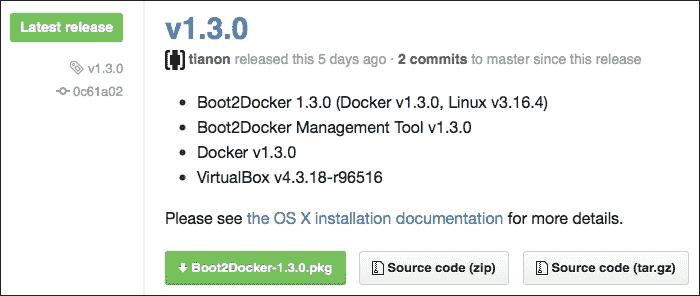

1.  双击下载的 `.pkg` 文件并完成安装过程。

1.  打开 **Finder** 窗口并导航到 `Applications` 文件夹；找到 **boot2docker** 并双击它。会打开一个终端窗口并执行一些命令，如下所示：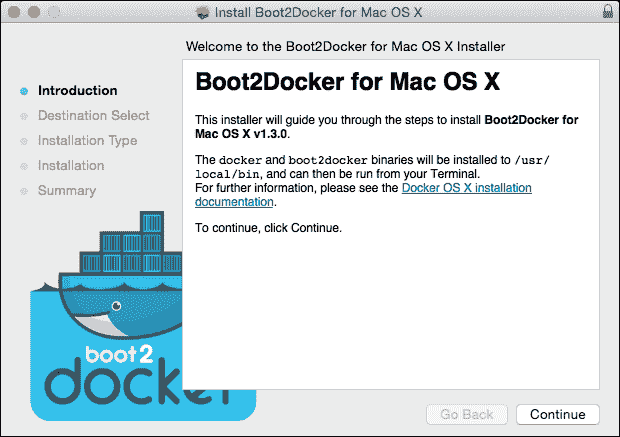

    这将运行一个名为 `boot2docker-vm` 的 Linux 虚拟机，该虚拟机在 VirtualBox 中预安装了 Docker。虚拟机中的 Docker 服务以守护进程（后台）模式运行，Docker 客户端安装在 OS X 中，并通过 Docker 远程 API 直接与虚拟机中的 Docker 守护进程通信。

1.  你将看到一个类似于以下截图的界面，提示你设置一些环境变量：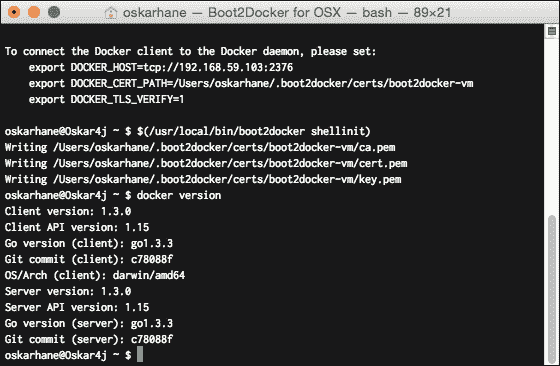

    我们打开 `~/.bash_profile` 文件，并将输出的三行代码粘贴到该文件的末尾，如下所示：

    ```
    export DOCKER_HOST=tcp://192.168.59.103:2376
    export.DOCKER_CERT_PATH=/Users/xxx/.boot2docker/certs/boot2docker-vm
    export DOCKER_TLS_VERIFY=1

    ```

    我们这样做的原因是让 Docker 客户端知道在哪里找到 Docker 守护进程。如果将来你想找到 IP，可以通过执行 `boot2docker ip` 命令来实现。添加前面这些行将在每次新的终端会话开始时设置这些变量。完成后，关闭终端窗口。然后，打开一个新窗口并输入 `echo $DOCKER_HOST` 来验证环境变量是否设置正确。你应该能看到你的 boot2docker 虚拟机的 IP 和端口。

1.  输入 `docker version` 来验证你是否可以使用 Docker 命令。如果输出的结果与前面截图的最后几行相似，那就意味着我们成功了。

## 在 Mac OS X 上升级 Docker

由于 Docker 相对较新，每次更新时可能会有很多变化，因此确保定期检查更新。时不时地，访问 Mac OS X 安装程序下载页面，检查是否有可用的升级。如果有，请执行以下命令来进行更新：

```
boot2docker stop
boot2docker download
boot2docker start

```

# Windows 上的 Docker

就像在 OS X 上安装 Docker 时，我们需要安装一个 Linux 虚拟机一样，在 Windows 上运行 Docker 也需要这样做，这是因为 Docker 构建依赖于 Linux 内核特性。OS X 拥有一个原生的 Docker 客户端，可以直接与虚拟机中的 Docker 守护进程通信，但 Windows 上目前还没有此类客户端。虽然有一个即将发布的 Windows 版 Docker 客户端，但在本书出版时它仍未发布。

## 安装

有一个 Windows 安装程序，可以安装我们运行 Docker 所需的一切。为此，请访问 [`github.com/boot2docker/windows-installer/releases/latest`](https://github.com/boot2docker/windows-installer/releases/latest)。

现在，让我们通过以下步骤来看看如何完成安装：

1.  点击 **docker-install.exe** 按钮以下载 `.exe` 文件，如下图所示：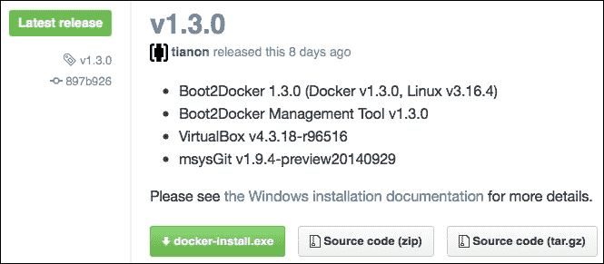

1.  下载完成后，运行下载的安装程序。按照安装过程操作，你将安装 VirtualBox、msysGit 和 boot2docker。

1.  前往你的 `Program Files` 文件夹，点击新安装的 boot2docker 开始使用 Docker。如果系统提示你输入密码短语，只需按 *Enter*。

1.  输入 `docker version` 来验证你是否可以使用 Docker 命令。

## 在 Windows 上升级 Docker

新软件经常发生变化，为了保持 `boot2docker` 更新，请执行以下命令：

```
boot2docker stop
boot2docker download
boot2docker start

```

# 在 Amazon EC2 上的 Docker

在本书中，我将使用一个 Amazon EC2 实例，鉴于它是托管 PaaS 的理想场所，我会推荐你也这么做。

**EC2** 代表 **E**lastic **C**ompute **C**loud，它是一种基础设施类型的服务。Amazon EC2 提供的虚拟服务器可以在订购后的一分钟内创建并可用。

### 注意

亚马逊提供名为`t[x].micro`的实例，您可以每月免费使用 750 小时。您可以在[`aws.amazon.com/free`](http://aws.amazon.com/free)上了解更多信息。

亚马逊有自己命名的 Linux 版本——Amazon Linux AMI，可用于运行 Docker。

## 安装

让我们看看如何按照以下步骤进行安装：

1.  在 [`aws.amazon.com`](http://aws.amazon.com) 上创建一个账户，然后访问亚马逊的**创建 EC2 实例向导** [`console.aws.amazon.com/ec2/v2/home?#LaunchInstanceWizard`](https://console.aws.amazon.com/ec2/v2/home?#LaunchInstanceWizard)。

    接下来的步骤如下所示：

    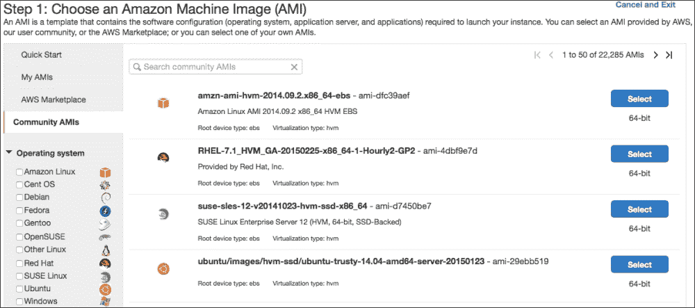

1.  在左侧菜单中点击**社区 AMI**，选择最新的 `amzn-ami-pv`。确保选择 `pv` 版本，而不是 `hvm` 版本，以便使用更稳定、开销更小的虚拟化，如下所示：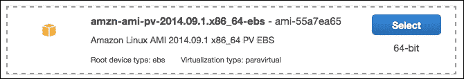

1.  选择实例类型时，如果有可用的 **t1.micro** 或 **t2.micro**，可以选择它们。微型实例的性能非常有限，但由于在一些区域它们属于免费使用层，并且目前不用于实际站点，因此我们可以使用它们。点击**下一步：配置实例详细信息**，然后点击**审查并启动**按钮，如下所示：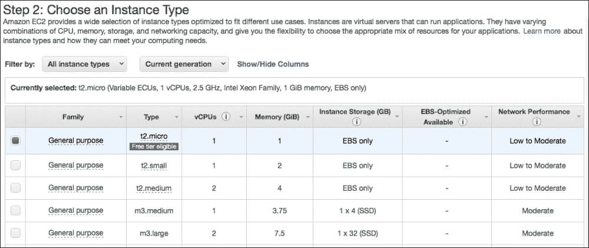

1.  在**摘要**页面核对所有细节，然后点击**启动实例**按钮。

1.  系统会提示你是否要使用现有的密钥对，还是创建一个新的密钥对。如果这是你第一次创建 Amazon EC2 实例，你应该创建一个新的密钥对。这使得连接到实例更加安全。

1.  下载新的密钥对，将其移动到 `~/.ssh/` 文件夹，并去掉 `.txt` 扩展名。

1.  设置文件的正确用户权限也很重要，否则 SSH 将拒绝使用该文件。

    在 Linux 或 Mac 上，执行该操作的终端命令如下所示：

    ```
    mv ~/Downloads/amz.pem.txt ~/.ssh/amz.pem
    chmod 600 ~/.ssh/amz.pem

    ```

    在 Windows 上，将密钥保存在任何位置，并使用如 PuTTYgen 这样的工具将其转换为 `.ppk` 文件，以便在使用 PuTTY 连接时使用。

1.  系统会提示你选择一个安全组给你的实例。由于这不是生产服务器，选择默认的安全组即可。当需要使用生产服务器时，我们可能需要为实例添加更多的安全措施。

1.  现在我们已经启动并运行了！让我们连接到它。点击**查看实例**按钮，并在列表中选择你新创建的实例，如下所示：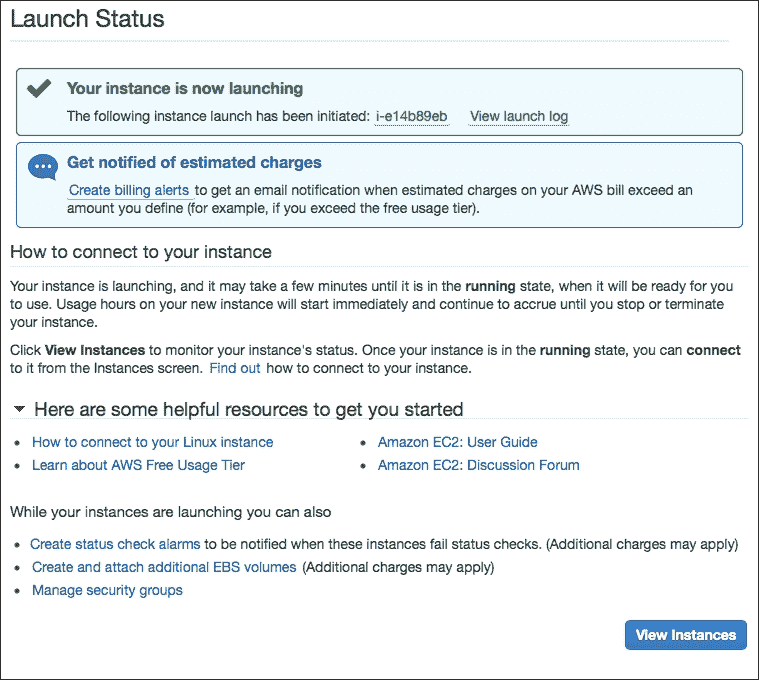

1.  在屏幕底部，你可以看到一些关于实例的信息。你应该查找公有 DNS 信息。它应该是这样子的：

    ```
    ec2-54-187-234-27.us-west-2.compute.amazonaws.com

    ```

1.  在 Linux 或 Mac 上，打开终端并连接到它：

    ```
    ssh ec2-user@ec2-54-187-234-27.us-west-2.compute.amazonaws.com -i ~/.ssh/amz.pem

    ```

    截图显示如下：

    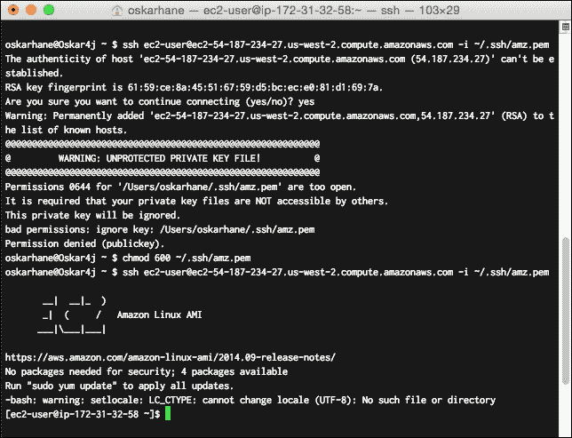

    我们使用`ec2-user`用户，这是 Amazon Linux 实例的默认用户，`amz.pem`是我们之前下载的密钥。用你上一步的公有 DNS 信息替换 URL。

    当被问及是否因为未知主机继续时，输入`yes`。

    在 Windows 上，使用 PuTTY，并确保你在 PuTTY 身份验证选项卡中指定了第 4 步中转换的私钥。

1.  一旦连接到实例，安装 Docker：

    ```
    sudo yum update
    sudo yum install -y docker
    sudo service docker start

    ```

1.  为了测试它是否按预期工作，输入`docker version`并确保没有错误。你应该看到几行信息，包括客户端版本、API 版本等。

## 打开端口

Amazon 的默认安全策略是阻止暴露服务的默认端口，因此我们需要修改此设置。

+   我们回到 EC2 仪表盘，点击菜单中的**安全组**选项

+   选择你的 EC2 实例所使用的安全组，并选择**入站**选项卡

+   Docker 使用的端口范围是**49000 - 50000**，所以我们需要为此添加一个规则，如下图所示：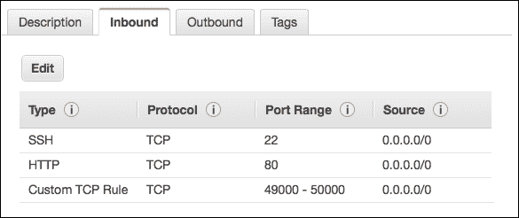

## 在 Amazon EC2 上升级 Docker

升级 Amazon Linux AMI 实例和升级 Ubuntu 一样简单。输入`sudo yum update`并确认是否有可用的更新。此命令将列出所有可用的更新，并在你确认后进行安装。

## 用户权限

Docker 要求命令由`docker`用户组的用户运行。为了方便，我们将用户添加到 Docker 组中，这样我们就可以在不使用`sudo`的情况下控制 Docker：

```
sudo gpasswd -a ec2-user docker

```

你可能需要注销并重新登录才能使其生效。重新登录后，运行`docker ps`来验证没有权限问题。你应该看到一行大写字母，类似于**CONTAINER ID IMAGE COMMAND CREATED STATUS PORTS NAMES**。

## 显示 Hello World

现在我们已经在选择的机器上运行了 Docker，接下来是让 Docker 为我们服务。以下是一些非常基础的命令，可以帮助我们与 Docker 守护进程进行基本交互。

在下一章中，将解释 Docker 中使用的所有概念和术语：

+   `docker ps`：此命令列出正在运行的容器

+   `docker ps -a`：此命令列出所有容器，包括正在运行的和已退出的容器

+   `docker images`：此命令列出本地（已下载和本地创建的）镜像

+   `docker run`：此命令从镜像启动一个新的实例容器

+   `docker stop`：此命令用于停止容器

让我们尝试下图中的第一个命令：

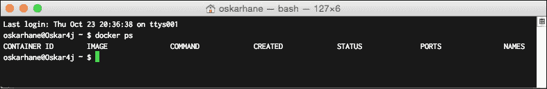

正如预期的那样，我们还没有运行任何内容。

启动容器就像`docker run [image] [command]`一样简单。如果镜像在本地不存在，Docker 会从 Docker Registry Hub 下载它，并在下载完成后启动你的容器。

以下步骤显示如下：

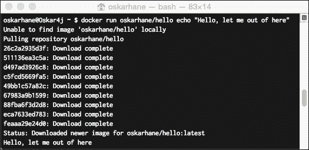

在终端中输入以下命令，启动一个容器，该容器打印字符串**Hello, let me out of here**，然后退出：

```
docker run oskarhane/hello echo "Hello, let me out of here"

```

这并不是非常有用，但我们刚刚在容器内的 Ubuntu 中运行了一个命令。

如果我们再次输入`docker ps`，我们可以看到没有正在运行的容器，因为我们刚刚启动的容器已被立即退出。尝试使用`docker ps -a`，并尝试`docker images`。

# 总结

在本章中，我们学习了 Docker 可以在大多数操作系统上使用，并且安装过程根据操作系统的不同差异很大。我们首次与 Docker 守护进程进行了交互，并启动了第一个 Docker 容器。即使容器所做的只是写入一个命令，但这就是在来宾操作系统中启动和运行某些东西是多么简单。

我们还介绍了本书的主题，即运行一个多容器的 Web 应用程序，包括 Web 服务器容器和 MySQL 容器：你自己的 PaaS。

在下一章中，我们将进一步探索 Docker、它的术语以及围绕它的社区。
