# 第三章：创建我们的第一个 PaaS 镜像

现在你已经准备好编写自己的 Dockerfile，将它们发布到 Docker Registry Hub，并为它们创建容器。在本章中，你将：

+   在另一个镜像基础上构建自己的镜像

+   将你的 Dockerfile 存放在 GitHub 账户中

+   在 Docker Registry Hub 上发布镜像

# WordPress 镜像

对于这个项目，我们将使用官方的 WordPress Docker 镜像作为基础，它的 web 服务器是 Apache2。

### 注意

如果你计划托管流量较大的站点，我建议使用基于 Nginx 的镜像，而不是 Apache2 作为 web 服务器。我曾成功地在 Nginx 上运行 WordPress 站点，并使用 memcached 插件 WP-FFPC。设置可能会有些棘手，因此这不在本书的范围内。

首先，让我们运行一个 MySQL 容器和一个 WordPress 容器，并将它们链接在一起，看看会发生什么：

```
docker run --name some-mysql -e MYSQL_ROOT_PASSWORD=mysecretpassword -d mysql
docker run --name some-wordpress --link some-mysql:mysql -d -p 80 wordpress

```

`–p 80` 选项告诉 Docker 将私有端口 `80` 映射到外部世界。要找出哪个公共端口与私有端口 `80` 绑定，可以运行 `docker ps` 命令，并查看端口列，或者执行 `docker port <container-ID|name>` `80` 命令。

截图如下所示：

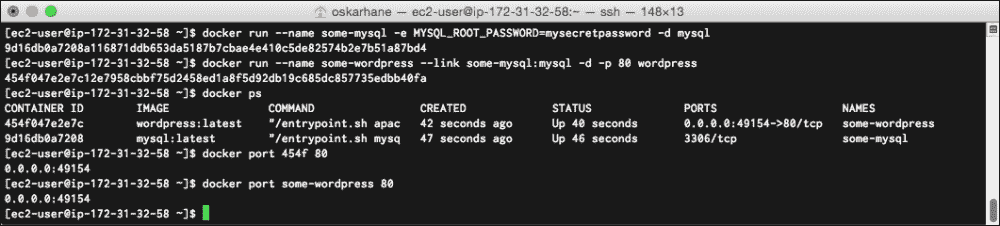

在我的例子中，公共端口是 **49154**。在你的 web 浏览器中输入完整的 URL，格式为 `http://public_ip:public_port`。我正在 Amazon EC2 实例上操作，得到的公共域名是 `http://ec2-54-187-234-27.us-west-2.compute.amazonaws.com:49154`。

截图如下所示：

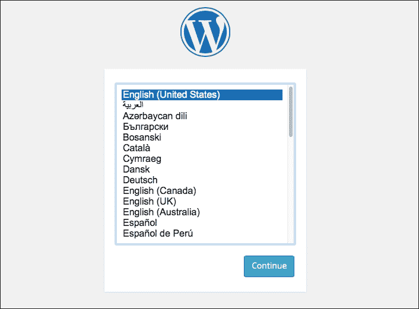

WordPress 安装页面欢迎我们，这意味着 WordPress 和 MySQL 容器都在正常工作。

# 移动默认设置

现在，我们有一个基于 Apache2 运行的 WordPress 默认安装。某些 WordPress 插件需要你修改 web 服务器的配置。我们该怎么做呢？如果我们想编辑 WordPress 目录中的一些文件呢？

我们首先需要做的是获取官方 WordPress 仓库的副本，这样我们就可以探索 Dockerfile。获取仓库的当前 URL 是 [`github.com/docker-library/wordpress`](https://github.com/docker-library/wordpress)。从 Docker Registry Hub 上的 WordPress 仓库页面点击这个链接。

你可以克隆、分叉或仅下载此 Docker 镜像的源代码。无论你如何获取它都没关系，因为我们后续不会再使用它。这个镜像用于测试和探索。我是通过我的 EC2 实例完成这个的。

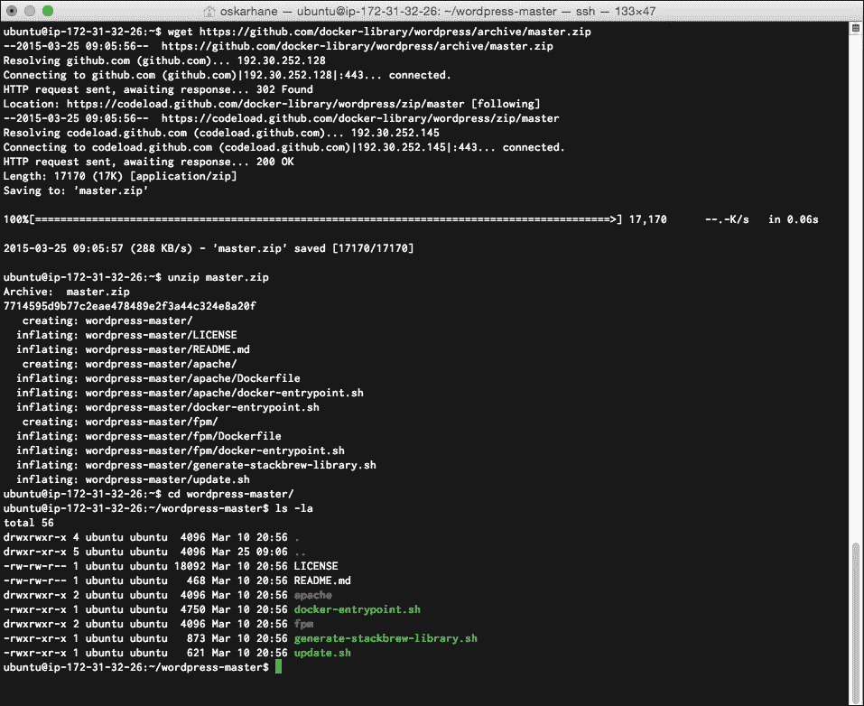

用任何文本编辑器打开文件查看其内容。如果你像我一样使用终端，可以用 `vi apache/Dockerfile` 在 `vi` 编辑器中打开它。当前官方 WordPress 镜像的 Dockerfile 如下所示：

```
FROM php:5.6-apache

RUN a2enmod rewrite

# install the PHP extensions we need
RUN apt-get update && apt-get install -y libpng12-dev libjpeg-dev && rm -rf /var/lib/apt/lists/* \
 && docker-php-ext-configure gd --with-png-dir=/usr --with-jpeg-dir=/usr \
 && docker-php-ext-install gd
RUN docker-php-ext-install mysqli

VOLUME /var/www/html

ENV WORDPRESS_VERSION 4.1.1
ENV WORDPRESS_UPSTREAM_VERSION 4.1.1
ENV WORDPRESS_SHA1 15d38fe6c73121a20e63ccd8070153b89b2de6a9

# upstream tarballs include ./wordpress/ so this gives us /usr/src/wordpress
RUN curl -o wordpress.tar.gz -SL https://wordpress.org/wordpress-${WORDPRESS_UPSTREAM_VERSION}.tar.gz \
 && echo "$WORDPRESS_SHA1 *wordpress.tar.gz" | sha1sum -c - \
 && tar -xzf wordpress.tar.gz -C /usr/src/ \
 && rm wordpress.tar.gz

COPY docker-entrypoint.sh /entrypoint.sh

# grr, ENTRYPOINT resets CMD now
ENTRYPOINT ["/entrypoint.sh"]
CMD ["apache2-foreground"]

```

该镜像使用 `php:5.6-apache` 镜像作为基础，并将 WordPress 4.1 下载并解压到 `/usr/src/wordpress`。然后，它添加了 `ENTRYPOINT` 并在前台启动 Apache2。

# 我们的目标

为了使这个 WordPress 镜像除了演示用途外可用，我们需要通过三种方式修改 Dockerfile。我们的目标如下：

+   为缓存准备 Apache（通过 WP Super Cache 插件）

+   在 PHP 和 Apache2 中提高上传限制

+   安装两个插件：WP Super Cache 和 WP Mail SMTP

## 为缓存准备

为了通过 WP Super Cache 获取网站缓存，有两个小步骤需要执行——我们需要在 Apache2 中启用 `mod_headers` 和 `mod_expires` 模块。

在 Dockerfile 的第 5 行，你可以看到 `RUN a2enmod rewrite`。`a2enmod` 命令在 Apache2 中启用模块，`a2dismod` 命令则禁用模块。启用我们想要的模块就像把它们附加到那行一样简单：

```
RUN a2enmod rewrite expires headers

```

我们进行这些修改，构建一个新镜像，然后看看会发生什么。构建这些镜像需要很长时间，因为 PHP 是从源代码构建的。我们关注的是显示我们所需模块已启用的行。它们会在构建过程中显示几秒钟。

你通过执行以下命令来启动 Dockerfile 的构建：

```
docker build –t mod-wp .

```

`–t mod-wp` 命令将我们新图像的名称设置为 `mod-wp`。

截图如下所示：


构建应该顺利完成整个过程而没有任何错误，然后缓存插件的准备工作就完成了。

## 提高上传限制

默认上传大小被 PHP 限制为 2 MB。这个限制太低，尤其是现在手机博客非常流行，而手机拍摄的照片或视频的大小通常比这个还要大。我希望能够直接在我的博客中上传视频，视频大小可以达到 32 MB。

为了提高这个限制，我们需要在 PHP 配置文件中更改两个参数的限制：`upload_max_filesize` 和 `post_max_size`。

查看 php:5.6-Apache 镜像，它是 WordPress 镜像的基础镜像，在 Dockerfile 中我们看到它运行的是 Debian，并且 PHP 配置文件应该位于 `/usr/local/etc/php/conf.d/` 目录中。这意味着，如果我们将一个文件添加到该目录，它应该会被读取和解析。

### 注意

PHP 5.6 的 Dockerfile 可以在 [`github.com/docker-library/php/blob/master/5.6/Dockerfile`](https://github.com/docker-library/php/blob/master/5.6/Dockerfile) 找到。

为了验证上传限制是否如前所述的那样低，我启动并安装了一个未经修改的 WordPress 容器。然后我点击了 **添加新媒体** 按钮。

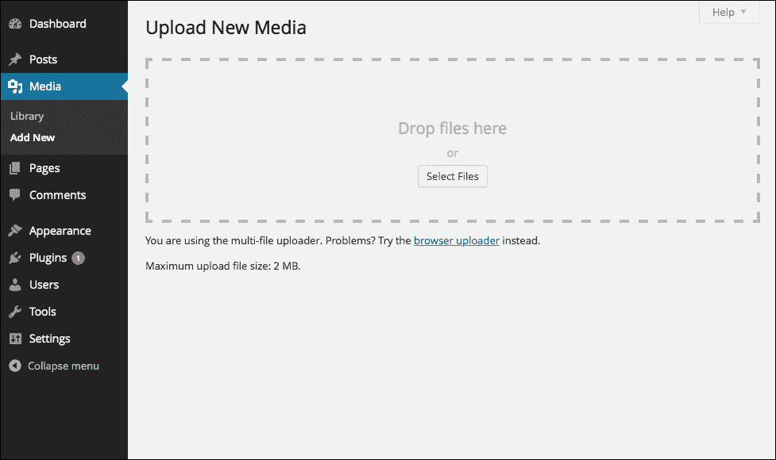

它显示上传限制为 2 MB。

我们来为配置目录添加一个名为 `upload-limit.ini` 的配置文件，并在文件中添加这两个参数。

这些命令应该放在一行内，添加到我们的 Dockerfile 中，位于我们在准备 Apache 缓存时修改的那一行之上：

```
RUN touch /usr/local/etc/php/conf.d/upload-limit.ini \
 && echo "upload_max_filesize = 32M" >> /usr/local/etc/php/conf.d/upload-limit.ini \
 && echo "post_max_size = 32M" >> /usr/local/etc/php/conf.d/upload-limit.ini
#Paste above this line.
RUN a2enmod rewrite expires headers

```

再次构建镜像，以确保不会产生错误。如果出现错误提示显示镜像名称已存在，你可以使用`docker rmi mod-wp`命令删除旧镜像，或者将名称改为`mod-wp:latest`，这将更新镜像的标签为`latest`。

构建完成后，我们从新镜像运行一个新容器，查看 WordPress 管理界面显示的内容。我们可以像这样运行一个新镜像的容器：

```
docker run --name some-mysql -e MYSQL_ROOT_PASSWORD=mysecretpassword -d mysql
docker run --name some-wordpress --link some-mysql:mysql -d -p 80 mod-wp:latest

```

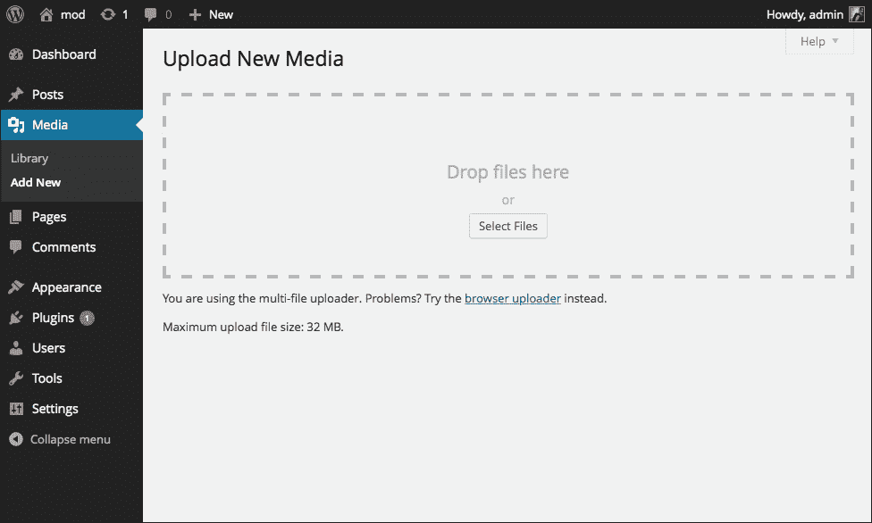

现在我们可以看到可以上传更大的文件。为了验证，如果你上传一个大于 2MB 的文件，这将证明上传限制已被提高。

## 插件安装

在这里，我们将下载并安装两个插件，这些插件是我们未来所有 WordPress 网站都需要的。所有与这些插件相关的任务都将在入口文件中完成，因为我们需要编辑 WordPress 安装中的一些文件。

第一个插件是 WP Super Cache。我们之前为此配置了 Apache2，现在可以使用它了。通过这个插件，我们的网站运行会更快，并且对主机的资源要求较少。

第二个插件是 WP Mail SMTP，它帮助 WordPress 发送外发邮件。这个容器不包含（也不应该包含）邮件服务器。通过这个插件，我们可以让 WordPress 通过外部 SMTP（如 Gmail、ISP 或其他任何服务）发送邮件。

### 注意

尽管我已经托管并管理了几年的邮件服务器，但它需要不断更新，还需要管理垃圾邮件过滤器和冗余。我们还是把这项工作交给专业人士更好。

所有插件将通过 CURL 下载，并用 unzip 解压。CURL 已经安装，但 unzip 尚未安装，因此我们需要将它添加到 Dockerfile 中，放在`apt-get install`命令运行的地方。

```
RUN apt-get update && apt-get install -y unzip rsync && rm -r /var/lib/apt/lists/*
```

如果我们不这么做，构建过程中将会出现错误信息。

由于有两个插件需要下载、解压和激活，我们将在`docker-entrypoint.sh`文件中创建一个函数。

这个函数将去 WordPress 的插件站点查找最新版本插件的下载 URL。它会下载并解压到我们 WordPress 安装的插件文件夹中：

```
dl_and_move_plugin() {
  name="$1"
  curl -O $(curl -i -s "https://wordpress.org/plugins/$name/" | egrep -o "https://downloads.wordpress.org/plugin/[^']+")
  unzip -o "$name".*.zip -d $(pwd)/wp-content/plugins
}
```

现在我们已经把函数放在了那里，可以在文件的末尾附近，`chown –R www-data:www-data ..`那行上方添加以下几行：

```
dl_and_move_plugin "wp-super-cache"
dl_and_move_plugin "wp-mail-smtp"

```

将函数和函数调用放置在接近文件底部的位置——在`docker-entrypoint.sh`文件中，紧接着`exec`命令上方。

我们将再次构建镜像并启动容器，以验证一切是否如我们所愿：

```
docker build –t mod-wp:latest

```

这需要一些时间，准备好后，你可以启动一个 MySQL 容器和一个`mod-wp`容器：

```
docker run --name some-mysql -e MYSQL_ROOT_PASSWORD=mysecretpassword -d mysql
docker run --name some-wordpress --link some-mysql:mysql -d -p 80 mod-wp:latest

```

如果你收到一个错误提示，说你已经有一个同名的容器，可以通过`docker rm some-wordpress`删除旧的容器，或者为新容器使用另一个名称。

通过运行`docker ps`获取端口，并查找绑定到端口`80`的 WordPress 容器端口。然后将 URL 加载到浏览器中。这时，安装 WordPress，登录并进入插件页面，如下截图所示：

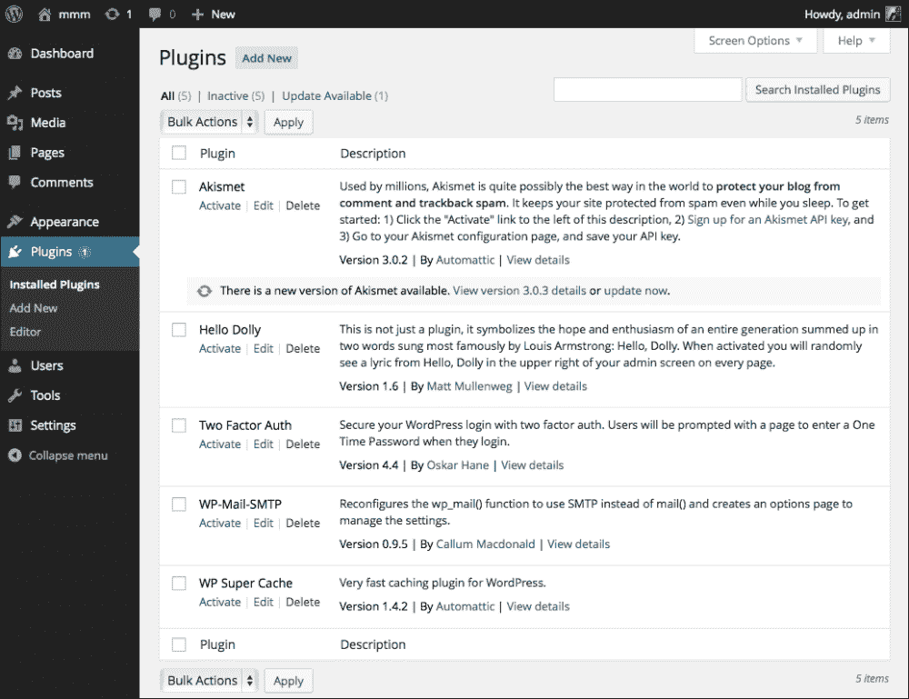

这看起来正是我们想要的！太棒了！

让我们继续激活并设置这些插件，以验证它们是否正常工作。首先从 WP Mail SMTP 插件开始。我将使用我的 Gmail 帐户作为发件人，但你可以选择任何你想用的 SMTP。以下是 Gmail 设置的截图：

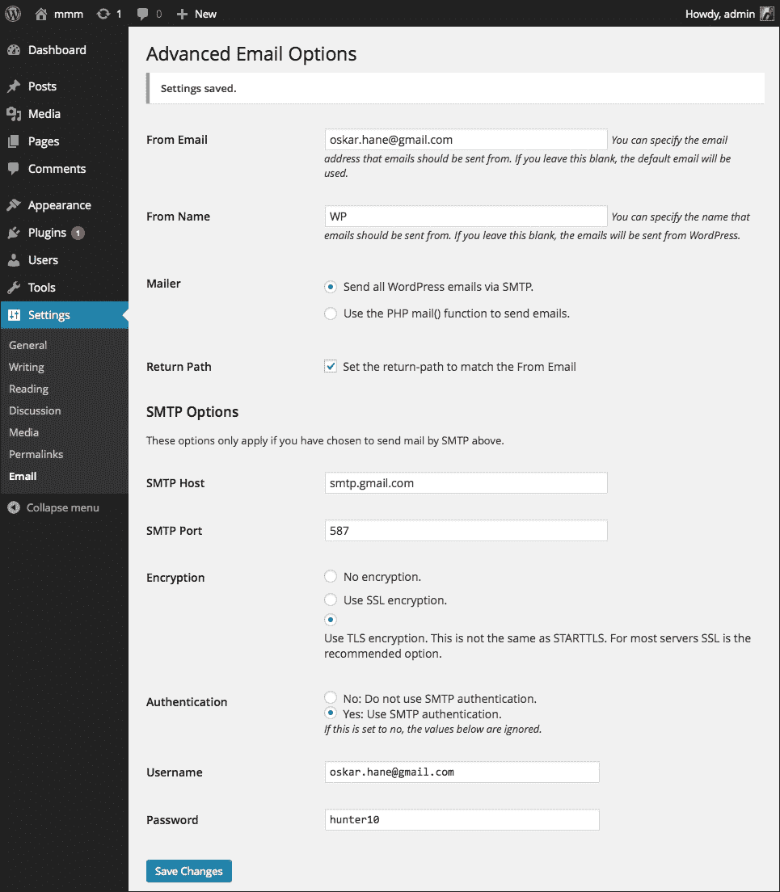

在此页面的底部，你可以发送测试电子邮件。我强烈推荐这样做，因为 Gmail 有时会阻止新的 SMTP 客户端。如果你收到一条错误信息，说**请通过你的网页浏览器登录，然后再试一次**，说明你触发了该问题。在这种情况下，你很快会收到来自 Google 的电子邮件，解释可疑活动并要求你执行一些步骤以使其正常工作。这很烦人，但从长远来看这是好事。

接下来，让我们继续设置 WP Super Cache 插件。请从插件页面激活该插件。在启用它之前，我们需要先进入**设置** | **固定链接**，勾选**文章名**按钮，然后保存。

然后进入**设置** | **WP Super Cache**。

点击**启用缓存**，然后点击**更新状态**。接下来，点击**高级**标签，启用**mod_rewrite 缓存**，如图所示：

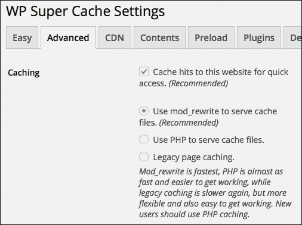

向下滚动到**其他设置**部分，勾选以下截图中显示的框。如果你想确切了解这些复选框的作用，可以参考插件文档。

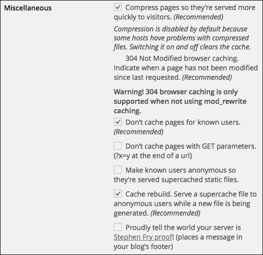

保存后，你会看到顶部出现一条通知，提醒你需要更新重写规则，如下所示：

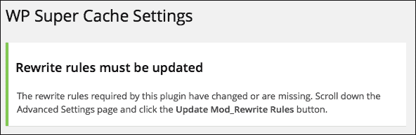

向下滚动页面，点击**更新 Mod_Rewrite 规则**按钮以更新重写规则，如下所示：

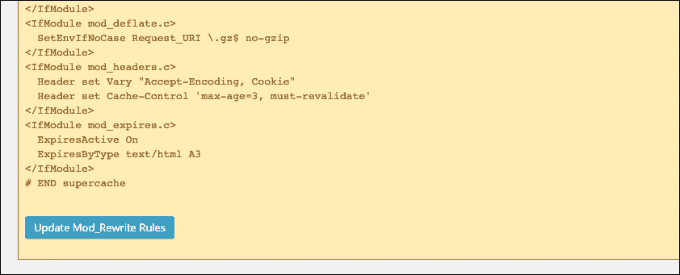

现在，缓存插件的状态应该显示为绿色，所有设置也应该完成。由于我们已登录到这个浏览器，我们不会看到缓存的页面。了解这一点很重要，优势是你无需禁用整个缓存插件就能看到未缓存版本的站点。请打开另一个浏览器（不要仅仅在当前浏览器中打开另一个窗口或标签页，除非你使用的是隐身模式或私密模式），然后访问你的 WordPress 实例。点击文章中的**Hello World**标题，然后返回到首页，再次点击标题。感觉很快，对吧？

为了验证它是否有效，您可以打开浏览器中的开发者工具。确保在开发工具打开时，您的浏览器没有禁用缓存。点击 **Network** 标签，然后再次点击帖子标题，接着检查该调用，如下图所示：

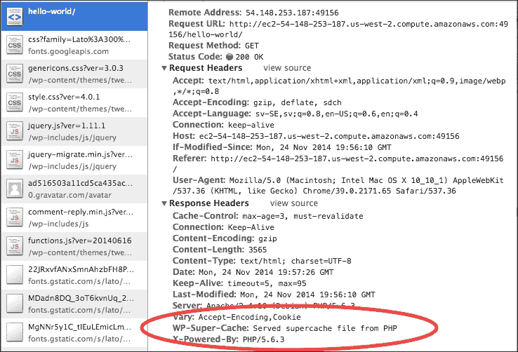

这正是我们想要看到的。太好了！

# 使我们的更改持久化

现在我们已经做了更改，我们想要创建我们自己的 Dockerfile，以便在官方 WordPress 镜像基础上构建。

这就是 Dockerfile 应该看起来的样子：

```
FROM wordpress:latest
RUN apt-get update && apt-get install -y unzip && rm -r /var/lib/apt/lists/*
RUN touch /usr/local/etc/php/conf.d/upload-limit.ini \
 && echo "upload_max_filesize = 32M" >> /usr/local/etc/php/conf.d/upload-limit.ini \
 && echo "post_max_size = 32M" >> /usr/local/etc/php/conf.d/upload-limit.ini
RUN a2enmod expires headers
VOLUME /var/www/html
COPY docker-entrypoint.sh /entrypoint.sh
ENTRYPOINT ["/entrypoint.sh"]
CMD ["apache2", "-DFOREGROUND"]

```

# 在 GitHub 上托管镜像源

Docker Registry Hub 对从 Bitbucket 和 GitHub 自动获取镜像更新提供了非常好的支持。您可以选择任何您喜欢的服务，但对于本书来说，我将使用 GitHub。我在这两个服务上都有账户，它们都非常优秀。

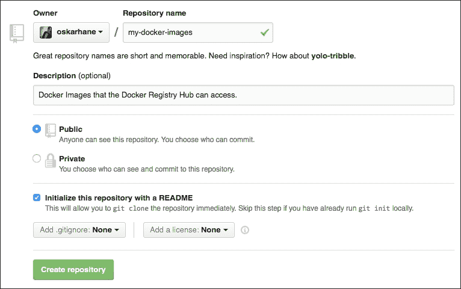

在 GitHub 上创建一个新的空仓库，命名为 `my-docker-images`，如果愿意，可以添加适当的许可证。

### 注意

本书不会介绍如何将您的 SSH 密钥添加到 GitHub 等内容。网上有很好的教程可以参考。GitHub 有一篇很棒的指南，地址是 [`help.github.com/articles/generating-ssh-keys/`](https://help.github.com/articles/generating-ssh-keys/)。

让我们创建一个分支，并将修改后的 Docker 镜像文件复制到该分支中。

将仓库克隆到本地，这样您就可以向其中添加文件。确保您不在 `wordpress-master` 目录内，而是在与其同一层级的目录下：

```
git clone git@github.com:yourusername/my-docker-images.git

```

该命令的输出如下：

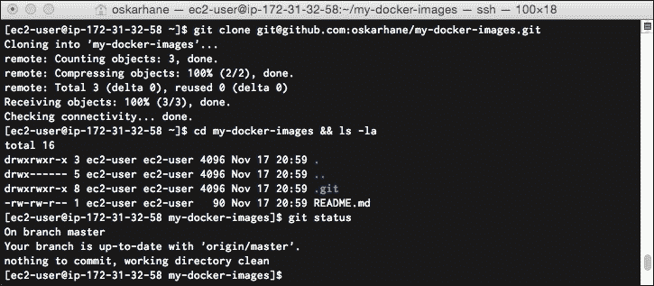

我们将一一执行这些命令：

```
cd my-docker-images
git checkout -b wordpress
git add .
git commit –m "Adding new files."
git push origin wordpress

```

访问您的 GitHub 页面，尝试找到 WordPress 分支。

对于我们想要创建并发布到 Docker Registry Hub 的每一个新的 Docker 镜像，我们都需要在这个 GitHub 仓库中创建一个新的分支。如果您有很多 Docker 镜像，并且这些镜像有很多版本，您可能需要考虑采用不同的结构，但对于本书来说，这种方法非常合适！

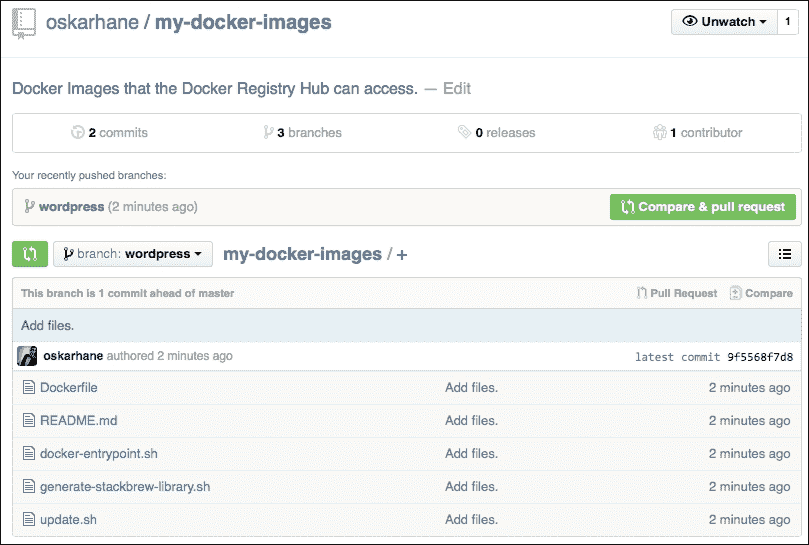

所有文件都已到位，您可以点击它们，验证内容是否符合预期。

# 在 Docker Registry Hub 上发布镜像

如果您还不是 Docker Registry Hub 的成员（[`hub.docker.com`](https://hub.docker.com)），现在是时候注册了，以便您可以将镜像发布到公共 Docker 仓库，并且可以从任何地方访问。

## 自动构建

当您添加一个仓库时，应该选择 **Automated Build** 选项，这样您就可以从 GitHub（或 Bitbucket）中获取代码，如下图所示：

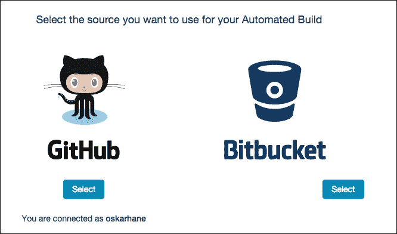

我们将连接到我们的 GitHub 账户，并选择我们刚刚创建并推送到 `my-docker-images` 的仓库。

我们将开始添加我们的 WordPress 镜像，因此在下一个屏幕上将仓库名称设置为 `wordpress`。确保正确输入这个名称，因为之后无法更改。

此时，我们将只使用一个标签——**latest** 标签。确保源：**类型** 设置为 **分支**，并且你已将其名称输入为 `wordpress`。

选择将其作为公共仓库添加，并勾选 **激活** 复选框。这意味着如果你在 GitHub 上推送任何更新，Registry Hub 将自动拉取并发布其更改，如下图所示：


Registry Hub 现在将拉取你的分支并尝试构建 Docker 镜像，以验证它是否正常工作。你可以前往 **构建详情** 标签查看进度。由于它是官方的 WordPress 镜像基础，如果他们在构建服务器上缓存了镜像，构建速度应该会很快。如果没有，可能需要几分钟时间，因为 PHP 是从源代码编译的。

以下是显示的截图：


哇！我们刚刚在 Docker Registry Hub 上发布了一个镜像，这意味着任何人都可以拉取并运行基于它的容器。状态会从 **构建中** 变为 **已完成**，当镜像发布时。

下一步就是我们自己拉取这个镜像，验证它是否按预期工作：

```
docker pull oskarhane/wordpress
docker images
docker run --name mysql -e MYSQL_ROOT_PASSWORD=mysecretpassword -d mysql
docker run --name my-wordpress --link mysql:mysql -d -p 80 oskarhane/wordpress
docker ps
```

打开你的网页浏览器，访问你的新容器。你应该会看到 WordPress 设置页面。

# 总结

在这一章中，你学到了很多内容。大部分内容都是关于修改 Dockerfile 和 `ENTRYPOINT` 文件，以便得到我们想要的 Docker 镜像。Bash 知识和编程技能非常便利，但由于所有这些操作主要是安装、移动文件和编辑设置文件，基本的知识已经足够。

GitHub 是一个托管 Docker 仓库的绝佳平台，而且设置一个新的仓库非常简单，便于开始使用。Docker Registry Hub 会将你的 GitHub 仓库与之连接，并让你选择一个分支。这个分支将作为公共 Docker 镜像的源，任何人都可以拉取并使用。

然而有一个问题出现了；我们的数据怎么办？它被困在这些 MySQL 和 WordPress 容器里。下一章将向你展示如何处理这些数据。
