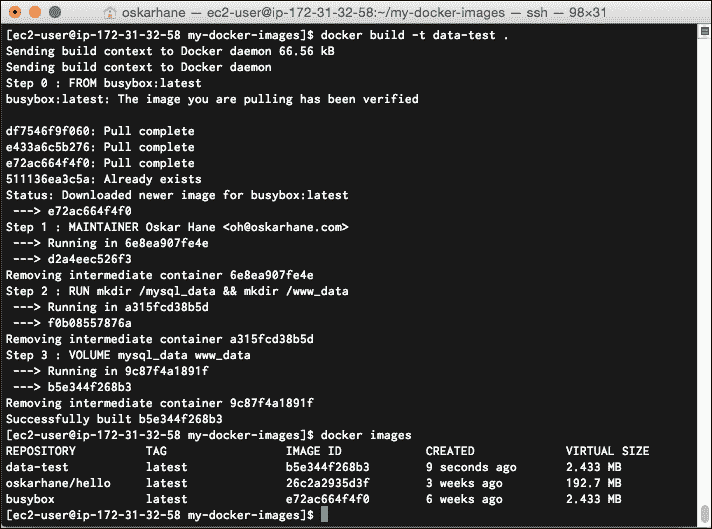
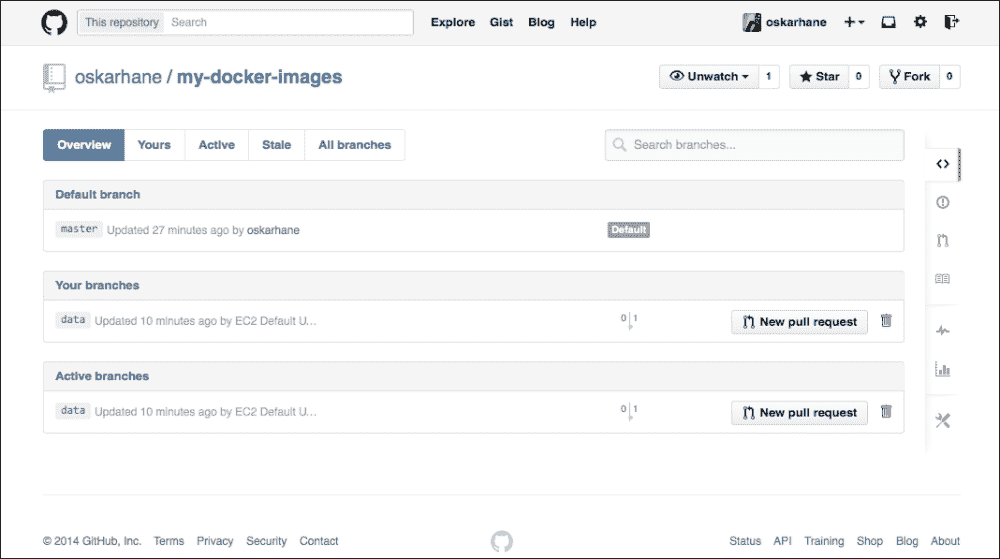
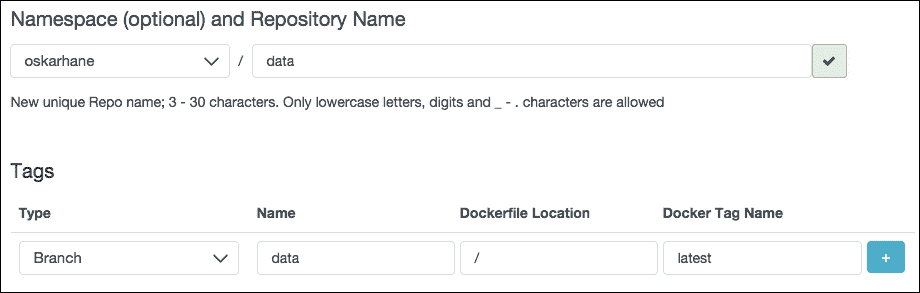
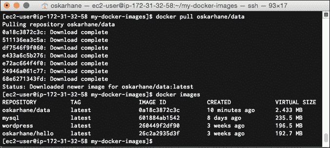
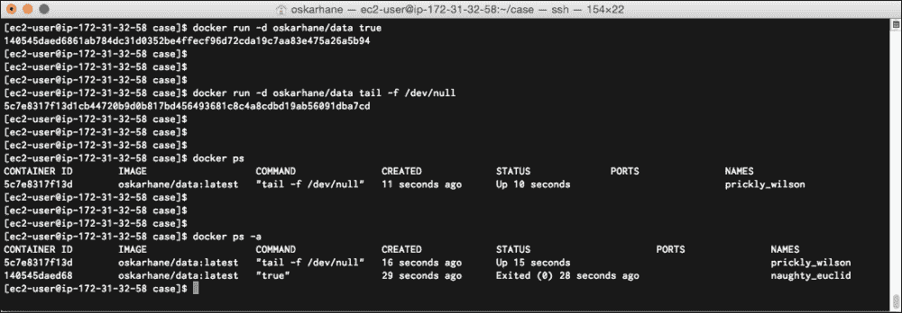
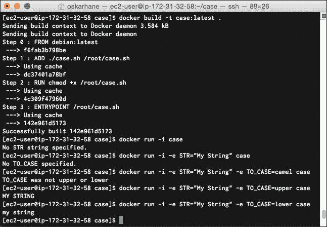

# 第四章：为容器提供数据和参数

WordPress 容器中的 WordPress 数据以及 MySQL 容器中的数据库数据可能并不是我们所希望的。最佳实践是将数据保存在服务容器之外，因为你可能希望将数据与服务容器分开。在本章中，我们将讨论以下主题：

+   数据卷

+   创建数据卷镜像

+   GitHub 上的主机

+   在 Docker Registry Hub 上发布

+   在 Docker Registry Hub 上运行

+   向容器传递参数

+   创建一个带参数的镜像

# 数据卷

我们可以通过两种方式将外部卷挂载到容器中。数据卷允许你在容器之间共享数据，并且如果你更新、停止甚至删除服务容器，数据卷中的数据不会受到影响。

数据卷通过`docker run`语句中的`–v`选项挂载：

```
docker run –v /host/dir:container/dir

```

你可以通过添加多个`–v`指令，将任意数量的数据卷添加到容器中。

数据卷的一个非常好的地方是，传递给容器的数据卷容器本身并不需要了解它的存在，也不需要做任何处理。容器不需要做任何更改，它就像写入本地文件系统一样工作。你可以覆盖容器内的现有目录，这也是常见的做法。其一用途就是将 Web 根目录（通常位于容器内的`/var/www`）放在 Docker 主机上的某个目录下。

## 将主机目录挂载为数据卷

你可以将主机上的目录（或文件）挂载到容器中：

```
docker run –d --name some-wordpress –v /home/web/wp-one:/var/www wordpress

```

这将把主机上的本地目录`/home/web/wp-one`挂载到容器的`/var/www`。如果你只想赋予容器读取权限，可以将指令改为`–v /home/web/wp-one:/var/www:ro`，其中`:ro`表示只读权限。

在生产环境中使用`host`目录作为数据卷并不常见，因为目录中的数据并不具有很好的可移植性。但在测试服务容器如何响应源代码更改时，这种做法非常方便。

你在主机目录中做的任何更改都会直接影响到容器中挂载的数据卷。

## 挂载数据卷容器

处理数据的一个更常见的方法是使用一个专门用于存储数据的容器。该容器中运行的服务应尽量少，以保持其稳定性。

数据卷容器可以通过 Dockerfile 中的`VOLUME`关键字暴露卷，这些卷将在使用数据卷容器时通过`--volumes-from`指令挂载到服务容器上。

一个非常简单的 Dockerfile，带有`VOLUME`指令，可能如下所示：

```
FROM ubuntu:latest
VOLUME ["/var/www"]

```

使用前面提到的 Dockerfile 的容器会挂载`/var/www`。为了将数据容器的卷挂载到服务容器上，我们首先创建数据容器，然后按如下方式挂载：

```
docker run –d --name data-container our-data-container
docker run –d --name some-wordpress --volumes-from data-container wordpress

```

## 数据卷的备份与恢复

由于数据卷中的数据是多个容器共享的，所以通过将数据挂载到临时容器上来访问数据非常简单。以下是如何从一个包含 `VOLUME ["/var/www"]` 的数据卷容器中的数据创建一个 `.zip` 文件（从你的主机中）：

```
docker run --volumes-from data-container -v $(pwd):/host ubuntu zip -r /host/data-containers-www /var/www

```

这将创建一个名为 `data-containers-www.zip` 的 `.zip` 文件，里面包含了来自 `var` 目录中 `www` 数据容器的内容。这个 `.zip` 文件会将内容放入你当前的主机目录中。

# 创建数据卷镜像

由于我们的数据卷容器仅用于存储数据，因此我们应尽量将其保持尽可能小，以免占用服务器上过多不必要的空间。容器中的数据当然可以增长到与服务器磁盘空间相等的大小。我们不需要任何复杂的东西；只需要一个正常工作的文件存储系统。

对于本书，我们将所有数据（MySQL 数据库文件和 WordPress 文件）保存在同一个容器中。当然，你也可以将它们分开存储到两个数据卷容器中，命名为 `dbdata` 和 `webdata` 之类的名称。

## 数据卷镜像

我们的数据卷镜像除了一个可以读写的工作文件系统外，不需要其他任何东西。这就是为什么我们选择的基础镜像是 BusyBox。以下是 BusyBox 对自己的描述：

> *“BusyBox 将许多常见的 UNIX 工具的精简版本组合成一个小型可执行文件。它提供了 GNU 文件工具、shell 工具等大多数工具的替代品。BusyBox 中的工具通常比它们功能齐全的 GNU 版本选项更少；然而，包含的选项提供了预期的功能，且行为非常像它们的 GNU 版本。BusyBox 为任何小型或嵌入式系统提供了一个相当完整的环境。”*

听起来不错！我们将继续将其添加到 Dockerfile 中：

```
FROM busybox:latest

```

### 显示挂载点

Dockerfile 中有一个 `VOLUME` 指令，你可以定义在使用 `--volumes-from` 属性添加此数据卷容器时，哪些目录将暴露给其他容器。在我们的数据卷容器中，我们首先需要为 MySQL 数据添加一个目录。让我们查看将要使用的 MySQL 镜像，看看哪个目录用于数据存储，并将该目录暴露给我们的数据卷容器，以便我们能够使用它：

```
RUN mkdir –p /var/lib/mysql
VOLUME ["/var/lib/mysql"]

```

我们还希望在此容器中安装 WordPress，包括所有的 `.php` 文件和图像文件。再次，我们查看将要使用的镜像，找出哪个目录将被使用。在这种情况下，是 `/var/www/html`。将此添加到 Dockerfile 时，不要添加新行；只需在现有行后追加 MySQL 数据目录：

```
RUN mkdir -p /var/lib/mysql && mkdir -p /var/www/html
VOLUME ["/var/lib/mysql", "/var/www/html"]

```

### Dockerfile

以下是用于数据镜像的简单 Dockerfile：

```
FROM busybox:latest
MAINTAINER Oskar Hane <oh@oskarhane.com>
RUN mkdir -p /var/lib/mysql && mkdir -p /var/www/html
VOLUME ["/var/lib/mysql", "/var/www/html"]

```

就是这样！在将镜像发布到 Docker Registry Hub 时，最好在 Dockerfile 中包含 `MAINTAINER` 指令，这样如果有人有任何原因需要联系你，就能找到你。

# 托管在 GitHub 上

当我们利用如何在 GitHub 上托管 Docker 镜像源和如何在 Docker 注册中心发布镜像的知识时，创建数据卷镜像就不成问题了。

创建一个分支和一个 Dockerfile，并为我们的数据卷镜像添加内容：

```
git checkout -b data
vi Dockerfile
git add Dockerfile

```

在前面代码的第 2 行，你可以使用你喜欢的文本编辑器。我个人觉得 `vi` 很适合我。你应该添加到 Dockerfile 的内容是这样的：

```
FROM busybox:latest
MAINTAINER Oskar Hane <oh@oskarhane.com>
RUN mkdir /var/lib/mysql && mkdir /var/www/html
VOLUME ["/var/lib/mysql", "/var/www/html"]

```

用你的姓名和电子邮件替换维护者信息。

你可以——而且应该——始终确保它在提交和推送到 GitHub 之前正常工作。为此，你需要从你的 Dockerfile 构建一个 Docker 镜像：

```
docker build –t data-test .

```

确保你注意到行末的点，这意味着 Docker 应该在当前目录中查找 Dockerfile。Docker 将尝试根据我们 Dockerfile 中的指令构建镜像。由于这是一个小的基础镜像，上面只有几个 `VOLUME` 指令，它的构建应该相当快。

截图如下：



当一切按我们预期工作时，是时候提交更改并将其推送到我们的 GitHub 仓库了：

```
git commit –m "Dockerfile for data volume added."
git push origin data

```

当你将其推送到仓库后，前往 GitHub 验证你的新分支是否已经出现。

以下截图显示了 GitHub 仓库：



# 在 Docker 注册中心发布

现在我们在 GitHub 上有了新的分支，我们可以去 Docker Hub 注册中心创建一个新的自动构建，命名为 `data`。它将以我们的 GitHub 数据分支为源。



等待构建完成，然后尝试通过你的 Docker 守护进程拉取镜像，验证它是否存在并且可以正常工作。

截图如下：



太棒了！看看这个镜像的大小；它不到 2.5 MB。非常完美，因为我们只是想在其中存储数据。基于这个镜像的容器当然可以大到你的硬盘允许的大小。这只是为了展示镜像的大小。镜像是只读的，记住了吗？

# 运行数据卷容器

数据卷容器是特殊的；它们可以被停止，仍然能够完成它们的任务。就我个人而言，我喜欢在执行 `docker ps` 命令时看到所有容器的使用情况，因为我喜欢定期删除停止的容器。

这个完全取决于你。如果你可以接受保持容器停止，你可以使用这个命令来启动它：

```
docker run –d oskarhane/data true

```

`true` 参数仅用于输入有效命令，`–d` 参数使容器处于分离模式，在后台运行。

如果你希望容器保持运行，你需要将一个服务放在前台，像这样：

```
docker run –d oskarhane/data tail –f /dev/null

```

前面命令的输出如下：



`tail –f /dev/null` 命令是一个永不结束的命令，因此容器会一直运行，直到我们停止它。从资源角度来看，`tail` 命令是相当无害的。

# 向容器传递参数

我们已经看到，如何在启动官方 MySQL 容器时给容器传递参数或环境变量：

```
docker run --name mysql-one -e MYSQL_ROOT_PASSWORD=pw -d mysql

```

`–e MYSQL_ROOT_PASSWORD=pw` 命令是一个示例，展示了如何进行操作。它表示容器内的 `MYSQL_ROOT_PASSWORD` 环境变量的值为 `pw`。

这是一个非常方便的方式，可以创建可配置的容器，在这些容器中，你可以将设置脚本作为 `ENTRYPOINT`，或者配置前台脚本来设置密码；主机；测试、预发布或生产环境；以及容器所需的其他设置。

# 创建一个参数化镜像

为了熟悉这个非常好的功能，我们来创建一个小的 Docker 镜像，它根据环境变量的状态将字符串转换为大写或小写。

这个 Docker 镜像将基于最新的 Debian 发行版，并且只会有一个 `ENTRYPOINT` 命令。以下是 `Dockerfile`：

```
FROM debian:latest
ADD ./case.sh /root/case.sh
RUN chmod +x /root/case.sh
ENTRYPOINT /root/case.sh

```

这条命令将从当前目录中取出 `case.sh` 文件，添加到容器中，使其可执行，并将其指定为 `ENTRYPOINT`。

`case.sh` 文件可能是这样的：

```
#!/bin/bash

if [ -z "$STR" ]; then
 echo "No STR string specified."
 exit 0
fi

if [ -z "$TO_CASE" ]; then
 echo "No TO_CASE specified."
 exit 0
fi

if [ "$TO_CASE" = "upper" ]; then
 echo "${STR^^*}"
 exit 0
fi
if [ "$TO_CASE" = "lower" ]; then
 echo "${STR,,*}"
 exit 0
fi
echo "TO_CASE was not upper or lower"

```

该文件检查 `$STR` 和 `$TO_CASE` 环境变量是否已设置。如果检查 `$TO_CASE` 是否为 `upper` 或 `lower` 时失败，系统会显示一个错误信息，提示我们只处理 `upper` 和 `lower`。

如果 `$TO_STR` 被设置为 `upper` 或 `lower`，环境变量 `$STR` 的内容会分别转换为大写或小写，并打印到 `stdout`。

让我们来试试这个！



这里有一些我们可以尝试的命令：

```
docker run –i case
docker run –i -e STR="My String" case
docker run –i -e STR="My String" –e TO_CASE=camel case
docker run –i -e STR="My String" –e TO_CASE=upper case
docker run –i -e STR="My String" –e TO_CASE=lower case

```

这看起来按预期工作，至少在这个目的下是如此。现在我们已经创建了一个容器，可以接受参数并对其进行处理。

# 总结

在这一章中，你学到可以通过数据卷将数据与服务容器分离。数据卷可以是主机文件系统中的目录、文件或数据卷容器。

我们探讨了如何将参数传递给容器，并如何从 `ENTRYPOINT` 内部读取它们。参数是配置容器的一个很好的方式，使得创建更加通用的 Docker 镜像变得更加容易。

我们创建了一个数据卷容器，并将其发布到 Docker 注册中心，为下一章做准备，在下一章中，我们将连接三个容器，形成一个松耦合的单元。
