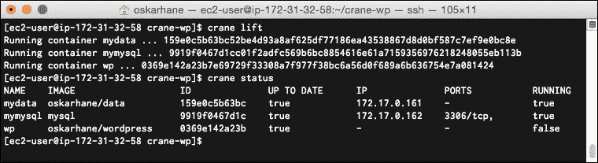

# 第五章：连接容器

现在是时候将我们三个容器连接在一起，形成一个模块化的单元了。我将向你介绍两个服务，**Docker Compose** 和 **Crane**，它们可以用于自动化这个过程。本章将涵盖以下主题：

+   手动连接容器

+   探索数据卷容器的内容

+   使用 Docker Compose 将容器连接到配置文件

+   使用 Crane 将容器连接到配置文件

# 手动连接容器

让我们来看看如何将我们的服务容器连接到数据卷容器。首先，我们需要启动数据卷容器，然后启动 MySQL 容器，最后启动 WordPress 容器，如下命令所示：

```
docker run -d --name data-one oskarhane/data tail -f /dev/null
docker run --name mysql-one --volumes-from data-one -e MYSQL_ROOT_PASSWORD=mysecretpassword -d mysql
docker run --name wordpress-one --volumes-from data-one --link mysql-one:mysql -d -p 80 oskarhane/wordpress

```

在这里，我们启动并命名了数据卷容器为 `data-one`。下一行启动了 MySQL 容器，命名为 `mysql-one`，并为其分配了数据卷容器。最后一行启动了我们的 WordPress 容器，命名为 `wordpress-one`，将 `mysql-one` 作为 MySQL 链接，并分配了数据卷容器。

显示以下输出：


打开你的网页浏览器，前往容器的 URL 和端口，验证所有服务是否正在运行，并且容器是否按预期连接在一起。你应该会看到现在熟悉的 WordPress 安装页面。

如你现在可能已经猜到，你可以使用相同的 MySQL 链接和相同的数据卷容器启动另一个 WordPress 容器。你觉得会发生什么呢？

新的 WordPress 容器将是相同 WordPress 网站的另一个实例，具有相同的文件和相同的数据库。

当你连接容器时，Docker 会在目标容器中设置一些环境变量，以便你可以获取有关链接的源容器的信息。在我们的例子中，这些环境变量将在我们链接 MySQL 容器时设置，如下命令所示：

```
MYSQL_NAME=/wordpress-one/mysql-one
MYSQL_PORT=tcp://ip:3306
MYSQL_3306_TCP=tcp://ip:3306
MYSQL_3306_TCP_PROTO=tcp
MYSQL_3306_TCP_PORT=3306
MYSQL_3306_TCP_ADDR=ip
```

# 探索数据卷容器的内容

数据是写入数据卷容器吗？还是，当容器连接时，数据存储在 MySQL 和 WordPress 容器内部？你怎么判断呢？

确定这一点的一种方法是通过 shell 进入容器，以便你可以浏览它的文件系统。自 1.3 版本起，Docker 具备启动容器 shell 新实例的能力。运行旧的 `docker attach` 命令只是让你进入当前的 shell 实例，而在我们的例子中，这个实例正在运行 `tail –f /dev/null`。如果我们退出这个 `tail` 命令，容器将退出并关闭。因此，我们需要一个新的 shell 实例，以便在容器中调用任何命令，而不会导致容器退出。以下命令可以用来做到这一点：

```
docker exec -i -t data-one /bin/sh

```

`–i` 和 `–t` 标志表示我们希望保持会话交互式并分配一个伪终端。`data-one` 是容器的名称，但你也可以使用容器 ID。如果你喜欢，我会选择 `/bin/bash` 而不是 `/bin/sh`，但该容器运行的是 BusyBox，那里没有 `/bin/bash`。对于我们接下来要执行的任务，使用哪个 shell 并不重要。

我们要做的是查看我们在这个数据卷容器中暴露为 `VOLUMES` 的目录。目录是 `/var/www/html` 和 `/var/lib/mysql`。

让我们在接下来的命令中探索：

```
ls -la /var/www/html
ls -la /var/lib/mysql

```

以下输出会显示：


我们在这两个目录中都看到了文件，这表明另外两个容器正在向这个容器写入数据。它通过数据来分隔服务。如果你需要更多的证据，可以在 shell 中启动 `vi`，编辑文件并在浏览器中重新加载站点。

这非常顺利且简单，对吧？容器之间相互作用，我们所需要做的就是通过一个命令将它们链接在一起。

# 使用 Docker Compose 连接容器

Docker Compose 以前叫做 Fig，但 Docker 收购了 Fig 并更改了名称。以下是 Docker 对 Docker Compose 的描述：

> *"Compose 是一个用于定义和运行复杂应用程序的工具。通过 Compose，你可以在一个文件中定义一个多容器应用程序，然后通过一个命令启动你的应用程序，执行所有需要的操作，使它能够运行。"*

Docker Compose 本质上为我们提供了一种在配置文件中定义设置的方法，这样我们就不必在链接容器时记住所有容器的名称、需要暴露的端口、要使用的数据卷容器等等。

## 安装 Docker Compose

Docker Compose 在 GitHub 上有定期发布的版本，在撰写本书时，最新版本是 1.0.1。

我们将使用 Python 包管理器 pip 来安装 Docker Compose。我们的 EC2 实例没有预装 pip，所以我们需要先安装它，如下所示：

```
sudo su
wget https://bootstrap.pypa.io/get-pip.py && python ./get-pip.py

```

以下输出会显示：


在安装了 pip 之后，你可以继续安装 Docker Compose：

```
sudo pip install -U docker-compose

```

现在，你会看到 Docker Compose 已经安装，并且包含了所有的依赖项。输入 `docker-compose --version` 来验证它是否按预期工作。

## 基本的 Docker Compose 命令

以下是你应该熟悉的基本 Docker Compose 命令：

+   `build`：用于构建或重建服务

+   `kill`：强制停止服务容器

+   `logs`：查看服务的输出

+   `port`：用于打印端口绑定的公共端口

+   `ps`：用于列出容器

+   `pull`：用于拉取服务镜像

+   `rm`：用于移除已停止的服务容器

+   `run`：用于在服务上运行一次性命令

+   `scale`：设置要运行的服务容器数量

+   `start`：用于启动服务的现有容器

+   `stop`：停止正在运行的容器，但不将其移除

+   `up`：用于构建、重建、启动并附加到服务的容器；相关联的容器将被启动，除非它们已经在运行

如你所见，这些命令与 Docker 客户端命令非常相似，且大多数命令通过转发命令到 Docker 守护进程来执行相同的操作。我们将对其中一些命令进行更详细的讲解。

### 服务

当在 Docker Compose 中使用`service`一词时，它指的是`docker-compose.yml`配置文件中命名的容器。

### 使用运行命令

我们通常使用 `run` 命令来启动 Docker 客户端容器。使用 docker-compose 时，`run` 命令的含义非常不同。当你使用 docker-compose 执行命令时，它是在某个服务上执行的一次性命令。这意味着，如果我们将容器配置命名为 `Ubuntu` 并执行 `docker-compose run ubuntu /bin/bash echo hello`，容器将启动并执行 `/bin/bash echo hello`，然后关闭。与直接用 Docker 执行命令的不同之处在于，使用 docker-compose 时，所有关联的容器和 `VOLUME` 容器都将启动并连接。

### 使用 scale 命令

`scale` 命令非常有意思。当我们执行 `docker-compose scale web=3` 时，实际上是启动了我们命名为 `web` 的服务的三个容器。

## 使用 Docker Compose 设置我们的 PaaS

每个 Docker Compose 实例都位于自己的目录中，并且该目录下有一个名为`docker-compose.yml`的配置文件：

```
mkdir docker-compose-wp && cd $_
touch docker-compose.yml

```

这是我们`docker-compose.yml`文件的内容示例：

```
wp:
 image: oskarhane/wordpress
 links:
 - mysql:mysql
 ports:
 - "80"
 volumes_from:
 - paasdata
mysql:
 image: mysql
 volumes_from:
 - paasdata
 environment:
 - MYSQL_ROOT_PASSWORD=myrootpass
paasdata:
 image: oskarhane/data
 command: tail -f /dev/null

```

你可以看到我们在这里定义了三个服务，分别是`wp`、`mysql`和`paasdata`。

让我们尝试这些服务，接下来会显示以下输出：


执行 `docker-compose up –d` 以在守护进程模式下运行 `docker-compose` 和容器。

就是这么简单。打开你的网页浏览器，访问 Docker 主机和表格中列出的端口（在我的例子中是端口 **49155**）；你应该会看到非常熟悉的 WordPress 安装页面。

# 使用 Crane 连接容器

Crane 很像 Docker Compose，但它提供了更多的配置选项。其创建者是这样描述 Crane 的：

> *“Crane 是一个用于协调 Docker 容器的工具。它通过读取一些配置（JSON 或 YAML），描述如何获取镜像以及如何运行容器。这样可以大大简化开发环境的设置，因为你不必手动启动每个容器，也不需要记住所有需要传递的参数。通过将配置与数据和应用程序存储在同一个仓库中，你可以轻松共享整个环境。”*

如你所见，这一段也可以讲解 Docker Compose。

## 安装 Crane

Crane 安装简单，但保持更新并不容易。安装和更新使用相同的命令，因此我们必须时不时地执行一次命令以获得最新版本。

执行以下命令来安装 Crane：

```
bash -c "`curl -sL https://raw.githubusercontent.com/michaelsauter/crane/master/download.sh`" && sudo mv crane /usr/local/bin/crane

```

Crane 现在已安装在`/usr/local/bin`目录中。

## 用法

我不会在这里讲解所有的命令，因为它们与 Docker Compose 的命令类似，但我会在这里对一些命令做一些评论：

+   `lift`: 这个命令像 Docker Compose 的 `up` 命令一样，从你的配置文件中构建并运行容器

+   `graph`: 这将显示你的容器与配置文件之间的关系

+   `logs`: 这映射到 Docker Compose 的命令，但在这里你可以获取整个组的日志

+   `status`: 这也映射到 Docker Compose 的命令，但可以让你获取整个组的日志

## 配置

这就是 Crane 真正超越 Docker Compose 的地方。Crane 应用有更多的配置选项。配置文件必须命名为 `crane.json` 或 `crane.yaml`。对于每个容器，以下是你可以配置的内容：

+   `image` (string, required): 这是要构建/拉取的镜像名称

+   `dockerfile` (string, optional): 这是指向 Dockerfile 的相对路径

+   `run` (object, optional): 这些参数映射到 Docker 的 `run` 和 `create` 命令：

    +   add-host (array): 这将添加自定义的主机到 IP 的映射

    +   cpuset (integer)

    +   cpu-shares (integer)

    +   detach (boolean) `sudo docker attach <container name>` 将正常工作

    +   device (array): 这将添加主机设备

    +   dns (array)

    +   entrypoint (string)

    +   env (array)

    +   expose (array): 这表示要暴露给链接容器的端口

    +   hostname (string)

    +   interactive (boolean)

    +   link (array): 这将链接容器

    +   memory (string)

    +   privileged (boolean)

    +   publish (array): 这将映射网络端口到容器

    +   publish-all (boolean)

    +   restart (string) 重启策略

    +   rm (boolean)

    +   tty (boolean)

    +   volume (array): 与普通 Docker 相比，主机路径可以是相对路径

    +   volumes-from (array): 用于从其他容器挂载卷

    +   workdir (string)

    +   `cmd` (array/string): 这个命令用于附加到 `docker run`（覆盖 CMD）

+   `rm (object, optional):` 这些参数映射到 Docker 的 `rm` 命令：

    +   volumes (boolean)

+   `start (object, optional)`: 这些参数映射到 Docker 的 `start` 命令：

    +   attach (boolean)

    +   interactive (boolean)

设置与 Docker Compose 中相同的配置，它看起来类似以下代码。正如你可能理解的，你也可以用 JSON 格式写这个文件，但为了与 Docker Compose 版本进行方便比较，我将保持使用 `yaml` 格式：

```
containers:
 wp:
 image: oskarhane/wordpress
 run:
 volumes-from: ["mydata"]
 link: 
 - mymysql:mysql
 publish: ["80"]
 detach: true
 mymysql:
 image: mysql
 run:
 volumes-from: ["mydata"]
 detach: true
 env: ["MYSQL_ROOT_PASSWORD=rootpass"]
 mydata:
 image: oskarhane/data
 run:
 detach: true
 cmd: "tail -f /dev/null"

```

在这里，我们指定了三个容器，其中数据容器作为数据卷容器添加到其他容器中，而 MySQL 容器则与 WordPress 容器相链接。

将此文件保存为 `crane.yaml`，并输入 `crane lift` 来运行你的应用。

以下输出被显示：



要查看容器的当前状态，可以输入 `crane status`。查看 `wp` 容器的最后一列，它显示容器未运行。输入 `crane` `logs wp`，然后查看以下命令输出的内容：

```
wp * WordPress not found in /var/www/html - copying now...
wp * Complete! WordPress has been successfully copied to /var/www/html
wp | 
wp | Warning: mysqli::mysqli(): (HY000/2002): Connection refused in - on line 5
wp * MySQL Connection Error: (2002) Connection refused

```

看起来我们的 WordPress 容器启动速度快于 MySQL 容器，因此 WordPress 容器在启动时无法找到 MySQL 容器。

在 Docker Compose 中也可能发生这种情况，因为没有检查 `--link:ed` 容器是否已经启动，至少在本文写作时是没有的。

这个问题无法通过 Docker Compose 解决；我们只能靠纯粹的运气，期望 MySQL 容器在 WordPress 容器尝试使用链接的 MySQL 容器之前已经准备好。

使用 Crane，您可以在配置文件中将容器分组，并对该组执行 `run` 命令，而不是对整个配置进行操作。

这非常简单；我们只需在 `crane.yaml` 文件末尾添加以下几行：

```
groups:
 default: ['mydata', 'mymysql', 'wp']
 data_db: ['mydata', 'mymysql']
 web: ['wp']

```

在这里，我们将 WordPress 容器与其他两个容器分开，这样我们就可以分别对它们执行 `run` 命令。

让我们首先通过调用 `crane lift data_db --recreate` 命令启动 `data_db` 组。我添加了 `--recreate` 标志，以确保我们正在创建新容器，而不是重用旧的容器。运行 `crane status data_db` 来确保它们正在运行。

既然我们知道 MySQL 容器正在运行，我们可以通过调用 `crane lift web --recreate` 命令来启动 WordPress 容器。

以下输出被显示：


# 总结

现在，我们可以以不同的方式连接容器，以保持不同的服务在不同的容器中分开。我们学会了如何手动执行此操作，当容器之间有大量依赖关系时，这可能会非常困难。

我们简要地看了两个编排工具：Docker Compose 和 Crane。Crane 是一个独立的、更先进的工具，适用于那些希望对容器拥有更多控制的管理员。Crane 能够将容器分组，使其在存在依赖性时可能出现的时序问题中更加可靠。

在下一章中，我们将使用 Crane 运行两个应用实例，看看当我们希望让两个博客在常规 HTTP 端口（80）上对外公开时，可能会遇到哪些问题和机遇。
