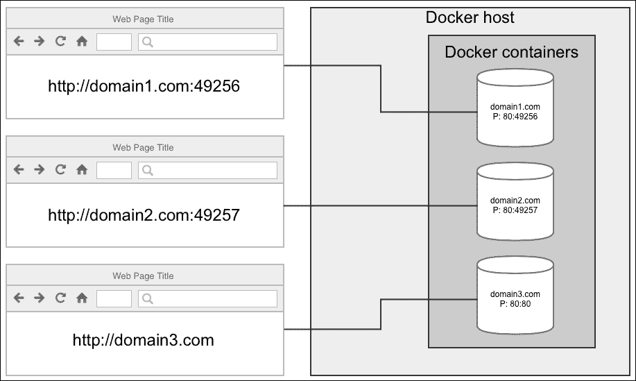
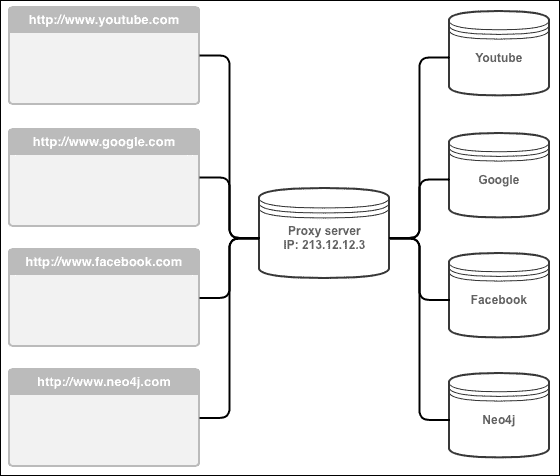
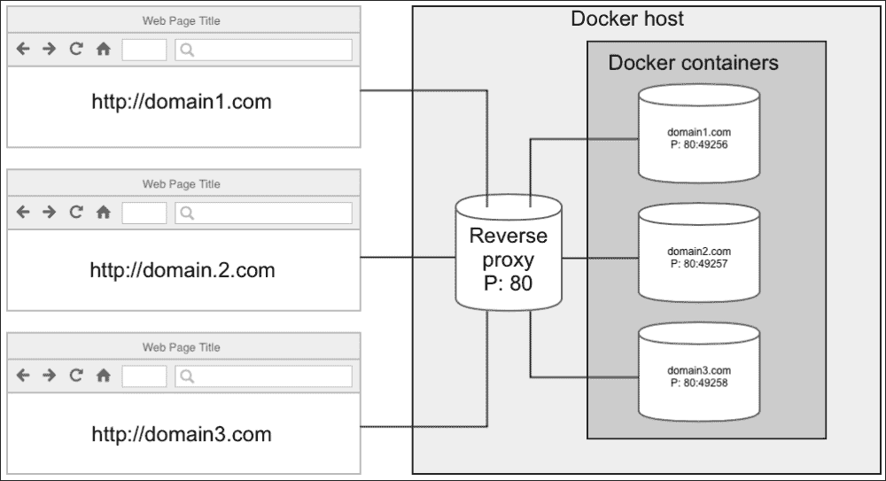
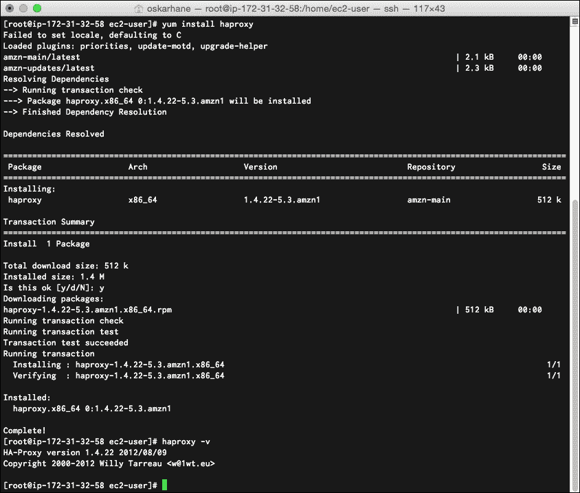
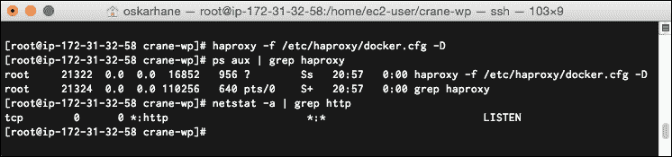
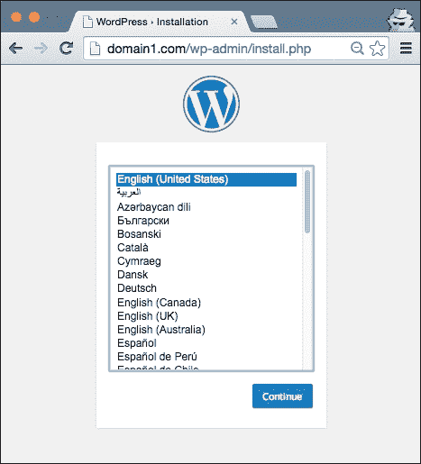

# 第六章：反向代理请求

拥有许多容器并在同一服务器上公开端口的一个大问题是，它们无法都监听其服务类型的标准端口。如果我们有一个 MySQL 后端服务并且有 10 个 MySQL 容器在运行，那么只有其中一个可以监听 MySQL 的标准端口 `3306`。对于那些暴露 Web 服务器的容器，标准端口 `80` 只能由其中一个 WordPress 容器使用。在这一章中，我们将讨论以下主题：

+   解释问题

+   想出问题的解决方案

+   使用 Nginx 和 HAProxy 实现解决方案

+   自动化域名映射的过程

# 解释问题

在同一主机上有多个容器运行相同服务的问题在于，用户应用程序会使用标准端口。使用 Web 浏览器并输入运行 WordPress 容器的 Docker 主机的 IP 地址时，默认会请求端口 `80` 上的资源。你不能指望用户记住非标准端口来访问你的网站。



到达这三个容器的唯一方式是手动输入容器的暴露端口号。

# 寻找解决方案

在我们进入解决方案之前，让我解释一下什么是常规代理服务器，以防你不熟悉它。

代理服务器是一个代表你连接服务并将所有结果转发给你的服务器。在你设置将所有流量通过代理服务器路由之后，你—作为用户—不会察觉到它的存在。所有内容将像平常一样工作。

然而，服务所有者只看到某台机器（代理服务器）与他们连接。如果另一个用户使用相同的代理服务器并与您使用相同的服务，服务所有者无法区分并且会将您视为同一个用户。



通过代理服务器连接的不同用户将显示为一个用户。

如前面的图示所示，服务所有者仅看到某个 IP 地址为 **213.12.12.3** 的用户连接到他们。

那么，如果我们在 Docker 主机上使用这个方法呢？如果我们在所有容器前放置一些东西呢？根据请求的是哪个域名，这个东西会将请求转发到正确的容器和端口，然后将请求的响应转发给请求的用户。

有些专门设计来解决这种问题的工具，叫做 **反向代理**（反向是因为代理位于另一端，使得用户只能看到一个 IP，并转发请求）。

如果我们在 Docker 主机服务器上安装并配置了反向代理，那么图示将如下所示：



反向代理使所有 Docker 容器看起来像是一个。

反向代理监听 `80` 端口——标准的 Web 端口——当 `domain1.com` 的请求到来时，代理会查看其配置，看看是否有为该域名指定的转发端点。如果有，反向代理会将请求转发到正确的 Docker 容器，等待其响应，并在响应到达时将容器的响应转发给请求的用户。

这是我们想要的解决方案。现在唯一的问题是我们要使用哪种反向代理。市面上有很多种反向代理；其中一些反向代理有更具体的用途，比如负载均衡，而另一些则是多功能服务，同时也包含了反向代理功能，比如 Web 服务器。

# 实现解决方案

在选择解决问题的工具时，你总会有偏好。有时你选择一个工具是因为你对它熟悉并且它足够好；有时你选择它是因为它的性能优秀，或者只是因为你想尝试一些新的东西。

这就是我们通过两个不同工具来解决这个问题的原因。最终结果是相同的，但这两个工具的配置方式略有不同。

在我们开始实现解决方案之前，我们使用 Crane 启动一个包含三个容器的应用实例，并通过连接到网站来验证它是否正常工作。让 Docker 决定公用端口，因此它是 `491XX`。记住这个端口，因为我们在实施解决方案时将会使用它。

我们需要将我们希望使用的域名指向 Docker 主机的 IP 地址。我们可以通过将域名的 A 记录设置为我们服务器的 IP 地址，或者在本地的 `/etc/hosts` 文件中添加一行，将域名请求指向我们服务器的 IP 地址。

我会选择后者，并将此内容添加到我 Mac 的 `/etc/hosts` 文件中：

```
54.148.253.187 domain1.com
54.148.253.187 domain2.com
54.148.253.187 domain3.com

```

### 注意

确保将上面的 IP 地址替换为你的服务器 IP 地址。

## 使用 HAProxy 实现

HAProxy ([`www.haproxy.org`](http://www.haproxy.org)) 是一个负载均衡器，负责将流量转发到其背后的不同服务。

这是 HAProxy 对自身的描述：

> *“HAProxy 是一个免费的、非常快速且可靠的解决方案，提供高可用性、负载均衡和基于 TCP 和 HTTP 的应用程序代理。它特别适用于流量非常大的网站，支撑了世界上一些最受欢迎的网站。多年来，它已成为事实上的标准开源负载均衡器，现在大多数主流 Linux 发行版都已默认安装，且通常在云平台上作为默认部署工具。”*

听起来这正是我们所需要的。

### 安装 HAProxy

正如引用中所述，许多系统已经预装并随系统发布。如果找不到它，使用 Ubuntu 或 Debian 的包管理器（`apt-get install haproxy`）或其他发行版的包管理器，应该可以找到。

在我的 Amazon EC2 实例上，该实例运行的是 Amazon Linux，HAProxy 可以通过`yum install haproxy`安装。

以下输出将会如下所示：



这不是最新版本，但对于我们接下来的操作来说已经足够了。

### 配置 HAProxy

我们将在文件`/etc/haproxy/docker.cfg`中编写 HAProxy 配置，这样我们就不需要删除默认配置文件中的所有内容，因为它将来可能作为参考。

HAProxy 将其配置分为四个部分：global、defaults、frontend 和 backend。不要将 frontend 和 backend 与前端和后端开发混淆。在这里，frontend 是面向互联网的服务器部分，而 backend 是 HAProxy 后面的服务器部分，在我们这个例子中是 Docker 容器。

打开配置文件并从这里开始输入通用设置，如下所示：

```
global
    daemon
    maxconn 4096
    pidfile /var/run/haproxy.pid
defaults
    mode http
    timeout connect 5000ms
    timeout client 50000ms
    timeout server 50000ms
```

现在，我们输入要监听的端口和要使用的后端配置，针对哪个域名：

```
frontend http-in
    bind *:80
    acl is_site1 hdr_end(host) -i domain1.com
    use_backend site1 if is_site1
```

我们定义了常规的传入 HTTP 流量应该在端口`80`上被捕获。`acl`是访问控制列表（Access Control List），是一种灵活的解决方案，可以根据请求中的内容做出决策。`hdr_end(host) -i domain1.com`函数调用意味着对 header host 的末尾进行不区分大小写的匹配，匹配字符串`domain1.com`。这个匹配的结果（布尔值）将被保存在`is_site1`变量中。

请注意，这意味着`domain1.com`的所有子域都将与此设置匹配。如果你只想匹配`www.domain1.com`，可以改用`hdr(host) -i www.domain1.com`。

现在我们已经将匹配结果保存在`is_site1`变量中，接下来可以向名为`site1`的后端配置发送请求。

我们将其附加到配置文件中：

```
backend site1
    balance roundrobin
    option httpclose
    option forwardfor
    server s1 127.0.0.1:49187 maxconn 450
```

我们将后端名称定义为`site1`，设置一些选项，并将服务器和端口添加到我们的 WordPress 容器。

### 注意

确保在之前的代码中输入的是你 WordPress 容器暴露的端口，而不是`49187`。

是时候尝试这个配置了。保存配置文件，并在终端中使用以下命令进行测试：

```
haproxy -f /etc/haproxy/docker.cfg –c

```

输出应该显示`配置文件有效`。

确保你的机器上没有其他应用在监听端口`80`。你可以使用类似`netstat –a`的命令来验证`80`或 HTTP 是否已经列出。如果已经有应用在监听，找到并关闭它。

使用以下命令启动 HAProxy：

```
haproxy -f /etc/haproxy/docker.cfg –D

```

`-D`选项意味着我们希望它作为后台进程运行。你运行这个命令时应该不会看到任何输出。

让我们通过运行`ps aux | grep haproxy`来检查 HAProxy 是否在运行。你应该能看到它列在那儿。最后，我们通过运行`netstat –a | grep http`来验证它是否在监听端口`80`。现在，你应该在列表中看到相应的内容。

这里显示的是获得的输出：



一切看起来都很不错！

简单回顾一下我们所做的：我们设置了一个服务，它在服务器的端口 `80` 上监听传入的请求。当该端口接收到请求时，检查请求头中的主机，看看是否与 `domain1.com` 匹配。如果匹配，请求将被转发到 IP 地址 `127.0.0.1` 和端口 `49187`。来自该 IP 和端口的响应将返回给请求者。

现在到了关键时刻。打开你的网页浏览器，输入 URL `domain1.com`。

确保在你的主机文件中有 `domain1.com` 的条目，并指向你的服务器。

执行上述步骤后，你将看到以下网站界面：



你可以看到，在位置栏中没有指定端口号。太棒了！

### 向 HAProxy 添加更多域

我们并不是为了仅在端口 `80` 上提供单个 Web 应用程序而进行这么多工作，这可以通过不使用反向代理来实现。使用 Crane 启动另一个 WordPress 应用程序，方法是将旧的配置复制到一个新目录，并更改服务名称，如下所示：

```
cd..
cp –r crane-wp crane-wp2
cd crane-wp2
sed -i "s/wp/wp2/g" crane.yaml
sed -i "s/mydata/mydata2/g" crane.yaml
sed -i "s/mymysql/mymysql2/g" crane.yaml
crane lift data_db
crane lift wp2

#check out port for new container named wp2
docker ps

```

再次打开 HAProxy 配置文件，并在前端添加两行：

```
acl is_site2 hdr_end(host) -i domain2.com
use_backend site2 if is_site2

```

然后，添加一个名为 `site2` 的新后端配置：

```
backend site2
 balance roundrobin
 option httpclose
 option forwardfor
 server s2 127.0.0.1:49188 maxconn 450

```

确保你替换了你获得的端口号。重启 HAProxy 并进行我们上次启动时所做的检查。

要重启 HAProxy，运行 `/etc/init.d/haproxy restart`。

### 注意

HAProxy 可以使用以下命令重新加载新配置，而不会丢失活动会话：

```
haproxy -f /etc/haproxy/docker.cfg -p /var/run/haproxy.pid -sf $(cat /var/run/haproxy.pid)

```

打开浏览器，访问 `domain1.com`，确保旧站点正常运行。如果它正常工作，再访问 `domain2.com`。你应该会看到另一个 WordPress 安装站点。为了确保它不是相同的，安装其中一个。或者，访问 `domain3.com`，看看当一个域指向服务器而在 HAProxy 中没有匹配时会发生什么。

## 使用 Nginx 实现

现在，我们将做与 HAProxy 相同的操作，但我们将使用出色的 Web 服务器 Nginx（[`nginx.org/en/`](http://nginx.org/en/)）作为反向代理。Nginx 是一个功能全面且速度极快的 Web 服务器，占用内存极少。

下面是对 Nginx 的描述：

> *"nginx [engine x] 是一个 HTTP 和反向代理服务器，同时也是一个邮件代理服务器，由 Igor Sysoev 编写。长期以来，它已经在许多重载的俄罗斯网站上运行，包括 Yandex、Mail.Ru、VK 和 Rambler。根据 Netcraft 的数据，nginx 在 2014 年 11 月服务或代理了 20.41% 的最繁忙网站。以下是一些成功的案例：Netflix、Wordpress.com、FastMail.FM。"*

这也听起来像是我们需要的，就像之前使用 HAProxy 时一样。

### 安装 Nginx

Nginx 在所有 Linux 包管理器中都可用，如 `aptitude`/`apt`、`yum` 等，因此可以通过 `apt-get install nginx` 或 `yum install nginx` 来简单安装。由于它是开源的，你当然也可以从源代码进行安装。

### 配置 Nginx

我们将把配置添加到名为`/etc/nginx/conf.d/wp1.conf`的文件中。

在您喜欢的文本编辑器中创建并打开此文件：

```
server {
    listen 80;
    server_name domain1.com;
    charset UTF-8;

    if ($host !~ ^(domain1.com)$ ) {
         return 444;
    }
}
```

如您所见，这个块使服务器监听`80`端口，并且匹配域名`domain1.com`，以便此配置生效。始终指定服务器字符集是一个好习惯，这样在转发过程中网站文本就不会出现错误编码；因此，我们也添加了这一行。为了只监听`domain1.com`而不监听其他域名（如果在服务器名称部分没有匹配，Nginx 会使用找到的第一个配置作为默认配置），我们在其他进入的请求上返回 HTTP 状态码`444`（无响应）。

那么，我们该如何处理`domain1.com`上`80`端口的请求呢？

将此添加到服务器的范围内（大括号内）：

```
location / {
    proxy_pass http://wp1;
    proxy_set_header X-Real-IP $remote_addr;
    proxy_set_header X-Forwarded-For $proxy_add_x_forwarded_for;
    proxy_set_header X-NginX-Proxy true;
    proxy_set_header Host $host;
    proxy_set_header X-Forwarded-Proto $scheme;
    proxy_redirect off;
}
```

`location`块将匹配所有请求，因为它匹配`/`。稍后我们将回到`proxy_pass`部分。除此之外，您会看到我们设置了很多头信息，其中大部分告诉我们的 Docker 容器请求者的真实 IP 地址等等。

回到`proxy_pass`部分。这部分实际上是将请求转发到名为`wp1`的内容。这叫做上游，我们需要定义它。

将此添加到服务器范围之外：

```
upstream wp1 {
    server 127.0.0.1:49187;
}
```

完整的配置文件`/etc/nginx/conf.d/wp1.conf`现在应该是这样的：

```
upstream wp1 {
  server 127.0.0.1:49187;
}

server {
  listen 80;
  server_name domain1.com;
  charset UTF-8;

  if ($host !~ ^(domain1.com)$ ) {
    return 444;
  }

  location / {
    proxy_pass http://wp1;
    proxy_set_header X-Real-IP $remote_addr;
    proxy_set_header X-Forwarded-For $proxy_add_x_forwarded_for;
    proxy_set_header X-NginX-Proxy true;
    proxy_set_header Host $host;
    proxy_set_header X-Forwarded-Proto $scheme;
    proxy_redirect off;
  }
}
```

保存文件后，在大多数 Linux 系统上，您可以使用命令`sudo /etc/init.d/nginx configtest`或`sudo service nginx configtest`来测试语法错误。

### 注意

确保在启动 Nginx 之前关闭 HAProxy，否则您会收到错误提示，说明 Nginx 无法绑定到`80`端口。您可以使用以下命令做到这一点：

```
/etc/init.d/haproxy stop

```

如果测试成功，现在我们可以重新启动（或启动）Nginx 服务器。再次使用`sudo /etc/init.d/nginx restart`或`sudo service nginx restart`在大多数系统上执行此操作。

打开您的浏览器，输入`domain1.com`的 URL，查看我们的 WordPress 安装页面。为了确保只有`domain1.com`有效，尝试访问`domain2.com`并期待没有响应。

### 向 Nginx 添加更多域名

要向 Nginx 添加另一个匹配域名，您可以在`/etc/nginx/conf.d/`目录下创建一个新文件，并重新加载 Nginx 配置，如下所示：

```
cp /etc/nginx/conf.d/wp1.conf /etc/nginx/conf.d/wp2.conf
sed -i "s/wp1/wp2/g" /etc/nginx/conf.d/wp2.conf
sed -i "s/domain1/domain2/g" /etc/nginx/conf.d/wp2.conf
sed -i "s/49187/49188/g" /etc/nginx/conf.d/wp2.conf

#test config
/etc/init.d/nginx configtest

#reload config
/etc/init.d/nginx reload

```

复制配置文件，替换几个名称，运行`configtest`，然后重新加载 Nginx。

在浏览器中尝试`domain1.com`，确保它仍然有效。您应该仍然能看到 WordPress 安装页面（除非您已经安装了 WordPress）；之后，前往`domain2.com`查看我们的新配置是否生效。

如果您想关闭一个网站，只需将文件扩展名从`.conf`更改为其他扩展名，并重新加载 Nginx。

# 自动化域名映射过程

这种设置的局限性在于每次添加新域名时都需要手动操作。在我的网站（[`oskarhane.com`](http://oskarhane.com)）上，我写了一些关于如何自动化这个过程的博客文章，那些文章是我有史以来阅读最多的文章。

当我找到 **nginx-proxy** 时，我非常高兴。nginx-proxy 通过通过 Docker 远程 API 监控 Docker 事件，比我更聪明地解决了这个问题。

### 注意

你可以在其 GitHub 页面上查看更多关于 nginx-proxy 的信息（[`github.com/jwilder/nginx-proxy`](https://github.com/jwilder/nginx-proxy)）。

`nginx-proxy` 作为一个容器提供，我们可以通过执行以下命令来运行它：

```
docker run -d -p 80:80 -v /var/run/docker.sock:/tmp/docker.sock jwilder/nginx-proxy

```

我们将 Docker 套接字提供给容器，这样它就可以监听我们感兴趣的事件，即容器的启动和停止。我们还将 Docker 主机的端口 80 绑定到这个新容器，使其成为所有传入 Web 请求的入口容器。在启动 `nginx-proxy` 容器之前，请确保停止 Docker 主机上的 Nginx。你可以使用以下命令来执行此操作：

```
/etc/init.d/nginx stop

```

当容器启动时，`nginx-proxy` 会创建一个 nginx 反向代理 `config` 文件并重新加载 Nginx——就像我们所做的那样，但通过 `nginx-proxy` 完全自动化。

要告诉 `nginx-proxy` 我们希望将哪个域名映射到哪个容器，我们必须使用名为 `VIRTUAL_HOST` 的环境变量运行容器。

在我们的 `crane.yaml 文件` 中，我们在 `wp` 运行部分添加了一个环境变量：

```
containers:
 wp:
 image: oskarhane/wordpress
 run:
 volumes-from: ["mydata"]
 link:
 - mymysql:mysql
 publish: ["80"]
 detach: true
 env: ["VIRTUAL_HOST=domain1.com"]

```

现在，我们只需再次用 crane 启动它，就能将该容器映射到 `domain1.com` 域名上的端口 `80`：

```
crane lift web --recreate

```

# 总结

在本章中，我们看到如何解决多个容器希望在同一公共端口提供数据的问题。我们了解了什么是代理服务器和反向代理服务器，以及反向代理如何在负载均衡中使用。

我们安装并配置了两个不同的反向代理：HAProxy 和 Nginx。在我的工作流程中，Nginx 配置更适合，只需复制一个文件，替换几个词，然后重新加载 Nginx 就能使其工作。HAProxy 在你的设置中可能表现更好；选择权在你，不能说哪一个比另一个更好。

`nginx-proxy` 自动化了为启动的容器创建反向代理的过程，是 PaaS 的一个不错的解决方案，除了一个问题：简单直接的部署。这就是下一章的内容。
