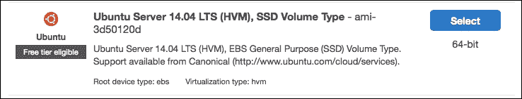
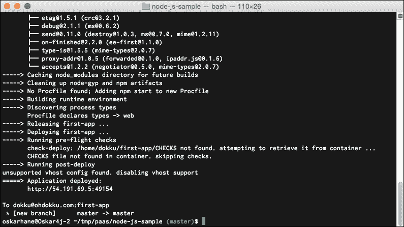
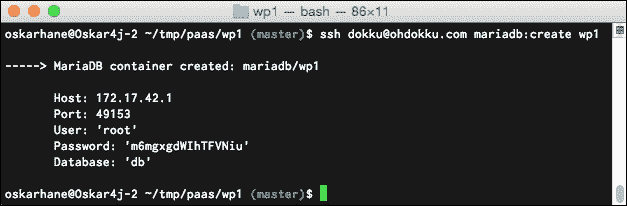
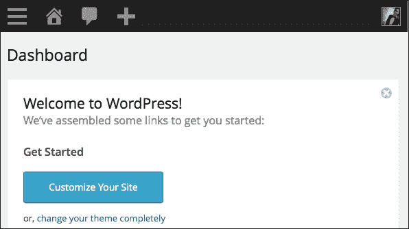
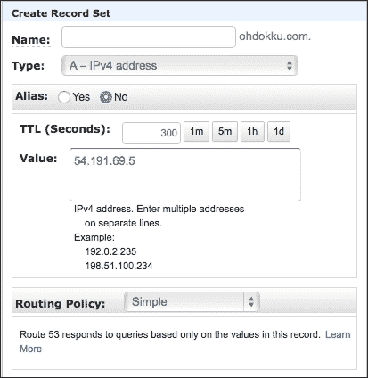

# 第七章：在我们的 PaaS 上部署

在之前的章节中，我们通过结合 Crane 和 nginx-proxy 等工具，从非常实操的方式逐步过渡到“拼凑自动化”的方式。仍然有一部分缺失——如何部署你的代码。

在这一章中，我们将讨论以下主题：

+   我们当前设置的问题

+   可用的工具/服务

+   Dokku——迷你版 Heroku

+   使用 Dokku 设置 WordPress 应用程序

# 我们当前设置的问题

我们当前的设置由三个容器组成：一个 WordPress 容器，一个 MySQL 容器和一个数据卷容器，它们通过 Crane 连接在一起。

我们当前使用 `VOLUME` 容器作为文件存储的主要问题是，我们需要一种方式进入该卷以编辑文件。目前，进入它的唯一方法是将它挂载到另一个容器上。

另一个问题是我们没有对源代码进行版本控制。我们只是下载了 WordPress 和一些插件并放在那里。如果我们更新了 WordPress 或做了其他更改怎么办？我们肯定希望将这些操作纳入版本控制中。

如果我们希望保持当前的应用架构不变，有两种选择：

+   创建一个新容器，挂载我们的数据卷容器，安装它，并通过 SSH 访问它

+   在我们的 WordPress 容器中安装并打开 SSH 访问

安装了 SSH 后，我们可以从远程机器访问容器的 shell，因此，我们可以安装 Git 以对文件进行版本控制。通过这种方式，当我们需要时，可以连接并将新代码推送到数据卷容器中。

连接到 SSH 时，你可以直接进入容器，而不需要连接到 Docker 主机的 shell。

如果你可以连接到 Docker 主机，并且从那里打开一个新的 shell 进入你的数据卷容器，那么第三个选择是通过 SSH 进入 Docker 主机，然后使用 `docker exec –it container_name /bin/sh` 访问容器。

虽然这样肯定有效，但也有更简单的方法。

# 可用的工具/服务

当我们看到今天可用的托管 PaaS 提供商时，有两个会浮现在脑海中——OpenShift 和 Heroku。许多开发者喜欢 Heroku，因为它的易用性。它们的理念给出了一个提示，为什么会这样：

> *“开发者生产力：*
> 
> *开发者生产力是我们的口号，是我们所做一切的核心。为什么要做三步操作，明明一步就够？为什么要做任何操作，当零步就能完成的时候？”*

开发人员通常希望将时间花在他们的代码上，而不是管理服务器、部署等任务。


在 Heroku 上，你会得到一个远程 Git 仓库，你可以将代码推送到其中。你的应用程序的语言和依赖项会通过特定的文件来识别，这些文件根据你使用的语言而有所不同。环境变量用于配置，并且你通过在一个特殊的文件中指定命令来指示 Heroku 执行什么操作，这个文件称为**Procfile**，你需要将其包含在源代码中。

每当你将代码推送到远程 Heroku Git 仓库时，应用程序会重建，并立即在线发布。如果你有特殊的构建需求，Heroku 允许你创建自己的构建包，其中可以精确指定要执行的操作。

基本上，如果你想在 Heroku 上设置一个 WordPress 博客，你需要按照以下步骤操作：

1.  本地下载 WordPress 的最新版本。

1.  创建一个 Procfile 并定义要执行的内容（在此情况下是运行 PHP 和 Apache2 的构建包）。

1.  创建一个 `composer.json` 文件，指定 PHP 是一个依赖项。

1.  对 WordPress 配置文件进行一些更改。

1.  创建 Heroku 应用程序，添加附加组件（如数据库），并在 Heroku 上定义环境变量。

1.  将本地代码推送到 Heroku。

当你对代码进行更改时，只需通过 Git 推送到 Heroku 来部署新代码。你不能直接在 Heroku 服务器上编辑代码，也不能安装主题或插件（必须在本地做，然后推送新代码）。


如果你选择了 OpenShift 等提供商，你将对你的 PaaS 拥有更多的控制权。你可以通过 SSH 连接并存储应用程序下载的静态文件。

我们正在寻找的就是这样的东西；只是我们想要托管自己的平台，并在后台使用 Docker 容器。

# Dokku – 基于 Docker 的迷你 Heroku

Dokku 可以在 [`github.com/progrium/dokku`](https://github.com/progrium/dokku) 找到。它是一个由作者描述如下的项目：

> *“大约 100 行 Bash 脚本，构建 Docker 支持的迷你 Heroku。”*

在功能方面，Dokku 执行部署的方式与 Heroku 相同。让我们安装 Dokku，看看它能为我们的 PaaS 做些什么。

## 安装

Dokku 需要 Ubuntu 14.04 来运行，我们从创建一个运行该版本的 EC2 实例开始。

这里是我们看到的截图：



当我们创建好实例并使其运行后，我们可以开始安装 Docker 本身：

```
sudo apt-get install docker.io

```

完成后，我们继续安装 Dokku。

推荐的引导式 bash 安装方法对我来说不起作用，因此我改为克隆了仓库：

```
cd /tmp
git clone https://github.com/progrium/dokku.git
cd dokku
sudo make install
dokku version

```

### 注意

你可以在官方安装页面 [`progrium.viewdocs.io/dokku/installation`](http://progrium.viewdocs.io/dokku/installation) 阅读关于安装过程的信息。

安装部分可能需要一段时间，但应该会成功。

根据前面链接中的文档，我们应该编辑 `/home/dokku/VHOST` 文件，填写我们计划使用的域名。我们暂时跳过这一步，因为它涉及到设置一些 DNS 记录。当我们将该文件留空时，我们将通过 `http://ip:port` 的形式访问我们的 PaaS。稍后我们会回到这一点。

现在剩下的唯一步骤是，在本地机器上创建一对 `ssh` 密钥，并将公钥部分添加到服务器用户 Dokku 的 `authorized_keys` 文件中，这样我们就可以通过 Git 以非常安全的方式进行连接，而无需使用密码。

在本地机器上，使用以下命令：

```
cd ~/.ssh
ssh-keygen –t rsa
#I named my key pair id_rsa
cat id_rsa.pub
#copy the output so you have it in your clipboard

```

在服务器上，使用以下命令：

```
#As your ubuntu user
#Replace <publickey> with the key you just copied
#<remoteuser> can be replaced with anything, like "remoteuser".
echo "<publickey>" | sudo sshcommand acl-add dokku <remoteuser>

```

如果你将 `ssh-key` 命名为其他名称而不是 `id_rsa`，你将需要编辑本地的 `.ssh/config` 文件才能使其工作。

现在 Dokku 配置已完成，我们应该能够开始使用它了。

## 创建一个示范的 Dokku 应用

现在是时候设置一个示范应用程序，让你可以学习这个过程。在这种情况下，我们以 Heroku 的 `Node.js` 示例应用为例。

我们首先通过克隆 Heroku 的 `node-js-sample` GitHub 仓库来获取应用的内容。接下来的所有任务都应该在你的本地机器上完成，当我输入 **server.com** 时，你应该输入你服务器的 URL 或 IP 地址。如果你使用的是域名，确保你已经为其设置了 DNS 记录，或者在本地的 `/etc/hosts` 文件中输入了记录：

```
#Clone the repo
git clone git@github.com:heroku/node-js-sample.git
cd node-js-sample
#Add a Dokku git remote
git remote add dokku dokku@server.com:first-app

#Push to Dokku
git push dokku master

```

当我们将代码推送到一个不存在的分支或应用名时，Dokku 会创建一个新应用并进行部署。当推送完成时，你应该会在输出的底部看到如下内容：

```
=====> Application deployed:
 http://54.191.69.5:49154

```

当然，IP 地址和端口号对你来说不会相同。

输出结果如下所示：



在你的网页浏览器中输入 `ip:port`，你会看到一个页面显示 **Hello World**。我们刚刚在 Dokku 上部署了第一个应用！

为了修改并重新部署该网站，我们可以在 `node-js-sample` 项目的 `public/` 文件夹内创建一个名为 `index.html` 的文件。这个 Node 应用始终会在公共文件夹中查找文件。如果请求的文件未找到，应用会回退到打印 **Hello World**。因此，如果我们创建一个文件并请求它，Node 服务器会将其提供给我们。

将以下内容粘贴到 `index.html` 文件中：

```
<!DOCTYPE html>
<html lang="en">
  <head>
    <meta charset="utf-8">
    <title>Hello</title>
  </head>
  <body>
    <h1>First edit!</h1>
  </body>
</html>
```

这只是一个简单的 HTML 页面。

让我们继续创建文件并推送，代码如下所示：

```
nano public/index.html
#paste the HTML
#save the file

#commit your changes
git add public/index.html
git commit –m "Added first HTML page."

#push to dokku
git push dokku master

```

### 注意

从输出中可以注意到，端口号每次部署时都会发生变化，因为会创建一个新的容器，旧容器会被关闭。

以后，当我们添加一个域名进行部署时，URL 当然会保持不变。Nginx 配置文件会在部署时更新。将浏览器指向新的 `ip:port`，你应该会看到一个巨大的标题，写着 **First edit!**。

每当你进行编辑时，只需推送即可。Dokku 会处理剩下的部分。

## Dokku 的工作原理

正如我之前描述 Heroku 的基本步骤一样，当你在 Dokku 上进行部署时，你可能会认出这些步骤，这也是 Dokku 的目标。他们希望像我们这样的人在部署过程中感到舒适。

Dokku 可以看作是以下工具之间的粘合剂：Docker、Buildstep、ssh-command、pluginhook、ssh、git 和 nginx。源代码大约有 100 行，并且附带了一些插件，这些插件加起来大约有 500 行代码。这就是 Dokku 的强大之处——任何人都可以编写插件来扩展 Dokku 的功能。

我们还没有安装任何插件，而像我们这样一个干净的安装只能执行一些基本操作，如部署、查看应用日志、删除应用和在应用容器中运行命令。插件有很多，所有插件都列在[`progrium.viewdocs.io/dokku/plugins`](http://progrium.viewdocs.io/dokku/plugins)上。

### 接收过程

如果我们查看主 Dokku 文件（位于项目根目录下，名为`dokku`），我们会注意到每当触发`receive`操作时（即当我们推送到主分支时），会看到以下代码：

```
case "$1" in
  receive)
    APP="$2"; IMAGE="dokku/$APP"
    echo "-----> Cleaning up ..."
    dokku cleanup
    echo "-----> Building $APP ..."
    cat | dokku build $APP
    echo "-----> Releasing $APP ..."
    dokku release $APP
    echo "-----> Deploying $APP ..."
    dokku deploy $APP
    echo "=====> Application deployed:"
         dokku urls $APP | sed "s/^/       /"
    echo
    ;;
```

通过此输出，我们可以识别出何时已经推送到主分支。

如果我们跟随插件链，当调用`deploy`时，最终会调用一个名为`post-deploy`的插件钩子。一个标准插件`nginx-vhosts`会被触发，进而调用该插件中的`nginx:build-config`函数。

以下是前面文件中的一段代码：

```
case "$1" in
  nginx:build-config)
    APP="$2"; DOKKU_APP_LISTEN_PORT="$3"; DOKKU_APP_LISTEN_IP="${4}"
    VHOST_PATH="$DOKKU_ROOT/$APP/VHOST"
    WILDCARD_SSL="$DOKKU_ROOT/tls"
    SSL="$DOKKU_ROOT/$APP/tls"

    if [[ -z "$DOKKU_APP_LISTEN_PORT" ]] && [[ -f "$DOKKU_ROOT/$APP/PORT" ]]; then
      DOKKU_APP_LISTEN_PORT=$(< "$DOKKU_ROOT/$APP/PORT")
    fi
    if [[ -z "$DOKKU_APP_LISTEN_IP" ]] && [[ -f "$DOKKU_ROOT/$APP/IP" ]]; then
      DOKKU_APP_LISTEN_IP=$(< "$DOKKU_ROOT/$APP/IP")
    fi

    [[ -f "$DOKKU_ROOT/$APP/ENV" ]] && source $DOKKU_ROOT/$APP/ENV

    if [[ ! -n "$NO_VHOST" ]] && [[ -f "$DOKKU_ROOT/$APP/VHOST" ]]; then
      ...
      NGINX_CONF="$PLUGIN_PATH/nginx-vhosts/templates/nginx.conf"
      SCHEME="http"
      ...
      APP_NGINX_TEMPLATE="$DOKKU_ROOT/$APP/nginx.conf.template"
      if [[ -f $APP_NGINX_TEMPLATE ]]; then
        echo "-----> Overriding default nginx.conf with detected nginx.conf.template"
        NGINX_CONF=$APP_NGINX_TEMPLATE
      fi

      xargs -i echo "-----> Configuring {}..." < $VHOST_PATH
      # Include SSL_VHOSTS so we can redirect http to https on that hostname as well
      NOSSL_SERVER_NAME=$(echo $NONSSL_VHOSTS $SSL_VHOSTS| tr '\n' ' ')

      if [[ -n "$DOKKU_APP_LISTEN_PORT" ]] && [[ -n "$DOKKU_APP_LISTEN_IP" ]]; then
        echo "-----> Creating $SCHEME nginx.conf"
        echo "upstream $APP { server $DOKKU_APP_LISTEN_IP:$DOKKU_APP_LISTEN_PORT; }" > $DOKKU_ROOT/$APP/nginx.conf
        eval "cat <<< \"$(< $NGINX_CONF)\" >> $DOKKU_ROOT/$APP/nginx.conf"

        echo "-----> Running nginx-pre-reload"
        pluginhook nginx-pre-reload $APP $DOKKU_APP_LISTEN_PORT $DOKKU_APP_LISTEN_IP

        echo "       Reloading nginx"
        restart_nginx
      fi
    else
      if [[ -f "$DOKKU_ROOT/$APP/VHOST" ]]; then
        echo "-----> VHOST support disabled, deleting $APP/VHOST"
        rm "$DOKKU_ROOT/$APP/VHOST"
      fi
      if [[ -f "$DOKKU_ROOT/$APP/nginx.conf" ]]; then
        echo "-----> VHOST support disabled, deleting nginx.conf"
        rm "$DOKKU_ROOT/$APP/nginx.conf"

        echo "-----> VHOST support disabled, reloading nginx after nginx.conf deletion"
        restart_nginx
      fi
    fi
    ;;
```

如果我们查看这段代码，可以看到它会在`$DOKKU_ROOT/$APP/VHOST`文件中查找域名，如果找到，则会设置一些配置变量，并将其插入到`templates/nginx.conf`文件的副本中。

该文件的内容如下：

```
server {
  listen      [::]:80;
  listen      80;
  server_name $NOSSL_SERVER_NAME;
  location    / {
    proxy_pass  http://$APP;
    proxy_http_version 1.1;
    proxy_set_header Upgrade \$http_upgrade;
    proxy_set_header Connection "upgrade";
    proxy_set_header Host \$http_host;
    proxy_set_header X-Forwarded-Proto \$scheme;
    proxy_set_header X-Forwarded-For \$remote_addr;
    proxy_set_header X-Forwarded-Port \$server_port;
    proxy_set_header X-Request-Start \$msec;
  }
  include $DOKKU_ROOT/$APP/nginx.conf.d/*.conf;
}
```

现在，这看起来非常像我们在上一章创建的 nginx 配置，对吧？Dokku 的 post-deploy 部分基本上就是 Jason Wilder 的`nginx-proxy`。它们实现了相同的结果，但采用了完全不同的方法。

## Dokku 插件

Heroku 中的附加组件在 Dokku 中称为插件。由于我们无法直接从 Dokku 指定`docker run`命令参数，因此我们需要插件来连接容器并添加数据卷容器。

这是一些可用的 Dokku 插件列表，我们很快就会使用它们。

### Dokku 域名插件

Dokku 域名插件允许您在一个应用中指定多个域名。默认情况下，一个应用只能映射一个 URL：

```
dokku domains:set myawesomeapp.com www.myawesomeapp.com

```

URL: [`github.com/wmluke/dokku-domains-plugin`](https://github.com/wmluke/dokku-domains-plugin)

### Dokku-docker-options

使用此插件，您可以在执行`docker run`命令时传递任何选项给 Docker 守护进程。它可以用于挂载卷、链接容器等：

```
dokku docker-options:add myapp "-v /host/path:/container/path"
dokku docker-options:add myapp "-link container_name:alias"
```

URL: [`github.com/dyson/dokku-docker-options`](https://github.com/dyson/dokku-docker-options)

### Dokku 的卷插件

这是一个插件，允许您在服务容器上挂载卷。它还提供了导出和恢复数据的命令：

```
dokku volume:add foo /path/in/container
dokku volume:dump foo /path/in/container > foo.tar.gz

```

URL: [`github.com/ohardy/dokku-volume`](https://github.com/ohardy/dokku-volume)

### Dokku-link

您可以使用此插件链接容器：

```
dokku link:create <app> NAME [ALIAS]
dokku link:delete <app> NAME [ALIAS]

```

URL: [`github.com/rlaneve/dokku-link`](https://github.com/rlaneve/dokku-link)

### MariaDB 插件 for Dokku

这个插件允许你创建和使用 MariaDB 容器。MariaDB 可以作为 MySQL 的替代品，通常速度更快：

```
dokku mariadb:create <app>
dokku mariadb:link <app> <db>
dokku mariadb:dumpraw <app>

```

URL: [`github.com/Kloadut/dokku-md-plugin`](https://github.com/Kloadut/dokku-md-plugin)

MySQL 插件: [`github.com/hughfletcher/dokku-mysql-plugin`](https://github.com/hughfletcher/dokku-mysql-plugin)

# 使用 Dokku 设置 WordPress 应用

现在我们已经玩了一会儿 Dokku，探索了它是如何工作的以及有哪些插件可用，是时候设置一个 WordPress 站点了。毕竟，这就是我们最初探索它的原因。

我们将要做的是：

1.  创建一个新的本地 Git 仓库，并下载 WordPress。

1.  安装 MariaDB 插件，创建数据库，并将其与我们的应用连接。

1.  配置 WordPress 连接到我们链接的数据库。

在你的本地计算机上，下载并解压最新版本的 WordPress，并创建一个新的 Git 仓库。创建一个`composer.json`文件，告诉 Dokku 这是一个 PHP 应用。

### 注

你可以在[`devcenter.heroku.com/articles/buildpacks`](https://devcenter.heroku.com/articles/buildpacks)阅读更多关于如何提示 Dokku 你正在创建哪种类型的应用的内容（是的，Dokku 使用 Heroku 的 buildpacks），并会尝试检测功能。Dokku 使用一个名为 Buildstep 的库，通过 Docker 和 Buildpacks 来构建应用。

现在让我们开始吧。

我在我的域名服务器上使用了[ohdokku.com](http://ohdokku.com)来托管这个应用：

```
#Download Wordpress
curl -O https://wordpress.org/latest.zip
unzip latest.zip
mv wordpress wp1
cd wp1

#Create a new Git repo
git init
git add .
git commit –m "Initial commit."

#Create a composer.json file to tell Dokku we are using php
echo '{}' > composer.json
git add .
git commit -am "Add composer.json for PHP app detection."

#Add a remote so we can push to Dokku
git remote add dokku dokku@ohdokku.com:wp1

```

在服务器上，我们需要安装 MariaDB 或 MySQL 插件：

```
cd /var/lib/dokku/plugins
sudo git clone --recursive https://github.com/Kloadut/dokku-md-plugin mariadb
cd mariadb/dockerfiles/
git checkout master
cd ../../
sudo dokku plugins-install

```

回到客户端（你也可以在服务器上执行这些操作，但这种 PaaS 的核心是让你能够在客户端完成所有这些重复的工作）。

结果如下：



如你所见，创建命令的输出会显示我们的数据库凭证。

现在数据库已经设置好了，我们可以开始第一次推送我们的应用：

```
git push dokku master

```

你应该注意到 Dokku 检测到你正在推送一个 PHP 应用。由于我们在`composer.json`文件中没有指定任何内容，因此会启动一个 PHP 和 Apache2 的默认包。

创建一个名为 wp1_db 的 MariaDB 数据库：

```
ssh dokku@ohdokku.com mariadb:create wp1_db
ssh dokku@ohdokku.com mariadb:link wp1 wp1_db

```

如果我们在浏览器中输入`ip:port`，一个熟悉的页面欢迎我们——WordPress 安装页面。当我们点击**继续**按钮时，我们会看到在创建`wp-config.php`文件之前，我们无法继续。

我们刚刚建立了 MariaDB 容器和 WP 容器之间的连接，但我们还没有在代码中建立连接。WordPress 不知道如何连接到数据库。

我们首先将`wp-config-sample.php`文件重命名为`wp-config.php`，然后在编辑器中打开这个文件：

```
// ** MySQL settings - You can get this info from your web host ** //
/** The name of the database for Wordpress */
define('DB_NAME', getenv('DB_NAME'));

/** MySQL database username */
define('DB_USER', 'root');

/** MySQL database password */
define('DB_PASSWORD', getenv('DB_PASSWORD'));

/** MySQL hostname */
define('DB_HOST', getenv('DB_HOST').":".getenv('DB_PORT'));
```

编辑你刚才看到的凭证，使 WordPress 查找我们的 MariaDB 容器所提供的环境变量：

```
git add –A .
git commit –m "Add wp-config.php and add credentials."
git push dokku master

```

等到你获得我们应用部署的新`ip:port`，然后在浏览器中输入信息。

现在你应该能够安装 WordPress 了。

输出如下：



## 启动多个应用程序

要使用 Dokku 启动多个应用程序，只需重复以下简单的过程：

1.  创建一个包含 WordPress 的本地 Git 仓库，并创建一个远程 Git 仓库。

1.  使用 MariaDB 插件创建并链接数据库。

    编辑你的`wp-config.php`文件。

1.  推送以进行部署。

你在使用 Git 命令添加`remote`时为你的应用设置的名称：

```
git remote add dokku dokku@ohdokku.com:wp1

```

该命令将创建指向 WordPress 网站的 URL（[wp1.ohdokku.com](http://wp1.ohdokku.com)）。你可以设置一个完整的自定义域名作为名称，如：`git remote add dokku dokku@ohdokku.com:wp1.oskarhane.com`，如果我将[wp1.oskarhane.com](http://wp1.oskarhane.com)指向我的服务器，这将有效。

## 向 Dokku 添加域名

我在将域名设置到 Dokku 时等了一下，因为这需要登录到 DNS 提供商并设置 DNS 记录，将域名指向我们的服务器。我们设置了 DNS 记录，将我们的域名指向服务器的 IP 地址，这样就可以通过在浏览器的地址栏输入我们的域名来访问服务器。

我通常使用 Amazon Route 53 来处理域名的 DNS，因为它们非常稳定且易于使用。对于低流量站点，每月费用大约为一美元。任何 DNS 提供商的设置方式都是一样的。你需要添加两条记录，一条是`yourdomain.com`，另一条是`*.yourdomain.com`。

我们将要输入的记录是 A 记录，这意味着我们将域名指向特定的 IPv4 地址。**生存时间**（**TTL**）值目前不重要，但它代表 TTL，并告诉所有其他请求该域名的 DNS 服务器可以缓存当前值的时间。

输出如下：



当然，你应该将 IP 地址更改为服务器的公共 IP。在为通配符子域设置 A 记录时，只需在顶部的输入框中输入***。

要查看你的 DNS 提供商是否可以解析你的域名，可以在终端中执行`ping yourdomain.com`。你会在命令行中看到解析后的 IP。如果你刚刚购买了域名，应该能够立即看到结果，但如果你使用域名已经有一段时间，旧的 TTL 值可能会稍微延迟效果。

如果你想等待 DNS 记录的设置（这在开发过程中很常见），你可以通过编辑`/etc/hosts`文件，在你的计算机上设置本地记录，如下所示的命令片段：

```
sudo nano /etc/hosts

#Add this line to the file
54.191.69.5 ohdokku.com
#Save and exit

```

这里要记住的一点是，不能为通配符子域名输入记录。如果你计划在子域上开发多个应用程序，则必须为每个子域输入一条记录。另外，完成后别忘了删除这些记录；如果你忘记了曾为使用过的域名设置记录，它会变得相当混乱（甚至有点有趣）。

在 Dokku 服务器上，创建一个名为`/home/dokku/VHOST`的文件，并在其中输入`yourdomain.com`。

从现在开始创建的所有应用程序都会是该域名的子域，除非你为应用程序提供完整的域名。

## 更多 Dokku 相关说明

就像 Heroku 一样，Dokku 让开发人员轻松部署和推送代码。如果你直接从 Dokku 应用下载 WordPress 插件，重新启动 Dokku 应用时它会消失。建议保持一个本地副本，可以轻松启动，或者使用开发、测试和预发布服务器，在这些服务器上下载新的插件并推送到你的 Dokku 应用，以确保插件持久存在。

### 提示

使用这种基础设施时，图像和视频应该通过插件上传到像 Amazon 这样的服务。

你还必须让你的 WordPress 站点通过外部电子邮件服务商（如 Mandrill）发送电子邮件。像 WP Mail SMTP 这样的插件可以解决这个问题。

在 Dokku 上部署 WordPress 应用时，我们仍然需要执行一些手动步骤（例如，下载 WordPress 并编辑`wp-config.php`），但是创建自定义构建步骤以去除手动部分超出了本书的范围。

另一个选择是让 Composer 通过`composer.json`文件来处理 WordPress 的安装，但 WordPress 并不官方支持这种方式，并且需要进行一些黑科技操作，所以我将留给你自己决定是否使用。

### 注意

如果你想了解更多关于 composer 的信息，可以访问提供的链接[`wpackagist.org`](http://wpackagist.org)。

# 总结

在本章中，我们通过向过程添加部署，最终创建了我们自己的 PaaS。到本章为止，我们所探讨的内容都是关于组织容器并引导传入流量，以便访客能够访问正确的容器。

使用 Dokku，我们不需要担心这些；我们只需要关注我们的代码。只要我们推送代码，Dokku 就会接管并执行正确的操作。Dokku 让这一切看起来非常简单，这也是我从手动创建和连接容器以及配置反向代理开始的原因——这样你就能理解 Dokku 的工作原理。

下一章将带我们走向前沿：现在正在开发的技术，能够让使用 Docker 的私人 PaaS 更进一步？
