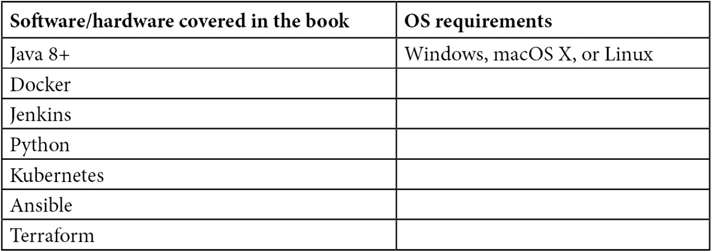

# 序言

*使用 Docker 和 Jenkins 进行持续交付 – 第三版* 解释了结合 Jenkins 和 Docker 的优势，如何改善应用程序开发的持续集成与交付过程。书中从设置 Docker 服务器和配置 Jenkins 开始，接着概述了如何在 Docker 文件上构建应用程序，并通过持续交付流程（如持续集成、自动化验收测试和配置管理）将其与 Jenkins 集成的步骤。

接下来，你将学习如何通过 Docker 容器确保快速部署应用程序，并了解如何扩展 Jenkins 和使用 Kubernetes。之后，你将学习如何使用 Docker 镜像部署应用并通过 Jenkins 进行测试。最后，本书将涉及持续交付管道中缺失的部分，包括环境和基础设施、应用版本管理以及非功能性测试。

到本书结束时，你将了解如何通过将 Docker 和 Jenkins 的功能集成来增强 DevOps 工作流。

# 本书的目标读者

本书面向 DevOps 工程师、系统管理员、Docker 专业人士或任何希望探索如何将 Docker 和 Jenkins 结合使用的相关人员。

# 本书内容

*第一章*，*介绍持续交付*，展示了传统交付过程中的陷阱，并描述了包括亚马逊和雅虎在内的成功案例。

*第二章*，*介绍 Docker*，简要介绍了 Docker 及其容器化概念，并阐述了使用该平台运行应用程序和服务的好处。此外，本章还会逐步描述如何在本地机器或运行 Linux 的服务器上设置 Docker 社区版，并检查 Docker 是否正常运行。

*第三章*，*配置 Jenkins*，介绍了 Jenkins 工具、其架构，以及如何在 Docker 服务器上安装 master/agent 实例，无论是使用 Docker 还是 Kubernetes。接着，我们将探讨如何扩展代理。最后，你将获得一个可用的 Jenkins 实例，准备与源代码存储库服务集成并构建应用程序。

*第四章*，*持续集成管道*，描述了经典的持续集成管道包含三个步骤：检出、构建和单元测试。在本章中，你将学习如何使用 Jenkins 构建这个管道，并了解应该考虑的其他步骤（如代码覆盖率和静态代码分析）。

*第五章*，*自动化验收测试*，解释了在发布应用程序之前，您需要通过运行自动化验收测试确保整个系统按预期工作。通常，应用程序会连接到数据库、缓存、消息传递和其他需要运行其他服务的工具。这就是为什么在开始测试套件之前，必须设置并准备好整个环境的原因。在本章中，您将学习 Docker Registry 的概念，以及如何构建由不同组件组成的系统，这些组件作为 Docker 容器运行。

*第六章*，*使用 Kubernetes 进行集群管理*，解释了如何使用 Docker 工具扩展到多个团队和项目。在本章中，您将接触到 Kubernetes，并学习如何在持续交付过程中使用它。

*第七章*，*使用 Ansible 进行配置管理*，描述了当您扩展了服务器之后，如何在生产环境中部署您的应用程序。在本章中，您将学习如何使用配置管理工具（如 Chef 和 Ansible）在 Docker 生产服务器上发布应用程序。此外，您还将学习基础设施即代码的方法以及 Terraform 工具的使用。

*第八章*，*持续交付管道*，重点讲解最终管道中缺失的部分，包括环境和基础设施、应用版本控制以及非功能性测试。完成这一章后，完整的持续交付管道将准备就绪。

*第九章*，*高级持续交付*，解释了在构建完整的管道后，如何处理更具挑战性的现实场景。从并行化管道任务开始，我们将展示如何回滚到先前的版本，如何运行性能测试，如何处理数据库变更，以及如何处理遗留系统和手动测试。

*最佳实践*，本章包括贯穿全书的最佳实践。

# 为了最大程度地利用本书

Docker 需要 64 位 Linux 操作系统。本书中的所有示例都使用了 Ubuntu 20.04 开发，但任何其他内核版本为 3.10 或以上的 Linux 系统都可以使用。



# 下载彩色图片

我们还提供了一份 PDF 文件，其中包含本书中使用的截图/图表的彩色图片。您可以在这里下载：[`static.packt-cdn.com/downloads/9781803237480_ColorImages.pdf`](https://static.packt-cdn.com/downloads/9781803237480_ColorImages.pdf)。

# 《Code in Action》

本书的《Code in Action》视频可以在[`bit.ly/3NSEPNA`](https://bit.ly/3NSEPNA)观看。

# 下载示例代码文件

您可以从 GitHub 下载本书的示例代码文件，链接在[`github.com/PacktPublishing/Continuous-Delivery-With-Docker-and-Jenkins-3rd-Edition`](https://github.com/PacktPublishing/Continuous-Delivery-With-Docker-and-Jenkins-3rd-Edition)。如果代码有更新，将会在现有的 GitHub 仓库中进行更新。

我们还提供其他来自我们丰富书籍和视频目录的代码包，您可以在[`github.com/PacktPublishing/`](https://github.com/PacktPublishing/)找到。赶快去看看吧！

# 使用的约定

本书中使用了一些文本约定。

`文本中的代码`：表示文本中的代码词汇、数据库表名、文件夹名、文件名、文件扩展名、路径名、虚拟网址、用户输入以及 Twitter 账户名。例如： "我们可以创建一个新的管道，叫做`calculator`，并将代码放入名为`Checkout`的阶段作为管道脚本。"

一段代码如下设置：

```
pipeline {
     agent any
     stages {
          stage("Checkout") {
               steps {
                    git url: 'https://github.com/leszko/calculator.git', branch: 'main'
               }
          }
     }
}
```

所有命令行输入或输出如下所示：

```
$ sudo apt-get update
```

**粗体**：表示新术语、重要词汇或在屏幕上看到的文字。例如，菜单或对话框中的词汇在文本中会这样显示。以下是一个例子：“选择**Gradle 项目**而不是**Maven 项目**（如果您更喜欢 Maven，也可以选择它）。”

小贴士或重要提示

这样显示。

# 与我们联系

我们始终欢迎读者的反馈。

`customercare@packtpub.com`。

**勘误表**：尽管我们已经尽力确保内容的准确性，但错误还是会发生。如果您在本书中发现错误，我们将非常感激您向我们报告。请访问[www.packtpub.com/support/errata](http://www.packtpub.com/support/errata)，选择您的书籍，点击“勘误表提交表格”链接，并输入详细信息。

`copyright@packt.com` 并附有材料的链接。

**如果您有兴趣成为作者**：如果您在某个领域有专业知识并且有意撰写或参与编写一本书，请访问[authors.packtpub.com](http://authors.packtpub.com)。

# 分享您的想法

阅读完*《使用 Docker 和 Jenkins 实现持续交付》*后，我们希望听到您的想法！请[点击这里直接前往 Amazon 评价页面](https://packt.link/r/1803237481)并分享您的反馈。

您的评价对我们以及技术社区非常重要，将帮助我们确保提供卓越的内容质量。
