# 第三章：配置 Jenkins

要启动任何持续交付过程，我们需要一个自动化服务器，如 Jenkins。然而，配置 Jenkins 可能很困难，尤其是当分配给它的任务随着时间增加时。更重要的是，由于 Docker 允许动态提供 Jenkins 代理，那么值得花时间在前期将所有内容配置正确，以便考虑到可扩展性吗？

在本章中，我们将介绍 Jenkins，它可以单独使用，也可以与 Docker 一起使用。我们将展示这两种工具的结合能够产生令人惊讶的好效果——自动化配置和灵活的可扩展性。

本章将涵盖以下主题：

+   什么是 Jenkins？

+   安装 Jenkins

+   Jenkins – Hello World

+   Jenkins 架构

+   配置代理

+   自定义 Jenkins 镜像

+   配置与管理

# 技术要求

为了跟随本章的指导，您需要以下硬件/软件：

+   Java 8 及以上版本

+   至少 4 GB 的内存

+   至少 1 GB 的空闲磁盘空间

+   已安装 Docker 引擎

本章中的所有示例和练习解答可以在 GitHub 上找到，地址为 [`github.com/PacktPublishing/Continuous-Delivery-With-Docker-and-Jenkins-3rd-Edition/tree/main/Chapter03`](https://github.com/PacktPublishing/Continuous-Delivery-With-Docker-and-Jenkins-3rd-Edition/tree/main/Chapter03)。

本章的《Code in Action》视频可以在[`bit.ly/3DP02TW`](https://bit.ly/3DP02TW)观看。

# 什么是 Jenkins？

Jenkins 是一个用 Java 编写的开源自动化服务器。它拥有非常活跃的社区支持和大量插件，是实现持续集成和持续交付流程最流行的工具之一。曾被称为 **Hudson**，在 Oracle 收购 Hudson 并决定将其开发为专有软件后，Jenkins 被更名。Jenkins 从 Hudson 分叉，但仍然作为 MIT 许可证下的开源软件。由于其简单性、灵活性和多功能性，它备受推崇。

Jenkins 超越了其他持续集成工具，是最广泛使用的同类软件。这一切都得益于它的功能和能力。

让我们深入了解 Jenkins 特性中最有趣的部分：

+   **语言无关**：Jenkins 有很多插件，支持大多数编程语言和框架。此外，由于它可以使用任何 shell 命令和任何软件，因此适用于所有可想象的自动化流程。

+   **通过插件可扩展**：Jenkins 拥有一个强大的社区和大量可用的插件（超过千个）。它还允许你编写自己的插件，以便根据你的需求定制 Jenkins。

+   **可移植**：Jenkins 是用 Java 编写的，因此可以在任何操作系统上运行。为了方便，它也提供了多种版本——**Web 应用程序归档**（**WAR**）文件、Docker 镜像、Helm 图表、Kubernetes 操作符、Windows 二进制文件、macOS 二进制文件和 Linux 二进制文件。

+   **支持大多数源代码管理（SCM）工具**：Jenkins 几乎与所有存在的源代码管理或构建工具集成。由于其庞大的社区和大量插件，没有其他持续集成工具能支持如此多的外部系统。

+   **分布式**：Jenkins 具有内置的主机/代理模式机制，将其执行分布到多个节点，位于多台机器上。它还可以使用异构环境；例如，不同的节点可以安装不同的操作系统。

+   **简便性**：安装和配置过程简单。无需配置任何额外的软件或数据库。可以通过 GUI、XML 或 Groovy 脚本完全配置。

+   **面向代码**：Jenkins 流水线定义为代码。此外，Jenkins 本身可以通过 YAML/XML 文件或 Groovy 脚本进行配置。这使你能够将配置保存在源代码仓库中，并有助于 Jenkins 配置的自动化。

现在你已经对 Jenkins 有了基本的了解，接下来我们来讲解如何安装它。

# 安装 Jenkins

安装 Jenkins 有不同的方法，你应选择最适合你需求的方法。接下来，我们将介绍所有可选方法，并详细描述最常见的选择：

+   **Servlet**：Jenkins 使用 Java 编写，并以 WAR 格式作为 Web 应用程序原生分发，专门运行在应用服务器中（如 Apache Tomcat 或 GlassFish）；如果你将所有应用程序部署为 servlet，可以考虑此选项。

+   **应用程序**：Jenkins 的 WAR 文件内嵌了 Jetty 应用服务器，因此可以直接使用 Java 命令运行，因此，**Java 运行时环境**（**JRE**）是启动 Jenkins 的唯一要求；如果你使用裸机服务器和/或需要在一台机器上安装多个 Jenkins 实例，可以考虑此选项。

+   **专用包**：Jenkins 以专用包的形式为大多数操作系统分发（Windows 的 MSI、macOS 的 Homebrew 包、Debian/Ubuntu 的 deb 包等）；如果你使用裸机服务器，考虑此选项以便进行最简单的安装和配置。

+   **Docker**：Jenkins 以 Docker 镜像的形式分发，因此唯一的要求是安装 Docker；如果你在生态系统中使用 Docker，考虑此选项以获得最简单的安装。

+   **Kubernetes**：Jenkins 提供了 Helm 图表和 Kubernetes 操作符，简化了在 Kubernetes 集群中的安装、管理和扩展；如果你需要最简单的 Jenkins 扩展和管理，考虑使用此选项。

+   **云服务**：Jenkins 作为**软件即服务**（**SaaS**）由多个平台托管；如果你不想考虑服务器维护和 Jenkins 安装，考虑使用此选项。

每种安装方式都有其优缺点。我们将描述最常见的方法，从使用 Jenkins Docker 镜像开始。

信息

您可以在 [`www.jenkins.io/doc/book/installing/`](https://www.jenkins.io/doc/book/installing/) 上找到每种安装方法的详细描述。

## 使用 Docker 安装 Jenkins

Jenkins 镜像在 Docker Hub 仓库中可用，因此为了安装其最新版本，我们应该执行以下命令：

```
$ docker run -p <host_port>:8080 -v <host_volume>:/var/jenkins_home jenkins/jenkins
```

我们需要指定以下参数：

+   第一个 `host_port` 参数：Jenkins 在容器外部可见的端口。

+   第二个 `host_volume` 参数：它指定了 Jenkins 主目录的映射目录。需要将其指定为卷，以便永久保存，因为它包含了配置、流水线构建和日志。

作为示例，我们按照以下安装步骤进行：

1.  **准备存储卷目录**：我们需要一个单独的目录来存储 Jenkins 数据。让我们使用以下命令来准备它：

    ```
    $ mkdir $HOME/jenkins_home
    ```

1.  **运行 Jenkins 容器**：让我们以守护进程的方式运行容器，并使用以下命令为其指定一个合适的名称：

    ```
    $ docker run -d -p 8080:8080 \
    -v $HOME/jenkins_home:/var/jenkins_home \ 
      --name jenkins jenkins/jenkins
    ```

1.  **检查 Jenkins 是否正在运行**：过一会儿，我们可以通过打印日志来检查 Jenkins 是否已正确启动：

    ```
    $ docker logs jenkins
    Running from: /usr/share/jenkins/jenkins.war
    webroot: EnvVars.masterEnvVars.get("JENKINS_HOME")
    ...
    ```

    信息

    在生产环境中，您可能还需要设置一些额外的参数；有关详细信息，请参考 [`www.jenkins.io/doc/book/installing/docker/`](https://www.jenkins.io/doc/book/installing/docker/)。

完成这些步骤后，您可以通过 `http://localhost:8080/` 访问您的 Jenkins 实例。

## 使用专用安装包安装 Jenkins

如果您的服务器上没有使用 Docker，那么最简单的方法是使用专用的安装包。Jenkins 支持大多数操作系统——例如，Windows 的 MSI、macOS 的 Homebrew 包以及 Debian/Ubuntu 的 deb 包。

作为示例，在 Ubuntu 系统中，只需运行以下命令即可安装 Jenkins（以及所需的 Java 依赖）：

```
$ sudo apt-get update
$ sudo apt-get -y install default-jdk
$ wget -q -O - https://pkg.jenkins.io/debian/jenkins.io.key | sudo apt-key add –
$ sudo sh -c 'echo deb http://pkg.jenkins.io/debian-stable binary/ > /etc/apt/sources.list.d/jenkins.list'
$ sudo apt-get update
$ sudo apt-get -y install jenkins
```

安装成功后，可以通过 `http://localhost:8080/` 访问 Jenkins 实例。

## 初始配置

无论您选择哪种安装方式，启动 Jenkins 都需要几个配置步骤。让我们一步步地走过这些步骤：

1.  在浏览器中打开 Jenkins，地址为 `http://localhost:8080`。

1.  Jenkins 会要求输入管理员密码。可以在 Jenkins 日志中找到该密码：

    ```
    $ docker logs jenkins
    ...
    Jenkins initial setup is required. An admin user has been 
    created 
    and a password generated.
    Please use the following password to proceed to installation:
    c50508effc6843a1a7b06f6491ed0ca6
    ...
    ```

1.  在接受初始密码后，Jenkins 会询问是否安装建议的插件，这些插件是针对最常见的用例进行调整的。您的回答当然取决于您的需求。不过，作为第一次安装 Jenkins，允许 Jenkins 安装所有推荐插件是合理的选择。

1.  插件安装完成后，Jenkins 会要求您设置用户名、密码以及其他基本信息。如果跳过此步骤，将使用 *步骤 2* 中的令牌作为管理员密码。

安装完成后，你应该会看到 **Jenkins** 仪表盘：

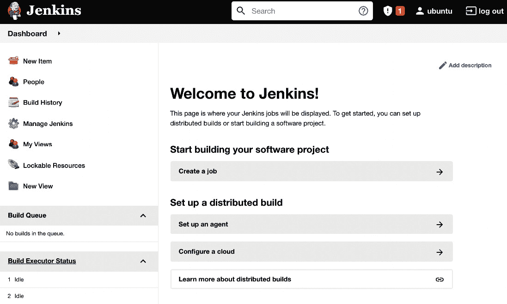

图 3.1 – 成功安装 Jenkins

现在，让我们看看如何在 Kubernetes 集群环境中安装 Jenkins。

## 在 Kubernetes 中安装 Jenkins

在 Kubernetes 中安装 Jenkins 有两种方法——使用 Helm 图表或 Kubernetes 操作员。我们先来看一个更简单的选项，即使用 Helm 工具。

提示

有关 Helm 工具及其安装过程的更多详细信息，请访问 [`helm.sh/`](https://helm.sh/)。

使用以下命令安装 Jenkins：

```
$ helm repo add jenkinsci https://charts.jenkins.io
$ helm repo update
$ helm install jenkins jenkinsci/jenkins
```

执行前面的命令后，Jenkins 已安装。你可以使用以下命令检查其日志：

```
$ kubectl logs sts/jenkins jenkins
Running from: /usr/share/jenkins/jenkins.war
...
```

默认情况下，Jenkins 实例配置了一个管理员账户，并通过随机生成的密码进行保护。要查看此密码，请执行以下命令：

```
$ kubectl get secret jenkins -o jsonpath="{.data.jenkins-admin-password}" | base64 --decode
nn1Pvq7asHPYz7EUHhc4PH
```

现在，你将能够使用以下凭据登录 Jenkins：

+   `admin`

+   `nn1Pvq7asHPYz7EUHhc4PH`

默认情况下，Jenkins 不会暴露在 Kubernetes 集群外部。要使其能够从本地计算机访问，请运行以下命令：

```
$ kubectl port-forward sts/jenkins 8080:8080
```

之后，你可以在浏览器中打开 `http://localhost:8080/`，并使用前述凭据登录。

信息

请访问 [`www.jenkins.io/doc/book/installing/kubernetes/`](https://www.jenkins.io/doc/book/installing/kubernetes/) 以获取有关在 Kubernetes 中安装 Jenkins 的更多信息。

将 Jenkins 安装在 Kubernetes 集群中的最大好处之一是，它提供了开箱即用的水平扩展功能。Jenkins 代理通过 Jenkins 的 Kubernetes 插件自动配置。

我们将在 *Jenkins 架构* 部分中讲解如何扩展 Jenkins，并在 *第六章* 中讲解更多 Kubernetes 相关内容，*与 Kubernetes 集群协作*。现在，让我们看看如何在云中使用 Jenkins。

## 云中的 Jenkins

如果你不想自己安装 Jenkins，有一些公司提供托管在云中的 Jenkins 服务。不过需要注意的是，Jenkins 从未采用云优先的方法设计，因此大多数提供的服务实际上是通用的云解决方案，旨在帮助你安装和管理 Jenkins 应用程序。

我推荐的解决方案是 Google Cloud Marketplace，它可以在 Google Kubernetes Engine 中自动部署 Jenkins。详细信息请参见 [`cloud.google.com/jenkins`](https://cloud.google.com/jenkins)。其他提供托管 Jenkins 服务的公司包括 Kamatera 和 Servana。

当我们终于启动并运行 Jenkins 后，我们就准备创建我们的第一个 Jenkins 管道。

# Jenkins – Hello World

在整个 IT 世界中，一切都从 `Hello World` 示例开始，来证明基本功能正常。让我们遵循这一规则，并用它来创建第一个 Jenkins 管道：

1.  点击 **新建项目**：

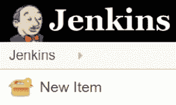

图 3.2 – Jenkins Web 界面中的新项目

1.  在“项目名称”字段中输入`hello world`，选择**管道**，然后点击**确定**：

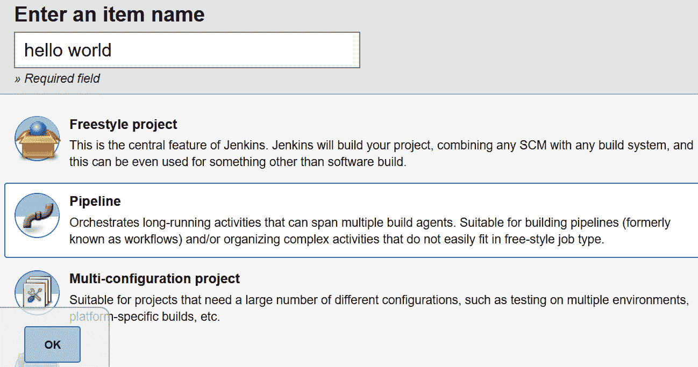

图 3.3 – Jenkins Web 界面中的新管道

1.  有很多选项。我们现在先跳过这些，直接进入**管道**部分：

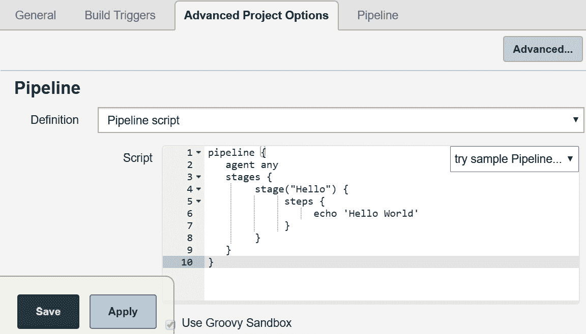

图 3.4 – Jenkins Web 界面的管道脚本

1.  然后，在**脚本**文本框中，我们可以输入管道脚本：

    ```
    pipeline {
         agent any
         stages {
              stage("Hello") {
                   steps {
                        echo 'Hello World'
                   }
              }
         }
    }
    ```

1.  点击**保存**。

1.  点击**立即构建**：


图 3.5 – Jenkins Web 界面的立即构建

我们应该在**构建历史**下看到**#1**。如果点击它，然后点击**控制台输出**，我们将看到管道构建的日志：

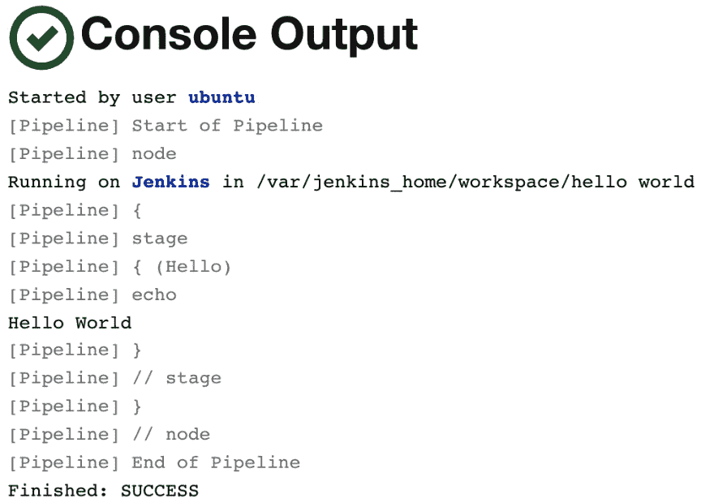

图 3.6 – Jenkins Web 界面的控制台输出

第一个示例中的成功输出意味着 Jenkins 已正确安装。现在，让我们看看可能的 Jenkins 架构。

信息

我们将在*第四章*中详细描述更多关于管道语法的内容，*持续集成管道*。

# Jenkins 架构

Hello World 几乎立即执行完毕。然而，管道通常更复杂，时间花费在下载文件、编译源代码或运行测试等任务上。一次构建可能需要几分钟到几个小时。

在常见的场景中，也会有许多并发管道。通常，一个团队，甚至一个整个组织，都会使用同一个 Jenkins 实例。*我们如何确保构建能够快速且顺利地运行呢？*

## 主服务器和代理

Jenkins 的负载很快就会超载。即使是一个小型（微型）服务，构建也可能需要几分钟。这意味着，一个团队频繁提交代码很容易导致 Jenkins 实例崩溃。

因此，除非项目非常小，否则 Jenkins 不应执行构建任务，而应将它们委派给代理（从）实例。准确来说，我们当前运行的 Jenkins 服务器叫做**Jenkins 主服务器**，它可以将执行任务委派给**Jenkins 代理**。

让我们看看一个展示主从交互的图表：

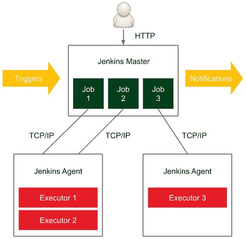

图 3.7 – Jenkins 主从交互

在分布式构建环境中，Jenkins 主服务器负责以下任务：

+   接收构建触发（例如，GitHub 提交后）

+   发送通知（例如，构建失败后发送电子邮件或 Slack 消息）

+   处理 HTTP 请求（与客户端的交互）

+   管理构建环境（协调代理上的作业执行）

构建代理是负责处理构建启动后所有事务的机器。

由于主节点和代理的职责不同，因此它们有不同的环境要求：

+   **主节点**：通常这是（除非项目非常小）一台专用机器，内存从小项目的 200 MB 到大型单主节点项目的 70+ GB 不等。

+   **代理**：没有特别的通用要求（除了它应该能够执行单次构建；例如，如果项目是一个庞大的单体项目，需要 100 GB 的内存，那么代理机器需要满足这些需求）。

代理应尽可能通用。例如，如果我们有不同的项目——一个是 Java 项目，一个是 Python 项目，还有一个是 Ruby 项目——那么最好每个代理都能构建这些项目中的任何一个。这样，代理可以互换，有助于优化资源的使用。

提示

如果代理无法通用到所有项目，那么可以对代理和项目进行标记（标签），以确保给定的构建会在指定类型的代理上执行。

## 可扩展性

正如软件世界中的一切一样，随着使用量的增加，Jenkins 实例可能会迅速变得过载并变得无法响应。因此，我们需要提前考虑如何扩展它。有两种可能的方法——**垂直扩展** 和 **横向扩展**。

### 垂直扩展

垂直扩展意味着，当主节点的负载增加时，会向主节点的机器添加更多资源。所以，当我们的组织中出现新项目时，我们会购买更多的内存、添加更多的 CPU 核心，扩展硬盘驱动器。这可能听起来像是一种不可行的解决方案；然而，许多知名的组织经常使用这种方法。将一个 Jenkins 主节点设置在超高效的硬件上有一个非常强大的优势——维护。任何升级、脚本、安全设置、角色分配或插件安装都必须在一个地方完成。

### 横向扩展

横向扩展意味着，当组织增长时，会启动更多的主实例。这需要智能地将实例分配给团队，在极端情况下，每个团队可以拥有自己的 Jenkins 主节点。这样可能会出现不需要代理的情况。

缺点是，可能很难实现跨项目的集成自动化，而且团队的一部分开发时间会花在 Jenkins 的维护上。然而，横向扩展有一些显著的优势：

+   主机硬件不需要特殊。

+   不同的团队可以拥有不同的 Jenkins 设置（例如，不同的插件集）。

+   如果实例属于自己的团队，团队通常会感觉更好，使用 Jenkins 的效率也更高。

+   如果一个主节点实例宕机，它不会影响整个组织。

+   基础设施可以分为标准和关键任务两类。

## 测试与生产实例

除了扩展方法外，还有一个问题——*如何测试 Jenkins 的升级、新插件或管道定义。* Jenkins 对整个公司至关重要。它保证软件的质量，并且在持续交付的情况下，将软件部署到生产服务器上。这就是为什么它需要具备高可用性，并且绝对不能用作测试目的。因此，应该始终有两套相同的 Jenkins 基础设施——**测试**和**生产**。

## 示例架构

我们已经知道应该有代理和（可能多个）主节点，并且一切都应该在测试和生产环境中进行复制。然而，*完整的架构是什么样的呢？*

幸运的是，很多公司已经发布了他们如何使用 Jenkins 以及他们创建了什么样的架构。虽然很难衡量更多的公司倾向于使用垂直扩展还是水平扩展，但从只有一个主节点实例到每个团队都有一个主节点实例都有涉及。

让我们以 Netflix 为例，了解一个完整的 Jenkins 基础设施（Netflix 在 2012 年在旧金山的 Jenkins 用户大会上分享了这个**计划中的基础设施**）：

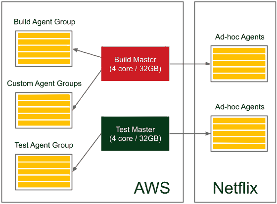

图 3.8 – Netflix 的 Jenkins 基础设施

他们有测试和生产环境的主节点实例，每个主节点都有一组代理和额外的临时代理。总的来说，它每天处理约 2000 个构建任务。另外，需要注意的是，他们的部分基础设施托管在 AWS 上，另一部分则托管在自有服务器上。

你应该已经对 Jenkins 基础设施的可能样式有了大致的了解，具体取决于组织的类型。

现在，让我们关注设置代理的实际操作部分。

# 配置代理

你已经了解了代理是什么以及它们何时可以使用。然而，*我们如何设置一个代理，并使其与主节点进行通信呢？*让我们从问题的第二部分开始，描述主节点和代理之间的通信协议。

## 通信协议

为了使主节点和代理之间能够通信，必须建立双向连接。

启动 Jenkins 的方式有多种选择：

+   **SSH**：主节点通过标准的 SSH 协议连接到代理。Jenkins 内置了 SSH 客户端，因此唯一的要求是代理上需要配置**SSH 守护进程**（**sshd**）服务器。这是最方便和稳定的方法，因为它使用了标准的 Unix 机制。

+   **Java Web 启动**：在每个代理机器上启动一个 Java 应用程序，并在 Jenkins 代理应用程序与主节点 Java 应用程序之间建立 TCP 连接。如果代理在防火墙内，而主节点无法发起连接，则通常使用此方法。

一旦我们了解了通信协议，就可以看看如何使用这些协议来设置代理。

## 设置代理

在较低级别上，代理总是通过前面描述的协议之一与 Jenkins 主节点通信。然而，在更高级别上，我们可以以不同的方式将代理附加到主节点。差异涉及两个方面：

+   **静态与动态**：最简单的选项是在 Jenkins 主节点中永久添加代理。此解决方案的缺点是，如果需要更多（或更少）代理节点，我们总是需要手动更改一些内容。一个更好的选择是根据需要动态配置代理。

+   **特定用途与通用用途**：代理可以是特定用途的（例如，为基于 Java 8 和 Java 11 的项目提供不同的代理），也可以是通用用途的（代理作为 Docker 主机，管道在 Docker 容器内构建）。

这些差异导致了四种常见的代理配置策略：

+   永久代理

+   永久 Docker 主机代理

+   Jenkins Swarm 代理

+   动态配置的 Docker 代理

+   动态配置的 Kubernetes 代理

让我们检查每个解决方案。

### 永久代理

我们将从最简单的选项开始，即永久添加特定的代理节点。可以通过 Jenkins Web 界面完全完成这一操作。

#### 配置永久代理

在 Jenkins 主节点中，当我们打开**管理 Jenkins**，然后点击**管理节点和云**时，可以查看所有连接的代理。接着，通过点击**新建节点**，给它命名，设置其类型为**永久代理**，并点击**创建**按钮，最终我们应该能看到代理的设置页面：

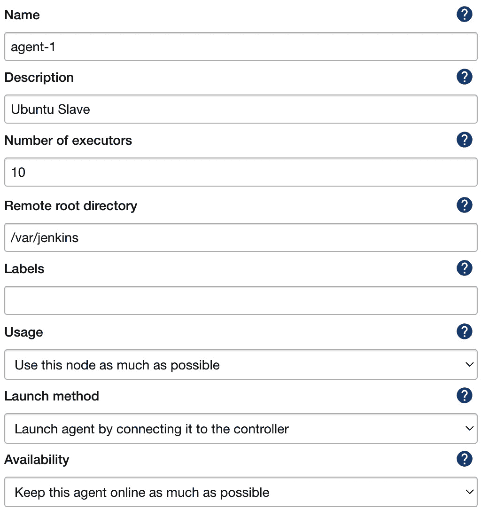

图 3.9 – 永久代理配置

让我们逐步了解需要填写的参数：

+   **名称**：这是代理的唯一名称。

+   **描述**：这是代理的可读描述。

+   **执行器数量**：这是可以在代理上并行运行的构建数量。

+   `/var/jenkins`）；最重要的数据会传回到主节点，所以该目录并非关键。

+   **标签**：这包括匹配特定构建的标签（标签相同）——例如，仅基于 Java 8 的项目。

+   **使用情况**：这是用来决定代理是否仅用于匹配标签的选项（例如，仅用于验收测试构建），还是用于任何构建。

+   `ssh <agent_hostname> java -jar ~/bin/slave.jar`）。

+   **通过 SSH 启动代理**：在这里，主节点将通过 SSH 协议连接到代理。

+   `50000` 用于与 Jenkins 主节点通信；因此，如果使用基于 Docker 的 Jenkins 主节点，则需要发布该端口（`-p 50000:50000`）。

当代理正确设置时，可以通过`0`更新主节点的内置配置，这样就不会在其上执行构建，它将仅作为 Jenkins UI 和构建的协调器。

信息

想了解更多详细信息和逐步说明如何配置永久性 Jenkins 代理，请访问 [`www.jenkins.io/doc/book/using/using-agents/`](https://www.jenkins.io/doc/book/using/using-agents/)。

#### 理解永久代理

正如我们之前提到的，**缺点**是我们需要为不同的项目类型维护多个代理类型（标签）。下图展示了这种情况：

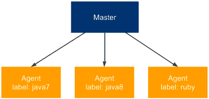

图 3.10 – 永久代理

在我们的示例中，如果我们有三种类型的项目（**java7**、**java8** 和 **ruby**），那么我们需要维护三个单独标记的（代理集）。这与我们在维护多个生产服务器类型时遇到的问题相同，正如在*第二章*《引入 Docker》中所描述的那样。我们通过在生产服务器上安装 Docker 引擎来解决了这个问题。让我们尝试用同样的方式来处理 Jenkins 代理。

### 永久性 Docker 主机代理

这个解决方案背后的想法是**永久**地添加通用代理。每个代理的配置是**相同**的（都安装了 Docker 引擎），并且每次构建都与 Docker 镜像一起定义，构建就在该镜像内运行。

#### 配置永久性 Docker 主机代理

配置是静态的，因此与我们为永久代理所做的完全相同。唯一的区别是，我们需要在每台将用作代理的机器上安装 Docker。然后，通常我们不需要标签，因为所有代理都可以是相同的。代理配置完成后，我们在每个流水线脚本中定义 Docker 镜像：

```
pipeline {
     agent {
          docker {
               image 'openjdk:8-jdk-alpine'
          }
     }
     ...
}
```

当构建开始时，Jenkins 代理从 Docker 镜像 `openjdk:8-jdk-alpine` 启动一个容器，然后在该容器内执行所有的流水线步骤。通过这种方式，我们总是能够知道执行环境，并且不需要根据特定的项目类型单独配置每个代理。

#### 理解永久性 Docker 主机代理

看着我们为**永久**代理使用的相同场景，图示如下：

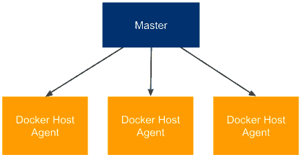

图 3.11 – 永久性 Docker 主机代理

每个代理完全相同，如果我们想构建一个依赖于 Java 8 的项目，那么我们将在流水线脚本中定义适当的 Docker 镜像（而不是指定代理标签）。

### Jenkins Swarm 代理

到目前为止，我们**总是**需要在 Jenkins 主服务器中永久定义每个代理。这样的解决方案，尽管在许多情况下足够好，但如果我们需要频繁扩展代理机器的数量，可能会成为负担。Jenkins Swarm 允许你动态添加代理，而无需在 Jenkins 主服务器中配置它们。

#### 配置 Jenkins Swarm 代理

使用 Jenkins Swarm 的第一步是在 Jenkins 中安装 **Swarm** 插件。我们可以通过 Jenkins 网页 UI 完成此操作，进入 **管理 Jenkins** 和 **管理插件**。完成此步骤后，Jenkins 主节点已准备好动态附加 Jenkins 代理。

第二步是在每台将作为 Jenkins 代理的机器上运行 Jenkins Swarm 代理应用程序。我们可以使用 `swarm-client.jar` 应用程序来完成此操作。

信息

`swarm-client.jar` 应用程序可以从 Jenkins Swarm 插件页面下载，网址为 [`plugins.jenkins.io/swarm/`](https://plugins.jenkins.io/swarm/)。在该页面，你还可以找到所有可能的执行选项。

要附加 Jenkins Swarm 代理节点，运行以下命令：

```
$ java -jar path/to/swarm-client.jar -url ${JENKINS_URL} -username ${USERNAME}
```

执行成功后，我们应该注意到 Jenkins 主节点上出现了一个新代理，当我们运行构建时，它将在该代理上启动。

#### 了解 Jenkins Swarm 代理

让我们看一下以下图示，展示了 Jenkins Swarm 配置：

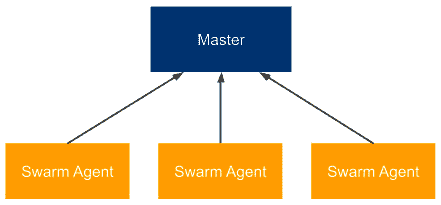

图 3.12 – Jenkins Swarm 代理

Jenkins Swarm 允许你动态添加代理，但并未说明是否使用特定的或基于 Docker 的代理，因此我们可以两者都用。乍一看，Jenkins Swarm 似乎没什么用，毕竟我们已将代理设置从主节点移到代理节点，但仍然需要手动操作。然而，借助 Kubernetes 或 Docker Swarm 等集群系统，Jenkins Swarm 显然使得在服务器集群上动态扩展代理成为可能。

### 动态分配的 Docker 代理

另一种选择是设置 Jenkins，在每次启动构建时动态创建一个新的代理。这种解决方案显然是最灵活的，因为代理的数量会根据构建的数量动态调整。让我们来看看如何以这种方式配置 Jenkins。

#### 配置动态分配的 Docker 代理

首先，我们需要安装 **Docker** 插件。像往常一样，我们可以在 **管理 Jenkins** 和 **管理插件** 中完成此操作。插件安装后，我们可以开始以下配置步骤：

1.  打开 **管理 Jenkins** 页面。

1.  点击 **管理节点和云** 链接。

1.  点击 **配置云** 链接。

1.  点击 **添加新云** 并选择 **Docker**。

1.  填写 Docker 代理的详细信息，如下图所示：


图 3.13 – Docker 代理配置

1.  大多数参数无需更改；但是（除了选择 `docker0` 网络接口外，你可以按照在 *第二章* *介绍 Docker* 部分中描述的方法，修改 `/lib/systemd/system/docker.service` 文件中的一行，将 `ExecStart` 设置为 `/usr/bin/dockerd -H 0.0.0.0:2375 -H fd://`）。

1.  点击 **Docker 代理模板...** 然后选择 **添加 Docker 模板**。

1.  填写有关 Docker 代理镜像的详细信息：

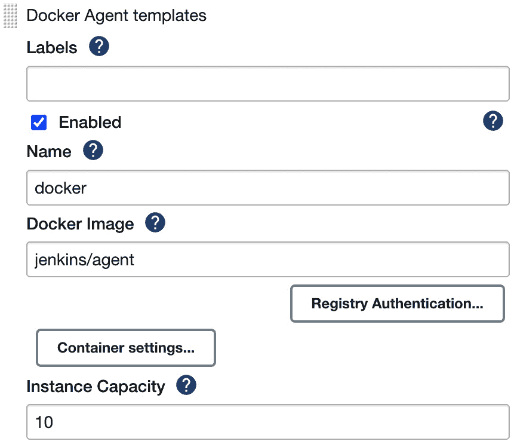

图 3.14 – Docker 代理模板配置

我们可以使用以下参数：

+   `jenkins/agent`（用于默认连接方式，即**附加 Docker 容器**）。

+   `10`。

    信息

    除了 `jenkins/agent`，还可以构建并使用自己的代理镜像。这在特定环境要求的情况下可能会很有帮助——例如，你需要安装 Golang。还需注意，对于其他代理连接方法（`jenkins/ssh-agent` 或 `jenkins/inbound-agent`），详情请查看 [`plugins.jenkins.io/docker-plugin/`](https://plugins.jenkins.io/docker-plugin/)。

保存后，所有配置将完成。我们可以运行管道以观察执行是否确实发生在 Docker 代理上，但首先，让我们更深入地了解 Docker 代理是如何工作的。

#### 理解动态提供的 Docker 代理

动态提供的 Docker 代理可以视为标准代理机制之上的一层。它既不改变通信协议，也不改变代理的创建方式。那么，*Jenkins 对我们提供的 Docker 代理配置做了什么？*

以下图示展示了我们配置的 Docker 主从架构：

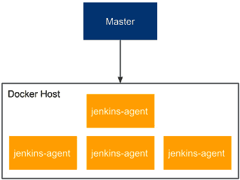

图 3.15 – 动态提供的 Docker 代理

让我们一步一步描述如何使用 Docker 代理机制：

1.  当 Jenkins 任务启动时，主节点在代理 Docker 主机上从 `jenkins/agent` 镜像运行一个新容器。

1.  `jenkins/agent` 容器启动 Jenkins 代理并将其附加到 Jenkins 主节点的节点池中。

1.  Jenkins 在 `jenkins/agent` 容器内执行管道。

1.  构建完成后，主节点停止并移除代理容器。

    信息

    将 Jenkins 主节点作为 Docker 容器运行与将 Jenkins 代理作为 Docker 容器运行是相互独立的。两者可以同时进行，但它们各自独立工作。

这个解决方案在某种程度上类似于永久 Docker 代理解决方案，因为最终我们是在 Docker 容器内运行构建。然而，区别在于代理节点配置。这里，整个代理都是 Docker 化的——不仅仅是构建环境。

提示

Jenkins 构建通常需要下载大量的项目依赖（例如，Gradle/Maven 依赖），这可能需要很长时间。如果为每次构建自动提供 Docker 代理，那么为它们设置 Docker 卷以便在构建之间启用缓存可能是值得的。

### 动态提供的 Kubernetes 代理

我们可以在 Kubernetes 中动态配置代理，类似于在 Docker 主机上所做的那样。这种方法的好处是，Kubernetes 是一个由多台物理机器组成的集群，可以根据需求轻松扩展或缩减。

#### 配置动态配置的 Kubernetes 代理

首先，我们需要安装**Kubernetes**插件。然后，我们可以按照安装 Docker 代理时的相同步骤进行操作。区别在于，当我们点击**添加一个新云**时，选择的是**Kubernetes**而不是**Docker**，并填写有关 Kubernetes 集群的所有详细信息：

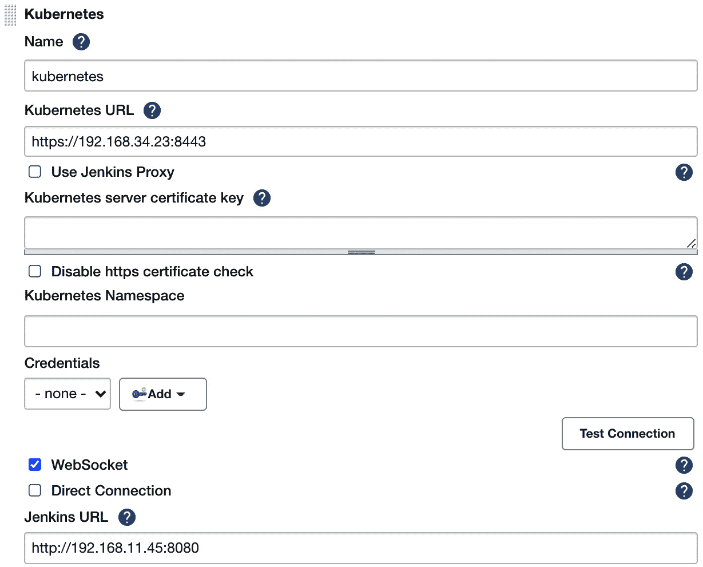

图 3.16 – Kubernetes 代理配置

你需要填写**Kubernetes URL**，即 Kubernetes 集群的地址。通常，你还需要输入 Kubernetes 集群的凭据。然后，你必须点击**添加 Pod 模板**，并按类似于为**Docker**插件中的**Docker 模板**所做的方式填写**Pod 模板**。

信息

关于如何设置 Jenkins Kubernetes 插件的更多详细说明，请访问[`plugins.jenkins.io/kubernetes/`](https://plugins.jenkins.io/kubernetes/)。

配置成功后，当你开始一个新的构建时，Jenkins 会自动在 Kubernetes 中配置一个新的代理，并用于管道执行。

提示

如果你按照本章开始时所述的方式使用 Helm 在 Kubernetes 中安装 Jenkins，它会自动配置 Kubernetes 插件，并自动在与 Jenkins 主服务器部署相同的 Kubernetes 集群中配置 Jenkins 代理。通过一个 Helm 命令，我们就能安装一个功能齐全且可扩展的 Jenkins 生态系统！

#### 了解动态配置的 Kubernetes 代理

在 Kubernetes 中动态配置代理的方式与在 Docker 主机中配置代理非常相似。不同之处在于，现在我们与一群机器交互，而不仅仅是与单个 Docker 主机交互。这种方法在下图中有所展示：

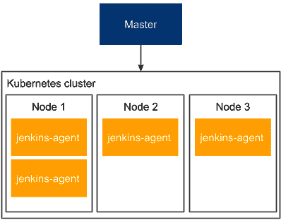

图 3.17 – 动态配置的 Kubernetes 代理

Kubernetes 节点可以动态添加和移除，这使得整个主机-代理架构在所需资源方面非常灵活。当 Jenkins 构建任务过多时，我们可以轻松向 Kubernetes 集群中添加一台新机器，从而提高 Jenkins 的容量。

我们已经介绍了许多不同的策略来配置 Jenkins 代理。接下来，让我们进行配置测试。

## 测试代理

无论你选择了哪种代理配置，现在都可以检查是否一切正常工作。

让我们回到 Hello World 管道。通常，构建过程会比 Hello World 示例持续更长时间，因此我们可以通过在管道脚本中添加`sleeping`来进行模拟：

```
pipeline {
     agent any
     stages {
          stage("Hello") {
               steps {
                    sleep 300 // 5 minutes
                    echo 'Hello World'
               }
          }
     }
}
```

点击 **立即构建** 后，进入 Jenkins 主页面，我们应该能看到构建在代理上执行。如果我们多次点击构建，应该会并行启动多个构建（如下图所示）：

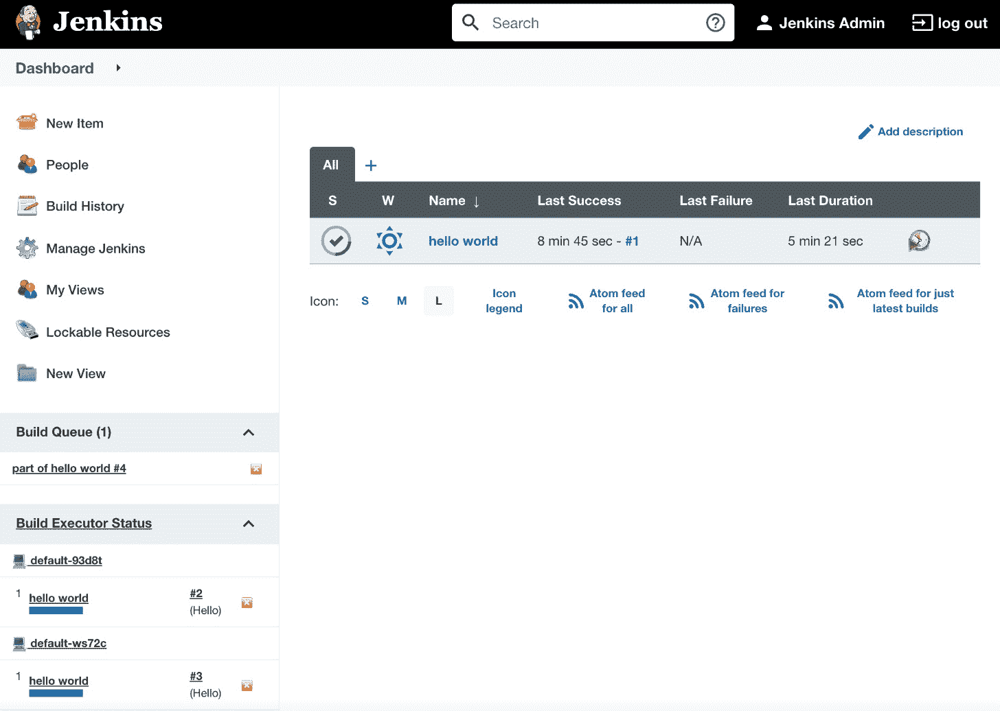

图 3.18 – Jenkins 在 Jenkins 代理上运行多个构建

提示

为了防止在主节点上执行作业，请记得在 **管理节点** 配置中将主节点的设置为 `0`。

既然我们已经看到代理在执行我们的构建，确认它们已经正确配置。接下来，在我们学习如何创建自己的 Jenkins 镜像之前，让我们先澄清一个细节，即 Docker 代理和 Docker 管道构建之间的区别。

## 比较 Docker 管道构建和 Docker 代理

Jenkins 管道构建在两种情况下会在 Docker 容器中执行——永久的 Docker 主机代理和动态配置的 Docker/Kubernetes 代理。然而，这两种解决方案之间有一个微妙的区别，值得澄清一下。

### Docker 管道构建

如果你的代理是 Docker 主机，那么你可以从 Jenkins 用户的角度指定管道的运行时。换句话说，如果你的项目有一些特殊的构建运行时要求，你可以将它们 Docker 化，并按如下方式描述你的管道脚本：

```
agent {
     docker {
          image 'custom-docker-image'
     }
}
```

这种方式意味着从用户的角度来看，你可以自由选择用于构建的 Docker 镜像。而且，你甚至可以决定直接在主机上执行构建，而不是在 Docker 容器中执行，这在管道中的步骤需要 Docker 主机而主机在容器内无法访问时尤为有用。我们将在本书的后续章节中看到这种需求的例子。

### Docker 代理

如果你的代理本身是一个 Docker 容器，那么你需要从 Jenkins 管理员的角度指定使用的 Docker 镜像。在这种情况下，如果你的项目有一些特定的构建运行时要求，你需要做如下操作：

1.  创建一个自定义的 Docker 镜像，使用 `jenkins/agent` 作为基础镜像。

1.  请让 Jenkins 管理员将其包含在 Docker/Kubernetes 插件配置中，并为该代理分配一个特殊标签。

1.  在管道脚本中使用特定的代理标签。

这意味着，对于具有自定义要求的项目，设置稍微复杂一些。

还有一个开放问题：如果你的管道需要访问 Docker 主机，比如构建 Docker 镜像，该怎么办？是否有办法在 Docker 容器内使用 Docker？Docker-in-Docker 就可以解决这个问题。

### Docker-in-Docker

有一个解决方案叫做 **Docker-in-Docker** (**DIND**)，它允许你在 Docker 容器内使用 Docker。技术上，它要求为 Docker 容器授予**特权**权限，并且 Jenkins Docker 插件中有一个相关的配置字段。请注意，允许容器访问 Docker 主机可能会成为潜在的安全隐患，因此在应用此配置之前，务必采取额外的安全措施。

我们已经涵盖了关于 Jenkins 代理配置的所有内容。现在，让我们继续看一下，为什么以及如何创建我们自己的 Jenkins 镜像。

# 自定义 Jenkins 镜像

到目前为止，我们使用的是从互联网拉取的 Jenkins 镜像。我们使用了`jenkins/jenkins`作为主容器镜像，`jenkins/agent`（或`jenkins/inbound-agent`或`jenkins/ssh-agent`）作为代理容器镜像。然而，你可能想要构建自己的镜像，以满足特定构建环境的要求。在本节中，我们将介绍如何操作。

## 构建 Jenkins 代理

让我们从代理镜像开始，因为它是最常定制的。构建执行发生在代理上，因此需要根据我们想要构建的项目调整代理环境——例如，如果我们的项目是用 Python 编写的，它可能需要 Python 解释器。同样，任何库、工具、测试框架或项目所需的其他任何东西也适用。

构建和使用自定义镜像的步骤有四个：

1.  创建一个 Docker 文件。

1.  构建镜像。

1.  将镜像推送到注册表。

1.  更改主机上的代理配置。

作为一个示例，假设我们要创建一个用于 Python 项目的代理。为了简化操作，我们可以在`jenkins/agent`镜像的基础上进行构建。我们可以通过以下四个步骤来实现：

1.  `Dockerfile`，内容如下：

    ```
    FROM jenkins/agent
    USER root
    RUN apt-get update && \
        apt-get install -y python
    USER jenkins
    ```

1.  **构建镜像**：我们可以通过执行以下命令来构建镜像：

    ```
    $ docker build -t leszko/jenkins-agent-python .
    ```

1.  （将`leszko`替换为你的 Docker Hub 名称）并确保你已执行过`docker login`。我们将在*第五章*中更详细地讨论 Docker 注册表，*自动化验收测试*。

1.  在 Jenkins 主机的配置中使用`leszko/jenkins-agent-python`，而不是`jenkins/agent`（如*动态分配 Docker 代理*部分所描述）。

    提示

    如果你已将镜像推送到 Docker Hub 并且该注册表是私有的，那么你还需要在 Jenkins 主机配置中配置相应的凭证。

*如果我们需要 Jenkins 构建两种不同类型的项目——例如，一个基于 Python，另一个基于 Ruby，怎么办？* 在这种情况下，我们可以准备一个通用的代理，支持这两种语言——Python 和 Ruby。然而，在 Docker 的情况下，建议创建第二个代理镜像（例如`leszko/jenkins-agent-ruby`）。然后，在 Jenkins 配置中，我们需要创建两个 Docker 模板，并相应地标记它们。

信息

我们使用 `jenkins/agent` 作为基础镜像，但我们也可以以完全相同的方式使用 `jenkins/inbound-agent` 和 `jenkins/ssh-agent`。

## 构建 Jenkins 主机

我们已经有了一个自定义代理镜像。 *为什么我们还要构建自己的主镜像呢？* 其中一个原因可能是我们完全不想使用代理，并且由于执行将由主机完成，其环境必须根据项目需求进行调整。然而，这种情况非常少见。更常见的是，我们会希望配置主机本身。

想象以下场景：您的组织在水平扩展 Jenkins，每个团队都有自己的实例。然而，某些配置是共享的——例如，一组基础插件、备份策略或公司标志。那么，为每个团队重复相同的配置就是一种时间浪费。因此，我们可以准备一个共享的主镜像，让各团队使用。

Jenkins 本身是通过 XML 文件进行配置的，并且提供了基于 Groovy 的 DSL 语言来操作这些文件。这就是为什么我们可以将 Groovy 脚本添加到 Dockerfile 中，以便操作 Jenkins 配置。此外，如果 Jenkins 配置需要更复杂的操作（如插件安装），也有专门的脚本可以帮助完成这些任务。

信息

Dockerfile 指令的所有可能性在 GitHub 页面 [`github.com/jenkinsci/docker`](https://github.com/jenkinsci/docker) 上有详细描述。

例如，我们可以创建一个已安装 `docker-plugin` 并将执行器数量设置为 `5` 的主镜像。为此，我们需要执行以下操作：

1.  创建 Groovy 脚本以操作 `config.xml`，并将执行器数量设置为 `5`。

1.  创建 Dockerfile 以安装 `docker-plugin` 并执行 Groovy 脚本。

1.  构建镜像。

让我们按照之前提到的三步来构建 Jenkins 主机镜像：

1.  `executors.groovy` 文件，内容如下：

    ```
    import jenkins.model.*
    Jenkins.instance.setNumExecutors(5)
    ```

    提示

    完整的 Jenkins API 可以在官方页面 [`javadoc.jenkins.io/`](http://javadoc.jenkins.io/) 上找到。

1.  **Dockerfile**：在同一目录下创建一个 Docker 文件：

    ```
    FROM jenkins/jenkins:lts-jdk11
    COPY executors.groovy /usr/share/jenkins/ref/init.groovy.d/executors.groovy
    RUN jenkins-plugin-cli --plugins docker-plugin github-branch-source:1.8
    ```

1.  **构建镜像**：我们可以最终构建镜像：

    ```
    $ docker build -t jenkins-master .
    ```

镜像创建后，组织中的每个团队都可以使用它来启动自己的 Jenkins 实例。

提示

类似于 Jenkins 代理镜像，您可以构建名为 `leszko/jenkins-master` 的主镜像，并将其推送到您的 Docker Hub 账户中。

拥有我们自己的主镜像和代理镜像，可以为我们组织中的团队提供配置和构建环境。在下一节中，您将看到在 Jenkins 中值得配置的其他内容。

信息

您还可以使用基于 YAML 的配置和 Configuration as Code 插件来配置 Jenkins 主机以及 Jenkins 管道。详细信息请参见 [`www.jenkins.io/projects/jcasc/`](https://www.jenkins.io/projects/jcasc/)。

# 配置与管理

我们已经覆盖了 Jenkins 配置中最关键的部分 - **代理配置**。由于 Jenkins 具有高度可配置性，您可以期望有更多的可能性来根据您的需求进行调整。好消息是，配置直观且可通过 Web 界面访问，因此不需要详细描述。所有内容都可以在 **管理 Jenkins** 子页面下更改。在本节中，我们将仅关注可能需要更改的几个方面 - 插件、安全性和备份。

## 插件

Jenkins 高度依赖插件，这意味着许多功能通过插件提供。它们几乎可以无限扩展 Jenkins，考虑到庞大的社区，这是 Jenkins 成功的原因之一。Jenkins 的开放性带来了风险，最好只从可靠来源下载插件或检查其源代码。

有大量插件可供选择。其中一些在初始配置期间已自动安装。其他插件（如 Docker 和 Kubernetes 插件）是在设置 Docker 代理时安装的。有用于云集成、源代码控制工具、代码覆盖等的插件。您也可以编写自己的插件，但最好先检查您需要的插件是否已经存在。

信息

有一个官方的 Jenkins 页面可以浏览插件，网址为 [`plugins.jenkins.io/`](https://plugins.jenkins.io/)。

## 安全性

您应该如何处理 Jenkins 的安全性取决于您在组织中选择的 Jenkins 架构。如果您为每个小团队都有一个 Jenkins 主节点，那么您可能根本不需要它（假设企业网络已设置防火墙）。然而，如果您为整个组织只有一个 Jenkins 主节点，那么最好确保已经充分保护了它。

Jenkins 带有自己的用户数据库；我们在初始配置过程中已经创建了一个用户。您可以通过打开 **管理用户** 设置页面来创建、删除和修改用户。内置数据库可以是小型组织的解决方案；但对于大量用户组，您可能希望使用 **轻量级目录访问协议（LDAP）**。您可以在 **配置全局安全** 页面上进行选择。在那里，您还可以分配角色、组和用户。默认情况下，设置了 **已登录用户可以执行任何操作** 的选项，但在大型组织中，您可能应考虑使用更详细的权限粒度。

## 备份

正如老话所说，*有两种人：那些做备份的人，和那些将会做备份的人*。信不信由你，备份是你可能想要配置的东西。*应该备份哪些文件，来自哪些机器？* 幸运的是，代理会自动将所有相关数据发送回主节点，所以我们不需要操心这些。如果你在容器中运行 Jenkins，那么容器本身也不重要，因为它不持久保存状态。我们唯一关心的地方是 Jenkins 主目录。

我们可以安装一个 Jenkins 插件（它将帮助我们设置定期备份），或者简单地设置一个定时任务，将目录归档到安全的位置。为了减小大小，我们可以排除那些不感兴趣的子文件夹（这取决于你的需求；然而，几乎可以肯定的是，你不需要复制以下内容：*war*、*cache*、*tools* 和 *workspace*）。

信息

如果您自动化了 Jenkins 主节点的设置（通过构建自定义 Docker 镜像或使用 Jenkins 配置即代码插件），那么您可能会考虑跳过 Jenkins 备份配置。

## Jenkins 蓝海用户界面

Hudson 的第一个版本（前身为 Jenkins）发布于 2005 年。至今已经有超过 15 年的历史。然而，它的外观和感觉变化不大。我们已经使用它一段时间，难以否认它看起来有些过时。蓝海是重新定义 Jenkins 用户体验的插件。如果 Jenkins 在美学上令你不满意，或者它的工作流感觉不够直观，那么绝对值得尝试一下蓝海插件（如下图所示）：

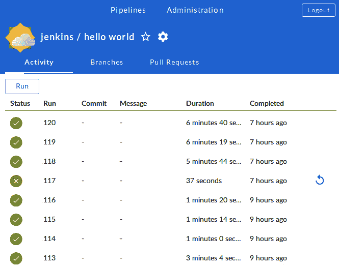

图 3.19 – Jenkins 蓝海用户界面

信息

您可以在蓝海页面阅读更多内容，链接地址为[`www.jenkins.io/doc/book/blueocean/`](https://www.jenkins.io/doc/book/blueocean/)。

# 总结

本章我们介绍了 Jenkins 环境及其配置。我们所获得的知识足以设置完整的基于 Docker 的 Jenkins 基础设施。本章的关键要点如下：

+   Jenkins 是一个通用的自动化工具，可以与任何语言或框架一起使用。

+   Jenkins 通过插件具有很强的扩展性，这些插件可以自己编写，也可以在互联网上找到。

+   Jenkins 是用 Java 编写的，因此可以安装在任何操作系统上。它也以 Docker 镜像的形式正式提供。

+   Jenkins 可以通过主从架构进行扩展。主节点实例可以根据组织的需求进行水平或垂直扩展。

+   Jenkins 代理可以通过 Docker 实现，这有助于自动配置和动态分配代理。

+   可以为 Jenkins 主节点和 Jenkins 代理创建自定义 Docker 镜像。

+   Jenkins 是高度可配置的，应该始终考虑的一些方面包括安全性和备份。

在下一章中，我们将重点介绍我们已经在 Hello World 示例中触及过的内容——管道。我们将描述构建一个完整的持续集成管道的理念和方法。

# 练习

在本章中，你已经学到了很多关于 Jenkins 配置的知识。为了巩固你的知识，我们推荐以下关于准备 Jenkins 镜像和测试 Jenkins 环境的练习：

1.  创建 Jenkins 主机和代理 Docker 镜像，并使用它们运行一个能够构建 Ruby 项目的 Jenkins 基础设施：

    1.  创建 Jenkins 主机 Dockerfile，该文件会自动安装 Docker 插件。

    1.  构建主机镜像并运行 Jenkins 实例。

    1.  创建代理 Dockerfile（适用于动态代理配置），该文件安装 Ruby 解释器。

    1.  构建代理镜像。

    1.  更改 Jenkins 实例的配置，使用代理镜像。

1.  创建一个管道，运行一个 Ruby 脚本，打印 `Hello World from Ruby`：

    1.  创建一个新管道。

    1.  使用以下 shell 命令动态创建 `hello.rb` 脚本：

**sh "echo \"puts 'Hello World from Ruby'\" > hello.rb"**

1.  添加命令以使用 Ruby 解释器运行 `hello.rb`。

1.  运行构建并观察控制台输出。

# 问题

为了验证你在本章中的知识，请回答以下问题：

1.  Jenkins 是否以 Docker 镜像的形式提供？

1.  Jenkins 主机和 Jenkins 代理（从属）有什么区别？

1.  垂直扩展和水平扩展有什么区别？

1.  启动 Jenkins 代理时，主机与代理之间的两种主要通信方式是什么？

1.  设置永久代理和永久 Docker 代理有什么区别？

1.  何时需要为 Jenkins 代理构建自定义 Docker 镜像？

1.  何时需要为 Jenkins 主机构建自定义 Docker 镜像？

1.  什么是 Jenkins Blue Ocean？

# 进一步阅读

要了解更多关于 Jenkins 的信息，请参考以下资源：

+   *Jenkins 手册*：[`www.jenkins.io/doc/book/`](https://www.jenkins.io/doc/book/)

+   *Jenkins 基础知识*，*Mitesh Soni*：[`www.packtpub.com/virtualization-and-cloud/jenkins-essentials-second-edition`](https://www.packtpub.com/virtualization-and-cloud/jenkins-essentials-second-edition)

+   *Jenkins: The Definitive Guide*，*John Ferguson Smart*：[`www.oreilly.com/library/view/jenkins-the-definitive/9781449311155/`](https://www.oreilly.com/library/view/jenkins-the-definitive/9781449311155/)
