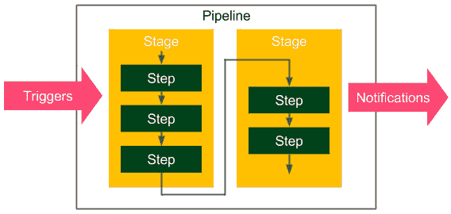
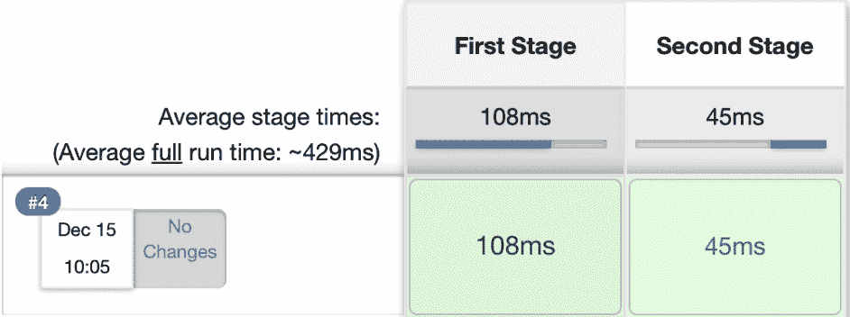
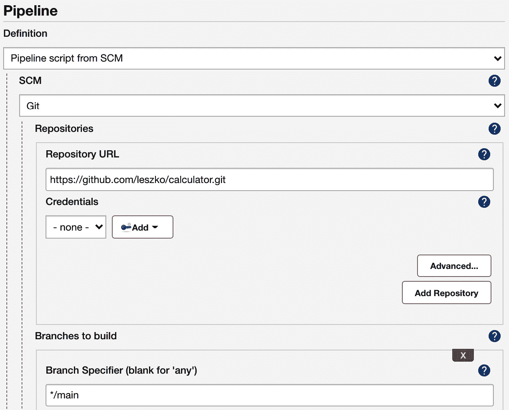
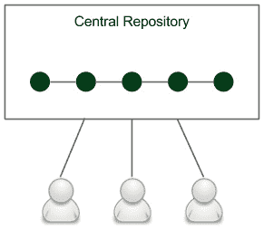
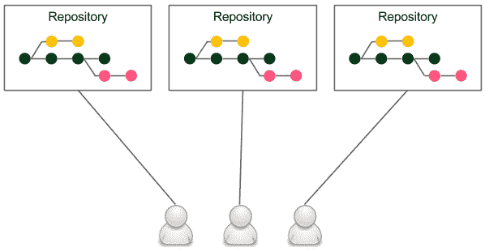
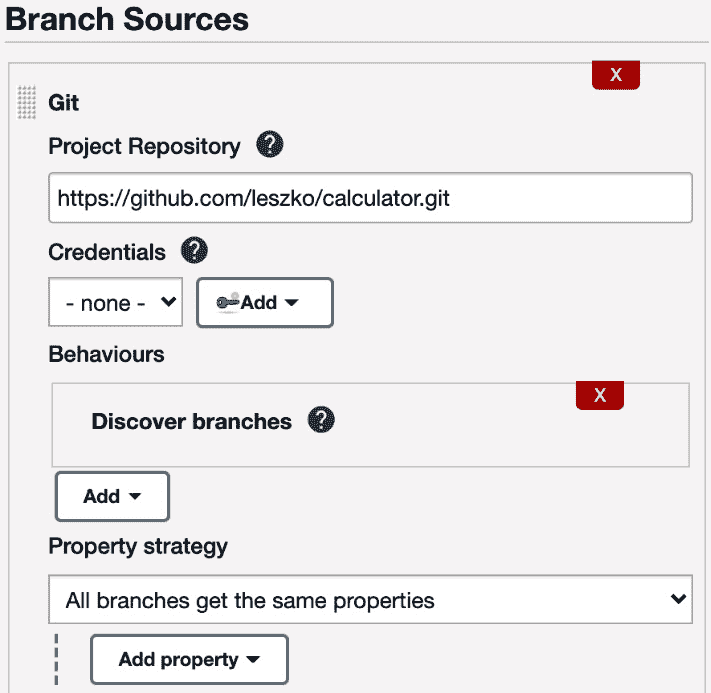
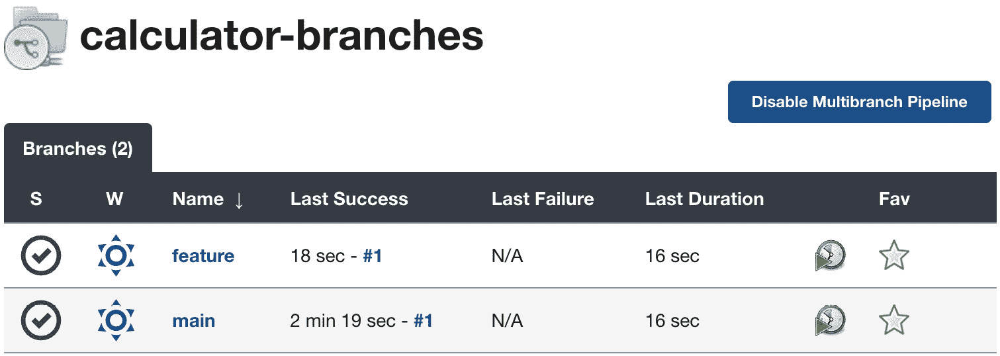

# 第四章：持续集成流水线

我们已经知道如何配置 Jenkins。在本章中，我们将看到如何有效地使用它，重点介绍 Jenkins 的核心特性——流水线。通过从头构建一个完整的持续集成过程，我们将描述现代团队导向的代码开发的各个方面。

本章内容包括以下主题：

+   引入流水线

+   提交流水线

+   代码质量阶段

+   触发器和通知

+   团队开发策略

# 技术要求

完成本章，你需要以下软件：

+   Jenkins

+   Java JDK 8+

所有示例和练习的解决方案可以在[`github.com/PacktPublishing/Continuous-Delivery-With-Docker-and-Jenkins-3rd-Edition/tree/main/Chapter04`](https://github.com/PacktPublishing/Continuous-Delivery-With-Docker-and-Jenkins-3rd-Edition/tree/main/Chapter04)找到。

本章的代码演示视频可以在[`bit.ly/3r9lbmG`](https://bit.ly/3r9lbmG)观看。

# 引入流水线

**流水线**是由一系列自动化操作组成的，通常表示软件交付和质量保证过程的一部分。它可以看作是一个脚本链，提供以下额外的好处：

+   **操作分组**：操作被分组为阶段（也称为**关卡**或**质量关卡**），这些阶段为流程引入了结构，并清晰地定义了规则——如果一个阶段失败，则后续阶段不会执行。

+   **可视性**：流程的所有方面都会被可视化，这有助于快速分析故障并促进团队协作。

+   **反馈**：团队成员会在问题发生时立即了解到，以便快速做出反应。

    信息

    流水线的概念类似于大多数持续集成工具。然而，命名可能会有所不同。在本书中，我们将坚持使用 Jenkins 的术语。

首先我们描述 Jenkins 流水线结构，然后说明它是如何在实际中运作的。

## 流水线结构

一个 Jenkins 流水线由两种元素组成——**阶段**和**步骤**。下图展示了它们的使用方式：



图 4.1 – Jenkins 流水线结构

以下是基本的流水线元素：

+   **步骤**：告诉 Jenkins 需要做什么的单一操作——例如，从仓库中检出代码并执行脚本

+   **阶段**：将步骤进行逻辑分隔，将概念上不同的步骤序列分组——例如，**构建**、**测试**和**部署**，用于可视化 Jenkins 流水线的进度

    信息

    从技术上讲，可以创建并行步骤；然而，最好将其视为仅用于优化目的的例外情况。

## 多阶段的 Hello World

作为示例，我们将扩展`Hello World`流水线，加入两个阶段：

```
pipeline {
     agent any
     stages {
          stage('First Stage') {
               steps {
                    echo 'Step 1\. Hello World'
               }
          }
          stage('Second Stage') {
               steps {
                    echo 'Step 2\. Second time Hello'
                    echo 'Step 3\. Third time Hello'
               }
          }
     }
}
```

该管道在环境方面没有特殊要求，并且在两个阶段内执行了三个步骤。当我们点击**立即构建**时，我们应该看到一个可视化表示：



图 4.2 – 多阶段管道构建

管道执行成功，我们可以通过点击控制台查看步骤执行的详细信息。如果任何步骤失败，处理将停止，后续步骤将不再执行。实际上，管道的唯一目的是防止后续步骤执行，并可视化失败的发生点。

## 管道语法

我们已经讨论了管道的元素，并且已经使用了几个管道步骤——例如，`echo`。*我们还能在管道定义中使用哪些其他操作？*

信息

本书中使用的是推荐用于所有新项目的声明式语法。其他选项包括基于 Groovy 的 DSL 和（在 Jenkins 2 之前的版本）XML（通过 Web 界面创建）。

声明式语法的设计目的是使理解管道尽可能简单，即使是那些并非每天编写代码的人。这也是为什么语法仅限于最重要的关键字。

让我们做一个实验，但在描述所有细节之前，请阅读以下管道定义并尝试猜测它的作用：

```
pipeline {
     agent any
     triggers { cron('* * * * *') }
     options { timeout(time: 5) }
     parameters { 
          booleanParam(name: 'DEBUG_BUILD', defaultValue: true, 
          description: 'Is it the debug build?') 
     }
     stages {
          stage('Example') {
               environment { NAME = 'Rafal' }
               when { expression { return params.DEBUG_BUILD } } 
               steps {
                    echo "Hello from $NAME"
                    script {
                         def browsers = ['chrome', 'firefox']
                         for (int i = 0; i < browsers.size(); ++i) {
                              echo "Testing the ${browsers[i]} browser."
                         }
                    }
               }
          }
     }
     post { always { echo 'I will always say Hello again!' } }
}
```

希望管道没有吓到你。它确实很复杂。实际上，它复杂到包含了大多数可用的 Jenkins 指令。为了回答实验谜题，让我们逐条查看管道指令的执行过程：

1.  使用任何可用的代理

1.  每分钟自动执行

1.  如果执行时间超过 5 分钟，则停止执行

1.  在开始之前请求布尔类型输入参数

1.  将`Rafal`设置为`NAME`环境变量

1.  仅在`true`输入参数的情况下执行以下操作：

    +   打印`来自 Rafal 的问候`

    +   打印`测试 Chrome 浏览器`

    +   打印`测试 Firefox 浏览器`

1.  打印`我将永远再次说你好！`，无论执行过程中是否有任何错误

现在，让我们描述最重要的 Jenkins 关键字。声明式管道始终在`pipeline`块内指定，并包含部分、指令和步骤。我们将逐一讲解它们。

信息

完整的管道语法描述可以在官方 Jenkins 页面上找到，地址为 [`jenkins.io/doc/book/pipeline/syntax/`](https://jenkins.io/doc/book/pipeline/syntax/)。

### 部分

部分定义了管道的结构，通常包含一个或多个指令或步骤。它们使用以下关键字定义：

+   **阶段**：这定义了一系列一个或多个阶段指令。

+   **步骤**：这定义了一系列一个或多个步骤指令。

+   **Post**：这定义了一系列在管道构建结束时运行的步骤指令；它们带有一个条件（例如，总是、成功或失败），通常用于在管道构建后发送通知（我们将在 *触发器和通知* 部分详细讲解）。

+   `label` 用于匹配具有相同标签的代理，或者 `docker` 用于指定动态提供的容器，以为管道执行提供环境。

### 指令

指令表达了管道或其部分的配置：

+   `cron` 用于设置基于时间的调度，或者 `pollSCM` 用于检查仓库中的更改（我们将在 *触发器和通知* 部分详细讲解此内容）。

+   `timeout`（管道运行的最大时间）或 `retry`（在失败后管道应重新运行的次数）。

+   **Environment**：这定义了一组作为构建过程中环境变量使用的键值。

+   **Parameters**：这定义了一个用户输入参数的列表。

+   **Stage**：这允许对步骤进行逻辑分组。

+   **When**：这决定了是否应该执行该阶段，取决于给定的条件。

+   `PATH`。

+   **Input**：这允许我们提示输入参数。

+   **Parallel**：这允许我们指定并行运行的阶段。

+   **Matrix**：这允许我们指定一组参数组合，以便在并行中运行给定的阶段。

### 步骤

步骤是管道中最基本的部分。它们定义了要执行的操作，因此实际上告诉 Jenkins *做什么*：

+   `sh`：这执行 Shell 命令；实际上，几乎可以使用 `sh` 定义任何操作。

+   `custom`：Jenkins 提供了许多可以用作步骤的操作（例如，`echo`）；其中许多只是 `sh` 命令的包装器，旨在便捷操作。插件也可以定义自己的操作。

+   `script`：这执行一块基于 Groovy 的代码，可用于一些需要流程控制的复杂场景。

    信息

    可用步骤的完整规范可以在 [`jenkins.io/doc/pipeline/steps/`](https://jenkins.io/doc/pipeline/steps/)找到。

请注意，管道语法非常通用，从技术上讲，可以用于几乎任何自动化过程。这就是为什么管道应被视为一种结构化和可视化的方法。然而，最常见的使用场景是实现持续集成服务器，接下来我们将详细介绍这一部分。

# 提交管道

最基本的持续集成过程被称为`commit`（或在 Git 中称为`push`）到主代码库，并生成关于构建成功或失败的报告。由于它在每次代码更改后运行，构建应不超过 5 分钟，并且应消耗合理的资源。提交阶段始终是持续交付过程的起点，并且提供了开发过程中最重要的反馈循环——如果代码处于健康状态，能够不断获得信息。

提交阶段的工作原理如下：开发者将代码提交到仓库，持续集成服务器检测到变更并启动构建。最基本的提交管道包含三个阶段：

+   **检出**：此阶段从仓库下载源代码。

+   **编译**：此阶段编译源代码。

+   **单元测试**：此阶段运行一套单元测试。

让我们创建一个示例项目，看看如何实现提交管道。

信息

这是一个使用 Git、Java、Gradle 和 Spring Boot 等技术的项目管道示例。然而，相同的原则适用于任何其他技术。

## 检出

从仓库检出代码始终是任何管道中的第一操作。为了看到这一点，我们需要一个仓库。然后，我们才能创建管道。

### 创建一个 GitHub 仓库

在 GitHub 服务器上创建一个仓库只需几个步骤：

1.  访问[`github.com/`](https://github.com/)。

1.  如果您还没有账户，请创建一个账户。

1.  点击**新建**，在**仓库**旁边。

1.  给它起个名字——`calculator`。

1.  勾选**用 README 初始化此仓库**。

1.  点击**创建仓库**。

现在，您应该能看到仓库的地址——例如，[`github.com/leszko/calculator.git`](https://github.com/leszko/calculator.git)。

### 创建检出阶段

我们可以创建一个名为`calculator`的新管道，并且它是一个`检出`：

```
pipeline {
     agent any
     stages {
          stage("Checkout") {
               steps {
                    git url: 'https://github.com/leszko/calculator.git', branch: 'main'
               }
          }
     }
}
```

这个管道可以在任何代理上执行，其唯一的步骤只是从仓库下载代码。我们可以点击**立即构建**来查看它是否成功执行。

信息

Git 工具包需要安装在构建执行的节点上。

当我们完成检出后，我们就准备好进入第二阶段。

## 编译

为了编译一个项目，我们需要执行以下操作：

1.  创建一个包含源代码的项目。

1.  将其推送到仓库。

1.  将`编译`阶段添加到管道中。

让我们详细了解这些步骤。

### 创建一个 Java Spring Boot 项目

让我们使用由 Gradle 构建的 Spring Boot 框架创建一个非常简单的 Java 项目。

信息

Spring Boot 是一个简化企业应用构建的 Java 框架。Gradle 是一个基于 Apache Maven 概念的构建自动化系统。

创建 Spring Boot 项目的最简单方法是执行以下步骤：

1.  访问[`start.spring.io/`](http://start.spring.io/)。

1.  选择 **Gradle Project** 而不是 **Maven Project**（如果你更喜欢 Maven 而不是 Gradle，可以选择 Maven）。

1.  填写 `com.leszko` 和 `calculator`。

1.  将 **Web** 添加到 **Dependencies**。

1.  点击 **Generate**。

1.  生成的骨架项目应该已下载（`calculator.zip` 文件）。

以下截图显示了 [`start.spring.io/`](http://start.spring.io/) 页面：


图 4.3 – spring initializr

项目创建后，我们可以将其推送到 GitHub 仓库。

### 将代码推送到 GitHub

我们将使用 Git 工具执行 `commit` 和 `push` 操作。

信息

为了运行 `git` 命令，你需要安装 Git 工具包（可以从 [`git-scm.com/downloads`](https://git-scm.com/downloads) 下载）。

首先让我们将仓库克隆到文件系统：

```
$ git clone https://github.com/leszko/calculator.git
```

将从 [`start.spring.io/`](http://start.spring.io/) 下载的项目解压到 Git 创建的目录中。

提示

如果你喜欢，你可以将项目导入到 IntelliJ、Visual Studio Code、Eclipse 或你最喜欢的 IDE 工具中。

结果是，`calculator` 目录应该包含以下文件：

```
$ ls -a
. .. build.gradle .git .gitignore gradle gradlew gradlew.bat HELP.md README.md settings.gradle src
```

信息

为了在本地执行 Gradle 操作，你需要安装 Java JDK。

我们可以使用以下代码在本地编译项目：

```
$ ./gradlew compileJava
```

对于 Maven，你可以运行 `./mvnw compile`。Gradle 和 Maven 都会编译位于 `src` 目录中的 Java 类。

现在，我们可以提交并推送到 GitHub 仓库：

```
$ git add .
$ git commit -m "Add Spring Boot skeleton"
$ git push -u origin main
```

代码已经在 GitHub 仓库中了。如果你想检查它，可以访问 GitHub 页面查看文件。

### 创建一个编译阶段

我们可以使用以下代码将 `Compile` 阶段添加到流水线中：

```
stage("Compile") {
     steps {
          sh "./gradlew compileJava"
     }
}
```

请注意，我们在本地和 Jenkins 流水线中使用的命令完全相同，这是一个非常好的迹象，因为本地开发过程与持续集成环境一致。运行构建后，你应该看到两个绿色的框。你也可以在控制台日志中检查项目是否正确编译。

## 单元测试

现在是添加最后阶段的时候了，那就是单元测试；它检查我们的代码是否按预期执行。我们需要做以下操作：

1.  添加计算器逻辑的源代码。

1.  为代码编写单元测试。

1.  添加一个 Jenkins 阶段来执行单元测试。

接下来我们将详细讲解这些步骤。

### 创建业务逻辑

计算器的第一个版本将能够执行两个数字的加法。让我们在 `src/main/java/com/leszko/calculator/Calculator.java` 文件中添加业务逻辑作为一个类：

```
package com.leszko.calculator;
import org.springframework.stereotype.Service;
@Service
public class Calculator {
     public int sum(int a, int b) {
          return a + b;
     }
}
```

为了执行业务逻辑，我们还需要在一个单独的文件中添加 Web 服务控制器：`src/main/java/com/leszko/calculator/CalculatorController.java`：

```
package com.leszko.calculator;
import org.springframework.beans.factory.annotation.Autowired;
import org.springframework.web.bind.annotation.RequestMapping;
import org.springframework.web.bind.annotation.RequestParam;
import org.springframework.web.bind.annotation.RestController;
@RestController
class CalculatorController {
     @Autowired
     private Calculator calculator;
     @RequestMapping("/sum")
     String sum(@RequestParam("a") Integer a, 
                @RequestParam("b") Integer b) {
          return String.valueOf(calculator.sum(a, b));
     }
}
```

这个类将业务逻辑暴露为 Web 服务。我们可以运行应用程序，看看它是如何工作的：

```
$ ./gradlew bootRun
```

这应该启动我们的 Web 服务，我们可以通过在浏览器中打开 `http://localhost:8080/sum?a=1&b=2` 来检查它是否正常工作。这个链接应该将两个数字（`1` 和 `2`）相加并在浏览器中显示 `3`。

### 编写单元测试

我们已经有了可工作的应用程序。*我们如何确保逻辑按预期工作？*我们尝试过一次，但为了确保它始终如一地工作，我们需要单元测试。在我们的例子中，这将是微不足道的，甚至可能是不必要的；然而，在真实项目中，单元测试可以帮助你避免错误和系统故障。

让我们在 `src/test/java/com/leszko/calculator/CalculatorTest.java` 文件中创建一个单元测试：

```
package com.leszko.calculator;
import org.junit.Test;
import static org.junit.Assert.assertEquals;
public class CalculatorTest {
     private Calculator calculator = new Calculator();
     @Test
     public void testSum() {
          assertEquals(5, calculator.sum(2, 3));
     }
}
```

我们的测试使用了 JUnit 库，因此我们需要在 `build.gradle` 文件中将其作为依赖项添加：

```
dependencies {
     ...
testImplementation 'junit:junit:4.13'
}
```

我们可以使用 `./gradlew test` 命令在本地运行测试。然后，让我们提交代码并推送到代码库：

```
$ git add .
$ git commit -m "Add sum logic, controller and unit test"
$ git push
```

### 创建单元测试阶段

现在，我们可以在管道中添加一个 `单元测试` 阶段：

```
stage("Unit test") {
     steps {
          sh "./gradlew test"
     }
}
```

提示

在 Maven 的情况下，使用 `./mvnw test` 命令代替。

当我们再次构建管道时，我们应该看到三个框，这意味着我们已经完成了持续集成管道：


图 4.4 – 持续集成管道构建

现在我们已经准备好了管道，让我们看看如何使用 Jenkinsfile 达到完全相同的结果。

## Jenkinsfile

到目前为止，我们已经直接在 Jenkins 中创建了所有的管道代码。然而，这并不是唯一的选择。我们还可以将管道定义放在一个名为 `Jenkinsfile` 的文件中，并将其与源代码一起提交到代码库中。这种方法更一致，因为你的管道结构严格与项目本身相关。

例如，如果你不需要代码编译，因为你的编程语言是解释型语言（而不是编译型语言），那么你就不会有 `编译` 阶段。你使用的工具也会有所不同，取决于环境。我们使用了 Gradle/Maven，因为我们构建的是 Java 项目；然而，在 Python 项目中，你可以使用 PyBuilder。这引出了一个观点，即管道应该由编写代码的人来创建——即开发者。此外，管道定义应该与代码一起放在代码库中。

这种方法带来了即时的好处，如下所示：

+   在 Jenkins 失败的情况下，管道定义不会丢失（因为它存储在代码库中，而不是 Jenkins 中）。

+   管道更改的历史记录已被存储。

+   管道更改经过标准的代码开发流程（例如，代码审查）。

+   对管道更改的访问权限与对源代码的访问权限完全相同。

让我们通过创建一个 `Jenkinsfile` 文件，看看它在实践中的表现。

### 创建 Jenkins 文件

我们可以创建一个 `Jenkinsfile` 文件，并将其推送到我们的 GitHub 仓库。其内容几乎与我们写的提交管道相同。唯一的区别是，checkout 阶段变得多余，因为 Jenkins 必须首先检出代码（连同 `Jenkinsfile`），然后读取管道结构（来自 `Jenkinsfile`）。这就是为什么 Jenkins 在读取 `Jenkinsfile` 之前需要知道仓库地址的原因。

让我们在项目的 `root` 目录中创建一个名为 `Jenkinsfile` 的文件：

```
pipeline {
     agent any
     stages {
          stage("Compile") {
               steps {
                    sh "./gradlew compileJava"
               }
          }
          stage("Unit test") {
               steps {
                    sh "./gradlew test"
               }
          }
     }
}
```

现在我们可以提交已添加的文件并将它们推送到 GitHub 仓库：

```
$ git add Jenkinsfile
$ git commit -m "Add Jenkinsfile"
$ git push
```

### 从 Jenkinsfile 运行管道

当 `Jenkinsfile` 存在于仓库中时，我们需要做的就是打开管道配置，并在 **管道** 部分执行以下操作：

1.  将 **定义** 从 **管道脚本** 更改为 **来自 SCM 的管道脚本**。

1.  在 **SCM** 中选择 **Git**。

1.  将 [`github.com/leszko/calculator.git`](https://github.com/leszko/calculator.git) 放入 **仓库 URL**。

1.  使用 `*/main` 作为 **分支说明符**。



图 4.5 – Jenkinsfile 管道配置

保存后，构建将始终从仓库中的当前版本的 `Jenkinsfile` 运行。

我们已经成功创建了第一个完整的提交管道。它可以作为最小可行产品来对待，实际上，在许多情况下，这足够作为持续集成过程。在接下来的章节中，我们将看到如何改进，以使提交管道更加完善。

# 代码质量阶段

我们可以通过增加额外的步骤来扩展持续集成的三个经典步骤。最流行的步骤是代码覆盖和静态分析。让我们来看看每个步骤。

## 代码覆盖

假设以下场景：你有一个配置良好的持续集成过程，但项目中的任何人都没有编写单元测试。它通过了所有构建，但这并不意味着代码按预期工作。*那么我们该怎么办呢？* *我们如何确保代码已经经过测试？*

解决方案是添加一个代码覆盖工具，它会运行所有测试并验证代码中哪些部分已经执行。然后，它可以生成报告，显示未测试的部分。此外，当未测试的代码过多时，我们可以使构建失败。

有很多工具可以执行测试覆盖率分析；对于 Java，最流行的工具是 JaCoCo、OpenClover 和 Cobertura。

让我们使用 JaCoCo 并展示覆盖率检查如何工作。为此，我们需要执行以下步骤：

1.  将 JaCoCo 添加到 Gradle 配置中。

1.  将代码覆盖阶段添加到管道中。

1.  可选地，在 Jenkins 中发布 JaCoCo 报告。

让我们详细了解这些步骤。

### 将 JaCoCo 添加到 Gradle 中

为了从 Gradle 运行 JaCoCo，我们需要通过插入以下行将 `jacoco` 插件添加到 `build.gradle` 文件中：

```
plugins {
     ...
     id 'jacoco'
}
```

接下来，如果我们希望在代码覆盖率较低的情况下让 Gradle 构建失败，可以在`build.gradle`文件中添加以下配置：

```
jacocoTestCoverageVerification {
     violationRules {
          rule {
               limit {
                    minimum = 0.2
               }
          }
     }
}
```

该配置将最小代码覆盖率设置为 20%。我们可以使用以下命令运行它：

```
$ ./gradlew test jacocoTestCoverageVerification
```

该命令检查代码覆盖率是否至少为 20%。你可以调整最小值，查看构建在哪个覆盖率水平下失败。我们还可以使用以下命令生成测试覆盖报告：

```
$ ./gradlew test jacocoTestReport
```

你可以在`build/reports/jacoco/test/html/index.html`文件中查看完整的覆盖报告：


图 4.6 – JaCoCo 代码覆盖报告

现在，让我们在管道中添加覆盖阶段。

### 添加代码覆盖阶段

向管道中添加代码覆盖阶段与之前的阶段一样简单：

```
stage("Code coverage") {
     steps {
          sh "./gradlew jacocoTestReport"
          sh "./gradlew jacocoTestCoverageVerification"
     }
}
```

添加此阶段后，如果有人提交了测试覆盖不足的代码，构建将会失败。

### 发布代码覆盖报告

当覆盖率较低且管道失败时，查看代码覆盖报告并找出哪些部分尚未被测试是很有用的。我们可以在本地运行 Gradle 并生成覆盖报告；但是，如果 Jenkins 为我们显示报告，则会更方便。

为了在 Jenkins 中发布代码覆盖报告，我们需要以下阶段定义：

```
stage("Code coverage") {
     steps {
          sh "./gradlew jacocoTestReport"
          publishHTML (target: [
               reportDir: 'build/reports/jacoco/test/html',
               reportFiles: 'index.html',
               reportName: "JaCoCo Report"
          ])
          sh "./gradlew jacocoTestCoverageVerification"
     }
}
```

此阶段将生成的 JaCoCo 报告复制到 Jenkins 输出中。当我们再次运行构建时，我们应该能在左侧菜单中的**立即构建**下方看到指向代码覆盖报告的链接。

信息

要执行`publishHTML`步骤，你需要在 Jenkins 中安装 HTML Publisher 插件。你可以在[`www.jenkins.io/doc/pipeline/steps/htmlpublisher/`](https://www.jenkins.io/doc/pipeline/steps/htmlpublisher/)查看更多关于该插件的信息。还需要注意的是，如果报告已生成但未正确显示在 Jenkins 中，你可能需要配置 Jenkins 安全设置，具体操作可以参考这里：[`www.jenkins.io/doc/book/security/configuring-content-security-policy/`](https://www.jenkins.io/doc/book/security/configuring-content-security-policy/)。

我们已经创建了代码覆盖阶段，显示了未经过测试的代码，因此容易出现漏洞。让我们看看还可以做些什么来提高代码质量。

提示

如果你需要更严格的代码覆盖要求，可以了解突变测试的概念，并将 PIT 框架阶段添加到管道中。阅读更多内容请访问[`pitest.org/`](http://pitest.org/)。

## 静态代码分析

你的代码覆盖率可能非常完美；然而，*那代码本身的质量呢？* *我们如何确保它是可维护的，并且写得风格良好？*

静态代码分析是一个无需实际执行代码的自动检查过程。在大多数情况下，它意味着检查源代码上的多个规则。这些规则可以应用于广泛的方面；例如，所有公共类需要有 Javadoc 注释，一行的最大长度为 120 个字符，或者如果一个类定义了 `equals()` 方法，它也必须定义 `hashCode()` 方法。

执行 Java 代码静态分析的最流行工具是 Checkstyle、FindBugs 和 PMD。让我们看一个例子，并使用 Checkstyle 添加静态代码分析阶段。我们将分三步来完成：

1.  添加 Checkstyle 配置

1.  添加 Checkstyle 阶段

1.  可选的，在 Jenkins 中发布 Checkstyle 报告

我们将逐一讲解它们。

### 添加 Checkstyle 配置

为了添加 Checkstyle 配置，我们需要定义检查代码的规则。我们可以通过指定 `config/checkstyle/checkstyle.xml` 文件来完成：

```
<?xml version="1.0"?>
<!DOCTYPE module PUBLIC
     "-//Puppy Crawl//DTD Check Configuration 1.2//EN"
     "http://www.puppycrawl.com/dtds/configuration_1_2.dtd">
<module name="Checker">
     <module name="TreeWalker">
          <module name="ConstantName" />
     </module>
</module>
```

配置中只包含一个规则——检查所有 Java 常量是否遵循命名约定，并且仅由大写字母组成。

信息

完整的 Checkstyle 描述可以在 [`checkstyle.sourceforge.io/config.html`](https://checkstyle.sourceforge.io/config.html) 查找。

我们还需要将 `checkstyle` 插件添加到 `build.gradle` 文件中：

```
plugins {
     ...
     id 'checkstyle'
}
```

然后，我们可以使用以下命令运行 `checkstyle`：

```
$ ./gradlew checkstyleMain
```

对于我们的项目来说，这个命令应该能够成功完成，因为我们到目前为止没有使用任何常量。然而，您可以尝试添加一个命名错误的常量，并检查构建是否失败。例如，如果您将以下常量添加到 `src/main/java/com/leszko/calculator/CalculatorApplication.java` 文件中，`checkstyle` 将会失败：

```
@SpringBootApplication
public class CalculatorApplication {
     private static final String constant = "constant";
     public static void main(String[] args) {
          SpringApplication.run(CalculatorApplication.class, args);
     }
}
```

### 添加静态代码分析阶段

我们可以在流水线中添加一个 `Static code analysis` 阶段：

```
stage("Static code analysis") {
     steps {
          sh "./gradlew checkstyleMain"
     }
}
```

现在，如果有人提交不遵循 Java 常量命名约定的代码，构建将会失败。

### 发布静态代码分析报告

与 JaCoCo 非常相似，我们可以将 Checkstyle 报告添加到 Jenkins 中：

```
publishHTML (target: [
     reportDir: 'build/reports/checkstyle/',
     reportFiles: 'main.html',
     reportName: "Checkstyle Report"
])
```

这将生成一个指向 Checkstyle 报告的链接。

我们现在已添加静态代码分析阶段，它可以帮助查找错误并标准化团队或组织内部的代码风格。

让我们看看实现代码分析时的另一个选择。

## SonarQube

SonarQube 是最广泛使用的源代码质量管理工具。它支持多种编程语言，并且可以作为我们之前提到的代码覆盖率和静态代码分析步骤的替代方案。实际上，它是一个独立的服务器，汇聚了不同的代码分析框架，如 Checkstyle、FindBugs 和 JaCoCo。它拥有自己的仪表盘，并且能够与 Jenkins 良好集成。

我们可以安装 SonarQube，在那里添加插件，并在流水线中添加 *sonar* 阶段，而不是将代码质量步骤添加到流水线中。此解决方案的优点是，SonarQube 提供了一个用户友好的 Web 界面，用于配置规则并显示代码漏洞。

信息

你可以在其官方网站查看有关 SonarQube 的更多信息：[`www.sonarqube.org/`](https://www.sonarqube.org/)。

现在我们已经讲解了代码质量阶段，让我们关注触发器和通知。

# 触发器和通知

到目前为止，我们一直是通过点击 **立即构建** 按钮手动构建流水线。这完全没问题，但在实际操作中可能不太方便。所有团队成员都需要记住，在提交到仓库后，他们需要打开 Jenkins 并启动构建。流水线监控也是如此；到目前为止，我们一直是手动打开 Jenkins 并检查构建状态。在本节中，我们将看到如何改进这个流程，使得流水线能够自动启动，并在完成时通知团队成员其状态。

## 触发器

启动构建的自动动作被称为流水线触发器。在 Jenkins 中，有许多选项可以选择；然而，它们都归结为三种类型：

+   外部

+   拉取 **源代码管理** (**SCM**)

+   定时构建

让我们逐一查看它们。

### 外部

外部触发器易于理解。它们意味着 Jenkins 在被 **通知者** 调用后启动构建，通知者可以是其他流水线构建、SCM 系统（例如 GitHub）或任何远程脚本。

以下图示展示了通信过程：


图 4.7 – 外部触发器

GitHub 在推送到仓库后触发 Jenkins 并启动构建。

为了以这种方式配置系统，我们需要以下设置步骤：

1.  在 Jenkins 中安装 GitHub 插件。

1.  为 Jenkins 生成一个密钥。

1.  设置 GitHub webhook，并指定 Jenkins 地址和密钥。

对于最流行的 SCM 提供商，总是会提供专用的 Jenkins 插件。

还有一种更通用的方式，通过 REST 调用 ` <jenkins_url>/job/<job_name>/build?token=<token>` 端点来触发 Jenkins。出于安全原因，需要在 Jenkins 中设置 `token`，然后在远程脚本中使用它。

信息

Jenkins 必须能够从 SCM 服务器访问。换句话说，如果我们使用公共 GitHub 仓库来触发 Jenkins，那么我们的 Jenkins 服务器也必须是公开的。这也适用于 REST 调用方案，在这种情况下，`<jenkins_url>` 地址必须能够从触发它的脚本访问。

### 拉取 SCM

拉取 SCM 触发器的直观性稍差。以下图示展示了通信过程：


图 4.8 – 拉取 SCM 触发器

Jenkins 定期调用 GitHub 检查是否有推送到代码库的内容。然后，它启动构建。乍一听这可能有些反直觉，但实际上有至少两种情况适合使用这种方法：

+   Jenkins 位于防火墙内的网络中（GitHub 无法访问该网络）。

+   提交频繁且构建时间较长，因此在每次提交后执行构建会导致系统负载过重。

`pollSCM`的配置也相对简单，因为 Jenkins 到 GitHub 的连接已经配置好了（Jenkins 从 GitHub 检出代码，所以它知道如何访问）。以我们的计算器项目为例，我们可以通过在管道中添加`triggers`声明（紧跟`agent`之后）来设置自动触发：

```
triggers {
     pollSCM('* * * * *')
}
```

在第一次手动运行管道后，自动触发器已设置好。接下来，它每分钟检查一次 GitHub，如果有新提交，就启动构建。为了测试它是否按预期工作，你可以向 GitHub 仓库提交并推送任意内容，看看构建是否启动。

我们将神秘的`* * * * *`作为`pollSCM`的参数。它指定 Jenkins 应该多久检查一次新源代码的更改，采用的是`cron`风格的字符串格式。

信息

`cron`字符串格式的说明（以及 cron 工具）可见于[`en.wikipedia.org/wiki/Cron`](https://en.wikipedia.org/wiki/Cron)。

### 定时构建

定时触发意味着 Jenkins 定期运行构建，不管代码库是否有提交。

如下截图所示，不需要与任何系统进行通信：


图 4.9 – 定时构建触发器

实现`cron`关键字，而不是`pollSCM`。这种触发方式通常不会用于提交管道，但适用于夜间构建（例如，晚上执行复杂的集成测试）。

## 通知

Jenkins 提供了许多方式来宣布其构建状态。更重要的是，像 Jenkins 中的所有其他功能一样，可以通过插件添加新的通知类型。

让我们来了解最流行的几种类型，这样你可以选择最适合自己需求的那种。

### 邮件

通知用户 Jenkins 构建状态的最经典方式是发送电子邮件。这个方案的优点是每个人都有邮箱，每个人都知道如何使用它，而且每个人都习惯在邮箱中接收信息。缺点是，通常电子邮件太多，而来自 Jenkins 的邮件很快就会被过滤掉，根本没人阅读。

邮件通知的配置非常简单：

1.  配置**SMTP**（**简单邮件传输协议**）服务器。

1.  在 Jenkins 中设置其详细信息（在**管理 Jenkins** | **配置系统**中）。

1.  在管道中使用`mail to`指令。

管道配置可以如下：

```
post {
     always {
          mail to: 'team@company.com',
          subject: "Completed Pipeline: ${currentBuild.fullDisplayName}",
          body: "Your build completed, please check: ${env.BUILD_URL}"
     }
}
```

请注意，所有通知通常都在管道的`post`部分调用，该部分在所有步骤执行完毕后执行，无论构建是成功还是失败。我们使用了`always`关键字；不过，还有其他不同的选项：

+   `always`：无论完成状态如何，都会执行。

+   `changed`：仅当管道的状态发生变化时执行。

+   `fixed`：仅当管道的状态从失败变为成功时执行。

+   `regression`：仅当管道的状态从成功变为失败、不稳定或中止时执行。

+   `aborted`：仅当管道被手动中止时执行。

+   `failure`：仅当管道的状态为`failed`时执行。

+   `success`：仅当管道的状态为`success`时执行。

+   `unstable`：仅当管道的状态为`unstable`时执行（通常由测试失败或代码违规引起）。

+   `unsuccessful`：仅当管道的状态不是`success`时执行。

### 群组聊天

如果群组聊天（例如 Slack）是你团队中的首选沟通方式，那么考虑在其中添加自动构建通知是值得的。无论你使用哪种工具，配置它的过程都是一样的：

1.  查找并安装适用于你的群组聊天工具的插件（例如，**Slack Notification**插件）。

1.  配置插件（服务器 URL、频道、授权令牌等）。

1.  将发送指令添加到管道中。

让我们看一个在构建失败后发送通知的 Slack 管道配置示例：

```
post {
     failure {
          slackSend channel: '#dragons-team',
          color: 'danger',
          message: "The pipeline ${currentBuild.fullDisplayName} failed."
     }
}
```

### 团队空间

随着敏捷文化的兴起，出现了一个观念：最好所有事情都在团队空间内进行。与其写电子邮件，不如聚在一起；与其在线聊天，不如面对面交流；与其使用任务跟踪工具，不如有一块白板。这个理念同样也影响了持续交付和 Jenkins。目前，在团队空间安装大屏幕（也叫**构建散热器**）已经非常普遍。因此，当你来到办公室时，首先看到的是管道的当前状态。构建散热器被认为是最有效的通知策略之一。它们确保每个人都意识到构建失败，并且作为一种积极的副作用，它们促进了团队精神并支持面对面的沟通。

由于开发人员是富有创造力的存在，他们发明了很多其他的创意，起着与散热器相同的作用。有些团队挂上了大扬声器，当管道失败时会发出蜂鸣声。其他团队则有玩具，当构建完成时会闪烁。我的一个最喜欢的例子是 Pipeline State UFO，这是一个在 GitHub 上提供的开源项目。在它的页面上，你可以找到如何打印和配置一个悬挂在天花板上的 UFO，来显示管道状态的描述。你可以在[`github.com/Dynatrace/ufo`](https://github.com/Dynatrace/ufo)找到更多信息。

信息

由于 Jenkins 可通过插件扩展，其社区编写了许多不同的方法来通知用户构建状态。其中包括 RSS 源、短信通知、移动应用程序和桌面通知器。

现在我们已经讨论了触发器和通知，让我们关注另一个重要方面——团队开发策略。

# 团队开发策略

我们已经涵盖了有关持续集成流水线应如何构建的所有内容。然而，*究竟什么时候应该运行它？* 当然，它是在提交到仓库后触发的，但*提交到哪个分支后？* *仅仅提交到主干，还是每个分支都提交？* 或者，*也许应该在提交之前运行，以确保仓库始终处于健康状态？* 或者，*如果没有分支，那个疯狂的想法怎么样？*

对这些问题没有唯一正确的答案。实际上，你如何使用持续集成过程取决于你的团队开发工作流。因此，在我们进一步讨论之前，让我们先描述一下可能的工作流。

## 开发工作流

开发工作流是指团队如何将代码提交到仓库。它当然取决于多个因素，比如 SCM 工具、项目特点和团队规模。

结果是，每个团队以略有不同的方式开发代码。然而，我们可以将它们分为三种类型：**基于主干的工作流**、**分支工作流**和**分叉工作流**。

信息

所有工作流的详细描述和示例，可以在[`www.atlassian.com/git/tutorials/comparing-workflows`](https://www.atlassian.com/git/tutorials/comparing-workflows)找到。

### 基于主干的工作流

基于主干的工作流是最简单的策略。该策略在下图中展示：



图 4.10 – 基于主干的工作流

有一个中央仓库，所有项目的更改都通过该仓库进行提交，这个仓库被称为**主干**或**主分支**。团队的每个成员都克隆该中央仓库，以便拥有自己的本地副本。更改直接提交到中央仓库。

### 分支工作流

分支工作流，顾名思义，意味着代码保存在多个不同的分支中。这个概念在下图中展示：


图 4.11 – 分支工作流

当开发者开始开发新功能时，他们会从主干创建一个专用的分支，并在该分支上提交所有与功能相关的更改。这使得多个开发者可以在不破坏主代码库的情况下共同开发一个功能。这也是为什么在分支工作流中，保持主干健康没有问题。当功能完成时，开发者会从主干对功能分支进行 rebase，并创建一个包含所有功能相关代码更改的拉取请求。这样会启动代码审查讨论，并提供检查更改是否破坏主干的空间。当其他开发者和自动化系统检查接受代码后，它会被合并到主代码库中。构建会在主干上重新运行，但几乎不应该失败，因为它在分支上没有失败。

### Forking 工作流

Forking 工作流在开源社区中非常受欢迎。它在以下图示中展示：



](img/B18223_04_12.jpg)

图 4.12 – Forking 工作流

每个开发者都有自己的服务器端代码仓库。这个仓库可能是官方仓库，也可能不是，但从技术上讲，每个仓库是完全相同的。

**Forking** 字面意思是从另一个仓库创建一个新仓库。开发者推送到他们自己的仓库，当他们想要集成代码时，他们会创建一个拉取请求到另一个仓库。

Forking 工作流的主要优点是，集成不一定需要通过中央仓库。它还帮助管理所有权，因为它允许接受来自其他人的拉取请求而不授予他们写权限。

对于需求导向的商业项目，一个团队通常会专注于一个产品，因此会有一个中央仓库， 所以这种模型最终归结为具有良好所有权分配的分支工作流；例如，只有项目负责人可以将拉取请求合并到中央仓库中。

## 采用持续集成

我们已经描述了不同的开发工作流，但 *它们如何影响持续集成配置？*

### 分支策略

每种开发工作流都暗示了不同的持续集成方法：

+   **基于主干的工作流**：这意味着需要不断与破坏的流水线作斗争。如果每个人都提交到主代码库，流水线往往会失败。在这种情况下，旧的持续集成规则是，*如果构建失败，开发团队会停止手头的工作，立即修复问题*。

+   **分支工作流**：它解决了破坏主干的问题，但引入了另一个问题：如果每个人都在自己的分支上开发，*那么集成在哪里？* 一个功能通常需要几周或几个月的时间来开发，在这段时间里，分支并没有被集成到主代码中。因此，这种情况不能真正称为持续集成——更不用说持续需要合并和解决冲突的问题。

+   **分叉工作流**：这意味着每个仓库所有者都管理持续集成过程，这通常不是问题。然而，它确实与分支工作流面临相同的问题。

没有银弹，不同的组织选择不同的策略。最接近完美的解决方案使用了分支工作流的技术和基于主干的工作流哲学。换句话说，我们可以创建非常小的分支，并频繁地将它们集成到主分支中。这似乎结合了两者的最佳特点。然而，它需要有小功能或者使用特性开关。由于特性开关的概念非常适合持续集成和持续交付，我们可以稍作停顿来探讨它。

### 特性开关

特性开关是一种替代维护多个源代码分支的技术，使得特性可以在完成并准备发布之前进行测试。它用于禁用用户的特性，但允许开发人员在测试时启用该特性。特性开关本质上是用于条件语句中的变量。

特性开关的最简单实现是标志和 `if` 语句。使用特性开关进行开发，与使用特性分支的开发方式相比，结果如下：

1.  需要实现一个新特性。

1.  创建一个新的标志或配置属性 – `feature_toggle`（而不是 `feature` 分支）。

1.  所有与特性相关的代码都添加在 `if` 语句中（而不是提交到 `feature` 分支），例如以下内容：

    ```
    if (feature_toggle) {
         // do something
    }
    ```

1.  在功能开发过程中，会发生以下情况：

    +   代码在主分支中编写，`feature_toggle = true`（而不是在功能分支中编写代码）。

    +   发布工作从主分支进行，`feature_toggle = false`。

1.  当功能开发完成时，所有的 `if` 语句会被移除，`feature_toggle` 会从配置中删除（而不是将 `feature` 合并到主分支并删除 `feature` 分支）。

特性开关的好处在于所有的开发工作都在主干中进行，这有助于实现真正的持续集成，并减轻了合并代码时的问题。

## Jenkins 多分支

如果你决定使用任何形式的分支，无论是长时间的功能分支，还是推荐的短生命周期分支，了解代码在合并到主分支之前是健康的会很方便。这种方法的结果是始终保持主代码库绿色，幸运的是，可以通过 Jenkins 很容易做到这一点。

为了在我们的计算器项目中使用多分支，我们可以按照以下步骤进行：

1.  打开 Jenkins 主页面。

1.  点击 **New Item**。

1.  输入 `calculator-branches` 作为项目名称，选择 **Multibranch Pipeline**，然后点击 **OK**。

1.  在 **Branch Sources** 部分，点击 **Add source**，然后选择 **Git**。

1.  在 **项目仓库** 字段中输入仓库地址：



图 4.13 – 多分支管道配置

1.  选中**周期性运行（如果没有其他设置）**并设置**1 分钟**作为间隔。

1.  点击**保存**。

每分钟，这个配置会检查是否添加（或删除）了任何分支，并根据 `Jenkinsfile` 创建（或删除）相应的专用管道。

我们可以创建一个新分支并观察其工作原理。让我们创建一个名为`feature`的新分支，并将其推送到仓库中：

```
$ git checkout -b feature
$ git push origin feature
```

稍等片刻，您应该看到一个新的分支管道自动创建并运行：



图 4.14 – 多分支管道构建

现在，在将功能分支合并到主分支之前，我们可以检查它是否通过测试。这种方式永远不应该破坏主分支构建。

一种非常相似的方法是为每个拉取请求建立管道，而不是为每个分支建立管道，这样也能达到相同的结果——主代码库始终保持健康。

## 非技术要求

最后但同样重要的是，持续集成并不仅仅是技术问题。相反，技术排在第二位。James Shore 在他的*《每天一美元的持续集成》*文章中描述了如何在没有任何额外软件的情况下设置持续集成过程。他所使用的仅仅是一只橡胶鸡和一只铃铛。其想法是让团队在一个房间里工作，并设置一台带有空椅子的计算机。把橡胶鸡和铃铛放在那台计算机前面。现在，当你计划提交代码时，拿起橡胶鸡，提交代码，去空的计算机，拉取最新代码，在那里运行所有测试，如果一切通过，就把橡胶鸡放回去，并响铃通知大家已经有新内容被提交到仓库。

信息

*《每天一美元的持续集成》* 由*James Shore* 撰写，可以在 [`www.jamesshore.com/v2/blog/2006/continuous-integration-on-a-dollar-a-day`](http://www.jamesshore.com/v2/blog/2006/continuous-integration-on-a-dollar-a-day) 上找到。

这个想法有点过于简化，自动化工具是有用的；然而，主要的信息是：没有每个团队成员的参与，即使是最好的工具也没有帮助。在他的书中，Jez Humble 概述了持续集成的先决条件：

+   **定期提交**：引用 Mike Roberts 的话，*持续集成比你想象的要更频繁*；最少的频率是一天一次。

+   **创建全面的单元测试**：这不仅仅是关于高测试覆盖率；即使没有任何断言，仍然可以保持 100% 的覆盖率。

+   **保持过程快捷**：持续集成必须在短时间内完成，最好是在 5 分钟以内，10 分钟已经算长了。

+   **监控构建**：这可以是共享责任，或者您可以适应每周轮换的**构建负责人**角色。

# 总结

本章中，我们涵盖了持续集成管道的各个方面，持续集成是持续交付的第一步。以下是关键要点：

+   管道提供了一个通用机制，用于组织任何自动化过程；然而，最常见的用例是持续集成和持续交付。

+   Jenkins 接受定义管道的不同方式，但推荐使用声明性语法。

+   提交管道是最基本的持续集成过程，顾名思义，它应该在每次提交代码到仓库后运行。

+   管道定义应该作为 `Jenkinsfile` 文件存储在仓库中。

+   提交管道可以通过增加代码质量阶段来扩展。

+   无论项目构建工具是什么，Jenkins 命令都应该与本地开发命令保持一致。

+   Jenkins 提供了广泛的触发器和通知功能。

+   开发工作流应该在团队或组织内部谨慎选择，因为它影响持续集成过程并定义了代码的开发方式。

在下一章中，我们将关注持续交付过程的下一阶段——自动化验收测试。这可以被视为最重要的步骤，并且在许多情况下，是最难实现的步骤。我们将探讨验收测试的概念，并通过 Docker 进行样例实现。

# 练习

你已经学到了很多关于如何配置持续集成过程的知识。因为 *熟能生巧*，我建议做以下练习：

+   创建一个 Python 程序，用于乘法运算，接收命令行参数传入的两个数字。添加单元测试并将项目发布到 GitHub 上：

    1.  创建两个文件：`calculator.py` 和 `test_calculator.py`。

    1.  你可以使用 `unittest` 库，参考 [`docs.python.org/3/library/unittest.html`](https://docs.python.org/3/library/unittest.html)。

    1.  运行程序和单元测试。

+   为 Python 计算器项目构建持续集成管道：

    1.  使用 `Jenkinsfile` 来指定管道。

    1.  配置触发器，使得在每次提交到仓库时管道自动运行。

    1.  由于 Python 是一种解释性语言，管道不需要 `Compile` 步骤。

    1.  运行管道并观察结果。

    1.  尝试提交破坏管道构建的代码，并观察在 Jenkins 中如何显示。

# 问题

为了验证本章学到的知识，请回答以下问题：

1.  什么是管道？

1.  管道中的 *stage* 和 *step* 有什么区别？

1.  `post` 部分在 Jenkins 管道中是什么？

1.  提交管道的三个最基本阶段是什么？

1.  什么是 `Jenkinsfile`？

1.  代码覆盖阶段的目的是什么？

1.  以下 Jenkins 触发器——外部触发和轮询 SCM——有什么区别？

1.  Jenkins 最常见的通知方法有哪些？请至少列举三种。

1.  三种最常见的开发工作流是什么？

1.  什么是特性开关（Feature Toggle）？

# 进一步阅读

要了解更多关于持续集成的内容，请参考以下资源：

+   *持续交付*，*杰兹·汉布尔和大卫·法利*：[`continuousdelivery.com/`](https://continuousdelivery.com/)

+   *持续集成：提高软件质量并降低风险*，*安德鲁·格洛弗、史蒂夫·马提亚斯和保罗·杜瓦尔*：[`www.oreilly.com/library/view/continuous-integration-improving/9780321336385/`](https://www.oreilly.com/library/view/continuous-integration-improving/9780321336385/)
