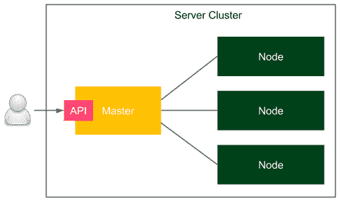
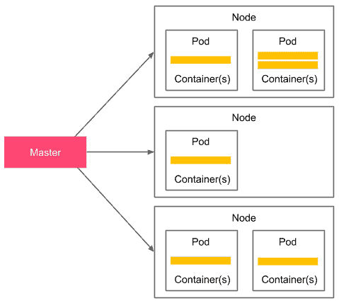
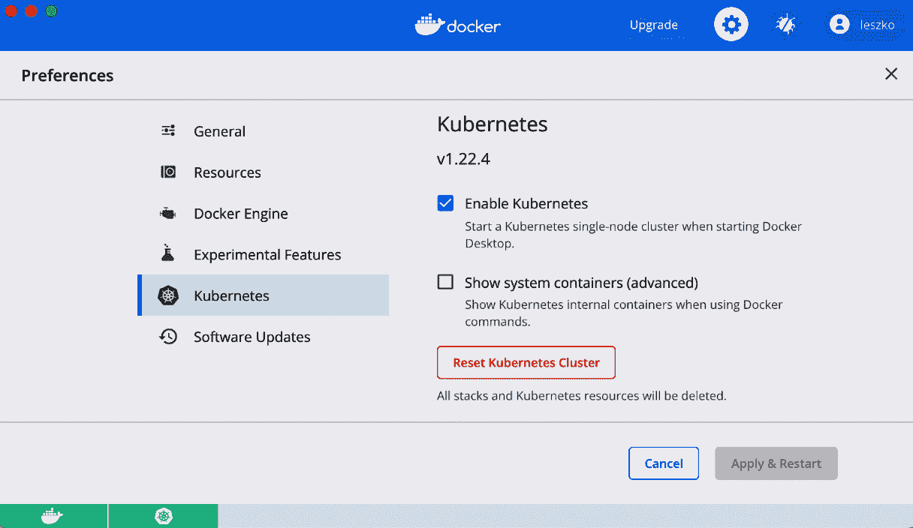
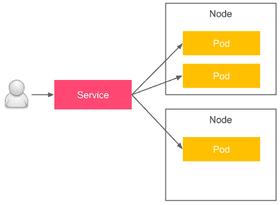
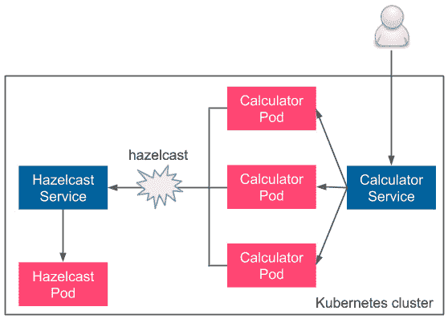
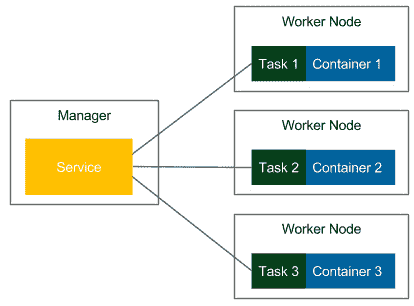
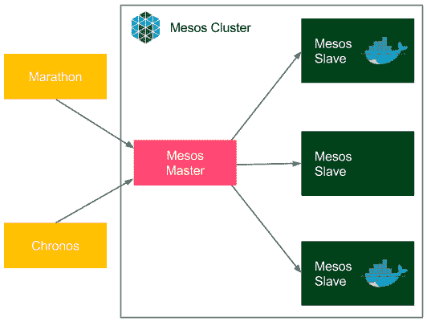
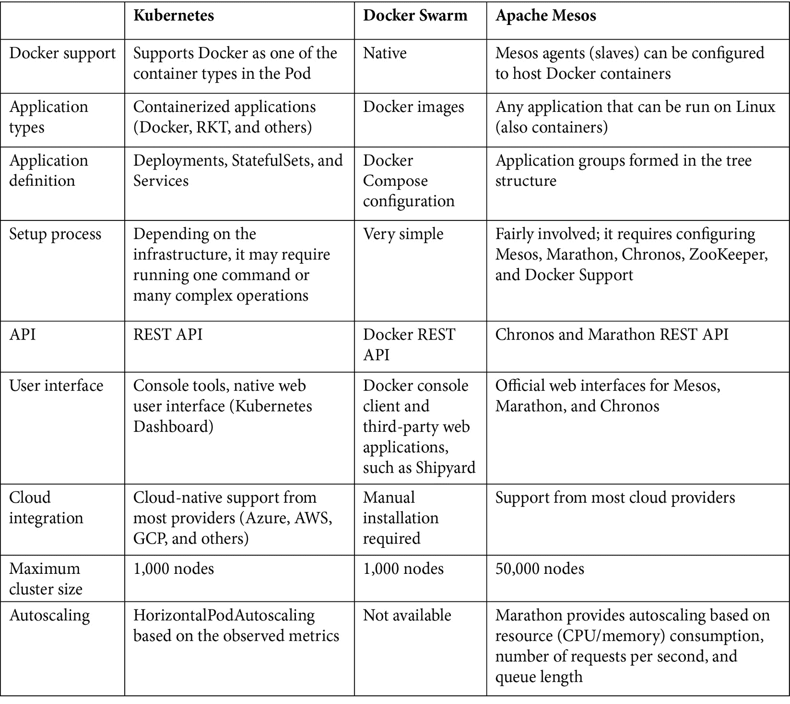

# 第六章： 使用 Kubernetes 进行集群管理

到目前为止，本书已涵盖了验收测试过程的基础知识。本章中，我们将看到如何将 Docker 环境从单一 Docker 主机转换为一组机器的集群，以及如何将独立的应用程序变为由多个应用程序组成的系统。

本章将涵盖以下主题：

+   服务器集群

+   介绍 Kubernetes

+   Kubernetes 安装

+   使用 Kubernetes

+   高级 Kubernetes

+   应用程序依赖关系

+   替代的集群管理系统

# 技术要求

本章中，您需要满足以下硬件/软件要求才能跟随本章中的说明进行操作：

+   至少 4 GB 的 RAM

+   至少 1 GB 的可用磁盘空间

+   Java JDK 8+

本章中所有示例和练习的解决方案可以在本书的 GitHub 仓库中找到，网址为[`github.com/PacktPublishing/Continuous-Delivery-With-Docker-and-Jenkins-3rd-Edition/tree/main/Chapter06`](https://github.com/PacktPublishing/Continuous-Delivery-With-Docker-and-Jenkins-3rd-Edition/tree/main/Chapter06)。

本章的代码实战视频可以在[`bit.ly/3rcffcz`](https://bit.ly/3rcffcz)观看。

# 服务器集群

到目前为止，我们已经分别与每台机器进行过交互。我们所做的是连接到`localhost` Docker 守护进程服务器。我们本可以在`docker run`命令中使用`-H`选项来指定远程 Docker 的地址，但那仍然意味着将应用程序部署到单一的 Docker 主机上。然而，在实际生活中，如果服务器共享相同的物理位置，我们并不关心服务部署在哪一台具体的机器上。我们需要做的是让它可访问，并在多个实例中进行复制，以支持高可用性。*我们如何配置一组机器让它们以这种方式工作？* 这就是集群的作用。

在接下来的子章节中，您将了解服务器集群的概念，以及 Kubernetes 环境，这是一个集群管理软件的示例。

## 介绍服务器集群

服务器集群是一组连接在一起的计算机，它们协同工作，可以像单一系统一样使用。服务器通常通过局域网连接，连接速度足够快，以确保运行的服务可以分布式处理。下图展示了一个简单的服务器集群：



图 6.1 – 服务器集群

用户通过主机访问集群，主机暴露集群 API。集群中有多个节点作为计算资源，负责运行应用程序。而主机则负责其他所有活动，例如编排过程、服务发现、负载均衡和节点故障检测。

# 介绍 Kubernetes

Kubernetes 是一个开源的集群管理系统，最初由 Google 设计。从流行度的图表来看，它在其他竞争者（如 Docker Swarm 和 Apache Mesos）中遥遥领先。它的流行度增长非常迅速，以至于大多数云平台都直接提供 Kubernetes。它不是 Docker 原生的，但有许多附加工具和集成可以使其与整个 Docker 生态系统顺畅配合；例如，**kompose** 可以将 Docker Compose 文件转换为 Kubernetes 配置。

信息

在本书的第一版中，我推荐使用 Docker Compose 和 Docker Swarm 来解决应用依赖关系和服务器集群问题。虽然这两个工具都很好，但 Kubernetes 最近的流行度如此之高，以至于我决定将 Kubernetes 作为推荐的方法，并将 Docker 原生工具作为替代方案。

让我们来看看简化版的 Kubernetes 架构：



图 6.2 – 简化版 Kubernetes 架构

Kubernetes `8080`) 和控制平面负责实现这一目标。另一方面，Kubernetes 节点是一个工作节点。你可以把它看作是一个（Docker）容器主机，安装了一个特殊的 Kubernetes 进程（称为 `kubelet`）。

从用户的角度来看，你提供一个声明式的部署配置，形式为 YAML 文件，并通过其 API 将该文件传递给 Kubernetes 控制平面。然后，控制平面读取配置并安装部署。Kubernetes 引入了 **Pod** 的概念，表示一个单独的部署单元。Pod 包含 Docker **容器**，这些容器一起调度。虽然你可以将多个容器放入一个 Pod，但在实际场景中，大多数 Pod 通常只包含一个 Docker 容器。Pods 会根据 YAML 配置文件更新中表达的需求变化动态创建和删除。

在本章后续部分，你将获得更多关于 Kubernetes 的实际知识，但首先，让我们列举出使 Kubernetes 成为如此出色的环境的一些特性。

## Kubernetes 特性概述

Kubernetes 提供了许多有趣的特性。让我们来看看其中最重要的一些：

+   **容器负载均衡**：Kubernetes 负责 Pods 在节点上的负载均衡；你指定应用副本的数量，Kubernetes 会处理其余部分。

+   **流量负载均衡**：当你有多个应用副本时，Kubernetes 服务可以进行流量负载均衡。换句话说，你创建一个具有单一 IP（或 DNS）的服务，Kubernetes 会处理将流量负载均衡到你的应用副本。

+   **动态水平扩展**：每个部署可以动态地进行扩展或缩减；你指定应用实例的数量（或自动扩展的规则），Kubernetes 会启动/停止 Pod 副本。

+   **故障恢复**：Pods（和节点）会持续被监控，如果其中任何一个失败，新的 Pods 会被启动，以确保声明的副本数保持不变。

+   **滚动更新**：配置的更新可以逐步应用；例如，如果我们有 10 个副本并希望进行更改，可以在每个副本的部署之间定义一个延迟。在这种情况下，当出现问题时，我们永远不会遇到副本无法正常工作的情况。

+   **存储编排**：Kubernetes 可以将你选择的存储系统挂载到你的应用程序上。Pod 是无状态的，因此 Kubernetes 与多个存储提供商集成，例如 Amazon **Elastic Block Storage** (**EBS**)、**Google Compute Engine** (**GCE**) 持久磁盘和 Azure 数据存储。

+   **服务发现**：Kubernetes Pods 本质上是短暂的，它们的 IP 动态分配，但 Kubernetes 提供了基于 DNS 的服务发现机制。

+   **随处运行**：Kubernetes 是一个开源工具，你可以选择多种方式来运行它：本地部署、云基础设施或混合部署。

既然我们对 Kubernetes 有了一些背景了解，接下来让我们看看它在实践中的表现，从安装过程开始。

# Kubernetes 安装

Kubernetes 就像 Docker 一样，由两部分组成：客户端和服务器端。客户端是一个名为`kubectl`的命令行工具，它通过 Kubernetes API 连接到服务器端。服务器端要复杂得多，正如我们在上一节所描述的那样。显然，要使用 Kubernetes 执行任何操作，你需要这两部分，因此我们将逐一描述它们，从客户端开始。

## Kubernetes 客户端

Kubernetes 客户端 `kubectl` 是一个命令行应用程序，允许你对 Kubernetes 集群执行操作。安装过程取决于你的操作系统。你可以在 Kubernetes 官方网站上查看详细信息：[`kubernetes.io/docs/tasks/tools/`](https://kubernetes.io/docs/tasks/tools/)。

在你成功安装了 `kubectl` 之后，你应该能够执行以下命令：

```
$ kubectl version --client
Client Version: version.Info{Major:"1", Minor:"22", GitVersion:"v1.22.4", ...
```

现在你已经配置了 Kubernetes 客户端，我们可以继续设置服务器部分。

## Kubernetes 服务器

设置 Kubernetes 服务器有多种方式。你应该使用哪种方式取决于你的需求，但如果你完全是 Kubernetes 的新手，我建议从本地环境开始。

### 本地环境

尽管 Kubernetes 本身是一个复杂的集群系统，但有一些工具可以简化你的本地开发环境。让我们逐一了解你可以使用的选项，包括 Docker Desktop、kind 和 minikube。

#### Docker Desktop

Docker Desktop 是一个应用程序，用于在 macOS 或 Windows 上设置本地 Docker 环境。如你从前面的章节中可能记得，Docker 守护进程只能在 Linux 上本地运行，因此在其他操作系统上，你需要在虚拟机上运行它。Docker Desktop 提供了一种超级直观的方式来实现这一点，幸运的是，它还支持创建 Kubernetes 集群。

如果你已安装 Docker Desktop，那么你需要做的就是检查`kubectl`是否已配置：



图 6.3 – 在 Docker Desktop 中使用 Kubernetes

从这一点开始，你已经准备好使用 Kubernetes 集群了。

#### kind

如果你使用的是 Linux 操作系统，并且不能或不想使用 Docker Desktop，那么你第二简单的选择是**kind**（即**Kubernetes in Docker**的缩写）。它是一个工具，唯一的要求是安装并配置 Docker。

安装完 kind 后，你可以通过以下一条命令启动并配置本地 Kubernetes 集群：

```
$ kind create cluster
```

信息

你可以查看 kind 的安装步骤，网址是[`kind.sigs.k8s.io/docs/user/quick-start/`](https://kind.sigs.k8s.io/docs/user/quick-start/)。

#### minikube

minikube 是一个命令行工具，可以在虚拟机内启动一个功能完备的 Kubernetes 环境。它由虚拟机监控程序支持，因此你需要安装 VirtualBox、Hyper-V、VMware 或类似的工具。安装 minikube 的说明取决于你的操作系统，你可以在[`minikube.sigs.k8s.io/docs/start/`](https://minikube.sigs.k8s.io/docs/start/)找到每个操作系统的安装指南。

信息

minikube 是一个开源工具，你可以在 GitHub 上找到它，网址是[`github.com/kubernetes/minikube`](https://github.com/kubernetes/minikube)。

在你成功安装 minikube 后，你可以通过以下命令启动 Kubernetes 集群：

```
$ minikube start
```

minikube 启动一个 Kubernetes 集群，并自动配置你的 Kubernetes 客户端，包含集群 URL 和凭证，这样你就可以直接进入*验证 Kubernetes 配置*部分。

### 云平台

Kubernetes 已经变得非常流行，几乎所有的云计算平台都将其作为一项服务提供。这里的领导者是**Google Cloud Platform**（**GCP**），它允许你在几分钟内创建一个 Kubernetes 集群。其他云平台，如 Microsoft Azure、**Amazon Web Services**（**AWS**）和 IBM Cloud，也将 Kubernetes 纳入其产品组合。让我们仔细看看三大最受欢迎的解决方案——**GCP**、**Azure**和**AWS**。

#### Google Cloud Platform

你可以访问 GCP，网址是[`cloud.google.com/`](https://cloud.google.com/)。创建账户后，你应该能够打开他们的 Web 控制台（[`console.cloud.google.com`](https://console.cloud.google.com)）。他们的产品组合中有一个服务叫做**Google Kubernetes Engine**（**GKE**）。

你可以通过点击用户界面或使用 GCP 命令行工具`gcloud`来创建 Kubernetes 集群。

信息

你可以在官方 GCP 网站上查看如何在你的操作系统上安装 `gcloud`：[`cloud.google.com/sdk/docs/install`](https://cloud.google.com/sdk/docs/install)。

要使用命令行工具创建 Kubernetes 集群，只需执行以下命令：

```
$ gcloud container clusters create test-cluster
```

除了创建 Kubernetes 集群外，它还会自动配置`kubectl`。

#### 微软 Azure

微软 Azure 还通过**Azure Kubernetes 服务**（**AKS**）提供了一个非常快速的 Kubernetes 设置。像 GCP 一样，你可以使用 web 界面或命令行工具来创建集群。

信息

你可以访问 Azure Web 控制台：[`portal.azure.com/`](https://portal.azure.com/)。要安装 Azure 命令行工具，请查看其官方网站的安装指南：[`docs.microsoft.com/en-us/cli/azure/install-azure-cli`](https://docs.microsoft.com/en-us/cli/azure/install-azure-cli)。

要使用 Azure 命令行工具创建 Kubernetes 集群，假设你已经创建了一个 Azure 资源组，只需运行以下命令：

```
$ az aks create -n test-cluster -g test-resource-group
```

几秒钟后，你的 Kubernetes 集群应该准备就绪。要配置 `kubectl`，运行以下命令：

```
$ az aks get-credentials -n test-cluster -g test-resource-group
```

通过这样做，你将成功设置一个 Kubernetes 集群并配置好 `kubectl`。

#### 亚马逊网络服务

AWS 提供了一种托管的 Kubernetes 服务，称为 Amazon **弹性 Kubernetes 服务**（**EKS**）。你可以通过访问 AWS Web 控制台：[`console.aws.amazon.com/eks`](https://console.aws.amazon.com/eks) 或使用 AWS 命令行工具开始使用它。

信息

你可以在 AWS 命令行工具的官方网站查看所有信息（包括安装指南）：[`docs.aws.amazon.com/cli/`](https://docs.aws.amazon.com/cli/)。

正如你所看到的，使用云中的 Kubernetes 是一个相对简单的选择。然而，有时你可能需要从头开始在自己的服务器上安装本地 Kubernetes 环境。我们将在下一节讨论这个问题。

### 本地部署

如果你不想依赖云平台，或者你的公司安全政策不允许使用云平台，那么从头开始在自己的服务器上安装 Kubernetes 是有意义的。安装过程相对复杂，超出了本书的范围，但你可以在官方文档中找到所有细节：[`kubernetes.io/docs/setup/production-environment/`](https://kubernetes.io/docs/setup/production-environment/)。

现在我们已经配置好了 Kubernetes 环境，可以检查 `kubectl` 是否已正确连接到集群，并准备好开始部署应用程序。

## 验证 Kubernetes 配置

无论你选择哪种 Kubernetes 服务器安装方式，你应该已经完成所有配置，并且 Kubernetes 客户端应该已经填充了集群的 URL 和凭证。你可以通过以下命令来检查：

```
$ kubectl cluster-info
Kubernetes control plane is running at https://kubernetes.docker.internal:6443
CoreDNS is running at https://kubernetes.docker.internal:6443/api/v1/namespaces/kube-system/services/kube-dns:dns/proxy
```

这是 Docker Desktop 场景下的输出，正因如此你能看到`localhost`。你的输出可能略有不同，且可能包含更多条目。如果没有看到错误信息，那么一切都是正确的，我们可以开始使用 Kubernetes 来运行应用程序。

# 使用 Kubernetes

我们已经准备好了整个 Kubernetes 环境，并配置了`kubectl`。这意味着是时候展示 Kubernetes 的强大功能，部署我们的第一个应用程序了。我们将使用前几章中构建的`leszko/calculator` Docker 镜像，并在 Kubernetes 上启动多个副本。

## 部署应用程序

为了在 Kubernetes 上启动 Docker 容器，我们需要准备一个部署配置文件，格式为 YAML。我们将其命名为`deployment.yaml`：

```
apiVersion: apps/v1
kind: Deployment                 (1)
metadata:
  name: calculator-deployment    (2)
  labels:
    app: calculator
spec:
  replicas: 3                    (3)
  selector:                      (4)
    matchLabels:
      app: calculator
  template:                      (5)
    metadata:
      labels:                    (6)
        app: calculator
    spec:
      containers:
      - name: calculator         (7)
        image: leszko/calculator (8)
        ports:                   (9)
        - containerPort: 8080
```

在这个 YAML 配置中，我们需要确保以下几点：

1.  我们已经定义了一个类型为`Deployment`的 Kubernetes 资源，使用的是`apps/v1` Kubernetes API 版本。

1.  唯一的部署名称是`calculator-deployment`。

1.  我们已经定义了应该创建正好`3`个相同的 Pod。

1.  `selector`定义了`Deployment`如何找到需要管理的 Pod，在这个例子中，仅通过标签来进行查找。

1.  `template`定义了每个创建的 Pod 的规格。

1.  每个 Pod 都被标记为`app: calculator`。

1.  每个 Pod 都包含一个名为`calculator`的 Docker 容器。

1.  从名为`leszko/calculator`的镜像创建了一个 Docker 容器。

1.  该 Pod 暴露了容器端口`8080`。

要安装部署，请运行以下命令：

```
$ kubectl apply -f deployment.yaml
```

你可以检查是否已经创建了包含一个 Docker 容器的三个 Pod：

```
$ kubectl get pods
NAME                                  READY STATUS  RESTARTS AGE
calculator-deployment-dccdf8756-h2l6c 1/1   Running 0        1m
calculator-deployment-dccdf8756-tgw48 1/1   Running 0        1m
calculator-deployment-dccdf8756-vtwjz 1/1   Running 0        1m
```

每个 Pod 都运行一个 Docker 容器。我们可以使用以下命令来检查它的日志：

```
$ kubectl logs pods/calculator-deployment-dccdf8756-h2l6c
```

你应该能看到熟悉的 Spring logo 和我们 Calculator web 服务的日志。

信息

要查看`kubectl`命令的概述，请查看官方指南：[`kubernetes.io/docs/reference/kubectl/overview/`](https://kubernetes.io/docs/reference/kubectl/overview/)。

我们刚刚完成了第一次 Kubernetes 部署，通过几行代码，我们创建了三个副本的 Calculator web 服务应用程序。现在，让我们看看如何使用我们部署的应用程序。为此，我们需要了解 Kubernetes Service 的概念。

## 部署 Kubernetes Service

每个 Pod 在 Kubernetes 内部网络中都有一个 IP 地址，这意味着你已经可以从同一 Kubernetes 集群中运行的其他 Pod 访问每个 Calculator 实例。但是，*我们如何从外部访问我们的应用程序呢？* 这正是 Kubernetes Service 的作用。

Pod 和 Service 的概念是，Pod 是有生命的——它们会被终止，然后重新启动。Kubernetes 调度器只关心正确数量的 Pod 副本，而不是 Pod 的身份。这就是为什么，即使每个 Pod 都有一个（内部）IP 地址，我们也不应该依赖它或使用它。而 Service 则充当 Pod 的前端。它们有可供使用的 IP 地址（和 DNS 名称）。让我们看一下以下图示，展示了 Pod 和 Service 的概念：



图 6.4 – Kubernetes Pod 和 Service

Pod 实际上分布在不同的节点上，但您不需要担心这一点，因为 Kubernetes 会处理正确的调度，并引入 Pod 和 Service 的抽象。用户访问 Service，Service 会在 Pod 副本之间进行流量负载均衡。让我们看一个如何为我们的计算器应用创建服务的示例。

就像我们为部署所做的一样，我们从一个 YAML 配置文件开始。我们将其命名为 `service.yaml`：

```
apiVersion: v1
kind: Service
metadata:
  name: calculator-service
spec:
  type: NodePort
  selector:
    app: calculator
  ports:
  - port: 8080
```

这是一个简单的服务配置，它将流量负载均衡到所有符合我们在 `selector` 中提到的条件的 Pod。要安装该服务，请运行以下命令：

```
$ kubectl apply -f service.yaml
```

然后，您可以通过运行以下命令来检查服务是否已正确部署：

```
$ kubectl get service calculator-service
NAME               TYPE     CLUSTER-IP    EXTERNAL-IP PORT(S)        AGE
calculator-service NodePort 10.19.248.154 <none>     8080:32259/TCP 13m
```

要检查该服务是否指向我们在上一节中创建的三个 Pod 副本，请运行以下命令：

```
$ kubectl describe service calculator-service | grep Endpoints
Endpoints: 10.16.1.5:8080,10.16.2.6:8080,10.16.2.7:8080
```

从我们运行的最后两条命令中，我们可以看到该服务在 `10.19.248.154` 的 IP 地址下可用，并将流量负载均衡到三个 IP 地址分别为 `10.16.1.5`、`10.16.2.6` 和 `10.16.2.7` 的 Pod。所有这些 IP 地址，无论是服务还是 Pod，都是 Kubernetes 集群网络内部的。

信息

要了解更多关于 Kubernetes 服务的信息，请访问 Kubernetes 官方网站：[`kubernetes.io/docs/concepts/services-networking/service/`](https://kubernetes.io/docs/concepts/services-networking/service/)。

在下一节中，我们将探讨如何从 Kubernetes 集群外部访问服务。

## 曝露应用

要了解您的应用如何从外部访问，我们需要从 Kubernetes 服务类型开始。您可以使用四种不同的服务类型，如下所示：

+   **ClusterIP（默认）**：该服务仅具有内部 IP 地址。

+   `<NODE-IP>:<NODE-PORT>`。

+   **LoadBalancer**：创建一个外部负载均衡器，并为该服务分配一个单独的外部 IP 地址。您的 Kubernetes 集群必须支持外部负载均衡器，在云平台中通常没有问题，但如果您使用 minikube，可能无法正常工作。

+   `externalName` 在规格说明中）。

如果你使用的是部署在云平台上的 Kubernetes 实例（例如，GKE），那么暴露服务的最简单方法是使用 `kubectl get service` 命令。如果我们在配置中使用了它，那么你就可以通过 `http://<EXTERNAL-IP>:8080` 访问 Calculator 服务。

虽然 LoadBalancer 似乎是最简单的解决方案，但它有两个缺点：

+   首先，它并不总是可用的，例如，如果你在本地部署了 Kubernetes 或使用了 minikube。

+   其次，外部公共 IP 通常比较昂贵。另一种解决方案是使用 `NodePort` 服务，正如我们在前面一节中所做的那样。

现在，让我们来看一下如何访问我们的服务。

我们可以重复我们已经执行过的相同命令：

```
$ kubectl get service calculator-service
NAME               TYPE     CLUSTER-IP    EXTERNAL-IP  PORT(S)        AGE
calculator-service NodePort 10.19.248.154 <none>       8080:32259/TCP 13m
```

你可以看到端口 `32259` 被选作节点端口。这意味着我们可以通过该端口和任何 Kubernetes 节点的 IP 来访问我们的 Calculator 服务。

你的 Kubernetes 节点的 IP 地址取决于你的安装方式。如果你使用的是 Docker Desktop，那么你的节点 IP 是 `localhost`。如果是 minikube，你可以通过 `minikube ip` 命令来查看它。在云平台或本地安装的情况下，你可以使用以下命令查看 IP 地址：

```
$ kubectl get nodes -o jsonpath='{ $.items[*].status.addresses[?(@.type=="ExternalIP")].address }'
35.192.180.252 35.232.125.195 104.198.131.248
```

要检查你是否能从外部访问 Calculator，请运行以下命令：

```
$ curl <NODE-IP>:32047/sum?a=1\&b=2
3
```

我们向其中一个 Calculator 容器实例发出了 HTTP 请求，它返回了正确的响应，这意味着我们已经成功地在 Kubernetes 上部署了应用程序。

小提示

`kubectl` 命令提供了一种快捷方式，可以在不使用 YAML 的情况下创建服务。你可以执行以下命令，而不是使用我们之前的配置：

`$ kubectl expose deployment calculator-deployment --type=NodePort --name=calculator-service`。

我们刚刚学到的内容为我们提供了 Kubernetes 的必要基础。现在我们可以将其用于暂存和生产环境，从而将其纳入持续交付过程。然而，在我们这么做之前，让我们再看看一些使 Kubernetes 成为一个伟大且有用工具的其他功能。

# 高级 Kubernetes

Kubernetes 提供了一种在运行时动态修改部署的方法。这一点尤其重要，如果你的应用程序已经在生产环境中运行，并且你需要支持零停机时间的部署。首先，让我们看看如何扩展应用程序，然后介绍 Kubernetes 在任何部署更改中的通用方法。

## 扩展应用程序

假设我们的 Calculator 应用程序开始流行起来。人们开始使用它，流量大到三个 Pod 副本都超载了。*我们现在该怎么办？*

幸运的是，`kubectl` 提供了一种简单的方法来使用 `scale` 关键字扩展和缩减部署。让我们将我们的 Calculator 部署扩展到 `5` 个实例：

```
$ kubectl scale --replicas 5 deployment calculator-deployment
```

就这样，我们的应用程序现在已经扩展：

```
$ kubectl get pods
NAME                                  READY STATUS  RESTARTS AGE
calculator-deployment-dccdf8756-h2l6c 1/1   Running 0        19h
calculator-deployment-dccdf8756-j87kg 1/1   Running 0        36s
calculator-deployment-dccdf8756-tgw48 1/1   Running 0        19h
calculator-deployment-dccdf8756-vtwjz 1/1   Running 0        19h
calculator-deployment-dccdf8756-zw748 1/1   Running 0        36s
```

请注意，从现在开始，我们创建的服务会将流量负载均衡到所有 `5` 个 Calculator Pod 上。还要注意，你甚至不需要担心每个 Pod 运行在哪台物理机器上，因为 Kubernetes 编排器已经涵盖了这一点。你只需要考虑应用实例的目标数量。

信息

Kubernetes 还提供了一种根据其指标自动扩展 Pod 的方法。这个功能叫做 **HorizontalPodAutoscaler**，你可以在[`kubernetes.io/docs/tasks/run-application/horizontal-pod-autoscale/`](https://kubernetes.io/docs/tasks/run-application/horizontal-pod-autoscale/)了解更多信息。

我们刚刚看到如何扩展应用程序。现在，让我们更广泛地了解如何更新 Kubernetes 部署的任何部分。

## 更新应用程序

Kubernetes 会处理部署更新。让我们修改 `deployment.yaml` 文件，并向 Pod 模板中添加一个新标签：

```
apiVersion: apps/v1
kind: Deployment
metadata:
  name: calculator-deployment
  labels:
    app: calculator
spec:
  replicas: 5
  selector:
    matchLabels:
      app: calculator
  template:
    metadata:
      labels:
        app: calculator
        label: label
    spec:
      containers:
      - name: calculator
        image: leszko/calculator
        ports:
        - containerPort: 8080
```

现在，如果我们重复这个操作并应用相同的部署，我们可以观察到 Pod 会发生什么：

```
$ kubectl apply -f deployment.yaml
$ kubectl get pods
NAME                                   READY STATUS      RESTARTS AGE
pod/calculator-deployment-7cc54cfc58-5rs9g 1/1   Running     0    7s
pod/calculator-deployment-7cc54cfc58-jcqlx 1/1   Running     0    4s
pod/calculator-deployment-7cc54cfc58-lsh7z 1/1   Running     0    4s
pod/calculator-deployment-7cc54cfc58-njbbc 1/1   Running     0    7s
pod/calculator-deployment-7cc54cfc58-pbthv 1/1   Running     0    7s
pod/calculator-deployment-dccdf8756-h2l6c  0/1   Terminating 0    20h
pod/calculator-deployment-dccdf8756-j87kg  0/1   Terminating 0    18m
pod/calculator-deployment-dccdf8756-tgw48  0/1   Terminating 0    20h
pod/calculator-deployment-dccdf8756-vtwjz  0/1   Terminating 0    20h
pod/calculator-deployment-dccdf8756-zw748  0/1   Terminating 0    18m
```

我们可以看到，Kubernetes 终止了所有旧的 Pod 并启动了新的 Pod。

信息

在我们的示例中，我们修改的是 YAML 配置中的部署，而不是应用程序本身。然而，修改应用程序实际上是一样的。如果我们对应用程序的源代码进行任何更改，我们需要构建一个新的 Docker 镜像并更新 `deployment.yaml` 中的版本。

每次你更改某些内容并运行 `kubectl apply` 时，Kubernetes 会检查现有状态与 YAML 配置之间是否存在变化，然后如果需要，它会执行我们之前描述的更新操作。

这一切都很好，但如果 Kubernetes 突然终止所有 Pod，我们可能会陷入一种情况：所有旧的 Pod 都已经被杀死，但新的 Pod 还没有准备好。这将导致我们的应用程序暂时不可用。*如何确保零停机时间的部署？* 这就是滚动更新的作用。

## 滚动更新

滚动更新意味着逐步终止旧的实例并启动新的实例。换句话说，工作流程如下：

1.  终止一个旧的 Pod。

1.  启动一个新的 Pod。

1.  等待直到新的 Pod 准备好。

1.  重复 *第 1 步*，直到所有旧实例被替换。

    信息

    滚动更新的概念只有在新版本的应用程序与旧版本的应用程序向后兼容时才有效。否则，我们可能会面临两个不兼容的版本同时存在的风险。

要配置它，我们需要在部署中添加 `RollingUpdate` 策略，并指定 `readinessProbe`，这让 Kubernetes 知道 Pod 何时准备就绪。让我们修改 `deployment.yaml`：

```
apiVersion: apps/v1
kind: Deployment
metadata:
  name: calculator-deployment
  labels:
    app: calculator
spec:
  replicas: 5
  strategy:
    type: RollingUpdate
    rollingUpdate:
      maxUnavailable: 25%
      maxSurge: 0
  selector:
    matchLabels:
      app: calculator
  template:
    metadata:
      labels:
        app: calculator
    spec:
      containers:
      - name: calculator
        image: leszko/calculator
        ports:
        - containerPort: 8080
        readinessProbe:
          httpGet:
             path: /sum?a=1&b=2
             port: 8080
```

让我们解释一下我们在配置中使用的参数：

+   `maxUnavailable`：在更新过程中可以不可用的最大 Pods 数量；在我们的例子中，Kubernetes 在 Pod 数量大于一个时，不会同时终止多个 Pods（*75%* ** 5* 所需副本）。

+   `maxSurge`：可以创建的 Pods 数量，超过所需 Pods 的数量；在我们的例子中，Kubernetes 在终止旧 Pods 之前不会创建新的 Pods。

+   `path` 和 `port`：检查容器是否准备就绪的端点；一个 HTTP `GET` 请求会被发送到 `<POD-IP>:8080/sum?a=1&b=2`，当它最终返回 `200` HTTP 状态码时，Pod 将被标记为 *就绪*。

    提示

    通过修改 `maxUnavailable` 和 `maxSurge` 参数，我们可以决定是 Kubernetes 首先启动新的 Pods 然后终止旧的 Pods，还是像我们做的那样，先终止旧的 Pods 然后再启动新的 Pods。

现在我们可以应用部署并观察 Pods 一一更新：

```
$ kubectl apply -f deployment.yaml
$ kubectl get pods
NAME                                   READY STATUS      RESTARTS AGE
calculator-deployment-78fd7b57b8-npphx 0/1   Running     0        4s
calculator-deployment-7cc54cfc58-5rs9g 1/1   Running     0        3h
calculator-deployment-7cc54cfc58-jcqlx 0/1   Terminating 0        3h
calculator-deployment-7cc54cfc58-lsh7z 1/1   Running     0        3h
calculator-deployment-7cc54cfc58-njbbc 1/1   Running     0        3h
calculator-deployment-7cc54cfc58-pbthv 1/1   Running     0        3h
```

就是这样，我们已经为我们的计算器部署配置了滚动更新，这意味着我们可以提供零停机时间的发布。

信息

Kubernetes 还提供了一种不同的应用程序运行方式。你可以使用 `StatefulSet` 代替 `Deployment`，这样滚动更新将始终启用（即使没有指定任何额外的策略）。

滚动更新在持续交付的背景下尤其重要，因为如果我们频繁部署，就绝对不能承受任何停机时间。

提示

在玩 Kubernetes 后，进行清理以删除我们创建的所有资源是很好的做法。在我们的例子中，我们可以执行以下命令来删除我们创建的服务和部署：

`$ kubectl delete -f service.yaml`

`$ kubectl delete -f deployment.yaml`

我们已经展示了所有 Kubernetes 中用于持续交付过程的功能。让我们做一个简短的总结，并简要介绍其他有用的功能。

## Kubernetes 对象和工作负载

Kubernetes 中的执行单元始终是 Pod，它包含一个或多个（Docker）容器。有多种不同的资源类型来编排 Pods：

+   **Deployment**：这是最常见的工作负载，它管理所需副本 Pods 的生命周期。

+   **StatefulSet**：这是一个专门的 Pod 控制器，它保证 Pods 的顺序和唯一性。它通常与面向数据的应用程序关联（在这种情况下，仅仅说 *我需要 3 个副本* 并不够，就像 Deployment 中的情况，而是 *我想要 3 个副本，始终保持相同的可预测 Pod 名称，并且总是按相同顺序启动*）。

+   **DaemonSet**：这是一个专门的 Pod 控制器，它在每个 Kubernetes 节点上运行一个 Pod 的副本。

+   **Job/CronJob**：这是一个专门针对任务操作的工作流，其中容器预计能够成功存在。

    信息

    你可能还会看到一个 Kubernetes 资源叫做 **ReplicationController**，它已经被弃用，并由 Deployment 取代。

除了 Pod 管理，Kubernetes 还有其他对象。以下是你可能经常遇到的最有用的对象：

+   **服务**：充当 Pod 内部负载均衡器的组件。

+   **ConfigMap**：这将配置与镜像内容解耦；它可以是任何与镜像分开定义的数据，然后挂载到容器的文件系统中。

+   **Secret**：这允许你存储敏感信息，如密码。

+   **PersistentVolume/PersistentVolumeClaim**：这些允许你将持久卷挂载到（无状态的）容器文件系统中。

事实上，还有更多的对象可用，甚至可以创建自己的资源定义。然而，我们在这里提到的这些是实践中最常用的。

我们已经对 Kubernetes 中的集群有了很好的理解，但 Kubernetes 不仅仅是关于工作负载和扩展。它还可以帮助解决应用程序之间的依赖关系。在接下来的部分，我们将探讨这个话题，并描述在 Kubernetes 和持续交付过程中应用程序的依赖关系。

# 应用程序依赖项

没有依赖的生活很轻松。然而，在现实生活中，几乎每个应用程序都会连接到数据库、缓存、消息系统或其他应用程序。在（微）服务架构中，每个服务都需要一堆其他服务来完成工作。单体架构并没有消除这个问题——一个应用程序通常至少会有一些依赖项，至少是数据库。

想象一下一个新人加入你的开发团队；*设置整个开发环境并运行所有依赖项的应用程序需要多少时间？*

当谈到自动化验收测试时，依赖问题不再仅仅是一个便利问题——它变成了一个必要条件。在单元测试中，我们可以模拟依赖项，但验收测试套件需要一个完整的环境。*我们如何快速并可重复地设置它？* 幸运的是，Kubernetes 可以通过其内建的 DNS 解析功能帮助我们解决这个问题，适用于服务和 Pod。

## Kubernetes DNS 解析

让我们通过一个现实场景来展示 Kubernetes DNS 解析。假设我们想将一个缓存服务作为一个独立的应用程序部署，并让它对其他服务可用。最好的内存缓存解决方案之一是 Hazelcast，因此我们在这里使用它。对于计算器应用程序，我们需要 `Deployment` 和 `Service`。让我们将它们都定义在一个文件中，`hazelcast.yaml`：

```
apiVersion: apps/v1
kind: Deployment
metadata:
  name: hazelcast
  labels:
    app: hazelcast
spec:
  replicas: 1
  selector:
    matchLabels:
      app: hazelcast
  template:
    metadata:
      labels:
        app: hazelcast
    spec:
      containers:
      - name: hazelcast
        image: hazelcast/hazelcast:5.0.2
        ports:
        - containerPort: 5701
---
apiVersion: v1
kind: Service
metadata:
  name: hazelcast
spec:
  selector:
    app: hazelcast
  ports:
  - port: 5701
```

类似于我们之前为计算器应用程序所做的，我们现在将定义 Hazelcast 配置。我们以相同的方式开始：

```
$ kubectl apply -f hazelcast.yaml
```

几秒钟后，Hazelcast 缓存应用程序应该启动。你可以通过 `kubectl logs` 命令查看其 Pod 日志。我们还创建了一个默认类型的服务（`ClusterIP`，仅在同一 Kubernetes 集群内暴露）。

到目前为止，一切顺利——我们与计算器应用程序中的操作没有什么不同。现在进入最有趣的部分。Kubernetes 提供了一种使用服务名称解析服务 IP 的方式。更有意思的是，我们事先就知道了 `Service` 的名称——在我们的案例中，它始终是 `hazelcast`。所以，如果我们在应用程序中使用它作为缓存地址，依赖关系将被自动解析。

信息

实际上，Kubernetes 的 DNS 解析功能更强大，它甚至可以解析不同 Kubernetes 命名空间中的服务。详情请阅读 [`kubernetes.io/docs/concepts/services-networking/dns-pod-service/`](https://kubernetes.io/docs/concepts/services-networking/dns-pod-service/)。

在向你展示如何在计算器应用程序中实现缓存之前，让我们先概览一下我们将构建的系统。

## 多应用系统概览

我们已经在 Kubernetes 上部署了 Hazelcast 服务器。在修改我们的计算器应用程序之前，以便能够将其用作缓存提供者，让我们先来看一下我们要构建的完整系统的示意图：



图 6.5 – 示例多应用部署

用户使用 `hazelcast`）。**Hazelcast 服务** 将重定向到 **Hazelcast Pod**。

如果你查看图示，可以看到我们刚刚部署了 Hazelcast 部分（**Hazelcast 服务** 和 **Hazelcast Pod**）。我们也在上一节中部署了计算器部分（**Calculator 服务** 和 **Calculator Pod**）。最后缺失的部分是计算器代码，来使用 Hazelcast。现在让我们来实现它。

## 多应用系统实现

为了在我们的计算器应用程序中实现缓存功能，我们需要执行以下操作：

1.  将 Hazelcast 客户端库添加到 Gradle。

1.  添加 Hazelcast 缓存配置。

1.  添加 Spring Boot 缓存。

1.  构建 Docker 镜像。

让我们一步一步来。

### 将 Hazelcast 客户端库添加到 Gradle

在 `build.gradle` 文件中，将以下配置添加到 `dependencies` 部分：

```
implementation 'com.hazelcast:hazelcast:5.0.2'
```

这将添加负责与 Hazelcast 服务器通信的 Java 库。

### 添加 Hazelcast 缓存配置

将以下部分添加到 `src/main/java/com/leszko/calculator/CalculatorApplication.java` 文件中：

```
package com.leszko.calculator;
import com.hazelcast.client.config.ClientConfig;
import org.springframework.boot.SpringApplication;
import org.springframework.boot.autoconfigure.SpringBootApplication;
import org.springframework.cache.annotation.EnableCaching;
import org.springframework.context.annotation.Bean;
@SpringBootApplication
@EnableCaching
public class CalculatorApplication {
   public static void main(String[] args) {
      SpringApplication.run(CalculatorApplication.class, args);
   }
   @Bean
   public ClientConfig hazelcastClientConfig() {
      ClientConfig clientConfig = new ClientConfig();
      clientConfig.getNetworkConfig().addAddress("hazelcast");
      return clientConfig;
   }
}
```

这是一个标准的 Spring 缓存配置。请注意，对于 Hazelcast 服务器地址，我们使用 `hazelcast`，它由于 Kubernetes DNS 解析功能而自动可用。

提示

在实际应用中，如果你使用 Hazelcast，甚至不需要指定服务名称，因为 Hazelcast 提供了一个专门针对 Kubernetes 环境的自动发现插件。详情请阅读 [`docs.hazelcast.com/hazelcast/latest/deploy/deploying-in-kubernetes.html`](https://docs.hazelcast.com/hazelcast/latest/deploy/deploying-in-kubernetes.html)。

我们还需要删除 Spring Initializr 自动创建的 Spring 上下文测试，`src/test/java/com/leszko/calculator/CalculatorApplicationTests.java`。

接下来，让我们为 Spring Boot 服务添加缓存。

### 添加 Spring Boot 缓存

现在缓存已经配置好，我们终于可以将缓存添加到我们的 Web 服务中了。为此，我们需要修改`src/main/java/com/leszko/calculator/Calculator.java`文件，使其如下所示：

```
package com.leszko.calculator;
import org.springframework.cache.annotation.Cacheable;
import org.springframework.stereotype.Service;
@Service
public class Calculator {
   @Cacheable("sum")
   public int sum(int a, int b) {
      try {
         Thread.sleep(3000);
      }
      catch (InterruptedException e) {
         e.printStackTrace();
      }
      return a + b;
   }
}
```

我们添加了`@Cacheable`注解，使 Spring 自动缓存每次调用`sum()`方法。我们还添加了 3 秒钟的睡眠，仅用于测试，以便我们能够看到缓存是否正确工作。

从现在开始，求和计算会被缓存到 Hazelcast 中，当我们调用 Calculator Web 服务的`/sum`端点时，它会首先尝试从缓存中检索结果。现在，让我们构建我们的应用程序。

### 构建 Docker 镜像

下一步，我们需要删除 Spring 默认的上下文测试，`src/test/java/com/leszko/calculator/CalculatorApplicationTests.java`（以避免因缺少 Hazelcast 依赖项而导致失败）。

现在，我们可以重新构建 Calculator 应用程序及其 Docker 镜像，并使用新标签。然后，我们会将它再次推送到 Docker Hub：

```
$ ./gradlew build
$ docker build -t leszko/calculator:caching .
$ docker push leszko/calculator:caching
```

显然，你应该将`leszko`更改为你的 Docker Hub 账户。

应用程序已经准备好，所以让我们一起在 Kubernetes 上进行测试。

## 多应用系统测试

我们应该已经在 Kubernetes 上部署了 Hazelcast 缓存服务器。现在，让我们修改 Calculator 应用程序的部署，使用`leszko/calculator:caching` Docker 镜像。你需要在`deployment.yaml`文件中修改`image`：

```
image: leszko/calculator:caching
```

然后，应用 Calculator 的部署和服务：

```
$ kubectl apply -f deployment.yaml
$ kubectl apply -f service.yaml
```

让我们重复之前的`curl`操作：

```
$ curl <NODE-IP>:<NODE-PORT>/sum?a=1\&b=2
```

第一次执行时，它应该在 3 秒钟内响应，但所有后续调用应该是即时的，这意味着缓存工作正常。

提示

如果你有兴趣，你还可以查看 Calculator Pod 的日志。你应该能看到一些日志，确认应用程序已连接到 Hazelcast 服务器：

`Members [1] {`

`Member [10.16.2.15]:5701 - 3fca574b-bbdb-4c14-ac9d-73c45f56b300`

`}`

你可能已经能看到我们如何在一个多容器系统上执行验收测试了。我们所需要的只是整个系统的验收测试规范。然后，我们可以将完整的系统部署到 Kubernetes 的暂存环境中，并对其运行一系列的验收测试。我们将在*第八章*，*持续交付管道*中详细讨论这个问题。

信息

在我们的示例中，依赖服务与缓存相关，这实际上并没有改变我们在*第五章*，*自动化验收测试*中创建的功能验收测试。

这就是我们在持续交付的背景下，如何处理部署在 Kubernetes 集群上的依赖应用程序所需要了解的全部内容。然而，在我们结束这一章节之前，让我们简单谈一谈 Kubernetes 的竞争者，也就是其他流行的集群管理系统。

# 替代的集群管理系统

Kubernetes 不是唯一可以用来集群 Docker 容器的系统。尽管它目前是最受欢迎的选择，但可能会有一些合理的原因去使用不同的软件。让我们一起来了解一下其他的替代方案。

## Docker Swarm

Docker Swarm 是一个原生的 Docker 集群系统，它将一组 Docker 主机转化为一个一致的集群，称为 **swarm**。每个连接到 swarm 的主机都扮演着管理者或工作者的角色（集群中必须至少有一个管理者）。从技术上讲，机器的物理位置并不重要；然而，将所有 Docker 主机放在同一个本地网络中是合理的，否则管理操作（或在多个管理者之间达成共识）可能会花费大量时间。

信息

从 Docker 1.12 开始，Docker Swarm 原生集成进了 Docker 引擎的 swarm 模式。在旧版本中，需要在每个主机上运行 swarm 容器来提供集群功能。

让我们来看一下以下的图表，它展示了 Docker Swarm 的术语和集群过程：



图 6.6 – Docker Swarm

在 Docker Swarm 模式下，一个运行中的镜像被称为 **Service**，而与之相对的 **container** 则是在单个 Docker 主机上运行的。一个服务会运行指定数量的 **tasks**。任务是 swarm 的一个原子调度单元，它包含关于容器及其内部应该运行的命令的信息。**Replica** 是在节点上运行的每个容器。副本数量是指给定服务的所有容器的期望数量。

我们通过指定服务、Docker 镜像和副本数量开始。管理器会自动将任务分配给工作节点。显然，每个复制的容器都是从相同的 Docker 镜像运行的。在所展示的流程中，Docker Swarm 可以被看作是 Docker 引擎机制之上的一层，负责容器编排。

信息

在本书的第一版中，所有提供的示例都使用了 Docker Swarm。因此，如果 Docker Swarm 是你选择的集群系统，你可能想阅读第一版。

Kubernetes 的另一个替代方案是 Apache Mesos。现在让我们来谈谈它。

## Apache Mesos

Apache Mesos 是一个开源调度和集群系统，始于 2009 年在加利福尼亚大学伯克利分校，它比 Docker 更早诞生。它在 CPU、磁盘空间和内存上提供了一个抽象层。Mesos 的一个大优点是它支持任何 Linux 应用程序，但不一定是（Docker）容器。这就是为什么它可以将成千上万台机器组成一个集群，并用于 Docker 容器和其他程序，比如基于 Hadoop 的计算。

让我们看看下面的图示，展示了 Mesos 的架构：



图 6.7 – Apache Mesos

Apache Mesos 与其他集群系统类似，采用主从架构。它使用已在每个节点上安装的节点代理进行通信，并提供两种类型的调度器：

+   **Chronos**：用于定时任务风格的重复任务

+   **Marathon**：提供一个 REST API 来编排服务和容器

相较于其他集群系统，Apache Mesos 已经非常成熟，并且已被大量组织采纳，如 Twitter、Uber 和 CERN。

## 比较特性

Kubernetes、Docker Swarm 和 Mesos 都是集群管理系统的不错选择。它们都是免费的开源软件，并且提供了重要的集群管理功能，如负载均衡、服务发现、分布式存储、故障恢复、监控、秘密管理和滚动更新。它们也都可以在持续交付过程中使用，且没有太大差异。这是因为，在 Docker 化的基础设施中，它们都解决了同一个问题——Docker 容器的集群化。然而，这些系统并不完全相同。让我们看一下以下的表格，展示了它们之间的差异：



显然，除了 Kubernetes、Docker Swarm 和 Apache Mesos，市场上还有其他集群系统。特别是在云平台时代，存在许多流行的特定平台系统，例如 Amazon **弹性容器服务**（**ECS**）。好消息是，如果你理解了 Docker 容器集群化的思路，那么使用其他系统对你来说也不会太难。

# 总结

在本章中，我们探讨了 Docker 环境的集群方法，允许你设置完整的预生产和生产环境。让我们回顾一下本章的一些关键要点：

+   集群化是一种将一组机器配置成某种方式的方法，在许多方面可以视作一个单一的系统。

+   Kubernetes 是最受欢迎的 Docker 集群系统。

+   Kubernetes 由 Kubernetes 服务器和 Kubernetes 客户端（`kubectl`）组成。

+   Kubernetes 服务器可以本地安装（通过 minikube 或 Docker Desktop）、在云平台上安装（AKS、GKE 或 EKS），或者手动安装在一组服务器上。Kubernetes 使用 YAML 配置来部署应用程序。

+   Kubernetes 提供了开箱即用的功能，如自动扩展和滚动更新。

+   Kubernetes 提供 DNS 解析，这在部署由多个依赖应用程序组成的系统时非常有用。

+   支持 Docker 的最流行集群系统有 Kubernetes、Docker Swarm 和 Apache Mesos。

在下一章中，我们将描述持续交付管道中的配置管理部分。

# 练习

本章我们详细讲解了 Kubernetes 和集群过程。为了增强这部分知识，我们推荐以下练习：

1.  在 Kubernetes 集群上运行一个 `hello world` 应用程序：

    1.  `hello world` 应用程序可以与我们在*第二章*中描述的完全相同，*介绍 Docker*。

    1.  使用三个副本部署应用程序。

    1.  使用 `NodePort` 服务暴露应用程序。

    1.  向应用程序发出请求（使用`curl`）。

1.  实现一个新特性，*Goodbye World!*，并使用滚动更新进行部署：

    1.  这个特性可以作为一个新的端点 `/bye` 添加，始终返回 *Goodbye World!*。

    1.  使用新版本标签重建一个 Docker 镜像。

    1.  使用 `RollingUpdate` 策略和 `readinessProbe`。

    1.  观察滚动更新过程。

    1.  向应用程序发出请求（使用`curl`）。

# 问题

为了验证你在本章中的知识，请回答以下问题：

1.  什么是服务器集群？

1.  Kubernetes 控制平面和 Kubernetes 节点有什么区别？

1.  请列举至少三个提供 Kubernetes 环境的云平台。

1.  Kubernetes 部署和服务有什么区别？

1.  Kubernetes 用于扩展部署的命令是什么？

1.  请列举至少两个除了 Kubernetes 之外的集群管理系统。

# 进一步阅读

要了解更多关于 Kubernetes 的信息，请参考以下资源：

+   **Kubernetes 官方文档**：[`kubernetes.io/docs/home/`](https://kubernetes.io/docs/home/)

+   **Nigel Poulton: The Kubernetes Book** ([`leanpub.com/thekubernetesbook`](https://leanpub.com/thekubernetesbook))
