# 第九章：高级持续交付

在前几章中，我们从零开始，最终构建了一个完整的持续交付流水线。现在，是时候介绍一些持续交付过程中同样非常重要，但尚未描述的不同方面了。

本章涵盖以下内容：

+   管理数据库变更

+   流水线模式

+   发布模式

+   与遗留系统的合作

# 技术要求

要跟随本章的指导，你需要以下内容：

+   Java 8+

+   一个 Jenkins 实例

所有示例和练习解决方案可以在 GitHub 上的[`github.com/PacktPublishing/Continuous-Delivery-With-Docker-and-Jenkins-3rd-Edition/tree/main/Chapter09`](https://github.com/PacktPublishing/Continuous-Delivery-With-Docker-and-Jenkins-3rd-Edition/tree/main/Chapter09)找到。

本章的 Code in Action 视频可以在[`bit.ly/3NVVOyi`](https://bit.ly/3NVVOyi)查看。

# 管理数据库变更

到目前为止，我们关注的是应用于 web 服务的持续交付过程。其简单的因素之一是 web 服务本身就是无状态的。这一事实意味着它们可以轻松地更新、重启、克隆多个实例并从给定的源代码中重新创建。然而，web 服务通常与其有状态部分（数据库）关联，而这给交付过程带来了新的挑战。这些挑战可以分为以下几类：

+   **兼容性**：数据库模式及其数据本身必须始终与 web 服务兼容。

+   **零停机部署**：为了实现零停机部署，我们使用滚动更新，这意味着数据库必须同时兼容两个不同的 web 服务版本。

+   **回滚**：数据库的回滚可能是困难的、有限的，甚至有时是不可能的，因为并非所有操作都是可逆的（例如，删除包含数据的列）。

+   **测试数据**：与数据库相关的变更很难测试，因为我们需要与生产数据非常相似的测试数据。

在本节中，我将解释如何解决这些挑战，以便使持续交付过程尽可能安全。

## 理解模式更新

如果考虑交付过程，实际上并不是数据本身导致了困难，因为我们在部署应用时通常不会更改数据。数据是在系统上线运行时收集的，而在部署过程中，我们只是更改了存储和解释这些数据的方式。换句话说，在持续交付过程中，我们关注的是数据库的结构，而不是其内容。这也是为什么本节主要讨论关系型数据库（及其模式），而较少涉及其他类型的存储，如 NoSQL 数据库，因为后者没有结构定义。

为了更好地理解这一点，可以考虑我们在本书中已经使用过的 Hazelcast。它存储了缓存数据，因此，实际上它就是一个数据库。然而，从持续交付的角度来看，它不需要任何努力，因为它没有任何数据结构。它存储的只是键值对条目，这些条目不会随时间变化。

信息

NoSQL 数据库通常没有任何限制性的模式，因此，它们简化了持续交付过程，因为不需要额外的模式更新步骤。这是一个巨大的好处；然而，这并不一定意味着使用 NoSQL 数据库编写应用程序更简单，因为我们必须在源代码中投入更多精力进行数据验证。

关系型数据库具有静态模式。如果我们想要更改它（例如，向表中添加一个新列），我们需要编写并执行一个 SQL **数据定义语言** (**DDL**) 脚本。手动执行每个变更需要大量工作，并且容易出错，导致运维团队必须保持代码和数据库结构的同步。一个更好的解决方案是以增量方式自动更新模式。这样的解决方案称为 **数据库迁移**。

### 介绍数据库迁移

数据库模式迁移是对关系型数据库结构进行增量变更的过程。让我们看看下面的图表，以便更好地理解：

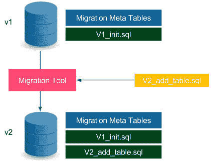

图 9.1 – 数据库模式迁移

版本 *v1* 中的数据库具有由 `V1_init.sql` 文件定义的模式。此外，它存储了与迁移过程相关的元数据，例如当前的模式版本和迁移变更日志。当我们想要更新模式时，我们提供以 SQL 文件形式的变更，例如 `V2_add_table.sql`。然后，我们需要运行迁移工具，在数据库上执行给定的 SQL 文件（它还会更新元数据表）。实际上，数据库模式是所有随后的 SQL 迁移脚本执行的结果。接下来，我们将看到一个迁移的示例。

信息

迁移脚本应存储在版本控制系统中，通常与源代码存储在同一个代码库中。

数据库迁移工具及其使用的策略可以分为两类：

+   **升级和降级**：这种方法（例如 Ruby on Rails 框架中使用的方式）意味着我们可以向上迁移（从*v1*到*v2*）和向下迁移（从*v2*到*v1*）。它允许数据库模式回滚，但有时这可能会导致数据丢失（如果迁移在逻辑上是不可逆的）。

+   **仅升级**：这种方法（例如 Flyway 工具中使用的方式）只允许我们向上迁移（从*v1*到*v2*）。在许多情况下，数据库更新是不可逆的，例如，当从数据库中删除一个表时。这样的变更无法回滚，因为即使我们重新创建该表，也已经丢失了所有数据。

市面上有许多数据库迁移工具，其中最流行的是**Flyway**、**Liquibase**和**Rail Migrations**（来自 Ruby on Rails 框架）。作为理解这些工具如何工作的下一步，我们将基于 Flyway 工具查看一个示例。

信息

也有一些商业解决方案提供给特定的数据库，例如 Redgate（针对 SQL Server）和 Optim Database Administrator（针对 DB2）。

### 使用 Flyway

让我们使用 Flyway 为计算器 Web 服务创建一个数据库模式。该数据库将存储所有在服务上执行过的操作历史：第一个参数，第二个参数，以及结果。

我们展示了如何通过三个步骤使用 SQL 数据库和 Flyway：

1.  配置 Flyway 工具与 Gradle 一起使用

1.  定义 SQL 迁移脚本以创建计算历史表

1.  在 Spring Boot 应用程序代码中使用 SQL 数据库

让我们开始吧。

#### 配置 Flyway

为了在 Gradle 中使用 Flyway，我们需要将以下内容添加到`build.gradle`文件中：

```
buildscript {
    dependencies {
        classpath('com.h2database:h2:1.4.200')
    }
}
...
plugins {
   id "org.flywaydb.flyway" version "8.5.0"
}
...
flyway {
   url = 'jdbc:h2:file:/tmp/calculator'
   user = 'sa'
}
```

以下是关于配置的一些简要说明：

+   我们使用了 H2 数据库，它是一个内存型（和基于文件的）数据库。

+   我们将数据库存储在`/tmp/calculator`文件中。

+   默认的数据库用户被称为`sa`（系统管理员）。

    提示

    对于其他 SQL 数据库（例如 MySQL），配置将非常相似。唯一的区别在于 Gradle 依赖项和 JDBC 连接。

在应用此配置后，我们应该能够通过执行以下命令来运行 Flyway 工具：

```
$ ./gradlew flywayMigrate -i
```

该命令在`/tmp/calculator.mv.db`文件中创建了数据库。显然，它没有任何模式，因为我们还没有定义任何内容。

信息

Flyway 可以作为命令行工具、通过 Java API 或作为流行构建工具 Gradle、Maven 和 Ant 的插件来使用。

#### 定义 SQL 迁移脚本

下一步是定义 SQL 文件，添加计算表到数据库模式中。让我们创建`src/main/resources/db/migration/V1__Create_calculation_table.sql`文件，内容如下：

```
create table CALCULATION (
   ID      int not null auto_increment,
   A       varchar(100),
   B       varchar(100),
   RESULT  varchar(100),
   primary key (ID)
);
```

请注意迁移文件的命名规则，`<version>__<change_description>.sql`。该 SQL 文件创建了一个包含四列的表，`ID`、`A`、`B` 和 `RESULT`。`ID` 列是表的自动递增主键。现在，我们已经准备好运行`flyway`命令以应用迁移：

```
$ ./gradlew flywayMigrate -i
...
Migrating schema "PUBLIC" to version "1 - Create calculation table"
Successfully applied 1 migration to schema "PUBLIC", now at version v1 (execution time 00:00.018s)
```

该命令自动检测到迁移文件并在数据库上执行它。

信息

迁移文件应该始终保存在版本控制系统中，通常与源代码一起保存。

#### 访问数据库

我们已经执行了第一次迁移，因此数据库已经准备好。要查看完整的示例，我们还应调整我们的项目，使其能够访问数据库。

首先让我们配置 Gradle 依赖项，以便使用 Spring Boot 项目中的`h2database`：

1.  我们可以通过向`build.gradle`文件中添加以下行来实现：

    ```
    dependencies {
       implementation 'org.springframework.boot:spring-boot-starter-data-jpa'
       implementation 'com.h2database:h2:1.4.200'
    }
    ```

1.  下一步是在`src/main/resources/application.properties`文件中设置数据库位置和启动行为：

    ```
    spring.datasource.url=jdbc:h2:file:/tmp/calculator;DB_CLOSE_ON_EXIT=FALSE 
    spring.jpa.hibernate.ddl-auto=validate
    spring.datasource.username=sa
    ```

第二行表示 Spring Boot 不会尝试从源代码模型自动生成数据库模式。相反，它只会验证数据库模式是否与 Java 模型一致。

1.  现在，让我们为新的`src/main/java/com/leszko/calculator/Calculation.java`文件创建 Java ORM 实体模型：

    ```
    package com.leszko.calculator;
    import javax.persistence.Entity;
    import javax.persistence.GeneratedValue;
    import javax.persistence.GenerationType;
    import javax.persistence.Id;
    @Entity
    public class Calculation {
       @Id
       @GeneratedValue(strategy= GenerationType.IDENTITY)
       private Integer id;
       private String a;
       private String b;
       private String result;
       protected Calculation() {}
       public Calculation(String a, String b, String result) {
           this.a = a;
           this.b = b;
           this.result = result;
       }
    }
    ```

`Entity`类表示 Java 代码中的数据库映射。一个表通过一个类来表达，每个列作为一个字段。下一步是为加载和存储`Calculation`实体创建仓库。

1.  让我们创建`src/main/java/com/leszko/calculator/CalculationRepository.java`文件：

    ```
    package com.leszko.calculator;
    import org.springframework.data.repository.CrudRepository;
    public interface CalculationRepository extends CrudRepository<Calculation, Integer> {}
    ```

1.  最后，我们可以使用`Calculation`和`CalculationRepository`类来存储计算历史记录。让我们将以下代码添加到`src/main/java/com/leszko/calculator/CalculatorController.java`文件中：

    ```
    ...
    class CalculatorController {
       ...
       @Autowired
       private CalculationRepository calculationRepository;
       @RequestMapping("/sum")
       String sum(@RequestParam("a") Integer a, @RequestParam("b") Integer b) {
           String result = String.valueOf(calculator.sum(a, b));
           calculationRepository.save(new Calculation(a.toString(), b.toString(), result));
           return result;
       }
    }
    ```

1.  现在，我们可以最终启动服务，例如，使用以下命令：

    ```
    $ ./gradlew bootRun
    ```

当我们启动服务后，可以向`/sum`端点发送请求。结果，每个加法操作都会被记录到数据库中。

提示

如果你想浏览数据库内容，可以将`spring.h2.console.enabled=true`添加到`application.properties`文件中，然后通过`/h2-console`端点浏览数据库。

我们已经解释了数据库模式迁移的工作原理以及如何在使用 Gradle 构建的 Spring Boot 项目中使用它。现在，让我们来看一下它是如何与持续交付过程集成的。

## 在持续交付中更改数据库

使用数据库更新在持续交付管道中的第一种方法是在线程执行过程中添加一个阶段。这个简单的解决方案在很多情况下都能正常工作；然而，它有两个显著的缺点：

+   **回滚**：如前所述，数据库更改并不总是可以回滚的（Flyway 根本不支持降级）。因此，在服务回滚的情况下，数据库会变得不兼容。

+   **停机时间**：服务更新和数据库更新并不会同时执行，这会导致停机时间。

这引出了我们需要解决的两个约束：

+   数据库版本需要始终与服务版本兼容。

+   数据库模式迁移是不可逆的。

我们将处理两种不同情况的约束：向后兼容的更新和非向后兼容的更新。

### 向后兼容的更改

向后兼容的更改较为简单。让我们通过以下图形来查看它们是如何工作的：

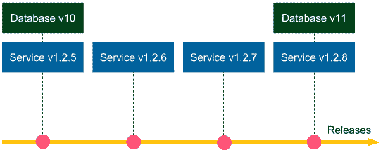

图 9.2 – 向后兼容的数据库迁移

假设 **数据库 v10** 的架构迁移是向后兼容的。如果我们需要回滚 **服务 v1.2.8** 的发布，那么我们部署 **服务 v1.2.7**，并且不需要对数据库做任何操作（数据库迁移不可逆，因此我们保持 **数据库 v11**）。由于架构更新是向后兼容的，**服务 v1.2.7** 与 **数据库 v11** 完美兼容。如果我们需要回滚到 **服务 v1.2.6**，同样可以正常工作，依此类推。现在，假设 **数据库 v10** 和所有其他迁移都是向后兼容的，那么我们可以回滚到任何服务版本，一切都能正常工作。

停机时间也没有问题。如果数据库迁移本身没有停机时间，那么我们可以先执行它，然后再对服务使用滚动更新。

我们来看一个向后兼容变更的例子。我们将创建一个架构更新，向计算表添加一个 `created_at` 列。`src/main/resources/db/migration/V2__Add_created_at_column.sql` 迁移文件如下所示：

```
alter table CALCULATION
add CREATED_AT timestamp;
```

除了迁移脚本外，计算器服务还需要在 `Calculation` 类中添加一个新字段：

```
...
private Timestamp createdAt;
...
```

我们还需要调整其构造函数，然后调整它在 `CalculatorController` 类中的使用：

```
calculationRepository.save(new Calculation(a.toString(), b.toString(), result, Timestamp.from(Instant.now())));
```

运行服务后，计算历史记录会存储在 `created_at` 列中。请注意，这个变更是向后兼容的，因为即使我们还原了 Java 代码并在数据库中保留了 `created_at` 列，一切仍然可以正常工作（还原的代码根本不涉及新列）。

### 非向后兼容的变更

非向后兼容的变更要困难得多。从之前的示意图来看，如果 **v11** 数据库的变更是向后不兼容的，那么就无法将服务回滚到 **1.2.7**。在这种情况下，我们该如何处理非向后兼容的数据库迁移，以便能够进行回滚并实现零停机部署呢？

简单来说，我们可以通过将非向后兼容的变更转换为在一定时间内向后兼容的变更来解决这个问题。换句话说，我们需要额外付出努力，将架构迁移分为两个部分：

+   当前执行的向后兼容更新，通常意味着保留一些冗余数据

+   在回滚期后执行非向后兼容的更新，定义我们可以回退代码的最大时间

为了更好地说明这一点，我们来看下面的示意图：

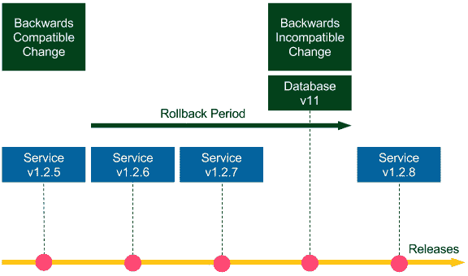

图 9.3 – 非向后兼容的数据库迁移

我们考虑一个删除列的例子。一个建议的方法包括两个步骤：

+   停止在源代码中使用该列 (**v1.2.5**，向后兼容更新，首先执行)。

+   从数据库中删除该列 (**v11**，非向后兼容更新，回滚期后执行)。

所有版本直到**数据库 v11**都可以回滚到任何之前的版本；从**服务 v1.2.8**开始的服务只能在回滚周期内回滚。这个方法可能听起来很简单，因为我们所做的只是延迟了从数据库中删除列的操作。然而，它解决了回滚问题和零停机时间部署问题。因此，它降低了发布过程中相关的风险。如果我们将回滚周期调整为合理的时间（例如，在一天内多次发布时调整为 2 周），那么风险几乎可以忽略不计。我们通常不会回滚很多版本。

删除列是一个非常简单的例子。让我们来看一个更复杂的场景，重命名我们计算器服务中的结果列。我们展示了如何通过几个步骤来完成这项操作：

1.  向数据库中添加新列

1.  更改代码以使用两列数据

1.  合并两列中的数据

1.  从代码中删除旧列

1.  从数据库中删除旧列

让我们详细看看这些步骤。

#### 向数据库中添加新列

假设我们需要将`result`列重命名为`sum`。第一步是添加一个新的列，它将是旧列的副本。我们需要创建一个迁移文件：`src/main/resources/db/migration/V3__Add_sum_column.sql`：

```
alter table CALCULATION
add SUM varchar(100);
```

结果是，在执行迁移后，我们将拥有两列：`result`和`sum`。

#### 更改代码以使用两列数据

下一步是在源代码模型中重命名列，并在`set`和`get`操作中使用两列数据。我们可以在`Calculation`类中进行更改：

```
public class Calculation {
    ...
    private String sum;
    ...
    public Calculation(String a, String b, String sum, Timestamp createdAt) {
        this.a = a;
        this.b = b;
        this.sum = sum;
        this.result = sum;
        this.createdAt = createdAt;
    }
    public String getSum() {
        return sum != null ? sum : result;
    }
}
```

提示

为了达到 100%的准确性，在`getSum()`方法中，我们应该比较类似于最后修改日期的列。（并不一定总是需要先使用新列。）

从现在起，每次向数据库中添加一行时，相同的值会写入`result`和`sum`两列。在读取`sum`时，我们首先检查它是否存在于新列中，如果没有，则从旧列中读取。

提示

也可以通过使用数据库触发器来实现相同的结果，触发器会自动将相同的值写入两列中。

到目前为止，我们所做的所有更改都是向后兼容的，因此我们可以随时将服务回滚到任何我们想要的版本。

#### 合并两列中的数据

这一步通常在发布版本稳定后进行。我们需要将旧的`result`列中的数据复制到新的`sum`列。让我们创建一个迁移文件，命名为`V4__Copy_result_into_sum_column.sql`：

```
update CALCULATION
set CALCULATION.sum = CALCULATION.result
where CALCULATION.sum is null;
```

我们目前还没有回滚的限制；但是，如果我们需要部署变更前的版本（在*步骤 2*之前），则需要重复执行此数据库迁移。

#### 从代码中删除旧列

到此为止，我们已经将所有数据迁移到新的列中，因此我们可以在数据模型中开始使用新列，而不再依赖旧列。为了做到这一点，我们需要删除与`result`相关的所有代码，这些代码在`Calculation`类中应如下所示：

```
public class Calculation {
    ...
    private String sum;
    ...
    public Calculation(String a, String b, String sum, Timestamp createdAt) {
        this.a = a;
        this.b = b;
        this.sum = sum;
        this.createdAt = createdAt;
    }
    public String getSum() {
        return sum;
    }
}
```

完成此操作后，我们将不再在代码中使用`result`列。请注意，这一操作仅在*步骤 2*之前向后兼容。如果我们需要回滚到*步骤 1*，则可能会丢失此步骤后存储的数据。

#### 从数据库中删除旧的列

最后一步是从数据库中删除旧的列。此迁移操作应在回滚期后进行，当我们确认在*步骤 4*之前不会需要回滚时。

信息

回滚期可能非常长，因为我们不再使用数据库中的该列。这个任务可以视为清理任务，因此即使它不向后兼容，也没有相关的风险。

让我们添加最终的迁移文件，`V5__Drop_result_column.sql`：

```
alter table CALCULATION
drop column RESULT;
```

完成此步骤后，我们将最终完成列重命名过程。请注意，我们采取的步骤使得操作变得稍微复杂了一些，以便将其延长至更长时间。这减少了数据库不向后兼容更改的风险，并实现了零停机时间部署。

#### 将数据库更新与代码更改分离

到目前为止，在所有图像中，我们展示了数据库迁移是与服务发布一起进行的。换句话说，每次提交（即每次发布）都包括数据库更改和代码更改。然而，推荐的做法是明确区分，提交到代码库的内容是数据库更新还是代码更改。这个方法在下图中展示：

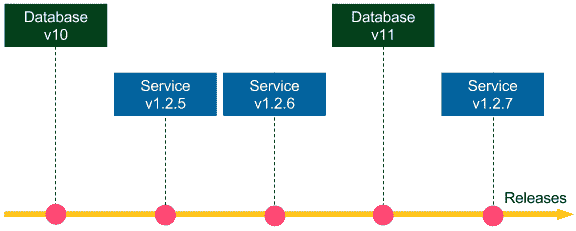

图 9.4 – 将数据库更新与代码更改分离

数据库与服务更改分离的好处是我们能够免费进行向后兼容性检查。假设**v11**和**v1.2.7**的更改涉及一个逻辑更改，例如向数据库中添加一个新列。然后，我们首先提交**Database v11**，这样持续交付流水线中的测试就会检查**Database v11**是否与**Service v1.2.6**正确兼容。换句话说，它们检查**Database v11**更新是否向后兼容。然后，我们提交**v1.2.7**的更改，流水线会检查**Database v11**是否与**Service v1.2.7**兼容。

信息

数据库与代码的分离并不意味着我们必须有两个独立的 Jenkins 流水线。流水线可以始终执行两者，但我们应当将其视为一种良好的实践，确保每次提交要么是数据库更新，要么是代码更改。

总结一下，数据库模式的更改永远不应该手动进行。相反，我们应该始终通过迁移工具来自动化这些更改，并将其作为持续交付管道的一部分执行。我们还应避免进行不向后兼容的数据库更新，而确保这一点的最佳方法是将数据库和代码更改分别提交到仓库中。

## 避免共享数据库

在许多系统中，我们可以发现数据库成为多个服务共享的**中心**点。在这种情况下，任何对数据库的更新都会变得更加具有挑战性，因为我们需要在所有服务之间进行协调。

例如，假设我们正在开发一个在线商店，并且我们有一个`Customers`表，其中包含以下列：`first name`、`last name`、`username`、`password`、`email`和`discount`。有三个服务对客户数据感兴趣：

+   **用户资料管理器**：用于编辑用户数据。

+   **结账处理器**：处理结账过程（读取用户名和电子邮件）。

+   **折扣管理器**：用于分析客户的订单并应用适当的折扣。

让我们看一下以下图示，展示了这种情况：

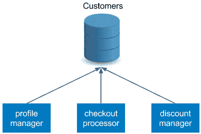

图 9.5 – 共享数据库反模式

这三个服务依赖于相同的数据库模式。这种方法至少有两个问题：

+   当我们想要更新模式时，它必须与所有三个服务兼容。虽然所有向后兼容的更改都可以，但任何不向后兼容的更新将变得更加困难，甚至不可能实现。

+   每个服务都有单独的交付周期和独立的持续交付管道。那么，*我们应该使用哪个管道来进行数据库模式迁移？* 不幸的是，这个问题没有一个明确的答案。

基于前面提到的原因，每个服务应该拥有自己的数据库，服务之间应该通过其 API 进行通信。以我们的示例为例，我们可以应用以下重构：

+   结账处理器应该通过调用用户资料管理器的 API 来获取客户数据。

+   折扣列应该提取到一个单独的数据库（或模式），并且折扣管理器应该负责管理。

重构后的版本如下图所示：

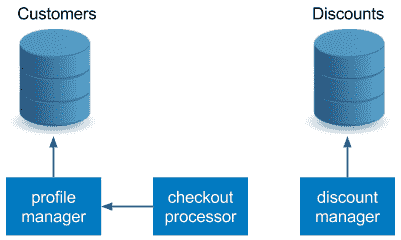

图 9.6 – 每服务数据库模式

这种方法与微服务架构的**原则**一致，并且应该始终应用。通过 API 进行通信比直接访问数据库更加灵活。

信息

对于单体系统来说，数据库通常是集成点。由于这种方式会引发许多问题，因此被视为反模式。

## 准备测试数据

我们已经展示了数据库迁移，它通过副作用确保环境之间的数据库模式一致。这是因为如果我们在开发机器、预发布环境或生产环境中运行相同的迁移脚本，我们总能得到相同模式的结果。然而，表中的数据值是不同的。那么，我们该如何准备测试数据，以便有效地测试我们的系统呢？这将是下一节的重点。

这个问题的答案取决于测试类型，并且在单元测试、集成/验收测试和性能测试中是不同的。让我们逐个检查每种情况。

### 单元测试

在单元测试的情况下，我们不会使用真实的数据库。我们要么在持久化机制（如仓库和数据访问对象）层面模拟测试数据，要么用内存数据库（例如 H2 数据库）伪造真实数据库。由于单元测试是由开发人员编写的，因此测试数据的具体值通常是由开发人员自行创设的，且这些数据值并不那么重要。

### 集成/验收测试

集成和验收测试通常使用测试/预发布数据库，该数据库应该尽可能与生产环境相似。许多公司采用的一种方法是将生产数据快照到预发布环境中，确保数据完全相同。然而，这种方法被视为反模式，原因如下：

+   **测试隔离**：每个测试都在相同的数据库上进行，因此一个测试的结果可能会影响其他测试的输入。

+   **数据安全**：生产环境中的实例通常存储敏感信息，因此需要更高的安全保障。

+   **可重现性**：每次快照后，测试数据都会有所不同，这可能导致不稳定的测试结果。

因此，推荐的做法是通过与客户或业务分析师一起选择一部分生产数据手动准备测试数据。当生产数据库增长时，值得重新审视其内容，看看是否有任何合理的情况应该被加入。

向预发布数据库添加数据的最佳方式是使用服务的公共 API。这种方式与验收测试一致，后者通常是黑盒测试。此外，使用 API 可以确保数据本身的一致性，并通过限制直接操作数据库来简化数据库重构。

### 性能测试

性能测试的测试数据通常与验收测试相似。一个显著的区别是数据量的大小。为了正确测试性能，我们需要提供足够的输入数据量，最好与生产环境中的数据量相当（尤其是在高峰时段）。为此，我们可以创建数据生成器，通常这些生成器会在验收测试和性能测试之间共享。

我们在持续交付过程中已经涵盖了很多关于数据库的内容。现在，让我们转到一个完全不同的话题。让我们讨论如何使用著名的流水线模式来改进我们的 Jenkins 流水线。

# 流水线模式

我们已经知道了启动项目和设置 Jenkins、Docker、Kubernetes、Ansible 和 Terraform 的持续交付流水线所需的一切。本节旨在通过一些推荐的 Jenkins 流水线实践来扩展这些知识。

## 并行化流水线

在本书中，我们始终是按顺序执行流水线的，一阶段接一阶段，一步接一步。这种方法使得构建的状态和结果容易推理。如果先有验收测试阶段，再有发布阶段，那就意味着只有在验收测试成功后，发布才会发生。顺序流水线易于理解，通常不会带来意外情况。因此，解决任何问题的首选方法是按顺序执行。

然而，在某些情况下，阶段执行时间较长，值得将它们并行运行。一个非常好的例子是性能测试。它们通常需要较长时间，因此，如果假设它们是独立且隔离的，选择并行运行是有意义的。在 Jenkins 中，我们可以在两个不同的层面上并行化流水线：

+   **并行步骤**：在一个阶段内，多个并行进程在同一代理上运行。这种方法很简单，因为所有与 Jenkins 工作区相关的文件都位于同一台物理机器上。然而，与垂直扩展一样，资源限制于这台机器。

+   如果在前一个阶段创建的文件在其他物理机器上需要，可以使用`stash`（`Jenkinsfile`关键字）。

让我们看看实际操作中会是什么样子。如果我们想并行执行两个步骤，`Jenkinsfile`脚本应如下所示：

```
pipeline {
   agent any
   stages {
       stage('Stage 1') {
           steps {
               parallel (
                       one: { echo "parallel step 1" },
                       two: { echo "parallel step 2" }
               )
           }
       }
       stage('Stage 2') {
           steps {
               echo "run after both parallel steps are completed"   
           }
       }
   }
}
```

在`Stage 1`中，使用`parallel`关键字，我们执行了两个并行步骤，`one`和`two`。请注意，`Stage 2`只有在两个并行步骤都完成后才会执行。这就是为什么这种解决方案在并行运行测试时非常安全；我们始终可以确保部署阶段只有在所有并行测试都通过之后才会执行。

上面的代码示例涉及的是并行步骤层次。另一种解决方案是使用并行阶段，因此每个阶段在不同的代理机器上运行。选择使用哪种并行化方法通常取决于两个因素：

+   代理机器的强大程度

+   给定阶段所需的时间

一般建议是，单元测试可以在并行步骤中运行，但性能测试通常最好在不同的机器上进行。

## 重用流水线组件

当`Jenkinsfile`脚本变得更大、更复杂时，我们可能希望在类似的流水线之间重用其部分内容。

例如，我们可能希望为不同的环境（开发、QA 和生产）拥有独立的（但相似的）流水线。在微服务世界中，另一个常见的例子是每个服务都有一个非常相似的 `Jenkinsfile`。那么，我们如何编写 `Jenkinsfile` 脚本，以便不重复相同的代码呢？有两个很好的模式可以实现这一目标：参数化构建和共享库。让我们分别来讨论这两种方式。

### 构建参数

我们之前在 *第四章*，*持续集成流水线* 中提到过，流水线可以有输入参数。我们可以使用这些参数为相同的流水线代码提供不同的用例。例如，让我们创建一个带有 `environment` 类型的流水线参数：

```
pipeline {
   agent any
   parameters {
       string(name: 'Environment', defaultValue: 'dev', description: 'Which environment (dev, qa, prod)?')
   }
   stages {
       stage('Environment check') {
           steps {
               echo "Current environment: ${params.Environment}"   
           }
       }
   }
}
```

该构建需要一个输入参数，`Environment`。然后，我们在这个步骤中所做的就是打印该参数。我们还可以添加条件，以便根据不同的环境执行不同的代码。

使用此配置，当我们启动构建时，我们将看到一个输入参数提示，如下所示：

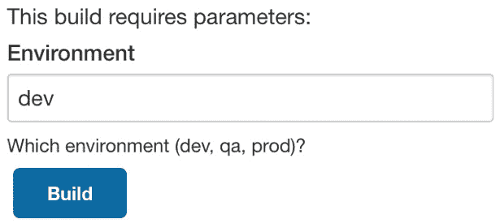

图 9.7 – Jenkins 参数化构建

参数化构建可以帮助我们在略有不同的场景中重用流水线代码。然而，这个功能不应被过度使用，因为过多的条件可能使得 `Jenkinsfile` 难以理解。

### 共享库

另一个重用流水线的解决方案是将其部分提取到共享库中。

共享库是存储为独立的、源代码控制的项目的 Groovy 代码。以后可以在许多 `Jenkinsfile` 脚本中作为流水线步骤使用这些代码。为了更清楚地说明这一点，让我们看一个例子。使用共享库技术通常需要三个步骤：

1.  创建一个共享库项目。

1.  在 Jenkins 中配置共享库。

1.  在 `Jenkinsfile` 中使用共享库。

#### 创建共享库项目

我们首先创建一个新的 Git 项目，在其中存放共享库代码。每个 Jenkins 步骤都作为一个 Groovy 文件表示，文件位于 `vars` 目录中。

让我们创建一个 `sayHello` 步骤，该步骤接受 `name` 参数并回显一条简单的消息。此代码应存放在 `vars/sayHello.groovy` 文件中：

```
/**
* Hello world step.
*/
def call(String name) {   
   echo "Hello $name!"
}
```

信息

共享库步骤的可读描述可以存储在 `*.txt` 文件中。在我们的例子中，我们可以添加 `vars/sayHello.txt` 文件以记录步骤文档。

当库代码完成后，我们需要将其推送到仓库，例如作为一个新的 GitHub 项目。

#### 在 Jenkins 中配置共享库

下一步是将共享库注册到 Jenkins 中。我们打开 **管理 Jenkins** | **配置系统**，找到 **全局流水线库** 部分。在这里，我们可以添加库，并为其指定一个选择的名称，如下所示：

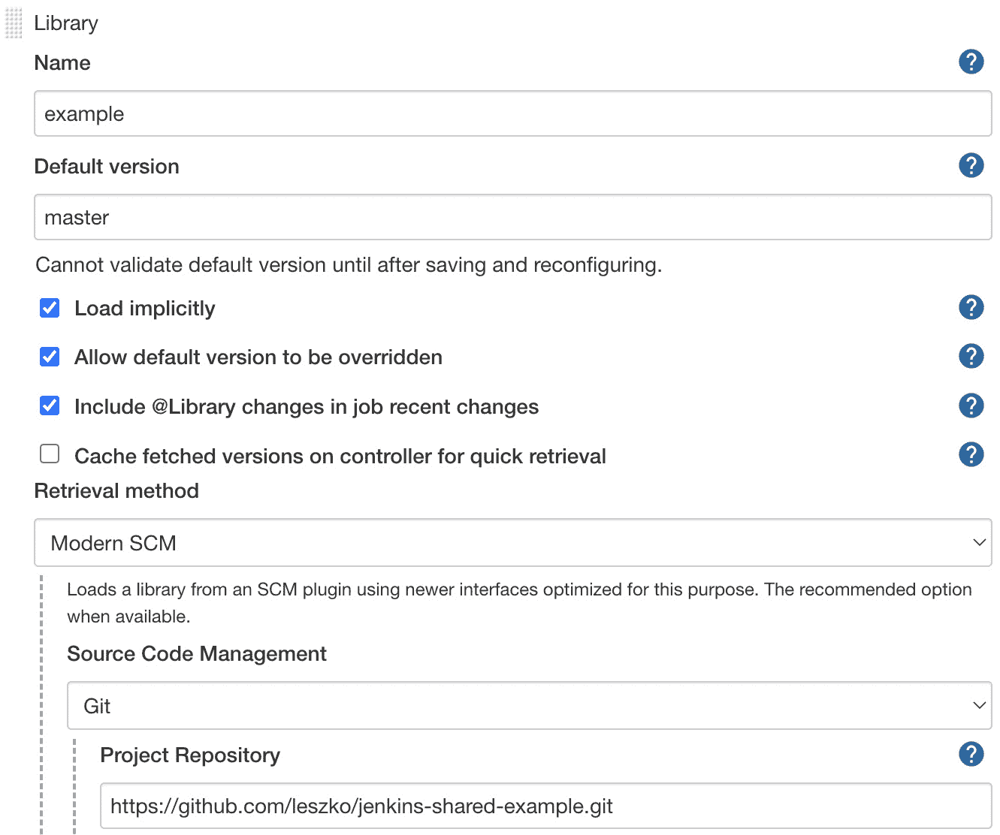

图 9.8 – Jenkins 全局流水线库配置

我们指定了库的注册名称和库的仓库地址。请注意，库的最新版本将在管道构建过程中自动下载。

信息

我们展示了将 Groovy 代码作为*全局共享库*导入，但也有其他解决方案。详情请阅读[`www.jenkins.io/doc/book/pipeline/shared-libraries/`](https://www.jenkins.io/doc/book/pipeline/shared-libraries/)。

#### 在 Jenkinsfile 中使用共享库

最后，我们可以在`Jenkinsfile`中使用共享库：

```
pipeline {
   agent any
   stages {
       stage("Hello stage") {
           steps {
           sayHello 'Rafal'
         }
       }
   }
}
```

提示

如果`@Library('example') _`在`Jenkinsfile`脚本的开头。

如你所见，我们可以将 Groovy 代码用作`sayHello`管道步骤。显然，在管道构建完成后，我们应该在控制台输出中看到`Hello Rafal!`。

信息

共享库不限于一个步骤。事实上，凭借 Groovy 语言的强大功能，它们甚至可以作为整个 Jenkins 管道的模板。

在描述如何共享 Jenkins 管道代码之后，让我们再谈一谈在持续交付过程中回滚部署的几句话。

## 回滚部署

我记得我同事，一位高级架构师的话——*你不需要更多的 QA，你需要更快的回滚*。虽然这个说法过于简化，且 QA 团队通常非常有价值，但这句话中确实有不少真理。想想看，如果你在生产环境中引入了一个 bug，但在第一个用户报告错误后很快就回滚了，那么通常不会发生什么坏事。另一方面，如果生产环境中的错误很少发生，但没有回滚操作，那么调试生产环境的过程通常会以漫长的失眠之夜和一些不满的用户告终。这就是为什么我们在创建 Jenkins 管道时，需要提前思考回滚策略的原因。

在持续交付的背景下，失败可能发生的时刻有两个：

+   在发布过程中，在管道执行中

+   管道构建完成后，在生产环境中

第一个场景非常简单且无害。它涉及一个应用程序已经部署到生产环境，但下一个阶段失败的情况，例如烟雾测试失败。此时，我们只需要在`post`管道部分的`failure`情况下执行一个脚本，该脚本将生产服务降级到较旧的 Docker 镜像版本。如果我们使用蓝绿部署（稍后我们将在本章中描述），任何停机的风险将最小，因为通常我们会在烟雾测试之后的最后一个管道阶段执行负载均衡器切换。

第二种情况是在管道成功完成后，我们发现了一个生产环境的错误，这种情况更为复杂，需要稍作评论。在这种情况下，规则是我们应该总是通过与标准发布完全相同的流程来发布回滚的服务。否则，如果我们尝试以更快的方式手动处理，就会带来麻烦。任何非重复性的任务都是有风险的，特别是在生产环境故障时，压力更大。

信息

顺便提一下，如果管道成功完成，但出现了生产环境的错误，那么说明我们的测试还不够充分。因此，回滚后的第一件事是扩展单元/验收测试套件，加入相应的场景。

最常见的持续交付过程是一个单一的、完全自动化的管道，它从检出代码开始，到发布到生产环境结束。

下图展示了这个流程是如何运作的：

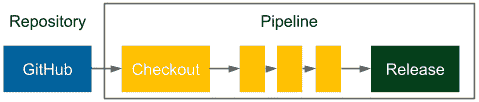

图 9.9 – 持续交付管道

本书中我们已经展示了经典的持续交付管道。如果回滚需要使用完全相同的流程，那么我们只需从代码库中恢复最新的代码更改。这样，管道会自动构建、测试，最终发布正确的版本。

信息

仓库回滚和紧急修复永远不应跳过管道中的测试阶段，否则，我们可能会得到一个仍然无法正常工作的发布版本，且由于其他问题，调试变得更加困难。

解决方案非常简单且优雅。唯一的缺点是我们需要在完整的管道构建中消耗一些停机时间。如果我们使用蓝绿部署或金丝雀发布，就可以避免这些停机时间，在这种情况下，我们只需要修改负载均衡器的设置以指向健康的环境。

在协调发布的情况下，回滚操作变得更加复杂，因为在协调发布过程中，多个服务会同时部署。这也是为什么协调发布被视为反模式，特别是在微服务世界中。正确的方法是始终保持向后兼容性，至少在一段时间内（如本章开始时我们展示的数据库）。然后，就可以独立发布每个服务。

## 添加手动步骤

通常，持续交付管道应该是完全自动化的，通过提交到代码库触发，并在发布后结束。然而，有时我们无法避免手动步骤。最常见的例子是发布批准，这意味着过程是完全自动化的，但仍然需要手动步骤来批准新的发布。另一个常见的例子是手动测试。有些手动测试是因为我们在操作遗留系统，有些则是因为某些测试无法自动化。不管是什么原因，有时我们别无选择，只能添加手动步骤。

Jenkins 语法提供了一个 `input` 关键字用于手动步骤：

```
stage("Release approval") {
   steps {
       input "Do you approve the release?"
   }
}
```

流水线将在 `input` 步骤上停止执行，并等待手动批准。

请记住，手动步骤很快就会成为交付过程中的瓶颈，这就是为什么它们应始终被视为完全自动化的次优解的原因。

提示

有时为输入设置超时是有用的，以避免无限期等待手动交互。在配置的时间过去后，整个流水线将被中止。

我们已经涵盖了许多重要的流水线模式；现在让我们专注于不同的部署发布模式。

# 发布模式

在上一节中，我们讨论了用于加速构建执行（并行步骤）、帮助代码重用（共享库）、限制生产错误风险（回滚）以及处理手动批准（手动步骤）的 Jenkins 流水线模式。本节将专注于下一组模式；这次是与发布过程相关的。它们旨在减少将新软件版本更新到生产环境中的风险。

我们已经在 *第六章* 中描述了一个发布模式，即滚动更新，这里我们将介绍另外两种：蓝绿部署和金丝雀发布。

信息

在 Kubernetes 中使用发布模式的一个非常方便的方式是使用 Istio 服务网格。详细信息请参阅 [`istio.io/`](https://istio.io/)。

## 蓝绿部署

蓝绿部署是一种减少与发布相关的停机时间的技术。它涉及拥有两个相同的生产环境——一个称为 **绿色**，另一个称为 **蓝色**——如下图所示：

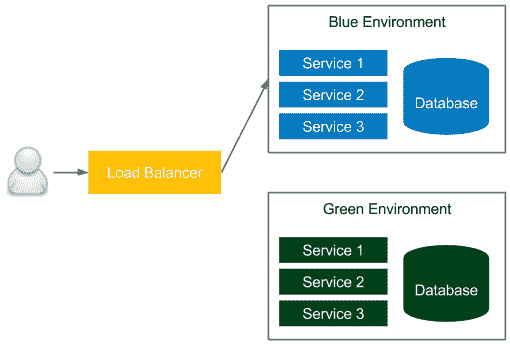

图 9.10 – 蓝绿部署

在图中，当前可访问的环境是蓝色的。如果我们要进行新版本发布，那么我们将所有内容部署到绿色环境，并在发布流程结束时将负载均衡器切换到绿色环境。因此，用户突然开始使用新版本。下次我们想发布时，我们对蓝色环境进行更改，最终将负载均衡器切换到蓝色。我们每次都按相同方式进行，从一个环境切换到另一个环境。

信息

蓝绿部署技术的正确运作需要满足两个假设：环境隔离和无编排的发布。

此解决方案提供以下好处：

+   **零停机时间**：从用户的角度来看，所有停机时间仅仅是改变负载均衡开关的时刻，这是可以忽略不计的。

+   **回滚（Rollback）**：为了回滚到上一个版本，只需切换回负载均衡开关。

注意，蓝绿部署必须包括以下内容：

+   **数据库**：在回滚情况下，模式迁移可能会有些棘手，因此使用本章开头讨论的模式是值得的。

+   **事务**：运行数据库事务必须交给新数据库处理。

+   **冗余基础设施/资源**：我们需要准备两倍的资源。

有许多技术和工具可以克服这些挑战，因此蓝绿部署模式被广泛推荐，并在 IT 行业中得到广泛应用。

信息

您可以在 Martin Fowler 的博客上进一步阅读有关蓝绿部署技术的内容，网址是 [`martinfowler.com/bliki/BlueGreenDeployment.html`](https://martinfowler.com/bliki/BlueGreenDeployment.html)。

## 金丝雀发布

金丝雀发布是一种减少引入新版本软件时风险的技术。与蓝绿部署类似，它使用两个相同的环境，如下图所示：

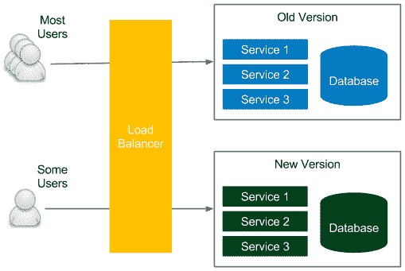

图 9.11 – 金丝雀发布

同样，类似于蓝绿部署技术，发布过程从在当前未使用的环境中部署新版本开始。不过，在这里，相似之处就结束了。负载均衡器不是切换到新环境，而是仅将一部分用户链接到新环境，其余用户仍然使用旧版本。通过这种方式，只有一部分用户可以测试新版本，如果出现错误，也仅会影响小范围的用户。测试期结束后，所有用户都将切换到新版本。

这种方法有一些很好的优点：

+   **验收与性能测试**：如果在暂存环境中难以进行验收与性能测试，则可以在生产环境中进行测试，最小化对小部分用户的影响。

+   **简单回滚**：如果新变更导致故障，可以通过将所有用户切换回旧版本来实现回滚。

+   **A/B 测试**：如果我们不确定新版本在用户体验或性能方面是否更好，可以将其与旧版本进行比较。

金丝雀发布与蓝绿部署有相同的缺点。额外的挑战是，我们同时运行了两个生产系统。尽管如此，金丝雀发布仍然是大多数公司广泛使用的优秀技术，帮助进行发布和测试。

信息

您可以在 Martin Fowler 的博客上进一步阅读有关金丝雀发布技术的内容，网址是 [`martinfowler.com/bliki/CanaryRelease.html`](https://martinfowler.com/bliki/CanaryRelease.html)。

# 与遗留系统的协作

目前为止我们所描述的一切适用于绿地项目，对于这些项目，设置持续交付管道相对简单。

然而，遗留系统要复杂得多，因为它们通常依赖手动测试和手动部署步骤。在这一部分中，我们将讲解如何逐步将持续交付应用于遗留系统的推荐场景。

作为第一步，我建议阅读 Michael Feathers 的一本好书，《*与遗留代码有效合作*》。他关于如何处理测试、重构以及添加新特性的观点，解决了大多数关于如何自动化遗留系统交付过程的疑虑。

信息

对于许多开发人员来说，完全重写遗留系统而不是重构它可能是一个诱人的选择。虽然从开发者的角度来看，这个想法很有趣，但通常这是一个糟糕的商业决策，最终导致产品失败。你可以在 Joel Spolsky 的一篇精彩博客《*你永远不该做的事*》中了解更多关于重写 Netscape 浏览器的历史，博客地址为 [`www.joelonsoftware.com/2000/04/06/things-you-should-never-do-part-i`](https://www.joelonsoftware.com/2000/04/06/things-you-should-never-do-part-i)。

应用持续交付过程的方式在很大程度上取决于当前项目的自动化程度、所使用的技术、硬件基础设施以及当前的发布流程。通常，它可以分为三个步骤：

1.  自动化构建与部署

1.  自动化测试

1.  重构与引入新特性

让我们详细看看这些内容。

## 自动化构建与部署

第一阶段包括自动化部署过程。好消息是，在我曾经接触过的大多数遗留系统中，已经有一些自动化措施（例如，采用 Shell 脚本的形式）。

无论如何，自动化部署的活动包括以下内容：

1.  **构建与打包**：通常，已经存在一些自动化措施，比如 Makefile、Ant、Maven 或任何其他构建工具的配置，或者是自定义脚本。

1.  **数据库迁移**：我们需要开始逐步管理数据库架构。这要求将当前的架构作为初始迁移，并使用 Flyway 或 Liquibase 等工具进行所有进一步的更改，正如本章中已描述的那样。

1.  **部署**：即使部署过程完全是手动的，通常也会有一个需要转化为自动化脚本的文本/维基页面描述。

1.  **可重复配置**：在遗留系统中，配置文件通常是手动更改的。我们需要提取配置并使用配置管理工具，正如在 *第七章*《*使用 Ansible 的配置管理*》中所描述的那样。

在前面的步骤完成后，我们可以将所有内容放入部署管道，并在手动**用户验收测试**（**UAT**）周期后，作为自动化阶段使用。

从流程的角度来看，现在开始更频繁地发布版本已经是值得的。例如，如果发布周期是每年一次，尝试改为每季度发布一次，再到每月发布一次。推动这一因素将最终促使更快的自动化交付方式的采用。

## 自动化测试

下一步，通常更加困难，是为系统准备自动化测试。这需要与 QA 团队沟通，了解他们当前如何测试软件，从而将所有内容迁移到自动化验收测试套件中。这个阶段需要两个步骤：

1.  **验收/健康检查测试套件**：我们需要添加自动化测试，替代 QA 团队的部分回归活动。根据系统的不同，可以使用黑盒 Selenium 测试或 Cucumber 测试提供这些测试。

1.  **（虚拟）测试环境**：此时，我们应该已经开始考虑测试将在哪些环境中运行。通常，为了节省资源并限制所需机器的数量，最佳解决方案是使用 Vagrant 或 Docker 来虚拟化测试环境。

最终目标是拥有一个自动化验收测试套件，取代开发周期中的整个 UAT 阶段。然而，我们可以从一个检查系统是否正确的简单测试开始，重点是回归测试。

信息

在添加测试场景时，请记住，测试套件应该在合理的时间内执行。对于健康检查测试，通常要求时间不超过 10 分钟。

## 重构与引入新功能

当我们拥有基本的回归测试套件（至少）时，就可以开始添加新功能并重构旧代码。最好一步一步地进行小规模的重构，因为一次性重构所有代码通常会导致混乱，进而导致生产环境的故障（与某一特定更改无关）。

这个阶段通常包括以下活动：

+   **重构**：开始重构旧代码的最佳位置是预期要新增功能的地方。从这里开始，我们为未来的功能请求做好准备。

+   **重写**：如果我们计划重写旧代码的部分内容，应该从最难测试的代码开始。这样，我们可以不断增加项目中的代码覆盖率。

+   **引入新功能**：在实现新功能时，使用**功能开关**模式是值得推荐的。这样，如果出现问题，我们可以迅速关闭新功能。重构时也应使用相同的模式。

    信息

    对于这个阶段，阅读马丁·福勒的《*重构：改善现有代码的设计*》这本非常好的书是值得的。

在处理旧代码时，最好遵循一个规则：始终先添加一个通过的单元测试，然后再修改代码。通过这种方法，我们可以依赖自动化来检查我们是否不小心改变了业务逻辑。

## 理解人的因素

在向旧系统引入自动化交付过程时，可能会比其他地方更能感受到人因素。为了实现构建过程的自动化，我们需要与运维团队良好沟通，而他们必须愿意分享他们的知识。同样的道理也适用于手动 QA 团队；他们需要参与编写自动化测试，因为只有他们知道如何测试软件。如果仔细想想，运维和 QA 团队都需要为后期自动化他们的工作做出贡献。在某些时候，他们可能会意识到自己在公司中的未来不稳定，从而变得不那么热衷提供帮助。许多公司在引入持续交付过程中面临困难，因为团队不愿意充分参与。

在本节中，我们讨论了如何处理旧系统及其带来的挑战。如果您正在将项目和组织转变为持续交付方式，那么您可能希望查看《持续交付成熟度模型》，该模型旨在为采用自动化交付的过程提供一些结构。

# 总结

本章是对各种持续交付方面的混合介绍，这些方面以前没有涉及。本章的关键要点如下：

+   数据库是大多数应用程序的核心部分，因此应将其纳入持续交付过程。

+   数据库架构更改存储在版本控制系统中，并通过数据库迁移工具进行管理。

+   数据库架构更改有两种类型：向后兼容和向后不兼容。第一种类型比较简单，而第二种类型需要一些额外的开销（需要分多次迁移，分布在一段时间内）。

+   数据库不应是整个系统的核心。首选的解决方案是为每个服务提供其自己的数据库。

+   交付过程应该始终为回滚场景做好准备。

+   在考虑发布模式时，应该始终考虑三种模式：滚动更新、蓝绿部署和金丝雀发布。

+   旧系统可以通过小步快走的方式转变为持续交付过程，而不是一次性完成。

接下来，在书的最后部分，我们将研究持续交付过程的最佳实践。

# 练习

在本章中，我们介绍了持续交付过程的各个方面。由于实践能带来完美，我们推荐以下练习：

1.  使用 Flyway 在 MySQL 数据库中创建一个向后不兼容的更改：

    1.  使用官方 Docker 镜像 `mysql` 启动数据库。

    1.  使用正确的数据库地址、用户名和密码配置 Flyway。

    1.  创建一个初始迁移，该迁移创建一个包含三个列的 `USERS` 表：`ID`、`EMAIL` 和 `PASSWORD`。

    1.  向表中添加示例数据。

    1.  将 `PASSWORD` 列更改为 `HASHED_PASSWORD`，该列将存储哈希后的密码。

    1.  将向后不兼容的更改分成三个迁移，如本章所述。

    1.  你可以使用 `MD5` 或 `SHA` 进行哈希处理。

    1.  检查数据库是否未将任何密码以明文形式存储。

1.  创建一个 Jenkins 共享库，包含构建和单元测试 Gradle 项目的步骤：

    1.  为库创建一个独立的代码库。

    1.  在库中创建两个文件：`gradleBuild.groovy` 和 `gradleTest.groovy`。

    1.  编写适当的 `call` 方法。

    1.  将库添加到 Jenkins。

    1.  在管道中使用库中的步骤。

# 问题

为了验证本章的知识，请回答以下问题：

1.  什么是数据库（模式）迁移？

1.  你能列举至少三个数据库迁移工具吗？

1.  数据库模式的主要两种变更类型是什么？

1.  为什么一个数据库不应该在多个服务之间共享？

1.  单元测试与集成/验收测试的数据有什么区别？

1.  在 Jenkins 管道中使用什么关键字来使步骤并行执行？

1.  有哪些不同的方法可以重用 Jenkins 管道组件？

1.  在 Jenkins 管道中使用什么关键字来创建手动步骤？

1.  本章中提到的三种发布模式是什么？

# 进一步阅读

要深入了解持续交付过程的高级方面，请参考以下资源：

+   *数据库作为持续交付的挑战*： [`phauer.com/2015/databases-challenge-continuous-delivery/`](https://phauer.com/2015/databases-challenge-continuous-delivery/)。

+   *使用数据库的零停机部署*： [`spring.io/blog/2016/05/31/zero-downtime-deployment-with-a-database`](https://spring.io/blog/2016/05/31/zero-downtime-deployment-with-a-database)。

+   *金丝雀发布*： [`martinfowler.com/bliki/CanaryRelease.html`](https://martinfowler.com/bliki/CanaryRelease.html)。

+   *蓝绿部署*： [`martinfowler.com/bliki/BlueGreenDeployment.html`](https://martinfowler.com/bliki/BlueGreenDeployment.html)。
