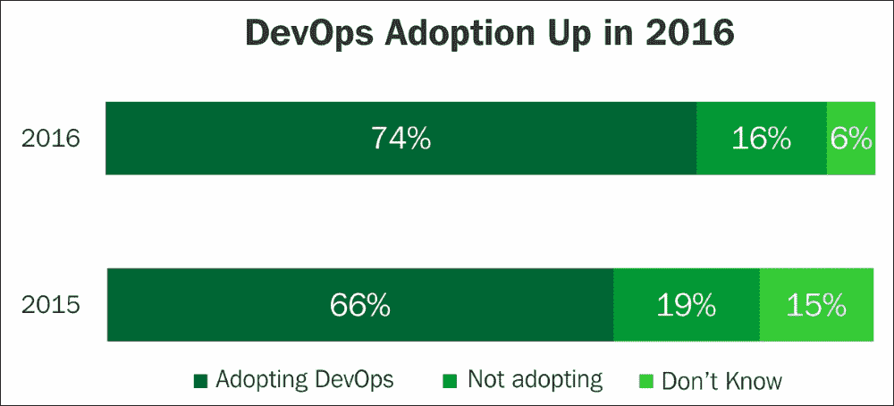
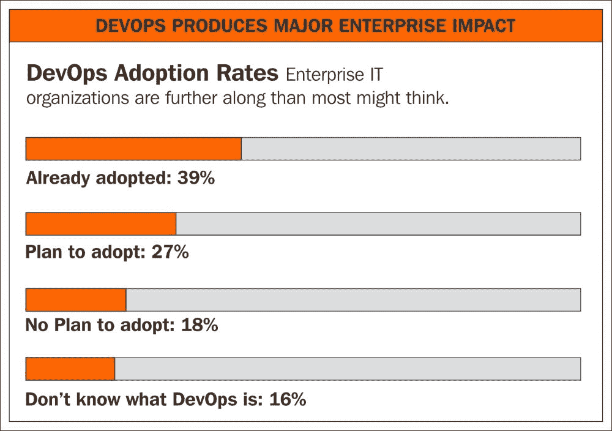
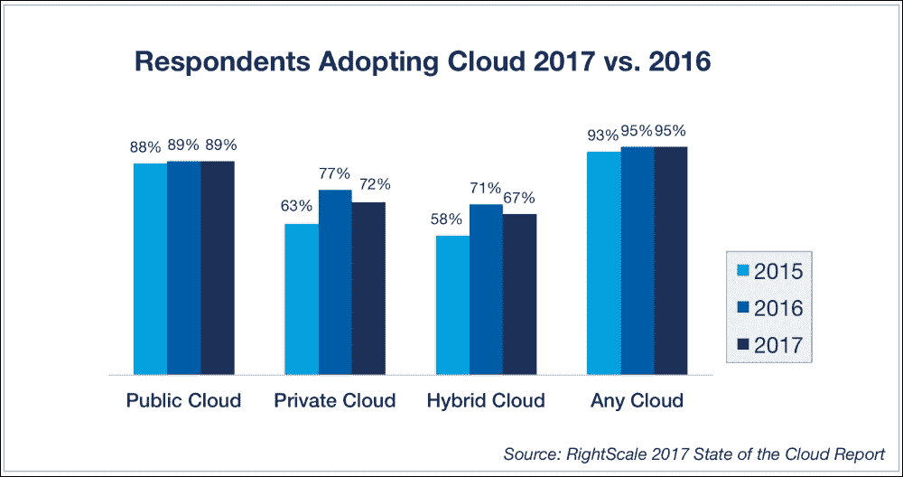

# 第一章。DevOps 简介

在传统的应用开发和维护方法中，涉及多个利益相关者、部门、团队和供应商参与整个**软件开发生命周期**（**SDLC**）。大多数人熟悉应用生命周期管理的阶段：由业务分析师收集业务需求，然后由开发团队（或可能已外包）开发，并由 QA 团队测试功能和适用性。性能和压力测试也由具有相关工具的适当团队在适用场景中执行。然后由组织的 IT 团队管理生产部署过程，附带检查表和批准，随后由维护团队进行监控和支持。我们注意到成熟周期的每个阶段，从功能开发到可用性和维护，都是由独立团队、部门、流程和工具管理的。这种方法通常由技术、框架、流程、人员和工具分割，影响最终产品的功能、成本、进度、质量、性能以及诸如供应商之间的接口和集成等管理开销。此外，在这种方法中，通常忽视了维护、支持成本和技能需求。然而，从应用生命周期和业务角度来看，维护和支持活动对于提前评估、评估和估算都至关重要。

在本课程中，我们将涵盖以下主题：

+   DevOps 简介

+   DevOps 的业务应用。

+   业务驱动因素/市场趋势

+   DevOps 战略

+   DevOps 的好处

许多技术创新已经发生，挑战几乎每个领域的传统 IT 管理方法。技术进步和变化非常深刻、快速且经常交织在一起，涵盖多个领域，如敏捷方法、DevOps、大数据、云等。综合和全面的方法无疑将为组织带来丰厚的回报，并实现最大的价值。许多机构已经踏上了这条通向未来的旅程，采纳了这些技术。

在 DevOps 之前的软件开发挑战不愿意改变系统；部署充满风险，在环境之间缺乏一致性（**它在我的机器上能运行**综合症），以及部门之间的信息孤岛——将问题抛到**墙**上，如团队导致了努力、技能集和内部斗争的重复。为了减轻上述问题并弥合这一差距，DevOps 作为一个流行选择出现。

DevOps（开发与运维）最近在软件开发生命周期（SDLC）中占据了核心地位。DevOps 提供了通过开源工具增强的流程框架，将应用生命周期的所有阶段集成起来，并确保它们作为一个有机整体进行运作。它有助于在开发、测试、部署和支持等各个阶段对流程进行对齐和自动化。它包括代码库、构建自动化、持续部署等最佳实践。

DevOps 在大数据系统和项目等系统中的应用，相较于传统的开发周期，是一种文化变革。本书的目的是提出适用于组织的概念和采用策略，涵盖 DevOps、大数据、云计算、数据科学、内存技术等技术领域。采纳并遵循 DevOps 实践将对任何组织带来回报，帮助其提高性能和效率。

对于每个 IT 功能领域，开源工具的接受度、流行度和通用性日益增长，全球范围内都在不断增加。实际上，许多新的工具变种已经进入市场，涵盖了每个领域。DevOps 的开源工具是机构在市场上成功采用 DevOps 的主要推动力，详细讨论将在接下来的部分中进行。

正如我们所看到的，各行各业的 DevOps 采用呈现逐年稳步增长的趋势：

企业中 DevOps 的渗透率呈现健康的趋势，如下图所示：

# DevOps 应用 - 商业场景

DevOps 在多个场景中的应用及其带来的好处如下：

+   **开发周期自动化**：商业需求通过最小的人工干预得到满足，开发人员可以通过代码库选择开源工具来运行构建；QA 团队可以创建一个与生产环境相同的 QA 系统，并无缝快速地部署到生产环境。

+   **单一真实版本 - 源代码管理**：存在多个版本的代码，但很难确定适合特定目的的代码。我们缺少一个单一的真实版本。代码审查反馈通过电子邮件进行且未记录，导致混乱和返工。

+   **一致的配置管理**：我们在不同的系统上开发、测试和构建源代码。验证平台及依赖项的兼容版本是手动进行的，容易出错。确保所有系统使用相同的语言和工具、编译器等版本是非常具有挑战性的。我们的代码在构建系统上运行正常，但在生产系统上却无法运行，这导致业务交付上的尴尬和高额的反应成本。

+   **产品准备就绪度**：我们有一套开发代码、测试并按既定时间表构建的流程。这个流程中有许多手动检查和验证，不同组之间的整合使得我们的承诺和交付日期变得不可预测。我们希望定期了解产品的交付进度和质量，以便提前计划，而不是被动应对。

+   **自动化手动过程**：我们遵循的手动流程往往容易出错，期望通过在可行的地方采用自动化流程来提高效率。测试周期自动化、增量测试以及与构建周期的集成将加快产品质量、发布周期以及基础设施服务自动化，如创建、启动、停止、删除、终止和重启虚拟或裸机。

+   **容器**：代码的可移植性是主要挑战。代码在开发和 QA 环境中可以正常工作，但迁移到生产系统时会面临诸如由于依赖问题导致代码无法编译、构建失败等多个挑战。构建平台无关的代码是一大挑战，而维护多个开发和 QA 平台的版本也需要付出很大的代价。可移植的容器代码将缓解这些问题。

+   **本地部署的挑战**：我们有许多本地部署的系统。面临从容量规划到周转时间的多重挑战。资本支出和运营费用无法预测。云迁移似乎有多种选择和供应商，因此需要有一个高效的采纳方法来确保结果。

# 促使大数据领域采用 DevOps 的商业驱动因素

以下是大数据系统中 DevOps 广泛流行和采纳的几个因素：

## 数据爆炸

**数据是新的货币形式**——是的，你没看错，它和石油、黄金一样，都是宝贵的资产。在过去十年中，许多公司意识到数据作为无价资产对其增长和业绩的潜力。

让我们理解数据的价值。对于任何组织来说，数据可能有很多形式，例如，客户数据、产品数据、员工数据等。如果没有关于员工、客户或产品的正确数据，可能会带来灾难性后果。正确的数据是高效运营企业的关键，这已经成为常识和基本知识。今天几乎没有企业不依赖数据驱动决策；如今的 CEO 比以往任何时候都更依赖数据做出商业决策，比如哪个产品在市场上更成功，某个区域的需求有多大，哪个价格更具竞争力等等。

数据可以通过多种来源生成，包括内部、外部甚至社交媒体。内部数据是通过内部系统和操作生成的数据，例如在银行中，通过多种渠道如 ATM、在线支付、购买等，与银行进行新客户或客户交易。外部来源可以是从 RBI 获取金价和外汇汇率。如今，社交媒体数据广泛用于市场营销和产品客户反馈。充分利用并智能使用来自各个渠道的数据对于业务成功至关重要。

更进一步，一些公司甚至对数据进行货币化，例如 Healthcare IQ、Owens & Minor、State Street Global Corporation、Ad Juggler、comScore、Verisk Analytics、Nielsen 和 LexisNexis。这些组织购买原始数据，例如在线产品销售的网站分析或每个品牌的在线搜索记录，将数据重新处理为组织化格式，并出售给研究分析师或寻求竞争情报数据以重新定位其产品在市场上位置的组织。

让我们分析推动数据和业务增长的因素。市场和客户行为的根本变化对数据爆炸产生了重大影响。一些变革的关键驱动因素包括：

+   **客户偏好**：今天，客户有多种与企业互动的方式；例如，银行提供多种渠道，如取款机取款、网上银行、手机银行、卡支付、现场银行等。购买也是如此；可以在商店、在线、基于手机等多种方式，这些组织必须维护业务运营。因此，这些多种渠道有助于增加数据管理。

+   **社交媒体**：数据从 Facebook、LinkedIn 和 Twitter 等社交媒体涌入。一方面，它们是个人之间的社交互动网站；另一方面，公司也依赖社交媒体来推广其产品。以 TB / PB 为单位发布的数据也被许多组织用于数据挖掘。这也促成了巨大的数据爆炸。

+   **法规**：公司需要按照监管机构的要求以适当的格式保存数据一段规定时间。例如，为了打击洗钱，每个涉及金融业务的组织都需要清晰的客户记录和凭证，以在长达 10 至 15 年的时间内与监管机构共享。

+   **数字世界**：随着我们向无纸化数字世界迈进，我们不断增加更多的数字数据，如电子书和 ERP 应用程序来自动化许多任务并避免文件工作。这些创新也在很大程度上促成了数字数据的增长。

下一代将更加数据密集，物联网和数据科学处于前沿，推动业务和客户优先事项。

## 云计算

云平台作为事实上的服务线的接受，带来了采购和管理基础设施的诸多变化。在云端提供硬件及其他类型的商品化工作对于提高效率也很重要，因为将这些 IT 功能迁移到云端能提高服务效率，并让 IT 部门能够将注意力从操作系统的补丁更新上转移开。随着云采用，DevOps 成为最广泛实施的流行选择。随着云的渗透，添加基础设施/服务器只需轻松点击即可完成。结合可信的开源工具，这为 DevOps 的实现铺平了道路。

在短短的时间内，可以使用开源工具根据需求添加构建、QA 和预生产机器，作为精确的副本和配置。

## 大数据

大数据是用来表示数据多个维度的术语，如大规模、速度和多样性，并为业务提供价值。数据来自多个来源，如结构化、半结构化和非结构化数据。数据的速度可能是批处理模式、来自机器传感器的实时数据或在线服务器日志，以及实时流数据。数据量可能是数 TB 或 PB，通常存储在基于 Hadoop 的存储和其他开源平台上。大数据分析扩展到构建社交媒体分析，如基于来自 Twitter、LinkedIn、Facebook 等社交媒体数据的市场情绪分析；这些数据对于了解客户情绪、支持营销和客户服务活动非常有用。

## 数据科学与机器学习

数据科学作为一个领域具有多维度和多种应用。我们熟悉科学；我们理解特征、行为模式和有意义的洞察，这些洞察帮助我们制定可复用的、经过验证的公式。以类似的方式，数据也可以通过工程学和统计方法来研究，以了解其行为模式和有意义的洞察。因此，数据可以被视为数据+科学，或者称为数据科学。机器学习是数据提取、**提取、转换、加载**（**ETL**）或**提取、加载、转换**（**ELT**）准备过程的结合，并使用预测算法从数据中得出有意义的模式，从而生成商业价值。这些项目有一个与项目或产品开发一致的开发生命周期。与 DevOps 方法论的对接将为程序的发展带来有价值的益处。

## 内存计算

传统的软件架构以前是以磁盘作为主要的数据存储；然后数据从磁盘移动到主内存和 CPU，以执行业务逻辑的聚合操作。这导致了大量数据在磁盘和内存之间来回移动的 IO 开销。

内存技术基于硬件和软件创新，将完整的业务应用数据处理在主内存中，从而使计算速度非常快。为了实现内存计算，许多底层硬件和软件的进展做出了贡献。

软件进展包括以下内容：

+   数据分区

+   无汇总表

+   插入唯一的增量

+   数据压缩

+   行加列存储

硬件进展包括以下内容：

+   多核架构允许大规模并行扩展

+   多重压缩

+   主内存具有可扩展的容量

+   快速预取无限大小

# 规划 DevOps 策略

本书中讨论的优秀 DevOps 策略有助于用户深入理解其主题及其在多个技术和接口中的应用，为组织提供聚焦，创造一个关于当前问题的共同（公正）视角，发展未来的状态，揭示增长机会，并带来更好的业务成果。

一个全面的 DevOps 策略，最基本的层面上，必须回答以下问题：

+   我们的业务目标和目标是什么？

+   我们如何规划路线图？我们从哪里开始？

+   我们应该如何引导我们的努力？

+   我们试图达成什么目标？

+   这个计划的时间表是什么？

+   这对业务的影响是什么？

+   我们的利益相关者如何看待这些价值？

+   这样做的好处和成本是什么？

一个好的 DevOps 策略能为组织带来多重好处，集中精力解决高影响力问题，产生清晰的未来发展方向，识别增长机会，并为更好的业务成果铺平道路。

一个 DevOps 平台策略将是一个独特且全面的程序，涵盖软件生命周期的各个方面，整合多种技术、平台和工具，并带来许多需要技巧、精确度和经验应对的挑战。

一个组织可以考虑引入 DevOps 来满足特定目的，例如以下内容：

+   自动化基础设施和工作流配置管理

+   自动化代码仓库、构建、测试和工作流

+   持续集成和部署

+   虚拟化、容器化和负载均衡

+   大数据和社交媒体项目

+   机器学习项目

有各种各样的开源工具可供选择，适用于 DevOps 特定领域的采用，例如以下内容：

+   **Docker**：Docker 容器将应用程序及其依赖项打包在一个盒子中。它作为一个独立的进程在主机操作系统上运行，与其他容器共享内核。它享有像虚拟机一样的资源隔离和分配优势，但更加便携和高效。

+   **Kubernetes**：Kubernetes 是一个开源的 Docker 容器编排系统。它将容器分组为逻辑单元，便于管理和发现，处理节点上的调度，并主动管理工作负载，以确保它们的状态与用户声明的意图一致。

+   **Jenkins**：Jenkins 是一款基于 Web 的工具，通过应用或如 Tomcat 等 Web 服务器使用，用于持续构建、部署和测试，并与 Ant/Maven 等构建工具和 Git 等源代码仓库集成。它还拥有主节点和从节点功能。

+   **Ansible**：Ansible 使用无代理的 **安全外壳**（**SSH**）模式、Playbooks、Towers 和 Yum 脚本自动化软件配置、管理和应用部署。

+   **Chef 和 Puppet**：Chef 和 Puppet 是基于代理的拉取机制，用于工作单元的部署自动化。

+   **GitHub**：Git 是一个流行的开源版本控制系统。它是一个基于 Web 托管的 Git 仓库服务。GitHub 允许你托管远程 Git 仓库，并且拥有丰富的社区服务，使其成为开源项目的理想平台。

有多种现成的综合框架可供使用，例如 RedHat Openshift、Microsoft Azure 和 AWS 容器服务，具备预集成和配置的工具来实施。

这里列出了一些流行的开源工具：

+   **源代码管理**：Git、GitHub、Subversion 和 Bitbucket

+   **构建管理**：Maven、Ant、Make 和 MSBuild

+   **测试工具**：JUnit、Selenium、Cucumber 和 QUnit

+   **仓库管理**：Nexus、Artifactory 和 Docker hub

+   **持续集成**：Jenkins、Bamboo、TeamCity 和 Visual Studio

+   **配置提供**：Chef、Puppet、Ansible 和 Salt

+   **发布管理**：Visual Studio、Serena Release 和 StackStorm

+   **云**：AWS、Azure、OpenShift 和 Rackspace

+   **部署管理**：Rapid Deploy、Code Deploy 和 Elastic box

+   **协作**：Jira、Team Foundation 和 Slack

+   **BI/监控**：Kibana、Elasticsearch 和 Nagios

+   **日志记录**：Splunk、Logentries 和 Logstash

+   **容器**：Linux、Docker、Kubernetes、Swam、AWS 和 Azure

# DevOps 的好处

不遵循 DevOps 实践对组织将会是挑战，原因如下：

+   每个开发、QA 和生产系统的部署工作量大

+   复杂的手动安装程序繁琐且昂贵

+   缺乏全面的操作手册使得系统难以操作

+   不足的追踪或日志文件细节使得故障排除不完整

+   未评估其他应用的性能影响时，应用特定问题的影响无法预测

+   如业务应用要求，遵守 SLA 将面临挑战

+   仅监控服务器、文件系统、数据库和应用程序会存在监控空白

+   单独进行业务应用冗余以实现故障转移成本高昂

对于大数据系统，DevOps 的采用和成熟将为组织带来以下好处：

+   DevOps 流程可以作为独立流程或其他流程的组合来实施。

+   自动化框架将提高业务效率。

+   DevOps 框架将有助于将弹性构建到应用程序的代码中。

+   DevOps 流程包括了操作需求的服务级别协议（SLA）。

+   操作手册（runbook）在开发阶段准备，以帮助操作。

+   在成熟的 DevOps 流程中，基于操作手册的开发被集成。

+   在 DevOps 流程中，特定于应用程序的监控是开发过程的一部分。

+   DevOps 规划考虑了高可用性和灾难恢复技术

+   弹性被内置到与技术特性一致的应用程序代码中。

+   DevOps 完全脚本化的安装实现了完全自动化部署。

+   DevOps 运维团队和开发人员熟悉使用日志框架。

+   操作性、维护性和监控等非功能需求与系统开发规范一起得到了充分关注。

+   持续集成和持续交付消除了人为错误，减少了升级的计划停机时间，并促进了生产力的提高。

# 摘要

在本课中，我们学习了 DevOps 的概念、关键市场趋势，以及推动 DevOps 在大数据、云计算、数据科学等系统中应用的商业驱动因素。展示了大量应用 DevOps 的商业场景及实例。随着接下来的课程中对流行开源工具的详细讲解，DevOps 的采用将大幅提升组织的生产力。

在下一课中，我们将讨论 DevOps 框架的概念和最佳实践。

# 评估

1.  以下哪些是内存计算的软件进展？

    1.  多核架构允许大规模并行扩展

    1.  主内存具有可扩展的容量

    1.  数据分区

    1.  快速预取无限大小

1.  以下哪些是内存计算的硬件进展？

    1.  多重压缩

    1.  无汇总表

    1.  数据压缩

    1.  行加列存储

1.  ______ 由将应用程序及其依赖项打包在一个盒子里组成。

    1.  Jenkins

    1.  Docker

    1.  Ansible

    1.  Kubernetes

1.  以下哪些是源代码管理工具？

    1.  Splunk

    1.  Elastic box

    1.  Rackspace

    1.  Subversion

1.  以下哪些是发布管理工具？

    1.  StackStorm

    1.  Nagios

    1.  Logentries

    1.  Chef
