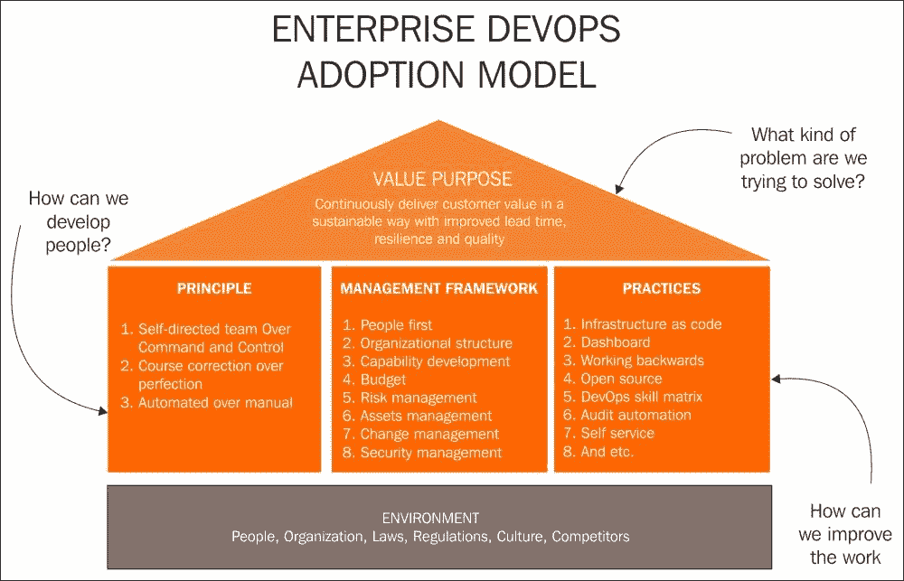
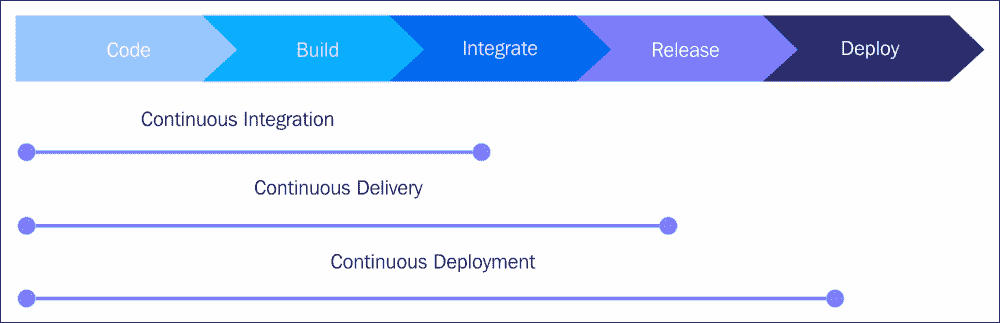
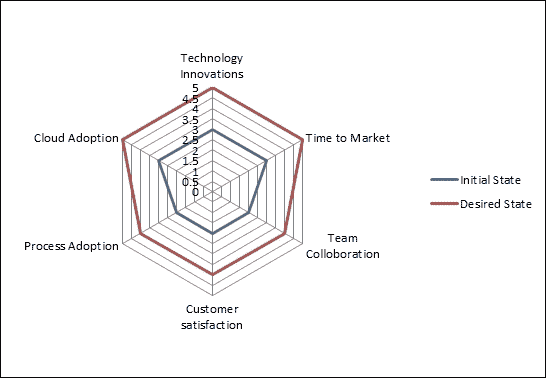
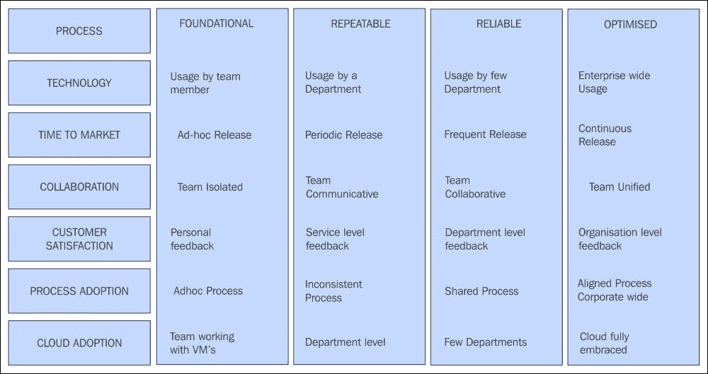
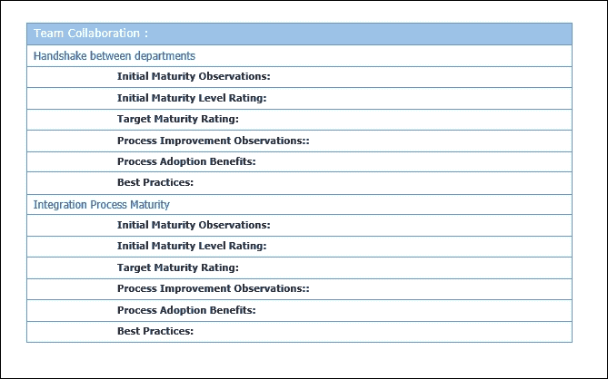
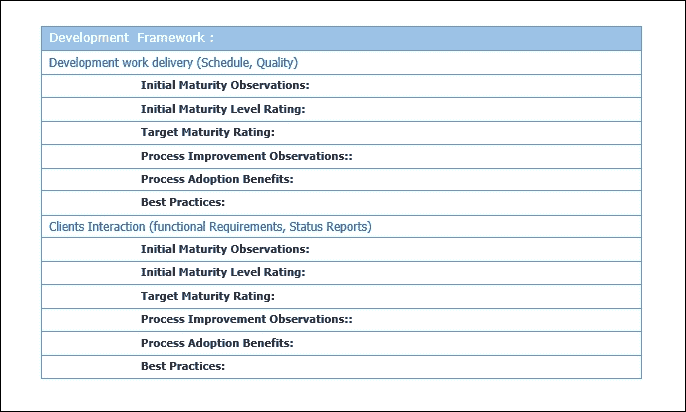
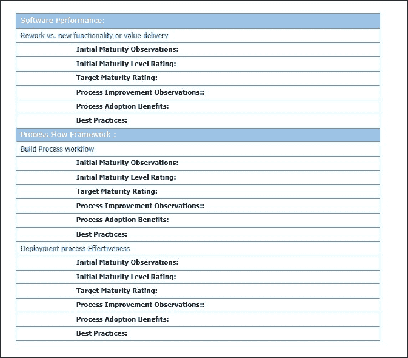
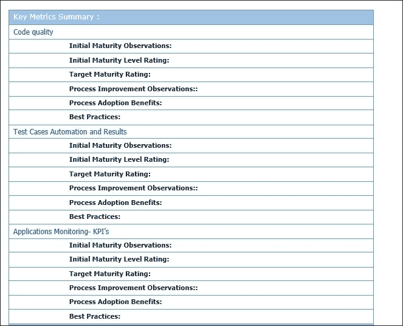
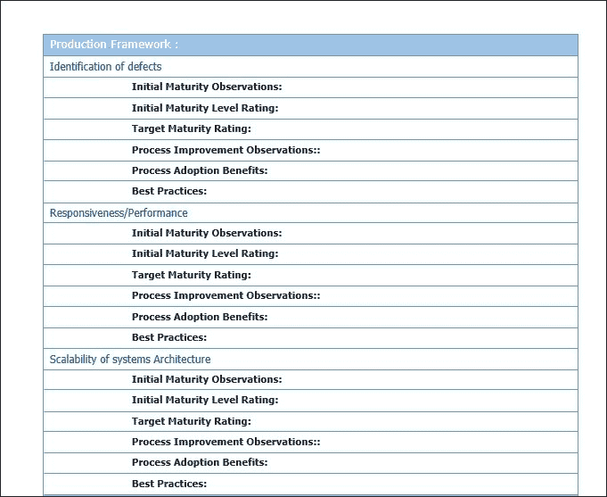
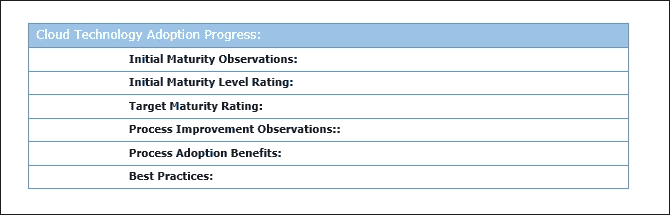

# 第二章. DevOps 框架

在本节中，我们将学习不同的 DevOps 流程、框架和最佳实践。我们将介绍 DevOps 过程成熟度框架和进展模型，并为每个阶段提供检查表模板。我们还将了解敏捷术语和方法论，并了解组织采用它后所获得的好处。本节将涵盖以下主题：

+   DevOps 过程

+   DevOps 进展框架

+   DevOps 成熟度模型

+   DevOps 最佳实践

+   敏捷与 DevOps

# DevOps 过程

行业内规定并被组织采纳的 DevOps 标准流程列在此处；我们将详细讨论它们：

+   源代码管理

+   源代码审查

+   配置管理

+   构建管理

+   仓库管理

+   发布管理

+   测试自动化

+   持续集成

+   持续交付

+   持续部署

+   基础设施即代码

+   应用性能监控

+   日常自动化/持续改进

+   DevOps 框架——在 DevOps 框架下，我们将研究生命周期模型、成熟度状态、进展和最佳实践框架，以及敏捷方法论：

    +   DevOps 项目生命周期

    +   成熟度状态

    +   进展框架

    +   DevOps 实践框架

    +   敏捷方法论

# DevOps 最佳实践

采用 DevOps 最佳实践将有助于协调人员并朝着组织目标进展。DevOps 提供了在软件开发的每个阶段的多个流程框架。在组织中全面实施 DevOps 需要文化转变，整合部门、人员和软件生命周期的过程。这使得组织能够在遵从性和流程遵守方面在成熟度路线图上不断提高：

## DevOps 过程

现在我们将详细讨论行业中规定的 DevOps 标准流程，这些流程已被许多组织采用。

### 源代码管理

**源代码管理**（**SCM**）系统已经使用了几十年，提供了许多功能和好处。然而，将它们与 DevOps 流程集成，能够提供强大的集成和自动化。源代码管理系统使多个开发人员能够同时在多个开发中心进行代码开发，这些中心分布在不同的地理区域。SCM 帮助管理代码库和文件级的版本控制，确保开发人员不会覆盖彼此的代码，并能在各自的分支上并行工作。

开发人员将其代码更改合并到主分支或子分支，合并内容可以被跟踪、审计、查询错误修复，并在需要时回滚。分支是 SCM 的一个重要功能，软件的多个分支被维护用于不同的主要和次要版本，跟踪各种版本中的特性和错误修复。SCM 能够在开发、测试和生产环境中管理过程合规性，促进从开发到支持的整个软件生命周期管理。

DevOps 流程框架强调采用 SCM 来为组织带来以下好处：

+   软件开发团队成员之间的服务协调

+   定义任何版本的单一真实来源，无论是次要版本还是主要版本

+   在实施之前审查更改

+   跟踪共同创作、协作和个人贡献

+   审计代码更改和回滚功能

+   增量备份与恢复

市场上流行的 SCM 工具如下：

+   IBM ClearCase

+   Perforce

+   PVCS

+   Team Foundation Server

+   Visual Studio Team Services

+   Visual SourceSafe

开源 SCM 工具如下——它们的流行也归功于 DevOps 的广泛采用：

+   **Subversion** (**SVN**)

+   **并发版本系统** (**CVS**)

+   Git

+   SCCS

+   版本控制系统

+   Bitbucket

### 代码审查

代码审查是提高软件实例质量的重要过程，在将其集成到主流之前，它们有助于识别并去除常见的漏洞，例如内存泄漏、格式错误和缓冲区溢出。代码审查或检查可以是正式的也可以是非正式的。在正式的代码审查中，过程通过多种方法进行，例如正式会议和逐行检查代码的互动。非正式代码审查可以通过肩膀审查、电子邮件、对写代码的合作编程，或工具辅助的代码审查进行——这些也被称为**代码走查**。

代码审查过程框架为组织带来的好处如下：

+   软件开发团队成员之间的协作

+   在集成之前识别并消除代码缺陷

+   提高代码质量

+   快速的开发周期周转

用于代码审查自动化的专有工具：

+   Crucible

+   Collaborator

+   Codacy

+   Upsource

+   理解

用于代码审查自动化的开源工具：

+   Review board

+   Phabricator

+   Gerrit

+   GitLab

### 配置管理

**配置管理**（**CM**）是一个广泛的主题，涉及在企业级别上管理配置项，根据**基础设施库**（**ITIL**）的定义；甚至**配置管理数据库**（**CMDB**）也是 CM 策略的一部分。配置管理包括软件和硬件的配置项的识别、验证和维护，如补丁和版本。简单来说，就是管理系统的配置，并确保其适应预期的目的。配置管理工具将根据要求验证系统配置的适宜性以及系统间的互操作性。一个常见的例子是确保在开发系统上开发的代码在 QA（测试）系统和生产系统上有效运行。系统间任何配置参数的丢失都会对应用性能产生灾难性影响。

根据 DevOps，组织引入配置管理流程和工具的好处可以总结如下：

+   通过配置变更提供影响分析，帮助组织

+   允许在不同系统（如开发、QA、生产）上进行自动化配置

+   便于系统的审计、账户管理和验证

+   通过确保一致性减少冗余工作

+   有效管理同时进行的更新

+   避免“单一真实版本”相关的配置问题

+   简化开发和运维团队成员之间的协调

+   有助于跟踪缺陷并及时解决

+   有助于预测性和预防性维护

一些流行的基础设施配置管理工具如下：

+   BMC 软件的 Atrium

+   惠普企业的通用配置管理数据库

一些流行的软件配置管理工具如下：

+   Chef

+   Puppet

+   Ansible

+   Salt

+   Juju

### 构建管理

构建管理是准备构建环境的过程，用于将软件应用程序的所有组件汇集成一个完整、可用的产品，适合其预期目的。源代码、编译器、与硬件和软件组件的依赖关系等，都会被编译成一个整体单位。构建可以是手动的、按需的或自动化的。按需自动化构建通过脚本重新启动构建，在少数情况下使用。定时自动化构建是指在持续集成服务器上运行的夜间构建。触发式自动化构建是在 Git 仓库提交后立即启动的。

根据 DevOps，构建管理流程和工具对组织的好处可以总结如下：

+   确保软件可用的核心功能

+   确保软件在客户端环境中的可重用性和可靠性

+   提高软件的效率和质量

+   这也是一项监管要求

一些使用中的构建工具如下：

+   Ant

+   Buildr

+   Maven

+   Gradle

+   Grunt

+   MSbuild

+   Visual Build

+   Make (CMake/QMake)

### 构件仓库管理

构建构件仓库管理器是一个专门的服务器，用于托管成功构建的多个二进制组件（可执行文件）仓库。通过集中管理多种二进制类型，它简化了访问及其依赖关系的复杂性。

其好处如下：

+   管理构件生命周期

+   确保构建是可重复且可再现的

+   有序访问构建构件

+   便于跨团队和供应商共享构建

+   基于构件的保留策略以满足审计合规性

+   高可用性构件及访问控制

一些使用中的仓库工具如下：

+   Sonatype Nexus

+   JFrog Artifactory

+   Apache Archiva

+   NuGet

+   Docker hub

+   Pulp

+   Npm

### 发布管理

发布管理是软件生命周期的一部分，旨在促进发布从开发、测试、部署到支持/维护的过程。它与 SDLC 中的其他 DevOps 过程领域相互关联。

发布管理已成为开发过程的一个不可或缺的部分。然而，将其纳入 DevOps 框架中，使得自动化形成了完整的循环。

发布管理是一个迭代周期，始于请求添加新特性或更改现有功能。一旦更改获批，新的版本就会设计、构建、测试、审查，经过接受后部署到生产。在支持阶段，可能会进行增强或性能改进，从而启动新的开发周期。

采用发布管理的好处如下：

+   产品生命周期整体管理，跟踪并整合每个阶段

+   协调所有阶段活动——开发、版本控制、构建、质量保证、系统配置、生产部署和支持

+   跟踪各环境中最近部署的状态

+   审计与每个发布相关的所有工作项的活动历史

+   发布管理的自动化依赖于自动化其所有阶段

+   团队可以编写发布定义，并以可重复、可靠的方式自动化部署，同时跟踪从开发到生产的进行中的发布。

+   对授权访问和更改批准进行细粒度的访问控制

一些发布管理工具包括：

+   Electric Cloud

+   Octopus Deploy

+   Continuum

+   Automic

+   Quikbuild

+   UrbanCode Release

+   CA 服务虚拟化（LISA）

+   BMC 发布流程管理

+   Plutora 发布

+   CA 发布自动化

+   Serena 发布

+   MS Visual Studio

+   StackStorm

+   Rally

### 测试自动化

手动测试每个可能的场景既繁琐又耗费人力、时间和金钱。自动化测试，或者称为自动化测试，是指在没有人工干预的情况下执行测试用例。虽然并非所有测试用例都适合自动执行，但大多数可以安排定时执行。自动化是通过使用自动化工具或调度自动化脚本来实现的。测试数据作为输入并捕获结果进行分析。自动化测试的目标是通过减少需要手动执行的测试用例数量来补充手动测试，而不是完全取代手动测试。

自动化测试适用于那些重复、单调、繁琐且耗时的测试用例，这些用例有明确的输入和边界条件。它不适用于经常变化的、临时的或首次执行的测试用例。软件自动化测试可以基于几种框架的数据类型；如关键字、模块化和混合型框架。

测试大数据系统涉及多种技术、集成、框架和测试模块，如功能测试、安全测试、可用性测试、性能测试、集成测试等。

采用自动化测试的好处如下：

+   提高软件质量和响应速度

+   用自动化替代人工工作，从而加快工作流程

+   提高整个测试生命周期的效率

+   增量和集成测试用于持续集成和交付

一些自动化测试工具如下：

+   Visual Studio Test Professional

+   QTP (UFT)

+   SoapUI

+   TestDrive

+   FitNesse

+   Telerik Test Studio

+   Selenium

+   TestComplete

+   Watir

+   Robotium

### 持续集成

持续集成是 DevOps 最佳实践之一，开发人员将其代码持续集成到一个共同的共享仓库中，按小的逻辑单元进行，并定期提交（例如，每天一次）。这种流程的优势在于代码的质量和适应目标的透明性。否则，在固定时间后进行大量代码集成可能会暴露出许多缺陷或集成挑战，解决这些问题可能会非常昂贵。

为了实现持续集成，必须先实施以下几个前提条件：

+   使用版本仓库来管理源代码

+   定期提交代码计划

+   自动化代码变更的测试

+   自动化构建

+   在预生产环境中部署构建

持续集成的好处如下：

+   我们早期并且频繁地提交代码，从而获得最新的代码

+   由于早期检查并暴露了构建问题，构建周期更快

+   构建过程的透明度意味着更好的责任归属和更少的缺陷

+   自动化部署过程能更快速地完成工作

一些可用的持续集成工具如下：

+   Jenkins

+   TeamCity

+   Travis

+   Go CD

+   Buddy

+   Bitbucket

+   Chef

+   Microsoft Teamcenter

+   CruiseControl

+   Bamboo

+   GitLab CI

+   CircleCI

+   Codeship

下图表示持续集成、持续交付和持续部署的角色：

### 持续交付

持续交付是软件开发周期中持续集成的下一步；它使得软件的快速、可靠开发以及最少人工干预或管理开销的产品交付成为可能。在持续集成中，正如我们所看到的，代码开发时包含审查，之后是自动化构建和测试。而在持续交付中，产品以小的频繁单位被移动到预生产（暂存）环境中，进行彻底的用户验收测试。重点是理解与软件相关的功能和性能问题。这使得与业务逻辑相关的问题可以在开发周期的早期发现，确保这些问题在继续进行到部署生产环境或增加新功能等其他阶段之前得到解决。持续交付为开发者提供了更大的可靠性和可预测性，使得软件随时可以发布，最终的生产部署是基于业务决策的手动步骤。

持续交付过程的好处如下：

+   开发的代码被持续交付

+   代码不断并定期进行审查

+   高质量的软件能够快速、可靠地、反复部署

+   最大化自动化并最小化人工开销

执行持续集成的工具也能够执行持续交付的工作。

### 持续部署

持续部署是代码更改的完全成熟和完整的过程周期，经过软件生命周期的每个阶段，最终部署到生产环境中。

持续部署要求整个过程自动化——也称为自动化应用发布——涵盖所有阶段，如应用打包、确保依赖项集成、部署测试以及为合规性生成充分的文档。

持续部署和自动化应用发布的好处如下：

+   频繁的产品发布尽可能快地交付软件

+   与代码更改一起自动化和加速产品发布

+   从技术和质量角度来看，代码更改符合生产要求

+   产品的最新版本以可交付格式准备好

+   部署建模减少了错误，从而提升了产品质量

+   整合访问所有工具、流程和资源数据，有助于更快地排除故障并缩短上市时间

+   开发、质量保证和运维团队之间的有效协作提高了产出，并提升了客户满意度

+   由于对所有阶段活动的集中视图，有助于降低审计工作量

### 基础设施即代码

**基础设施即代码**（**IaC**）是通过定义配置文件来执行基础设施服务的一种方式。在 DevOps 范畴内，IaC 是通过代码自动化日常任务，通常是作为配置定义文件，例如 shell 脚本、Ansible playbook、Chef 配方或 Puppet 清单。它通常是一个服务器和客户端的设置，使用推送或拉取机制，或通过 **安全外壳**（**SSH**）无代理方式进行。许多系统上的常规任务，如创建、启动、停止、删除、终止和重启虚拟机或裸金属机器，都是通过软件执行的。在传统的本地系统中，许多系统管理任务都是手动的，且依赖于个人。然而，随着大数据和云计算的爆炸式增长，所有常规的系统活动和任务都像任何软件代码一样被管理。它们存储在代码仓库中，并且最新的构建更新会经过部署测试。

IaC 的优势如下：

+   使用定义文件和代码来更新系统配置非常快捷。

+   所有代码和更改的版本更加不易出错，并且具有可复现的结果。

+   通过 IaC 和测试系统对部署进行彻底测试。

+   较小的常规更改容易管理，而较大的基础设施更新可能包含难以检测的错误。

+   使用定义文件可以轻松进行审计跟踪和合规性检查。

+   多台服务器同时更新。

+   系统可用性高，停机时间少。

+   一些用于 IaC 的工具如下：

+   Ansible tower

+   CFEngine

+   Chef

+   Puppet

+   SaltStack

### 日常自动化

每个组织都致力于自动化日常重复性任务；事实上，大多数公司和软件产品的生存依赖于它们自动化的程度。ERP 系统、数据可视化、领域应用、数据分析等几乎所有领域都是潜在的自动化区域。一些需要自动化的部分包括基础设施（部署、补丁、可扩展性）、应用程序（开发、集成、构建、交付和部署）、负载均衡器、反馈以及缺陷/错误管理。

### 关键应用性能监控/指标

性能指标是每个工具、产品和服务的一部分。因此，组织始终警惕其应用程序、产品和服务的性能指标监控。要为任何产品实现高质量输出，首先必须在流程和指标上达到较高的标准。有许多参数可用来衡量性能指标，例如，应用程序或硬件系统的可用性或正常运行时间与停机时间和响应性，工单分类、确认、解决时间等。

DevOps 关注的是衡量指标和反馈，并结合持续改进过程。

有多种工具可用于不同需求的应用监控；我们将在本课程的后续部分讨论在 DevOps 框架下最合适和适用的工具。

# DevOps 框架

在 DevOps 框架下，我们将研究生命周期模型、成熟度状态、进展和最佳实践框架，以及敏捷方法论。

实现 DevOps 成熟度是一个逐步推进的过程，朝着良好结构化和计划化的方向发展，具体阶段如下：

## DevOps 成熟度生命周期

DevOps 项目阶段与软件开发生命周期一致，如此处所述。我们将详细讨论每个阶段：

+   **发现与需求阶段**：DevOps 发现阶段是一个高度互动的项目阶段，旨在收集关于当前过程、框架和工具的输入和反馈，主要来自关键利益相关者。模板和检查清单用于捕捉这些输入。此阶段的时间表取决于关键利益相关者的可用性、相关文档的存在以及需要探索的过程的复杂性。发现阶段的交付物如下：

    +   详细说明当前过程、工具、框架状态的模板

    +   关键利益相关者对已收集细节的签署

    +   现有的最佳实践和 DevOps 方法

    +   现有挑战、约束条件（如适用）

    +   可重用的工具、过程、工件

+   **设计图纸阶段**：设计阶段也是架构阶段；其目的是绘制出达成目标状态的蓝图。这是一个迭代过程，涉及权衡工具和过程的替代方案，并通过关键利益相关者达成一致。时间表和成本将基准化，并根据项目进展中的新学习定期回顾和修订。此阶段的时间表取决于过程、工具和预算对关键利益相关者的可接受程度。设计阶段的交付物如下：

    +   达成一致的目标状态

    +   要采纳的 DevOps 过程基准化

    +   最具可行性的工具基准化实施

    +   基准化的时间表和成本

+   **开发阶段**：从蓝图阶段基准化的工件将成为开发阶段的输入，包括商定的过程变更、要实施的工具、要采用的框架等。一份详细的项目计划，涵盖交付物、进度安排、依赖关系、约束条件、资源平衡等，将非常有用。敏捷 Scrum 方法论将是实现 DevOps 的框架，具体内容将在后续讨论。开发阶段的时间表将依据最初基准化的项目计划，并随着完成的里程碑进展定期修订。开发阶段的交付物如下：

    +   初始项目计划已基准化并签署

    +   在项目完成前融入定期反馈

    +   为每个阶段分配资源

    +   包括新技能、新方法、新过程和新工具

    +   针对项目风险、限制等的解决方案

    +   按项目计划约定的交付物

+   **部署阶段**：DevOps 部署阶段遵循上述 DevOps 流程框架中概述的最佳实践。其取决于部署是流程、应用工具，还是基础设施。时间表将根据在开发阶段积累的经验进行评估。部署阶段的交付物如下：

    +   部署指南——生产切换计划

    +   部署检查表

    +   来自关键利益相关者的签字确认

    +   回滚计划

    +   容量规划

+   **监控阶段**：监控每个阶段在开发、构建、集成和部署过程中的关键绩效因素。随后跟踪缺陷、漏洞修复、用户票务和持续改进计划。监控阶段的时间表根据组织需求和绩效基准进行设定。监控阶段的交付物如下：

    +   操作手册

    +   反馈表格和检查表

    +   用户指南，支持手册

    +   流程手册

    +   绩效基准

## DevOps 成熟度图

DevOps 的采纳是一个为组织增值的过程。这不是一种可以一蹴而就的成就，而是通过一段时间的逐步成熟并表现出结果的过程。像任何能力成熟度模型（CMMI）或流程成熟度模型一样，关键的成功因素必须为程序的绩效目标进行定义。主要评估参数的初始成熟度状态需由关键利益相关者达成一致。然后，项目章程中将定义该参数变量的目标成熟度等级，以及经过利益相关者批准的详细程序、里程碑、预算和约束条件。

DevOps 流程成熟度框架

## DevOps 进展框架/准备模型

如前所述，DevOps 的采用是一个使组织逐步达到更高成熟度状态的过程。在下表中，列出了 DevOps 在广泛范围内的不同实践领域和成熟度等级。DevOps 的成熟度等级在不同团队之间可能有所不同，具体取决于他们的标准，类似地，即使是同一组织的一个共同部门或分部，其在相同流程中的实践也可能远比其他部门更为先进。全公司范围内提升并实现最佳 DevOps 流程工作流应是所有团队和部门的最终目标。

## DevOps 成熟度检查表

如前所述的流程成熟度框架，采用检查表和讨论进行评估。针对每个关键关注领域，详细的调查结果将表明其成熟度水平。

研究结果提供了成熟度水平及其影响的一般估算：

## DevOps 过程项目的敏捷框架

DevOps 项目通常基于敏捷框架，以实现开发和实施过程的高效快速周转。

基于敏捷软件开发的项目已在行业中得到广泛接受和采用。传统的瀑布模型已经过时，无法跟上敏捷方法所带来的优势。

敏捷方法论的成功归功于其核心目标，如下所示：

+   个人和互动被重视，优于流程和工具

+   工作软件被看重，优于详尽的文档

+   客户合作被看重，优于合同谈判

+   相较于遵循项目计划，变更采纳的敏捷性更为重要

### 敏捷开发方式

Scrum 是一种敏捷开发方法，专注于功能开发，团队成员包括如下角色：

+   Scrum Master 负责团队设置、主持冲刺会议并移除开发中的障碍

+   产品负责人创建并优先排序产品待办事项列表，并负责每个冲刺迭代周期中功能的交付

+   Scrum 团队负责管理和组织工作，以完成冲刺周期中的任务。

+   产品待办事项列表是要开发的功能特性和需求的清单

敏捷开发方法是一种增量和迭代的方式，用于开发用户故事、软件功能或功能模块。客户可以早期看到产品特性，并在需要时进行必要的更改。开发周期被分为两到四周的冲刺周期，以完成工作单元。其理念是，通过开发人员和测试人员组成的团队，可以快速开发和管理较小的周期。结构和文档并不重要，但代码的可工作特性被视为最有价值的。开发过程通过连续的冲刺周期进行迭代实现。发现的漏洞会在最早的冲刺中进行修复，并通过成功的测试。回归测试会在新功能或逻辑开发时执行。用户验收测试会在冲刺周期结束后进行，以便标记产品进行发布。

采纳敏捷软件开发最佳实践的好处如下：

+   工作软件能够让客户满意，因为他可以查看功能

+   客户可以在开发的任何阶段提出变更请求

+   软件的快速持续交付，通常以周为单位

+   项目围绕着充满动力的个体构建，且这些个体应当受到信任

+   冲刺团队在交付上高度熟练且高效

+   由于开发人员和测试人员共同开发，漏洞会在冲刺周期内得到解决

+   沟通模式有效，因此交付的产品质量更高

+   持续关注技术卓越带来良好的设计

+   自组织团队专注于最佳架构、需求和设计

+   团队精简且高效，因此生产力最大化

# 总结

在本课程中，我们了解了 DevOps 流程、框架、最佳实践、DevOps 流程成熟度框架和进展模型及其检查清单模板的应用。我们还学习了敏捷术语和方法论。

在下一个课程中，我们将学习如何实现 DevOps 核心流程。

# 评估

1.  以下哪项 DevOps 流程提供了强大的集成和自动化？

    1.  源代码管理

    1.  代码审查

    1.  配置管理

    1.  构建管理

1.  以下哪些是用于代码审查自动化的专有工具？

    1.  Git

    1.  SCCS

    1.  Crucible

    1.  SVN

1.  以下哪些是工件库管理的好处？

    1.  确保软件在客户环境中的可重用性和可靠性

    1.  确保构建是可重复和可再现的

    1.  跟踪各个环境中最近部署的状态

    1.  审计与每次发布相关联的所有工作项活动的历史记录

1.  以下哪项是 DevOps 成熟生命周期中发现阶段的交付成果？

    1.  要实施的最可行工具的基准

    1.  基准同意的时间线和成本

    1.  可重用的工具、流程和工件

    1.  要采纳的 DevOps 流程基准

1.  _________ 负责团队设置、召开冲刺会议并消除开发障碍。

    1.  Scrum Master

    1.  产品负责人

    1.  客户

    1.  Scrum 团队
