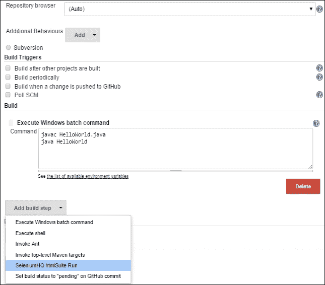
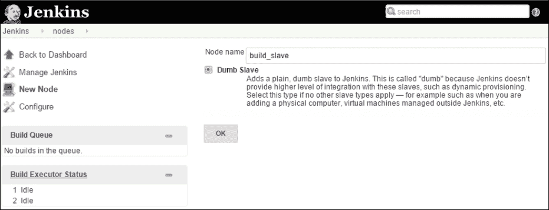

# 第三章：DevOps – 持续集成与交付

在本课程中，我们将学习实施 DevOps 核心过程，如源代码仓库、代码审查、工件仓库、持续测试、持续开发和持续集成。我们将重点介绍一些流行工具，如 Git、Jenkins、Maven、Gerrit、Nexus、Selenium 等。

+   **持续集成**（**CI**）

+   **持续交付**（**CD**）

+   Jenkins 工具设置

+   配置管理—Jenkins

+   源代码管理—Git

+   构建管理—Maven

+   源代码审查—Gerrit

+   仓库管理—Nexus

+   测试自动化—Selenium

+   持续部署—流水线

+   Jenkins 客户端设置

+   Jenkins 安全性

+   Jenkins 指标

持续集成与持续交付是确保高质量和及时交付软件的重要且有价值的流程。持续集成是一个集成软件开发过程，其中多个开发者遵循敏捷方法，并将其调整为以下最佳实践：

+   确保所有开发代码都受到版本控制系统的管理

+   纳入充分的代码审查流程

+   代码更改被快速集成、测试和构建

+   构建过程集成以运行单元测试并自动化

+   立即处理构建错误，迅速恢复

+   构建结果和仓库管理的跟踪与指标

+   透明且用户友好的构建过程

持续交付是持续集成过程的延伸。

+   软件的最新版本随时可用

+   从技术和质量角度通过测试周期的变更已准备好部署

+   自动化运输和部署过程

持续集成过程如下图所示：


持续集成过程如下所示：

+   **开发者的环境**：开发者在本地工作区中创建代码更改，配有集成开发环境（IDE）运行时以及安装在 PC 上或基于云的（Web IDE）构建工具。开发者进行单元测试、数据验证、代码性能检查等操作。开发者所做的代码更改会推送到源代码管理系统。

+   典型的持续集成与部署周期包括设置 CI/CD 基础设施和流程，具体如下：

    +   源代码版本与仓库管理系统

    +   用于启动编排流水线的进程调度器

    +   用于管理代码构建和定期测试的构建过程

    +   执行构建的构建节点

    +   在已识别的测试节点上进行自动化测试过程

    +   构建结果工件仓库

    +   用于存储构建结果的工件仓库

    +   测试节点上的场景和验收测试

    +   使用部署工具将应用程序安装到运行时系统

    +   部署到运行时系统上的应用程序的验收测试

质量经理将批准接受测试，以便同意部署测试系统。

交付经理将批准应用程序的生产环境部署。

# CI/CD 的最佳实践

让我们来看一下 CI/CD 的最佳实践：

+   **使用版本控制**：在协作开发环境中，多个开发者同时进行开发时，会遇到许多挑战：

    +   源代码管理系统在将代码置于版本控制系统下后，定义了代码的单一可信来源。通过有效地采用主干开发和修复分支（如 bug 修复）的合并过程，源代码将能够可复现。Git 是一个流行的源代码管理系统，GitHub 是其云变种，提供**软件即服务**（**SaaS**）模式：

+   **自动化构建**：标准化的自动化构建程序将稳定构建过程，以产生可靠的结果。成熟的构建过程必须包含构建描述和执行构建所需的所有依赖项，以及标准化构建工具的安装。Jenkins 是最具通用性的构建工具，它提供方便的用户界面，并且有插件集成了大多数流行的持续集成工具。

+   **构建中的测试**：需要执行一些测试，以验证代码的有效性和适用性，不仅仅是语法正确性，具体包括：

    +   单元测试直接作用于构建结果

    +   在开发者提交代码之前进行静态代码检查。可以使用 Git 预提交触发器或 CI 系统来设置一个门控或非门控检查。

    +   针对新构建应用程序的场景测试，以确保其能够正确安装并启动

    +   代码的功能性能

单元测试框架在源代码技术中非常流行，例如 Java 的 JUnit。Selenium 框架提供图形用户界面和浏览器行为的自动化测试。

将这些测试尽早实施到开发者的工作站作为构建的一部分，可以节省在开发过程中发现 bug 后处理的时间和精力。

+   **早期且频繁地提交代码**：在一个有多个项目的分布式开发环境中，每个团队或开发者都打算将他们的代码与主干进行集成。同时，特性分支的更改也需要集成到主干中。快速且早期地集成代码是一种最佳实践。新更改与主干合并的时间延迟会增加产品不稳定的风险，增加时间成本，并且随着主干从基线演变而带来更多复杂性。因此，每个与特性分支协作的开发者每天至少应该提交一次代码。对于主分支上不活跃的项目，必须在实施前评估不断重新基准化的高成本。

+   **每次更改都要构建**：开发者的更改需要被纳入主干中，但这些更改可能会破坏主干的稳定性，影响依赖主干的开发者的工作。

持续集成通过对每次提交的代码变更进行持续构建来解决这个问题。任何构建失败都需要立即处理，因为构建失败会阻碍主线的演进，而且根据提交频率和问题的严重性，这会变得非常昂贵。通过强制实施分支级构建，可以将这些问题降到最低。

在 Gerrit 中发起审核或在 GitHub 中发起拉取请求是有效的机制，可以提出变更并通过在变更推送到主线之前识别问题来检查变更的质量，避免返工。

+   **快速处理构建错误**：为每个变更在分支级别构建的最佳实践会将修复代码构建问题的责任放在各个开发者身上，而不是将问题传播到主分支。这形成了一个持续的“变更-提交-构建-修复”循环，在各自的分支级别进行。

+   **快速构建**：自动化过程的快速构建、结果和测试应成为开发者工作流程的关键输入；短时间的等待将有利于持续集成过程的整体周期效率。

这是一项平衡工作，在将新变更安全地集成到主分支的同时，还要进行构建、验证和场景测试。有时，可能会存在目标冲突，因此需要通过权衡找到不同接受标准之间的妥协点，考虑到主线质量最为重要。标准包括语法正确性、单元测试和对变更进行快速运行的场景测试。

+   **生产前运行**：生产流水线各个阶段的多个设置和环境会导致错误。这适用于开发者环境、分支级别构建配置和中央主构建环境。因此，进行场景测试的机器应与主要生产系统相似，并具有可比的配置。

手动保持一致的配置是一项艰巨的任务；这正是 DevOps 所带来的价值和核心价值主张，且将基础设施设置和配置视为编写代码的过程。所有机器的软件和配置都定义为源文件，这使得你能够重建相同的系统；我们将在第 4 课中更详细地讲解，*DevOps 持续部署*。

+   构建过程是透明的：构建状态和最后一次更改的记录必须对所有人可用，以便确定构建的质量。Gerrit 是一个变更审查工具，可以有效地记录和跟踪代码变更、构建状态和相关评论。Jenkins 流程插件为构建团队和开发人员提供了完整的端到端概览，涵盖源代码管理工具、构建调度器、测试环境、工件仓库等。

+   自动化部署：以自动化方式将应用程序安装到运行时系统中称为部署，并且有多种方式可以实现这一点。

    +   自动化场景测试应该是变更提议的验收过程的一部分。这些测试可以通过构建触发，以确保产品质量。

    +   设置多个运行时系统，如 JEE 服务器，避免单实例瓶颈，能够并行运行测试查询。使用单个系统还会产生重新创建环境和每个测试用例变更开销的负担，导致性能退化。

    +   使用 Docker 或容器技术按需安装和启动运行时系统，并在定义明确的状态下运行，然后移除。

    +   自动化测试用例，由于新评论的验证频率和时间在大多数情况下是不可预测的，因此在给定时间调度每日任务是一个可以探索的选项，在此过程中构建会被部署到测试系统并在成功部署后通知。

    +   部署到生产环境是一个人工有意识的决定，满足所有质量标准并确保更改适合部署到生产环境。如果可以自信地实现自动化，这也是自动化持续部署的最高成就。

持续交付意味着每个集成的变更都经过充分验证，确保它可以部署到生产环境。这并不要求每个变更都自动部署到生产环境。

# Jenkins 设置

我们将从 Jenkins 开始，因为它是持续集成过程中的核心组件。Jenkins 的处理流程如下所示：


参见 Jenkins 首页：[`jenkins.io/index.html`](https://jenkins.io/index.html)，如下所示：


## 安装 Jenkins 的前提条件

Jenkins 的安装和配置要求应根据以下参数进行充分规划，如 Jenkins 首页所述：

+   操作系统—Linux 版本（Ubuntu/Debian、Red Hat/Fedora/CentOS、openSUSE、FreeBSD、OpenBSD、Gentoo）、Windows、macOS X

+   JDK 版本

+   内存

+   磁盘空间

+   Java 容器—Jenkins WAR 文件可以在任何支持 Servlet 的引擎上运行，如 Tomcat 或 Glassfish 应用服务器。

Jenkins 可以根据其用途以不同的方式安装：

+   **独立运行**：Jenkins 可以在其自己的进程中独立运行，使用内置的 Web 服务器（Jetty）进行实验和小项目。

+   **基于 Servlet**：它还可以作为一个 Servlet 框架运行，用于开发项目。

+   **用于预发布或生产的多节点设置**：分布式客户端-服务器设置；建议使用 Jenkins 的高级安装程序。

### 独立安装

如名称所示，独立安装是在单台机器上独立进行的（与为不同任务使用多个系统相对）：

1.  独立安装要求系统已安装 JDK。

1.  下载 `Jenkins.war` 文件。

1.  打开命令提示符，在 `Jenkins.war` 文件所在位置运行以下命令：

    ```
    C:>Java -jar Jenkins.war

    ```

    

在初始化过程中，将运行一些任务，并且在安装过程中会出现以下屏幕：

1.  初始屏幕页面会询问插件选项：

1.  插件将根据前述选项中的配置进行安装：

1.  安装成功后，将弹出以下管理员凭证创建页面：

1.  **访问 Jenkins**：安装成功后，可以通过本地机器的 Web 浏览器访问 Jenkins，如下所示：

    `http://localhost:8080`

1.  Jenkins 仪表板将通过此链接打开：

1.  仪表板中的 **管理 Jenkins** 选项将提供各种配置参数的选项：

1.  仪表板中的 **管理插件** 选项是一个重要选项，提供了大量插件选择，用于与源代码系统、认证系统、各种开发平台等进行集成。

    在 Servlet 引擎上安装 Jenkins 需要安装 Tomcat 或 Glassfish。

    

1.  将 `Jenkins.war` 文件复制到 `tomcat` 文件夹中的 web apps 文件夹。

1.  从 Tomcat `bin` 目录启动 Tomcat 服务器。

1.  `http://localhost:8080/Jenkins` --在 Tomcat 服务器上访问 Jenkins。

### 在 Ubuntu 上的 Linux 系统安装

1.  登录到服务器并更新：`sudo apt-get -y update`。

1.  安装 Java：`sudo apt-get install -y default-jdk`。

1.  使用 `wget` 命令从 `Jenkins-ci.org` 网站下载 Ubuntu 版本：

    ```
    wget http://pkg.jenkins-ci.org/debian-rc/binary/jenkins_2.0_all.deb.

    ```

1.  包安装 `sudo dpkg - i Jenkins.zip`。

1.  通过 `sudo apt - get -f install` 解决依赖问题。

1.  通过端口 `http://localhost:8080/Jenkins` 访问 Jenkins。

1.  按照前面的图示继续操作。

1.  为了在启动时初始化 Jenkins，请在 `/etc/rc.local` 文件中添加命令 `/etc/init.d/jenkins` start。

# Git (SCM) 与 Jenkins 集成

Git 是最流行的源代码管理系统，提供了广泛的好处，例如：

+   版本控制使您能够维护多个版本的代码，用于不同的目的。

+   需要一个代码库来将所有与项目相关的代码集中存放。

+   用户间的协作以及调试过程中的干预。

可以从[`git-scm.com/downloads`](https://git-scm.com/downloads)下载 Git：


可在桌面版和 Web 版中使用多个平台版本，如 Linux、Windows 等。

仓库可以有多种类型：

+   在 GitHub 上创建的公共仓库可以允许每个人访问读取权限，但写入或提交权限仅授予选定的个人或组。

+   私有仓库允许协作者参与，并且需要订阅 GitHub 的付费服务。

+   本地仓库是桌面版本，不需要互联网连接。

+   远程仓库是一个基于 Web 的仓库，提供了如问题管理和拉取请求等扩展功能。

GitHub 提供选项，可以从单台计算机或多台计算机之间同步代码更改。

拉取更改将同步桌面与在线仓库之间的代码更改，而克隆选项将创建仓库的新副本到本地计算机。

执行这些任务使我们能够在基于云的 SaaS 系统中维护源代码。

1.  在 GitHub 上创建一个登录账户。

1.  创建一个项目仓库来组织与你项目相关的代码。

## 将 GitHub 与 Jenkins 集成

若要将 GitHub 仓库与 Jenkins 集成，请按以下步骤操作：

1.  在**管理插件**中，在筛选器部分搜索 Git 插件并安装。

1.  如果默认已安装，我们可以在**已安装**标签下找到它，如下所示：

1.  在 Jenkins 重启后，创建新项目时，Jenkins 主页面会显示如下画面：

1.  选择一个工作名称，接下来的页面将显示如下 Git 选项，位于**源代码管理**标签下。你可以以类似的方式添加其他 SCM 工具，如 CVS、Subversion 等：

1.  在前述的仓库 URL 占位符中输入本地计算机的 Git 仓库地址或 Web 链接，以配置 Git 与 Jenkins 的集成。

# Maven（构建）工具与 Jenkins 集成

让我们执行以下步骤，将 Maven（构建）工具与 Jenkins 集成：

1.  从[`maven.apache.org/download.cgi`](https://maven.apache.org/download.cgi)下载 Maven，这是最新的二进制文件版本：

1.  将下载的 Maven 文件解压到一个文件夹中。

1.  打开**管理 Jenkins**：

    按照如下选择 Maven 插件并安装，不要选择重启选项。

    

1.  监控插件进度如下所示：

1.  在 **配置** 工具下，通过提供仓库位置添加 Maven：

1.  使用 Maven 项目选项创建一个新项目：

1.  构建环境中的 Maven 选项如下：

1.  项目按以下方式创建：

# 使用 Jenkins 构建作业

让我们按照以下步骤使用 Jenkins 构建作业：

1.  一个简单的应用程序构建并运行程序：

1.  以下是列出的源代码仓库选项：

1.  我们可以指定需要构建的文件位置，可以选择从源 Git 代码仓库或 GitHub 的 URL 中获取：

1.  可以通过多种选项、命令模式和 Maven 等执行构建：

1.  命令行程序可以如下执行：

1.  保存后，构建选项可见，并且历史记录也可以查看：

1.  可以看到构建进度并且仓库可用，如下所示：

# 代码审查 – Gerrit

代码审查是软件开发框架中的一个重要功能。拥有像 Gerrit 这样的良好协作工具来进行代码审查过程非常合适且必要。Gerrit 发起一个基于拉取的工作流来启动变更请求，在该过程中，即使是源代码也会包含评论，以便通过工作流过程将变更合并到代码仓库中。Gerrit 维护一个镜像 Git 项目仓库的本地仓库和参考仓库。Gerrit 从主分支创建另一个维护分支来跟踪代码的审查；它为提交信息创建一个 change-id 标识符，以跟踪每次代码审查中的变更。

Gerrit 允许进行代码变更比较，审阅者可以给出五个评分之一：

+   **+2**：看起来不错，已批准

+   **+1**：看起来不错，但需要额外的审批

+   **0**：没有评论

+   **-1**：建议不要提交

+   **-2**：阻止提交

# Gerrit 安装

让我们按照以下步骤安装 Gerrit：

1.  从 [`www.gerritcodereview.com/`](https://www.gerritcodereview.com/) 下载 Gerrit。

1.  根据平台选项按照安装说明进行操作，并通过端口 `8080` 访问 Gerrit，如下所示，以创建用户和项目：

1.  在 Jenkins 中的 **管理插件** 下配置 Gerrit：

在 Lesson 2 中列出的版本控制工具，例如 Gerrit，这是一个基于 Web 的代码审查界面，允许在线审查更改以从任何 Git 客户端推送更改，然后与主分支自动合并；它也可以配置为远程 Git 仓库。

Gerrit 的配置包括用户创建，设置 Secure Shell（SSH）以与 Gerrit 服务器交换数据。配置文件 `/etc/gerrit.config` 包含了需要根据配置需求设置的广泛参数。

# 仓库管理

维护多个构建版本的制品是仓库管理的关键特性，而 Nexus 是一个流行的仓库管理器。可以从 [`www.sonatype.org/nexus/downloads/`](http://www.sonatype.org/nexus/downloads/) 下载它。

安装后，可以从 `http://<nexus host>:8081/nexus` 访问：


Nexus 可以配置插件用于 Jenkins 集成：


# 使用 Jenkins 进行测试

Jenkins 提供许多开箱即用的功能和测试插件。该网站 [`wiki.jenkins.io/display/JENKINS/xUnit+Plugin`](https://wiki.jenkins.io/display/JENKINS/xUnit+Plugin) 提供了这些插件：


下面显示了一系列可用的测试插件：

+   JUnit 本身

+   AUnit

+   MSTest（从 MSTest 插件导入）

+   NUnit（从 NUnit 插件导入）

+   UnitTest++

+   Boost Test Library

+   PHPUnit

+   Free Pascal Unit

+   CppUnit

+   MbUnit

+   Google 测试

+   EmbUnit

+   gtester/glib

+   QTestLib

## 设置单元测试

让我们执行以下步骤来设置单元测试：

1.  选择我们设置的项目：

1.  选择构建选项：

1.  选择一个 **高级** 选项：

1.  输入 `build.xml` 的位置：

1.  选择后构建选项，并选择 **发布 JUnit 测试结果报告**：

1.  在测试 `reports.xml` 中，将报告创建文件夹放入我们项目中，以便 Jenkins 检索通过运行 JUnit 测试用例生成的 XML 文件：

我们可以选择构建并深入到测试结果。

## 自动化测试套件

持续集成是验证构建以客观评估其进入下一级别准备就绪的过程；这通过自动化测试完成。因此，构建制品被设置为自动测试；Selenium 是最流行的框架。

可以从以下网站下载：


1.  在 **Jenkins** 的 **插件管理器** 下，选择 Selenium 插件并安装，重新启动以启动：

1.  配置`selenium server JAR`文件：

1.  配置我们创建的项目，以适应这个自动化框架：

1.  在构建过程中，添加选项**SeleniumHQ htmlSuite Run**：

1.  Selenium IDE 将生成测试套件，通过启动 Selenium 驱动程序，Selenium 测试将通过 SuiteFile 启用：

# 持续交付-构建流水线

持续交付是从软件开发到部署的强大流水线构建过程。


1.  从**管理插件**安装构建流水线插件，如下所示：

1.  要设置构建流水线，请点击仪表板上**所有**标签旁边的**+**符号：

1.  选择**构建流水线视图**并为流水线选择一个名称：

1.  选择**选项**并创建项目：

1.  交付流水线视图通过显示项目每个阶段的状态来创建。

# Jenkins 功能

+   客户端-服务器

+   安全

+   报告

较大的项目需要配置多个机器，而不是在一台机器上进行集中构建。同时，测试构建还需要多个不同的环境。Slave 机器可以有效地将这些负载从主服务器中卸载。

它们需要一个从主服务器通过 TCP/IP 套接字的双向通信链接，仅需要一个 Slave 代理，而不是完整的 Jenkins 包或已编译的二进制文件。

1.  要在 Jenkins 中设置 Slave/节点，请配置并选择管理节点选项，然后创建一个新节点：

1.  选择名称和**傻瓜 Slave**选项。

1.  需要提供 Slave 节点的详细信息，然后选择让 Jenkins 将 Windows Slave 视为 Windows 服务。需要提供机器的节点名称和登录凭证等详细信息。

1.  Slave 机器将如图所示可用；新的作业可以配置为在此 Slave 机器上运行。

## Jenkins 中的安全性

拥有相关权限的用户可以进行安全配置设置：

1.  在**管理 Jenkins**下，选择**配置全局安全性**，然后选择**启用安全性**选项：

1.  保存选项后，系统将提示您输入管理员用户信息。

1.  在**Jenkins 管理**设置中，选择**管理用户选项**来创建用户，然后设置执行作业所需的基于矩阵的安全授权：

1.  可以安装**报告选项**、**度量选项**和**报告插件**。

1.  有多种指标可供使用，例如构建历史指标插件：

    +   **平均故障时间** (**MTTF**)

    +   **平均恢复时间** (**MTTR**)

    +   构建时间的标准偏差

    

1.  它可以在**管理插件**下安装，选择**构建历史指标插件**，上述指标将在工作页面上显示。

1.  要查看图形化表示，请在**管理插件**下使用 Hudson global-build-stats 和**全局构建统计**插件。设置选项、初始化统计数据、创建新图表选项，所有现有的构建记录将显示出来。

# 总结

在本节课中，我们学习了使用仓库管理、代码审查和测试自动化来实现持续开发、持续集成和持续部署的过程和工具。

在下一节课中，我们将讨论基础设施配置管理作为持续部署代码的主题，使用的工具包括 Chef、Puppet 和 Ansible。我们还将讨论使用 Splunk 和 Nagios 进行的持续监控过程。

# 评估

1.  持续交付是延伸 __________ 的过程。

    1.  持续部署

    1.  持续监控

    1.  持续集成

    1.  持续交付

1.  判断以下陈述是对还是错：交付经理将批准接受测试，以同意部署测试系统。

1.  以下哪项是有效的机制，用于在变更被推送到主线之前通过识别问题来提出变更并检查变更的质量，从而避免返工？

    1.  在 Gerrit 中进行审查拉取

    1.  SVN 中的拉取请求

    1.  GitHub 中的拉取请求

    1.  GitHub 中的拉取请求

1.  哪个命令用于安装 Jenkins？

    1.  C:>java Jenkins.war

    1.  C:>Java -jar Jenkins.war

    1.  C:>Java –jar Jenkins.war

    1.  C:>java –jar Jenkins.war

1.  以下哪项是从软件开发到部署构建强大管道的过程？

    1.  持续监控

    1.  持续部署

    1.  持续集成

    1.  持续交付
