# 第四章：DevOps 持续部署

DevOps 持续部署使得更改能够快速地从开发转移到生产环境。基础设施和自动化在实现持续部署中发挥着关键作用。在本课程中，我们将学习配置自动化和使用 Chef、Ansible 等工具实现基础设施自动化（基础设施即代码）。我们还将讨论使用 Splunk 和 Nagios 等工具进行持续监控的过程：

+   持续部署

+   Chef

    +   组件

    +   术语

    +   架构

+   Ansible

    +   组件

    +   术语

    +   架构

+   持续监控

+   Splunk

+   Nagios

正如我们在前面的课程中所讨论的，以下图示展示了持续集成、持续部署和持续交付的对齐过程。

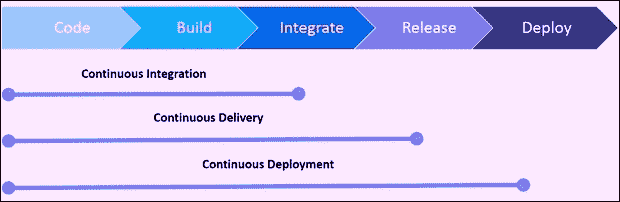

**持续集成**（**CI**）是指将开发、单元测试和构建过程以持续模式进行，而不是以分步方式进行的过程。在 CI 过程中，每个开发人员将其代码更改合并到中央版本控制系统中，每次提交都会触发自动构建。因此，最新版本始终可用，并且构建的可执行文件来自最新的代码。

**持续交付**（**CD**）是软件工程中持续集成过程的下一步，旨在通过短周期的测试和快速、频繁地发布软件。自动化测试过程确保软件可以随时可靠地发布。

持续部署是指最小化新代码开发与其在生产环境中可用之间的时间差（经过的时间）。为了实现这一目标，持续部署依赖于自动化各种步骤的基础设施，每次成功的代码集成符合发布标准后，便会进行部署，实时应用程序会更新为新代码。

传统上，新机器是由管理员和系统工程师根据文档、定制脚本等构建的。通过手动过程（如定制脚本、金像配置等）管理基础设施既耗时又容易出错。希望实现更快和更成熟部署的组织采用基础设施配置自动化，这意味着像管理软件代码一样管理基础设施，从而实现可重复的结果，因此这也被称为**基础设施即代码**。

就像软件开发生命周期（SDLC）过程一样，基础设施也可以通过类似的工具和过程进行管理，如版本控制、持续集成、代码审查和自动化测试，扩展到使基础设施配置变更更加健壮和自动化。

基础设施代码和配置变更将被持续测试、共享并推动到所有环境，从开发到 QA 测试系统，再到生产环境，过程更加轻松、迅速、安全且可靠，并带有详细的变更审计记录。通过基础设施代码作为服务，新机器的配置可以写成代码，并同时设置多个机器到期望的状态。这种可扩展的模型通过利用云的弹性变得更有效。采用 DevOps 的基础设施即代码，不仅限于简单的基础设施自动化，还扩展了以下多个好处：

+   确保无误的自动化脚本是可重复的

+   在多个服务器上重新部署

+   出现问题时能够回滚

+   可以有效执行基础设施代码测试标准，如单元测试、功能测试和集成测试

+   由于机器的文档状态是作为代码维护并保持最新，因此避免了书面文档的使用

+   促进开发与运维团队在基础设施配置和供应方面的协作，以及将基础设施代码作为变更管理的一部分！DevOps 持续部署

我们将从流行工具功能的角度讨论持续部署，如前图所示。

# Chef

Chef 是一个著名的配置管理和基础设施自动化平台；它提供了完整的企业能力，如工作流、可视化和合规性。它使得从开发到生产的基础设施和应用程序的持续部署成为可能。基础设施配置自动化作为代码，可以通过 Chef 在云端、本地或混合环境中进行编写、测试、部署和管理，提供全面的 24/7 支持服务。例如，客户端系统、安全补丁可以通过从主服务器写入配置集并同时在多个节点上执行来更新。

如下图所示，Chef 平台支持多种环境，如 Amazon Web Services、Azure、VMware、OpenStack、Google Cloud 等。Windows、Linux、VMware 等平台都可以使用。所有流行的持续集成工具，如 Bitbucket、Jenkins、GitHub、CircleCI 等，都支持工作流集成。运行时环境可在 Kubernetes、Docker 和 Swarm 上运行。

## Chef Landscape 组件

这里展示了 Chef 的整体环境，包括 Chef 的各个元素，如节点、服务器和工作站及其关系。我们将讨论每个组件、术语及其在生态系统中的作用，以便 Chef 客户端能够执行分配的任务。Chef 的术语类似于烹饪。Cookbook（食谱）是制作菜肴的公式，而 Recipe（配方）是原料。

Chef 的组件包括：

+   Chef 服务器

+   Chef 客户端

+   Chef 工作站

+   Chef 仓库

### Chef 服务器

Chef 服务器是用于维护网络中配置数据的中心，存储食谱，向节点应用策略，并由 Chef 客户端管理每个注册节点的详细元数据。Chef 服务器通过安装在各个节点上的 Chef 客户端提供配置细节，如配方、模板和文件分发。相应地，Chef 客户端在其节点上实现配置，从而减轻了 Chef 服务器的处理任务。此模型具有可扩展性，能够在整个组织中一致地应用配置。

### Chef 服务器的功能

带有管理控制台和搜索功能的 Web 用户界面

+   Chef 服务器上的管理控制台是一个基于 Web 的界面，用于管理多个功能，如：

    +   网络中的节点

    +   食谱和配方

    +   分配的角色

    +   数据包——JSON 数据存储，可能包含加密数据

    +   环境详情

    +   用于索引数据的搜索功能

    +   用于 Chef 服务器访问的管理用户帐户和数据

+   搜索功能便于查询 Chef 服务器上索引的任何类型的数据，如节点、角色、平台、环境、数据包等。Apache Solr 搜索引擎是基础搜索引擎，并扩展了所有功能，如精确搜索、通配符搜索、范围搜索和模糊搜索。可以在配方、命令行、管理控制台搜索功能等不同选项中运行完整的索引搜索。

+   数据包位于 Chef 服务器的一个安全子区域中；它们存储敏感数据，如密码、用户帐户数据和其他机密类型的数据。它们只能被拥有由 Chef 服务器验证的有效 SSL 证书的节点访问。数据包通过 Chef 服务器访问，其全局变量以 JSON 格式存储，可以通过配方进行搜索和访问，并加载。

+   策略定义了如何根据业务和操作要求、流程以及生产工作流实施角色、环境和食谱版本：

    +   角色是一种根据组织中执行的特定职能、模式和流程来分配任务的方式，例如电力或业务用户等。每个节点、Web 或数据库服务器都有独特的属性，并且每个角色都分配一个运行列表。当一个节点执行任务时，它会将其属性列表与执行该功能所需的属性进行比较。Chef 客户端确保属性和运行列表与服务器上的数据保持同步。

    +   环境反映了组织的实际需求，如开发、预发布或生产系统，每个环境都由一个食谱版本进行维护。

    +   食谱书（Cookbooks）维护组织特定的配置策略。不同版本的食谱书被管理，就像源代码控制一样，包括相关环境、元数据、不同需求的运行列表；它们被上传到 Chef 服务器，并在配置节点时由 Chef 客户端应用。食谱书定义了一个场景，并包含支持该场景所需的一切，例如：

        +   配方指定了要使用的资源及其顺序

        +   属性值

        +   文件分发

        +   模板

        +   Chef 扩展，如自定义资源和库

    +   运行列表包含 Chef 配置节点到期望状态所需的所有信息。它是一个按顺序排列的角色和配方列表，精确指定运行顺序以达到预期状态。每个节点都有定制的运行列表，并存储在 Chef 服务器上的节点对象中。它通过刀具命令（knife commands）或工作站上的 Chef 管理控制台进行维护，并上传到 Chef 服务器。

### 节点上的 Chef 客户端

Chef 客户端可以安装在不同类型的节点上——物理、虚拟、云、网络设备等，这些节点都已注册到 Chef 服务器。

+   节点类型：

    +   物理节点是连接到网络的活动设备（系统或虚拟机），并安装有 Chef 客户端，以便与 Chef 服务器通信。

    +   基于云的节点托管在外部云环境中，如 AWS、Microsoft Azure OpenStack、Google Compute Engine 或 Rackspace。带插件的刀具（Knife）支持外部云服务并创建实例，以部署、配置和维护这些实例。

    +   虚拟节点是一个像软件实现一样运行的系统，无法直接访问物理机器。

    +   网络节点，如交换机，可以使用 Chef 进行配置，并自动化物理和逻辑以太网链路属性及 VLAN。网络设备的示例有 Juniper Networks、Arista、Cisco 和 F5。

    +   容器是运行独立配置、共享相同操作系统的虚拟系统。容器在管理分布式和可扩展的应用程序与服务方面非常有效。

+   Chef 客户端：

    +   Chef 客户端执行实际配置。它定期联系 Chef 服务器以检索最新的食谱书，以根据食谱书的指令更新节点的当前状态（如果需要）。这个迭代过程由业务策略强制执行，以确保网络符合预期的目标状态。

    +   Chef 客户端是安装并运行在每个已注册到 Chef 服务器上的节点上的本地代理，确保节点处于预期状态。Chef 客户端承担大部分计算工作。它通常是虚拟机、容器实例或物理服务器。

    +   Chef 客户端与 Chef 服务器之间的身份验证通过每个事务请求的 RSA 公钥/私钥对进行。Chef 服务器上存储的数据在注册节点验证后共享。任何未经授权的数据访问都会被避免。

    +   在安装 Chef 客户端后，节点成为基础设施中的计算资源，由 Chef 管理，执行如下任务：

        +   将节点注册到 Chef 服务器

        +   认证服务

        +   创建节点对象

        +   与 Chef 服务器同步食谱

        +   所需的 cookbooks、食谱、属性和所有其他依赖项会被编译并加载

        +   根据要求配置节点

        +   异常处理和通知

### Ohai

Ohai 是 Chef 客户端运行的工具，用于收集系统配置和度量数据，具有许多内置插件，用于确定系统状态以供食谱使用。Ohai 收集的度量数据包括：

+   操作系统

+   内核

+   主机名

+   完全限定域名

+   虚拟化

+   云服务提供商的元数据

+   网络

+   内存

+   磁盘

+   CPU

由 Ohai 收集的属性会自动被 Chef 客户端使用，以确保这些属性与服务器上的定义保持一致。

### 工作站

工作站使用户能够编写、测试和维护食谱，并与 Chef 服务器和节点进行交互。Chef 开发工具包也会在工作站上安装和配置。Chef 开发工具包是一个包含一系列规定工具的包，其中包括 Chef、命令行工具、Test Kitchen、ChefSpec、Berkshelf 等。用户使用工作站进行以下操作：

+   开发食谱和测试食谱

+   在不同环境中测试 Chef 代码

+   与 Chef 仓库同步的版本源控制

+   定义和配置角色、环境及组织政策

+   强制执行数据包用于存储关键信息

+   在节点上执行引导操作

Cookbook 是存储文件、模板、食谱、属性、库、定制资源、测试和元数据的仓库。Chef 客户端通过 cookbooks 和食谱配置组织中的每个节点，配置的基本单元是 cookbook，并为食谱提供结构。基础设施状态定义为文件、模板或根据所需场景的策略分发中的包。

Chef cookbook 的编程语言是 Ruby，作为一门具有语法定义的完备编程语言。食谱是特定配置项的简单模式，例如软件包、文件、服务、模板和用户，包含定义属性和值的块。食谱是 cookbook 中的基本配置元素。Chef 食谱是一个文件，汇集了相关资源，例如配置 Web 服务器、数据库服务器或负载均衡器所需的一切。食谱存储在 cookbooks 中，且可以依赖于其他食谱。

### Chef 仓库

如其名所示，Chef repo 是用于编写、测试和维护 cookbook 的仓库工件。Chef repo 像源代码一样管理，使用版本控制系统（如 GitHub、Bitbucket 等）进行同步。Chef repo 目录结构可以包含每个 cookbook 的 Chef repo，或者将所有的 cookbook 存储在一个 Chef repo 中。

`knife`是从工作站与 Chef 服务器进行通信的命令接口，用于上传 cookbook。要指定配置详情，使用`knife.rb`文件，`knife`帮助管理：

+   节点引导

+   配方和 cookbooks

+   环境、角色和数据包

+   各种云环境资源

+   Chef 客户端安装到节点

+   Chef 服务器的索引数据搜索功能

用于与 Chef 一起工作的工具和实用程序包称为**Chef 开发工具包**（**Chef DK**）。它包括与 Chef 交互的命令行工具，如`knife` Chef 服务器和 Chef 客户端，以及本地 Chef 代码库（`chef-repo`）。Chef DK 的组件如下：

+   Chef 客户端

+   `Chef`和`knife`命令行工具

+   测试工具 Test Kitchen、Cookstyle 和 Foodcritic

+   使用 InSpec 作为可执行代码的合规性和安全性要求

+   Cookbooks 用于上传到 Chef 服务器

+   对数据包项进行加密和解密使用 Chef-Vault，并通过注册节点的公钥进行处理

+   Cookbooks 依赖管理器

+   工作流工具 Chef

+   单元测试框架 Chef Specto 在本地测试资源

+   用于风格检查以编写干净 cookbook 的基于 Rubocop 的工具 Cookstyle

+   Chef Automate 服务器上的持续交付工作流，也包括设置和执行的命令行工具

+   用于配方代码的静态分析的 Foodcritic 是一个 lint 工具

+   用于跨平台测试 cookbooks 的集成测试框架工具是 Test Kitchen

+   用于快速 cookbook 测试和容器开发，`kitchen-dokken`是`test-kitchen`插件，包含一个驱动程序、传输工具和用于 Docker 和 Chef 的配置器

+   Vagrant 的厨房驱动程序是`kitchen-vagrant`

+   人们在同一个`chef-repo`和 Chef 服务器刀插件工作流中共同工作，刀插件是`knife-spork`

+   Chef 的首选语言是 Ruby

配方是资源的集合，使用资源名称、属性值对和操作等模式进行定义。它是一个基本的配置元素，旨在以可预测的方式读取并执行，编写时使用 Ruby 编程语言。

以下是一些属性：

+   包含配置系统所需的所有内容

+   存储在 cookbook 中

+   为了使用 Chef 客户端，必须将其添加到运行列表中

+   它按照在运行列表中列出的顺序执行

+   只有在指示时，Chef 客户端才会运行配方

+   可能包含在另一个配方中

+   可能读取数据包的内容（加密数据包）

+   可能输入搜索查询的结果

+   可能依赖其他配方

+   通过给节点打标签，方便创建任意的分组

+   如果食谱是常量，那么重复执行也不会发生变化

Recipe DSL 是一种 Ruby DSL，用于从食谱内声明资源。它还帮助确保食谱与节点（及节点属性）按照预期的方式进行交互。大多数 Recipe DSL 方法会找到特定参数，指导 Chef 客户端根据节点参数采取相应的操作。

资源是一个配置策略声明，表示：

+   描述所需配置项的期望状态

+   声明了所需项目的步骤以达到期望的状态

+   资源类型被指定，如包、模板或服务

+   列出了其他资源属性

+   被分组到食谱中，描述工作配置

Chef 内置了覆盖常见平台的常见操作的资源，并且可以构建来处理任何定制化的需求。

通过不同版本的食谱，可以管理多个生产、预发布和开发/测试环境。

食谱模板资源用于为菜谱添加动态生成静态文本文件的功能。

为了管理配置文件，使用**嵌入式 Ruby**（**ERB**）模板。

食谱/模板目录包含具有 Ruby 表达式和语句的 ERB 模板文件。

食谱按照标准一致地编写，并经过测试。

通过单元和集成测试，食谱的菜谱得到了验证，代码质量的测试也被称为语法测试。

Test Kitchen、ChefSpec 和 Foodcritic 等是用于测试 Chef 食谱的工具。

属性文件按照食谱中定义的顺序执行。

Chef 建立在 Ruby 之上，是一种轻量级的**领域特定语言**（**DSL**），并具有用于组织定制需求的内建分类法。

为了管理环境、食谱、数据包，并为用户和组配置基于角色的访问，属性、执行列表、角色等，Chef 服务器用户界面是 Chef 管理控制台。

Chef Supermarket 是社区共享和管理的地方。任何 Chef 用户或组织都可以使用食谱。

## Chef 的扩展功能

它是一个强大的自动化平台，可以将基础设施转化为可以在云端、本地或混合环境中运行的代码。无论组织规模大小，Chef Automate 都可以配置、部署和管理整个网络中的基础设施。Chef Automate 的核心组成部分包括 Chef、Habitat 和 InSpec。

以下图片展示了三个功能强大的开源引擎：

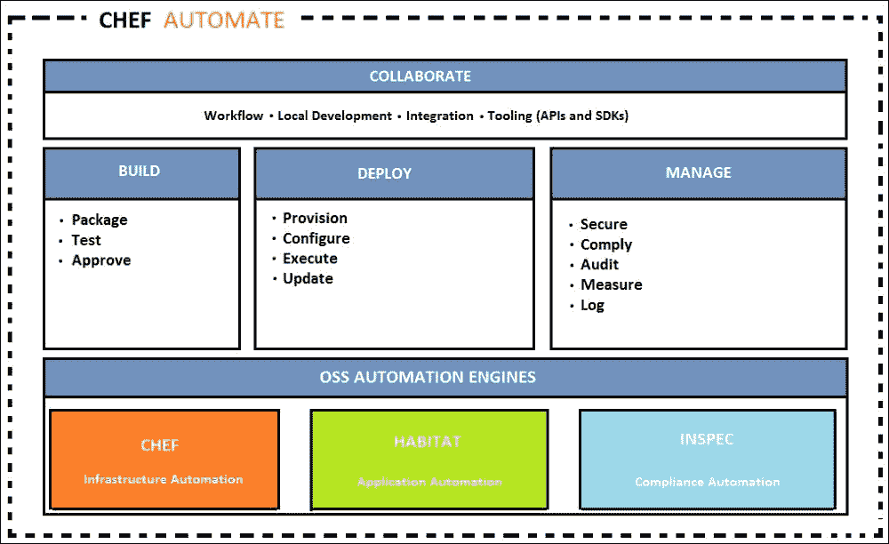

Chef 是基础设施自动化的核心引擎。Habitat 是一个应用程序自动化工具，模拟容器和微服务的概念。InSpec 通过指定可执行代码来确保合规性和安全性要求。

### Habitat

Habitat 提供了一种规定的应用程序自动化打包格式；Habitat 管理器和应用程序依赖项作为一个整体打包和部署。Habitat 包格式定义了如何构建，这些包是隔离的、不可变的，可在任何类型的运行时环境（如容器、裸金属或 PaaS）中执行。Habitat 管理器管理包的对等关系、升级策略和安全政策，这些都是可审计的。

### InSpec

InSpec 是一个开源工具，用于测试是否符合安全政策。它是一个框架，用于指定合规性、安全性和政策要求，以自动测试基础设施中的任何节点。合规性可以以代码的形式表达，并集成到部署管道中。

+   InSpec 使用 Compliance DSL 可以快速简便地编写审计规则。

+   InSpec 检查基础设施节点以在本地或远程运行测试。

+   安全性、合规性或政策问题的违规行为将被记录。

InSpec 审计资源框架与 Chef Compliance 完全兼容。

它可在多个平台上运行，使用 SSH 等远程命令或 Docker API，除了通过 API 确保合规性外，还可以访问数据库、进行检查，并可以限制服务或协议的使用以及虚拟机的配置。例如，可以限制客户端或服务器机器上的 Telnetd 或 FTP 服务。

持续部署全栈管道是 Chef Automate。它包括自动化测试以确保合规性和安全性。该工作流为应用程序和基础设施提供了可视性，以及从开发到生产的变更传播。

Chef 高级架构组件包括 Chef DK、Chef Server 和客户端：

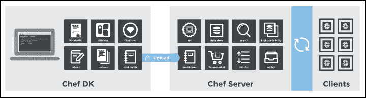

Chef 服务器扮演多个角色，作为配置数据的中心。它存储 cookbook，将政策应用到系统，并根据基础设施以及为每个系统定义的元数据进行配置。

Cookbook 开发工作流由 Chef Development Kit 如下所示：

+   骨架 cookbook 创建：这是一个已经包含 Chef Development Kit 标准文件的 cookbook，Berkshelf 是一个包管理器，帮助管理 cookbook 和相关的依赖项。

+   使用 Test Kitchen 创建虚拟机环境：该环境用于开发 cookbook，并提供执行自动化测试和调试该 cookbook 的位置细节。

+   准备并调试 cookbook 的食谱：这是一个迭代过程，用于开发和测试 cookbook，修复 bug，并测试直到它们达成目的。Cookbook 可以使用任何文本编辑器编写，如 Sublime Text、vim、TextMate、EditPad 等。

+   进行验收测试：这些测试在完整的 Chef 服务器上执行，使用接近生产环境的环境，而不是开发环境。

+   通过所有接受测试的 cookbooks 将按照预期方式部署到生产环境中。

## Chef Automate 工作流

Chef Automate 流水线是用于基础设施和应用程序的全栈持续交付。它支持安全部署任何应用程序，支持高速变更，并关联基础设施变更。

Chef Automate 流水线质量门控已自动化，能够将开发者的工作站中的变更从部署推送到生产环境。提出的变更经过团队批准后，接受测试也通过并被发布到相应的制品中，交付到生产环境。

此图显示了从开发、测试到 Chef 代码部署的工作流：

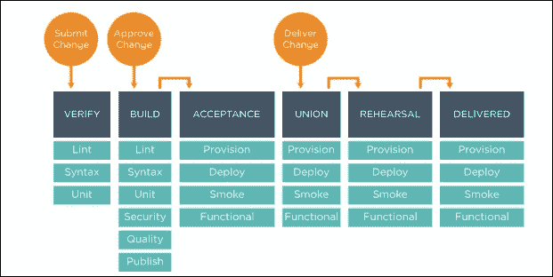

该制品在接受阶段后通过流水线，进入质量保证的联合阶段、排练（预生产）阶段和交付（生产）阶段。

Chef Automate 图形用户界面提供了对操作和工作流事件的视图。其数据仓库收集来自 Chef、Habitat、Automate 工作流和合规性的输入。仪表板跟踪每个变更的状态，通过管道，并提供查询语言来自定义仪表板。

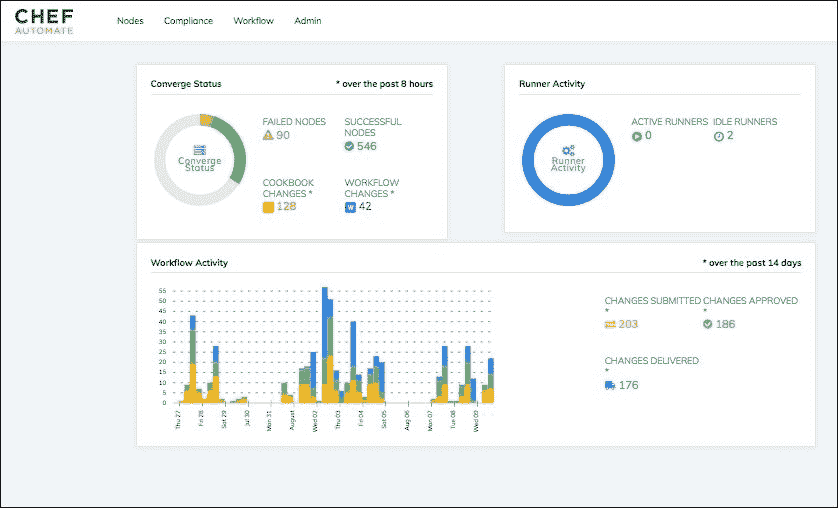

## 合规性

通过在 InSpec 中创建自定义报告，结合合规规则，可以识别合规性问题、安全风险和过时的软件。内置的配置文件提供了针对安全框架的预定义规则集，如**互联网安全中心**（**CIS**）基准等。合规报告可以是独立的，也可以是集成的。此外，Chef Automate 服务器还提供了高可用性、容错性、实时基础设施数据和一致的搜索结果。

Chef 合规性服务器便于基础设施合规性的集中管理，执行以下任务：

+   创建和管理规则配置文件

+   按照组织的安全管理生命周期定期测试节点

+   扫描完全通过远程执行；节点上不安装任何脚印

+   合规报告确保基础设施符合安全要求

+   节点合规性的审计统计信息可用！合规性

Chef 合规报告详细列出了多个参数，例如节点级的补丁和合规性，详见以下内容：

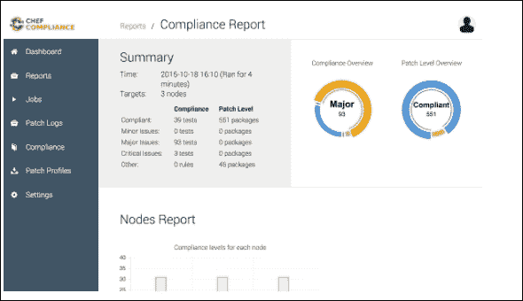

从 Automate 查看 Chef 合规报告。

Chef Automate 提供了分析合规报告的能力，可以根据节点、节点平台、环境或配置文件来分析数据，并能够深入挖掘信息。

Chef Automate 合规控制状态报告提供了一个综合仪表板，展示了主要、次要、关键、补丁级别等信息。

# Ansible

Ansible 是一个流行且强大的自动化框架，支持持续交付，具有以下主题中列出的功能和优点：

## 突出特性

Ansible 提供以下功能：

+   现代化

    +   自动化现有的部署流程

    +   管理遗留系统和流程，像 DevOps 一样进行更新

+   迁移

    +   一次定义应用程序，随时重新部署

+   DevOps

    +   一切建模，持续部署

## Ansible 的好处

使用 Ansible 带来如下多个优势：

+   简单易用

    +   无需特殊编码技能

    +   任务按顺序执行

    +   快速提高生产力

    +   自动化易于理解

+   功能强大

    +   应用部署

    +   配置管理

    +   工作流编排

    +   应用生命周期的编排

+   无代理

    +   无代理架构

    +   使用 OpenSSH 和 WinRM

    +   无需代理来利用或更新

    +   更高效且安全

Ansible 是一个多维的 IT 自动化引擎，简化了云资源供应、服务间编排、配置管理、应用部署以及许多其他 IT 功能的自动化。

Ansible 通过规定系统间的相互关系，模拟 IT 基础架构，适用于多层部署，而不是单独管理各个系统。

如功能部分所述，Ansible 不需要客户端代理或额外的自定义安全基础设施。它通过用一种名为 YAML 的简单英语语言描述自动化任务，并以 Ansible playbooks 的形式，使部署变得非常简单。

Ansible 架构如下所示：

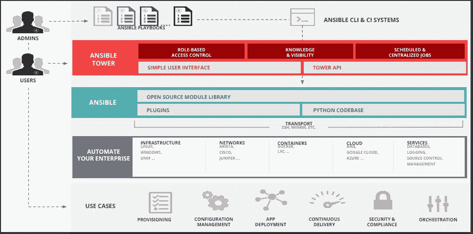

## Ansible 术语、关键概念、工作流和使用

Ansible Tower 是一个基于 Web 的企业自动化框架解决方案，旨在成为控制、保护和管理 Ansible 环境的中心，提供用户界面和 RESTful API。它提供以下丰富的功能：

+   访问控制基于角色，以确保环境安全，并且高效管理——允许共享 SSH 凭证但不进行传输

+   通过一键部署访问，即使是非特权用户，也可以通过实时提供访问权限来安全地部署整个应用程序

+   确保完整的审计和合规性，因为所有 Ansible 自动化操作都被集中记录

+   支持来自多种云源的广泛库存，可以进行图形化管理或同步

+   它基于强大的 REST API，能够与 LDAP 良好集成，并记录所有任务

+   与持续集成工具 Jenkins 的易集成，提供命令行工具选项

+   支持通过配置回调实现自动扩展拓扑

+   Ansible Tower 通过 Ansible playbooks 进行安装！Ansible 术语、关键概念、工作流和使用

### CMDB

Ansible **配置管理数据库**（**CMDB**）在数据库中维护企业的所有配置信息，并支持多种格式的云创建选项，以适配不同的供应商。

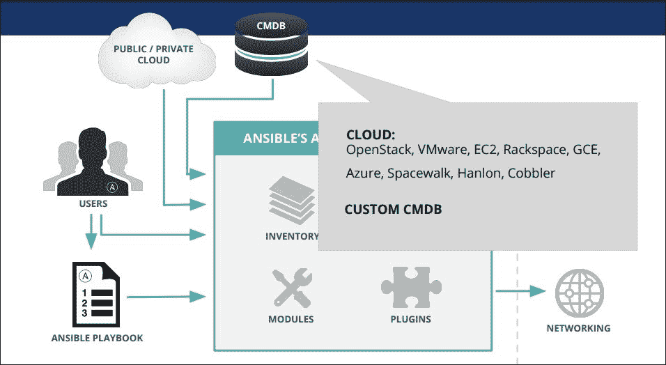

### Playbooks

Playbook 是用 YAML 编写的配置程序，用于自动化系统。Ansible 能够精细地编排多个基础设施拓扑实例，并对许多机器进行详细的控制。Ansible 的编排方法是通过简单的 YAML 语法或功能来管理精细调校的自动化代码。

Ansible playbook 描述了一个政策，用于在远程系统上执行编排操作，以进行配置和部署，从而强制执行一般的 IT 流程遵循步骤。

一个简单的类比是，主机清单是原材料，说明书是 playbook，Ansible 模块是工作坊中的工具。

要管理远程机器部署的配置，可以在基础层级使用 playbook。它们可以按顺序执行多层次的发布，包括涉及滚动更新的高级操作，途中与监控服务器和负载均衡器交互，并将操作委托给其他主机。

Playbook 是以基本的文本语言开发的，方便人类阅读。Playbook 和文件的组织可以有多种方式。

一个简单的 playbook 示例：

```
- hosts: webservers 
serial: 6 # update 6 machines at a time 
roles: 
- common 
- webapp 
- hosts: content_servers 
roles: 
- common 
- content 
```

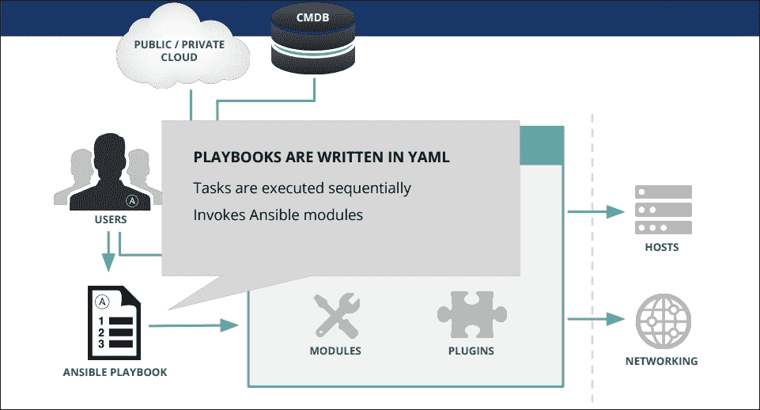

### 模块

Ansible 模块可以控制系统资源，如服务、软件包或文件，以处理和执行系统命令。这些资源模块由 Ansible 推送到节点上，配置它们以达到所需的系统状态。这些 Ansible 模块通过 SSH（安全外壳）在目标节点上执行，并在完成任务后被移除。模块库默认随多种模块一起提供，可通过 playbook 或直接在远程主机上执行。这些模块可以驻留在任何机器上，不需要维护服务器、守护进程或数据库。模块和库是可定制的，通常通过任何终端程序和文本编辑器创建，为了跟踪内容的变化，版本控制系统被有效使用。

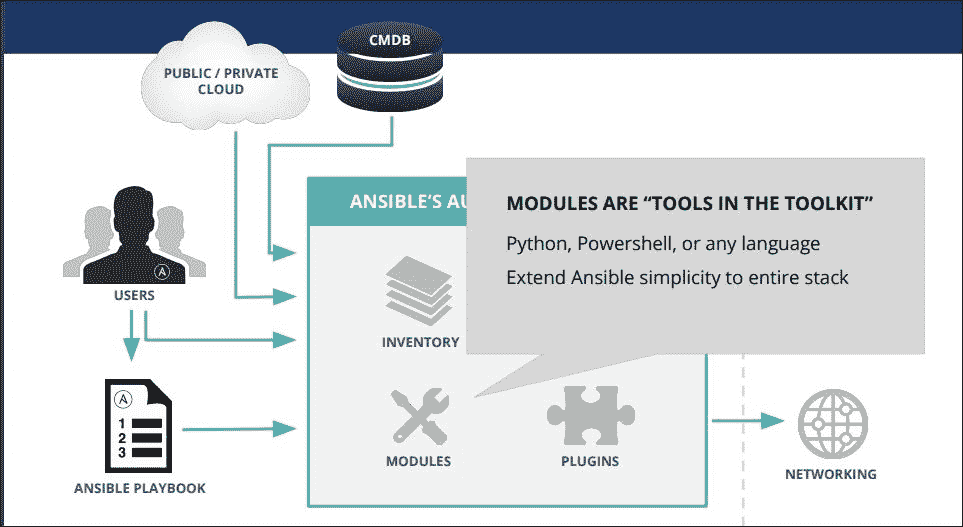

### 清单

Ansible 清单是资源的列表：

+   主机和组

+   主机变量

+   组变量

+   组和组变量的组合

+   默认组

+   拆分组、主机及特定数据

+   清单行为参数列表

+   非 SSH 连接类型

通过清单列表，Ansible 可同时在基础设施中的多个系统上工作。动态清单机制允许通过清单插件，使多个清单文件既灵活又可定制。清单列表可以放在默认位置，或从动态或云源（如 EC2、Rackspace、OpenStack 或不同格式）指定清单文件位置。

以下是一个纯文本清单文件的样子：

```
 [webservers] 
www1.example.com 
www2.example.com 
[dbservers] 
db0.example.com 
db1.example.com 
```

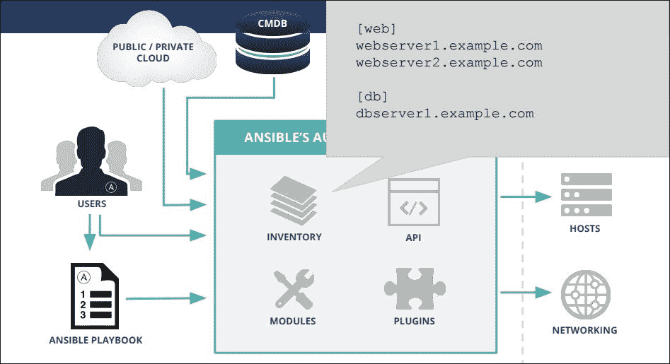

### 插件

Ansible 的核心功能通过许多便捷的插件得到增强，并且可以用 JSON（Ruby、Python、Bash 等）进行自定义。插件可以连接到任何数据源，扩展 SSH 以外的传输连接类型，回调日志，甚至添加新的服务器端行为。

### Ansible Tower

提供多个功能，如：

+   可以连接 LDAP、AD、SAML 及其他目录

+   基于角色的访问控制引擎

+   无暴露存储的凭证

+   对首次使用者简单易用

+   启用智能搜索的信息查找

+   在运行时配置自动化

+   基于 REST API 的流程和工具集成

+   Tower 集群扩展容量

Ansible Tower 可以调用多剧本工作流来连接多个剧本，使用不同的清单，以不同用户身份运行，批量执行，或使用不同的凭证。

Ansible Tower 工作流有助于完成许多复杂操作，构建工作流以配置机器，应用系统的基础配置，并通过不同的团队维护不同的剧本来部署应用程序。可以为 CI/CD 构建一个工作流来构建应用程序，部署到测试环境，运行测试，并根据测试结果自动推广应用程序。Ansible Tower 的直观工作流编辑器可以轻松建模复杂的过程，设置不同的剧本作为备选方案，以应对先前工作流剧本的成功或失败。

一个典型的工作流可能如下所示，它可以在多个系统上快速有效地使用，而不需要将基础设施下线。为了实现持续部署，自动化 QA 是至关重要的，它是达到这一水平的关键。

+   自动化脚本用于部署本地开发虚拟机。

+   CI 系统（如 Jenkins）在每次代码更改后将部署到暂存环境

+   部署作业在每次部署时执行测试脚本，检查通过/失败状态

+   在部署作业成功后，相同的剧本会在生产环境清单上运行。

Ansible Tower 工作流带来以下功能和特性：

+   作业调度

+   内建通知功能，用于通知团队

+   稳定的 API 连接现有的工具和流程

+   新的工作流用于建模整个过程！Ansible Tower

Ansible Tower 仪表盘（参见图片）提供以下功能：

+   仪表盘和实时自动化更新

+   图形化清单管理

+   集成的 RBAC 和凭证管理

### Ansible Vault

Ansible Vault 是一个用于将敏感数据以加密形式存储的功能，例如密码或密钥，而不是将它们以明文形式保存在角色或剧本中。这些 Vault 文件可以放入源代码控制或分发到多个位置。数据文件，如 Ansible 任务、处理程序、任意文件，甚至二进制文件，也可以通过 Vault 加密。这些文件会在目标主机上解密。

### Ansible Galaxy

Ansible Galaxy 是一个开源网站，旨在为社区信息提供平台，并促进在构建 IT 自动化解决方案中的协作，旨在将管理员和开发人员汇集在一起。该网站提供了预配置的角色，可以通过 Galaxy 搜索索引下载并快速启动自动化项目。这些也可以通过 GitHub 账户访问。

## 使用 Ansible 的测试策略

尽管测试是一个非常组织化且特定于站点的概念，Ansible 集成测试通过 Ansible playbook 设计为一个有序且快速失败的系统。它通过基于推送的机制，直接在 Ansible playbook 中嵌入测试。

Ansible playbook 是系统理想状态的模型，确保声明的内容，如要启动的服务和要安装的包，符合声明性语句。Ansible 是一个基于顺序的系统，对于未处理的错误，主机会立即失败并阻止该主机的进一步配置，并在 Ansible 运行结束时显示总结。Ansible 是一个多层次的编排系统，将测试整合到 playbook 运行中，无论是作为任务还是角色。

在部署工作流中集成基础设施测试的应用测试，将有效地检查代码质量和性能，在进入生产系统之前。由于是基于推送的机制，工作流中的检查和均衡，甚至升级，都非常容易在本地或测试服务器上维护。

# 监控

企业监控是主要活动，它分类了监控开发的里程碑、应用日志、服务器健康状况、操作、基础设施、漏洞、部署和用户活动。这些通过以下方式实现：

+   收集和关键信息

+   成熟的监控工具

+   避免基于不确定性做出感知和决策

+   参与式监控与评估

+   选择和使用正确的指标

+   在业务上下文中解释指标结果

+   实时数据收集

+   管理数据和信息

开发里程碑：监控开发里程碑是衡量你的 DevOps 采纳策略有效性的指标，通过深入了解实际过程和团队的表现。一些度量指标包括冲刺范围的变化、现场和修复的错误数量以及承诺与交付功能的比例。这些度量指标是团队效率和遵守计划的推动因素，这项监控作为敏捷插件集成在问题跟踪中。

代码漏洞：监控应用代码中的漏洞，列出了由于不安全的编码实践而在顶层代码中引入的弱点。这些可以通过定期进行代码审查或更改第三方依赖项等方式来解决。

部署：部署监控是配置构建服务器，使其在过程中内置一些监控，及时通知团队。支持通知的持续集成服务器与聊天服务器通信，及时提醒团队构建和部署失败。

应用日志输出：如果服务是分布式的，应用日志输出应规划为集中式日志记录，以充分受益，错误和异常提供实时价值。从错误产生代码中追踪通知的能力以可搜索格式生成收益，提前了解生产前的情况。

服务器健康：监控可用资源的正常运行时间和性能，停机或过度使用的服务器属于此类别。入侵检测和健康监控系统与同一通知管道上的结合将提供额外的价值。

活动监控：用户活动监控既是功能开发，也是基础设施的扩展。随着监控开发的里程碑，数据量也在被监控。

集中存储应用日志、用户活动监控和项目历史的合并日志数据，增强了在全球范围内关联不同日志源，分析应用程序和项目状态的价值。

# Splunk

Splunk 是一种流行的应用监控工具，可以实时查看由 DevOps 驱动的应用交付，支持持续交付或持续集成，从概念到生产的快速迁移。Splunk 企业版通过提高速度和质量，帮助改善应用交付对业务的影响。

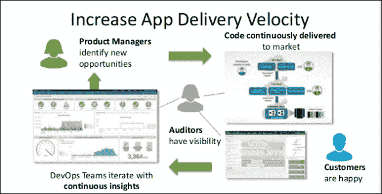

Splunk 通过以下好处提高代码质量：

+   在客户看到问题之前解决代码问题

+   更快地检测并修复与生产相关的问题

+   提供客观的指标，以确保代码是可操作的并满足质量 SLA。

Splunk 是一个平台，用于捕捉和记录客户、机器数据、用户、交易、应用程序、服务器、网络和移动设备的所有活动和行为。

Splunk 平台通过集成的实时洞察，从应用开发到测试再到生产监控，提升了其对业务的影响。它提供了跨所有交付生命周期阶段的一体化视图，而不是离散的发布组件。

为业务和 DevOps 领导者提供关于开发和运营的业务相关数据的实时可视化，如应用性能、使用情况、收入系统、购物车履行和注册数据，提供洞察以更好地规划库存、报告并改善客户体验。

支持开发生命周期的集成和跨多阶段、多个应用程序的可视化：

操作生命周期集成和跨多个阶段和应用程序的可视化得到支持。使用分析，应用程序交付速度更快：

+   跨每个 DevOps 交付工具链组件的端到端可视化

+   在应用交付生命周期中，更快迭代的相关洞察

+   测量和基准化版本贡献，提升 DevOps 团队效率

Splunk 通过帮助组织建立反馈循环，评估代码变更对客户的实际影响，从而支持企业领导。持续的互动有助于构建有关机器行为和深度资产模型的更多智能。

这些好处反映了应用交付的业务影响：

+   通过将业务指标与代码变更相关联，获得新的业务洞察

+   通过交付性能更好的代码，增强用户体验

+   提供更安全、合规的代码有助于提升声誉

# Nagios 基础设施监控工具

Nagios 开源工具有多种变体，适用于各个操作系统上的每个分段，专门用于监控关键任务基础设施组件：

+   网络监控软件

+   网络流量监控

+   服务器（Linux、Windows）监控

+   应用程序监控工具

+   Web 应用程序监控

+   核心引擎和基础 web 界面监控

+   Nagios 核心插件包与附加组件

+   Nagios 日志服务器安全威胁与审计系统

Nagios 促进了对网络问题的监控，如数据链路过载、网络连接问题、监控路由器、交换机、服务器过载或崩溃等引发的问题。

Nagios 可以通过多种可视化表现形式和报告提供指标结果，监控网络中每个节点的可用性、正常运行时间和响应时间，支持基于代理和无代理的监控。

使用 Nagios 进行有效的应用监控可以帮助组织快速发现应用程序、服务或进程问题，并采取纠正措施，以防止应用程序用户出现停机。

Nagios 工具用于监控应用程序及其状态，涵盖 Windows 应用程序、Linux 应用程序、Unix 应用程序和 Web 应用程序。它拥有一个活跃的社区合作网络。

路由器监控功能提供的好处包括：对无响应机器的即时通知、通过检测网络中断和协议失败进行预警、提高服务器、服务和应用程序的可用性。

使用 Nagios 进行 Windows 监控可提高服务器、服务和应用程序的可用性，快速检测网络中断、服务失败、进程问题、批处理作业和协议失败等。系统指标、事件日志、应用程序（IIS、Exchange 等）、服务（Active Directory、DHCP、服务状态、进程状态、性能计数器等）收集了大量数据。

## Nagios – 企业级服务器和网络监控软件

内置的高级功能包括：

+   提供综合仪表盘，整合源、检查、网络流量数据等的概览

+   安全性和可靠性网络分析器的可疑网络活动警报

+   提供关于网络流量、带宽、整体网络健康等的深入洞察和钻取选项，并附有高级可视化功能

+   监控特定应用程序的网络使用情况，提供自定义应用程序监控、自定义查询、视图和报告

+   通过专业视图显示的历史网络流量数据和子集网络流量信息

+   异常活动警报，具有自动警报系统，例如带宽使用超过指定阈值

+   集成的网络分析服务器负载与硬盘空间可用性度量

# 用于网络分析、监控和带宽的集成仪表板

Nagios 仪表板具有多种监控选项，例如源组、服务器 CPU、磁盘使用情况等，可以根据业务需求扩展和自定义更多选择。

# 摘要

本课我们学习了使用 Chef、Puppet 和 Ansible 等工具进行基础设施配置管理，以实现持续部署，并且学习了使用 Splunk 和 Nagios 进行持续监控的过程。

到此为止，我们已经完成了本书的内容。我希望你在旅程中顺利，收获了许多关于 DevOps 的知识。

祝愿你未来的项目一切顺利。继续学习和探索！

# 评估

1.  以下哪个是持续交付对齐的顺序？

    1.  构建、代码、集成、发布

    1.  代码、构建、集成、发布

    1.  构建、代码、发布、集成

    1.  代码、构建、发布、集成

1.  以下哪些是持续部署的工具？

    1.  Git

    1.  Nagios

    1.  JUnit

    1.  Jenkins

1.  资源是一个配置策略声明，它：

    1.  包括配置系统所需的一切

    1.  通过给节点打标签，便于创建任意分组

    1.  描述已配置项的期望状态

    1.  按照运行列表中列出的顺序执行

1.  以下哪项包含用于应用自动化的规定打包格式？

    1.  Habitat

    1.  InSpec

    1.  Chef

    1.  Ansible

1.  ________ 是用 YAML 编写的配置程序，用于自动化系统。

    1.  CMDB

    1.  模块

    1.  Playbooks

    1.  库存
