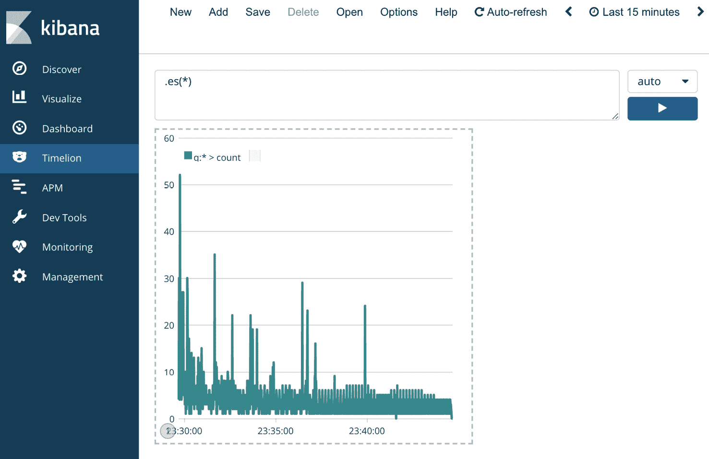

# 第九章：Kubernetes 上的可观察性

本章深入探讨了在生产环境中运行 Kubernetes 时，强烈推荐实施的功能。首先，我们讨论在 Kubernetes 等分布式系统中的可观察性。然后，我们查看 Kubernetes 内置的可观察性堆栈及其实现的功能。最后，我们学习如何通过额外的可观察性、监控、日志记录和度量基础设施来补充内置的可观察性工具。您将在本章中学到的技能将帮助您将可观察性工具部署到 Kubernetes 集群中，并使您能够了解您的集群（以及在其上运行的应用程序）如何运作。

本章将涵盖以下主题：

+   理解 Kubernetes 上的可观察性

+   使用默认的可观察性工具 – 度量、日志记录和仪表盘

+   实现生态系统中的最佳实践

首先，我们将了解 Kubernetes 提供的开箱即用的可观察性工具和流程。

# 技术要求

为了运行本章中详细介绍的命令，您需要一台支持 `kubectl` 命令行工具的计算机，并且需要一个正常工作的 Kubernetes 集群。请参阅 *第一章*，*与 Kubernetes 通信*，了解如何快速启动 Kubernetes，以及如何安装 kubectl 工具的说明。

本章中使用的代码可以在本书的 GitHub 仓库中找到：

[`github.com/PacktPublishing/Cloud-Native-with-Kubernetes/tree/master/Chapter9`](https://github.com/PacktPublishing/Cloud-Native-with-Kubernetes/tree/master/Chapter9)

# 理解 Kubernetes 上的可观察性

没有监控机制的生产系统是无法完整运行的。在软件中，我们将可观察性定义为在任何时刻，了解我们的系统如何运行（并且在最佳情况下，了解原因）。可观察性在安全性、性能和操作能力方面提供了显著的优势。通过了解系统在虚拟机、容器和应用层的响应情况，您可以对其进行调优，以提高性能、快速响应事件，并更容易排除故障。

例如，假设您的应用程序运行得非常慢。为了找出瓶颈，您可能需要查看应用程序代码、Pod 的资源规格、部署中的 Pod 数量、Pod 层或节点层的内存和 CPU 使用情况，以及像运行在集群外的 MySQL 数据库等外部因素。

通过添加可观察性工具，您将能够诊断许多变量，并找出可能导致应用程序性能下降的问题。

Kubernetes 作为一个生产就绪的容器编排系统，提供了一些默认工具来监控我们的应用程序。为了本章的目的，我们将可观察性分为四个概念：指标、日志、追踪和警报。让我们逐一了解这些概念：

+   **指标**在这里代表着能够看到系统当前状态的数字化表现，特别关注 CPU、内存、网络、磁盘空间等方面。这些数字帮助我们判断当前状态与系统最大容量之间的差距，并确保系统能够保持对用户可用。

+   **日志**是指从应用程序和系统中收集文本日志的做法。日志可能是 Kubernetes 控制平面日志和应用程序 Pod 日志的结合。日志有助于我们诊断 Kubernetes 系统的可用性，也有助于处理应用程序错误。

+   **追踪**是指收集分布式追踪。追踪是一种可观察性模式，能够提供请求链的端到端可视化——这些请求可以是 HTTP 请求，也可以是其他类型的请求。这个话题在使用微服务的分布式云原生环境中特别重要。如果你有很多微服务，并且它们互相调用，当多个服务参与到单一的端到端请求时，找出瓶颈或问题可能会变得困难。追踪使你能够查看每个服务间调用的每一个环节的请求。

+   **警报**是指在某些事件发生时设置自动触发点的做法。警报可以设置在*指标*和*日志*上，并通过多种媒介传递，从短信到电子邮件，再到第三方应用程序，涵盖了各种方式。

在这四个可观察性方面之间，我们应该能够理解集群的健康状况。然而，针对指标、日志甚至警报，配置了许多不同的数据点。因此，知道应该关注哪些内容非常重要。下一节将讨论 Kubernetes 集群和应用程序健康的最重要的可观察性领域。

## 理解 Kubernetes 集群和应用程序健康状态的重要因素

在 Kubernetes 或第三方可观察性解决方案为 Kubernetes 提供的众多指标和日志中，我们可以缩小范围，找出最可能对集群造成重大问题的一些指标。你应该将这些要点放在最终使用的任何可观察性解决方案的核心位置。首先，让我们来看一下 CPU 使用率与集群健康之间的关系。

### 节点 CPU 使用率

Kubernetes 集群中各节点的 CPU 使用情况是一个非常重要的指标，应该在你的可观察性解决方案中时刻关注。我们在前面的章节中讨论了 Pods 如何定义 CPU 使用的资源请求和限制。然而，当限制设置高于集群的最大 CPU 容量时，节点仍然有可能会过度分配 CPU 使用情况。此外，运行我们控制平面的主节点也可能遇到 CPU 容量问题。

CPU 满载的工作节点可能会表现不佳，或限制在 Pods 上运行的工作负载。如果没有为 Pods 设置限制，或者一个节点的总 Pod 资源限制超过了其最大容量，即使其总资源请求较低，也很容易发生这种情况。CPU 满载的主节点可能会影响调度器、kube-apiserver 或任何其他控制平面组件的性能。

一般来说，工作节点和主节点的 CPU 使用情况应该在你的可观察性解决方案中可见。最好通过结合使用指标（例如在图表解决方案如 Grafana 上，你将在本章稍后学习到）以及集群中各节点的高 CPU 使用率警报来实现。

内存使用情况也是一个极其重要的指标，类似于 CPU。

### 节点内存使用情况

与 CPU 使用情况类似，内存使用情况是观察集群内情况时非常重要的一个指标。内存使用情况可以通过 Pod 资源限制被过度分配——并且许多与 CPU 使用情况相同的问题可能适用于集群中的主节点和工作节点。

同样，警报和指标的结合对于集群内存使用情况的可见性至关重要。我们将在本章稍后学习一些工具来实现这一点。

对于下一个主要的可观察性内容，我们将关注日志，而不是指标。

### 控制平面日志

### Kubernetes 控制平面组件在运行时会输出日志，这些日志可以用于深入了解集群操作。这些日志也能显著帮助故障排除，正如我们在*第十章*《故障排除 Kubernetes》中所看到的那样。Kubernetes API 服务器、控制器管理器、调度器、kube proxy 和 kubelet 的日志，对于某些故障排除或可观察性原因来说，都非常有用。

### 应用程序日志

应用程序日志也可以被集成到 Kubernetes 的可观察性栈中——能够查看应用程序日志和其他指标一起，能够帮助运维人员非常有效。

### 应用程序性能指标

与应用程序日志一样，应用程序性能指标和监控与 Kubernetes 上应用程序的性能高度相关。在应用程序层面上的内存使用情况和 CPU 分析可以成为可观察性栈中的一个有价值的组成部分。

一般而言，Kubernetes 提供了应用监控和日志记录的数据基础设施，但避免提供如图表和搜索等更高级的功能。考虑到这一点，让我们回顾一下 Kubernetes 默认提供给我们的工具，以解决这些问题。

# 使用默认的可观察性工具

Kubernetes 提供了可观察性工具，即使没有添加任何第三方解决方案。这些原生的 Kubernetes 工具是许多更强大解决方案的基础，因此它们非常值得讨论。由于可观察性包括度量、日志、跟踪和警报，我们将依次讨论每个方面，首先聚焦于 Kubernetes 原生解决方案。首先，让我们讨论度量。

## Kubernetes 的度量

通过简单运行`kubectl describe pod`，你可以获取大量关于应用的信息。我们可以看到关于 Pod 的规格、其所处的状态，以及影响其功能的关键问题。

假设我们的应用程序遇到了一些问题。具体来说，Pod 没有启动。为了进行调查，我们运行了 `kubectl describe pod`。提醒一下，*第一章*中提到的 kubectl 别名，`kubectl describe pod` 和 `kubectl describe pods` 是等效的。以下是 `describe pod` 命令的示例输出——我们已去掉除 `Events`（事件）信息之外的所有内容：


图 9.1 – 描述 Pod 事件输出

如你所见，Pod 无法调度是因为我们的节点内存已满！这应该是进一步调查的一个重要问题。

我们继续前进。通过运行 `kubectl describe nodes`，我们可以了解很多关于 Kubernetes 节点的信息。部分信息对于我们的系统性能非常相关。这里是另一个示例输出，这次来自 `kubectl describe nodes` 命令。为了避免输出过长，我们将聚焦于两个重要部分——`Conditions`（条件）和 `Allocated resources`（分配的资源）。首先，让我们回顾一下 `Conditions`（条件）部分：


图 9.2 – 描述节点条件输出

如你所见，我们已经包含了 `kubectl describe nodes` 命令输出中的 `Conditions`（条件）块。这是查看任何问题的好地方。正如我们在这里看到的，我们的节点确实存在问题。我们的 `MemoryPressure`（内存压力）条件为真，且 `Kubelet` 内存不足。难怪我们的 Pods 无法调度！

接下来，查看 `Allocated resources`（分配的资源）部分：

```
Allocated resources:
 (Total limits may be over 100 percent, i.e., overcommitted.)
 CPU Requests	CPU Limits    Memory Requests  Memory Limits
 ------------	----------    ---------------  -------------
 8520m (40%)	4500m (24%)   16328Mi (104%)   16328Mi (104%)
```

现在我们看到了些指标！看起来我们的 Pods 请求了过多的内存，导致了节点和 Pod 的问题。从这个输出中可以看出，Kubernetes 已经在默认情况下收集了有关节点的指标数据。如果没有这些数据，调度器就无法正常工作，因为维护 Pod 资源请求与节点容量之间的平衡是它最重要的功能之一。

然而，默认情况下，这些指标并不会显示给用户。它们实际上是由每个节点的 `Kubelet` 收集并传递给调度器，以便调度器可以执行其工作。幸运的是，我们可以通过将 Metrics Server 部署到集群中，轻松获取这些指标。

Metrics Server 是一个官方支持的 Kubernetes 应用程序，用于收集指标信息并将其通过 API 端点提供给使用。实际上，Metrics Server 是 Horizontal Pod Autoscaler 正常工作的必要条件，但根据 Kubernetes 发行版的不同，它并不总是默认包含在内。

部署 Metrics Server 非常快速。截至本书写作时，可以使用以下命令安装最新版本：

```
kubectl apply -f https://github.com/kubernetes-sigs/metrics-server/releases/download/v0.3.7/components.yaml
```

重要提示

如何使用 Metrics Server 的完整文档可以在 [`github.com/kubernetes-sigs/metrics-server`](https://github.com/kubernetes-sigs/metrics-server) 找到。

一旦 Metrics Server 启动，我们就可以使用一个全新的 Kubernetes 命令。`kubectl top` 命令可以与 Pods 或 Nodes 一起使用，以查看内存和 CPU 使用量的详细信息。

让我们看一些示例用法。运行 `kubectl top nodes` 查看节点级别的指标。以下是该命令的输出：


图 9.3 – 节点指标输出

如你所见，我们可以看到 CPU 和内存使用情况的绝对值和相对值。

重要提示

CPU 核心的度量单位是 `millcpu` 或 `millicores`。1,000 `millicores` 等于一个虚拟 CPU。内存以字节为单位进行度量。

接下来，让我们来看一下 `kubectl top pods` 命令。使用 `–namespace kube-system` 标志运行它，可以查看 `kube-system` 命名空间中的 Pods。

为此，我们运行以下命令：

```
Kubectl top pods -n kube-system 
```

然后我们得到以下输出：

```
NAMESPACE     NAME                CPU(cores)   MEMORY(bytes)   
default       my-hungry-pod       8m           50Mi            
default       my-lightweight-pod  2m           10Mi       
```

如你所见，这个命令使用了与 `kubectl top nodes` 相同的绝对单位——毫核心和字节。在查看 Pod 层级的指标时，没有相对百分比。

接下来，我们将看看 Kubernetes 如何处理日志。

## Kubernetes 上的日志

我们可以将 Kubernetes 的日志分为两个领域——*应用程序日志* 和 *控制平面日志*。首先让我们看一下控制平面日志。

### 控制平面日志

控制平面日志指的是由 Kubernetes 控制平面组件（如调度器、API 服务器等）创建的日志。对于标准 Kubernetes 安装，控制平面日志可以在节点上找到，并且需要直接访问节点才能查看。对于配置为使用 `systemd` 的集群，可以使用 `journalctl` CLI 工具来查看日志（有关更多信息，请参阅以下链接：[`manpages.debian.org/stretch/systemd/journalctl.1.en.html`](https://manpages.debian.org/stretch/systemd/journalctl.1.en.html)）。

在主节点上，你可以在文件系统的以下位置找到日志：

+   在 `/var/log/kube-scheduler.log`，你可以找到 Kubernetes 调度器的日志。

+   在 `/var/log/kube-controller-manager.log`，你可以找到控制器管理器的日志（例如，查看扩缩容事件）。

+   在 `/var/log/kube-apiserver.log`，你可以找到 Kubernetes API 服务器的日志。

在工作节点上，日志可以在文件系统的两个位置找到：

+   在 `/var/log/kubelet.log`，你可以找到 kubelet 的日志。

+   在 `/var/log/kube-proxy.log`，你可以找到 kube proxy 的日志。

尽管一般来说，集群的健康状况受到 Kubernetes 主节点和工作节点组件健康状况的影响，但当然也需要关注你的应用日志。

### 应用日志

在 Kubernetes 上查找应用日志非常简单。在我们解释如何运作之前，先来看一个例子。

要查看特定 Pod 的日志，你可以使用 `kubectl logs <pod_name>` 命令。该命令的输出会显示写入容器 `stdout` 或 `stderr` 的任何文本。如果一个 Pod 有多个容器，你必须在命令中包含容器的名称：

```
kubectl logs <pod_name> <container_name> 
```

从底层来看，Kubernetes 通过使用容器引擎的日志驱动程序来处理 Pod 日志。通常，任何写入 `stdout` 或 `stderr` 的日志都会被保存到每个节点的磁盘中的 `/var/logs` 文件夹。根据 Kubernetes 发行版的不同，日志轮转可能已设置，以防止日志占用节点磁盘空间过多。此外，Kubernetes 组件（如调度器、kubelet 和 kube-apiserver）也会将日志保存到节点磁盘空间，通常是在 `/var/logs` 文件夹中。需要注意的是，这种默认的日志记录能力非常有限——一个强大的可观察性栈肯定会包括第三方的日志转发解决方案，正如我们接下来将看到的那样。

接下来，为了进行 Kubernetes 的整体可观察性，我们可以使用 Kubernetes Dashboard。

## 安装 Kubernetes Dashboard

Kubernetes Dashboard 提供了 kubectl 的所有功能——包括查看日志和编辑资源——通过图形用户界面（GUI）实现。设置仪表板非常简单——我们来看看如何操作。

仪表板可以通过一个 `kubectl apply` 命令来安装。若要进行自定义，请访问 Kubernetes Dashboard 的 GitHub 页面：[`github.com/kubernetes/dashboard`](https://github.com/kubernetes/dashboard)。

要安装 Kubernetes 仪表盘的版本，请运行以下`kubectl`命令，将`<VERSION>`标签替换为你想要的版本，基于你使用的 Kubernetes 版本（再次检查仪表盘的 GitHub 页面以确保版本兼容性）：

```
kubectl apply -f https://raw.githubusercontent.com/kubernetes/dashboard/<VERSION> /aio/deploy/recommended.yaml
```

就本书撰写时而言，我们将使用 v2.0.4 版本——最终命令如下所示：

```
kubectl apply -f https://raw.githubusercontent.com/kubernetes/dashboard/v2.0.4/aio/deploy/recommended.yaml
```

一旦安装了 Kubernetes 仪表盘，就有几种方法可以访问它。

重要提示

通常不建议使用 Ingress 或公共负载均衡器服务，因为 Kubernetes 仪表盘允许用户更新集群对象。如果由于某些原因你的仪表盘登录方法被泄露或容易猜到，可能会面临巨大的安全风险。

有了这个前提，我们可以使用`kubectl port-forward`或`kubectl proxy`来从本地计算机查看我们的仪表盘。

在这个例子中，我们将使用`kubectl proxy`命令，因为我们还没有在之前的例子中使用过它。

与`kubectl port-forward`命令不同，`kubectl proxy`命令只需要一个命令来代理到集群中运行的所有服务。它通过将 Kubernetes API 直接代理到本地计算机的端口（默认为`8081`）来实现这一点。有关`Kubectl proxy`命令的详细讨论，请参阅文档：[`kubernetes.io/docs/reference/generated/kubectl/kubectl-commands#proxy`](https://kubernetes.io/docs/reference/generated/kubectl/kubectl-commands#proxy)。

为了使用`kubectl proxy`访问特定的 Kubernetes 服务，你只需要拥有正确的路径。运行`kubectl proxy`后访问 Kubernetes 仪表盘的路径将如下所示：

```
http://localhost:8001/api/v1/namespaces/kubernetes-dashboard/services/https:kubernetes-dashboard:/proxy/
```

如你所见，我们在浏览器中输入的`kubectl proxy`路径是本地`8001`端口，并提到命名空间（`kubernetes-dashboard`）、服务名称和选择器（`https:kubernetes-dashboard`）以及代理路径。

让我们将 Kubernetes 仪表盘的 URL 输入浏览器并查看结果：


图 9.4 – Kubernetes 仪表盘登录

当我们部署并访问 Kubernetes 仪表盘时，首先会看到一个登录界面。我们可以创建一个服务账户（或使用我们自己的账户）来登录仪表盘，或者直接链接本地的`Kubeconfig`文件。通过使用特定服务账户的令牌登录 Kubernetes 仪表盘，仪表盘用户将继承该服务账户的权限。这使得我们能够指定用户在使用 Kubernetes 仪表盘时可以执行的操作类型——例如，只读权限。

现在我们创建一个全新的服务账户用于 Kubernetes 仪表盘。你可以自定义这个服务账户并限制它的权限，但现在我们将给予它管理员权限。为此，请按照以下步骤操作：

1.  我们可以使用以下 Kubectl 命令以命令式方式创建服务账户：

    ```
    kubectl create serviceaccount dashboard-user
    ```

    这将产生以下输出，确认我们已创建服务账户：

    ```
    serviceaccount/dashboard-user created
    ```

1.  现在，我们需要将服务帐户与 ClusterRole 关联。你也可以使用 Role，但我们希望仪表盘用户能够访问所有命名空间。为了将服务帐户与`cluster-admin`默认 ClusterRole 通过单个命令进行关联，我们可以运行以下命令：

    ```
    kubectl create clusterrolebinding dashboard-user \--clusterrole=cluster-admin --serviceaccount=default:dashboard-user
    ```

    此命令将生成以下输出：

    ```
    clusterrolebinding.rbac.authorization.k8s.io/dashboard-user created
    ```

1.  运行此命令后，我们应该能够登录仪表盘！首先，我们只需要找到用于登录的 token。服务帐户的 token 作为 Kubernetes 密钥存储，因此我们来看看它是什么样的。运行以下命令查看我们的 token 存储在哪个密钥中：

    ```
    kubectl get secrets
    ```

    在输出中，你应该能看到一个类似以下内容的密钥：

    ```
    NAME                         TYPE                                  DATA   AGE
    dashboard-user-token-dcn2g   kubernetes.io/service-account-token   3      112s
    ```

1.  现在，为了获取我们的 token 以登录仪表盘，我们只需要使用以下命令描述密钥内容：

    ```
    kubectl describe secret dashboard-user-token-dcn2g   
    ```

    结果输出将如下所示：

    ```
    Name:         dashboard-user-token-dcn2g
    Namespace:    default
    Labels:       <none>
    Annotations:  kubernetes.io/service-account.name: dashboard-user
                  kubernetes.io/service-account.uid: 9dd255sd-426c-43f4-88c7-66ss91h44215
    Type:  kubernetes.io/service-account-token
    Data
    ====
    ca.crt:     1025 bytes
    namespace:  7 bytes
    token: < LONG TOKEN HERE >
    ```

1.  要登录仪表盘，复制`token`旁边的字符串，将其粘贴到 Kubernetes 仪表盘登录页面的 token 输入框中，然后点击**登录**。你应该会看到 Kubernetes 仪表盘的概览页面！

1.  继续点击仪表盘，你应该能够看到所有与使用 kubectl 相同的资源，并且可以在左侧边栏按命名空间进行筛选。例如，这里是**命名空间**页面的视图：

    图 9.5 – Kubernetes 仪表盘详情

1.  你还可以点击单独的资源，甚至使用仪表盘编辑这些资源，只要你用于登录的服务帐户具有适当的权限。

    这是从部署详情页面编辑部署资源的视图：


图 9.6 – Kubernetes 仪表盘编辑视图

Kubernetes 仪表盘还允许你查看 Pod 日志，并深入了解集群中的许多其他资源类型。要了解仪表盘的全部功能，请查看前面提到的 GitHub 页面上的文档。

最后，为了完整讨论 Kubernetes 的默认可观察性，让我们来看一下警报功能。

## Kubernetes 上的警报和跟踪

不幸的是，可观察性谜题的最后两部分——*警报*和*跟踪*——目前在 Kubernetes 中还不是原生功能。为了创建这类功能，让我们进入下一个部分——整合 Kubernetes 生态系统中的开源工具。

# 使用生态系统中的最佳工具增强 Kubernetes 的可观察性

正如我们所讨论的，虽然 Kubernetes 提供了强大的可视化功能基础，但通常由社区和供应商生态系统创建更高级的度量、日志、跟踪和警报工具。对于本书的目的，我们将重点关注完全开源、自托管的解决方案。由于许多这样的解决方案跨越多个可视化支柱（包括度量、日志、跟踪和警报），因此在回顾过程中，我们不会根据每个可视化支柱来分类这些解决方案，而是将每个解决方案分别回顾。

让我们从一个常用的度量和警报技术组合开始：**Prometheus** 和 **Grafana**。

## 介绍 Prometheus 和 Grafana

Prometheus 和 Grafana 是 Kubernetes 上典型的可视化技术组合。Prometheus 是一个时间序列数据库、查询层和警报系统，拥有许多集成，而 Grafana 是一个复杂的图表和可视化层，能与 Prometheus 集成。我们将带你了解如何安装和使用这些工具，首先从 Prometheus 开始。

### 安装 Prometheus 和 Grafana

在 Kubernetes 上安装 Prometheus 有多种方式，但大多数都使用 Deployments 来扩展服务。为了我们的目的，我们将使用 `kube-prometheus` 项目（[`github.com/coreos/kube-prometheus`](https://github.com/coreos/kube-prometheus)）。该项目包括一个 `operator` 和几个 **自定义资源定义**（**CRDs**）。它还会自动为我们安装 Grafana！

Operator 本质上是 Kubernetes 上的一个应用控制器（像其他应用一样部署在 Pod 中），它通过 Kubernetes API 发出命令来正确运行或操作其应用程序。

CRD 允许我们在 Kubernetes API 内建模自定义功能。我们将在*第十三章*《使用 CRD 扩展 Kubernetes》中学到更多关于 operators 和 CRDs 的内容，但现在只需将 operators 理解为创建 *智能部署* 的一种方式，其中应用程序能够自我管理并根据需要启动其他 Pods 和 Deployments，而 CRD 则是使用 Kubernetes 存储特定应用程序相关问题的一种方式。

要安装 Prometheus，首先我们需要下载一个发行版，具体版本可能会根据 Prometheus 的最新版本或你计划使用的 Kubernetes 版本有所不同：

```
curl -LO https://github.com/coreos/kube-prometheus/archive/v0.5.0.zip
```

接下来，使用任何工具解压文件。首先，我们需要安装 CRDs。通常，大多数 Kubernetes 工具的安装说明会要求你先在 Kubernetes 上创建 CRDs，因为任何使用 CRD 的额外配置都会在底层 CRD 尚未创建时失败。

让我们使用以下命令进行安装：

```
kubectl apply -f manifests/setup
```

我们需要等待几秒钟，直到 CRD（自定义资源定义）被创建。此命令还将为我们的资源创建一个`monitoring`命名空间。一旦一切准备就绪，让我们使用以下命令启动其余的 Prometheus 和 Grafana 资源：

```
kubectl apply -f manifests/
```

让我们来看看这个命令实际会创建什么。整个堆栈由以下组件组成：

+   **Prometheus Deployment**：Prometheus 应用程序的 Pods

+   **Prometheus Operator**：控制和操作 Prometheus 应用程序 Pods

+   **Alertmanager Deployment**：Prometheus 组件，用于指定和触发警报

+   **Grafana**：一个强大的可视化仪表盘

+   **Kube-state-metrics agent**：从 Kubernetes API 状态生成指标

+   **Prometheus Node Exporter**：将节点硬件和操作系统级别的指标导出到 Prometheus

+   **Prometheus Adapter for Kubernetes Metrics**：用于 Prometheus 吸收 Kubernetes 资源指标 API 和自定义指标 API 的适配器

这些组件一起将提供对我们集群的深度可视化，从命令平面到应用程序容器本身。

一旦堆栈创建完成（可以通过使用 `kubectl get po -n monitoring` 命令检查），我们就可以开始使用这些组件。让我们从普通的 Prometheus 开始使用。

### 使用 Prometheus

虽然 Prometheus 的真正强大之处在于它的数据存储、查询和警报层，但它确实为开发人员提供了一个简单的 UI。如你稍后将看到的，Grafana 提供了更多的功能和定制，但值得熟悉 Prometheus UI。

默认情况下，`kube-prometheus` 只会为 Prometheus、Grafana 和 Alertmanager 创建 ClusterIP 服务。我们需要自己将它们暴露到集群外部。为了本教程的目的，我们将仅仅通过端口转发将服务暴露到本地机器。对于生产环境，你可能希望使用 Ingress 来路由请求到这三项服务。

为了`port-forward`到 Prometheus UI 服务，使用 `port-forward` kubectl 命令：

```
Kubectl -n monitoring port-forward svc/prometheus-k8s 3000:9090
```

我们需要使用端口 `9090` 来访问 Prometheus UI。你可以通过 `http://localhost:3000` 在本地机器上访问该服务。

你应该会看到类似下面的截图：


图 9.7 – Prometheus UI

如你所见，Prometheus UI 有一个 **Graph** 页面，这就是你在 *图 9.4* 中看到的内容。它还有自己的 UI 用于查看已配置的警报——但它不允许你通过 UI 创建警报。Grafana 和 Alertmanager 将帮助我们完成这项任务。

要执行查询，请导航到 `PromQL`——我们在本书中不会完全介绍它，但 Prometheus 文档是学习的好途径。你可以通过以下链接参考：[`prometheus.io/docs/prometheus/latest/querying/basics/`](https://prometheus.io/docs/prometheus/latest/querying/basics/)。

为了展示如何运作，让我们输入一个基本的查询，如下所示：

```
kubelet_http_requests_total
```

此查询将列出每个 Node 上对 kubelet 发出的 HTTP 请求总数，按每个请求类别分类，如下图所示：


图 9.8 – HTTP 请求查询

你还可以通过点击**图形**标签查看请求的图形形式，位置在**表格**旁边，如下图所示：


图 9.9 – HTTP 请求查询 – 图形视图

这提供了前面截图中数据的时间序列图表视图。如你所见，图表功能相当简单。

Prometheus 还提供了一个**警报**标签，用于配置 Prometheus 警报。通常，这些警报是通过代码配置的，而不是使用**警报**标签的 UI，因此我们将跳过这一页面。如果你想了解更多信息，可以查阅官方 Prometheus 文档：[`prometheus.io/docs/alerting/latest/overview/`](https://prometheus.io/docs/alerting/latest/overview/)。

让我们继续前进，进入 Grafana，在那里我们可以通过可视化扩展 Prometheus 强大的数据工具。

### 使用 Grafana

Grafana 提供了强大的可视化工具，可以实时更新多种支持的图表类型。我们可以将 Grafana 连接到 Prometheus，以便在 Grafana UI 上查看我们的集群指标图表。

要开始使用 Grafana，请执行以下操作：

1.  我们将结束当前的端口转发（*CTRL* + *C*即可完成），并设置一个新的端口转发监听器，指向 Grafana UI：

    ```
    Kubectl -n monitoring port-forward svc/grafana 3000:3000
    ```

1.  再次访问`localhost:3000`以查看 Grafana UI。你应该能够使用`admin`和`admin`登录，此时你可以更改初始密码，如下图所示：

    图 9.10 – Grafana 修改密码屏幕

1.  登录后，你将看到以下屏幕。Grafana 默认没有配置任何仪表板，但我们可以通过点击屏幕截图中显示的**+**号轻松添加它们：

    图 9.11 – Grafana 主页面

1.  每个 Grafana 仪表板包含一个或多个用于不同指标集的图表。要添加一个预配置的仪表板（而不是自己创建一个），请点击左侧菜单栏中的加号（**+**），然后点击**导入**。你应该会看到如下截图的页面：

    图 9.12 – Grafana 仪表板导入

    我们可以通过此页面添加仪表板，既可以使用 JSON 配置，也可以粘贴公共仪表板 ID。

1.  你可以在[`grafana.com/grafana/dashboards/315`](https://grafana.com/grafana/dashboards/315)找到公共仪表板及其相关 ID。仪表板#315 是一个很好的 Kubernetes 入门仪表板—将其添加到标记为**Grafana.com 仪表板**的文本框中，然后点击**加载**。

1.  然后，在下一页中，从**Prometheus**下拉菜单中选择**Prometheus**数据源，如果有多个数据源可用，可以通过该菜单进行选择。点击**导入**，仪表板应加载完成，显示如下截图：


图 9.13 – Grafana 仪表板

这个 Grafana 仪表板提供了关于网络、内存、CPU 和文件系统利用率的整体概览，并按 Pod 和容器进行拆分。它配置了实时图表，显示**网络 I/O 压力**、**集群内存使用**、**集群 CPU 使用**和**集群文件系统使用**——不过，最后一个选项可能不会启用，这取决于你安装 Prometheus 的方式。

最后，让我们看看 Alertmanager UI。

### 使用 Alertmanager

Alertmanager 是一个开源解决方案，用于管理由 Prometheus 警报生成的警报。我们之前已经作为栈的一部分安装了 Alertmanager——让我们看看它能做些什么：

1.  首先，让我们使用以下命令对 Alertmanager 服务进行`port-forward`：

    ```
    Kubectl -n monitoring port-forward svc/alertmanager-main 3000:9093
    ```

1.  如常，访问`localhost:3000`查看 UI，界面如下图所示。它与 Prometheus UI 类似：


图 9.14 – Alertmanager UI

Alertmanager 与 Prometheus 警报配合使用。你可以使用 Prometheus 服务器来指定警报规则，然后使用 Alertmanager 将相似的警报归为一组，进行去重，并创建*静默*，这实际上是当警报符合特定规则时，静音警报的一种方式。

接下来，我们将回顾一个流行的 Kubernetes 日志栈——Elasticsearch、FluentD 和 Kibana。

## 在 Kubernetes 上实现 EFK 栈

类似于流行的 ELK 栈（Elasticsearch、Logstash 和 Kibana），EFK 栈将 Logstash 替换为 FluentD 日志转发器，这在 Kubernetes 上得到了很好的支持。实现此栈非常简单，能够让我们在 Kubernetes 上使用纯开源工具快速启动日志聚合和搜索功能。

### 安装 EFK 栈

在 Kubernetes 上安装 EFK 栈的方法有很多，但 Kubernetes 的 GitHub 存储库本身提供了一些支持的 YAML 配置，因此我们就使用这些：

1.  首先，使用以下命令克隆或下载 Kubernetes 存储库：

    ```
    git clone https://github.com/kubernetes/kubernetes
    ```

1.  清单文件位于`kubernetes/cluster/addons`文件夹中，具体在`fluentd-elasticsearch`下：

    ```
    cd kubernetes/cluster/addons
    ```

    对于生产工作负载，我们可能需要对这些清单文件进行一些更改，以便根据我们的集群需求进行定制配置，但在本教程中，我们将保留所有默认设置。让我们开始启动 EFK 栈的过程。

1.  首先，让我们创建 Elasticsearch 集群。该集群作为 Kubernetes 上的 StatefulSet 运行，并提供一个服务。要创建集群，我们需要运行两个`kubectl`命令：

    ```
    kubectl apply -f ./fluentd-elasticsearch/es-statefulset.yaml
    kubectl apply -f ./fluentd-elasticsearch/es-service.yaml
    ```

    重要说明

    关于 Elasticsearch StatefulSet 的一个警告——默认情况下，每个 Pod 的资源请求是 3 GB 内存，因此如果你的 Node 没有足够的内存，你将无法按默认配置部署它。

1.  接下来，让我们部署 FluentD 日志代理。这些代理将作为 DaemonSet 运行——每个 Node 一个——并将日志从 Node 转发到 Elasticsearch。我们还需要创建 ConfigMap YAML 文件，其中包含 FluentD 代理的基础配置。此配置可以进一步自定义，添加例如日志过滤器和新数据源等内容。

1.  要安装代理和其配置的 DaemonSet，运行以下两个`kubectl`命令：

    ```
    kubectl apply -f ./fluentd-elasticsearch/fluentd-es-configmap.yaml
    kubectl apply -f ./fluentd-elasticsearch/fluentd-es-ds.yaml
    ```

1.  现在我们已经创建了 ConfigMap 和 FluentD DaemonSet，可以创建 Kibana 应用程序，它是与 Elasticsearch 交互的 GUI。这个组件作为 Deployment 运行，带有 Service。要将 Kibana 部署到我们的集群中，运行最后两个`kubectl`命令：

    ```
    kubectl apply -f ./fluentd-elasticsearch/kibana-deployment.yaml
    kubectl apply -f ./fluentd-elasticsearch/kibana-service.yaml
    ```

1.  一旦所有内容初始化完成，这可能需要几分钟，我们可以像访问 Prometheus 和 Grafana 一样访问 Kibana 用户界面。要检查我们刚刚创建的资源状态，可以运行以下命令：

    ```
    kubectl get po -A
    ```

1.  一旦所有 FluentD、Elasticsearch 和 Kibana 的 Pods 都放在`addons`文件夹中，更多信息请参考。

1.  一旦确认我们的组件正常工作，我们可以使用`port-forward`命令来访问 Kibana 用户界面。顺便提一下，我们的 EFK 堆栈组件将位于`kube-system`命名空间中——所以我们的命令需要反映这一点。那么，让我们使用以下命令：

    ```
    port-forward to your local machine's port 8080 from the Kibana UI. 
    ```

1.  让我们在`localhost:8080`上查看 Kibana 用户界面。它应该看起来像下面的样子，具体取决于你的版本和配置：

    图 9.15 – 基本的 Kibana 用户界面

    Kibana 提供了几种不同的功能，用于搜索和可视化日志、度量数据等。对于我们的目的来说，仪表板中最重要的部分是**日志**，因为我们在示例中仅将 Kibana 用作日志搜索 UI。

    然而，Kibana 还有许多其他功能，其中一些与 Grafana 类似。例如，它包含一个完整的可视化引擎、**应用性能监控**（**APM**）功能和 Timelion，这是一个类似于 Prometheus 的 PromQL 的时间序列数据表达引擎。Kibana 的度量功能与 Prometheus 和 Grafana 相似。

1.  为了让 Kibana 正常工作，我们首先需要指定一个索引模式。为此，点击**可视化**按钮，然后点击**添加索引模式**。从模式列表中选择一个选项，并选择当前日期的索引，然后创建索引模式。

现在我们已经设置好了，`h`：


图 9.16 – Discover 用户界面

当 Kibana 无法找到任何结果时，它会提供一组便捷的解决方案，包括查询示例，正如你在*图 9.13*中看到的那样。

现在你知道如何创建搜索查询后，你可以在**Visualize**页面根据查询创建可视化。这些可视化可以从多种可视化类型中选择，包括图形、图表等，并可以根据特定查询进行定制，如下图所示：


图 9.17 – 新的可视化

接下来，这些可视化可以组合成仪表盘。这类似于 Grafana，多个可视化可以添加到一个仪表盘中，然后保存并重复使用。

你还可以使用搜索栏进一步过滤仪表盘的可视化内容——非常方便！下图展示了如何将仪表盘与特定查询关联：


图 9.18 – 仪表盘 UI

如你所见，可以使用**添加**按钮为特定查询创建仪表盘。

接下来，Kibana 提供了一个名为*Timelion*的工具，这是一个时间序列可视化合成工具。它本质上允许你将不同的数据源合并成一个单一的可视化图表。Timelion 功能强大，但对其特性的全面讨论超出了本书的范围。下图展示了 Timelion UI——你可能会注意到它与 Grafana 有一些相似之处，因为这两套工具提供了非常相似的功能：



图 9.19 – Timelion UI

如你所见，在 Timelion 中，查询可以用来驱动实时更新的图表，和 Grafana 一样。

此外，尽管与本书关系较少，Kibana 提供了 APM 功能，这需要进一步的配置，特别是在 Kubernetes 环境下。在本书中，我们依赖 Prometheus 来获取此类信息，同时使用 EFK 堆栈来搜索我们应用程序的日志。

现在，我们已经介绍了用于度量和告警的 Prometheus 与 Grafana，以及用于日志记录的 EFK 堆栈，只有可观察性拼图的最后一块还未讲解。为了解决这个问题，我们将使用另一个出色的开源软件——Jaeger。

## 使用 Jaeger 实现分布式追踪

Jaeger 是一个开源的分布式追踪解决方案，兼容 Kubernetes。Jaeger 实现了 OpenTracing 规范，这是定义分布式追踪的一组标准。

Jaeger 提供了一个用于查看追踪信息的 UI，并与 Prometheus 集成。Jaeger 的官方文档可以在[`www.jaegertracing.io/docs/`](https://www.jaegertracing.io/docs/)找到。由于自本书出版以来可能已有变化，建议始终查看文档以获取最新信息。

### 使用 Jaeger Operator 安装 Jaeger

为了安装 Jaeger，我们将使用 Jaeger 操作员，这是我们在本书中遇到的第一个操作员。在 Kubernetes 中，*操作员*只是创建自定义应用程序控制器的模式，这些控制器能与 Kubernetes 语言进行交互。这意味着，您不必部署应用程序所需的各种 Kubernetes 资源，而是可以部署一个单一的 Pod（或通常是单一的 Deployment），然后该应用程序将与 Kubernetes 进行通信，并为您启动所有其他所需的资源。操作员甚至可以进一步自我操作应用程序，在必要时进行资源更改。操作员可以非常复杂，但它们让我们作为终端用户更容易在 Kubernetes 集群上部署商业或开源软件。

要开始使用 Jaeger 操作员，我们需要为 Jaeger 创建一些初始资源，之后操作员将自动完成其余部分。安装 Jaeger 的先决条件是集群中必须安装`nginx-ingress`控制器，因为我们将通过它来访问 Jaeger UI。

首先，我们需要为 Jaeger 创建一个命名空间。我们可以通过`kubectl create namespace`命令来完成：

```
kubectl create namespace observability
```

现在我们的命名空间已经创建，我们需要创建一些**CRDs**供 Jaeger 和操作员使用。我们将在后续关于扩展 Kubernetes 的章节中详细讨论 CRDs，但现在可以将它们看作是利用 Kubernetes API 为应用程序构建自定义功能的一种方式。通过以下步骤，让我们安装 Jaeger：

1.  要创建 Jaeger CRDs，请运行以下命令：

    ```
    kubectl create -f https://raw.githubusercontent.com/jaegertracing/jaeger-operator/master/deploy/crds/jaegertracing.io_jaegers_crd.yaml
    ```

    在我们创建了 CRDs 之后，操作员需要创建一些角色和绑定才能开始工作。

1.  我们希望 Jaeger 在集群中具有集群范围的权限，因此我们还将创建一些可选的 ClusterRoles 和 ClusterRoleBindings。为此，我们运行以下命令：

    ```
    kubectl create -n observability -f https://raw.githubusercontent.com/jaegertracing/jaeger-operator/master/deploy/service_account.yaml
    kubectl create -n observability -f https://raw.githubusercontent.com/jaegertracing/jaeger-operator/master/deploy/role.yaml
    kubectl create -n observability -f https://raw.githubusercontent.com/jaegertracing/jaeger-operator/master/deploy/role_binding.yaml
    kubectl create -f https://raw.githubusercontent.com/jaegertracing/jaeger-operator/master/deploy/cluster_role.yaml
    kubectl create -f https://raw.githubusercontent.com/jaegertracing/jaeger-operator/master/deploy/cluster_role_binding.yaml
    ```

1.  现在，我们终于拥有了操作员所需的所有组件。让我们通过最后一个`kubectl`命令安装操作员：

    ```
    kubectl create -n observability -f https://raw.githubusercontent.com/jaegertracing/jaeger-operator/master/deploy/operator.yaml
    ```

1.  最后，使用以下命令检查操作员是否正在运行：

    ```
    kubectl get deploy -n observability
    ```

如果操作员运行正常，你将看到类似以下的输出，并且会有一个可用的 Pod 用于部署：


图 9.20 – Jaeger 操作员 Pod 输出

现在我们的 Jaeger 操作员已经启动并运行，但 Jaeger 本身还没有运行。这是为什么呢？Jaeger 是一个非常复杂的系统，可以在不同的配置下运行，而操作员使得部署这些配置变得更加容易。

Jaeger 操作员使用一个名为`Jaeger`的 CRD 来读取 Jaeger 实例的配置，在此过程中，操作员将部署所有必要的 Pod 和其他 Kubernetes 资源。

Jaeger 可以以三种主要配置运行：*AllInOne*、*Production* 和 *Streaming*。关于这些配置的详细讨论超出了本书的范围（请查看之前分享的 Jaeger 文档链接），但我们将使用 AllInOne 配置。该配置将 Jaeger UI、Collector、Agent 和 Ingestor 合并到一个 Pod 中，并不包括任何持久化存储。这非常适合演示用途 – 若要查看适用于生产环境的配置，请查看 Jaeger 文档。

为了创建我们的 Jaeger 部署，我们需要将我们选择的配置告诉 Jaeger Operator。我们使用之前创建的 CRD – Jaeger CRD 来实现这一点。为此 CRD 实例创建一个新文件：

Jaeger-allinone.yaml

```
apiVersion: jaegertracing.io/v1
kind: Jaeger
metadata:
  name: all-in-one
  namespace: observability
spec:
  strategy: allInOne
```

我们仅使用了 Jaeger 配置类型中的一小部分 – 详细信息请查阅文档。

现在，我们可以通过运行以下命令来创建我们的 Jaeger 实例：

```
Kubectl apply -f jaeger-allinone.yaml
```

此命令创建了我们之前安装的 Jaeger CRD 实例。在这一点上，Jaeger Operator 应该已经意识到 CRD 已被创建。不到一分钟，我们的实际 Jaeger Pod 应该会启动。我们可以使用以下命令，通过列出可观察性命名空间中的所有 Pod 来检查它：

```
Kubectl get po -n observability
```

输出应显示我们为全功能实例创建的新的 Jaeger Pod：

```
NAME                         READY   STATUS    RESTARTS   AGE
all-in-one-12t6bc95sr-aog4s  1/1     Running   0          5m
```

当我们在集群中运行 Ingress 控制器时，Jaeger Operator 会创建一个 Ingress 记录。这意味着我们可以简单地使用 kubectl 列出我们的 Ingress 条目，以查看如何访问 Jaeger UI。

您可以使用以下命令列出 ingress：

```
Kubectl get ingress -n observability
```

输出应显示您的新 Jaeger UI Ingress，如下所示：


图 9.21 – Jaeger UI 服务输出

现在，您可以导航到集群的 Ingress 记录中列出的地址以查看 Jaeger UI。它应显示如下：


图 9.22 – Jaeger UI

如您所见，Jaeger UI 非常简单。顶部有三个标签页 – **搜索**、**比较**和**系统架构**。我们将重点讨论**搜索**标签页，但有关其他两个标签页的更多信息，请查看 Jaeger 文档：[`www.jaegertracing.io`](https://www.jaegertracing.io)。

Jaeger 的**搜索**页面允许我们根据多种输入条件搜索 trace。我们可以基于 trace 中包含的 Service、标签、持续时间等进行搜索。然而，目前我们的 Jaeger 系统中还没有任何数据。

这样做的原因是，即使我们已经启动并运行了 Jaeger，我们的应用仍然需要配置为将追踪发送到 Jaeger。这通常需要在代码或框架层面完成，超出了本书的范围。如果你想体验 Jaeger 的追踪功能，可以安装一个示例应用——请参见 Jaeger 文档页面 [`www.jaegertracing.io/docs/1.18/getting-started/#sample-app-hotrod`](https://www.jaegertracing.io/docs/1.18/getting-started/#sample-app-hotrod)。

通过服务将追踪信息发送到 Jaeger，可以看到追踪。Jaeger 中的追踪如下所示。我们已剪裁了追踪的后部分以提高可读性，但这应该能给你一个追踪的良好概念：


图 9.23 – Jaeger 中的追踪视图

如你所见，Jaeger UI 中的追踪视图将服务追踪分解为各个组成部分。每个服务到服务的调用，以及服务内部的任何特定调用，都在追踪中有独立的行。你看到的横向条形图是随着时间从左到右移动的，每个追踪中的独立调用都有自己的行。在这个追踪中，你可以看到我们有 HTTP 调用、SQL 调用，以及一些 Redis 语句。

你应该能够看到 Jaeger 和追踪功能如何帮助开发者理解服务到服务调用的网络，并帮助找到瓶颈。

通过对 Jaeger 的回顾，我们拥有一个完全开源的解决方案来应对可观察性领域的所有问题。然而，这并不意味着在某些情况下商业解决方案不合适——在许多情况下，商业解决方案确实有意义。

## 第三方工具

除了许多开源库外，还有许多商业化的产品用于 Kubernetes 上的度量、日志记录和告警。其中一些产品的功能可能比开源选项更强大。

通常，度量和日志工具需要你在集群中配置资源，以便将度量和日志转发到你选择的服务中。在本章中我们使用的示例中，这些服务运行在集群中，尽管在商业产品中，它们通常是分开的 SaaS 应用，你可以登录分析日志并查看度量。例如，在本章中我们配置的 EFK 堆栈，你可以付费使用 Elastic 提供的托管解决方案，其中 Elasticsearch 和 Kibana 组件将托管在 Elastic 的基础设施上，从而减少解决方案的复杂性。这个领域还有许多其他解决方案，来自包括 Sumo Logic、Logz.io、New Relic、DataDog 和 AppDynamics 等供应商。

在生产环境中，通常会使用独立的计算资源（无论是独立的集群、服务还是 SaaS 工具）来进行日志和指标分析。这可以确保运行实际软件的集群可以专门用于应用程序，而任何昂贵的日志搜索或查询功能都可以单独处理。这样，如果我们的应用程序集群发生故障，我们仍然可以查看故障发生之前的日志和指标。

# 总结

在本章中，我们了解了 Kubernetes 中的可观测性。我们首先学习了可观测性的四个主要支柱：指标、日志、追踪和警报。然后我们发现 Kubernetes 本身提供了可观测性工具，包括如何管理日志和资源指标以及如何部署 Kubernetes Dashboard。最后，我们学习了如何实施和使用一些关键的开源工具来提供这四个支柱的可视化、搜索和警报功能。这些知识将帮助你为未来的 Kubernetes 集群构建强大的可观测性基础设施，并帮助你决定在集群中最需要观察的内容。

在下一章中，我们将利用我们学到的可观测性知识来帮助我们排查 Kubernetes 上的应用程序问题。

# 问题

1.  解释指标和日志之间的区别。

1.  为什么你会选择使用 Grafana，而不是仅仅使用 Prometheus 的 UI？

1.  在生产环境中运行 EFK 堆栈时（为了尽可能将计算负载从生产应用集群中分离出来），堆栈的哪些组件会运行在生产应用集群上？哪些组件会在集群外运行？

# 进一步阅读

+   Kibana Timelion 的深入回顾：[`www.elastic.co/guide/en/kibana/7.10/timelion-tutorial-create-time-series-visualizations.html`](https://www.elastic.co/guide/en/kibana/7.10/timelion-tutorial-create-time-series-visualizations.html)
