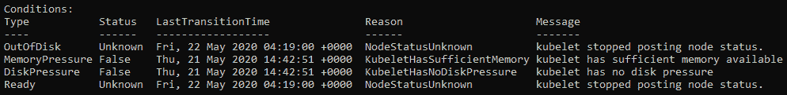
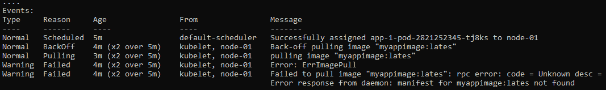

# 第十章：排查 Kubernetes

本章回顾了有效排查 Kubernetes 集群及其运行应用程序的最佳实践方法。这包括讨论常见的 Kubernetes 问题，以及如何分别调试主节点和工作节点。常见的 Kubernetes 问题将通过案例研究的形式进行讨论，分为集群问题和应用程序问题。

我们将首先讨论一些常见的 Kubernetes 故障模式，然后继续探讨如何最佳地排查集群和应用程序。

本章将涵盖以下主题：

+   理解分布式应用程序的故障模式

+   排查 Kubernetes 集群

+   在 Kubernetes 上排查应用程序

# 技术要求

为了执行本章中详细介绍的命令，你需要一台支持 `kubectl` 命令行工具的计算机，并且需要一个正常工作的 Kubernetes 集群。请参见*第一章*，《与 Kubernetes 通信》，其中提供了几种快速启动 Kubernetes 的方法，并介绍了如何安装 `kubectl` 工具的步骤。

本章使用的代码可以在本书的 GitHub 仓库中找到，地址为 [`github.com/PacktPublishing/Cloud-Native-with-Kubernetes/tree/master/Chapter10`](https://github.com/PacktPublishing/Cloud-Native-with-Kubernetes/tree/master/Chapter10)。

# 理解分布式应用程序的故障模式

Kubernetes 组件（以及在 Kubernetes 上运行的应用程序）默认是分布式的，只要它们运行了多个副本。这可能导致一些有趣的故障模式，调试起来可能比较困难。

因此，如果 Kubernetes 上的应用程序是无状态的，它们就不太容易发生故障——在这种情况下，状态会被转移到 Kubernetes 外部运行的缓存或数据库中。Kubernetes 中的原语，如 StatefulSets 和 PersistentVolumes，可以大大简化在 Kubernetes 上运行有状态应用程序的过程——随着每个版本的发布，Kubernetes 上运行有状态应用程序的体验也在不断改善。尽管如此，决定在 Kubernetes 上运行完全有状态的应用程序仍然会引入复杂性，从而增加故障的潜在风险。

分布式应用程序的故障可能由许多不同因素引起。像网络可靠性和带宽限制这样简单的因素，就可能导致严重的问题。这些问题种类繁多，以至于*彼得·德意志*（*Sun Microsystems*）和*詹姆斯·戈斯林*（他增加了第八点）共同撰写了《分布式计算的谬误》一文，成为业界普遍认可的分布式应用程序故障的因素。在《分布式计算的谬误解析》一文中，*阿尔农·罗特姆-加尔-奥兹*讨论了这些谬误的来源（[`www.rgoarchitects.com/Files/fallacies.pdf`](https://www.rgoarchitects.com/Files/fallacies.pdf)）。

这些谬误按数字顺序列出如下：

1.  网络是可靠的。

1.  延迟为零。

1.  带宽是无限的。

1.  网络是安全的。

1.  拓扑不会改变。

1.  只有一个管理员。

1.  传输成本为零。

1.  网络是同质化的。

Kubernetes 在设计和开发时就考虑到了这些错误观念，因此它更具容错性。它还帮助解决在 Kubernetes 上运行的应用程序面临的这些问题——但并不是完美的。因此，当你的应用程序容器化并在 Kubernetes 上运行时，很可能会遇到这些问题。每个错误观念，当被假定为不真实并推到其逻辑结论时，都可能在分布式应用程序中引入故障模式。我们来逐一分析这些错误观念，看看它们如何应用到 Kubernetes 以及在 Kubernetes 上运行的应用程序。

## 网络是可靠的。

运行在多个逻辑机器上的应用程序必须通过互联网进行通信——因此，网络中的任何可靠性问题都可能引发问题。特别是在 Kubernetes 上，控制平面本身可以通过高可用性设置进行分布式（这意味着使用多个主节点的设置——参见 *第一章*，*与 Kubernetes 通信*），这意味着控制器级别可能引入故障模式。如果网络不可靠，kubelet 可能无法与控制平面通信，从而导致 Pod 调度问题。

同样，控制平面的节点可能无法彼此通信——尽管`etcd`当然是采用共识协议构建的，可以容忍通信失败。

最后，工作节点可能无法相互通信——这在微服务场景中可能会根据 Pod 的放置位置引发问题。在某些情况下，工作节点可能都能与控制平面通信，但仍然无法相互通信，这可能会导致 Kubernetes 覆盖网络出现问题。

与一般的不可靠性一样，延迟也会引发许多相同的问题。

## 延迟为零。

如果网络延迟较大，许多与网络不可靠性相关的失败也可能会发生。例如，kubelet 与控制平面之间的调用可能会失败，导致`etcd`中的数据不准确，因为控制平面可能无法联系到 kubelet，或者无法正确更新`etcd`。类似地，在工作节点上运行的应用程序之间的请求可能会丢失，而如果这些应用程序运行在同一个节点上，它们本来是可以正常工作的。

## 带宽是无限的。

带宽限制可能会暴露与前两个谬误类似的问题。Kubernetes 目前没有一个完全支持的方法来基于带宽订阅来放置 Pods。这意味着那些达到网络带宽限制的节点仍然可以被调度新的 Pod，导致请求的失败率和延迟问题增加。曾有请求将其作为 Kubernetes 调度的核心特性（基本上，是一种像 CPU 和内存一样，基于节点带宽消耗进行调度的方式），但目前的解决方案主要还是局限于**容器网络接口**（**CNI**）插件。

重要提示

例如，CNI 带宽插件支持在 Pod 级别进行流量整形 – 请参见[`kubernetes.io/docs/concepts/extend-kubernetes/compute-storage-net/network-plugins/#support-traffic-shaping`](https://kubernetes.io/docs/concepts/extend-kubernetes/compute-storage-net/network-plugins/#support-traffic-shaping)。

第三方 Kubernetes 网络实现也可能提供与带宽相关的附加功能——并且许多与 CNI 带宽插件兼容。

## 网络是安全的

网络安全的影响远超 Kubernetes 本身——任何不安全的网络都容易受到一类攻击的威胁。攻击者可能通过 SSH 访问 Kubernetes 集群中的主节点或工作节点，这可能导致重大的安全漏洞。由于 Kubernetes 的许多“魔力”发生在网络上，而非单一机器中，因此在攻击情况下，访问网络会带来双重问题。

## 拓扑不会改变

这个谬误在 Kubernetes 环境中尤其相关，因为不仅元网络拓扑会因新增或移除节点而变化——覆盖网络拓扑也会直接受到 Kubernetes 控制平面和 CNI 的影响。

因此，在某一时刻运行在一个逻辑位置的应用程序，可能会在网络中的完全不同位置运行。因此，使用 Pod IP 来标识逻辑应用程序是一个不好的主意 – 这是 Service 抽象的目的之一（请参见*第五章*，*Service 和 Ingress* – *与外部世界通信*）。任何没有假设集群内拓扑是无限的应用程序（至少是关于 IP 的）都可能会遇到问题。例如，将流量路由到特定 Pod IP 仅在该 Pod 存在时有效。如果该 Pod 关闭，控制它的 Deployment（例如）将启动一个新的 Pod 来替代它，但 IP 会完全不同。集群 DNS（以及扩展的 Services）提供了一种更好的方式来在集群内的应用程序之间发起请求，除非你的应用程序有能力即时适应集群变化，比如 Pod 的位置调整。

## 只有一个管理员

多个管理员和冲突的规则可能会导致基础网络的问题，而多个 Kubernetes 管理员通过更改资源配置（例如 Pod 资源限制）可能会导致进一步的问题，从而导致意外行为。使用 Kubernetes **基于角色的访问控制**（**RBAC**）功能可以通过仅授予 Kubernetes 用户所需的权限（例如只读权限）来帮助解决这个问题。

## 传输成本为零

这种谬误有两种常见的解释方式。首先，认为传输的延迟成本为零——显然这是不正确的，因为通过线路传输数据的速度不是无限的，且低层次的网络问题会增加延迟。这本质上与*延迟为零*的谬误所带来的影响是相同的。

其次，这个说法可以解释为：创建和运营网络用于传输的成本为零——即零美元零分。虽然这显然也是不正确的（只需要看看你的云服务提供商的数据传输费用就能证明这一点），但这与 Kubernetes 上应用程序故障排除并没有直接关联，因此我们将重点讨论第一种解释。

## 网络是同质的

这个最终的谬误与 Kubernetes 的组件关系较小，而与运行在 Kubernetes 上的应用程序更相关。然而，事实上，今天在这种环境中操作的开发人员都很清楚，应用程序的网络实现可能在不同应用之间有所不同——从 HTTP 1 和 2 到像*gRPC* 这样的协议。

现在我们已经回顾了一些导致 Kubernetes 上应用程序失败的主要原因，我们可以深入实际的故障排除过程，排除 Kubernetes 本身以及运行在 Kubernetes 上的应用程序的问题。

# Kubernetes 集群故障排除

由于 Kubernetes 是一个分布式系统，设计时就考虑了容忍应用运行故障的情况，大多数（但不是全部）问题往往集中在控制平面和 API 上。工作节点失败，在大多数场景下，只会导致 Pods 被重新调度到另一个节点——尽管复合因素可能会引发问题。

为了走过常见的 Kubernetes 集群问题场景，我们将使用案例研究方法。这将为你提供解决现实世界集群问题所需的所有工具。我们的第一个案例研究聚焦于 API 服务器本身的故障。

重要提示

对于本教程的目的，我们将假设一个自我管理的集群。像 EKS、AKS 和 GKE 这样的托管 Kubernetes 服务通常会去除一些故障域（例如通过自动扩展和管理主节点）。一个好的规则是首先检查托管服务的文档，因为任何问题可能都是实现特定的。

## 案例研究——Kubernetes Pod 安排失败

让我们设定一下场景。你的集群已经启动并运行，但你遇到了 Pod 调度的问题。Pods 一直停留在 `Pending` 状态，无法调度。让我们通过以下命令来确认这一点：

```
kubectl get pods
```

命令的输出如下：

```
NAME                              READY     STATUS    RESTARTS   AGE
app-1-pod-2821252345-tj8ks        0/1       Pending   0          2d
app-1-pod-2821252345-9fj2k        0/1       Pending   0          2d
app-1-pod-2821252345-06hdj        0/1       Pending   0          2d
```

如我们所见，没有任何 Pods 在运行。此外，我们运行了三个副本的应用程序，但没有一个被调度。接下来的好步骤是检查节点状态，看看是否存在任何问题。运行以下命令以获取输出：

```
kubectl get nodes
```

我们得到如下输出：

```
  NAME           STATUS     ROLES    AGE    VERSION
  node-01        NotReady   <none>   5m     v1.15.6
```

这个输出给了我们一些有用的信息——我们只有一个工作节点，并且该节点无法进行调度。当 `get` 命令没有提供足够的信息时，`describe` 通常是一个不错的后续步骤。

让我们运行 `kubectl describe node node-01` 并检查 `conditions` 键。为了让所有内容整齐地显示在页面上，我们删除了一列，但最重要的列依然在：



图 10.1 – 描述节点条件输出

我们这里遇到一个有趣的分歧：`MemoryPressure` 和 `DiskPressure` 一切正常，而 `OutOfDisk` 和 `Ready` 状态未知，消息显示为 `kubelet 停止发布节点状态`。乍一看，这似乎不合常理——怎么会在 `MemoryPressure` 和 `DiskPressure` 一切正常的情况下，kubelet 停止工作呢？

重要部分在 `LastTransitionTime` 列中。kubelet 最近的内存和磁盘相关通信发送了正面的状态。然后，稍后 kubelet 停止发布其节点状态，导致 `OutOfDisk` 和 `Ready` 状态为 `Unknown`。

到此为止，我们确信问题出在我们的节点上——kubelet 不再将节点状态发送到控制平面。然而，我们不知道发生了什么。可能是网络错误，机器本身的问题，或者更具体的原因。我们需要进一步挖掘来找出问题所在。

这里的一个好步骤是更接近我们故障的节点，因为我们可以合理地假设它遇到了一些问题。如果你可以访问 `node-01` 的虚拟机或机器，现在是通过 SSH 登录它的好时机。进入机器后，我们可以进一步进行故障排除。

首先，让我们检查节点是否能通过网络访问控制平面。如果不能访问，这是 kubelet 无法发布状态的明显原因。假设我们的集群控制平面（例如本地负载均衡器）可通过 `10.231.0.1` 访问。为了检查节点是否可以访问 Kubernetes API 服务器，我们可以通过如下命令 ping 控制平面：

```
ping 10.231.0.1   
```

重要提示

若要找到控制平面的 IP 或 DNS，请检查您的集群配置。在像 AWS Elastic Kubernetes Service 或 Azure AKS 这样的托管 Kubernetes 服务中，您可能可以在控制台查看到该信息。如果您使用 kubeadm 自行引导了集群，例如，这个值就是您在安装过程中提供的。

让我们检查结果：

```
Reply from 10.231.0.1: bytes=1500 time=28ms TTL=54
Reply from 10.231.0.1: bytes=1500 time=26ms TTL=54
Reply from 10.231.0.1: bytes=1500 time=27ms TTL=54
```

这确认了——我们的节点确实能够与 Kubernetes 控制平面通信。所以，网络不是问题。接下来，让我们检查实际的 kubelet 服务。节点本身似乎正常运行，网络也没问题，所以合乎逻辑，下一步应该检查 kubelet。

Kubernetes 组件在 Linux 节点上作为系统服务运行。

重要提示

在 Windows 节点上，故障排除步骤会略有不同——有关更多信息，请参阅 Kubernetes 文档 ([`kubernetes.io/docs/setup/production-environment/windows/intro-windows-in-kubernetes/`](https://kubernetes.io/docs/setup/production-environment/windows/intro-windows-in-kubernetes/))。

若要查看我们 `kubelet` 服务的状态，可以运行以下命令：

```
systemctl status kubelet -l 
```

这将给我们以下输出：

```
 • kubelet.service - kubelet: The Kubernetes Node Agent
   Loaded: loaded (/lib/systemd/system/kubelet.service; enabled)
  Drop-In: /etc/systemd/system/kubelet.service.d
           └─10-kubeadm.conf
   Active: activating (auto-restart) (Result: exit-code) since Fri 2020-05-22 05:44:25 UTC; 3s ago
     Docs: http://kubernetes.io/docs/
  Process: 32315 ExecStart=/usr/bin/kubelet $KUBELET_KUBECONFIG_ARGS $KUBELET_SYSTEM_PODS_ARGS $KUBELET_NETWORK_ARGS $KUBELET_DNS_ARGS $KUBELET_AUTHZ_ARGS $KUBELET_CADVISOR_ARGS $KUBELET_CERTIFICATE_ARGS $KUBELET_EXTRA_ARGS (code=exited, status=1/FAILURE)
 Main PID: 32315 (code=exited, status=1/FAILURE)
```

看起来我们的 kubelet 当前没有在运行——它以失败状态退出了。这解释了我们在集群状态和 Pod 问题中看到的所有情况。

要解决这个问题，我们可以首先尝试使用以下命令重启 `kubelet`：

```
systemctl start kubelet
```

现在，让我们使用状态命令重新检查 `kubelet` 的状态：

```
 • kubelet.service - kubelet: The Kubernetes Node Agent
   Loaded: loaded (/lib/systemd/system/kubelet.service; enabled)
  Drop-In: /etc/systemd/system/kubelet.service.d
           └─10-kubeadm.conf
   Active: activating (auto-restart) (Result: exit-code) since Fri 2020-05-22 06:13:48 UTC; 10s ago
     Docs: http://kubernetes.io/docs/
  Process: 32007 ExecStart=/usr/bin/kubelet $KUBELET_KUBECONFIG_ARGS $KUBELET_SYSTEM_PODS_ARGS $KUBELET_NETWORK_ARGS $KUBELET_DNS_ARGS $KUBELET_AUTHZ_ARGS $KUBELET_CADVISOR_ARGS $KUBELET_CERTIFICATE_ARGS $KUBELET_EXTRA_ARGS (code=exited, status=1/FAILURE)
 Main PID: 32007 (code=exited, status=1/FAILURE)
```

看起来 `kubelet` 又失败了。我们需要获取更多关于失败模式的信息，以找出发生了什么。

让我们使用 `journalctl` 命令查找是否有相关日志：

```
sudo journalctl -u kubelet.service | grep "failed"
```

输出应该会显示 `kubelet` 服务在失败时的日志：

```
May 22 04:19:16 nixos kubelet[1391]: F0522 04:19:16.83719    1287 server.go:262] failed to run Kubelet: Running with swap on is not supported, please disable swap! or set --fail-swap-on flag to false. /proc/swaps contained: [Filename                                Type                Size        Used        Priority /dev/sda1                               partition        6198732        0        -1]
```

看起来我们已经找到了问题所在——Kubernetes 不支持在默认情况下 `swap` 设置为 `on` 的 Linux 机器上运行。我们唯一的选择是禁用 `swap` 或者使用 `--fail-swap-on` 标志将 `kubelet` 重启并设置为 `false`。

在我们的情况下，我们将通过以下命令更改 `swap` 设置：

```
sudo swapoff -a
```

现在，重启 `kubelet` 服务：

```
sudo systemctl restart kubelet
```

最后，让我们检查一下我们的修复是否有效。使用以下命令检查节点：

```
kubectl get nodes 
```

这应该会显示类似如下的输出：

```
  NAME           STATUS     ROLES    AGE    VERSION
  node-01        Ready      <none>   54m    v1.15.6
```

我们的节点终于显示 `Ready` 状态了！

让我们使用以下命令检查我们的 Pod：

```
kubectl get pods
```

这应该会显示如下输出：

```
NAME                              READY     STATUS    RESTARTS   AGE
app-1-pod-2821252345-tj8ks        1/1       Running   0          1m
app-1-pod-2821252345-9fj2k        1/1       Running   0          1m
app-1-pod-2821252345-06hdj        1/1       Running   0          1m
```

成功！我们的集群健康，Pod 正在运行。

接下来，在解决任何集群问题后，让我们看看如何在 Kubernetes 上进行应用故障排除。

# Kubernetes 应用故障排除

一个完美运行的 Kubernetes 集群仍然可能存在应用程序问题。这些问题可能是由于应用程序本身的 bug，或者由于构成应用程序的 Kubernetes 资源配置错误。与集群故障排查一样，我们将通过一个案例研究来深入探讨这些概念。

## 案例研究 1 – Service 无响应

我们将把这一部分分解为多个层次的 Kubernetes 堆栈故障排查，首先从更高层次的组件开始，然后深入到 Pod 和容器的调试。

假设我们已经配置了应用程序 `app-1`，通过 `NodePort` Service 来响应请求，端口为 `32688`，而应用程序监听的端口是 `80`。

我们可以尝试通过一个 `curl` 请求访问我们的应用程序，命令如下：

```
curl http://10.213.2.1:32688
```

如果 `curl` 命令失败，输出将如下所示：

```
curl: (7) Failed to connect to 10.231.2.1 port 32688: Connection refused
```

到此为止，我们的 `NodePort` Service 并未将请求路由到任何 Pod。按照我们的典型调试路径，首先让我们查看集群中运行了哪些资源，使用以下命令：

```
kubectl get services
```

添加 `-o` wide 标志以查看额外信息。接着，运行以下命令：

```
kubectl get services -o wide 
```

这将给我们以下输出：

```
NAME TYPE CLUSTER-IP EXTERNAL-IP PORT(S) AGE SELECTOR 
app-1-svc NodePort 10.101.212.57 <none> 80:32688/TCP 3m01s app=app-1
```

很明显，我们的 Service 存在并且配置了正确的 Node port，但正如从失败的 `curl` 命令中看出，我们的请求并没有被路由到 Pods。

要查看我们的 Service 设置了哪些路由，我们可以使用 `get endpoints` 命令。这个命令将列出该 Service 的 Pod IP（如果有的话）：

```
kubectl get endpoints app-1-svc
```

让我们检查命令的结果输出：

```
NAME        ENDPOINTS
app-1-svc   <none>
```

好吧，显然这里出了点问题。

我们的 Service 没有指向任何 Pod。这很可能意味着没有任何 Pod 匹配我们的 Service 选择器。这可能是因为没有可用的 Pods，或者是因为这些 Pods 没有正确匹配 Service 选择器。

为了检查我们的 Service 选择器，让我们按照调试路径的下一步，使用 `describe` 命令，如下所示：

```
kubectl describe service app-1-svc  
```

这将给出如下输出：

```
Name:                   app-1-svc
Namespace:              default
Labels:                 app=app-11
Annotations:            <none>
Selector:               app=app-11
Type:                   NodePort
IP:                     10.57.0.15
Port:                   <unset> 80/TCP
TargetPort:             80/TCP
NodePort:               <unset> 32688/TCP
Endpoints:              <none>
Session Affinity:       None
Events:                 <none>
```

如你所见，我们的 Service 已经配置为与应用程序的正确端口进行通信。然而，选择器正在寻找标签为 `app = app-11` 的 Pods。由于我们知道我们的应用程序名为 `app-1`，这可能是问题的根源。

让我们编辑我们的 Service，查找正确的 Pod 标签 `app-1`，并再次运行 `describe` 命令来确保：

```
kubectl describe service app-1-svc
```

这给出了以下输出：

```
Name:                   app-1-svc
Namespace:              default
Labels:                 app=app-1
Annotations:            <none>
Selector:               app=app-1
Type:                   NodePort
IP:                     10.57.0.15
Port:                   <unset> 80/TCP
TargetPort:             80/TCP
NodePort:               <unset> 32688/TCP
Endpoints:              <none>
Session Affinity:       None
Events:                 <none>
```

现在，你可以在输出中看到我们的 Service 正在寻找正确的 Pod 选择器，但我们仍然没有任何端点。让我们通过以下命令检查一下我们的 Pods 出现了什么问题：

```
kubectl get pods
```

这将显示以下输出：

```
NAME                              READY     STATUS    RESTARTS   AGE
app-1-pod-2821252345-tj8ks        0/1       Pending   0          -
app-1-pod-2821252345-9fj2k        0/1       Pending   0          -
app-1-pod-2821252345-06hdj        0/1       Pending   0          -
```

我们的 Pods 仍在等待调度。这解释了为什么即使有正确的选择器，我们的 Service 仍然无法正常工作。为了更细致地了解为什么我们的 Pods 没有被调度，我们可以使用 `describe` 命令：

```
kubectl describe pod app-1-pod-2821252345-tj8ks
```

以下是输出。我们关注 `Events` 部分：



图 10.2 – 描述 Pod 事件输出

从`Events`部分来看，我们的 Pod 未能成功调度，原因是容器镜像拉取失败。这可能有很多原因——例如，我们的集群可能没有从私有仓库拉取镜像所需的认证机制——但这种情况通常会显示为不同的错误信息。

从上下文和`Events`输出来看，我们大概可以推测出问题所在：我们的 Pod 定义正在寻找名为`myappimage:lates`的容器，而不是`myappimage:latest`。

让我们用正确的镜像名称更新我们的 Deployment 规范，并推出更新。

使用以下命令来确认：

```
kubectl get pods
```

输出如下所示：

```
NAME                              READY     STATUS    RESTARTS   AGE
app-1-pod-2821252345-152sf        1/1       Running   0          1m
app-1-pod-2821252345-9gg9s        1/1       Running   0          1m
app-1-pod-2821252345-pfo92        1/1       Running   0          1m
```

我们的 Pods 现在正在运行——让我们检查一下 Service 是否已注册正确的端点。使用以下命令来完成此操作：

```
kubectl describe services app-1-svc
```

输出应该如下所示：

```
Name:                   app-1-svc
Namespace:              default
Labels:                 app=app-1
Annotations:            <none>
Selector:               app=app-1
Type:                   NodePort
IP:                     10.57.0.15
Port:                   <unset> 80/TCP
TargetPort:             80/TCP
NodePort:               <unset> 32688/TCP
Endpoints:              10.214.1.3:80,10.214.2.3:80,10.214.4.2:80
Session Affinity:       None
Events:                 <none>
```

成功！我们的 Service 已正确指向应用程序 Pods。

在接下来的案例研究中，我们将通过故障排除启动参数不正确的 Pod，深入分析。

## 案例研究 2 – 错误的 Pod 启动命令

假设我们的 Service 已正确配置，Pods 也在运行并通过了健康检查。然而，我们的 Pod 没有按照预期响应请求。我们确信这不是 Kubernetes 的问题，更可能是应用程序或配置的问题。

我们的应用容器工作原理如下：它接收一个启动命令，带有一个`color`标志，并将其与基于容器`image`标签的`version number`变量结合，然后将结果返回给请求者。我们希望应用程序返回`green 3`。

幸运的是，Kubernetes 为我们提供了一些很好的工具来调试应用程序，我们可以使用这些工具深入分析具体的容器。

首先，让我们`curl`应用程序，查看得到什么响应：

```
curl http://10.231.2.1:32688  
red 2
```

我们本来期望`green 3`，但得到了`red 2`，所以看起来输入或者版本号变量出了问题。我们先从前者开始。

一如既往，我们通过以下命令来检查我们的 Pods：

```
kubectl get pods
```

输出应该如下所示：

```
NAME                              READY     STATUS    RESTARTS   AGE
app-1-pod-2821252345-152sf        1/1       Running   0          5m
app-1-pod-2821252345-9gg9s        1/1       Running   0          5m
app-1-pod-2821252345-pfo92        1/1       Running   0          5m
```

该输出看起来一切正常。似乎我们的应用程序作为 Deployment 的一部分（因此也是 ReplicaSet 的一部分）在运行——我们可以通过运行以下命令来确认：

```
kubectl get deployments
```

输出应该如下所示：

```
NAME          DESIRED   CURRENT   UP-TO-DATE   AVAILABLE   AGE
app-1-pod     3         3         3            3           5m
```

让我们通过以下命令更仔细地查看 Deployment，看看 Pods 是如何配置的：

```
kubectl describe deployment app-1-pod -o yaml
```

输出看起来如下所示：

broken-deployment-output.yaml

```
apiVersion: apps/v1
kind: Deployment
metadata:
  name: app-1-pod
spec:
  selector:
    matchLabels:
      app: app-1
  replicas: 3
  template:
    metadata:
      labels:
        app: app-1
    spec:
      containers:
      - name: app-1
        image: mycustomrepository/app-1:2
        command: [ "start", "-color", "red" ]
        ports:
        - containerPort: 80
```

让我们看看是否能修复这个问题，其实这非常简单。我们使用了错误版本的应用程序，而且启动命令也错了。在这种情况下，假设我们没有包含 Deployment 规范的文件——那么我们就直接在原地编辑它。

让我们使用`kubectl edit deployment app-1-pod`，并将 Pod 规范编辑为如下：

fixed-deployment-output.yaml

```
apiVersion: apps/v1
kind: Deployment
metadata:
  name: app-1-pod
spec:
  selector:
    matchLabels:
      app: app-1
  replicas: 3
  template:
    metadata:
      labels:
        app: app-1
    spec:
      containers:
      - name: app-1
        image: mycustomrepository/app-1:3
        command: [ "start", "-color", "green" ]
        ports:
        - containerPort: 80
```

一旦 Deployment 被保存，你应该开始看到新的 Pod 启动。让我们通过以下命令再确认一下：

```
 kubectl get pods
```

输出应如下所示：

```
NAME                              READY     STATUS    RESTARTS   AGE
app-1-pod-2821252345-f928a        1/1       Running   0          1m
app-1-pod-2821252345-jjsa8        1/1       Running   0          1m
app-1-pod-2821252345-92jhd        1/1       Running   0          1m
```

最后——让我们发起一个`curl`请求，检查一切是否正常：

```
curl http://10.231.2.1:32688  
```

命令的输出如下：

```
green 3
```

成功！

## 案例研究 3 —— Pod 应用程序故障与日志

在前一章节*第九章*，*Kubernetes 上的可观测性*，我们实现了对应用程序的可观测性，接下来让我们看看这些工具如何真正派上用场。我们将在此案例研究中使用手动的`kubectl`命令——但要知道，通过聚合日志（例如，在我们的 EFK 堆栈实现中），我们可以显著简化调试过程。

在此案例研究中，我们再次有一个 Pod 部署——要检查它，运行以下命令：

```
kubectl get pods
```

命令的输出如下：

```
NAME              READY     STATUS    RESTARTS   AGE
app-2-ss-0        1/1       Running   0          10m
app-2-ss-1       1/1       Running   0          10m
app-2-ss-2       1/1       Running   0          10m
```

看起来，在这种情况下，我们正在使用 StatefulSet 而不是 Deployment——这里的一个关键特征是 Pod ID 从 0 开始递增。

我们可以通过以下命令确认这一点，检查 StatefulSet：

```
kubectl get statefulset
```

命令的输出如下：

```
NAME          DESIRED   CURRENT   UP-TO-DATE   AVAILABLE   AGE
app-2-ss      3         3         3            3           10m
```

让我们通过运行`kubectl get statefulset -o yaml app-2-ss`来仔细查看我们的 StatefulSet。通过使用`get`命令并加上`-o yaml`，我们可以以典型的 Kubernetes 资源 YAML 格式获取`describe`输出。

上述命令的输出如下。我们删除了 Pod spec 部分，以便保持简洁：

statefulset-output.yaml

```
apiVersion: apps/v1
kind: StatefulSet
metadata:
  name: app-2-ss
spec:
  selector:
    matchLabels:
      app: app-2
  replicas: 3
  template:
    metadata:
      labels:
        app: app-2
```

我们知道我们的应用程序正在使用一个服务。让我们看看它是哪个服务！

运行`kubectl get services -o wide`。输出应如下所示：

```
NAME TYPE CLUSTER-IP EXTERNAL-IP PORT(S) AGE SELECTOR 
app-2-svc NodePort 10.100.213.13 <none> 80:32714/TCP 3m01s app=app-2
```

很明显，我们的服务名为`app-2-svc`。让我们使用以下命令查看我们的精确服务定义：

```
kubectl describe services app-2-svc 
```

输出如下：

```
Name:                   app-2-svc
Namespace:              default
Labels:                 app=app-2
Annotations:            <none>
Selector:               app=app-2
Type:                   NodePort
IP:                     10.57.0.12
Port:                   <unset> 80/TCP
TargetPort:             80/TCP
NodePort:               <unset> 32714/TCP
Endpoints:              10.214.1.1:80,10.214.2.3:80,10.214.4.4:80
Session Affinity:       None
Events:                 <none>
```

为了准确查看我们的应用程序在给定输入下的返回情况，我们可以在`NodePort`服务上使用`curl`：

```
> curl http://10.231.2.1:32714?equation=1plus1
3
```

基于我们对应用程序的现有了解，我们会假设此调用应返回`2`，而不是`3`。我们团队的应用程序开发人员要求我们调查任何日志输出，以帮助他们找出问题所在。

我们从前面的章节中知道，你可以通过`kubectl logs <pod name>`来查看日志输出。在我们的案例中，我们有三个副本的应用程序，所以可能无法通过这条命令的单次迭代找到日志。让我们随机选一个 Pod，看看它是否处理了我们的请求：

```
> kubectl logs app-2-ss-1
>
```

看起来这不是处理我们请求的 Pod，因为我们的应用程序开发人员告诉我们，应用程序在收到`GET`请求时肯定会记录到`stdout`。

我们可以使用一个联合命令从所有三个 Pod 中获取日志，而不是单独检查其他两个 Pod。该命令如下所示：

```
> kubectl logs statefulset/app-2-ss
```

输出如下：

```
> Input = 1plus1
> Operator = plus
> First Number = 1
> Second Number = 2
```

成功了——更重要的是，我们对问题有了一些好的见解。

除了日志行显示 `Second Number` 外，一切看起来都如我们预期。我们的请求明显使用了 `1plus1` 作为查询字符串，这将使第一个数字和第二个数字（由操作符值分割）都等于 1。

这需要一些额外的挖掘。我们可以通过发送额外的请求并检查输出以猜测发生了什么来进行问题诊断，但在这种情况下，最好是直接获得 Pod 的 bash 访问权限，弄清楚发生了什么。

首先，让我们检查我们的 Pod 规格，该规格在之前的 StatefulSet YAML 中已被删除。要查看完整的 StatefulSet 规格，请访问 GitHub 仓库：

Statefulset-output.yaml

```
spec:
  containers:
  - name: app-2
    image: mycustomrepository/app-2:latest
    volumeMounts:
    - name: scratch
      mountPath: /scratch
  - name: sidecar
    image: mycustomrepository/tracing-sidecar
  volumes:
  - name: scratch-volume
    emptyDir: {}
```

看起来我们的 Pod 正在挂载一个空的卷作为临时磁盘。每个 Pod 中还包含两个容器——一个用于应用追踪的 sidecar 和我们的应用程序本身。我们需要这些信息来通过`ssh`进入其中一个 Pod（对于本练习来说，哪个 Pod 无关紧要），使用 `kubectl exec` 命令。

我们可以使用以下命令来做到这一点：

```
kubectl exec -it app-2-ss-1 app2 -- sh.  
```

这个命令应该会给你一个 bash 终端作为输出：

```
> kubectl exec -it app-2-ss-1 app2 -- sh
# 
```

现在，使用我们刚刚创建的终端，我们应该能够调查我们的应用程序代码。为了本教程的目的，我们使用了一个高度简化的 Node.js 应用程序。

让我们检查我们的 Pod 文件系统，看看我们正在使用什么，通过以下命令：

```
# ls
# app.js calculate.js scratch
```

看起来我们有两个 JavaScript 文件，以及我们之前提到的 `scratch` 文件夹。可以合理推测，`app.js` 包含启动和服务应用程序的逻辑，而 `calculate.js` 包含我们的控制器代码，用于进行计算。

我们可以通过打印`calculate.js`文件的内容来确认：

Broken-calculate.js

```
# cat calculate.js
export const calculate(first, second, operator)
{
  second++;
  if(operator === "plus")
  {
   return first + second;
  }
}
```

即使对 JavaScript 知识了解甚少，问题也非常明显。代码在执行计算之前已经递增了 `second` 变量。

既然我们已经进入了 Pod，并且我们使用的是一种非编译语言，我们实际上可以直接在线编辑这个文件！让我们使用 `vi`（或任何文本编辑器）来修正这个文件：

```
# vi calculate.js
```

并编辑文件，内容如下：

fixed-calculate.js

```
export const calculate(first, second, operator)
{
  if(operator === "plus")
  {
   return first + second;
  }
}
```

现在，我们的代码应该能够正常运行。重要的是要声明，这个修复是临时的。一旦我们的 Pod 关闭或被另一个 Pod 替换，它将恢复为原本包含在容器镜像中的代码。然而，这种模式确实允许我们尝试快速修复。

在使用 `exit` bash 命令退出 `exec` 会话后，让我们再次尝试我们的 URL：

```
> curl http://10.231.2.1:32714?equation=1plus1
2
```

如你所见，我们的热修复容器显示了正确的结果！现在，我们可以通过修复以更永久的方式更新我们的代码和 Docker 镜像。使用`exec`是排查和调试正在运行的容器的好方法。

# 总结

在本章中，我们学习了如何在 Kubernetes 上排查应用程序的故障。首先，我们涵盖了分布式应用程序的一些常见故障模式。然后，我们学习了如何对 Kubernetes 组件进行问题分类。最后，我们回顾了几种 Kubernetes 配置和应用程序调试的场景。本章学到的 Kubernetes 调试和故障排除技术将在您处理可能涉及的任何 Kubernetes 集群和应用程序问题时提供帮助。

在下一章，*第十一章*，*Kubernetes 上的模板代码生成与持续集成/持续部署*，我们将探讨一些用于模板化 Kubernetes 资源清单和使用 Kubernetes 进行持续集成/持续部署的生态系统扩展。

# 问题

1.  分布式系统谬论 "*拓扑结构不会改变*" 如何适用于运行在 Kubernetes 上的应用程序？

1.  Kubernetes 控制平面组件（和 kubelet）如何在操作系统级别实现？

1.  在处理 Pods 处于 `Pending` 状态的问题时，您会如何进行调试？您的第一步是什么？第二步呢？

# 进一步阅读

+   用于流量整形的 CNI 插件：[`kubernetes.io/docs/concepts/extend-kubernetes/compute-storage-net/network-plugins/#support-traffic-shaping`](https://kubernetes.io/docs/concepts/extend-kubernetes/compute-storage-net/network-plugins/#support-traffic-shaping)
