# 第一章. 本地安装 Docker

在本章，我们将研究如何在以下平台上安装和配置 Docker：

+   macOS Sierra

+   Windows 10 专业版

+   Ubuntu 16.04 LTS 桌面版

安装完成后，我们将探讨如何与本地的 Docker 安装进行交互。

在我们开始安装之前，我想花点时间简单介绍一下我们将要安装的 Docker 版本。

截至写作时，Docker 17.03 刚刚发布，像大多数更新一样，带来了新特性和对现有特性的改动。本书是基于这个版本的 Docker 编写的，因此使用较旧版本时，某些命令可能无法正常工作或效果不同。

如果你已经安装了 Docker，我建议你运行以下命令检查是否运行的是 Docker 17.03 版本：

```
docker version

```

如果你的 Docker 版本低于 17.03，请在继续阅读后续章节之前，参考以下每个部分中的升级说明。

# Docker for Mac 和 Windows

正如在前言中提到的，我们将在本书中讨论的 Docker 引擎版本是一个基于 Linux 的工具，那么它如何在 macOS 和 Windows 上工作呢？

很容易认为，由于 macOS 是一个建立在类似 UNIX 核心 XNU 上的操作系统，Docker 会像在 Linux 机器上那样运行，然而，不幸的是，允许 Docker 运行的许多功能在 macOS 使用的内核中并不存在。

尽管最近推出了 Windows 子系统用于 Linux，当前仍处于 beta 阶段，但 Docker for Windows 目前并没有利用这一功能，这意味着 Docker 使用的 Linux 核心更加有限。

### 注意

Windows 子系统用于 Linux 提供了一个 Ubuntu shell，允许你在 Windows 安装上运行本地的 Linux 命令行工具；更多信息，请参阅 [`msdn.microsoft.com/en-gb/commandline/wsl/about`](https://msdn.microsoft.com/en-gb/commandline/wsl/about)。

那么 Docker for Mac 和 Windows 是如何工作的呢？最新版本的 macOS 和 Windows 10 专业版都内置了超管程序（hypervisor），这些超管程序被集成在操作系统的内核中，macOS 拥有 **Hypervisor 框架**，而 Windows 10 使用的是 Hyper-V。

### 注意

Hypervisor 框架允许开发者构建应用程序，而无需安装第三方内核扩展，这意味着他们可以利用完整的硬件虚拟化，但依然保持在用户空间内，这使得虚拟机保持沙箱状态，就像它们作为原生应用程序运行一样。以下链接提供了技术概览：[`developer.apple.com/reference/hypervisor`](https://developer.apple.com/reference/hypervisor)

对于 Docker for Mac，Docker 构建了自己的开源框架，它与名为 **HyperKit** 的 Hypervisor 框架兼容：你可以在 [`github.com/docker/HyperKit/`](https://github.com/docker/HyperKit/) 了解更多关于 HyperKit 的信息。

Hyper-V 自 Windows Server 2008 以来一直是 Windows 操作系统的原生虚拟机监控程序；自 Windows 8（专业版和企业版）以来，它也成为 Windows 桌面版本的一部分，允许用户和开发者在沙箱环境中启动带有硬件虚拟化的 Windows 和 Linux 虚拟机。有关 Hyper-V 的更多信息，请参见 [`www.microsoft.com/en-us/cloud-platform/server-virtualization`](https://www.microsoft.com/en-us/cloud-platform/server-virtualization)。

Docker for Mac 和 Windows 使用这些本地虚拟化技术来启动一个运行 MobyLinux 发行版的虚拟机，MobyLinux 是基于 Alpine Linux 的轻量级发行版，其唯一功能是运行 Docker。

### 注意

Alpine Linux 的 ISO 文件当前大小为 26 MB，完全功能的最小安装需要约 130MB 的空间，尽管该发行版非常小，但它与更常见的 Linux 发行版一样可用且安全。你可以在 [`alpinelinux.org/`](https://alpinelinux.org/) 了解更多信息。

Docker for Mac 和 Windows 负责启动、配置和维护虚拟机，并处理如网络和从本地计算机挂载文件系统到 MobyLinux 虚拟机等功能。

## Docker for Mac

Docker for Mac 有以下系统要求；如果你的机器不满足这些要求，Docker for Mac 将无法安装：

+   你的 Mac 必须是 2010 年或更高版本，且支持英特尔的硬件 **内存管理单元** (**MMU**) 虚拟化。

+   你必须运行 OS X El Capitan 10.11 或更高版本。建议你运行最新的 macOS。

+   你必须至少有 4GB 的 RAM。

+   不得安装版本为 4.3.30 或更低版本的 VirtualBox，因为这会与 Docker for Mac 产生冲突。

要检查你的机器是否支持 Docker for Mac，你可以运行以下命令：

```
sysctl kern.hv_support

```

当你运行该命令时，应该返回 `1`，这意味着你的内核启用了虚拟化，并且它可以在你的 CPU 上使用。

### 下载 Docker for Mac

Docker for Mac 可以从以下网址获取：

[`store.docker.com/editions/community/docker-ce-desktop-mac`](https://store.docker.com/editions/community/docker-ce-desktop-mac)

我建议暂时使用 **稳定版**，因为这是我们将在后续章节中安装到远程机器上的版本。点击 **Get Docker for Mac (stable)** 将开始下载磁盘镜像（DMG）文件，下载完成后，双击文件以挂载它。

### 安装 Docker for Mac

就像大多数 macOS 应用程序一样，你只需要做以下几步：

1.  将 Docker 应用程序从挂载的磁盘映像拖到您的应用程序文件夹中；通过双击打开 macOS Finder 中的挂载镜像可以轻松完成此任务，如下截图所示：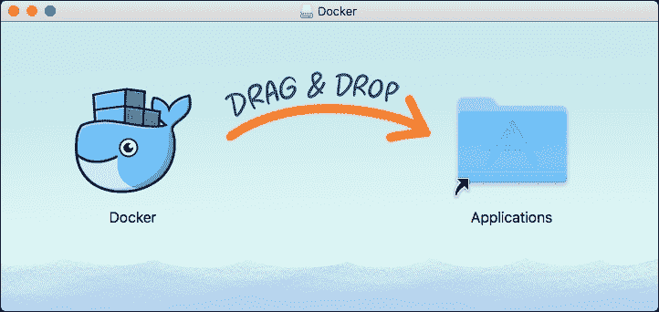

1.  一旦应用程序复制完成，您可以关闭 Finder 窗口，打开您的 **应用程序**，找到 Docker 并打开它：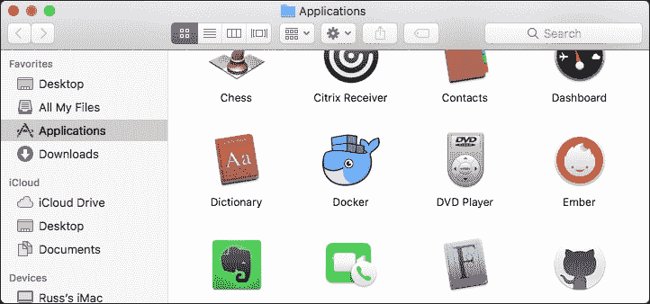

1.  第一次打开 Docker 时，您将会看到初始安装向导：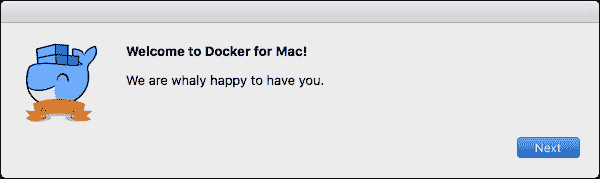

1.  点击 **下一步** 后，系统会告诉您 Docker 将要求输入密码，安装过程需要此密码来完成安装。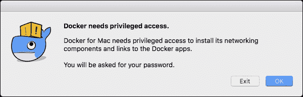

1.  点击 **确定** 后，系统会提示您输入密码，然后菜单栏中会出现一个鲸鱼图标，在 Docker 启动时，您应该会看到如下弹出窗口：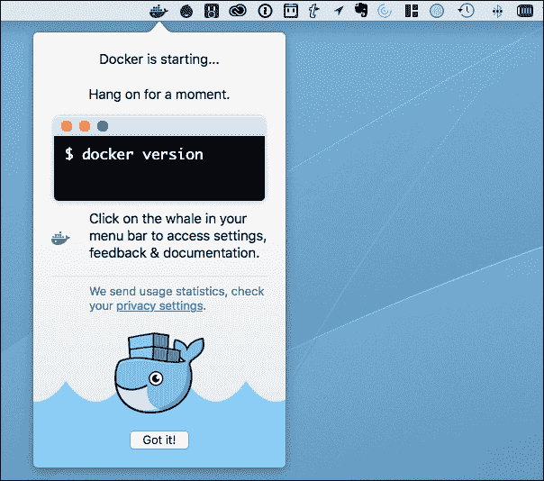

1.  点击 **明白了！** 将关闭弹出窗口。您可以通过观察鲸鱼图标上的小框停止动画来判断 Docker 是否已启动；此外，右键单击图标将弹出一个菜单，显示 Docker 安装的状态：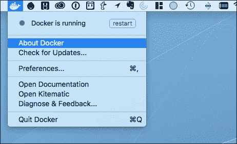

1.  从菜单中选择 **关于 Docker** 将打开以下窗口：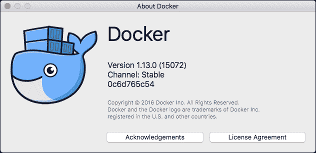

1.  在终端运行以下命令将显示有关您 Docker 安装的附加信息：

    ```
    docker version
    ```

    您应该会看到类似以下的输出：

    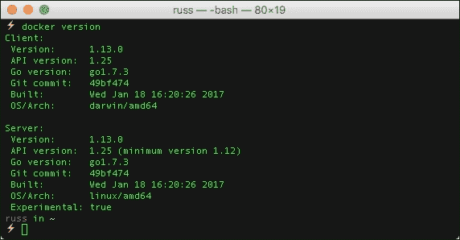

如您所见，它提供了有关 Docker 客户端的详细信息，该客户端已安装在您的 macOS 主机上，并且客户端正在连接到 MobyLinux 虚拟机。

## Docker for Windows

Docker for Windows 有以下系统要求；如果您的机器不符合这些要求，Docker for Windows 会在退出前通知您：

+   您必须运行 64 位 Windows 10 专业版、企业版或教育版（1511 年 11 月更新，版本 10586 或更高）或更高版本（未来有计划支持其他版本）

+   必须启用 Hyper-V，但如果需要，安装程序会为您启用它

+   您必须至少有 4GB 的内存

### 正在下载 Docker for Windows

Docker for Windows 可通过以下 URL 获取：

[`store.docker.com/editions/community/docker-ce-desktop-windows`](https://store.docker.com/editions/community/docker-ce-desktop-windows)

和 Docker for Mac 一样，我建议选择 **稳定版频道**。点击 **下载 Docker for Windows（稳定版）** 将下载一个安装程序；当安装程序下载完成后，您将有机会选择 **运行** 它。

### 安装 Docker for Windows

当 Docker for Windows 安装程序首次打开时，您将看到 Docker 许可协议：

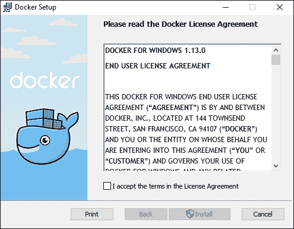

点击**我接受许可协议条款**将启用**安装**按钮，点击**安装**将立即开始安装。

一两分钟后，你应该会收到安装完成的确认信息。

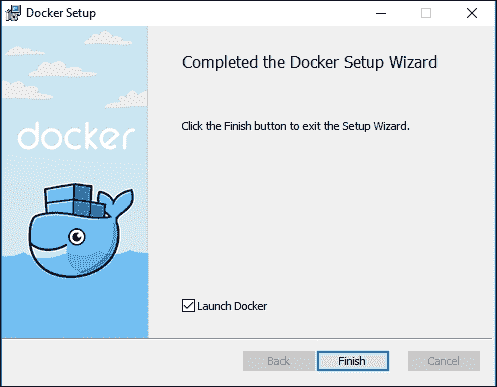

确保**启动 Docker**已被勾选（默认应为勾选状态），点击**完成**以打开 Docker。如果你没有启用 Hyper-V，你将会收到以下提示：

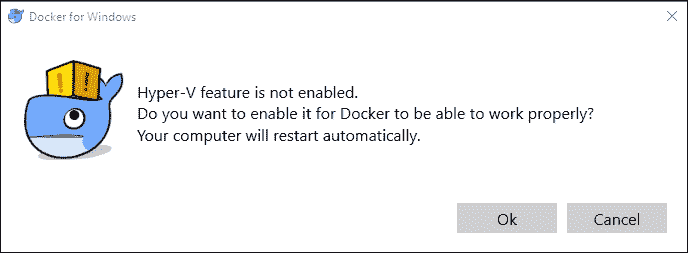

点击**确定**将重启你的计算机，因此请确保已保存任何打开的文档。重启后，Docker 应自动启动，和 Mac 版 Docker 一样，你会注意到菜单栏中有一个鲸鱼图标：

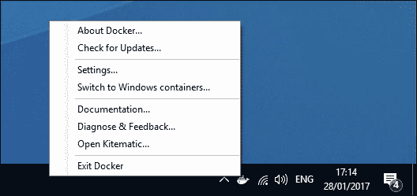

Docker 启动后，从菜单中选择**关于 Docker**将打开以下窗口：

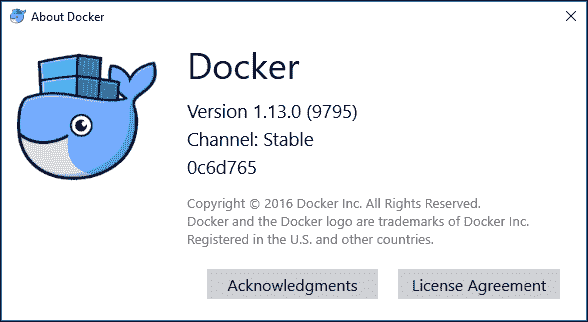

最后，打开 Windows PowerShell 并输入以下命令：

```
docker version

```

这将返回类似的信息，显示 Mac 版 Docker 的客户端信息和 MobyLinux 虚拟机的详细信息：

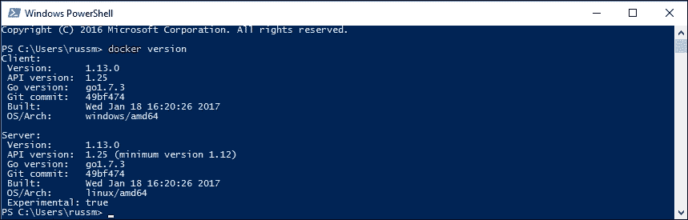

还有一件事需要注意：Windows 版 Docker 可以运行本地 Windows 容器。你可以通过从菜单中选择**切换到 Windows 容器...**来启用此功能；如果这是你第一次启用此功能，你将看到以下弹出对话框：

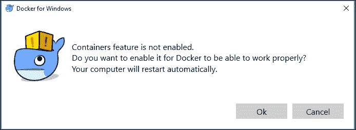

点击**确定**将重启你的计算机。重启后，再次选择菜单选项将切换你从使用 Linux 容器到 Windows 容器；当你运行以下命令时，可以看到这个变化：

```
docker version

```

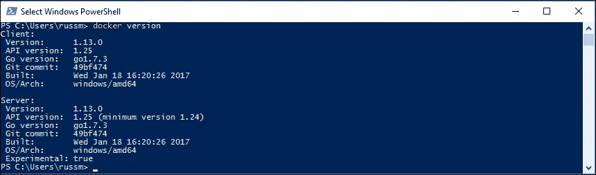

如你所见，服务器的**OS/Arch**已经从**linux/amd64**更改为**windows/amd64**。本书中我们不会讨论 Windows 容器；你可以通过菜单选项切换回 Linux 容器：

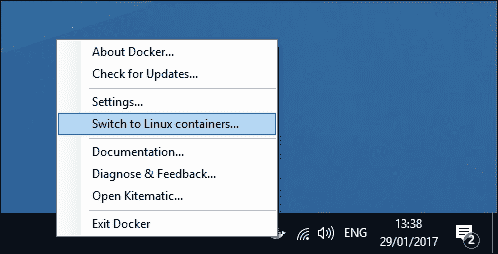

### 提示

如果你在后续章节中使用 Docker for Windows 运行命令时遇到问题，请检查你是否使用的是 Linux 容器，可以通过运行`docker version`或使用菜单进行检查。

## 升级 Mac 和 Windows 版的 Docker

Mac 和 Windows 版的 Docker 都允许你轻松更新已安装的 Docker 版本。如果你安装了旧版的 Docker for Mac 或 Windows，当你第一次打开 Docker 时，应该会收到提示，告诉你有更新版本可用。如果没有收到提示，你可以从菜单中选择**检查更新...**来启动升级过程，过程与我们之前介绍的每个版本的安装过程类似。

如果没有更新，你将收到一条通知，确认你已是最新版本。

# Ubuntu 16.04 上的 Docker

如果你查看 Docker 网站，你会注意到没有 Linux 桌面版的 Docker 下载，因为实际上不需要。Docker 是一个 Linux 工具，它可以原生运行在大多数 Linux 桌面和服务器上。

虽然 Docker 可以在主 Ubuntu 仓库中找到，我推荐使用官方仓库来安装 Docker。你可以通过运行以下命令来实现：

```
curl -sSL https://get.docker.com/ | sh

```

这将配置并安装 Docker Engine 的最新版本。安装完成后，你会收到一个命令，运行它以授予你的用户运行 Docker 的权限，然后退出登录。

当你重新登录时，你将能够运行以下命令：

```
docker version

```

你应该看到类似如下的内容：

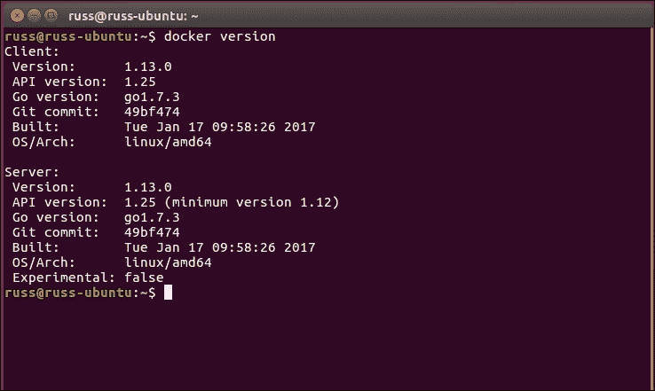

### 注意

到目前为止我没有提到的一件事是，当我们为 Mac 和 Windows 安装 Docker 时，还安装了两个附加组件。它们是 Docker Machine 和 Docker Compose，我们将在第二章，*使用 Docker 启动应用程序* 和 第三章，*Docker 在云端* 中讲解这些内容。

要安装 Docker Machine，请运行以下命令：

```
curl -L "https://github.com/docker/machine/releases/download/v0.9.0/docker-machine-$(uname -s)-$(uname -m)" -o /
tmp/docker-machine
chmod +x /tmp/docker-machine
sudo cp /tmp/docker-machine /usr/local/bin/docker-machine

```

要安装 Docker Compose，请运行以下命令：

```
curl -L "https://github.com/docker/compose/releases/download/1.
10.0/docker-compose-$(uname -s)-$(uname -m)" -o /usr/local/bin/docker-compose
chmod +x /tmp/docker-compose
sudo cp /tmp/docker-compose /usr/local/bin/docker-compose

```

安装完成后，你应该能够运行以下两个命令：

```
docker-compose version
docker-machine version

```

# 测试你的安装

现在我们已经安装了 Docker，我们将通过下载、运行并连接到一个 NGINX 容器来快速测试我们的安装。

### 注意

NGINX 是一个免费的开源高性能 HTTP 服务器和反向代理。NGINX 以其高性能、稳定性、丰富的功能集、简单的配置和低资源消耗而闻名。

### 提示

**关于 Docker 命令的说明**

Docker 1.13 引入了一组略微修改的命令行指令，用于与容器和镜像进行交互。由于该语法最终将成为新的标准，因此我们将在本书中使用它。有关 CLI 重构的更多信息，请参见 Docker 1.13 的公告博客：[`blog.docker.com/2017/01/whats-new-in-docker-1-13/`](https://blog.docker.com/2017/01/whats-new-in-docker-1-13/)

要下载并启动容器，你只需要从终端提示符运行以下命令：

```
docker image pull nginx
docker container run -d --name nginx-test -p 8080:80 nginx

```

第一个命令从 Docker Hub 拉取 NGINX 容器镜像，第二个命令启动我们的 NGINX 容器，并将其命名为 `nginx-test`，将本地端口 `8080` 映射到容器的端口 `80`。

你可以使用以下命令检查容器是否在运行：

```
docker container ps

```

打开浏览器并访问 `http://localhost:8080/` 应该会显示默认的 **Welcome to NGINX** 页面。

如下屏幕所示，使用 Docker for Mac 时过程相同：

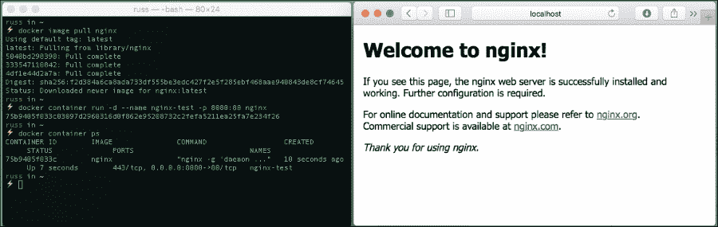

Docker for Windows：

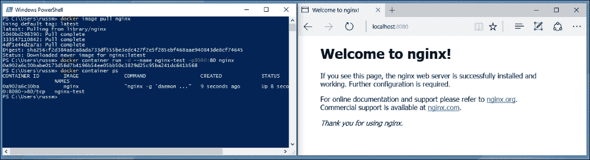

或者在 Ubuntu 16.04 上使用 Docker：

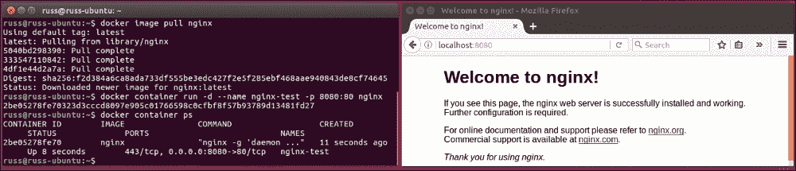

如上图所示，我们在三个平台上运行相同命令的结果完全相同。

一旦你测试了启动容器，你可以通过运行以下命令来清理操作，停止并移除容器，然后删除镜像：

```
docker container stop nginx-test
docker container rm nginx-test
docker image rm nginx

```

# 总结

在本章中，我们介绍了如何为 Mac 安装 Docker、为 Windows 安装 Docker 以及在 Ubuntu 16.04 上安装 Docker。希望你已经在本地机器上完成了一个或多个安装过程。我们还启动了我们的第一个容器，并通过网页浏览器连接到了它。

在下一章中，我们将详细介绍用于启动测试容器的命令，并讲解如何使用 Docker Compose 来启动多容器应用程序。
