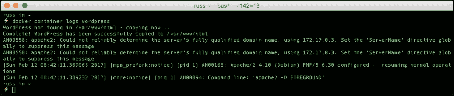

# 第二章. 使用 Docker 启动应用程序

在本章中，我们将讨论如何不仅仅使用本地 Docker 安装来启动一个简单的 web 服务器。我们将讨论以下主题：

+   使用命令行中的 Docker 启动应用程序

+   如何使用 Docker `build` 命令

+   使用 Docker Compose 使多容器应用程序的启动更加简单

然后，我们将使用上述所有技术来启动 WordPress 和 Drupal 应用程序堆栈。

# Docker 术语

在我们开始学习如何启动容器之前，我们需要快速讨论一下本章中将使用的常见术语。

### 小贴士

请注意，本章中的 Docker 命令是针对 Docker 1.13 及以后的版本编写的。在旧版本中运行诸如 `docker image pull nginx` 这样的命令将会失败并显示错误。有关如何安装最新版本 Docker 的详细信息，请参阅 第一章，*本地安装 Docker*。

## Docker 镜像

**Docker 镜像**是由构成可执行软件应用程序的所有文件集合组成的。这个集合包括应用程序本身以及所有的库、二进制文件和其他依赖项，如部署描述符等。这些文件仅用于在任何地方顺利运行应用程序，不会有任何阻碍。这些 Docker 镜像中的文件是只读的，因此镜像的内容不能被修改。如果你选择修改镜像的内容，Docker 唯一允许的做法是添加一个新层以包含新的更改。换句话说，Docker 镜像是由多个层组成的，你可以使用 `docker image history` 子命令查看这些层。

Docker 镜像架构有效地利用了这一层次化的概念，能够无缝地为现有镜像添加额外的功能，以满足不同的业务需求并增加镜像的复用性。换句话说，功能可以通过在现有镜像上添加额外的层来扩展，从而派生出新的镜像。Docker 镜像之间有父子关系，最底层的镜像被称为**基础镜像**。基础镜像是没有任何父镜像的特殊镜像：


在上图中，Ubuntu 是一个基础镜像，它没有任何父镜像。

### 注意

Ubuntu Docker 镜像是一个简化的软件库和二进制文件捆绑包，这些文件对于运行应用程序至关重要。它不包含 Linux 内核、驱动程序和完整 Ubuntu 操作系统提供的各种其他服务。


正如您在上图中所看到的，一切都始于一个基础镜像，在本例中是 Ubuntu。进一步，`wget`功能被添加到镜像作为一个层，并且`wget`镜像引用 Ubuntu 镜像作为其父级。在下一个层中，Tomcat 应用服务器的一个实例被添加，并且它将`wget`镜像作为其父级。对原始基础镜像的每次添加都存储在单独的层中（在此处生成了一种层次结构以保留原始身份）。

具体来说，任何 Docker 镜像都必须源自基础镜像，并且通过逐个添加新模块的方式持续丰富其功能，正如上图所生动展示的那样。

Docker 平台提供了一种简单的方式来构建新镜像或扩展现有镜像。您还可以下载其他人已经创建并存储在 Docker 镜像仓库（私有或公共）中的 Docker 镜像。

## Docker 注册表

**Docker 注册表**是一个地方，Docker 镜像可以被存储，以便全球软件开发人员能够快速创建新鲜和复合应用程序，而不会有任何风险。因为所有存储的镜像都将经过多次验证、确认和完善，这些镜像的质量非常高。

使用`dockerimage push`子命令，您可以将您的 Docker 镜像分发到注册表，以便注册和存储。使用`dockerimage pull`子命令，您可以从注册表下载 Docker 镜像。

一个 Docker 注册表可以由第三方托管为公共或私有注册表，比如以下几个注册表之一：

+   Docker Hub（[`hub.docker.com`](https://hub.docker.com)）

+   Quay（[`quay.io/`](https://quay.io/)）

+   Google 容器注册表（[`cloud.google.com/container-registry`](https://cloud.google.com/container-registry)）

+   AWS 容器注册表（[`aws.amazon.com/ecr/`](https://aws.amazon.com/ecr/)）

每个机构、创新者和个人都可以拥有自己的 Docker 注册表，用于存储其镜像以供内部和/或外部访问和使用。

## Docker Hub

在前一章中，当您运行`dockerimage pull`子命令时，`nginx`镜像神秘地被下载了下来。在本节中，让我们揭开`docker image pull`子命令周围的谜团，以及 Docker Hub 如何极大地促成了这一意外的成功。

Docker 社区的好伙伴们已经构建了一个镜像仓库，并将其公开放置在默认位置 `index.docker.io`。这个默认位置被称为 Docker Hub。`docker image pull` 子命令被设计为在这个位置查找镜像。因此，当您拉取 `nginx` 镜像时，它会轻松从默认注册表下载。这种机制有助于加快 Docker 容器的启动速度。

Docker Hub 是官方仓库，其中包含全球 Docker 开发社区精心策划和存储的所有镜像。所谓的“治愈”是通过一系列隔离任务确保 Docker Hub 中存储的所有镜像安全可靠。还有额外的机制，如创建镜像摘要和内容信任，使您能够验证从任何通道接收的所有数据的完整性和发布者。

有经过验证的验证和清理方法，用于清除这些 Docker 镜像中可能有意或无意引入的恶意软件、广告软件、病毒等。

### 注意

数字签名是 Docker 镜像极度完整性的显著机制。然而，如果官方镜像已被损坏或篡改，那么 Docker 引擎将发出警告，然后继续运行镜像。

除了官方仓库外，Docker Hub Registry 还为第三方开发者和提供者提供了一个平台，用于共享他们的镜像供广泛使用。第三方镜像以其开发者或存储者的用户 ID 作为前缀。

例如，`russmckendrick/cluster` 是一个第三方镜像，其中 `russmckendrick` 是用户 ID，`cluster` 是镜像仓库名称。您可以使用 `docker image pull` 子命令下载任何第三方镜像，如下所示：

```
docker image pull russmckendrick/cluster

```

除了上述仓库之外，Docker 生态系统还提供了一种机制，可以利用来自 Docker Hub Registry 以外的任何第三方仓库中的镜像，并提供由本地仓库托管的镜像。正如前面提到的，Docker 引擎默认在 `index.docker.io` 查找镜像，而在第三方或本地仓库中，我们必须手动指定从哪个路径拉取镜像。

手动仓库路径类似于没有协议说明符的 URL，例如 `https://`、`http://` 和 `ftp://`。

以下是从第三方仓库中拉取镜像的示例：

```
docker image pull registry.domain.com/myapp

```

# 控制 Docker 容器

Docker 引擎使你能够使用一组 `docker` 子命令来 `启动`、`停止` 和 `重启` 容器。让我们从 `docker container stop` 子命令开始，它用于停止一个运行中的容器。当用户发出此命令时，Docker 引擎会向容器中正在运行的主进程发送 `SIGTERM (-15)` 信号。**SIGTERM** 信号请求进程优雅地终止。

大多数进程会处理此信号并进行优雅退出。然而，如果该进程未能如此操作，则 Docker 引擎将等待一个宽限期。即使在宽限期后，如果进程仍未终止，则 Docker 引擎将强制终止该进程。强制终止是通过发送 `SIGKILL (-9)` 来实现的。

**SIGKILL** 信号无法被捕获或忽略，因此，它将导致进程的突然终止，且不会进行适当的清理。

现在，让我们启动容器并尝试 `docker container stop` 子命令，如下所示：

```
dockercontainer run -i -t ubuntu:16.04 /bin/bash

```


启动容器后，让我们使用从提示中获取的容器 `ID` 运行 `docker container stop` 子命令。自然，我们必须使用第二个屏幕/终端来运行此命令，且该命令将始终回显容器 `ID`，如下面所示：

```
docker  container stop 3 de97cc32051

```


现在，如果你切换到运行容器的屏幕/终端，你会注意到容器正在被终止。如果你再仔细观察，你还会注意到容器提示符旁边有 `exit` 文本。这是由于 bash shell 的 SIGTERM 处理机制，如下所示：


如果我们进一步运行 `docker container ps` 子命令，那么我们将在列表中找不到该容器。事实上，`docker container ps` 子命令默认情况下只列出处于运行状态的容器。由于我们的容器处于停止状态，因此它被巧妙地排除在列表之外。现在，你可能会问，如何查看处于停止状态的容器呢？其实，`docker container ps` 子命令可以接受额外的参数 `-a`，它将列出该 Docker 主机上的所有容器，无论其状态如何。

这可以通过运行以下命令来实现：

```
docker container ps -a

```


接下来，让我们看看 `docker container start` 子命令，它用于启动一个或多个已停止的容器。容器可以通过 `docker container stop` 子命令或通过正常或异常终止容器中的主进程而进入停止状态。在运行中的容器上，此子命令没有任何效果。

让我们通过使用 `docker container start` 子命令来启动先前停止的容器，如下所示：

```
docker start 3de97cc32051

```

默认情况下，`docker container start`子命令不会附加到容器。你可以通过在`docker container start`子命令中使用`-a`选项，或者明确使用`docker container attach`子命令将其附加到容器，如下所示：

```
docker container attach 3de97cc32051

```


现在，让我们运行`docker containerps`命令，验证容器的运行状态，如下所示：

```
docker container ps

```


`restart`命令是`stop`和`start`功能的组合。换句话说，`restart`命令将通过执行`docker container stop`子命令的精确步骤来`停止`一个正在运行的容器，然后启动`start`过程。默认情况下，这个功能将通过`docker container restart`子命令执行。

接下来，重要的一组容器控制子命令如下：

+   `docker container pause`

+   `docker container unpause`

`docker container pause`子命令将基本上冻结容器内所有进程的执行。相反，`docker container unpause`子命令将解冻容器内所有进程的执行，并从冻结的地方继续执行。

在看到`pause`/`unpause`的技术解释后，让我们通过一个详细示例来说明这个功能是如何工作的。我们使用了两个屏幕/终端场景。在一个终端上，我们启动了容器，并使用无限循环来显示日期和时间，每隔 5 秒休眠一次，然后继续循环。我们将运行以下命令：

```
docker container run -i -t ubuntu:16.04 /bin/bash

```

一旦进入容器，运行以下命令：

```
while true; do date; sleep 5; done

```

我们的小脚本非常忠实地每`5`秒打印一次日期和时间，除非它被暂停：


如上所示的终端输出，你可以看到大约有 30 秒的延迟，因为这时我们在第二个终端屏幕上对容器执行了`docker container pause`子命令，如下所示：

```
docker container pause 9724f4e0e444

```

当我们暂停容器时，我们通过在相同屏幕上的容器上使用`docker containerps`子命令查看了进程状态，并清楚地指示出容器已被暂停，如下所示的命令结果：

```
docker container ps

```

我们接着执行了`docker container unpause`子命令，这个命令解冻了我们的容器，继续执行它，然后开始打印日期和时间，正如我们在前一个命令中看到的，这里展示的是：

```
docker container unpause 9724f4e0e444

```

我们在本节开始时解释了`pause`和`unpause`命令。

最后，容器和其中运行的脚本通过使用`docker container stop`子命令被停止了，如下所示：

```
docker container stop 9724f4e0e444

```

你可以看到我们在第二个终端上执行的所有操作：


现在让我们做点更复杂的操作。

# 运行 WordPress 容器

几乎每个人在某个时刻都安装过、使用过或读过有关 WordPress 的信息，因此在我们的下一个示例中，我们将使用来自 Docker Hub 的官方 WordPress 容器。你可以在 [`hub.docker.com/_/wordpress/`](https://hub.docker.com/_/wordpress/) 上找到有关该容器的详细信息。

### 注意

WordPress 是一个可以用来创建美丽网站、博客或应用程序的 Web 软件。我们常说 WordPress 既是免费的，也是无价的。如需更多信息，请访问 [`wordpress.org/`](https://wordpress.org/)。

要启动 WordPress，你需要下载并运行两个容器，第一个是数据库容器，建议使用官方的 MySQL 容器，你可以在 [`hub.docker.com/_/mysql/`](https://hub.docker.com/_/mysql/) 上找到。

要下载最新的 MySQL 容器镜像，请在你的 Mac、Windows 或 Linux 机器上运行以下命令：

```
docker image pull mysql

```

现在你已经拉取了镜像副本，你可以通过运行以下命令启动 MySQL：

```
docker container run -d \
 --name mysql \
 -e MYSQL_ROOT_PASSWORD=wordpress \
 -e MYSQL_DATABASE=wordpress \
 mysql

```

上述命令启动了（`docker container run`）MySQL 容器并以分离模式运行（使用 `-d`），意味着它在后台运行，我们将容器命名为 `mysql`（`--name wordpress`），并且使用两个不同的环境变量（使用 `-e`）将 MySQL 的 root 密码设置为 `wordpress`（`-e MYSQL_ROOT_PASSWORD=wordpress`）并创建一个名为 `wordpress` 的数据库（`-e MYSQL_DATABASE=wordpress`）。

启动后，你应该会收到容器 ID。你可以通过以下命令检查容器是否按预期运行：

```
docker container ps

```

现在，虽然容器正在运行，但这并不意味着 MySQL 已经准备好。如果此时启动你的 WordPress 容器，你可能会发现它运行一段时间后就停止了。

不用担心，这是预期的。由于容器内没有 MySQL 数据，它需要一些时间才能进入可接受连接的状态。

要检查 MySQL 容器的状态，你可以运行以下命令：

```
docker container logs mysql

```


一旦看到消息 **mysqld: ready for connections**，你就可以启动 WordPress 容器了；你可能需要检查日志几次。

接下来，我们要下载 WordPress 容器镜像；为此，请运行以下命令：

```
docker image pull wordpress

```

下载完成后，运行以下命令启动 WordPress 容器：

```
docker container run -d \
 --name wordpress \
--link mysql:mysql\
 -p 8080:80 \
 -e WORDPRESS_DB_PASSWORD=wordpress \
 wordpress

```

再次提醒，我们是在后台启动容器（使用 `-d`），并将容器命名为 `wordpress`（使用 `--name wordpress`）。在 MySQL 和 WordPress 容器之间，这里略有不同，我们需要让 WordPress 容器知道我们的 MySQL 容器的可访问位置，为此我们使用了链接标志（在我们的案例中，通过运行 `--link mysql:mysql`），这将在 WordPress 容器内创建一个别名，将其指向 MySQL 容器的 IP 地址。

接下来，我们将在机器上打开 `8080` 端口，并将其映射到容器上的 `80` 端口（使用 `-p 8080:80`），然后让 WordPress 知道密码是什么（使用 `-e WORDPRESS_DB_PASSWORD=wordpress`）。

使用以下命令检查正在运行的容器：

```
docker container ps

```

应该会显示你现在有两个正在运行的容器，MySQL 和 WordPress：


与 MySQL 容器不同，WordPress 容器在可访问之前需要做的事情不多，你可以通过运行以下命令查看日志：

```
docker container logs wordpress

```



如果你打开浏览器并访问 `http://localhost:8080/`，你应该会看到 WordPress 安装界面，如下所示：


如果你愿意，你可以通过点击 **继续** 并按照屏幕上的提示完成安装并启动 WordPress；然而，我们接下来要运行的命令会销毁我们的两个容器。

为了在下一项练习之前删除我们刚刚启动的所有内容，运行以下命令：

```
docker container stop wordpressmysql
docker container rmwordpressmysql
docker image rm wordpress mysql

```

到目前为止，我们一直在使用 Docker 客户端轻松启动、停止、启动、暂停、取消暂停和删除容器，并从 Docker Hub 下载和删除容器镜像。虽然这对于快速启动几个容器来说很不错，但一旦你有多个容器同时运行，它就会变得复杂，这就是我们接下来要介绍的工具派上用场的地方。

# Docker Compose

如果你跟着 第一章的 Linux 安装步骤一起操作，*本地安装 Docker*，那么你应该已经手动安装了 Docker Compose；如果你跳过了这一部分，那么你会很高兴地知道，Docker Compose 已作为 Docker for Mac 和 Windows 的一部分安装和维护。

我相信你会同意，到目前为止，Docker 已经证明是相当直观的，Docker Compose 也不例外。它最初作为一个名为 Fig 的第三方软件出现，由 Orchard Labs 编写（该项目的原始网站仍然可以访问：[`fig.sh/`](http://fig.sh/)）。

原始项目的目标如下：

> “使用 Docker 提供快速、隔离的开发环境”

由于 Orchard Labs 已成为 Docker 的一部分，他们并没有偏离原始项目的目标：

> “Compose 是一个用于定义和运行多容器 Docker 应用程序的工具。使用 Compose，您可以使用 Compose 文件配置应用程序的服务。然后，通过一个命令，您可以根据配置创建并启动所有服务。”

在我们开始查看 Compose 文件并启动容器之前，让我们先思考一下为什么像 Compose 这样的工具是有用的。

## 为什么选择 Compose？

启动单独的容器只需要运行以下命令：

```
docker container run -i -t ubuntu:16.04 /bin/bash

```

这将启动并连接到一个 Ubuntu 容器。正如我们已经提到的，实际上这不仅仅是启动简单的容器。Docker 不是用来替代虚拟机的，它是用来运行单个应用程序的。

这意味着你不应该将整个 LAMP 堆栈运行在单个容器中，而应该考虑将 Apache 和 PHP 运行在一个容器中，然后将其与第二个运行 MySQL 的容器链接。

你可以进一步扩展，运行 NGINX 容器、PHP-FPM 容器和 MySQL 容器。这就变得复杂了。突然间，你用来启动容器的简单单行命令变成了好几行，每一行都必须按正确的顺序执行，并带有正确的标志来暴露端口、将它们连接起来并使用环境变量配置服务。

这正是 Docker Compose 尝试解决的问题。你可以使用 YAML 文件定义容器，而不是使用多个长命令。这意味着你只需使用一个命令就能启动应用程序，并将容器启动顺序的逻辑交给 Compose 来处理。

### 注意

**YAML 不是标记语言** (**YAML**) 是一种对人类友好的数据序列化标准，适用于所有编程语言。

这也意味着你可以将应用程序的 Compose 文件与代码库一起打包，或直接发送给其他开发人员/管理员，他们将能够按照你预期的方式启动你的应用程序。

## Compose 文件

让我们从再次启动 WordPress 开始。首先，如果你还没有克隆本书附带的 GitHub 仓库，可以在以下 URL 找到它：[`github.com/russmckendrick/bootcamp`](https://github.com/russmckendrick/bootcamp)

欲了解如何克隆仓库的更多信息，请参见简介部分。一旦你克隆了仓库，请从仓库的根目录运行以下命令：

```
cd chapter2/compose-wordpress

```

`compose-wordpress` 文件夹包含以下 `docker-compose.yml` 文件：

```
version: "3" 

services:
mysql:
     image: mysql
     volumes:
       - db_data:/var/lib/mysql
     restart: always
     environment:
       MYSQL_ROOT_PASSWORD: wordpress
       MYSQL_DATABASE: wordpress
wordpress:
depends_on:
       - mysql
     image: wordpress
     ports:
       - "8080:80"
     restart: always
     environment:
       WORDPRESS_DB_PASSWORD: wordpress

volumes:
db_data:
```

正如你所看到的，`docker-compose.yml` 文件易于理解；我们最初的 `docker-compose.yml` 文件分为三个部分：

+   **版本**：这告诉 Docker Compose 我们使用的是哪种文件格式；当前版本是 3

+   **服务**：这里定义了我们的容器，你可以在此定义多个容器。

+   **卷**：所有用于持久存储的卷都在这里定义，我们将在后续章节中详细讲解这一部分。

大部分情况下，语法与我们使用 Docker 命令行客户端启动 WordPress 容器时非常相似。然而，也有一些变化：

+   `volumes`：在 `mysql` 容器中，我们使用一个名为 `db_data` 的卷，并将其挂载到容器内的 `/var/lib/mysql` 目录。

+   `restart`：这个设置为 `always`，意味着如果我们的容器因任何原因停止响应，例如 `wordpress` 容器在 `mysql` 容器接受连接之前会停止运行，它会自动重启，这样我们就不需要手动干预。

+   `depends_on`：在这里，我们告诉 `wordpress` 容器在 `mysql` 容器运行之前不要启动。

你可能会注意到我们没有链接容器，这是因为 Docker Compose 会自动创建一个网络来启动服务，Docker Compose 创建的每个容器都会自动更新主机文件，包括该服务中每个容器的别名，这意味着我们的 WordPress 容器能够使用默认主机 `mysql` 来连接到 MySQL 容器。

要启动我们的 WordPress 安装，只需要运行以下命令：

```
docker-compose pull
docker-compose up -d

```

在命令的末尾使用 `-d` 标志会以分离模式启动容器，这意味着它们将在后台运行。

如果我们没有使用 `-d` 标志，那么我们的容器会在前台启动，我们就无法继续使用同一个终端会话，而不停止正在运行的容器。

你将看到如下输出：


当容器正在运行时，你可以通过运行以下命令查看：

```
docker-compose ps
docker container ps

```

MySQL 容器准备好接受连接会需要一些时间，你可能会发现运行：

```
docker-compose logs

```

会显示类似下面的连接错误：


别担心，你很快就会看到如下内容：


再次，在浏览器中打开 `http://localhost:8080/` 应该会显示安装界面：


上述过程适用于 Docker for Mac 和 Linux；但是对于 Docker for Windows，你需要在 Docker Compose 命令中添加 `.exe` 后缀：

```
cd .\chapter02\wordpress-compose
docker-compose.exe pull
docker-compose.exe up -d
docker container ps

```

这将给你类似以下的输出：


再次，打开浏览器并访问 `http://localhost:8080/` 应该会显示安装界面：


在进入下一部分之前，让我们通过运行以下命令停止并删除我们的 WordPress 容器：

```
docker-compose stop
docker-compose rm

```

或者，如果你正在使用 Docker for Windows：

```
docker-compose.exestop
docker-compose.exe rm

```

到目前为止，我们一直在使用 Docker Hub 上的镜像，接下来我们将查看如何自定义镜像。

# Docker 构建

Docker 镜像是容器的基本构建块。这些镜像可以是非常基础的操作环境，例如 `alpine` 或 `Ubuntu`。或者，这些镜像也可以为企业和云 IT 环境构建高级应用栈。自动化构建 Docker 镜像的方法是使用 `Dockerfile`。

`Dockerfile` 是一个基于文本的构建脚本，包含一系列特殊的指令，用于从基础镜像构建正确且相关的镜像。`Dockerfile` 中的顺序指令可以包括选择基础镜像、安装所需的应用程序、添加配置和数据文件、自动运行服务以及将这些服务暴露给外部世界。因此，基于 Dockerfile 的自动化构建系统显著简化了镜像构建过程。它还提供了极大的灵活性，能够组织构建指令并可视化整个构建过程。

Docker 引擎通过 `docker build` 子命令紧密集成了这个构建过程。在 Docker 的客户端-服务器模式中，Docker 服务器（或守护进程）负责完整的构建过程，而 Docker 命令行界面负责传输构建上下文，包括将 `Dockerfile` 传输到守护进程。

为了提前了解这一节中集成的 `Dockerfile` 构建系统，我们向您介绍一个基本的 `Dockerfile`。然后，我们将解释如何将该 `Dockerfile` 转换为镜像，并从该镜像启动容器。

我们的 `Dockerfile` 由两个指令组成，如下所示（在 GitHub 仓库的 `chapter02/build_basic` 文件夹中也有副本）：

```
FROM alpine:latest
CMD echo Hello World!!
```

接下来，我们将介绍/讨论之前提到的两个指令：

+   第一个指令是选择基础镜像。在这个示例中，我们选择 `apline:latest` 镜像。

+   第二个指令是执行 `CMD` 命令，指示容器执行 `echo Hello World!!`。

现在，让我们通过使用之前的 `Dockerfile` 来生成 Docker 镜像，方法是调用 `dockerimagebuild` 并指定 `Dockerfile` 的路径。在我们的示例中，我们将从存储 `Dockerfile` 的目录中调用 `dockerimagebuild` 子命令，路径将由以下命令指定：

```
dockerimagebuild

```

在发出前面的命令后，`build` 过程将开始，通过将构建上下文发送到守护进程，并显示如下所示的文本：

**正在将构建上下文发送到 Docker 守护进程 2.048 kB**

**第 1/2 步：FROM alpine:latest**

构建过程将继续，完成后将显示以下内容：

**成功构建 0080692cf8db**

在前面的示例中，镜像是使用 `IMAGE ID0a2abe57c325` 构建的。现在让我们使用这个镜像，通过使用 `docker container run` 子命令启动一个容器，如下所示：

```
docker container run 0080692cf8db

```

很酷，不是吗？通过很少的努力，我们就能以 `alpine` 作为基础镜像构建一个镜像，并且我们已经扩展了这个镜像来输出 `Hello World!!`。

这是一个简单的应用程序，但使用相同的方法也可以实现企业级镜像。

现在，让我们使用 `docker image ls` 子命令查看镜像的详细信息。在这里，你可能会惊讶地发现 `IMAGE`（`REPOSITORY`）和 `TAG` 名称显示为 `<none>`。这是因为我们在构建镜像时没有指定任何镜像或 `TAG` 名称。你可以使用 `docker image tag` 子命令来指定 `IMAGE` 名称，并可选地指定 `TAG` 名称，如下所示：

```
docker image tag 0080692cf8dbbasicbuild

```

另一种方法是在 `build` 期间使用 `-t` 选项通过 `docker image build` 子命令来构建带有镜像名称的镜像，如下所示：

```
docker image build -t basicbuild

```

由于 `Dockerfile` 中的指令没有变化，Docker 引擎会高效地复用旧的图像 `ID0a2abe57c325`，并将图像名称更新为 `basicbuild`。默认情况下，构建系统会将 `latest` 作为 `TAG` 名称。通过在 `IMAGE` 名称和 `TAG` 名称之间添加 `:` 分隔符，可以修改这种行为。也就是说，`<image name>:<tag name>` 是修改行为的正确语法，其中 `<image name>` 是镜像的名称，`<tag name>` 是标签的名称。

再次使用 `docker image ls` 子命令查看镜像的详细信息，你会注意到镜像（存储库）名称为 `basicimage`，标签名称为 `latest`。最好实践是始终使用镜像名称来构建镜像。

在体验了 `Dockerfile` 的魔力之后，在接下来的章节中，我们将介绍 `Dockerfile` 的语法或格式，并解释十几条 `Dockerfile` 指令。

### 注意

默认情况下，`docker image build` 子命令使用位于构建上下文中的 `Dockerfile`。但是，`–f` 选项允许 `docker image build` 子命令指定一个路径或名称不同的替代 `Dockerfile`。

# Dockerfile 语法概述

在本节中，我们将解释 `Dockerfile` 的语法或格式。一个 `Dockerfile` 由指令、注释、解析器指令和空行组成，如下所示：

```
# Comment

INSTRUCTION arguments
```

`Dockerfile` 的指令行由两个部分组成，指令行以指令本身开始，后面跟着该指令的参数。指令可以用任何大小写书写，换句话说，它对大小写不敏感。然而，标准做法或约定是使用 *大写字母* 来区分指令和参数。让我们重新查看之前示例中 `Dockerfile` 的内容：

```
FROM apline:latest
CMD echo Hello World!!
```

这里，`FROM` 是一个指令，它以 `apline:latest` 作为参数，而 `CMD` 是一个指令，它以 `echo Hello World!!` 作为参数。

## 注释行

`Dockerfile` 中的注释行必须以 `#` 符号开始。指令后的 `#` 符号被视为参数。如果 `#` 符号前有空格，则 `docker image build` 系统会将其视为未知指令并跳过该行。现在，让我们通过一个示例来理解前述情况，以更好地理解注释行：

+   有效的 `Dockerfile` 注释行总是以 `#` 符号作为行首字符：

    ```
    # This is my first Dockerfile comment
    ```

+   `#` 符号可以是参数的一部分：

    ```
    CMD echo ### Welcome to Docker ###
    ```

+   如果 `#` 符号前有空格，则构建系统会将其视为未知指令：

    ```
    # this is an invalid comment line
    ```

可以在仓库中的 `/chapter02/build_basic/` 找到一个示例 `Dockerfile`：

```
# Example of a really bsaicDockerfile

FROM alpine:latest
CMD echo Hello World!!
```

`docker image build` 系统会忽略 `Dockerfile` 中的空行，因此，建议 `Dockerfile` 的作者添加注释和空行，以大幅提升 `Dockerfile` 的可读性。

## 解析器指令

如其名称所示，解析器指令指示 `Dockerfile` 解析器按指令中指定的方式处理 `Dockerfile` 的内容。解析器指令是可选的，并且必须位于 `Dockerfile` 的最顶部。目前，转义是唯一支持的指令。

我们使用转义字符来转义一行中的字符，或将一行扩展为多行。在类似 UNIX 的平台中，`\` 是转义字符，而在 Windows 中，`\` 是目录路径分隔符，`'` 是转义字符。默认情况下，`Dockerfile` 解析器将 `\` 视为转义字符，您也可以在 Windows 上使用转义解析器指令来覆盖这一行为，如下所示：

```
# escape='
```

# `Dockerfile` 构建指令

到目前为止，我们已经了解了集成的构建系统、`Dockerfile` 语法和示例生命周期，其中讨论了如何利用示例 `Dockerfile` 生成镜像，以及如何从该镜像启动容器。在本节中，我们将介绍 `Dockerfile` 指令、它们的语法以及一些适用的示例。

## `FROM` 指令

`FROM` 指令是最重要的，它是 `Dockerfile` 中的第一个有效指令。它为构建过程设置了基础镜像。随后的指令将以此基础镜像为基础进行构建。Docker 构建系统允许灵活使用任何人构建的镜像。您还可以通过为它们添加更精确和实用的功能来扩展它们。默认情况下，Docker 构建系统会在 Docker 主机中查找镜像。

然而，如果在 Docker 主机中找不到镜像，则 Docker 构建系统将从公开的 Docker Hub 仓库拉取该镜像。如果在 Docker 主机和 Docker Hub 仓库中都找不到指定的镜像，Docker 构建系统将返回错误。

`FROM` 指令的语法如下：

```
FROM <image>[:<tag>|@<digest>]
```

在上述代码语句中，注意以下几点：

+   `<image>`：这是将用作基础镜像的镜像名称。

+   `<tag>` 或 `<digest>`：标签和摘要都是可选属性，您可以使用标签或摘要来指定特定的 Docker 镜像版本。如果标签和摘要都不存在，则默认假定标签为 `latest`。

这里是使用镜像名称 `centos` 的 `FROM` 指令的示例：

```
FROM centos
```

在上述示例中，Docker 构建系统会隐式地默认标签为 `latest`，因为镜像名称中既没有标签也没有摘要。

强烈建议不要在单个 `Dockerfile` 中使用多个 `FROM` 指令，因为可能会引起破坏性冲突。

## MAINTAINER 指令

所有 `MAINTAINER` 指令所做的就是允许将作者的详细信息设置为一个镜像。Docker 不会对在 `Dockerfile` 中放置 `MAINTAINER` 指令的位置施加任何限制。但是，强烈建议在 `FROM` 指令之后放置它。

下面是 `MAINTAINER` 指令的语法，其中 `<author's detail>` 可以是任何文本。然而，强烈建议使用如下代码语法中显示的镜像、作者姓名和电子邮件地址：

```
MAINTAINER <author's detail>
```

在 repo 中的 `/chapter02/build_01_maintainer/` 下有一个带有作者姓名和电子邮件地址的 `MAINTAINER` 指令示例：

```
# Example Dockerfile showing MAINTAINER

FROM alpine:latest
MAINTAINER Russ McKendrick<russ@mckendrick.io>
```

## RUN 指令

`RUN` 指令是构建时的真正工作马，可以运行任何命令。一般建议使用一个 `RUN` 指令执行多个命令。这样可以减少生成的 Docker 镜像中的层数，因为 Docker 系统会为 `Dockerfile` 中每次调用指令创建一个层。

`RUN` 指令有两种语法：

+   首先是 shell 类型，如下所示：

    ```
    RUN <command>
    ```

    在这里，`<command>` 是在构建时执行的 shell 命令。如果要使用这种语法类型，则始终使用 `/bin/sh -c` 执行命令。

+   第二种语法类型可以是 exec 或 JSON 数组，如下所示：

    ```
    RUN ["<exec>", "<arg-1>", ..., "<arg-n>"]
    ```

    在这里，代码术语的含义如下：

    +   `<exec>`：这是在构建时运行的可执行文件。

    +   `<arg-1>, ..., <arg-n>`：这些是可执行文件的变量（零个或多个）数目的参数。

与第一种语法类型不同，这种类型不会调用 `/bin/sh -c`。因此，不会发生像变量替换（`$USER`）和通配符替换（`*`，`?`）这样的 shell 处理。如果对 shell 处理非常重要，请使用 shell 类型。但是，如果您仍然喜欢 exec（JSON 数组类型），那么请使用您偏爱的 shell 作为可执行文件，并将命令作为参数提供。

例如，`RUN ["bash", "-c", "rm", "-rf", "/tmp/abc"]`。

让我们向我们的 `Dockerfile` 添加一些 `RUN` 指令，使用 `apk` 安装 NGINX，然后设置一些权限：

```
# Example Dockerfile showing RUN

FROM alpine:latest
MAINTAINER Russ McKendrick<russ@mckendrick.io>

RUN apk add --update supervisor nginx&&rm -rf /var/cache/apk/*
```

如你所见，我们正在安装 NGINX 和 Supervisor。已添加 `&&` 以便将多个命令合并成一行，因为 `Dockerfile` 中的每一行都会在镜像中创建一个层，将命令合并在一起可以简化你的镜像文件。

## `COPY` 指令

`COPY` 指令允许你将文件从 Docker 主机复制到你正在构建的镜像的文件系统中。以下是 `COPY` 指令的语法：

```
COPY <src> ... <dst>
```

前面的代码术语有如下解释：

+   `<src>`：这是源目录，构建上下文中的文件，或者是执行 `docker build` 子命令的目录。

+   `...`：这表示可以直接指定多个源文件，也可以通过通配符指定。

+   `<dst>`：这是新镜像中的目标路径，源文件或目录将被复制到该路径。如果指定了多个文件，则目标路径必须是一个目录，并且必须以斜杠 `/` 结尾。

建议使用绝对路径作为目标目录或文件。如果没有使用绝对路径，`COPY` 指令将假定目标路径从根目录 `/` 开始。`COPY` 指令足够强大，能够创建新目录并覆盖新创建镜像中的文件系统。

`copy` 命令的示例可以在仓库（[`github.com/russmckendrick/bootcamp`](https://github.com/russmckendrick/bootcamp)）中的 `/chapter02/build_03_copy/` 找到：

```
# Example Dockerfile showing COPY

FROM alpine:latest
MAINTAINER Russ McKendrick<russ@mckendrick.io>

RUN apk add --update supervisor nginx&&rm -rf /var/cache/apk/*

COPY start.sh /script/
COPY files/default.conf /etc/nginx/conf.d/
COPY files/nginx.conf /etc/nginx/nginx.conf
COPY files/supervisord.conf /etc/supervisord.conf
```

这将把 `start.sh` 文件复制到 Docker 镜像中的 `/script/` 文件夹，并将 `files` 文件夹中的配置文件直接复制到镜像中。

## `ADD` 指令

`ADD` 指令类似于 `COPY` 指令。然而，除了支持 `COPY` 指令的功能外，`ADD` 指令还可以处理 TAR 文件和远程 URL。我们可以将 `ADD` 指令注释为“增强版的 `COPY`”。

以下是 `ADD` 指令的语法：

```
ADD <src> ... <dst>
```

`ADD` 指令的参数与 `COPY` 指令非常相似，如下所示：

+   `<src>`：这是构建上下文中的源目录或文件，或者是执行 `docker build` 子命令的目录。然而，值得注意的区别是，源文件可以是构建上下文中的 `tar` 文件，也可以是远程 URL。

+   `...`：这表示多个源文件可以通过直接指定或使用通配符指定。

+   `<dst>`：这是新镜像中的目标路径，源文件或目录将被复制到该路径。

这是一个示例，演示如何将多个源文件复制到目标镜像文件系统的各个目标目录中。在此示例中，我们使用了一个 TAR 文件（`webroot.tar`），其中包含了 `http` 守护进程配置文件和存储在适当目录结构中的网页文件，如下所示：


`Dockerfile` 中的下一行包含 `ADD` 指令，用于将 TAR 文件（`webroot.tar`）复制到目标镜像并从目标镜像的根目录（`/`）提取该 TAR 文件，如下所示，你可以在仓库中的 `/chapter02/build_04_add/` 找到此示例：

```
# Example Dockerfile showing ADD

FROM alpine:latest
MAINTAINER Russ McKendrick<russ@mckendrick.io>

RUN apk add --update supervisor nginx&&rm -rf /var/cache/apk/*

COPY start.sh /script/
COPY files/default.conf /etc/nginx/conf.d/
COPY files/nginx.conf /etc/nginx/nginx.conf
COPY files/supervisord.conf /etc/supervisord.conf

ADD webroot.tar /
RUN chown -R nginx:nginx /var/www/html
```

因此，`ADD` 指令的 TAR 选项可以用于将多个文件复制到目标镜像中，同时请注意，我们已经添加了第二个 `RUN` 指令，用于设置我们刚刚使用 `ADD` 创建的文件夹的权限。

## `EXPOSE` 指令

`EXPOSE` 指令打开一个容器网络端口，用于容器与其他网络之间的通信。

`EXPOSE` 指令的语法如下：

```
EXPOSE <port>[/<proto>] [<port>[/<proto>]...]
```

在这里，代码术语的含义如下：

+   `<port>`：这是需要暴露给外界的网络端口。

+   `<proto>`：这是一个可选字段，用于指定特定的传输协议，如 TCP 和 UDP。如果未指定传输协议，则默认使用 TCP 协议。

`EXPOSE` 指令允许你在一行中指定多个端口。

以下是 `Dockerfile` 中使用 `EXPOSE` 指令暴露 `80` 端口的示例：

```
# Example Dockerfile showing EXPOSE

FROM alpine:latest
MAINTAINER Russ McKendrick<russ@mckendrick.io>

RUN apk add --update supervisor nginx&&rm -rf /var/cache/apk/*

COPY start.sh /script/
COPY files/default.conf /etc/nginx/conf.d/
COPY files/nginx.conf /etc/nginx/nginx.conf
COPY files/supervisord.conf /etc/supervisord.conf

ADD webroot.tar /

RUN chown -R nginx:nginx /var/www/html

EXPOSE 80/tcp
```

## `ENTRYPOINT` 指令

`ENTRYPOINT` 指令有助于在容器的整个生命周期内构建运行应用程序（入口点）的镜像，该容器是从该镜像中创建的。当入口点应用程序终止时，容器也会与应用程序一起终止，反之亦然。

因此，`ENTRYPOINT` 指令使得容器像可执行文件一样运行。从功能上讲，`ENTRYPOINT` 类似于接下来要讲解的 `CMD` 指令，但两者的主要区别在于，使用 `ENTRYPOINT` 指令启动的入口点应用程序不能通过 `docker run` 子命令的参数来覆盖。

然而，这些 `docker container run` 子命令的参数将作为额外的参数传递给入口点应用程序。话虽如此，Docker 提供了一种机制，可以通过 `docker container run` 子命令中的 `--entrypoint` 选项覆盖入口点应用程序。`--entrypoint` 选项只能接受一个单词作为其参数，因此功能有限。

从语法上看，`ENTRYPOINT` 指令与 `RUN` 和 `CMD` 指令非常相似，且具有两种语法形式，如下所示：

+   第一种语法是 shell 类型，如下所示：

    ```
    ENTRYPOINT <command>
    ```

    这里，`<command>` 是容器启动时执行的 shell 命令。如果使用这种语法，则命令总是通过 `/bin/sh -c` 执行。

+   第二种语法是 `exec` 或 JSON 数组，如下所示：

    ```
    ENTRYPOINT ["<exec>", "<arg-1>", ..., "<arg-n>"]
    ```

    其中，代码术语表示以下内容：

    +   `<exec>`：这是可执行文件，它需要在容器启动时运行。

    +   `<arg-1>, ..., <arg-n>`：这些是可执行文件的可变（零个或多个）参数。

从语法上看，你可以在 `Dockerfile` 中有多个 `ENTRYPOINT` 指令。然而，构建系统只会忽略除最后一个之外的所有 `ENTRYPOINT` 指令。换句话说，如果有多个 `ENTRYPOINT` 指令，只有最后一个 `ENTRYPOINT` 指令会生效。

如你所记得，我们在介绍 `RUN` 指令时安装了一个名为 `supervisord` 的服务，我们将使用这个服务作为镜像的入口点，这意味着我们的 `Dockerfile` 现在看起来如下：

```
# Example Dockerfile showing ENTRYPOINT

FROM alpine:latest
MAINTAINER Russ McKendrick<russ@mckendrick.io>

RUN apk add --update supervisor nginx&&rm -rf /var/cache/apk/*

COPY start.sh /script/
COPY files/default.conf /etc/nginx/conf.d/
COPY files/nginx.conf /etc/nginx/nginx.conf
COPY files/supervisord.conf /etc/supervisord.conf

ADD webroot.tar /

RUN chown -R nginx:nginx /var/www/html

EXPOSE 80/tcp

ENTRYPOINT ["supervisord"]
```

现在我们可以把它留在这里，镜像就可以正常工作了，不过我们应该传递给镜像一个指令。

## `CMD` 指令

`CMD` 指令可以运行任何命令（或应用程序），这与 `RUN` 指令类似。然而，这两者之间的主要区别在于执行时间。通过 `RUN` 指令传递的命令在构建时执行，而通过 `CMD` 指令指定的命令在从新创建的镜像启动容器时执行。因此，`CMD` 指令为容器提供了默认的执行方式。然而，可以通过 `docker run` 子命令的参数覆盖该默认行为。当应用程序终止时，容器也会随着应用程序一起终止，反之亦然。

表面上看，`CMD` 指令与 `RUN` 指令非常相似，因为它们都可以运行传递给它的任何命令，然而，这两个指令之间有一个主要区别。

通过 `RUN` 指令传递的命令在构建时执行，而通过 `CMD` 指令传递的命令在运行时执行，这意味着你可以为容器定义默认的执行命令。这意味着如果在执行 `docker container run` 命令时没有传递命令，则会执行 `CMD`。

`CMD` 指令有三种语法类型，如下所示：

+   第一种语法类型是 shell 类型，如下所示：

    ```
    CMD <command>

    ```

    其中，`<command>` 是需要在容器启动时执行的 shell 命令。如果使用这种语法，则命令总是通过 `/bin/sh -c` 执行。

+   第二种语法是 exec 或 JSON 数组，如下所示：

    ```
    CMD ["<exec>", "<arg-1>", ..., "<arg-n>"]

    ```

    其中，代码术语表示以下内容：

    +   `<exec>`：这是需要在容器启动时运行的可执行文件。

    +   `<arg-1>, ..., <arg-n>`：这些是可执行文件的可变（零个或多个）参数。

+   第三种语法类型也是 exec 或 JSON 数组，类似于前一种类型。然而，这种类型用于为`ENTRYPOINT`指令设置默认参数，如下所示：

    ```
    CMD ["<arg-1>", ..., "<arg-n>"]

    ```

    其中，代码术语的含义如下：

    +   `<arg-1>, ..., <arg-n>`：这些是`ENTRYPOINT`指令的变量（零个或多个）参数，将在下一节中解释。

从语法上讲，你可以在`Dockerfile`中添加多个`CMD`指令。然而，构建系统会忽略所有`CMD`指令，除了最后一个。换句话说，在多个`CMD`指令的情况下，只有最后一个`CMD`指令会生效。

如前节所述，我们的`Dockerfile`本来只需要定义`ENTRYPOINT`指令就可以运行，但这会在`supervisord`启动时产生一个非致命错误，因此我们通过`CMD`指令传递一个标志，来定义我们的 supervisor 配置文件的位置：

```
# Example Dockerfile showing CMD

FROM alpine:latest
MAINTAINER Russ McKendrick<russ@mckendrick.io>

RUN apk add --update supervisor nginx&&rm -rf /var/cache/apk/*

COPY start.sh /script/
COPY files/default.conf /etc/nginx/conf.d/
COPY files/nginx.conf /etc/nginx/nginx.conf
COPY files/supervisord.conf /etc/supervisord.conf

ADD webroot.tar /

RUN chown -R nginx:nginx /var/www/html

EXPOSE 80/tcp

ENTRYPOINT ["supervisord"]
CMD ["-c","/etc/supervisord.conf"]
```

现在我们可以构建我们的镜像，你可以在仓库的`/chapter02/` `build_07_cmd/`文件夹中找到我们完成的`Dockerfile`，要构建镜像，只需运行以下命令：

```
docker image build -t cluster

```

这将开始构建，如下所示的终端输出：


构建中有 12 个步骤，可能需要一两分钟，但是一旦完成，你应该会看到类似以下的终端输出：


一旦你构建好镜像，你可以通过以下命令检查并运行它：

```
docker image ls
docker container run -d -p 8080:80 cluster

```


现在容器正在运行，打开浏览器并访问`http://localho` `st:8080/`，应该会显示类似以下的页面：


就这样，我们创建了一个镜像：

+   使用 Alpine Linux 基础镜像（`FROM`）

+   使用`apk`安装了`NGINX`和`supervisord`（`RUN`）

+   将配置从我们的 Docker 主机复制到镜像中（`COPY`）

+   上传并提取我们的网页根目录（`ADD`）

+   设置了我们网页根目录的正确所有权（`RUN`）

+   确保容器的`80`端口是开放的（`EXPOSE`）

+   确保`supervisord`是默认进程（`ENTRYPOINT`）

+   将配置文件标志传递给`supervisord`（`CMD`）

在进入下一节之前，你可以通过运行以下命令停止并删除容器，确保将容器 ID 替换为你自己的 ID：

```
docker container ps
docker container stop de9a26a1d149
docker container rm de9a26a1d149

```

然后运行以下命令删除我们创建的镜像：

```
docker image rm cluster

```

接下来，我们将回到我们的 WordPress 镜像并对其进行自定义。

# 自定义现有镜像

虽然官方镜像应该为你提供一个完全可用的镜像，但有时你可能需要安装额外的软件，在这种情况下，我们将使用官方 WordPress 镜像来安装 WordPress CLI。

### 注意

WordPress CLI 是一组命令行工具，允许您管理 WordPress 配置和安装；欲了解更多信息，请参见 [`wp-cli.org/`](http://wp-cli.org/)。

您可以在仓库中的`/chapter02/wordpress-custom/`文件夹中找到`Dockerfile`的副本，如您所见，我们只是在运行`RUN`和`COPY`指令：

```
# Adds wp-cli to the offical WordPress image
FROM wordpress:latest
MAINTAINER Russ McKendrick<russ@mckendrick.io>

# Install the packages we need to run wp-cli
RUN apt-get update &&\
apt-get install -y sudo less mysql-client &&\
curl -o /bin/wp-cli.pharhttps://raw.githubusercontent.com/wp-cli/builds/gh-pages/phar/wp-cli.phar

# Copy the wrapper for wp-cli and set the correct execute permissions
COPY wp /bin/wp
RUN chmod 755 /bin/wp-cli.phar /bin/wp

# Clean up the installation files
RUN apt-get clean &&rm -rf /var/lib/apt/lists/* /tmp/* /var/tmp/
```

您可以使用以下命令构建镜像：

```
docker image build -t wordpress-custom .

```

构建完成后，使用以下命令检查镜像：

```
docker image ls

```

然而，正如我们在本章早些时候发现的，使用 Docker Compose 启动 WordPress 更为简单，在我们执行此操作之前，先通过运行以下命令删除我们刚刚构建的镜像：

```
docker image rm wordpress-custom

```

Docker Compose 还可以触发构建。我们更新后的`docker-compose.yml`文件位于`/chapter02/wordpress-custom/`文件夹中，见下文：

```
version: "3"

services:
mysql:
     image: mysql
     volumes:
       - db_data:/var/lib/mysql
     restart: always
     environment:
       MYSQL_ROOT_PASSWORD: wordpress
       MYSQL_DATABASE: wordpress
wordpress:
depends_on:
       - mysql
     build: ./
     ports:
       - "8080:80"
     restart: always
     environment:
       WORDPRESS_DB_PASSWORD: wordpress

volumes:
db_data:
```

如您所见，它与我们原始的`docker-compose.yml`几乎完全相同，唯一的不同是现在我们有一行代码`build: ./`，而不是`image: wordpress`。

要启动我们的 WordPress 安装，我们只需运行以下命令：

```
docker-compose up -d

```

这将拉取并构建容器镜像，完成后，您应该在终端看到类似以下的输出：


访问`http://localhost:8080/`应该会显示安装屏幕，但我们将输入一些命令来通过 WordPress CLI 配置 WordPress。

首先，让我们通过运行以下命令检查我们正在使用的 WordPress 版本：

```
docker-compose exec wordpress wp core version

```

这将连接到 WordPress 服务并运行`wp core version`命令，然后返回输出：


接下来，我们将使用`wp core install`命令安装 WordPress，并根据需要更改`title`、`admin_user`、`admin_password`和`admin_email`的值：

```
docker-compose exec wordpress wp core install --url=http://localhost:8080/ --title=Testing --admin_user=admin --admin_password=adminpasswIt ord --admin_email=russ@mckendrick.io

```

当命令运行完成后，您应该会收到一条消息，显示**成功：WordPress 安装成功**：


访问`http://localhost:8080/`应该会显示一个 WordPress 网站，而不是安装提示：


完成 WordPress 安装后，您可以通过运行以下命令停止并删除它：

```
docker-compose stop
docker-compose rm

```

现在我们知道如何构建镜像了，我们将探讨几种不同的共享方法。

# 共享你的镜像

Docker Hub 是一个中央平台，用于将 Docker 镜像保存在公有或私有仓库中。

Docker Hub 提供了多个功能，如 Docker 镜像的仓库、用户身份验证、自动化镜像构建、与 GitHub 或 Bitbucket 的集成，以及组织和小组管理。Docker Hub 的 Docker Registry 组件管理着这些仓库。

要使用 Docker Hub，您必须通过 [`hub.docker.com/`](https://hub.docker.com/) 提供的链接注册一个帐户。您可以更新**Docker Hub ID**、**电子邮件地址**和**密码**，如下所示：


完成**注册**过程后，你需要完成通过电子邮件收到的验证。电子邮件验证完成后，当你登录 Docker Hub 时，你将看到类似于以下截图的内容：


正如你所看到的，我已经配置了一些自动构建，我们稍后会详细讲解，暂时我们将来看一下如何从本地 Docker 主机推送镜像。

首先，我们需要使用命令行中的 Docker 客户端登录到 Docker Hub，执行以下命令：

```
docker login

```

系统会提示你输入 Docker Hub 用户名和密码：


现在我们已经准备好开始将镜像提交并推送到 Docker Hub。

我们将再次使用本章早些时候创建的`Dockerfile`来创建镜像。现在，让我们使用`/chapter02/build_07_cmd`中的`Dockerfile`创建 Docker 镜像，并将生成的镜像推送到 Docker Hub。

现在我们使用以下命令在本地构建镜像，确保用你自己的 Docker Hub 用户名替换我的用户名：

```
docker image build -t russmckendrick/exampleimage .

```

构建完成后，你可以通过使用以下命令检查镜像是否存在：

```
docker image ls

```


由于我们已经登录，所需做的只是运行以下命令来推送新创建的镜像：

```
docker image push russmckendrick/exampleimage

```


最后，我们可以验证镜像在 Docker Hub 上的可用性：


在这里我可能需要发出一个警告：正如你刚刚体验过的，使用`docker image push`命令将镜像推送到 Docker Hub 非常容易；然而，非常容易不小心推送一些你可能不希望公开的内容。例如，通过在你的`Dockerfile`中使用简单的`COPY`或`ADD`指令，很容易将敏感信息（如密码凭证、证书密钥和非公开代码）打包到一个公开可访问的 Docker 镜像仓库中。

这也是为什么我更倾向于通过私有 Git 仓库与同事分享`Dockerfile`或`docker-compose.yml`文件，并提供一套好的指引。这样，他们可以查看自己将要运行的内容，甚至可以修改文件并与我分享。

# 总结

本章我们已经覆盖了很多内容。我们使用 Docker 命令行客户端启动并与容器交互。我们还使用 Docker Compose 定义了基于多个容器的应用程序，即 WordPress，并在 Docker Hub 上创建并发布了我们自己的 Docker 镜像。最后，我们自定义了官方的 WordPress Docker 镜像，添加了额外的功能。

我相信你会同意，到目前为止，使用 Docker 感觉非常直观；在我们的下一章中，我们将不再局限于本地 Docker 主机，而是与远程主机上的 Docker 安装进行交互。
