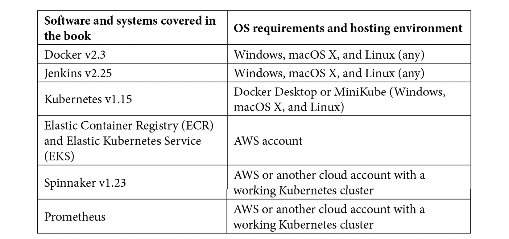
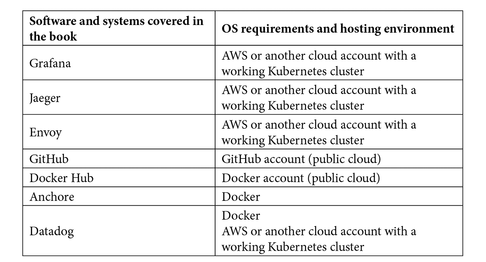

# 序言

软件工程团队正在迅速采用容器来打包和部署他们的软件。容器提供了一个平台无关的体验，使你能够在各种操作系统镜像下运行应用，并且可以在本地部署、数据中心以及云端部署。为了支持基于容器的应用，供应商们开发了各种各样的工具，从 Docker 和 Google 的 Kubernetes 项目，到 Lyft 的 Envoy 服务网格和 Netflix 的 Spinnaker。不论你是在软件开发、托管和基础设施方面工作，还是在构建 DevOps 流水线，你都需要广泛且深入地理解许多概念，才能有效地管理基于容器的环境。

在 *Docker for Developers* 中，我们将从 Docker 本地开发容器基础开始，然后转向使用 AWS 部署生产级、云托管系统。如果你有兴趣了解容器编排、部署、监控和安全性等内容，那么我们认为你会喜欢本书。

# 本书适合谁阅读

*Docker for Developers* 面向那些希望学习容器基础并在此基础上进一步了解如何在生产环境中使用容器的工程师和 DevOps 人员。本书通过一系列逐步更复杂的部署，展示了 Docker 应用如何通过 CI/CD 流水线进行部署，并在生产级别、云托管环境中进行管理。在处理本书的主题时，具备基本的容器知识将有所帮助，但并非必要。假定本书的读者熟悉 Linux、命令行工具的使用，以及基本的软件工程概念，如版本控制和 Git 的使用。

# 本书内容简介

*第一章*，*Docker 简介*，介绍了 Docker 的一些背景知识，容器及其目的的概述，并为读者提供了本书将讨论的主题的简介。

*第二章*，*使用 VirtualBox 和 Docker 容器进行开发*，引导读者通过本地虚拟机进行开发，并与使用 Docker 进行容器化开发项目进行比较。

*第三章*，*通过 Docker Hub 分享容器*，向读者介绍 Docker Hub 和预构建容器。接下来，我们将探讨构建专业容器的过程。

*第四章*，*使用容器构建系统*，探讨了更复杂的情况，其中多个容器需要共同工作，形成一个完整的系统。此外，我们还将为读者提供 Docker Compose 的概述。

*第五章*，*在生产环境中部署和运行容器的替代方案*，帮助读者理解在生产环境中运行容器的选择范围，包括云选项、本地部署和混合解决方案。

*第六章*，*使用 Docker Compose 部署应用程序*，讨论了如何在单个主机上使用 Docker Compose 部署生产应用程序，并处理日志记录和监控，同时分析这种简单配置的优缺点。

*第七章*，*使用 Jenkins 进行持续部署*，展示了如何使用 Jenkins 进行**持续集成**（**CI**）和**持续部署**（**CD**）容器，使用 Jenkinsfile 和多个开发分支。

*第十八章*，*将 Docker 应用部署到 Kubernetes*，探讨了 Kubernetes 的概念、云分发选项，并展示了如何创建 Amazon Web Services **弹性 Kubernetes 服务**（**EKS**）集群，将 Docker 应用程序部署到 Kubernetes。

*第九章*，*使用 Spinnaker 进行云原生持续部署*，在 CI/CD 的基础上，通过将 Netflix 的 Spinnaker 与 Kubernetes 集成并查看自动化测试，进一步发展了相关技能。

*第十章*，*使用 Prometheus、Grafana 和 Jaeger 监控 Docker*，解释了如何使用 AWS CloudWatch、Prometheus 和 Grafana 监控基于容器的应用程序。我们介绍了 OpenTracing API，并使用 Jaeger 实现它。

*第十一章*，*扩展和负载测试 Docker 应用程序*，探讨了如何通过 Kubernetes 扩展基于 Docker 的应用程序。它介绍了服务网格的概念，并展示了如何使用 Envoy 实现一个简单的服务网格，集成负载均衡、高级流量路由和过滤，包括使用断路器模式。最后，我们展示了如何使用 k6.io 进行负载测试，以证明我们的应用程序能够扩展。

*第十二章*，*容器安全简介*，引导读者了解基本的容器安全概念，包括虚拟化和虚拟机监控程序安全模型的工作原理。

*第十三章*，*Docker 安全基础和最佳实践*，在上一章的基础上深入探讨 Docker 和安全组件。包括对 Docker 命令及其安全影响的比较。

*第十四章*，*高级 Docker 安全——秘密、秘密命令、标签和标识*，涵盖了密码等秘密主题，以及如何在基于容器的环境中安全使用它们。读者还将了解标签和标识的最佳实践。

*第十五章*，*扫描、监控和使用第三方工具*，在从其他章节获得的日志记录和监控技能基础上，重新聚焦于这些元素的安全性。在这里，我们还讨论了 AWS、Azure 和 GCP 的用户可以使用哪些选项，以及如何使用 Anchore 扫描容器中的安全问题。

*第十六章*，*结论——旅程的结束，但不是终点*，通过回顾我们到目前为止学到的内容来结束本书。最后，我们提供了一些建议，帮助读者进一步探索基于容器的项目。内容包括将 Netflix Chaos Monkey 添加到 CI/CD 流水线中，或在容器中运行 Metasploit。

# 要充分利用本书

你需要一台能够运行 Docker 的 Windows、Mac 或 Linux 工作站。如果可能，应该使用最新版本。此外，为了完成任何基于云的项目，你需要设置一个云服务提供商的账户。本书示例使用的是**亚马逊云服务**（**AWS**），虽然你也可以将许多内容适配到其他云提供商提供的服务：



虽然我们没有明确演示如何将本书中列出的项目部署到 Microsoft Azure 或 Google Cloud Platform，但如果你希望探索这些云平台上可用的某些安全功能，或者尝试在其中运行现有项目，你需要为每个提供商创建一个账户。

**如果你使用的是本书的数字版本，我们建议你自己输入代码，或通过 GitHub 仓库（下一节提供链接）访问代码。这样做将帮助你避免与复制粘贴代码相关的潜在错误。**

# 下载示例代码文件

你可以从你的账户在[www.packt.com](http://www.packt.com)下载本书的示例代码文件。如果你是从其他地方购买的本书，你可以访问[www.packtpub.com/support](http://www.packtpub.com/support)并注册，文件将直接发送到你的邮箱。

你可以按照以下步骤下载代码文件：

1.  登录或注册[www.packt.com](http://www.packt.com)。

1.  选择**支持**标签。

1.  点击**代码下载**。

1.  在**搜索**框中输入书名，并按照屏幕上的指示操作。

文件下载完成后，请确保使用以下最新版本的软件解压或提取文件夹：

+   WinRAR/7-Zip for Windows

+   Zipeg/iZip/UnRarX for Mac

+   7-Zip/PeaZip for Linux

本书的代码包也托管在 GitHub 上，链接为 [`github.com/PacktPublishing/Docker-for-Developers`](https://github.com/PacktPublishing/Docker-for-Developers)。如果代码有更新，更新会直接发布到现有的 GitHub 仓库中。

我们还提供其他代码包，来自我们丰富的书籍和视频目录，网址为 [`github.com/PacktPublishing/`](https://github.com/PacktPublishing/)。快来看看吧！

# Code in Action

本书的“Code in Action”视频可以在 [`bit.ly/3kDmrtq`](https://bit.ly/3kDmrtq) 上观看。

# 下载彩色图片

我们还提供了包含本书所用截图/图表彩色图片的 PDF 文件。你可以在此下载：[`www.packtpub.com/sites/default/files/downloads/9781789536058_ColorImages.pdf`](http://www.packtpub.com/sites/default/files/downloads/9781789536058_ColorImages.pdf)。

# 使用的约定

本书中使用了多种文本约定。

`文本中的代码`：表示文本中的代码词汇、容器名称、文件夹名称、文件名、文件扩展名、路径名、虚拟 URL 和用户输入。这里有一个例子：“这个文件需要添加到主机的`conf.d`目录中。”

一块代码或 `Dockerfile` 设置如下：

```
FROM ubuntu:bionic
RUN apt-get -qq update && \
apt-get -qq install -y nodejs npm > /dev/null
RUN mkdir -p /app/public /app/server
COPY src/package.json* /app
WORKDIR /app
RUN npm -s install
```

当我们希望你注意代码块中特定部分时，相关行或项会以粗体显示：

```
FROM alpine:20191114
RUN apk update && \
apk add nodejs nodejs-npm
RUN addgroup -S app && adduser -S -G app app
RUN mkdir -p /app/public /app/server
ADD src/package.json* /app/
```

任何命令行输入或输出都以以下方式编写：

```
$ cp docker_daemon.yaml  /path/to/conf.d/
$ vim /path/to/conf.d/conf.yaml
```

**粗体**：表示新术语、重要词汇或屏幕上看到的文字。例如，菜单或对话框中的文字会以这样的方式出现在文本中。这里有一个例子：“你可以通过点击**立即获取**按钮来实现此操作，按钮位于 Azure Marketplace 网站上。”

提示或重要说明

以这种方式显示。

# 联系我们

我们欢迎读者的反馈。

**一般反馈**：如果你对本书的任何方面有疑问，请在邮件主题中提到书名，并发送邮件至 customercare@packtpub.com。

**勘误表**：尽管我们已尽最大努力确保内容的准确性，但难免会出现错误。如果你在本书中发现错误，感谢你向我们报告。请访问 [www.packtpub.com/support/errata](http://www.packtpub.com/support/errata)，选择你的书籍，点击“勘误表提交表单”链接并填写相关信息。

**盗版**：如果你在互联网上发现任何我们作品的非法复制品，感谢你提供该地址或网站名称。请通过 copyright@packt.com 联系我们，并附上相关内容的链接。

**如果你有兴趣成为作者**：如果你在某个领域具有专业知识，并且有意撰写或参与撰写书籍，请访问 [authors.packtpub.com](http://authors.packtpub.com)。

# 评论

请留下评论。在您阅读并使用本书之后，为什么不在您购买本书的网站上留下评论呢？潜在的读者可以看到并参考您的公正意见来做出购买决策，我们 Packt 可以了解您对我们产品的看法，我们的作者也可以看到您对他们书籍的反馈。谢谢！

欲了解更多关于 Packt 的信息，请访问 [packt.com](http://packt.com)。
