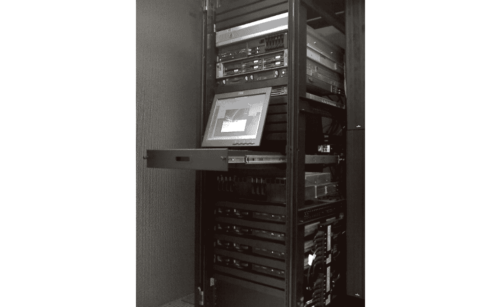
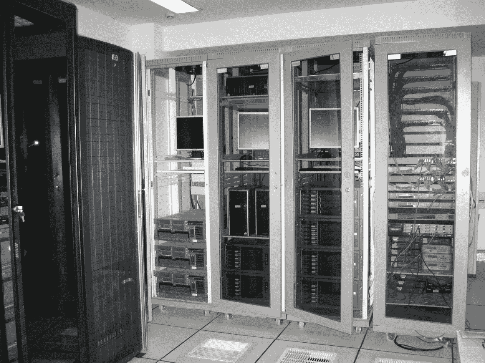
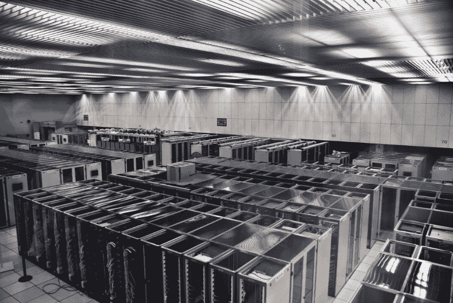
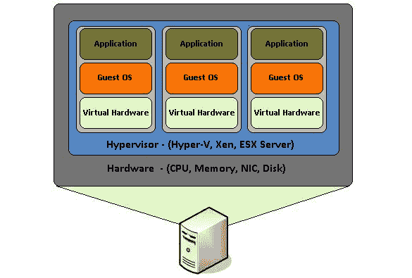
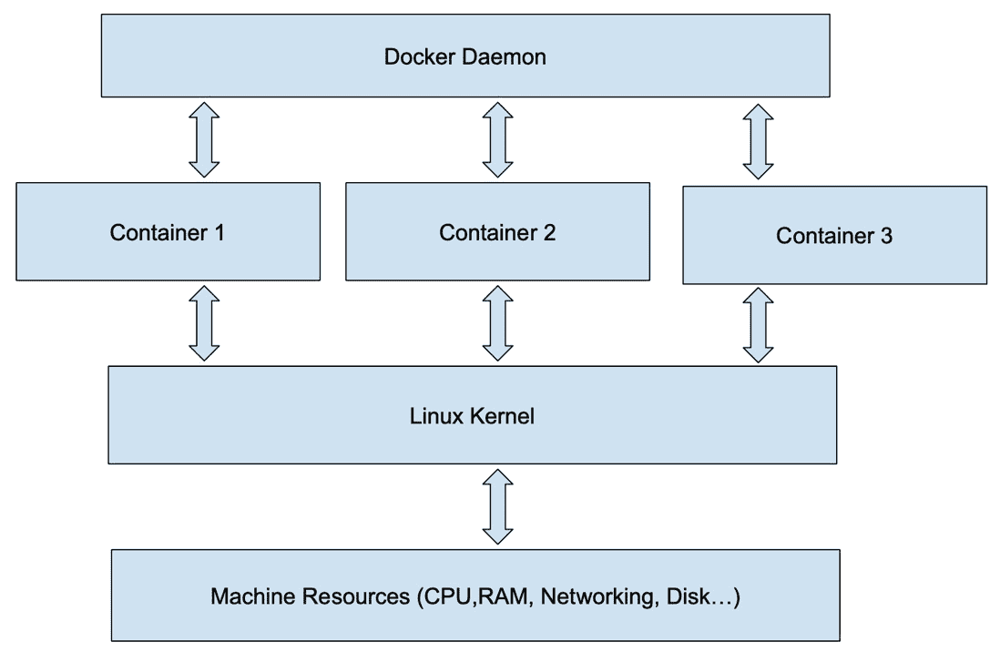

# 第一章：Docker 简介

Docker 是一种技术，允许将整个应用程序及其环境封装在各个容器中。当在一台机器上运行这些容器的多个版本时，它们彼此之间被沙盒化，就像在各自的专用机器上运行一样。

Docker 是开源的，非常适合在容器中运行 Linux，并且有许多开源组件可以帮助构建复杂的系统。它是过去十年甚至更长时间用于托管和后端开发技术的逻辑发展。这一发展经历了从物理托管到逻辑托管的转变，并受到多个需求的驱动。这些需求包括可靠性、可达性、可扩展性和安全性。

本书分为三个部分。第一部分是 Docker 的介绍，重点介绍本地开发。第二部分描述了测试、部署和扩展应用程序的方法论。第三部分详细讨论了使用基于容器的设计时的安全性。

在本章中，我们将回顾托管和后端解决方案的历史，重点讲解 Docker 如何成为广泛使用的技术。

本章将涵盖以下主题：

+   托管服务的起源

+   托管服务类型 – 共置托管

+   托管服务类型 – 自托管

+   数据中心的优势

+   虚拟化是如何工作的

+   数据中心的电力需求

+   虚拟化如何成为数据中心的解决方案以及云计算的发明

+   容器如何为数据中心和托管服务带来更大的优势

# Docker 的驱动因素

托管服务的种类最初仅限于自托管服务器、共置服务器托管和共享托管。1994 年和 1995 年，Best Internet Communications 从零起步，在一对 Pentium 服务器上托管超过 18,000 个网站，这些服务器当时是最强大的服务器。Best 还通过共置提供了专用服务器托管、专用宽带连接以及高端优质服务。

Best 托管的大多数网站都是共享托管类型。这些网站共享相同的服务器、相同的硬盘、相同的文件系统、相同的内存、相同的 CPU、相同的网络连接等。

对于这些网站中的任何一个网站被 Slashdotted（即某个非常流行的网站链接到它）并不罕见。这会导致其中一个大约 18,000 个网站的流量激增，而其他网站的性能受到影响。随着网站质量的提高并且对资源的需求增加，它们的管理员通常会转向专用的共置托管或自托管。

## 共置托管

在共置托管中，客户租用一个位于更大托管设施（数据中心）内的安全笼子：

图 1.1 – 典型的服务器机架，常见于共置托管

客户可以安装和管理自己选择的机器。一些联合托管设施提供额外收费的远程操作服务，客户可以拨打托管公司电话，由公司的工程师执行客户要求的操作。机架被锁定，防止其他客户访问其他客户的设备。

## 自托管

通过自托管，客户可以在自己选择的物理位置购买一个全时专用的宽带风格连接：

图 1.2 – 印度铁路 139 服务器机房（自托管）

客户最终建立了自己的一种数据中心，并在本地安装和管理服务器及其他设备。

## 数据中心

专业数据中心的好处是多方面的，最终的趋势是，所有拥有互联网存在的公司中，只有少数几家公司提供数据中心服务，剩下的公司则支付租金来使用专用、共享或高端托管服务。专业数据中心提供丰富的互联网连接（多个提供商、更快的连接），清洁电力，提供 24/7/365 全天候运行的电池备份电力，在长时间停电或断电的情况下提供备用发电机电力，灭火系统，适合设备正常工作温度的控制气候，多个物理位置，专业管理的**网络操作中心**（**NOC**）和技术支持，以及通过保安、摄像头、指纹、手印和/或视网膜扫描仪提供的安全保障：

图 1.3 – 欧洲核子研究中心（瑞士）服务器机房

最终建造和运营大多数数据中心的公司包括 Google（Google Cloud Platform）、Microsoft（Azure）、Amazon（**Amazon Web Services**（**AWS**））、Yahoo!（曾经）以及一些较小的参与者，包括精品托管公司、区域托管公司和需要比托管公司提供更高安全性的公司（例如银行、金融机构、政府等）。

亚马逊对数据中心有独特的需求。作为全球最大的在线零售商之一，同时也是全球最大的 数据中心开发商/所有者，它们所需的服务器数量、正常运行时间、安全性和覆盖范围促使它们在全国范围内以及全球范围内建设数据中心。

Google 对数据中心也有独特的需求。作为世界上最大的搜索引擎和广告公司，为了保持可访问性，Google 需要在尽可能多的物理位置部署服务器。为了保持高速，Google 需要大量服务器——至少在每个地理位置都有足够的服务器用于分布式搜索索引处理。

像 RackSpace 和 Level 3 这样的公司最初是作为数据中心提供商建立的。它们的专长包括共同托管设施、专用服务器托管、远程服务、网络运营中心（NOCs）、全国性专用光纤骨干网、干净和抗停电电力以及与 AT&T、Verizon 和 Comcast 等其他网络的高度连接。它们发现自己拥有足够的基础设施来跟随虚拟化趋势，并开始提供这些云服务。

提供数据中心服务的最高成本，也传递给客户，最初是带宽。提供商按兆比特支付带宽费用，再加上每月维护物理连接的成本。随着提供商在全球范围内建立自己的私有基础设施来传输数据，带宽费用变成了一种固定费用，对总带宽使用量的大部分提供了优惠。这使得带宽的价格降低到了对托管而言变得微不足道的程度。

这些公司最终建立了一个专门提供专用托管服务的综合基础设施。事实证明，这种基础设施也非常适合虚拟化产品的提供。

# 使用虚拟化来节约资源使用

虚拟化是将物理机的一部分作为逻辑或虚拟机暴露出来的过程，其行为类似于真实机器，支持安装整个操作系统、文件系统以及运行在操作系统上的软件。例如，一台拥有 64 GB RAM 和 4 个 CPU 的机器可以运行虚拟化软件，伪装成四台各有 16 GB RAM 和 1 个 CPU 的机器。这台机器可以运行四个 Linux 实例。

虚拟化并非一个新概念，IBM 在 1960 年代早期就已实施。它很可能在 1980 年代普及，当时它被用于运行 MS-DOS，后来是 Windows，如原始的 Apple **Macintosh** (**Mac**)和 Unix 计算机，如 Sun 和 Silicon Graphics 工作站。

最初的虚拟化软件利用当时 CPU 的可用特性，但通常仅在专业 Unix 工作站的 68000 系列或自定义 CPU 上模拟了 x86 的指令集。SoftPC 是 1980 年代最受欢迎的产品之一。

SoftPC 运行速度相当慢，但能够在 Mac 电脑上运行 Windows 或 MS-DOS 应用程序，使得这些机器在商业和教育环境中得以应用。用户可以运行 Microsoft Office，而不是将所有 Mac 上的程序添加 Microsoft Office 兼容性，以支持 Windows/MS-DOS 用户和 Mac 用户之间的文件交换。

人们看到了它的实际效果，并意识到它的价值。Windows 是家庭和商务中的主流操作系统，为了适应 Windows 在企业环境中的使用，需要类似 SoftPC 的东西。SoftPC 的问题在于它是纯软件模拟，在实际使用中速度非常慢。虚拟化在性能上优于模拟！

整个公司围绕提供消费级或商业虚拟化解决方案而成立。VMWare 成立于 1998 年，是最早的此类公司之一。

Innotek 公司开发了 VirtualBox，并于 2007 年将其发布为开源软件，随后于 2008 年被 Sun Microsystems 收购。然后，Sun 在 2010 年被 Oracle 收购。Parallels 是一个为 Mac 提供的虚拟化解决方案，于 2004 年开发，并在 2006 年成为主流。

虚拟化的价值促使芯片制造商逐渐增加对虚拟化的 CPU 支持。通过 CPU 支持，基于 x86 的系统可以运行虚拟化的机器或软件，接近本地速度，从而更加可接受。这反过来促使工作站公司（如苹果、Sun 和硅谷图形公司）转向 x86 CPU。

虚拟化软件的一个关键组件是虚拟机监控程序（hypervisor）。虚拟机监控程序将虚拟机呈现给所选操作系统，然后管理虚拟机的资源和执行。虚拟机本身是可配置的，至少在内存大小、逻辑 CPU 核心数、显卡内存、作为虚拟硬盘驱动器的主机操作系统磁盘文件、虚拟 CD-ROM 驱动器中的 CD-ROM 挂载和卸载等方面是可配置的。虚拟机监控程序确保这些资源确实可用，并且不会让某个虚拟机占用主机的所有资源，导致其他虚拟机无法获得所需资源。

对于企业来说，要求有所不同。与通过像 Linux 这样的通用主机操作系统提供虚拟机不同，整个操作系统本身可以专门优化为虚拟机监控程序。VMWare 于 2004 年推出了其**Elastic Sky X 集成**（**ESXi**）操作系统。剑桥大学计算机实验室在 1990 年代末开发了 Xen 虚拟机监控程序，首个稳定版本于 2003 年发布。Xen 最初是亚马逊为其弹性计算云（Elastic Compute Cloud）提供服务时使用的虚拟机监控程序，后来转向使用 KVM。

KVM 是一个由 Linux 内核直接支持的虚拟化解决方案。内核可以充当 KVM 下的虚拟机监控程序。KVM 还可以模拟与主机本地 CPU 不同的处理器，通常是 x86。这使得 KVM 可以用于模拟像 Raspberry Pi 这样的目标平台。

扩展专用托管网站可能会遇到问题。虽然可以通过升级到更大、更强大的服务器来应对不断增长的流量和服务，但到了一定时点，就没有更大或更强的服务器了！从这个点起，要实现扩展就需要将服务分布到多个服务器上。

# 应对日益增加的电力需求

虚拟化趋势催生了对新型服务器的需求，这些服务器被部署在数据中心。客户可能曾租用或安装自己的专用服务器，配备 16GB 的内存，而虚拟服务器提供商则可以租用 128GB 内存服务器的一部分，并将该服务器与多个客户共享。这些更大的服务器需要更多的 CPU 核心，以确保虚拟服务器拥有合理的计算能力。

将这些专用服务器放入与较小且功能较弱的专用服务器相同的空间，带来了新的挑战：电力问题。专用服务器可能只需要 400 瓦的电力，而云服务器可能需要 1600 瓦；电力需求将是原来的四倍。除了机器本身的电力需求外，还需要更多的电力来驱动空调冷却机器。

电力成本要求改变了专用托管的计算方式，因此带宽定价几乎是免费的，而服务器的电力需求则以非常高的价格收费。

为了帮助降低电力成本，数据中心已开始自给自足，提供一部分电力。太阳能电池板、靠近能够驱动涡轮机的河流建设、风力涡轮机，以及建设在气候寒冷或凉爽地区都是一些常见的方法。数据中心确实使用电池作为备用电源，同时也使用柴油发电机。

能效是降低电力成本的另一种方式。使用低功率的 CPU 和其他计算机部件是实现这一目标的一种手段。CPU 制造商一直致力于生产低功耗的 CPU，供数据中心和笔记本电脑使用。

托管公司为每个共置机架提供 60 瓦的电源。如果需要超过 60 瓦的电力，可以支付额外费用，为机架增加额外的 60 瓦电力线路。你需要支付建设费用以及每月的电力使用费用。

在这些设施中托管对大多数客户来说是个问题。它需要购买物理机器和其他硬件，设计为提供服务所需的基础设施，时不时需要物理访问机架和硬件，以及可能出现的故障，这意味着停机时间。

服务的增长和流行要求具备可扩展性，或者需要更多、更强大的机器。可以重新利用旧机器，但它们占用空间且耗电。当现有机架填满，且需要更多服务器时，客户成本急剧上升。

下一步，解决这些麻烦的方法就是虚拟化，并在云端运行服务器和服务。

虚拟化和云计算

大多数客户不需要专用服务器。他们真正需要的是一个文件系统的安全性，只有他们的软件可以读取和写入，且 CPU 必须专门用于他们的目的，吞吐量和计算能力是可识别的，并按预期交付。

由像 AWS 这样的公司提供的虚拟服务器的吸引力，促使许多管理员远离专用服务器和自托管。AWS 不断扩展其产品，以便为虚拟主机提供更多价值，让客户受益于亚马逊开发人员的努力。

复制客户设计的基础设施以创建一个与实时/部署应用分开的测试环境相对便宜。随着服务的流行或当服务被**Slashdot**效应影响时，扩展服务变得更加容易。这个术语描述了当一个非常受欢迎的网站添加了另一个网站的链接，导致更多的流量涌向那个网站，甚至可能比该网站所能处理的流量还要多的现象。

虚拟化基础设施的设计和部署可以在你办公室的舒适环境中完成，无需亲自访问数据中心。如果需要横向扩展，只需启动额外的虚拟机实例。如果需要纵向扩展，只需启动一个更强大的虚拟机，并用它替换掉太慢或过小的虚拟机。

如果云托管设施的硬件发生故障，托管公司员工将安装新的硬件。这一过程对你，作为客户，完全透明。名为**Teleport**的功能允许托管公司将正在运行的虚拟机迁移到另一台物理机上，且不会中断服务。

除了虚拟服务器，托管公司还可以提供虚拟磁盘、弹性 IP、负载均衡器、DNS、备份解决方案等。虚拟磁盘非常方便，因为你可以通过简单地复制作为映像的文件来备份它们。你还可以从现有的虚拟磁盘启动新的实例，节省在虚拟机上安装操作系统所需的时间。

使用弹性 IP 和虚拟负载均衡器的能力，使得扩展性变得像点击鼠标一样简单。

你可以将弹性 IP 分配给任何虚拟实例或负载均衡器。如果实例被停止，可以将该 IP 重新分配给另一个实例。如果仅通过 DNS 来处理这一问题，DNS 在 ISP 的众多服务器上传播时可能会出现几天的延迟。负载均衡器允许你创建虚拟服务器集群，并在集群中的虚拟服务器之间平衡传入请求。你可以轻松地启动并添加额外的虚拟服务器到负载均衡器中，以便扩展。托管公司甚至可以提供软件触发器，当流量增加时自动启动并添加新的服务器，而当流量减少时则自动关闭并移除这些服务器。

图 1.4 – 硬件虚拟化

AWS 启用公众访问时，当时流行的技术栈是 **LAMP**，即 **Linux、Apache、MySQL 和 PHP** 的缩写。典型的设置是在专用的 Linux 服务器上安装这四个软件包。AWS 提供了 RDS，或者等效的 MySQL 专用虚拟服务器，这使得 LAMP 应用程序能够实现卸载和扩展。AWS 还提供了虚拟负载均衡器，它是逻辑以太网交换机，用于在两个或更多的 Web 服务器之间负载平衡流量。AWS 还提供了域名托管和弹性 IP，因此站点的正常运行时间几乎可以是无限的。AWS 继续开发新的软件和服务，以造福其客户。

AWS 及其竞争对手提供了一种成本效益高且动态的方式来随着其受欢迎程度的增加而扩展互联网存在。价格结构在大多数提供商中是常见的。费用基于弹性负载均衡器的数量、虚拟服务器实例的数量、RAM 的大小、虚拟 CPU 的数量、持久存储的大小和带宽。此外，还有可选的附加服务可以增加费用。

虚拟服务器提供了物理服务器的优势，但代价是占用了主机机器上物理 RAM 的专用空间和运行该机器所需的功率。主机机器可能有 64 GB 的 RAM；它可以运行一些虚拟机的组合，所有虚拟机加起来使用掉这些 RAM——例如，四个 16 GB 的虚拟机、两个 32 GB 的虚拟机、两个 16 GB 和一个 32 GB 的虚拟机，依此类推。

虚拟机的一个风险是，当主机机器重启或发生故障时，所有托管在其上的虚拟机都会停止运行。

实现虚拟化的特性和虚拟化在数据中心应用时的限制使得容器化成为一种可行且优选的替代方案。

# 使用容器进一步优化数据中心资源

Docker 是一种巧妙利用操作系统级虚拟化支持的方式，它允许多个 Docker 容器在一台机器上运行。容器是容器镜像的运行实例。默认情况下，容器与主机机器以及彼此之间是隔离的。

容器可以被配置为暴露资源，例如网络端口，给主机网络（例如，互联网）或彼此之间。下图展示了容器在主机上的基本结构：

图 1.5 – Docker 容器化

容器与主机共享 Linux 内核，因此你无需像虚拟机那样在容器内安装完整的操作系统。容器由 Docker 守护进程管理，后者处理容器及其使用的资源的管理，以及镜像、网络、卷等。

虚拟服务器和容器之间一个重要的区别是，容器直接共享主机的资源，而虚拟服务器需要重复资源。例如，两个相同的容器使用主机的 RAM，而不是在启动虚拟机之前配置的 RAM 块。如果你需要限制容器的资源（如 CPU、内存、交换空间等），是可以做到的，但默认情况下，容器没有资源限制。

与虚拟服务器不同，你处理的是应用镜像，而不是虚拟磁盘。你可以复制镜像进行备份，但没有虚拟磁盘文件可以复制。这些应用镜像是基于其他容器逐步构建的。当你构建容器时，只有那些发生变化的应用镜像部分需要处理。

在设计使用容器的服务时，你不太可能在单个容器中安装很多组件。例如，在运行 LAMP 应用程序的虚拟机中，你可能会在一台虚拟机中安装 Apache、MySQL 和 PHP。而在为容器设计相同的 LAMP 应用时，你可能会将一个容器仅配置为 MySQL，另一个容器用于 Apache 和 PHP。然后，你可以通过运行额外的 Apache 和 PHP 容器，以及在集群配置中运行额外的 MySQL 实例来扩展你的应用程序。

如果我们考虑早前讨论的 LAMP 应用的容器化使用，我们可以将 MySQL 实现为专用容器，而将 Apache 和 PHP 放在另一个容器中；这一切都运行在主机的 Linux 内核之上。为了扩展 LAMP 应用程序，可以启动第二个、第三个、第四个等 Apache/PHP 容器，同样也适用于 MySQL 容器。MySQL 容器可以配置为主从操作。

如果主机操作系统不是基于 Linux 内核的，有两种选择。第一种选择是在主机上运行操作系统本地容器（例如，在 Windows 主机上运行 Windows 容器）。第二种选择是在主机上运行一个 Linux 虚拟机，并在该虚拟机中运行容器。

容器化对于托管公司及其客户来说是一个福音。与虚拟机不同，不再需要为每个容器分配固定数量的 RAM。物理机器的限制仅在于其资源，决定了它可以并发运行的容器数量。容器的定价模型可以帮助客户节省每月费用。因此，容器化是一个巨大的胜利。

在下一章中，我们将学习如何使用虚拟机和 Docker 在本地开发应用程序。稍后的章节中，我们将探讨如何将本地开发的软件部署到公开可访问的互联网/云基础设施。

# 总结

在本章中，我们看到 Docker 和容器化是自商业互联网开始以来，托管需求进化的自然结果。我们回顾了托管的历史以及我们如何发展到今天的托管配置。你现在应该对虚拟化和容器化之间的区别有了相当的理解。

在下一章中，我们将探讨 VirtualBox 和 Docker。这是一个很好的方式来探索虚拟机和 Docker 容器之间的区别。

# 进一步阅读

如果你想深入了解目前讨论的某些主题，请参考以下链接：

+   这个链接部分描述了谷歌搜索算法的实现：[`www.google.com/search/howsearchworks/`](https://www.google.com/search/howsearchworks/)

+   这个链接描述了谷歌的搜索基础设施：[`netvantagemarketing.com/blog/how-does-google-return-results-so-damn-fast/`](https://netvantagemarketing.com/blog/how-does-google-return-results-so-damn-fast/)

+   这个链接也描述了谷歌的搜索基础设施：[`www.ctl.io/centurylink-public-cloud/servers/`](https://www.ctl.io/centurylink-public-cloud/servers/)

+   这个链接描述了 IBM 早期的虚拟化支持技术：[`en.wikipedia.org/wiki/IBM_CP-40`](https://en.wikipedia.org/wiki/IBM_CP-40)

+   这个链接描述了一个旧程序，它模拟 PC 在非 Windows 主机上运行 Windows：[`en.wikipedia.org/wiki/SoftPC`](https://en.wikipedia.org/wiki/SoftPC)

+   这个链接提供了 VMWare 公司的介绍：[`en.wikipedia.org/wiki/VMware`](https://en.wikipedia.org/wiki/VMware)

+   这个链接描述了 Oracle 的 VirtualBox：[`en.wikipedia.org/wiki/VirtualBox`](https://en.wikipedia.org/wiki/VirtualBox)

+   这个链接介绍了 Parallels：[`en.wikipedia.org/wiki/Parallels_(company)`](https://en.wikipedia.org/wiki/Parallels_(company))

+   这个链接讨论了虚拟化和容器化中 Hypervisor 的作用：[`en.wikipedia.org/wiki/Hypervisor`](https://en.wikipedia.org/wiki/Hypervisor)

+   这个链接描述了 VMWare 专门为运行虚拟机设计的独立操作系统：[`en.wikipedia.org/wiki/VMware_ESXi`](https://en.wikipedia.org/wiki/VMware_ESXi)

+   这个链接描述了 Xen hypervisor：[`15anniversary.xenproject.org/#Intro`](https://15anniversary.xenproject.org/#Intro)

+   这个链接描述了亚马逊的 AWS 虚拟机：[`en.wikipedia.org/wiki/Amazon_Elastic_Compute_Cloud`](https://en.wikipedia.org/wiki/Amazon_Elastic_Compute_Cloud)

+   这个链接描述了支持虚拟化和容器化的内核特性：[`en.wikipedia.org/wiki/Kernel-based_Virtual_Machine`](https://en.wikipedia.org/wiki/Kernel-based_Virtual_Machine)

+   这个链接描述了如何使用 QEMU 在工作站上模拟树莓派：[`azeria-labs.com/emulate-raspberry-pi-with-qemu/`](https://azeria-labs.com/emulate-raspberry-pi-with-qemu/)
