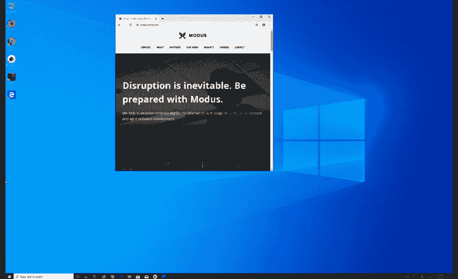
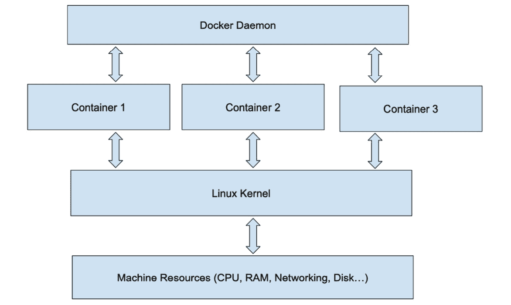

# 第二章：使用 VirtualBox 和 Docker 容器进行开发

在上一章中，我们介绍了虚拟化和容器化。在本章中，我们将演示如何使用软件，如 VirtualBox，创建虚拟机，并使用 Docker 创建容器。本章的重点是如何在工作站上使用这些技术进行开发。

开发人员在处理多个项目时，一个常见的问题是，随着时间的推移，他们会在工作站上安装大量目前不使用的软件。这可能会变得非常麻烦，甚至让开发人员不得不重装工作站的硬盘和操作系统。

VirtualBox 和 Docker 容器都可以用来解决这个问题。你安装的软件会保留在**虚拟机**或容器的文件系统中，与工作站的本地文件系统分开。如果你删除虚拟机或容器，其中安装的所有文件都会被删除——包括任何已安装的应用程序或开发软件。

开发人员面临的另一个问题是，工作在特定项目上时需要使用的软件版本。如果开发人员在一个使用 Node.js v12 的项目上工作，而另一个项目使用 Node.js v10，他们就无法在同一工作站上同时运行这两个项目，虽然切换 Node.js 的版本是可行的，但操作起来不太方便。使用虚拟机或容器就没有这个问题——你可以有一个运行 Node.js v12 的虚拟机，另一个运行 Node.js v10，并且同时运行这两个虚拟机。容器也类似，每个版本的 Node.js 可以对应一个容器。

当你需要模拟整个机器时，虚拟化非常有用。如果你的生产系统是虚拟机或物理机，虚拟机是一个很好的方式来模拟该环境。虚拟化非常适合在工作站上运行完整的替代操作系统；也就是说，你可以在 macOS 或 Linux 工作站上通过虚拟机运行 Windows 10。

本章将涵盖以下内容：

+   主机文件系统污染问题

+   使用 VirtualBox 进行虚拟机操作

+   使用 Docker 容器

# 技术要求

本章的代码可以从以下链接下载：[`github.com/PacktPublishing/Docker-for-Developers/tree/master/chapter2`](https://github.com/PacktPublishing/Docker-for-Developers/tree/master/chapter2)

查看以下视频，看看代码的实际应用：

[`bit.ly/3gX9dFE`](https://bit.ly/3gX9dFE)

# 主机文件系统污染问题

虚拟化和容器化解决了开发人员面临的某些问题。将服务器类软件系统安装到工作站上没有太大意义——这种软件可以安装在虚拟机或 Docker 容器中。使用这种策略意味着你不必污染工作站的文件系统，不会出现软件版本冲突，并且你可以运行与工作站操作系统不同的操作系统。

污染问题是开发人员的一个实际关注点——他们最终会得到很多不常用的软件或安装的软件，这些软件占用了系统资源。我们将学习使用虚拟化或容器化的方式来安装这些软件，而不是直接安装到宿主的文件系统上。

# 使用 VirtualBox 进行虚拟机操作

在工作站上运行虚拟机有几个选项。包括 Parallels（适用于 macOS）、KVM/QEMU（适用于 Linux）、VMware（商业版本，支持多个宿主操作系统）和 VirtualBox（一个 Oracle 产品）。我们将使用 VirtualBox，因为它是开源的，且可以免费使用。它还具有跨平台特性，你可以在 Linux、Windows、macOS 和其他宿主操作系统上运行 VirtualBox 和虚拟机。

## 虚拟化简介

虚拟化利用工作站 CPU 的特殊指令和功能，在宿主机上运行一个通用的伪计算机系统（虚拟机）。在这个虚拟机内，你可以安装各种操作系统，包括不同版本的 Windows Server、Linux、BSD 等等。在虚拟机中运行的操作系统称为来宾操作系统；在工作站上运行的操作系统称为宿主操作系统。

当来宾操作系统执行代码时，它需要进行磁盘和网络访问，执行特权 CPU 指令，并且访问与宿主机共享的资源。虚拟化软件有效地拦截这些来宾操作系统的访问，并将它们转换为宿主操作系统的调用。因此，虚拟机中运行的代码大部分时间都能以全速本地 CPU 速度运行，直到执行这些共享访问的拦截——然后就会有一些额外的开销用于转换为宿主访问。

在安装操作系统之前，可以配置来宾虚拟机。你可以设置使用多少 RAM、一个或多个虚拟磁盘、一个或多个以太网控制器、显卡、要插入虚拟光驱的 ISO 文件（安装介质）等。

通常，你需要为你的来宾操作系统以及你计划在来宾系统内使用的应用程序，设置适当的 RAM、磁盘空间和虚拟 CPU 核心数。例如，如果你要在虚拟机中运行 Windows，你可能希望分配至少 2 个虚拟 CPU 核心、8GB 的 RAM 和 32GB 的磁盘空间。如果你计划在虚拟机中运行一个需要超过 8GB 内存的应用程序，你需要分配更多的 RAM；如果该应用程序需要大量的磁盘空间，你则需要分配更多的磁盘空间。

## 创建虚拟机

要启动虚拟机，请使用 VirtualBox 程序（用户界面）。当虚拟机启动时，它的表现就像一台物理 PC——对于安装媒体上的安装程序而言，它就是一台物理 PC。安装程序将像在新 PC 上安装或重新安装操作系统一样工作。

虚拟机可以在工作站的桌面上以窗口的形式展示其控制台或桌面，或者它可以是**无头**的。无头虚拟机类似于服务器机器——你通过 FTP、SSH 等方式访问它。你在不需要操作系统控制台或图形界面的情况下，使用无头虚拟机。无头机器提供你可以远程访问的所有服务器服务。

你从命令行启动无头虚拟机，而不是通过 VirtualBox 用户界面程序。这是通过`VBoxManage`命令来完成的，相关文档可以在这里找到：[`www.virtualbox.org/manual/ch08.html`](https://www.virtualbox.org/manual/ch08.html)。不过，你更有可能使用带图形用户界面的来宾操作系统。

一个典型的无头虚拟机可能会用于运行**LAMP**应用程序——**Linux, Apache, MySQL 和 PHP**都被整齐地包含在虚拟机内，而不是工作站的文件系统中。你可以通过启动一个无头虚拟机来运行 MySQL，然后启动两个无头虚拟机，分别运行 HTTP 服务器和 PHP 代码，从而模拟一个可扩展的 LAMP 应用程序。

一个典型的图形/桌面虚拟机可能会被用来在你的 Mac 电脑上以窗口形式运行 Windows，在 Mac 电脑上以窗口形式运行 Linux，或在 Windows 机器上以窗口形式运行 Linux，等等。如果你喜欢使用 Linux，但需要运行 Windows 程序，使用虚拟机是一个不错的选择。

非无头安装将提供一些显示选项。整个桌面可以在主机的桌面上以窗口形式显示。这是默认的显示模式。该窗口可以像桌面上的其他窗口一样调整大小。然而，在窗口内部，来宾系统的桌面不会自动调整大小，直到你在来宾系统中安装 VirtualBox 增强功能。

来宾窗口可以设置为全屏模式。这样，来宾操作系统看起来就像是原生运行在工作站上一样。如果你正在运行 macOS，你可以使用 macOS 手势切换桌面，并在全屏的 Windows 和全屏的 macOS 桌面之间来回切换。

对于某些主机操作系统，来宾操作系统可以进入无缝模式，在这种模式下，桌面完全不显示，但虚拟机中运行的任何应用程序会将其窗口显示在主机桌面之上。

结果是虚拟机应用程序窗口和主机操作系统应用程序菜单混合显示在桌面上，如下图所示：



图 2.1 – 在 Linux 主机上的 VirtualBox 中全屏运行 Microsoft Windows 10

如你所见，你可以在虚拟机中运行并管理完整的 Windows 安装，并可以访问主机上的文件和目录，如果你为主机设置了 Samba 文件共享。

顺便提一下，本书的部分内容是使用 Microsoft Word 365 编写的，该程序在 Linux 主机上的 Windows 10 虚拟机中运行。接下来的 Docker 示例是在 Linux 主机上执行的。这是一个很好的例子，说明为什么要运行虚拟机。

注意：

微软允许你购买 Windows 10 许可证，并使用它在虚拟机中激活 Windows 10。

苹果只允许在苹果硬件上运行 macOS 虚拟机。在运行 Windows 或 Linux 的 PC 上运行 macOS 虚拟机违反了它们的许可条款。

Linux 和大多数 BSD 变种通常可以在 PC 或虚拟机中免费使用。

## 来宾增强功能

对于 Windows 和 Linux 来宾操作系统，你可以安装驱动程序，完全将来宾操作系统与主机操作系统集成。这些驱动程序被称为来宾增强功能，你可以从 VirtualBox 网站下载：[`virtualbox.org`](https://virtualbox.org)。它们会像你为 Windows 或 Linux 安装的任何程序一样，安装在虚拟机中。与主机的集成非常有用。

来宾增强功能中的显示驱动程序允许你使用主机屏幕的完整分辨率，并且如果你以窗口模式运行（来宾桌面在主机桌面窗口中），调整窗口大小会导致来宾桌面自动调整大小以适应新窗口大小。如果你想使用无缝窗口功能，则必须安装来宾显示驱动程序。

这些增强功能提供了鼠标指针集成功能。这样你可以自由地在物理屏幕之间移动光标，从来宾窗口切换到主机窗口。否则，鼠标会被虚拟机捕获，以便管理指针事件。

客户端附加功能还可以像共享一个剪贴板一样，分享主机和客户机的剪贴板。你可以在 macOS 主机应用程序中选择并复制文本，然后将复制的文本粘贴到虚拟机中运行的 Windows 应用程序里。

对于 Linux 客户机，附加功能允许你共享主机的文件系统目录和文件。这尤其有用，因为你可以使用主机操作系统的工具和软件来开发主机可见的文件。例如，你可以在 macOS 机器上为你的项目工作目录创建一个共享文件夹。你可以使用 macOS 编辑器来编辑项目中的文件，而在虚拟机中，你可以运行 Linux 本地编译器或工具来执行你的项目。现在我们开始安装 VirtualBox。

## 安装 VirtualBox

VirtualBox 的网址是 [`www.virtualbox.org/`](https://www.virtualbox.org/)。在这里，你可以找到不同主机平台（工作站操作系统）的文档和下载内容，附加组件，查看截图，查看与 VirtualBox 兼容的推荐第三方软件等。

### Windows 安装说明

要安装 Windows 版本，前往 VirtualBox 网站的下载页面，下载最新版本的安装程序，然后在下载完成后双击它。接着，按照屏幕上的指示操作。

### macOS 安装说明

对于 macOS 安装，你可以使用 Homebrew 或从 VirtualBox 网站下载 `.dmg` 安装文件并从中安装。使用 Homebrew，你只需输入一条命令：

```
$ brew cask install virtualbox
```

Homebrew ([`brew.sh/`](https://brew.sh/)) 是 macOS 缺失的包管理器。它是一个命令行系统，用于从 Homebrew 的仓库中安装软件。它是一个极好的工具，可以增强 macOS 随附的应用软件。这些仓库中的软件更新频率远高于苹果的软件更新。

### Linux 安装说明

在 Linux 上安装 VirtualBox 的说明会根据你在工作站上使用的 Linux 发行版而有所不同。由于有很多不同的发行版，我们将以 Ubuntu 为例，给你一个大致的安装步骤，并为你提供安装 VirtualBox 的其他发行版（如 Arch Linux、Fedora 等）的有用提示。

对于 Ubuntu，你可以从 Ubuntu 软件中心安装 VirtualBox，或者从 VirtualBox 网站下载 `.deb` 文件，或使用 `apt`：

```
$ sudo apt install virtualbox
```

对于 Arch Linux 及其变种，你可以按照 Arch 维基网站上的说明操作：[`wiki.archlinux.org/index.php/VirtualBox`](https://wiki.archlinux.org/index.php/VirtualBox)。

对于 Fedora 或其他基于 RPM 的 Linux 发行版，请按照 VirtualBox 网站上的说明操作：[`virtualbox.org`](https://virtualbox.org)。现在我们来了解如何使用 Docker 容器。

# 使用 Docker 容器

Docker 通常用于创建容器，这些容器运行你的应用程序，就像在无头虚拟机中一样。实际上，在非 Linux 系统上，Docker 实际上是在虚拟机中运行 Linux，并在该虚拟机中运行你的容器。这是透明进行的。

注意：

你不必自己安装 VirtualBox。Docker 的打包方式使得它能够安装或使用操作系统中已经存在的虚拟化技术（例如虚拟机监控器）。

## 容器简介

Docker 的早期版本安装了 VirtualBox 来创建虚拟机，但操作系统中实现的更新虚拟化技术使得 Docker 可以使用这些技术，而不必依赖 VirtualBox。

Docker 为 Linux 容器而设计，期望宿主操作系统或虚拟机运行 Linux。容器与宿主共享 Linux 内核。Docker 也可以用于运行 Windows 原生容器，方式与 Linux 容器类似。Windows 内核在宿主和客户端之间共享。为了讨论方便，我们将重点讨论 Linux 宿主和客户端。

Docker 容器通常用于实现类似无头虚拟机的功能。每个应用程序可能创建一个容器，而使用虚拟机的成本较高——你必须为虚拟机保留固定的 RAM 和磁盘空间。在一台 16GB RAM 的 MacBook Pro 上，你大致可以同时运行三个 4GB RAM 的虚拟机。但你还是需要为宿主操作系统保留一些内存。给宿主或虚拟机分配不足的内存会导致它们交换数据，这会极大地降低性能：



图 2.2 – Docker 容器示意图

容器通过宿主操作系统的特性与宿主操作系统分隔开。容器使用 Linux 内核的命名空间功能 ([`manpages.debian.org/stretch/manpages/namespaces.7.en.html`](https://manpages.debian.org/stretch/manpages/namespaces.7.en.html)) 来将容器内的代码相互隔离，并使用 cgroups（参见 [`manpages.debian.org/stretch/manpages/cgroups.7.en.html`](https://manpages.debian.org/stretch/manpages/cgroups.7.en.html)）来限制容器可以使用的资源（包括 RAM 和 CPU）。容器还使用 Linux 的 `unionfs` ([`manpages.debian.org/buster/unionfs-fuse/unionfs.8.en.html`](https://manpages.debian.org/buster/unionfs-fuse/unionfs.8.en.html)) 文件系统来实现容器在 Docker 下运行时看到的分层文件系统。

从容器内部运行的应用程序的角度来看，容器是一个完整且专用的计算机；它与宿主操作系统没有直接的通信。

容器不需要为每个容器指定虚拟 CPU 数量或专用的 RAM 块。

你的限制仅在于容器所需的 RAM 和主机的 RAM 大小。

容器共享主机的 Linux 内核，而虚拟机则必须安装完整的操作系统！

你可以选择限制容器实例使用的资源，但这不是必须的。

主机资源可以与客容器共享。主机的网络可以与任何容器共享，但这仅对运行需要此功能的应用程序的容器有用。例如，要使用主机的 Bonjour 网络功能，客容器会使用主机的网络。

客户容器可能会将端口暴露给主机和任何可以访问主机的计算机。例如，运行 HTTP 服务器的容器可能会暴露端口 80，当访问主机的端口 80 时，容器会作出响应。

容器推动了微服务的概念。使用微服务架构的应用程序实现了一组可以相互通信并与主机通信的服务。这些服务的实现非常简单——仅需要包含支持服务所需的特定代码。微服务通常在一个源代码文件中实现，代码行数很少。

容器架构具有很高的可扩展性。你可以运行多个容器来运行相同的应用程序（横向扩展），还可以为容器系统分配更多的主机资源（纵向扩展）。例如，你可以创建一个运行 HTTP 服务器的容器；你可以通过实例化任意数量的这些容器来创建一个服务器农场。

## 使用 Docker 进行开发

使用 Docker 进行开发的一个重要理由是，你不需要在主机上安装除了 Docker 本身以外的任何程序来启用开发。例如，你可以在容器中运行 Apache，而无需在工作站上安装它。

你还可以在容器中混合和匹配不同的软件版本。例如，一个微服务架构可能需要一个容器使用 Node.js 版本 8，另一个容器使用 Node.js 版本 10。这在单个主机上显然是有问题的，但在使用 Docker 时非常简单。一个容器安装并运行版本 8，另一个容器安装并运行版本 10。

在开发过程中，你可以将项目的开发文件与容器共享，这样当你编辑这些文件时，容器就会看到文件的变化。

每个容器都有自己的一组全局环境变量。通常的做法是使用环境变量来配置应用程序，而不是在容器内的源代码或配置文件中进行配置。

当你准备部署或发布一个容器时，可以将其推送到容器托管服务，如 Docker Hub。事实上，Docker Hub 是一个非常好的资源，里面有许多现成的容器，可以帮助你进行项目开发。比如 MongoDB、Node.js（多个版本）、Apache 等等，都有预先制作好的容器镜像。

容器构建实际上是面向对象的。你从一个基础容器继承，并在其上添加所需的功能。你可以在一个从现成的 Node.js 容器开始的容器中创建 Node.js 应用程序，在容器中安装 `npm` 包，并运行你自定义的代码。

你始终可以开发自己的基础容器。对于这些容器，你可以从现成的 Linux 发行版包开始。Alpine Linux 基础容器很受欢迎，因为它是最轻量级的起始镜像之一。Fedora、Ubuntu、Arch Linux 等都有基础容器。无论你从哪个 Linux 容器开始，你都可以使用该操作系统的安装工具，从该操作系统的官方仓库中添加包；也就是说，Ubuntu 使用 `apt`，Fedora 使用 `yum`，等等。

将一个原本没有设计为在容器中运行的现有应用程序 Docker 化是一个好主意。你可以为容器选择一个与应用程序兼容的 Linux 发行版和版本，并将应用程序拆分成多个容器镜像，以便未来可以扩展。

例如，你可能有一个旧版的 LAMP 应用程序，需要特定版本的 PHP、MySQL 和 Apache，以及较旧版本的 Ubuntu。你可以将其拆分为一个独立的 MySQL 容器和一个独立的 Apache 加 PHP 容器。你希望你的 Apache+PHP 容器使用共享卷，以便它们都运行相同的最新 PHP 源代码。你可以设置 MySQL 容器使用主从复制。你还可以在另一个容器中设置负载均衡器，将请求平衡到任意数量的 Apache 和 PHP 容器实例上。

是时候进行一个实践示例，使用 Docker 进行开发了。

# 开始使用 Docker

我们已经创建了一个 GitHub 仓库来共享本书的代码示例。你可以在 [`github.com/PacktPublishing/Docker-for-Developers`](https://github.com/PacktPublishing/Docker-for-Developers) 找到该仓库。你应该 fork 这个仓库，然后将其克隆到你的主机上。创建 fork 后，你可以根据自己的需要管理你复制的仓库，无需权限。此部分的相关代码位于 `chapter2/` 目录下。这里的代码实现了一个小型的 Apache+PHP 应用程序，旨在容器中运行。这里有一些 `sh` 脚本，用于执行 Docker 命令行，你无需不断输入长串的命令行参数。

在开始编码之前，先确保 Docker 正确安装。`docker ps` 命令会列出所有正在运行的 Docker 容器。我们可以看到目前没有容器在运行，并且确实可以使用 `docker` 命令：

```
% docker ps
CONTAINER ID        IMAGE               COMMAND             CREATED             STATUS              PORTS               NAMES
%
```

Dockerfile 是一个文本文件，用于定义如何构建 Docker 容器镜像。容器本身并不会启动；它只是被创建在磁盘上。构建完成后，你可以启动任意多个容器实例。

## 通过 sh 脚本自动化 Docker 命令

我们将大量使用 `docker cli` 命令和 `sh` 脚本来自动化命令行操作。使用 `sh` 脚本文件有几个优点。一旦脚本文件创建完成，你不必记住所有命令行参数。脚本正确后，你就不会因为拼写错误或命令行参数不正确而遇到问题。输入脚本文件名更简短，且当你输入文件名的前几个字符并按下 *Tab* 键时，Shell 会自动补全文件名。最后，脚本的命名具有助记性：`build.sh` 表示构建容器，`run.sh` 表示运行容器，等等。

我们提供的 `sh` 脚本如下：

+   `./build.sh`：此脚本用于根据 Dockerfile 构建容器。每当你编辑 Dockerfile 或容器需要重新构建时，应该运行此脚本。

+   `./debug.sh`：此脚本以调试模式运行容器。在调试模式下，Apache 会在前台模式运行，你可以按 `^C` 停止容器。

+   `./run.sh`：此脚本以守护进程模式运行容器。与 `./debug.sh` 脚本不同，容器将在 Docker 中运行，同时你会返回到命令行提示符。你可以使用此脚本在本地运行容器，模拟生产环境，以测试生产环境下的行为。

+   `./stop.sh`：当容器在后台运行时，可以使用此脚本停止容器。

+   `./shell.sh`：有时在创建容器和编辑 Dockerfile 时，可能会出现预期之外的问题。你可以使用此脚本在容器内启动 Bash 命令行。通过此命令行，你可以检查并诊断问题。

+   `./persist.sh`：此脚本演示如何使用命名卷在容器内持久化应用程序状态。也就是说，使用命名卷后，你可以停止并重启容器，而卷的内容会被持久化。该卷会作为磁盘挂载到容器中。

为了演示如何使用 Dockerfile 构建容器，我们在 GitHub 仓库的 `chapter2/` 目录下创建了一个文件（文件名为 `Dockerfile`）：

```
# we will inherit from the Debian image on DockerHub FROM debian # set timezone so files' timestamps are correct ENV TZ=America/Los_Angeles # install apache and php 7.3 # we include procps and telnet so you can use these with shell.sh prompt RUN apt-get update && apt-get install -y procps telnet apache2 php7.3 # add a user - this user will own the files in /home/app RUN useradd --user-group --create-home --shell /bin/false app # set up and copy files to /home/app ENV HOME=/usr/app WORKDIR /home/app COPY . /home/app # The PHP app is going to save its state in /data so we make a /data inside the container RUN mkdir /data && chown -R app /data && chmod 777 /data

# we need custom php configuration file to enable userdirs COPY php.conf /etc/apache2/mods-available/php7.3.conf # enable userdir and php RUN a2enmod userdir && a2enmod php7.3 # we run a script to stat the server; the array syntax makes it so ^C will work as we want CMD  ["./entrypoint.sh"]
```

让我们逐步看看 Dockerfile 是如何工作的：

1.  Dockerfile 继承自 Docker Hub 上的 Debian 镜像。

1.  我们将容器的时区设置为与主机的时区匹配；换句话说，确保容器内文件和主机上的文件时间戳一致。这在将主机目录映射到容器的文件系统时非常重要。

1.  然后我们安装 Apache 和 PHP 7.3。这些安装在容器的文件系统中，而不是主机的文件系统中。我们避免了安装版本混乱的问题，这样在不进行该项目工作时，主机上的版本不会变得冗余。

1.  我们还安装了一些命令行工具，允许我们通过容器内运行的 Bash shell 检查构建容器的状态。

1.  默认情况下，在容器中运行项目的用户和组是 `root`。为了提供一些典型的 Unix/Linux 安全性，我们希望以实际用户身份运行；在我们的案例中，用户名是 `app`。因此，我们通过 `useradd` 将该用户添加到容器的环境中。

1.  我们将把我们的 PHP 脚本放在 `/home/app` 目录，并能够将我们的工作目录与主机上的 PHP 脚本映射到 `/home/app`。

1.  我们的演示应用程序将其状态写入 `/data`，因此我们需要创建该目录并确保作为用户应用运行的 PHP 脚本可以在其中读写文件。

1.  我们创建了一个自定义的 PHP 配置文件，想要在容器内使用，因此我们将其复制到容器的正确文件系统位置。

1.  我们需要启用 `userdir` 和 `php7.3` 模块。这使我们能够通过 Apache 运行 PHP 脚本，并且可以通过如 `http://localhost/~app/index.php` 这样的 URL 访问我们位于 `/home/app/public_html` 的 PHP 脚本。

1.  当容器启动时，它需要在容器内运行一些程序或脚本。我们使用一个名为 `entrypoint.sh` 的 `sh` 脚本，位于 `/home/app` 目录中来启动应用程序。我们可以在开发过程中根据需要编辑这个文件。

我们本可以从多种 Linux 发行版中选择作为起点。我们在这里选择 Debian，因为配置命令对大多数读者来说应该比较熟悉。如果你在虚拟机中安装 Debian，你将使用相同的命令来安装和维护系统。Debian 并不是最小或最轻量的 Linux 镜像；如果你希望容器使用更少的资源，Alpine 是一个不错的选择。如果你选择使用 Alpine，务必阅读如何在 Alpine 中安装包和维护系统。

请注意，无论你从哪个 Linux 镜像开始，它都与主机共享 Linux 内核。在容器内，它才是 Debian —— 你的主机操作系统可能是其他的 Linux 发行版。你在容器内安装的内容不会安装到你的工作站上，只会安装在容器内。显然，你不应该直接在 Arch Linux 工作站上混用，例如 Debian 命令和已安装的包。

当你在实际主机或虚拟机上安装 Apache 时，你会使用 `a2enmod` 和 `a2dismod` 命令进行配置，并通过编辑 `/etc/apache2` 中的各种配置文件来完成配置。我们在这里所做的是在工作站上本地编辑配置文件，然后将该配置文件复制到容器中。

Dockerfile 在容器内使用 `apt-get` 安装了一些 Debian 应用程序。容器内启动 `apt-get` 的 `RUN` 命令使用了 `-y` 开关来自动回答 `apt-get` 可能提出的任何问题，使用 `-qq` 开关让 `apt-get` 命令输出更简洁，同时使用 `>/dev/null` 重定向 `stdio` 以使 Docker 构建（`build.sh`）的输出更加简洁。如果没有 `-qq` 和 `stdout` 重定向，构建输出将包含下载的每个包和依赖项，以及所有这些包的安装命令。

请注意，Dockerfile 中的最后一行是 CMD，即容器实例化时运行的命令。在我们的案例中，我们使用一个包含单个项 `entrypoint.sh` 的数组。该数组使得你可以按 *Ctrl* + *C* 停止容器。`entrypoint.sh` 脚本在容器内执行必要的初始化后运行 Apache。还要注意，我们在 Dockerfile 中启用了 `userdir` 和 `php7.3` 模块。

现在我们有了 Dockerfile，我们需要能够构建容器，这样我们才能使用它。这时，第一个 `.sh` 脚本就发挥作用了。

### 理解 build.sh

`build.sh` 脚本用于构建容器。你需要至少构建一次容器，这样我们才能编辑主机上的文件，并在容器内看到这些变化。如果你想在生产模式下尝试容器并获得最新版本的文件，你将需要重新构建容器：

```
#!/bin/sh

# build.sh

# we use the "docker build" command to build a container named "chapter2" from . (current directory)# Dockerfile is found in the current directory, and determines how the conatiner is built.

docker build -t chapter2 .
```

`-t` 标志表示将容器命名为 `chapter 2`。Dockerfile 位于当前目录。`build.sh` 脚本的输出非常长，这里省略了。

你可以看到，在构建容器时输出中打印的每一步都对应 Dockerfile 中的一行：

```
Sending build context to Docker daemon  15.87kB Step 1/11 : FROM debian  ---> 67e34c1c9477 Step 2/11 : ENV TZ=America/Los_Angeles  ---> Using cache  ---> 7bfa02a200a8 Step 3/11 : RUN apt-get update -qq >/dev/null && apt-get install -y -qq procps telnet apache2 php7.3 -qq >/dev/null  ---> Running in 98a4e3192e22 debconf: delaying package configuration, since apt-utils is not installed Removing intermediate container 98a4e3192e22  ---> 86aa2b03b3b1 Step 4/11 : RUN useradd --user-group --create-home --shell /bin/false app  ---> Running in 917b16b86dc5 Removing intermediate container 917b16b86dc5  ---> ef96ff367f1f Step 5/11 : ENV HOME=/usr/app  ---> Running in c9706abf0afd Removing intermediate container c9706abf0afd  ---> 4cc08031746b Step 6/11 : WORKDIR /home/app  ---> Running in 08c2b9c79204 Removing intermediate container 08c2b9c79204  ---> 9b68722d6776 Step 7/11 : COPY . /home/app  ---> d6a7b4a1a4f3 Step 8/11 : RUN mkdir /data && chown -R app /data && chmod 777 /data  ---> Running in fe824496056c Removing intermediate container fe824496056c  ---> 75996f4d08bc Step 9/11 : COPY php.conf /etc/apache2/mods-available/php7.3.conf  ---> c6a3b094a041 Step 10/11 : RUN a2enmod userdir && a2enmod php7.3  ---> Running in 1899c1d01a2e Removing intermediate container 1899c1d01a2e  ---> ae6ddd93786c Step 11/11 : CMD  ["./entrypoint.sh"] ---> Running in cb0ffeaefca6 Removing intermediate container cb0ffeaefca6  ---> 9c64d1cb6bd3 Successfully built 9c64d1cb6bd3 Successfully tagged chapter2:latest
```

容器是按增量构建的，如 Dockerfile 所描述的那样。每个步骤都在一个图像层中构建，该层通过哈希值来表示——这些就是打印的十六进制哈希值。当你再次构建容器时，Docker 可以从这些层的 `/` 哈希值的状态开始，从而减少了每次都从头开始构建容器的需要。每一层仅仅是当前层要求与前一层状态之间的差异。

第一个层是 Debian 镜像。接下来的层是一个中间层，它是 `ENV` 命令在 Dockerfile 中执行后的结果与原始 Debian 镜像之间的差异。接下来的层是前一个中间层和 `apt-get` 安装的包之间的差异。注意，我们使用 `&&` 将一些 `apt-get` 命令打包成一个层，从而加快了构建过程。随着 Dockerfile 中每个命令的处理，层级继续。

Docker 在缓存和处理层的方式上非常智能。它不需要每次构建时都下载 Debian 镜像；如果它知道之前的步骤没有改变容器到那一点的状态，它可以从之前的中间阶段开始构建。

每当我们需要构建容器时，因为我们对 Dockerfile 做了更改，我们就使用 `build.sh` 脚本。一旦容器构建完成，我们可以通过几种方式来使用它。`debug.sh` 脚本可能是你在开发过程中最常用的脚本。

### 理解 debug.sh

`debug.sh` 脚本运行的容器镜像不是以守护进程模式运行的。你可以按 *Ctrl* + *C* 来停止程序：

```
#!/usr/bin/env bash

# debug.sh

# run container without making it a daemon - useful to see logging output

docker run \    --rm \    -p8086:80 \    --name="chapter2" \    -v `pwd`:/home/app \    chapter2
```

`docker run` 命令有许多可选参数，数量太多，无法在这里一一详述。有关 `docker run` 的所有可能命令行参数的完整信息，请参阅 Docker 网站上的 `docker run` 文档：[`docs.docker.com/engine/reference/run/`](https://docs.docker.com/engine/reference/run/)。我们只会讲解在脚本中使用的参数。

+   在这里，我们使用 `–rm`，它告诉 Docker 在容器退出时进行清理，删除容器和容器的文件系统。

+   `-p` 标志告诉 Docker 将容器的端口 `80`（HTTP）映射到主机的端口 `8086`；你可以通过主机的 `8086` 端口访问容器中的 HTTP 服务器。

+   `–name` 参数为运行中的容器命名；如果不提供名称，你需要使用 `docker ps` 获取容器的哈希值，然后使用 `docker stop` 停止容器。

+   `-v` 开关将挂载容器中的卷。卷可以是主机上的目录或文件，也可以是 Docker 为你管理的命名卷。如果你想停止并重启容器，同时保留容器写入文件系统的数据，你必须挂载一个卷，并且容器必须将数据写入该卷。你可以根据需要挂载多个卷。在我们的 `debug.sh` 脚本中，我们将当前目录与源代码挂载到 `/home/app`，这样我们可以修改源代码，并且容器中的程序会看到文件发生了变化（因为文件时间戳更新了），就像它们位于容器内部一样。对于这个演示，你可以编辑 `index.php` 脚本并重新加载页面，看到更改效果。如果不挂载此卷，容器将访问通过 Dockerfile 和 `build.sh` 脚本复制到 `/home/app` 中的文件；这就是你在生产环境中希望的行为。

+   `docker run` 的最后一个参数是要启动的容器名称——在我们这个例子中，它是 `chapter2`，即我们使用 `build.sh` 脚本创建的容器镜像。

    注意：

    我们不会在容器中持久化 `/data`。我们可以通过添加 `-v` 开关，将 Docker 卷映射到 `/data`，这将在 `persist.sh` 脚本中完成。

#### 使用 debug.sh 运行我们的 chapter2 容器

让我们来看看容器的运行情况。我们运行 `build.sh` 脚本并看到它成功执行。接着，我们使用 `debug.sh` 脚本以 `debug/foreground` 模式启动容器。注意，我们并未对容器的主机名进行任何配置，因此 Apache 打印了一个警告信息：

```
%  ./debug.sh
entrypoint.sh
----> Point your browser at http://localhost:8086/~app/index.php
AH00558: apache2: Could not reliably determine the server's fully qualified domain name, using 172.17.0.5\. Set the 'ServerName' directive globally to suppress this message
```

在主机上，我们可以用浏览器访问 `http://localhost:8086/~app/index.php`。

记住，我们将端口 `8086` 映射到了容器的端口 `80`，并启用了 `userdir` 模块；在 Dockerfile 中，我们将 `index.php` 脚本复制到了 `/home/app/public_html`（`userdir` 模块）。

我们本可以在 Dockerfile 和构建过程中配置 Apache 的默认主机，并将文件复制到 `/var/www`，这会给我们一个更干净的 URL，并且这是你在实际生产站点中应该做的事情。对于我们的目的，看到 Apache 模块已启用并在容器内正常工作就足够了：


图 2.3 – 浏览器显示我们程序的输出

当我们在浏览器中重新加载页面几次后，可以看到计数器得到了正确的维护：


图 2.4 – 页面在我们重新加载后

请注意，我们还没有生成任何 HTML（尚未）。如果你自己尝试，可以现在编辑 `index.php` 文件，将 `Counterx:` 改为 `Counter:` 并重新加载页面，你将看到页面现在打印了 `Counter:`。

我们现在已经为 PHP 开发做好了准备。

如果我们想添加 MySQL 支持，我们需要修改 Dockerfile 来安装 PHP MySQL 模块，并像配置 `userdir` 和 `php` 一样启用它。如果我们想添加一个 PHP 框架，我们要么需要通过 Dockerfile 在容器内安装它，要么将其添加到 `chapter2/` 目录中，然后复制到容器的 `/home/app` 目录，或者在开发时通过替换 `/home/app` 来挂载/绑定到容器中。

我们可以使用 `docker ps` 命令检查容器是否正在运行：

```
% docker ps
CONTAINER ID        IMAGE               COMMAND             CREATED             STATUS              PORTS                  NAMES
54925e51e404        chapter2            "./entrypoint.sh"   2 seconds ago       Up 1 second         0.0.0.0:8086->80/tcp   chapter2
```

我们可以通过在启动容器的窗口中按下 *Ctrl* + *C* 来退出或终止容器。

当我们通过 `run.sh` 脚本运行容器时，容器没有输出任何内容，甚至没有 Apache 的警告信息：

```
% ./run.sh
1707b1ff84fabed4d9696aadbcd597cee08063eaa7ad22bfe572c922df 43997e
```

再次使用 `docker ps` 查看容器是否正在运行：

```
% docker ps
CONTAINER ID        IMAGE               COMMAND             CREATED             STATUS              PORTS                  NAMES
1707b1ff84fa        chapter2            "./entrypoint.sh"   41 seconds ago      Up 39 seconds       0.0.0.0:8086->80/tcp   chapter2
```

在浏览器中加载相同的 URL，我们看到计数器又回到 `1`。重新加载几次后，我们看到计数器按设计正常递增。

我们可以使用 `docker restart` 来重启容器。请注意，容器首次启动是在 3 分钟前，但由于我们重启了它，状态现在是 `Up 1 second`：

```
% docker ps
CONTAINER ID        IMAGE               COMMAND             CREATED              STATUS              PORTS                  NAMES
1707b1ff84fa        chapter2            "./entrypoint.sh"   About a minute ago   Up 1 second         0.0.0.0:8086->80/tcp   chapter2
```

由于容器只是重新启动过，它的文件系统保持不变。重新加载浏览器中的 URL，我们看到计数器继续递增。我们可以使用 `docker stop` 或 `stop.sh` 脚本停止容器。`docker ps` 命令显示没有容器在运行。然后我们再次启动它：

```
% docker ps
CONTAINER ID        IMAGE               COMMAND             CREATED             STATUS              PORTS               NAMES
```

现在，当我们在浏览器中重新加载时，计数器被重置为 `1`。这是因为我们正在写入容器的文件系统，而容器退出时文件系统会消失。

如果我们希望计数器在容器启动/重启之间保持持续性，我们必须将其写入挂载到容器上的卷中。

我们写入 `/data/container.txt`，所以我们可以执行以下操作：

+   将我们自己的 `container.txt` 从主机挂载到容器中的 `/data/container.txt`。

+   将主机上的目录挂载为容器中的 `/data`。

+   让 Docker 为我们创建并维护一个命名或匿名卷。

自从命名卷的出现以来，它们已成为更好的选择。命名卷是使用 `docker run` 的 `-v` 开关与仅包含容器中目录名称一起创建和维护的。例如，`-v name:/data`。我们有一个脚本 `persist.sh`，它旨在简化命名卷的使用。

### persist.sh

`persist.sh` 脚本做的事情与 `debug.sh` 脚本相同，不同之处在于它向 `docker run` 命令添加了 `-v name:/data` 开关：

```
#!/usr/bin/env bash 

# run container without making it a daemon - useful to see logging output # we are adding an anonymous volume for /data in the container so the # counter persists between runs.

docker run \    --rm \    -p8086:80 \    --name="chapter2" \    -v `pwd`:/home/app \    -v name:/data \    chapter2
```

当我们运行并在浏览器中输入 `http://localhost:8086/~app/index.php` 时，我们可以看到计数器正常工作，即使我们停止并重启容器。

### run.sh

`run.sh` 脚本以守护进程模式运行容器——你无法看到应用程序的输出，除非使用 `docker log` 命令。它也不会将主机目录作为卷挂载到容器中。这模拟了生产环境：

```
#!/usr/bin/env bash

# run.sh

# run the container in the background # /data is persisted using a named container

docker run \    --detach \    --rm \
    --restart always \     -p8086:80 \    -v name:/data \    --name="chapter2" \    chapter2
```

我们再次使用`docker run`命令，但参数略有不同：

+   `–detach` 标志用于 Docker Run，它会使容器在后台运行。

+   使用命名卷，因此数据在容器启动和停止之间得以持久化。

+   开发工作目录被挂载到容器内的 `/home/app`。

+   `–restart` 开关始终告诉 Docker 在系统重启时重新启动容器。这非常方便，因为你不需要在操作系统启动时手动启动容器。

容器只能使用通过 Dockerfile 和 `build.sh` 脚本复制到其中的文件运行。如果你在主机上编辑文件，你在运行的容器中将看不到这些更改，就像使用 `persist.sh` 时一样。每次编辑文件并希望在容器中应用这些更改时，你都需要运行 `build.sh` 脚本，以便在 `run.sh` 中使用。

我们需要一种方法来停止正在运行的容器。这时 `stop.sh` 就派上用场了。

### stop.sh

`stop.sh` 脚本将停止你的 `chapter2` 容器。这在你使用 `run.sh` 脚本将容器启动到后台时特别有用：

```
#!/bin/sh

# stop.sh

# stop running container - typing stop.sh is easier than the whole docker command

docker stop chapter2
```

让我们看看 `run.sh` 和 `stop.sh` 的实际效果：

```
build.sh  debug.sh  Dockerfile  entrypoint.sh  install-virtualbox-macos.sh  persist.sh  php.conf  public_html  README.md  run.sh  shell.sh  stop.sh  % docker ps CONTAINER ID        IMAGE               COMMAND             CREATED             STATUS              PORTS               NAMES  % ./run.sh 7d6bc5195a583b3979a2533b50708978d96981d3d9ac59b266055246b6 fad329  % docker ps CONTAINER ID        IMAGE               COMMAND             CREATED             STATUS              PORTS                  NAMES 7d6bc5195a58        chapter2            "./entrypoint.sh"   2 seconds ago       Up 1 second         0.0.0.0:8086->80/tcp   chapter2  % ./stop.sh chapter2  % docker ps CONTAINER ID        IMAGE               COMMAND             CREATED             STATUS              PORTS               NAMES %
```

`shell.sh` 脚本运行容器并启动 Bash shell，这样你可以使用命令行程序来诊断容器在构建时出现的问题：

```
#!/usr/bin/env bash

# shell.sh

# This script starts a shell in an already built container.  Sometimes you need to poke around using the shell # to diagnose problems.

# stop any existing running container ./stop.sh

# fire up the container with shell (/bin/bash)docker run -it --rm --name chapter2 chapter2 /bin/bash
```

以下代码片段展示了 `shell.sh` 脚本的作用：

```
% ./shell.sh Error response from daemon: No such container: chapter2 root@f10092244abe:/home/app# ls -l total 44 -rw-r--r-- 1 root root 871 Dec 13 10:28 Dockerfile -rw-r--r-- 1 root root 808 Dec  5 14:56 README.md -rwxr-xr-x 1 root root  38 Dec  4 12:15 build.sh -rwxr-xr-x 1 root root 197 Dec  4 16:12 debug.sh -rwxr-xr-x 1 root root 411 Dec 13 10:28 entrypoint.sh -rw-r--r-- 1 root root  75 Dec  2 17:31 install-virtualbox-macos.sh -rwxr-xr-x 1 root root 315 Dec 13 10:26 persist.sh -rw-r--r-- 1 root root 860 Dec  4 16:24 php.conf drwxr-xr-x 1 root root  18 Dec 13 10:27 public_html -rwxr-xr-x 1 root root 152 Dec  5 13:01 run.sh -rwxr-xr-x 1 root root 308 Dec  4 17:40 shell.sh -rwxr-xr-x 1 root root 115 Dec  4 17:41 stop.sh root@f10092244abe:/home/app# ls -ldg /data drwxrwxrwx 1 root 0 Dec 13 10:28 /data root@f10092244abe:/home/app# exit  %
```

我们可以看到 `/data` 被创建并且具有全局写权限。

这几段 `sh` 脚本足以让你开始开发并使用你自己的容器。随着你使用 Docker，你可能会编写更多自己的脚本！然而，我们将在 *第四章*《*使用容器构建系统*》中看到一种无需 `sh` 脚本即可与 Docker 配合使用的方法。

# 摘要

在本章中，我们了解了如何使用 VirtualBox 在工作站上创建虚拟机，以及如何利用它在虚拟机中运行 Windows（或 Linux 或其他操作系统）。我们还学习了足够的 Docker 知识，能够用它构建我们的第一个应用程序。

本章是在 Windows 10 操作系统下编写的，运行在 VirtualBox 虚拟机中，并且该虚拟机运行在 Arch Linux 主机上。Windows 中使用了 Microsoft Word，而 Docker 命令和脚本则在 Arch Linux 主机上运行和编辑。

我们演示了如何构建一个类似 LAMP 的应用程序，虽然没有 MySQL，并且如何将其容器化。我们可以将源代码目录从主机挂载到容器中，这样我们可以编辑文件并在容器中即时查看更改。我们还学习了如何持久化数据，这意味着停止和启动容器时，重要文件和状态会被保留。

在下一章中，我们将探索 Docker Hub，并构建一个需要多个容器的更复杂的应用程序。

# 进一步阅读

+   这个 URL 是官方的 Docker 文档：[`docs.docker.com`](https://docs.docker.com)

+   这个 URL 是关于 Dockerfile 参考资料的：[`docs.docker.com/engine/reference/builder/`](https://docs.docker.com/engine/reference/builder/)

+   这个 URL 是关于 Docker `ps` 命令文档的：[`docs.docker.com/engine/reference/commandline/ps/`](https://docs.docker.com/engine/reference/commandline/ps/)

+   这个 URL 是关于 Docker 中卷和存储的文档：[`docs.docker.com/storage`](https://docs.docker.com/storage)

+   这个 URL 是关于 Docker `run` 命令文档的：[`docs.docker.com/engine/reference/run/`](https://docs.docker.com/engine/reference/run/)

+   这个 URL 是关于 Docker `restart` 命令文档的：[`docs.docker.com/engine/reference/commandline/restart/`](https://docs.docker.com/engine/reference/commandline/restart/)

+   这个 URL 是关于 Docker `stop` 命令文档的：[`docs.docker.com/engine/reference/commandline/stop/`](https://docs.docker.com/engine/reference/commandline/stop/)
