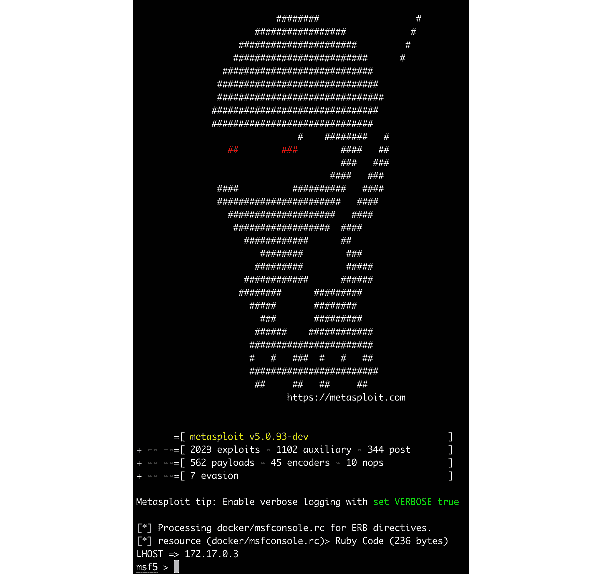

# 第十七章：结论 – 终点站，但不是旅程的结束

你现在已经到达了本书的最后一章。在前面的 15 章中，我们讨论了各种话题。正如你可能已经注意到的，书中的内容被分为三个领域——开发、带有监控的 DevOps，最后是安全性。那么，让我们花些时间回顾一下我们在每个领域所学到的内容，以及接下来我们可以去哪里。

首先，我们将回顾一下本书中学到的内容。接着，将呈现我们在开发方面所获得的技能总结。然后，我们将探索下一步可以去哪里，学习更多关于容器化 DevOps 的知识，并扩展我们新学到的技能。我们的倒数第二次回顾将考虑我们在安全方面学到的内容，以及我们如何保持对安全的关注。最后，我们将以对我们所学内容的总体总结结束。

为了复习这些内容，我们将它们分解为本章中的以下主题：

+   总结 – 让我们开始吧

+   我们学到的开发内容

+   推进 DevOps 知识的下一步

+   关于安全性的总结以及接下来的步骤

准备好你的容器化环境，准备好和我们一起进入 Docker 世界的最后一探。

# 技术要求

对于本章，你需要有一台运行 Docker 的 Linux 机器。我们建议你使用本书中到目前为止一直使用的设置。这样，你就可以按照本章推荐的一些工具和技术继续进行，如果你愿意的话。

查看以下视频，看看代码在实际中的表现：

[`bit.ly/2CpGTfZ`](https://bit.ly/2CpGTfZ)

# 总结 – 让我们开始吧

在本书的过程中，我们探讨了容器化的世界。随着这项技术在全球公司和项目中变得越来越普及，掌握容器基础知识以及支持容器的工具集变得愈发有用。

在我们结束本书之前，我们将通过回顾我们在开发方面所学到的内容来做一个总结。之后，我们将讨论可以采取哪些步骤来提升你的 DevOps 技能，最后，我们将快速浏览一些可能感兴趣的安全项目。

你可能希望准备好*第九章*中的项目，*使用 Spinnaker 进行云原生持续部署*，以便将本章推荐的一些项目与之结合。

记住，你可以在这里回顾设置该项目的源代码：

[`github.com/PacktPublishing/Docker-for-Developers/tree/master/chapter9`](https://github.com/PacktPublishing/Docker-for-Developers/tree/master/chapter9)

话虽如此，让我们来回顾一下在基于 Docker 的环境中开发时所学到的内容。

# 我们学到的开发内容

在本书的第一部分，《Docker 入门——容器与本地开发》中，我们介绍了 Docker 和容器的基础知识，以及它们如何用于开发。

首先，我们介绍了容器化和相关技术，如虚拟化。接下来，我们评估了 Docker 容器和虚拟机之间的差异，以了解它们在开发中的对比。在*第三章*《通过 Docker Hub 分享容器》中，我们首次体验了如何使用 Docker Hub 从第三方位置存储和检索镜像。最后，在了解了预构建的容器和容器镜像之后，我们探索了多个容器必须协同工作以构建更复杂系统的场景。

本节中的这四章内容，共同提供了本地开发的基础知识，并帮助你理解在该领域成为成功工程师所需的工具。为了进一步拓展这部分知识，理解基于容器的系统的设计模式将是你接下来应当探索的合乎逻辑的步骤。

## 深入探讨——设计模式

本书的第一部分提供了实践开发的指南。使用容器并不意味着软件开发的架构模式必须被放弃！

所以，如果你是这个领域的新手，你可能会问什么是设计模式。简而言之，设计模式是解决常见架构问题的可重用蓝图。就像建筑行业的工程师和建筑师重复使用可行的建筑模型一样，我们也可以采用类似的方法来构建软件系统。

以下这些面向容器的模式为你在完成本书后进一步探索这一主题提供了一个良好的起点。事实上，你可能会从前面的章节中认识到其中一些模式，这也是我们在此包含它们的原因。现在，让我们简要浏览其中五个模式，并看看本书中哪些服务和项目实现了它们。

### 单一容器——保持简单

当我们开始本书中的项目时，我们保持简单，使用了**单一容器**模式。这是你在基于容器的环境中可以采用的最简单模式，ShipIt Clicker 应用就采用了这一模式。

### 边车设计模式——用于日志记录

我们在整本书中都提到过日志记录，而日志监控系统通常会实现一种被称为**边车**模式的方式。在最简单的形式中，我们有一个像 ShipIt Clicker 这样的容器，接着是一个带有日志监控工具的第二个容器。这个工具可能是 Grafana、Datadog，或者我们实验过的其他工具。当你开始构建自己的项目时，这种简单的模式是一个很好的起点。将你的应用部署到一个容器中，然后用第二个容器处理日志处理。你还记得我们在探讨 Envoy 时提到的，边车模式在这里被用来创建服务网格，而不需要直接编辑应用来处理复杂的网络问题。

### 领导者与选举 – 增加冗余

我们已经看到了高可用系统的需求，以及像 Kubernetes 这样的工具如何通过在各个 Pod 之间协调多个容器来帮助我们实现这一目标。与 Kubernetes 配合使用的一种常见设计模式是**领导者和选举**方法。在这种方法中，数据可以分布到多个节点上以提供冗余；例如，数据可能会在容器之间进行复制。

如果由于某种原因，我们的容器崩溃，其他容器将选举一个新的领导者，Kubernetes 会启动一个新的节点来填补空缺。

### 使者设计模式 – 一种代理方法

代理是许多系统中的一个重要组成部分，尤其是在微服务架构中。正如你所看到的，在基于 Docker 的环境中，我们可以让多个容器驻留在同一虚拟网络上。每个容器都会分配一个名称，这使得容器之间可以相互通信。

一个可以使用**使者**模式的例子是，在后端缓存服务（如 Redis）与一组应用程序之间进行通信。在这个例子中，应用程序与一个 Redis 代理节点进行通信，认为它就是 Redis 本身。然而，这个代理节点随后会将流量分发到网络上的其他多个 Redis 节点。

Redis

Redis ([redis.io](http://redis.io))，正如你从早期的章节中可能记得的，它是一个基于内存的开源缓存和消息代理系统。它允许你在内存中存储多种数据结构，例如列表、集合和哈希，并且如果你愿意，还可以将其用作主要数据库（[`redislabs.com/blog/goodbye-cache-redis-as-a-primary-database/`](https://redislabs.com/blog/goodbye-cache-redis-as-a-primary-database/)）。

我们在*第十一章*《Docker 应用的扩展和负载测试》中分析的工具 Envoy，对于部署使者风格的方法非常有用。如果你有兴趣与 Redis 一起尝试，查看 Dmitry Polyakovsky 的文章《*Envoy Proxy 与 Redis*》([`dmitrypol.github.io/redis/2019/03/18/envoy-proxy.html`](http://dmitrypol.github.io/redis/2019/03/18/envoy-proxy.html))。

Redis 可以从 Docker Hub 获取作为容器 ([`hub.docker.com/_/redis/`](https://hub.docker.com/_/redis/))。在继续之前，让我们看一下最后一个设计模式。

### 适配器设计模式——解决方案重用

在容器之间有一致的方式来传递信息是非常重要的，尤其是在聚合指标时。例如，如果不同的容器生成不同格式的日志，我们需要能够以统一的格式获取这些数据。这时，**适配器**模式就派上用场了。我们可以使用这种模式开发统一接口，随后接收来自多个容器的日志文件，对其进行标准化处理，然后将数据存储在集中式监控服务中。

我们在*第十章*《使用 Prometheus、Grafana 和 Jaeger 监控 Docker》中看到，Prometheus 是一个有用的容器监控工具。然而，Prometheus 需要一个统一的接口来拉取指标，这个接口就是指标 API。当一个应用程序没有暴露与 Prometheus 兼容的端点时，我们可以使用适配器模式部署一个接口，将目标服务容器包装在一组 Prometheus 兼容的端点中。这样，Prometheus 就可以通过中间接口容器无缝地从我们感兴趣的容器中拉取数据。

### 阅读更多关于设计模式的内容

使用基于容器的设计模式有助于确保为你的系统使用正确的模型，仅在需要时引入适当的复杂性，同时确保系统具有弹性并且更容易管理。

如果你想了解更多关于 Kubernetes 和 Docker 中容器模式的内容，记得查看 Packt 出版的《Kubernetes 设计模式与扩展》一书。

# 接下来是进一步提升你的 DevOps 知识的步骤

第二部分，*在生产环境中运行容器*，针对的是 DevOps 实践，如**持续集成**和**持续部署**（**CI/CD**）、使用 Kubernetes 进行容器编排以及使用 Jaeger 等工具进行监控。

一开始，我们考察了在云环境和混合环境中托管容器的选项。接下来，我们探索了一个简单的选项，即通过 Docker Compose 在单一主机上部署应用程序。之后，通过实验 Jenkins，我们第一次接触了 CI/CD 工具，以及这些工具如何与 Docker 配合使用。在掌握了 CD 的概念后，我们进入了 *第八章*，*将 Docker 应用部署到 Kubernetes*，这让我们第一次体验了 Kubernetes 容器编排。随后，我们尝试了 Spinnaker 这种容器原生云部署选项，并理解了哪些部署方法对生产环境有用。本书第二部分的倒数第二章探讨了性能监控工具，如 Jaeger、Prometheus 和 Grafana。最后，我们以讨论 Envoy 服务网格、代理和在生产环境中的扩展与负载测试项目结束了这一部分。

本部分的七章提供了丰富的项目，让你了解一些公司在生产环境中托管和服务基于容器的应用程序时所面临的核心概念。然而，仍然有许多有趣的技术和话题需要学习，以便将你的 DevOps 技能提升到一个新的水平。

## 混沌工程与构建弹性生产系统

在拥有复杂生产系统、容器在云中编排、并且 CD 运行的情况下，我们如何确保系统能够抵御故障和意外崩溃？这就是混沌工程概念发挥作用的地方。

混沌工程是理解代码和基础设施本身复杂性的一种实践，因此我们在进行工程和测试时应考虑到这一点。混沌工程有五个概念，概括如下：

+   **围绕稳定状态行为发展假设**：在短时间内衡量系统的输出，以收集基线数据。这个基线被称为稳定状态，可能包括错误率、响应时间、延迟时间和流量负载等指标。

+   **测试各种现实世界事件**：在测试可能影响生产系统的现实世界事件时，可以考虑测试软件故障、损坏的输入、容器崩溃以及其他可能导致性能下降的事件。

+   **在生产环境中实验**：在生产环境中进行测试可能看起来像是禁忌。然而，每个环境都是不同的，为了获得真实结果，生产环境中的测试是必须的。

+   **最小化影响，亦即爆炸半径**：在生产环境中进行测试，然而，这并不意味着我们可以忽略确保任何性能下降是暂时性的，并且可以轻松恢复的责任。始终确保你的实验是有良好隔离的。

+   **持续运行自动化实验**：使用自动化的方法可以减少人工开销，并让测试和实验在一天中的任何时间进行。

Netflix 开发的一个实现这一概念的工具是 Chaos Monkey。Chaos Monkey 是一个平台，你可以将你的基础设施部署到其中，它会随机终止在生产环境中运行的容器。其目标是测试生产系统如何响应/恢复，并允许工程师调优系统以增强其韧性。

你已经看过如何设置 Spinnaker，接下来，你可以将 Chaos Monkey 集成到现有的管道中。Chaos Monkey 也可以与 AWS 和 Kubernetes 一起使用。源代码可以在[`github.com/Netflix/chaosmonkey`](https://github.com/Netflix/chaosmonkey)找到。

如果你有兴趣安装 Chaos Monkey 并将其添加到你在*第九章*中构建的现有 CI/CD Spinnaker 管道中，*云原生连续部署使用 Spinnaker*，你可以参考官方安装指南[`netflix.github.io/chaosmonkey/How-to-deploy/`](https://netflix.github.io/chaosmonkey/How-to-deploy/)。

一旦它运行起来，你可以在基于 Spinnaker 的容器环境中测试 Chaos Monkey，看看它如何处理终止服务，并观察你的监控工具中显示的相关指标。

如果你有兴趣将 Chaos Monkey 与安全技术结合使用，务必查看 Packt 的视频指南，了解如何使用 Chaos Monkey 进行应用程序的**模糊** **测试**：

[`subscription.packtpub.com/video/virtualization_and_cloud/9781788394901/94651/94677/chaos-monkey-and-fuzz-testing`](https://subscription.packtpub.com/video/virtualization_and_cloud/9781788394901/94651/94677/chaos-monkey-and-fuzz-testing)

什么是模糊测试？

模糊测试是测试应用程序对随机、无效和不兼容的随机数据输入的反应过程。

除了 Chaos Monkey，以下工具还提供了构建和测试弹性系统的机制：

+   **Gremlin**：一个可以与 Kubernetes、Mesos、ECS 和 Docker Swarm 一起使用的混沌工程平台，详情请见[`www.gremlin.com/`](https://www.gremlin.com/)。

+   **Mangle**：VMware 的开源混沌工程平台，支持 Kubernetes 和 Docker，详情请见[`vmware.github.io/mangle/`](https://vmware.github.io/mangle/)。

+   **Chaos Mesh**：一个面向 Kubernetes 环境的云原生混沌工程平台。它可以通过 Helm 进行部署，详情请见[`github.com/pingcap/chaos-mesh`](https://github.com/pingcap/chaos-mesh)。

我们简要介绍了混沌工程作为一种概念，你可以从 DevOps 的角度进一步探索。现在，让我们回顾一下我们在安全性方面学习的内容。

# 关于安全性的总结及下一步该怎么做

本书的最后一部分，*Docker 安全 – 保护你的容器*，专门讨论了安全主题。首先，我们从安全角度分析了容器如何与底层硬件协同工作。我们研究了容器和虚拟机监控程序的安全模型，并快速了解了安全最佳实践。

随后我们探讨了安全基础和最佳实践，为我们提供了处理 Dockerfile 和构建最小基础镜像的最佳方法。在此之后，我们研究了如何在 Docker Swarm 中处理秘密信息。这为那些可能需要维护遗留系统或从 Swarm 迁移到 Kubernetes 的读者提供了见解。我们还探讨了从安全角度如何使用标签、元数据和标签。

本书倒数第二章，*第十五章*，*扫描、监控和使用第三方工具*，为我们提供了 Google、Amazon 和 Microsoft 在云中提供的容器安全功能的简要介绍。我们还安装了 Anchore 进行安全扫描，查看了一些可能有用的额外监控工具，并简要尝试了 Datadog 进行容器监控，而 Datadog 也可以在安全环境下使用。

掌握了这些基础知识后，以下是一些基于这些知识的容器安全项目的下一步思路。

## Metasploit – 基于容器的渗透测试

现在我们已经构建了安全容器，并且希望应用程序也足够安全，你可以在基于容器的环境中进行渗透测试，例如通过 Spinnaker 部署的环境。渗透测试是寻找系统中的安全漏洞的过程，这些漏洞可能被利用来获取访问权限、外泄数据、干扰性能，或者将受损系统转变为发起其他攻击的平台。

一个广泛使用的渗透测试工具是**Metasploit**框架（[`www.metasploit.com/`](https://www.metasploit.com/)）。Metasploit 是一个开源框架，用于开发和部署针对远程目标（例如在你环境中运行的容器）的安全漏洞代码。Metasploit 可以从 Docker Hub 以容器格式获取，网址是[`hub.docker.com/r/metasploitframework/metasploit-framework`](https://hub.docker.com/r/metasploitframework/metasploit-framework)。

在此工具到位后，你可以使用如 Anchore 等工具测试容器中的漏洞。例如，漏洞可能包括容器中安装的旧版软件，这些软件可能容易受到攻击。要获取最新版本，请运行以下代码：

```
docker pull metasploitframework/metasploit-framework
```

你可以按如下方式运行容器：

```
sudo docker run --rm -it metasploitframework/metasploit-framework
```

加载完成后，你将进入 Metasploit shell，称为`msfconsole`：



图 16.1 – Metasploit 容器运行示例

从这里，你可以开始探索可用的命令，并考虑可以在容器内运行的项目。关于使用 Metasploit 的免费课程可以在 Offensive Security 网站找到：[`www.offensive-security.com/metasploit-unleashed/`](https://www.offensive-security.com/metasploit-unleashed/)。一旦你熟悉了基本命令，可以考虑探索 Metasploit 中的一些其他功能。

### 无保护的 TCP 套接字漏洞

你还记得我们讨论过的将 Docker 的 TCP 套接字暴露出去可能被攻击者利用的情况。Metasploit 提供了一个如何实现这一点的示例。尝试在第二台机器上通过`2375/tcp`运行 Docker，并在我们刚刚设置的 Metasploit 容器中加载`docker_daemon_tcp`模块([`www.rapid7.com/db/modules/exploit/linux/http/docker_daemon_tcp`](https://www.rapid7.com/db/modules/exploit/linux/http/docker_daemon_tcp))。现在你可以通过此模块针对被攻破的套接字，并在正在运行容器的目标主机上创建一个容器，并将`/`路径挂载为具有读写权限。

### 测试第三方易受攻击的容器 - Apache Struts

以下只是许多可供下载和实验的易受攻击容器中的一个示例。这个由`piesecurity`创建的容器，包含了 Apache Struts 的一个易受攻击版本([`hub.docker.com/r/piesecurity/apache-struts2-cve-2017-5638/`](https://hub.docker.com/r/piesecurity/apache-struts2-cve-2017-5638/))。

Apache Struts 是一个流行的 Java 框架，用于开发 Web 应用程序。在 2017 年，发现了该框架中的一个漏洞，攻击者可以利用此漏洞在运行该框架的服务器上远程执行代码。此漏洞的著名受害者之一是 Equifax，该公司遭遇了重大数据泄露事件。

你可以通过 Spinnaker 部署并运行加载了 Struts 的容器，自己测试漏洞。安装完成后，使用 Metasploit 模块`struts2_content_type_ognl`([`www.rapid7.com/db/modules/exploit/multi/http/struts2_content_type_ognl`](https://www.rapid7.com/db/modules/exploit/multi/http/struts2_content_type_ognl))。这将允许你发起攻击，在被攻破的容器上创建反向 Shell，并演示即便在 Kubernetes 和 Docker 中运行，第三方框架内的安全漏洞也可能被利用。

如果你想进一步了解，可以参考 Packt 出版的《*高级基础设施渗透测试*》一书，书中提供了使用 Metasploit 框架并测试基于容器的环境安全的指导。

# 总结

希望你喜欢阅读本书。本书旨在提供一份全面的 Docker 开发指南，包括本地开发和云端开发。在这 16 章中，我们的目标不仅是展示如何在容器中开发应用，还包括如何构建、部署、扫描和监控它们。

无论你是打算从零开始构建一个新项目、在 Docker Swarm 上维护遗留系统，还是迁移到基于 Kubernetes 的环境，*Docker For Developers* 这本书都是你可以随时翻阅来刷新知识或根据需要寻求指导的书籍。

我们希望你在容器世界的旅程中获得的收获，与我们分享这些知识时的喜悦一样多。祝你未来的项目好运！
