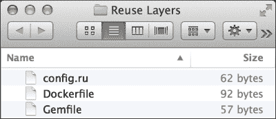
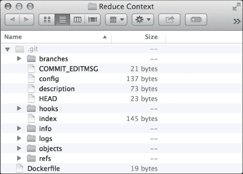
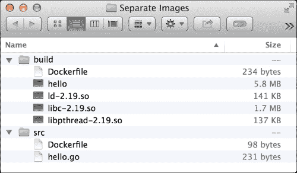

# 第二章：优化 Docker 镜像

现在我们已经构建并部署了 Docker 容器，可以开始享受使用它们的好处。我们拥有一个标准的软件包格式，允许开发人员和系统管理员合作，简化我们应用程序代码的管理。Docker 的容器格式使我们能够快速迭代应用程序的版本，并与组织中的其他成员共享。由于 Docker 容器的轻量级特性和速度，我们的开发、测试和部署时间都大大减少。Docker 容器的可移植性使我们能够将应用程序从物理服务器扩展到云中的虚拟机。

然而，我们将开始注意到，最初使用 Docker 的原因正失去其效力。开发时间增加，因为我们必须每次都下载应用程序最新版本的 Docker 镜像运行时库。部署花费大量时间，因为 Docker Hub 很慢。最糟糕的是，Docker Hub 可能会宕机，我们根本无法进行任何部署。我们的 Docker 镜像现在变得非常大，达到几个 GB，简单的一行更新也需要整整一天。

本章将涵盖以下几种情况，说明 Docker 容器如何失控，并提出前面提到的问题的解决步骤：

+   减少镜像部署时间

+   减少镜像构建时间

+   减少镜像大小

# 减少部署时间

随着构建 Docker 容器的时间推移，它的大小越来越大。更新我们现有 Docker 主机上的运行容器并不成问题。Docker 利用我们随着应用程序增长而逐步构建的 Docker 镜像层。然而，假设我们想要扩展应用程序。这就需要在额外的 Docker 主机上部署更多的 Docker 容器。每个新的 Docker 主机都必须下载我们随着时间推移构建的所有大镜像层。本节将展示一个 *大型* Docker 应用程序如何影响新 Docker 主机上的部署时间。首先，按照以下步骤构建这个问题 Docker 应用程序：

1.  编写以下 `Dockerfile` 来创建我们的 "大型" Docker 镜像：

    ```
    FROM debian:jessie

    RUN dd if=/dev/urandom of=/largefile bs=1024 count=524288
    ```

1.  接下来，使用以下命令构建 `Dockerfile` 为 `hubuser/largeapp`：

    ```
    dockerhost$ docker build -t hubuser/largeapp .

    ```

1.  注意记录创建的 Docker 镜像的大小。在下面的输出示例中，大小为 `662 MB`：

    ```
    dockerhost$ docker images
    REPOSITORY        TAG      IMAGE ID   CREATED         VIRTUAL SIZE
    hubuser/largeapp  latest   450e3123   5 minutes ago   662 MB
    debian            jessie   9a61b6b1   4 days ago      125.2 MB

    ```

1.  使用 `time` 命令，记录从 Docker Hub 推送和拉取的时间，如下所示：

    ```
    dockerhost$ time docker push hubuser/largeapp
    The push refers to a repository [hubuser/largeapp] (len: 1)
    450e319e42c3: Image already exists
    9a61b6b1315e: Image successfully pushed
    902b87aaaec9: Image successfully pushed
    Digest: sha256:18ef52e36996dd583f923673618483a4466aa2d1d0d6ce9f0...

    real  11m34.133s
    user    0m0.164s
    sys     0m0.104s
    dockerhost$ time docker pull hubuser/largeapp
    latest: Pulling from hubuser/largeapp
    902b87aaaec9: Pull complete
    9a61b6b1315e: Pull complete
    450e319e42c3: Already exists
    Digest: sha256:18ef52e36996dd583f923673618483a4466aa2d1d0d6ce9f0...
    Status: Downloaded newer image for hubuser/largeapp:latest

    real    2m56.805s
    user    0m0.204s
    sys     0m0.188s

    ```

正如我们在前面突出显示的时间值所看到的，执行 `docker push` 将镜像上传到 Docker Hub 时需要花费大量时间。部署时，`docker pull` 也需要同样长的时间来将我们新创建的 Docker 镜像传播到新的生产 Docker 主机。这些上传和下载的时间值还取决于 Docker Hub 与我们的 Docker 主机之间的网络连接。最终，当 Docker Hub 出现故障时，我们将失去部署新的 Docker 容器或按需扩展到更多 Docker 主机的能力。

为了利用 Docker 快速交付应用程序、简化部署和扩展的优势，我们推送和拉取 Docker 镜像的方法必须可靠且快速。幸运的是，我们可以运行自己的 Docker 注册中心，能够托管和分发 Docker 镜像，而无需依赖公共 Docker Hub。接下来的几步将描述如何设置这一过程，以确认性能的提升：

1.  让我们通过输入以下命令来运行我们自己的 Docker 注册中心。这将使我们在 `tcp://dockerhost:5000` 上运行本地注册中心：

    ```
    dockerhost$ docker run -p 5000:5000 -d registry:2

    ```

1.  接下来，让我们确认 Docker 镜像部署的改进。首先，为之前创建的镜像创建一个标签，以便通过以下命令将其推送到本地 Docker 注册中心：

    ```
    dockerhost$ docker tag hubuser/largeapp \
     dockerhost:5000/largeapp

    ```

1.  观察通过我们新运行的 Docker 注册中心推送相同 Docker 镜像时有多快。以下测试表明，推送 Docker 镜像的速度现在至少提高了 10 倍：

    ```
    dockerhost$ time docker push dockerhost:5000/largeapp
    The push refers to a ...[dockerhost:5000/largeapp] (len: 1)
    ...

    real   0m52.928s
    user    0m0.084s
    sys     0m0.048s

    ```

1.  现在，在测试从本地 Docker 注册中心拉取镜像之前，先确认我们 Docker 镜像拉取的新性能。我们先确保删除之前构建的镜像。以下测试表明，Docker 镜像的下载速度现在提高了 30 倍：

    ```
    dockerhost$ docker rmi dockerhost:5000/largeapp \
     hubuser/largeapp
    Untagged: dockerhost:5000/largeapp:latest
    Untagged: hubuser/largeapp:latest
    Deleted: 549d099c0edaef424edb6cfca8f16f5609b066ba744638990daf3b43...
    dockerhost$ time docker pull dockerhost:5000/largeapp
    latest: Pulling from dockerhost:5000/largeapp
    549d099c0eda: Already exists
    902b87aaaec9: Already exists
    9a61b6b1315e: Already exists
    Digest: sha256:323bed623625b3647a6c678ee6840be23616edc357dbe07c5a0c68b62dd52ecf
    Status: Downloaded newer image for dockerhost:5000/largeapp:latest

    real   0m10.444s
    user    0m0.160s
    sys     0m0.056s

    ```

这些改进的主要原因是我们从本地网络上传和下载了相同的镜像。我们节省了 Docker 主机的带宽，部署时间也缩短了。最重要的是，我们不再需要依赖 Docker Hub 的可用性来进行部署。

### 注意

为了将 Docker 镜像部署到其他 Docker 主机，我们需要为 Docker 注册中心设置安全性。本书的范围之外会涉及如何设置 Docker 注册中心的细节。然而，更多关于如何设置 Docker 注册中心的信息可以在 [`docs.docker.com/registry/deploying`](https://docs.docker.com/registry/deploying) 获取。

# 改善镜像构建时间

Docker 镜像是开发人员一直在处理的主要成果物。Docker 文件的简单性和容器技术的速度使我们能够对正在开发的应用程序进行快速迭代。然而，一旦构建 Docker 镜像所需的时间开始失控，这些 Docker 的优势就会开始减弱。在本节中，我们将讨论一些构建 Docker 镜像需要较长时间的案例，然后我们将给出一些提升这些效果的建议。

## 使用镜像仓库

镜像构建时间的一个大因素是获取上游镜像所花费的时间。假设我们有一个 `Dockerfile`，其中有以下一行：

```
FROM java:8u45-jre
```

该镜像需要下载 `java:8u45-jre` 以进行构建。当我们迁移到另一个 Docker 主机，或当 `java:8u45-jre` 镜像在 Docker Hub 上更新时，我们的构建时间会暂时增加。配置本地注册表镜像可以减少这种镜像构建时间的情况。这在组织环境中非常有用，每个开发人员在其工作站上都有自己的 Docker 主机。组织的网络只需从 Docker Hub 下载一次镜像。现在，组织中每个工作站的 Docker 主机都可以直接从本地注册表镜像获取镜像。

设置一个注册表镜像就像在前一节中设置本地注册表一样简单。然而，除此之外，我们还需要配置 Docker 主机，使其能够识别这个注册表镜像，通过向 Docker 守护进程传递 `--registry-mirror` 选项来完成。以下是进行此设置的步骤：

1.  在我们的 Debian Jessie Docker 主机上，通过更新并创建一个位于 `/etc/systemd/system/docker.service.d/10-syslog.conf` 的 Systemd drop-in 文件，配置 Docker 守护进程，该文件应包含以下行：

    ```
    [Service]   
    ExecStart=  
    ExecStart=/usr/bin/docker daemon-H fd:// \
                              --registry-mirror=http://dockerhost:5000
    ```

1.  现在，我们将重新加载 Systemd，以便加载 `docker.service` 单元的新 drop-in 配置，如下所示：

    ```
    dockerhost$ systemctl daemon-reload

    ```

1.  接下来，重启 Docker 守护进程，以通过以下命令启动它并加载新的 Systemd 单元：

    ```
    dockerhost$ systemctl restartdocker.service

    ```

1.  最后，运行注册表镜像 Docker 容器。运行以下命令：

    ```
    dockerhost$ docker run -p 5000:5000 -d \
     -e STANDALONE=false \
     -e MIRROR_SOURCE=https://registry-1.docker.io \
     -e MIRROR_SOURCE_INDEX=https://index.docker.io \registry

    ```

为了确认注册表镜像按预期工作，请执行以下步骤：

1.  构建开头部分所描述的 `Dockerfile` 并注意它的构建时间。请注意，构建 Docker 镜像所需的大部分时间都花在了下载上游 `java:8u45-jre` Docker 镜像上，如下所示的命令：

    ```
    dockerhost$ time docker build -t hubuser/mirrorupstream .
    Sending build context to Docker daemon 2.048 kB
    Sending build context to Docker daemon
    Step 0 : FROM java:8u45-jre
    Pulling repository java
    4ac125456dd3: Download complete
    902b87aaaec9: Download complete
    9a61b6b1315e: Download complete
    1ff9f26f09fb: Download complete
    6f6bffbbf095: Download complete
    4b61c52d7fe4: Download complete
    1a9b1e5c4dd5: Download complete
    2e8cff440182: Download complete
    46bc3bbea0ec: Download complete
    3948efdeee11: Download complete
    918f0691336e: Download complete
    Status: Downloaded newer image for java:8u45-jre
     ---> 4ac125456dd3
    Successfully built 4ac125456dd3

    real   1m58.095s
    user    0m0.036s
    sys     0m0.028s

    ```

1.  现在，删除镜像及其上游依赖，并使用以下命令重新构建镜像：

    ```
    dockerhost$ docker rmi java:8u45-jre hubuser/mirrorupstream
    dockerhost$ time docker build -t hubuser/mirrorupstream .
    Sending build context to Docker daemon 2.048 kB
    Sending build context to Docker daemon
    Step 0 : FROM java:8u45-jre
    Pulling repository java
    4ac125456dd3: Download complete
    902b87aaaec9: Download complete
    9a61b6b1315e: Download complete
    1ff9f26f09fb: Download complete
    6f6bffbbf095: Download complete
    4b61c52d7fe4: Download complete
    1a9b1e5c4dd5: Download complete
    2e8cff440182: Download complete
    46bc3bbea0ec: Download complete
    3948efdeee11: Download complete
    918f0691336e: Download complete
    Status: Downloaded newer image for java:8u45-jre
     ---> 4ac125456dd3
    Successfully built 4ac125456dd3

    real   0m59.260s
    user    0m0.032s
    sys     0m0.028s

    ```

当第二次下载 `java:8u45-jre` Docker 镜像时，它是从本地注册表镜像中获取的，而不是连接到 Docker Hub。设置 Docker 注册表镜像使得下载上游镜像的时间几乎减少了两倍。如果我们有其他 Docker 主机指向同一个注册表镜像，它也会做相同的事情：跳过从 Docker Hub 下载。

### 注意

本指南关于如何设置注册表镜像，基于 Docker 官方文档网站上的内容。更多细节可以在 [`docs.docker.com/articles/registry_mirror`](https://docs.docker.com/articles/registry_mirror) 找到。

## 重用镜像层

如我们所知，Docker 镜像由一系列层组成，这些层通过单个镜像的联合文件系统进行组合。当我们构建 Docker 镜像时，Docker 会检查 `Dockerfile` 中的前置指令，查看是否有现有的镜像可以复用，而不是为这些指令创建类似或重复的镜像。如果了解了构建缓存的工作原理，我们可以大大提高后续 Docker 镜像构建的速度。一个好的例子是，当我们开发应用程序的行为时，我们并不会一直添加依赖项。大多数时候，我们只需要更新应用程序本身的核心行为。了解这一点后，我们可以在开发工作流中围绕这一点设计 Docker 镜像的构建方式。

### 注意

关于 `Dockerfile` 指令缓存的详细规则，可以参阅 [`docs.docker.com/articles/dockerfile_best-practices/#build-cache`](http://docs.docker.com/articles/dockerfile_best-practices/#build-cache)。

例如，假设我们正在开发一个 Ruby 应用程序，它的源代码树看起来像下面这样：



`config.ru`的内容如下：

```
app =  proc do |env|
  [200, {}, %w(hello world)]
end
run app
```

`Gemfile`的内容如下：

```
source 'https://rubygems.org'

gem 'rack'
gem 'nokogiri'
```

`Dockerfile`的内容如下：

```
FROM ruby:2.2.2

ADD . /app
WORKDIR /app
RUN bundle install

EXPOSE 9292
CMD rackup -E none
```

接下来的步骤将向您展示如何将我们之前编写的 Ruby 应用程序构建为 Docker 镜像：

1.  首先，通过以下命令构建这个 Docker 镜像。请注意，构建所用的时间大约为一分钟：

    ```
    dockerhost$ time docker build -t slowdependencies .
    Sending build context to Docker daemon 4.096 kB
    Sending build context to Docker daemon
    Step 0 : FROM ruby:2.2.2
     ---> d763add83c94
    Step 1 : ADD . /app
     ---> 6663d8b8b5d4
    Removing intermediate container 2fda8dc40966
    Step 2 : WORKDIR /app
     ---> Running in f2bec0dea1c9
     ---> 289108c6655f
    Removing intermediate container f2bec0dea1c9
    Step 3 : RUN bundle install
     ---> Running in 7025de40c01d
    Don't run Bundler as root. Bundler can ask for sudo if ...
    Fetching gem metadata from https://rubygems.org/.........
    Fetching version metadata from https://rubygems.org/..
    Resolving dependencies...
    Installing mini_portile 0.6.2
    Installing nokogiri 1.6.6.2 with native extensions
    Installing rack 1.6.4
    Using bundler 1.10.5
    Bundle complete! 2 Gemfile dependencies, 4 gems now installed.
    Bundled gems are installed into /usr/local/bundle.
     ---> ab26818ccd85
    Removing intermediate container 7025de40c01d
    Step 4 : EXPOSE 9292
     ---> Running in e4d7647e978b
     ---> a602159cb786
    Removing intermediate container e4d7647e978b
    Step 5 : CMD rackup -E none
     ---> Running in 407308682d13
     ---> bffce44702f8
    Removing intermediate container 407308682d13
    Successfully built bffce44702f8

    real   0m54.428s
    user    0m0.004s
    sys     0m0.008s

    ```

1.  接下来，更新 `config.ru` 来改变应用程序的行为，如下所示：

    ```
    app =  proc do |env|
     [200, {}, %w(hello other world)]
    end
    run app
    ```

1.  现在，我们重新构建 Docker 镜像，并记录构建完成所花费的时间。运行以下命令：

    ```
    dockerhost$ time docker build -t slowdependencies .
    Sending build context to Docker daemon 4.096 kB
    Sending build context to Docker daemon
    Step 0 : FROM ruby:2.2.2
     ---> d763add83c94
    Step 1 : ADD . /app
     ---> 05234a367589
    Removing intermediate container e9d33db67914
    Step 2 : WORKDIR /app
     ---> Running in 65b3f40d6228
     ---> c656079a833f
    Removing intermediate container 65b3f40d6228
    Step 3 : RUN bundle install
     ---> Running in c84bd4aa70a0
    Don't run Bundler as root. Bundler can ask for sudo ...
    Fetching gem metadata from https://rubygems.org/.........
    Fetching version metadata from https://rubygems.org/..
    Resolving dependencies...
    Installing mini_portile 0.6.2
    Installing nokogiri 1.6.6.2 with native extensions
    Installing rack 1.6.4
    Using bundler 1.10.5
    Bundle complete! 2 Gemfile dep..., 4 gems now installed.
    Bundled gems are installed into /usr/local/bundle.
     ---> 68f5dc363171
    Removing intermediate container c84bd4aa70a0
    Step 4 : EXPOSE 9292
     ---> Running in 68c1462c2018
     ---> c257c74eb7a8
    Removing intermediate container 68c1462c2018
    Step 5 : CMD rackup -E none
     ---> Running in 7e13fd0c26f0
     ---> e31f97d2d96a
    Removing intermediate container 7e13fd0c26f0
    Successfully built e31f97d2d96a

    real    0m57.468s
    user    0m0.008s
    sys     0m0.004s

    ```

我们可以注意到，即使只是对应用程序进行了单行更改，我们也需要在每次构建 Docker 镜像时都运行 `bundle install`。这非常低效，而且会中断我们的开发流程，因为构建和运行 Docker 应用程序需要一分钟。对于像我们这样的急性子开发者来说，这简直就像度日如年！

为了优化这一工作流，我们可以将准备应用程序依赖项的阶段与准备实际工件的阶段分开。接下来的步骤展示了如何做到这一点：

1.  首先，更新我们的 `Dockerfile`，进行如下更改：

    ```
    FROM ruby:2.2.2

    ADD Gemfile /app/Gemfile
    WORKDIR /app
    RUN bundle install
    ADD . /app

    EXPOSE 9292
    CMD rackup -E none
    ```

1.  接下来，通过以下命令构建重新构建的 Docker 镜像：

    ```
    dockerhost$ time docker build -t separatedependencies .
    Sending build context to Docker daemon 4.096 kB
    Sending build context to Docker daemon
    ...
    Step 3 : RUN bundle install
     ---> Running in b4cbc6803947
    Don't run Bundler as root. Bundler can ask for sudo if it is needed, and
    installing your bundle as root will break this application for all non-root
    users on this machine.
    Fetching gem metadata from https://rubygems.org/.........
    Fetching version metadata from https://rubygems.org/..
    Resolving dependencies...
    Installing mini_portile 0.6.2
    Installing nokogiri 1.6.6.2 with native extensions
    Installing rack 1.6.4
    Using bundler 1.10.5
    Bundle complete! 2 Gemfile dependencies, 4 gems now installed.
    Bundled gems are installed into /usr/local/bundle.
     ---> 5c009ed03934
    Removing intermediate container b4cbc6803947
    Step 4 : ADD . /app
    ...
    Successfully built ff2d4efd233f

    real    0m57.908s
    user    0m0.008s
    sys     0m0.004s

    ```

1.  初始构建时间仍然相同，但请注意在 `Step 3` 生成的镜像 ID。现在，再次尝试更新 `config.ru` 并重建镜像，如下所示：

    ```
    dockerhost$ vi config.ru # edit as we please
    dockerhost$ time docker build -t separatedependencies .
    Sending build context to Docker daemon 4.096 kB
    Sending build context to Docker daemon
    Step 0 : FROM ruby:2.2.2
     ---> d763add83c94
    Step 1 : ADD Gemfile /app/Gemfile
     ---> Using cache
     ---> a7f68475cf92
    Step 2 : WORKDIR /app
     ---> Using cache
     ---> 203b5b800611
    Step 3 : RUN bundle install
     ---> Using cache
     ---> 5c009ed03934
    Step 4 : ADD . /app
     ---> 30b2bfc3f313
    Removing intermediate container cd643f871828
    Step 5 : EXPOSE 9292
     ---> Running in a56bfd37f721
     ---> 553ae65c061c
    Removing intermediate container a56bfd37f721
    Step 6 : CMD rackup -E none
     ---> Running in 0ceaa70bee6c
     ---> 762b7ccf7860
    Removing intermediate container 0ceaa70bee6c...
    Successfully built 762b7ccf7860

    real   0m0.734s
    user    0m0.008s
    sys     0m0.000s

    ```

从前面的输出中我们可以看到，`docker build` 在 `Step 3` 之前复用了缓存，因为 `Gemfile` 没有发生变化。请注意，我们 Docker 镜像的构建时间比通常减少了 80 倍！

这种对 Docker 镜像的重构同样有助于减少部署时间。因为我们的生产环境中的 Docker 主机已经包含了 Docker 镜像在上一版本容器中`Step 3`的镜像层，所以在应用新版本时，Docker 主机只需拉取`Step 4`到`Step 6`的新镜像层即可更新我们的应用。

## 减少构建上下文大小

假设我们在 Git 版本控制中有一个类似于以下的`Dockerfile`：



在某些时候，我们会注意到我们的`.git`目录太大。这可能是由于我们的源代码树中提交了越来越多的代码：

```
dockerhost$ du -hsc .git
1001M   .git
1001M   total

```

现在，当我们构建我们的 Docker 应用时，我们会注意到构建 Docker 应用所需的时间也非常长。请看以下输出：

```
dockerhost$ time docker build -t hubuser/largecontext .
Sending build context to Docker daemon 1.049 GB
Sending build context to Docker daemon
...
Successfully built 9a61b6b1315e

real    0m17.342s
user    0m0.408s
sys     0m1.360s

```

如果我们仔细查看前面的输出，我们会看到 Docker 客户端将整个 1GB 的`.git`目录上传到 Docker 守护进程，因为它是我们构建上下文的一部分。而且，由于这是一个大型构建上下文，在 Docker 守护进程能够开始构建我们的 Docker 镜像之前，它需要花时间接收这些数据。

然而，这些文件在构建我们的应用时并不是必需的。而且，当我们在生产环境中运行应用时，这些与 Git 相关的文件完全不需要。我们可以设置 Docker 忽略一组特定的文件，这些文件在构建 Docker 镜像时并不需要。按照接下来的几个步骤进行优化：

1.  在与我们的`Dockerfile`相同的目录中创建一个`.dockerignore`文件，内容如下：

    ```
    .git
    ```

1.  最后，通过执行以下命令重新构建我们的 Docker 镜像：

    ```
    dockerhost$ time docker build -t hubuser/largecontext .
    Sending build context to Docker daemon 3.072 kB
    ...
    Successfully built 9a61b6b1315e

    real   0m0.030s
    user    0m0.004s
    sys     0m0.004s

    ```

请注意，现在构建时间仅通过减小构建上下文的大小就提高了 500 倍以上！

### 注意

有关如何使用`.dockerignore`文件的更多信息，请参见[`docs.docker.com/reference/builder/#dockerignore-file`](https://docs.docker.com/reference/builder/#dockerignore-file)。

## 使用缓存代理

另一个常见的导致 Docker 镜像构建时间过长的原因是下载依赖项的指令。例如，基于 Debian 的 Docker 镜像需要从 APT 仓库获取包。根据这些包的大小，`apt-get install`指令的构建时间可能会很长。为了减少这些构建指令的时间，可以使用代理来缓存这些依赖包。一个流行的缓存代理是`apt-cacher-ng`。本节将描述如何运行和设置它，以改进我们的 Docker 镜像构建工作流。

以下是一个示例`Dockerfile`，它安装了大量的 Debian 包：

```
FROM debian:jessie

RUN echo deb http://httpredir.debian.org/debian \
         jessie-backports main > \
         /etc/apt/sources.list.d/jessie-backports.list
RUN apt-get update &&\
    apt-get --no-install-recommends \
            install -y openjdk-8-jre-headless
```

请注意，下面输出中的构建时间非常长，因为这个`Dockerfile`文件下载了很多与 Java（`openjdk-8-jre-headless`）相关的依赖和包。运行以下命令：

```
dockerhost$ time docker build -t beforecaching .
...
Successfully built 476f2ebd35f6

real   3m22.949s
user    0m0.048s
sys     0m0.020s

```

为了改善构建这个 Docker 镜像的工作流程，我们将使用 `apt-cacher-ng` 设置一个缓存代理。幸运的是，它已经作为一个即插即用的容器在 Docker Hub 上提供。请按照以下几步准备 `apt-cacher-ng`：

1.  在我们的 Docker 主机上运行以下命令以启动 `apt-cacher-ng`：

    ```
    dockerhost$ docker run -d -p 3142:3142 sameersbn/apt-cacher-ng

    ```

1.  完成后，我们将使用之前运行的缓存代理，如以下 `Dockerfile` 所示：

    ```
    FROM debian:jessie

    RUN echo Acquire::http { \
             Proxy\"http://dockerhost:3142\"\; \
             }\;>/etc/apt/apt.conf.d/01proxy
    ```

1.  通过以下命令行构建我们之前创建的 `Dockerfile`，将其标记为 `hubuser/debian:jessie` 的 Docker 镜像：

    ```
    dockerhost$ docker buid -t hubuser/debian:jessie

    ```

1.  最后，通过更新我们的 `Dockerfile` 来使 `hubuser/debian:jessie` 成为新的基础 Docker 镜像，该文件安装了许多 Debian 包作为依赖，例如以下内容：

    ```
    FROM hubuser/debian:jessie

    RUN echo deb http://httpredir.debian.org/debian \
             jessie-backports main > \
             /etc/apt/sources.list.d/jessie-backports.list
    RUN apt-get update && \
        apt-get --no-install-recommends \
                install -y openjdk-8-jre-headless
    ```

1.  为了确认新的工作流程，运行初始构建以使用以下命令预热缓存：

    ```
    dockerhost$ docker build -t aftercaching .

    ```

1.  最后，执行以下命令再次构建镜像。但请确保先删除该镜像：

    ```
    dockerhost$ docker rmi aftercaching
    dockerhost$ time docker build -t aftercaching .
    ...
    Removing intermediate container 461637e26e05
    Successfully built 2b80ca0d16fd

    real   0m31.049s
    user    0m0.044s
    sys     0m0.024s

    ```

注意，尽管我们没有使用 Docker 的构建缓存，但后续的构建速度更快。这种技术对于我们为团队或组织开发基础 Docker 镜像时非常有用。团队成员在尝试重新构建我们的 Docker 镜像时，将会比之前快 6.5 倍，因为他们可以从我们之前准备的组织缓存代理中下载包。我们在持续集成服务器上的构建也将更快，因为在开发过程中我们已经预热了缓存服务器。

本节简要介绍了如何使用一个非常具体的缓存服务器。以下是我们可以使用的其他几个缓存服务器及其相应的文档页面：

+   **apt-cacher-ng**：该工具支持缓存 Debian、RPM 以及其他特定于发行版的包，并可以在 [`www.unix-ag.uni-kl.de/~bloch/acng`](https://www.unix-ag.uni-kl.de/~bloch/acng) 找到。

+   **Sonatype Nexus**：该工具支持 Maven、Ruby Gems、PyPI 和 NuGet 包，并且开箱即用。它可以在 [`www.sonatype.org/nexus`](http://www.sonatype.org/nexus) 上找到。

+   **Polipo**：这是一款通用缓存代理工具，适用于开发，详情请访问 [`www.pps.univ-paris-diderot.fr/~jch/software/polipo`](http://www.pps.univ-paris-diderot.fr/~jch/software/polipo)。

+   **Squid**：这是另一个流行的缓存代理，能够与其他类型的网络流量一起工作。你可以在 [`www.squid-cache.org`](http://www.squid-cache.org) 查找相关信息。

# 减小 Docker 镜像大小

随着我们继续开发 Docker 应用程序，如果不加以注意，镜像的大小往往会变得越来越大。大多数使用 Docker 的人都会发现，团队定制的 Docker 镜像大小至少会增加到 1 GB 或更多。镜像增大意味着构建和部署 Docker 应用程序所需的时间也会增加。因此，我们获取的反馈，尤其是关于我们部署的应用程序结果的反馈，会减少。这削弱了 Docker 的优势，即使我们能够快速迭代开发和部署应用程序。

本节探讨了 Docker 镜像层如何工作以及它们如何影响最终镜像的大小。接下来，我们将学习如何通过利用 Docker 镜像的工作方式来优化这些镜像层。

## 链接命令

Docker 镜像变大是因为一些指令被添加，而这些指令对于构建或运行镜像并不必要。一个常见的用例是打包元数据和缓存。在安装了构建和运行我们应用程序所需的包之后，这些已下载的包就不再需要。以下是`Dockerfile`中常见的指令模式（例如在 Docker Hub 中），用于*清理*Docker 镜像中此类不必要的文件：

```
FROM debian:jessie

RUN echo deb http://httpredir.debian.org/debian \
jessie-backports main \
> /etc/apt/sources.list.d/jessie-backports.list
RUN apt-get update
RUN apt-get --no-install-recommends \
install -y openjdk-8-jre-headless
RUN rm -rfv /var/lib/apt/lists/*
```

然而，Docker 镜像的大小基本上是每个单独层的镜像大小之和；这就是联合文件系统的工作原理。因此，*清理*步骤并不真正删除空间。请看以下命令：

```
dockerhost$ docker build -t fakeclean .
dockerhost$ docker history fakeclean
IMAGE           CREATED         CREATED BY                      SIZE
33c8eedfc24a    2 minutes ago   /bin/sh -c rm -rfv /var/lib...   0 B
48b87c35b369    2 minutes ago   /bin/sh -c apt-get install ...   318.6 MB
dad9efad9e2d    4 minutes ago   /bin/sh -c apt-get update        9.847 MB
a8f7bf731a7d    5 minutes ago   /bin/sh -c echo 'deb http:/...   61 B
9a61b6b1315e    6 days ago      /bin/sh -c #(nop) CMD "/bi...   0 B
902b87aaaec9    6 days ago      /bin/sh -c #(nop) ADD file:...   125.2 MB

```

没有所谓的“负”层大小。因此，Dockerfile 中的每条指令只能保持镜像大小不变或增加它。而且，由于每个步骤还会引入一些元数据，最终的大小会不断增加。

为了减少总镜像大小，清理步骤应在同一镜像层中执行。因此，解决方案是将先前多个指令的命令链接成一个。由于 Docker 使用`/bin/sh`来运行每条指令，我们可以使用 Bourne shell 的`&&`运算符来执行链式操作，如下所示：

```
FROM debian:jessie

RUN echo deb http://httpredir.debian.org/debian \
         jessie-backports main \
         > /etc/apt/sources.list.d/jessie-backports.list
RUN apt-get update && \
    apt-get --no-install-recommends \
            install -y openjdk-8-jre-headless && \
    rm -rfv /var/lib/apt/lists/*
```

请注意，现在每个单独层的大小都小得多。随着各个层的大小减少，总镜像大小也随之减小。现在，运行以下命令并查看输出：

```
dockerhost$ docker build -t trueclean .
dockerhost$ docker history trueclean
IMAGE          CREATED             CREATED BY                    SIZE
03d0b15bad7f   About a minute ago  /bin/sh -c apt-get update...  318.6 MB
a8f7bf731a7d   9 minutes ago       /bin/sh -c echo deb h...      61 B
9a61b6b1315e   6 days ago          /bin/sh -c #(nop) CMD...      0 B
902b87aaaec9   6 days ago          /bin/sh -c #(nop) ADD...      125.2 MB

```

## 分离构建和部署镜像

Docker 镜像中的另一个不必要文件来源是构建时依赖项。源代码库，例如编译器和源头头文件，只有在 Docker 镜像内构建应用程序时才是必要的。一旦应用程序构建完成，这些文件就不再需要，因为运行应用程序只需要编译后的二进制文件和相关的共享库。

例如，构建以下应用程序，现已准备好部署到我们在云端准备的 Docker 主机。以下源代码树是一个用 Go 编写的简单 Web 应用程序：

![分离构建和部署镜像

以下是描述应用程序的`hello.go`文件内容：

```
package main

import (
    "fmt"
    "net/http"
)

func handler(w http.ResponseWriter, r *http.Request) {
    fmt.Fprintf(w, "hello world")
}

func main() {
    http.HandleFunc("/", handler)
    http.ListenAndServe(":8080", nil)
}
```

以下对应的`Dockerfile`展示了如何构建源代码并运行生成的二进制文件：

```
FROM golang:1.4.2

ADD hello.go hello.go
RUN go build hello.go
EXPOSE 8080
ENTRYPOINT ["./hello"]
```

在接下来的几个步骤中，我们将展示 Docker 应用程序镜像如何变得越来越大：

1.  首先，构建 Docker 镜像并注意其大小。我们将运行以下命令：

    ```
    dockerhost$ docker build -t largeapp .
    dockerhost$ docker images
    REPOSITORY   TAG      IMAGE ID        CREATED        VIRTUAL SIZE
    largeapp     latest   47a64e67fb81    4 minute...    523.1 MB
    golang       1.4.2    124e2127157f    5 days ago     517.3 MB

    ```

1.  现在，将此与实际运行的应用程序的大小进行比较，如下所示：

    ```
    dockerhost$ docker run --name large -d largeapp
    dockerhost$ docker exec -it large/bin/ls -lh
    total 5.6M
    drwxrwxrwx 2 root root 4.0K Jul 14 06:26 bin
    -rwxr-xr-x 1 root root 5.6M Jul 20 02:40 hello
    -rw-r--r-- 1 root root  231 Jul 18 05:59 hello.go
    drwxrwxrwx 2 root root 4.0K Jul 14 06:26 src

    ```

编写 Go 应用程序以及一般编译代码的一个优点是，我们可以生成一个易于部署的单一二进制文件。Docker 镜像的剩余大小来自基础 Docker 镜像中不必要的文件。我们可以注意到，基础 Docker 镜像带来的巨大开销将总镜像大小增加了通常的 100 倍。

我们还可以通过仅打包最终的 `hello` 二进制文件和一些依赖的共享库，来优化部署到生产环境的 Docker 镜像。按照接下来的步骤进行优化：

1.  首先，通过以下命令将二进制文件从运行中的容器复制到我们的 Docker 主机：

    ```
    dockerhost$ docker cp -L large:/go/hello ../build

    ```

1.  如果前面的库是静态二进制文件，我们现在就完成了，可以继续下一步。然而，Go 工具链默认构建共享二进制文件。为了让二进制文件正常运行，它需要共享库。运行以下命令列出它们：

    ```
    dockerhost$ docker exec -it large /usr/bin/ldd hello
    linux-vdso.so.1 (0x00007ffd84747000)
    libpthread.so.0 => /lib/x86_64-linux-gnu/libpthread.so.0 (0x00007f32f3793000)
    libc.so.6 => /lib/x86_64-linux-gnu/libc.so.6 (0x00007f32f33ea000)
    /lib64/ld-linux-x86-64.so.2 (0x00007f32f39b0000)

    ```

1.  接下来，将所有必需的共享库保存到我们的 Docker 主机上。执行以下 `docker cp -L` 命令可以完成此操作：

    ```
    dockerhost$ docker cp -L large:/lib/x86_64-linux-gnu/libpthread.so.0 \
     ../build 
    dockerhost$ docker cp -L large:/lib/x86_64-linux-gnu/libc.so.6 \
     ../build 
    dockerhost$ docker cp -L large:/lib64/ld-linux-x86-64.so.2 \
     ../build

    ```

1.  创建一个新的 `Dockerfile` 来构建这个“仅二进制”镜像。请注意，`ADD` 指令在以下输出中如何重建 `hello` 应用程序期望的共享库路径：

    ```
    FROM scratch

    ADD hello /app/hello
    ADD libpthread-2.19.so \
    /lib/x86_64-linux-gnu/libpthread.so.0
    ADD libc-2.19.so /lib/x86_64-linux-gnu/libc.so.6
    ADD ld-2.19.so /lib64/ld-linux-x86-64.so.2

    EXPOSE 8080
    ENTRYPOINT ["/app/hello"]
    ```

1.  现在我们已经拥有了运行新的“仅二进制”Docker 镜像所需的所有文件。最终，我们目录树中的文件将类似于以下截图：

1.  现在，使用以下 `build/Dockerfile` 构建可部署的 `binary` Docker 镜像。构建出来的镜像现在会更小：

    ```
    dockerhost$ docker build -t binary .
    dockerhost$ docker images
    REPOSITORY  TAG     IMAGE ID   CREATED       VIRTUAL SIZE
    binary   latest 45c327c815 seconds ago 7.853 MB
    largeapp  latest  47a64e67f  52 minutes ago  523.1 MB
    golang      1.4.2  124e21271  5 days ago      517.3 MB

    ```

同样的方法也可以用来构建其他编译应用程序，如通常使用 `./configure && make && make install` 组合安装的软件。我们也可以对 Python、Ruby 或 PHP 等解释型语言做同样的事情。然而，从“构建”Ruby Docker 镜像创建“运行时”Ruby Docker 镜像需要稍微多一些工作。进行这种优化的一个好时机是，当我们的应用程序交付时间太长，因为镜像太大，不适合可持续的开发工作流。

# 总结

在本章中，你了解了 Docker 如何构建镜像，并将其应用于改善多个因素，如部署时间、构建时间和镜像大小。本章所述的技术并不全面；随着越来越多的人发现如何将 Docker 用于他们的应用程序，肯定会出现更多的方式来实现这些目标。随着 Docker 本身的成熟和更多功能的开发，也会有更多的技术出现。进行这些优化时，最重要的指导因素是问问自己，我们是否真正获得了使用 Docker 的好处。一些值得提问的好问题如下：

+   部署时间是否得到了改善？

+   开发团队是否能从运营团队运行我们应用程序时学到的经验中快速获得反馈？

+   我们是否能够足够快速地迭代新功能，以便纳入我们从客户使用应用程序中发现的新反馈？

牢记我们使用 Docker 的动机和目标，我们可以找到自己改进工作流的方法。

使用一些前述的优化将需要更新我们的 Docker 主机配置。为了能够在大规模上管理多个 Docker 主机，我们需要某种形式的自动化来进行它们的配置和提供。在下一章中，我们将讨论如何使用配置管理软件自动化设置 Docker 主机。
