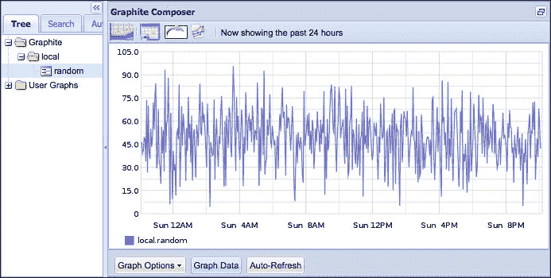
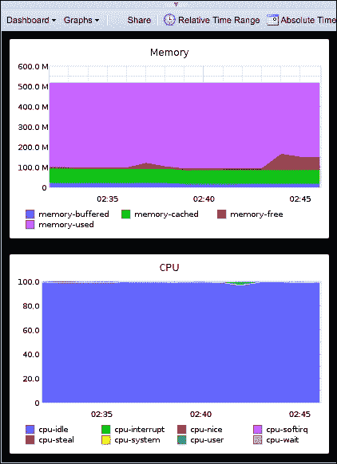
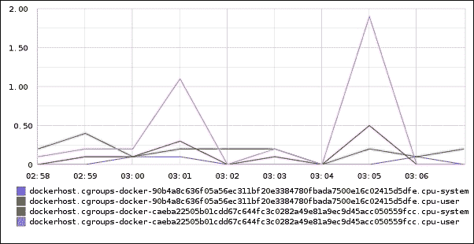
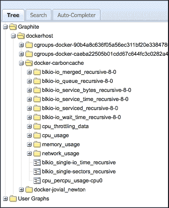
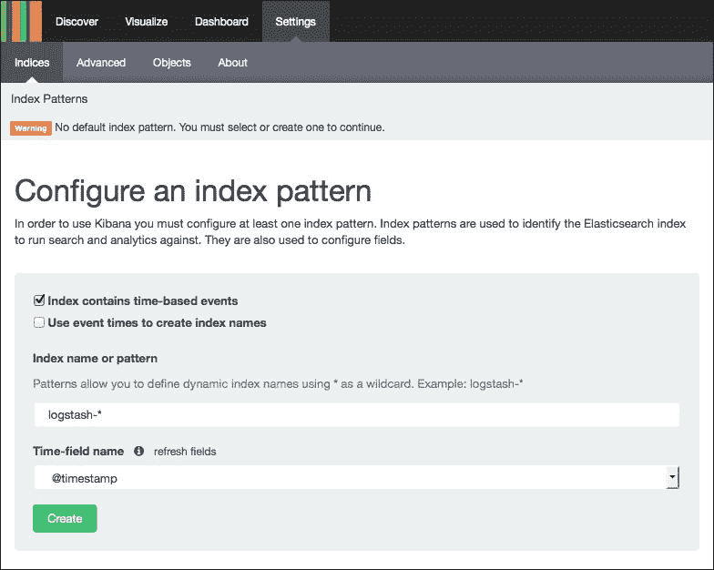
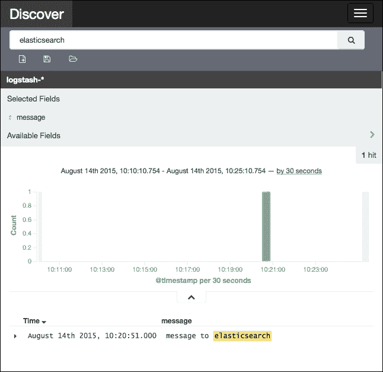
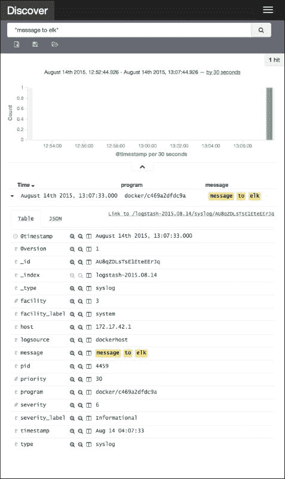

# 第四章：监控 Docker 主机和容器

我们现在已经知道了优化 Docker 部署的一些方法，也知道如何通过扩展来提高性能。但是我们如何知道我们的调优假设是否正确呢？能够监控我们的 Docker 基础设施和应用程序对于确定我们何时以及为什么需要进行优化非常重要。衡量系统的性能可以帮助我们识别其扩展极限，并据此进行调优。

除了监控 Docker 的低层次信息，衡量应用程序的业务相关性能同样重要。通过追踪应用程序的价值流，我们可以将业务相关的指标与系统层面的指标关联起来。这样，Docker 开发和运维团队就能够向业务同事展示 Docker 如何帮助节省组织成本并提高业务价值。

在本章中，我们将涵盖以下关于能够大规模监控 Docker 基础设施和应用程序的主题：

+   监控的重要性

+   在 Graphite 中收集监控数据

+   使用 collectd 监控 Docker

+   在 ELK 堆栈中合并日志

+   发送来自 Docker 的日志

# 监控的重要性

监控非常重要，因为它提供了关于我们构建的 Docker 部署的反馈来源。它可以回答关于我们的应用程序的一些问题，从低层次的操作系统性能到高层次的业务目标。通过在 Docker 主机中插入适当的监控工具，我们可以识别系统的状态。我们可以利用这个反馈源来判断我们的应用程序是否按最初计划的方式运行。

如果我们的初始假设不正确，我们可以利用反馈数据修正我们的计划，并通过调优 Docker 主机和容器或更新正在运行的 Docker 应用程序来调整系统。我们还可以使用相同的监控过程来识别系统部署到生产环境后出现的错误和 bug。

Docker 具有内置的日志记录和监控功能。默认情况下，Docker 主机会将 Docker 容器的标准输出和错误流存储为 JSON 文件，路径为 `/var/lib/docker/<container_id>/<container_id>-json.log`。`docker logs` 命令会请求 Docker 引擎守护进程读取此处文件的内容。

另一个监控工具是 `docker stats` 命令。该命令查询 Docker 引擎远程 API 的 `/containers/<container_id>/stats` 端点，报告关于运行容器的控制组的运行时统计信息，包括其 CPU、内存和网络使用情况。以下是 `docker stats` 命令报告上述指标的示例输出：

```
dockerhost$ docker run --name running –d busybox \
/bin/sh -c 'while true; do echo hello && sleep 1; done' dockerhost$ docker stats running
CONTAINER     CPU %   MEM USAGE/LIMIT  MEM %     NET I/O
running       0.00%   0 B/518.5 MB     0.00%     17.06 MB/119.8 kB

```

内置的 `docker logs` 和 `docker stats` 命令非常适合用来监控我们用于开发和小规模部署的 Docker 应用程序。当我们进入生产级别的 Docker 部署，管理数十个、数百个甚至数千个 Docker 主机时，这种方法就不再具备扩展性。因为我们无法登录到每一个 Docker 主机并输入 `docker logs` 和 `docker stats`。

一一操作还使得我们很难对整个 Docker 部署形成更全面的了解。而且，并不是每一个关心我们 Docker 应用性能的人都能登录到我们的 Docker 主机。仅仅处理应用业务方面的同事可能希望了解我们的 Docker 部署如何帮助组织实现目标，但他们不一定希望学习如何登录并在我们的基础设施中输入 Docker 命令。

因此，能够将我们 Docker 部署中的所有事件和度量数据整合到一个集中的监控基础设施中是非常重要的。它通过提供一个单一的查询点来让我们的运维团队能够了解系统的运行情况，从而帮助我们的运维实现规模化。一个集中的仪表盘还使得开发和运维团队以外的人，比如业务同事，能够访问我们的监控系统提供的反馈信息。接下来的章节将向你展示如何整合来自 `docker logs` 的信息，并收集来自数据源（如 `docker stats`）的统计数据。

# 收集度量数据到 Graphite

要开始监控我们的 Docker 部署，首先我们必须设置一个端点，将我们的监控数据发送到那里。Graphite 是一个流行的堆栈，用于收集各种度量数据。它的纯文本协议因其简单性而广受欢迎，许多第三方工具都能理解这个简单的协议。稍后我们将展示，在设置完 Graphite 后，如何轻松地向其发送数据。

Graphite 的另一个特点是它可以将收集到的数据呈现为图表。然后我们可以将这些图表整合到一起，构建一个仪表盘。最终我们构建的仪表盘将展示我们需要监控 Docker 应用程序的各种信息。

在本节中，我们将设置 Graphite 的以下组件，以创建一个最小化的堆栈：

+   **carbon-cache**：这是接收网络上传输的度量数据的 Graphite 组件。它实现了前面描述的简单纯文本协议。它还可以监听一种基于二进制的协议，叫做 pickle 协议，这是一种更先进但更小巧且优化过的格式，用于接收度量数据。

+   **whisper**：这是一个基于文件的有界时间序列数据库，carbon-cache 在其中持久化它接收到的指标。它的有界或固定大小特性使其成为监控的理想解决方案。随着时间的推移，我们监控的指标将不断积累。因此，我们的数据库大小将不断增加，你需要对其进行监控！然而，在实践中，我们大多数情况下关心的是在固定时间点之前监控我们的应用程序。基于这一假设，我们可以提前规划 whisper 数据库的资源需求，随着 Docker 应用程序的运行而不必过多考虑它。

+   **graphite-web**：该组件读取 whisper 数据库以渲染图表和仪表板。它还经过优化，可以通过查询 carbon-cache 端点实时创建此类可视化，显示尚未在 whisper 数据库中持久化的数据。

### 注意

carbon 中还有其他组件，如 carbon-aggregator 和 carbon-relay。这些组件对于在你测量的指标数量增长时有效地扩展 Graphite 至关重要。有关这些组件的更多信息，请访问 [`github.com/graphite-project/carbon`](https://github.com/graphite-project/carbon)。目前，我们将专注于仅部署 carbon-cache 来创建一个简单的 Graphite 集群。

接下来的几个步骤描述了如何部署 carbon-cache 和 whisper 数据库：

1.  首先，为 carbon 准备一个 Docker 镜像，以便在我们的 Docker 主机部署中使用。创建以下 `Dockerfile` 来准备此镜像：

    ```
    FROM debian:jessie

    RUN apt-get update && \
        apt-get --no-install-recommends \
            install -y graphite-carbon

    ENV GRAPHITE_ROOT /graphite

    ADD carbon.conf /graphite/conf/carbon.conf

    RUN mkdir -p $GRAPHITE_ROOT/conf && \
        mkdir -p $GRAPHITE_ROOT/storage && \
        touch $GRAPHITE_ROOT/conf/storage-aggregation.conf && \
        touch $GRAPHITE_ROOT/conf/storage-schemas.conf

    VOLUME /whisper
    EXPOSE 2003 2004 7002

    ENTRYPOINT ["/usr/bin/twistd", "--nodaemon", \
        "--reactor=epoll", "--no_save"]
    CMD ["carbon-cache"]
    ```

1.  接下来，构建我们之前创建的 `Dockerfile` 作为 `hubuser/carbon` 镜像，如下所示：

    ```
    dockerhost$ docker build -t hubuser/carbon .

    ```

1.  在 `carbon.conf` 配置文件中，我们将配置 carbon-cache 使用 Docker 卷 `/whisper` 作为 whisper 数据库。以下是描述此设置的内容：

    ```
    [cache]

    CARBON_METRIC_INTERVAL = 0
    LOCAL_DATA_DIR = /whisper
    ```

1.  在构建 `hubuser/carbon` 镜像后，我们将通过创建数据容器来准备一个 whisper 数据库。输入以下命令来完成此操作：

    ```
    dockerhost$ docker create --name whisper \--entrypoint='whisper database for graphite' \ hubuser/carbon

    ```

1.  最后，运行附加到我们之前创建的数据容器的 carbon-cache 端点。我们将使用自定义容器名称和公开端口，以便可以从中发送和读取指标，具体如下：

    ```
    dockerhost$ docker run --volumes-from whisper -p 2003:2003 \--name=carboncache hubuser/carbon

    ```

我们现在有了一个可以发送我们稍后收集的所有 Docker 相关指标的地方。为了利用我们存储的指标，我们需要一种方法来读取和可视化它们。我们将部署 `graphite-web` 来可视化我们 Docker 容器的运行情况。以下是在我们的 Docker 主机上部署 graphite-web 的步骤：

1.  构建 `Dockerfile` 为 `hubuser/graphite-web`，以准备一个 Docker 镜像来通过以下代码部署 graphite-web：

    ```
    FROM debian:jessie

    RUN apt-get update && \
        apt-get --no-install-recommends install -y \
            graphite-web \
            apache2 \
            libapache2-mod-wsgi

    ADD local_settings.py /etc/graphite/local_settings.py
    RUN ln -sf /usr/share/graphite-web/apache2-graphite.conf \
           /etc/apache2/sites-available/100-graphite.conf && \
        a2dissite 000-default && a2ensite 100-graphite && \
        mkdir -p /graphite/storage && \
        graphite-manage syncdb --noinput && \
        chown -R _graphite:_graphite /graphite

    EXPOSE 80
    ENTRYPOINT ["apachectl", "-DFOREGROUND"]
    ```

1.  上述 Docker 镜像引用了 `local_settings.py` 来配置 graphite-web。请添加以下注释来链接 carbon-cache 容器和 whisper 卷：

    ```
    import os
    # --link-from carboncache:carbon
    CARBONLINK_HOSTS = ['carbon:7002']
    # --volumes-from whisper
    WHISPER_DIR = '/whisper'

    GRAPHITE_ROOT = '/graphite'
    SECRET_KEY = os.environ.get('SECRET_KEY', 'replacekey')
    LOG_RENDERING_PERFORMANCE = False
    LOG_CACHE_PERFORMANCE = False
    LOG_METRIC_ACCESS = False
    LOG_DIR = '/var/log/graphite'
    ```

1.  在准备好 `Dockerfile` 和 `local_settings.py` 配置文件后，使用以下命令构建 `hubuser/graphite-web` Docker 镜像：

    ```
    dockerhost$ docker build -t hubuser/graphite-web .

    ```

1.  最后，运行与 carbon-cache 容器和 whisper 卷链接的 `hubuser/graphite-web` Docker 镜像，执行以下命令：

    ```
    dockerhost$ docker run --rm --env SECRET_KEY=somestring \--volumes-from whisper --link carboncache:carbon \-p 80:80 hubuser/graphite-web

    ```

    ### 注意

    `SECRET_KEY` 环境变量是将多个 graphite-web 实例组合在一起的必要组件，当你决定扩展时，它是必不可少的。更多 graphite-web 设置的相关信息可以在 [`graphite.readthedocs.org/en/latest/config-local-settings.html`](http://graphite.readthedocs.org/en/latest/config-local-settings.html) 找到。

现在我们已经完成了 Graphite 的部署，可以进行一些初步的测试，查看其实际运行效果。我们将通过向 whisper 数据库填充随机数据来进行测试。输入以下命令，将名为 `local.random` 的随机指标发送到 carbon-cache 端点：

```
dockerhost$ seq `date +%s` -60 $((`date +%s` - 24*60*60)) \| perl -n -e \'print "local.random ".  int(rand(100)) . " " .  $_' \| docker run --link carboncache:carbon -i --rm \busybox nc carbon 2003

```

最后，通过访问我们的 `hubuser/graphite-web` 的 composer URL [`dockerhost/compose`](http://dockerhost/compose) 来确认数据是否持久化。进入 **Tree** 选项卡，展开 `Graphite/local` 文件夹，获取 `random` 指标。以下是我们在 graphite-web 部署中看到的图表：



## 生产环境中的 Graphite

在生产环境中，随着我们在 Docker 部署中监控越来越多的指标，这种简单的 Graphite 配置将达到其极限。为了跟上监控指标数量的增加，我们需要对其进行扩展。为此，你需要以集群方式部署 Graphite。

为了扩展 carbon-cache 的指标处理能力，我们需要用 carbon-relay 和 carbon-aggregator 进行增强。为了让 graphite-web 更具响应性，我们需要将其与其他缓存组件（如 memcached）一起进行水平扩展。我们还需要添加另一个 graphite-web 实例，它连接到其他 graphite-web 实例，从而创建一个统一的指标视图。whisper 数据库将与 carbon-cache 和 graphite-web 一起共同部署，因此它会随着它们的扩展而自然扩展。

### 注意

有关如何在生产环境中扩展 Graphite 集群的更多信息，请访问 [`graphite.readthedocs.org`](http://graphite.readthedocs.org)。

# 使用 collectd 进行监控

我们已经完成了设置一个接收所有 Docker 相关数据的位置。现在，到了真正获取我们 Docker 应用程序相关数据的时候。在本节中，我们将使用 `collectd`，一个流行的系统统计收集守护进程。它是一个非常轻量且高性能的 C 程序，这使得它成为一种非侵入式监控软件，因为它不会消耗被监控系统的太多资源。由于其轻量性，它非常易于部署，所需的依赖很少。它有各种各样的插件，几乎可以监控我们系统的每个组件。

让我们开始监控我们的 Docker 主机。按照接下来的步骤安装`collectd`并将度量数据发送到我们的 Graphite 部署：

1.  首先，通过输入以下命令在我们的 Docker 主机上安装`collectd`：

    ```
    dockerhost$ apt-get install collectd-core

    ```

1.  接下来，创建一个最简化的`collectd`配置，将数据发送到我们的 Graphite 部署。你可能还记得之前我们暴露了 carbon-cache 的默认明文协议端口（`2003`）。在`/etc/collectd/collectd.conf`中写入以下配置项来设置：

    ```
    LoadPlugin "write_graphite"

    <Plugin write_graphite>
      <Node "carboncache">
        Host "dockerhost"
      </Node>
    </Plugin>
    ```

1.  现在，轮到我们从 Docker 主机上收集一些数据了。通过将以下几行添加到`/etc/collectd/collectd.conf`中，加载相应的`collectd`插件：

    ```
    LoadPlugin "cpu"
    LoadPlugin "memory"
    LoadPlugin "disk"
    LoadPlugin "interface"
    ```

1.  配置完成后，使用以下命令重启`collectd`：

    ```
    dockerhost$ systemctl restart collectd.service

    ```

1.  最后，让我们在 graphite-web 部署中创建一个可视化仪表盘，用来查看之前的度量数据。访问[`dockerhost/dashboard`](http://dockerhost/dashboard)，点击**Dashboard**，然后点击**编辑仪表盘**链接。系统会提示我们输入一个文本区域以放置仪表盘定义。将以下 JSON 文本粘贴到此文本区域，创建我们的初步仪表盘：

    ```
    [
      {
        "areaMode": "stacked",
        "yMin": "0",
        "target": [
          "aliasByMetric(dockerhost.memory.*)"
        ],
        "title": "Memory"
      },
      {
        "areaMode": "stacked",
        "yMin": "0",
        "target": [
          "aliasByMetric(dockerhost.cpu-0.*)"
        ],
        "title": "CPU"
      }
    ]
    ```

我们现在已经为 Docker 主机构建了一个基本的监控堆栈。上一节的最后一步将展示一个类似于以下屏幕截图的仪表盘：



## 收集与 Docker 相关的数据

现在，我们将测量一些基本的度量指标，这些指标决定了应用程序的性能。但是，如何深入了解在 Docker 主机中运行的容器呢？在我们的 Debian Jessie Docker 主机中，容器运行在`docker-[container_id].scope`控制组下。这些信息可以在 Docker 主机的 sysfs 路径`/sys/fs/cgroup/cpu,cpuacct/system.slice`中找到。幸运的是，`collectd`提供了一个`cgroups`插件，用于与先前暴露的 sysfs 信息接口。接下来的步骤将展示如何使用该插件来测量我们正在运行的 Docker 容器的 CPU 性能：

1.  首先，将以下行插入`/etc/collectd/collectd.conf`中：

    ```
    LoadPlugin "cgroups"

    <Plugin cgroups>
      CGroup "/^docker.*.scope/"
    </Plugin>
    ```

1.  接下来，使用以下命令重启 collectd：

    ```
    dockerhost$ systemctl restart collectd.service

    ```

1.  最后，等待几分钟，让 Graphite 从`collectd`接收到足够的度量数据，这样我们就可以初步了解如何可视化我们 Docker 容器的 CPU 度量。

现在，我们可以通过查询 Graphite 部署的渲染 API 上的`dockerhost.cgroups-docker*.*`度量指标，来查看 Docker 容器的 CPU 度量数据。以下是通过渲染 API URL `http://dockerhost/render/?target=dockerhost.cgroups-docker-*.*`生成的图像：



### 注意

更多关于`cgroups`插件的信息，可以在`collectd`文档页面中找到，链接为[`collectd.org/documentation/manpages/collectd.conf.5.shtml#plugin_cgroups`](https://collectd.org/documentation/manpages/collectd.conf.5.shtml#plugin_cgroups)。

当前，`cgroups` 插件仅测量我们运行的 Docker 容器的 CPU 度量。虽然有一些工作正在进行中，但在本书撰写时尚未准备好。幸运的是，有一个基于 Python 的 `collectd` 插件，它与 `docker stats` 进行接口。以下是设置该插件所需的步骤：

1.  首先，下载以下依赖项以便能够运行插件：

    ```
    dockerhost$ apt-get install python-pip libpython2.7

    ```

1.  接下来，从其 GitHub 页面下载并安装插件：

    ```
    dockerhost$ cd /opt
    dockerhost$ git clone https://github.com/lebauce/docker-collectd-plugin.gitdockerhost$ cd docker-collectd-plugindockerhost$ pip install -r requirements.txt

    ```

1.  将以下行添加到 `/etc/collectd/collectd.conf` 以配置插件：

    ```
    TypesDB "/opt/docker-collectd-plugin/dockerplugin.db"
    LoadPlugin python

    <Plugin python>
      ModulePath "/opt/docker-collectd-plugin"
      Import "dockerplugin"

      <Module dockerplugin>
        BaseURL "unix://var/run/docker.sock"
        Timeout 3
      </Module>
    </Plugin>
    ```

1.  最后，通过以下命令重启 `collectd` 以反映前述配置更改：

    ```
    dockerhost$ systemctl restart collectd.service

    ```

### 注意

有一种情况，我们不希望仅为了查询 Docker 容器的统计信息端点而安装完整的 Python 堆栈。在这种情况下，我们可以使用 `collectd` 的低级插件 `curl_json` 来收集容器的统计数据。我们可以将其配置为向容器统计端点发起请求，并将返回的 JSON 解析为一组 `collectd` 度量。有关该插件如何工作的更多信息，可以参考 [`collectd.org/documentation/manpages/collectd.conf.5.shtml#plugin_curl_json`](https://collectd.org/documentation/manpages/collectd.conf.5.shtml#plugin_curl_json)。

在下图中，我们可以查看 `cgroups` 插件从我们的 Graphite 部署 `http://docker/compose` 中提供的度量：



### 在 Docker 中运行 collectd

如果我们希望像部署应用程序一样部署 `collectd` 配置，我们也可以将其运行在 Docker 中。以下是一个初始的 `Dockerfile`，我们可以用它开始将 `collectd` 部署为正在运行的 Docker 容器：

```
FROM debian:jessie

RUN apt-get update && \
    apt-get --no-install-recommends install -y \
        collectd-core

ADD collectd.conf /etc/collectd/collectd.conf
ENTRYPOINT ["collectd", "-f"]
```

### 注意

大多数插件查看 `/proc` 和 `/sys` 文件系统。为了让 `collectd` 在 Docker 容器内访问这些文件，我们需要将它们挂载为 Docker 卷，如 `--volume /proc:/host/proc`。然而，目前大多数插件仍然读取硬编码的 `/proc` 和 `/sys` 路径。关于使其可配置的讨论正在进行中。请参考此 GitHub 页面以跟踪进展：[`github.com/collectd/collectd/issues/1169`](https://github.com/collectd/collectd/issues/1169)。

# 在 ELK 堆栈中合并日志

我们的 Docker 主机和容器的所有状态并不能立即通过我们的监控解决方案（collectd 和 Graphite）查询到。有些事件和度量仅以原始文本行的形式出现在日志文件中。我们需要将这些原始且无结构的日志转化为有意义的度量。类似于原始度量，我们以后可以通过分析提出更高层次的问题，了解在我们的基于 Docker 的应用程序中发生了什么。

ELK 堆栈是 Elastic 提供的一套流行的组合工具，解决了这些问题。该缩写中的每个字母代表其组件。以下是每个组件的描述：

+   **Logstash**：Logstash 是用于收集和管理日志与事件的组件。它是我们用来收集来自不同日志源的所有日志的中心点，例如我们部署中的多个 Docker 主机和容器。我们还可以使用 Logstash 来转换和注释接收到的日志。这使我们能够在后续探索日志的更丰富特性时进行搜索。

+   **Elasticsearch**：Elasticsearch 是一个分布式搜索引擎，具有高度可扩展性。它的分片功能使我们能够随着 Docker 容器不断发送更多日志而扩展日志存储。它的数据库引擎是面向文档的，这使我们能够在继续发掘关于我们在大型 Docker 部署中管理的事件的更多洞察时，灵活地存储和注释日志。

+   **Kibana**：Kibana 是一个 Elasticsearch 的分析和搜索仪表盘。它的简便性使我们能够为 Docker 应用程序创建仪表盘。然而，Kibana 也非常灵活，可以进行定制，因此我们可以构建出可以为需要了解我们基于 Docker 的应用程序的人提供有价值洞察的仪表盘，无论是低级的技术细节还是更高层次的业务需求。

在本节的剩余部分，我们将设置这些组件，并将我们的 Docker 主机和容器日志发送到它们。接下来的几个步骤将描述如何构建 ELK 堆栈：

1.  首先，在我们的 Docker 主机上启动官方的 Elasticsearch 镜像。我们将为其指定一个容器名称，以便后续步骤中可以轻松链接它，如下所示：

    ```
    dockerhost$ docker run -d --name=elastic elasticsearch:1.7.1

    ```

1.  接下来，我们将通过将其链接到前面创建的 Elasticsearch 容器来运行 Kibana 的官方 Docker 镜像。请注意，我们将公开暴露的端口 `5601` 映射到 Docker 主机中的端口 `80`，以便 Kibana 的 URL 更加简洁，如下所示：

    ```
    dockerhost$ docker run -d --link elastic:elasticsearch \-p 80:5601 kibana:4.1.1

    ```

1.  现在，准备我们的 Logstash Docker 镜像和配置。准备以下的 `Dockerfile` 来创建 Docker 镜像：

    ```
    FROM logstash:1.5.3

    ADD logstash.conf /etc/logstash.conf
    EXPOSE 1514/udp
    ```

1.  在此 Docker 镜像中，将 Logstash 配置为 Syslog 服务器。这解释了在前面的 `Dockerfile` 中暴露的 UDP 端口。至于 `logstash.conf` 文件，以下是使其作为 Syslog 服务器监听的基本配置。配置的后半部分表明它将日志发送到名为 `elasticsearch` 的 Elasticsearch。我们将在链接先前运行的 Elasticsearch 容器时使用此作为主机名：

    ```
    input {
      syslog {
        port => 1514
        type => syslog
      }
    }

    output {
      elasticsearch {
        host => "elasticsearch"
      }
    }
    ```

    ### 提示

    Logstash 拥有大量插件，可以读取各种日志数据源。特别是，它有一个 `collectd` 编解码器插件。通过这个插件，我们可以使用 ELK 堆栈来代替 Graphite 监控我们的指标。

    更多关于如何进行此设置的信息，请访问 [`www.elastic.co/guide/en/logstash/current/plugins-codecs-collectd.html`](https://www.elastic.co/guide/en/logstash/current/plugins-codecs-collectd.html)。

1.  现在我们已经准备好了所有需要的文件，输入以下命令将其创建为 `hubuser/logstash` Docker 镜像：

    ```
    dockerhost$ docker build -t hubuser/logstash .

    ```

1.  使用以下命令运行 Logstash。请注意，我们正在将端口`1514`暴露给 Docker 主机，作为 Syslog 端口。我们还链接了之前创建的名为 `elastic` 的 Elasticsearch 容器。目标名称设置为 `elasticsearch`，因为它是我们在 `logstash.conf` 中配置的 Elasticsearch 主机名，用于将日志发送到该主机：

    ```
    dockerhost$ docker run --link elastic:elasticsearch -d \-p 1514:1514/udp hubuser/logstash -f /etc/logstash.conf

    ```

1.  接下来，让我们配置 Docker 主机的 Syslog 服务，将日志转发到 Logstash 容器。作为基本配置，我们可以设置 Rsyslog 将所有日志转发。这将包括来自 Docker 引擎守护进程的日志。为此，创建一个 `/etc/rsyslog.d/100-logstash.conf` 文件，并包含以下内容：

    ```
    *.* @dockerhost:1514
    ```

1.  最后，通过输入以下命令重启 Syslog，以加载前一步骤中的更改：

    ```
    dockerhost$ systemctl restart rsyslog.service

    ```

我们现在已经有了一个基本运行的 ELK 堆栈。现在让我们通过发送一条消息到 Logstash 并查看它是否出现在 Kibana 仪表板中来进行测试：

1.  首先，输入以下命令发送一条测试消息：

    ```
    dockerhost$ logger -t test 'message to elasticsearch'

    ```

1.  接下来，访问我们的 Kibana 仪表板，访问 `http://dockerhost`。Kibana 现在会要求我们设置默认索引。使用以下默认值并点击 **Create** 开始索引：

1.  访问 `http://dockerhost/#discover` 并在搜索框中输入 `elasticsearch`。以下截图显示了我们之前生成的 Syslog 消息：

    ### 注意

    在 ELK 堆栈上，我们可以做很多事情来优化日志基础设施。我们可以添加 Logstash 插件和过滤器来注释从 Docker 主机和容器接收到的日志。随着日志需求的增加，Elasticsearch 可以进行扩展和调优，以提高其容量。我们可以创建 Kibana 仪表板来共享指标。欲了解更多如何调优 ELK 堆栈的细节，请访问 Elastic 的 [`www.elastic.co/guide`](https://www.elastic.co/guide)。

# 转发 Docker 容器日志

现在我们已经有了一个基本功能的 ELK 堆栈，我们可以开始将 Docker 日志转发到它。从 Docker 1.7 版本开始，Docker 支持自定义日志驱动程序。在这一部分，我们将配置 Docker 主机使用 syslog 驱动程序。默认情况下，Docker 的 Syslog 事件会发送到 Docker 主机的 Syslog 服务，并且由于我们已将 Syslog 配置为转发到我们的 ELK 堆栈，因此我们可以在那里看到容器日志。按照以下步骤开始在 ELK 堆栈中接收容器日志：

1.  Docker 引擎服务通过 Systemd 在我们的 Debian Jessie 主机上配置。为了更新它在 Docker 主机中的运行方式，创建一个名为 `/etc/systemd/system/docker.service.d/10-syslog.conf` 的 Systemd 单元文件，并包含以下内容：

    ```
    [Service]
    ExecStart=
    ExecStart=/usr/bin/docker daemon -H fd:// \
        --log-driver=syslog
    ```

1.  通过重新加载 Systemd 配置，应用我们将如何在主机中运行 Docker 的更改。以下命令将完成此操作：

    ```
    dockerhost$ systemctl daemon-reload

    ```

1.  最后，通过执行以下命令重启 Docker 引擎守护进程：

    ```
    dockerhost$ systemctl restart docker.service

    ```

1.  如果我们希望对 Docker 容器的日志进行自定义注释，可选择应用任何 Logstash 过滤。

现在，任何来自我们 Docker 容器的标准输出和错误流都应该被捕获到我们的 ELK 堆栈中。我们可以做一些初步测试，以确认设置是否有效。输入以下命令从 Docker 创建一个测试消息：

```
dockerhost$ docker run --rm busybox echo message to elk

```

### 注意

`docker run` 命令还支持 `--log-driver` 和 `--log-opt=[]` 命令行选项，仅为我们要运行的容器设置日志驱动程序。我们可以使用它进一步调整我们在 Docker 主机中运行的每个 Docker 容器的日志策略。

输入前面的命令后，我们的消息现在应该存储在 Elasticsearch 中。我们可以访问 `http://dockerhost` 上的 Kibana 端点，并在文本框中搜索 `message to elk`。它应该会显示我们之前发送的消息的 Syslog 条目。以下截图是 Kibana 搜索结果应该显示的内容：



在前面的截图中，我们可以看到我们发送的消息。还有关于 Syslog 的其他信息。Docker 的 Syslog 驱动程序默认将设施和严重性注释设置为**系统**和**信息**，分别对应。除此之外，前面的程序被设置为**docker/c469a2dfdc9a**。

**c469a2dfdc9a** 字符串是我们之前运行的 busybox 镜像的容器 ID。Docker 容器的默认程序标签设置为 `docker/<container-id>` 格式。所有前述的默认注释可以通过向 `--log-opt=[]` 选项传递参数来配置。

### 注意

除了 Syslog 和 JSON 文件日志驱动程序，Docker 还支持将日志发送到多个其他端点。有关所有日志驱动程序及其使用指南的更多信息，可以在 [`docs.docker.com/reference/logging`](https://docs.docker.com/reference/logging) 中找到。

# 其他监控和日志解决方案

还有一些其他解决方案可以部署来监控和记录基础设施，以支持基于 Docker 的应用程序。其中一些已经内建支持 Docker 容器的监控。其他的则需要与我们之前展示的其他解决方案结合使用，因为它们仅专注于监控或日志的特定部分。

对于其他一些，我们可能需要做一些变通方法。然而，它们的好处显然超过了我们需要做出的妥协。虽然以下列表并不详尽，但这些是我们可以探索的一些堆栈，以创建我们的日志记录和监控解决方案：

+   cAdvisor ([`github.com/google/cadvisor`](http://github.com/google/cadvisor))

+   InfluxDB ([`influxdb.com`](http://influxdb.com))

+   Sensu ([`sensuapp.org`](http://sensuapp.org))

+   Fluentd ([`www.fluentd.org/`](http://www.fluentd.org/))

+   Graylog ([`www.graylog.org`](http://www.graylog.org))

+   Splunk ([`www.splunk.com`](http://www.splunk.com))

有时候，我们的运营人员和开发者在运行和开发 Docker 应用时还不够成熟，或者他们不想集中精力维护这些监控和日志基础设施。有几个托管的监控和日志平台可以供我们使用，这样我们就可以专注于实际编写和提升 Docker 应用的性能。

其中一些与现有的监控和日志代理（如 Syslog 和 collectd）兼容。对于其他一些，我们可能需要下载并部署它们的代理，才能将事件和指标转发到它们的托管平台。以下是我们可能希望考虑的一些解决方案的非详尽列表：

+   New Relic ([`www.newrelic.com`](http://www.newrelic.com))

+   Datadog ([`www.datadoghq.com`](http://www.datadoghq.com))

+   Librato ([`www.librato.com`](http://www.librato.com))

+   Elastic's Found ([`www.elastic.co/found`](http://www.elastic.co/found))

+   Treasure Data ([`www.treasuredata.com`](http://www.treasuredata.com))

+   Splunk Cloud ([`www.splunk.com`](http://www.splunk.com))

# 总结

我们现在知道，以可扩展和可访问的方式监控 Docker 部署是很重要的。我们部署了 collectd 和 Graphite 来监控 Docker 容器的指标。我们推出了 ELK 堆栈，用于整合来自不同 Docker 主机和容器的日志。

除了原始的指标和事件，了解这些数据对我们的应用意味着什么也很重要。Graphite-web 和 Kibana 允许我们创建自定义的仪表板和分析，以提供关于 Docker 应用的洞察。凭借这些监控工具和技能，我们应该能够在生产环境中良好地操作和运行我们的 Docker 部署。

在下一章，我们将开始进行性能测试，并基准测试我们的 Docker 应用在高负载下的表现。我们应该能够利用我们部署的监控系统来观察和验证我们的性能测试活动。
