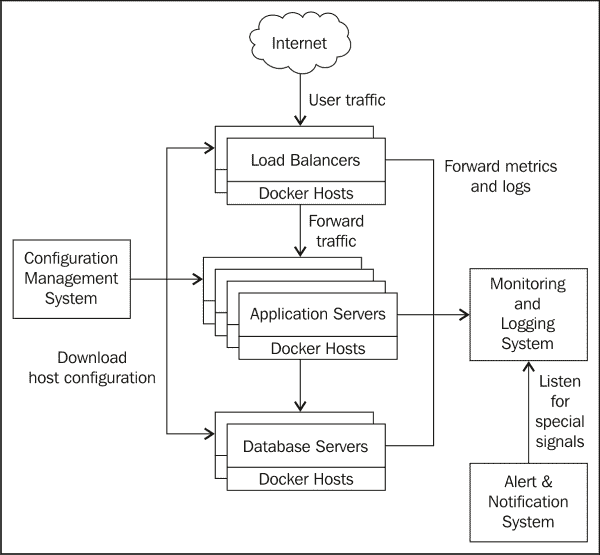
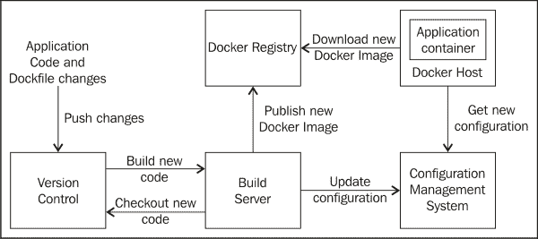
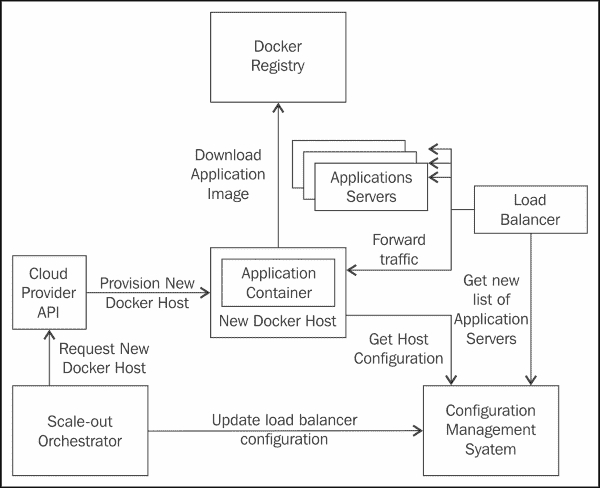

# 第八章：进入生产环境

Docker 起源于 dotCloud 的 PaaS，满足了 IT 部门在快速、可扩展的方式中开发和部署 Web 应用程序的需求。这是为了跟上 Web 使用的日益加速的步伐。保持我们的 Docker 容器在生产环境中持续运行绝非易事。

在本章中，我们将总结你所学到的关于优化 Docker 的内容，并阐明它如何与我们在生产环境中操作 Web 应用程序相关。内容包括以下主题：

+   执行 Web 操作

+   使用 Docker 支持我们的应用程序

+   部署应用程序

+   扩展应用程序

+   进一步阅读关于 Web 操作的一般知识

# 执行 Web 操作

让 Web 应用程序在互联网上 24/7 全天候运行，既是软件开发上的挑战，也是系统管理上的挑战。Docker 将自己定位为连接这两个领域的纽带，通过创建可以一致构建和部署的 Docker 镜像，来实现这两者的结合。

然而，Docker 并不是 Web 的灵丹妙药。随着 Web 应用程序的日益复杂化，仍然需要了解软件开发和系统管理的基本概念。这种复杂性自然地出现，因为如今，特别是在互联网技术的推动下，Web 应用程序的数量变得更加普及，深入人们的生活。

处理保持 Web 应用程序持续运行的复杂性涉及掌握 Web 操作的方方面面，正如任何通向精通的道路一样，Theo Schlossnagle 将其归结为四个基本追求：知识、工具、经验和纪律。*知识*指的是像海绵一样吸收互联网上、在会议和技术交流会上获得的关于 Web 操作的信息。理解这些信息，并知道如何从噪音中筛选出有价值的信号，将帮助我们在生产环境中解决应用架构问题。随着 Docker 和 Linux 容器的日益普及，了解支撑它们的不同技术并深入学习其基础非常重要。在第七章，*容器故障排除*一章中，我们展示了常规的 Linux 调试工具在调试运行中的 Docker 容器时依然非常有用。通过了解容器如何与 Docker 主机的操作系统进行交互，我们能够调试 Docker 中出现的问题。

第二个方面是掌握我们的*工具*。本书基本围绕如何掌握 Docker 的使用展开，探讨了 Docker 的工作原理以及如何优化其使用。在第二章，*优化 Docker 镜像*中，我们学习了如何根据 Docker 构建镜像并使用其底层的写时复制文件系统运行容器的方式来优化 Docker 镜像。这一过程得到了我们在 Web 运维中对于为何优化 Docker 镜像在可扩展性和可部署性方面至关重要的知识支持。掌握如何有效使用 Docker 并非一蹴而就。这种掌握只能通过在生产环境中持续使用 Docker 的实践来获得。没错，我们可能会在凌晨 2 点因第一次将 Docker 部署到生产环境中而接到报警，但随着时间的推移，我们通过不断使用获得的经验将使 Docker 成为我们身体和感官的延伸，正如 Schlossnagle 所说。

通过应用知识并持续使用我们的工具，我们获得了可以在未来借鉴的*经验*。这帮助我们根据过去做出的错误决策做出正确的判断。这里是容器技术的理论与在生产环境中运行 Docker 的实践碰撞的地方。Schlossnagle 提到了在 Web 运维中获得经验的挑战，以及如何从错误判断中生还并从中汲取经验。他建议拥有有限的环境，以便错误决策的影响最小化。Docker 是获得这种类型经验的最佳场所。通过拥有标准化的、随时可以部署的 Docker 镜像，初级 Web 运维工程师可以拥有自己的实验环境，从错误中学习和成长。而且，由于 Docker 环境在向生产环境推进时非常相似，这些工程师将能够利用自己已经积累的经验。

掌握 Web 操作的最后一部分是*自律*。然而，作为一个相对年轻的学科，这些过程尚未得到很好的定义。即使有了 Docker，人们也花了几年时间才意识到容器技术的最佳使用方式。在此之前，将整个厨房用具都包含在 Docker 镜像中是非常常见的做法。然而，正如我们在第二章，*优化 Docker 镜像*，中看到的，减少 Docker 镜像的体积有助于管理我们必须调试的应用程序的复杂性。这使得在第七章，*故障排除容器*，中的调试体验更加简单，因为我们需要考虑的组件和因素更少。使用 Docker 的这些技巧并不是通过阅读 Docker 博客（好吧，有些是）就能一蹴而就的。它涉及到持续接触 Docker 社区的知识，以及在各种生产环境中实践使用 Docker。

在接下来的部分中，我们将展示使用 Docker 容器技术的理论与实践如何帮助我们运营 Web 应用。

# 使用 Docker 支持 Web 应用

下图展示了一个典型的 Web 应用架构。我们有一个负载均衡层，它接收来自互联网的流量，然后这些流量，通常由用户请求组成，将以负载均衡的方式转发到一组 Web 应用服务器。根据请求的性质，Web 应用可能会从持久存储层获取一些状态，类似于数据库服务器：

如前图所示，每一层都在 Docker 容器中运行，并部署在 Docker 主机上。通过这种每个组件的布局，我们可以利用 Docker 一致的方式来部署负载均衡器、应用程序和数据库，正如我们在第二章，*优化 Docker 镜像*，和第六章，*负载均衡*中所做的那样。然而，除了每个 Docker 主机中的 Docker 守护进程，我们还需要支持基础设施来以可扩展的方式管理和观察我们整个 Web 架构的堆栈。在右侧，我们可以看到每个 Docker 主机都会将诊断信息——例如，应用程序和系统事件，如日志消息和度量指标——发送到我们的集中式日志记录和监控系统。我们在第四章，*监控 Docker 主机和容器*中部署了这样的系统，当时我们部署了 Graphite 和 ELK 堆栈。此外，可能还有另一个系统监听日志和度量中的特定信号，并向负责我们基于 Docker 的 Web 应用堆栈操作的工程师发送警报。这些事件可能与关键事件相关，比如我们应用程序的可用性和性能，这些问题需要我们采取行动以确保我们的应用程序按照预期满足业务需求。我们使用内部管理系统（如 Nagios）或第三方系统（如 PagerDuty）来处理我们的 Docker 部署，及时向我们发出警报，例如在凌晨 2 点唤醒我们进行更深入的监控和故障排除，就像在第四章，*监控 Docker 主机和容器*，和第七章，*故障排除容器*中所提到的那样。

图的左侧包含了配置管理系统。这是每个 Docker 主机下载所需配置的地方，以确保它能够正常工作。在第三章，*使用 Chef 自动化 Docker 部署*中，我们使用 Chef 服务器存储 Docker 主机的配置。它包含了 Docker 主机在我们架构中的角色等信息。Chef 服务器存储了哪些 Docker 容器需要在每个层中运行，以及如何使用我们编写的 Chef 配方来运行它们。最后，配置管理系统还告诉我们的 Docker 主机 Graphite 和 Logstash 监控和日志记录的端点位置。

总的来说，除了 Docker 外，还需要各种组件来支持我们生产环境中的 web 应用程序。Docker 使我们能够轻松地设置这些基础设施，因为它在部署容器时具有速度和灵活性。然而，我们不应该忽视对这些支持基础设施的研究。在接下来的章节中，我们将通过你在前面章节中学到的技能，了解如何在 Docker 中部署 web 应用程序的支持基础设施。

# 部署应用程序

在调优 Docker 容器性能时，一个重要的组件是反馈，它能告诉我们是否正确地改善了我们的 web 应用程序。Graphite 和 ELK 堆栈的部署在第四章，*监控 Docker 主机和容器*，让我们能够看到在基于 Docker 的 web 应用程序中所做的更改所产生的效果。虽然收集反馈很重要，但更重要的是及时收集反馈。因此，我们的 Docker 容器的部署需要以快速和可扩展的方式进行。正如我们在第三章，*使用 Chef 自动化 Docker 部署*，中所做的那样，能够自动配置 Docker 主机是实现快速和自动化部署系统的重要组件。其余组件在以下图表中描述：  

每当我们提交应用程序代码或描述其运行和构建方式的`Dockerfile`的更改时，我们需要支持的基础设施将这一更改传播到我们的 Docker 主机。在前面的图示中，我们可以看到，提交到版本控制系统（如 Git）的更改会触发构建新版本代码的操作。通常通过 Git 的 postreceive 钩子以 shell 脚本的形式完成此操作。这些触发器会被构建服务器接收，例如 Jenkins。传播更改的步骤类似于我们在第六章中实施的蓝绿部署过程，*负载均衡*。在接收到构建我们提交的新更改的触发信号后，Jenkins 会查看我们代码的新版本，并运行`docker build`来创建 Docker 镜像。构建完成后，Jenkins 会将新的 Docker 镜像推送到 Docker 注册表（例如 Docker Hub），这正如我们在第二章，*优化 Docker 镜像*中设置的那样。此外，它还会通过更新我们在第三章，*使用 Chef 自动化 Docker 部署*中布置的 Chef 服务器配置管理系统中的条目，间接更新目标 Docker 主机。借助 Chef 服务器和 Docker 注册表中可用的更改工件，我们的 Docker 主机现在会注意到新的配置，并在 Docker 容器中下载、部署并运行我们 Web 应用程序的新版本。

在下一节中，我们将讨论如何使用类似的过程来扩展我们的 Docker 应用。

# 扩展应用

当我们从监控系统收到警报（如在第四章，*监控 Docker 主机和容器*中所述）提示运行我们 Web 应用程序的 Docker 容器池未加载时，就是时候进行扩展了。我们通过在第六章，*负载均衡*中使用负载均衡器来实现这一目标。下图展示了我们在第六章，*负载均衡*中运行的命令的高层架构：

一旦我们决定进行扩展并添加一个额外的 Docker 主机，我们可以通过一个扩展协调器组件来自动化这个过程。这可以是一系列简单的 Shell 脚本，我们将把它们安装在构建服务器中，例如 Jenkins。该协调器将基本上请求云提供商 API 创建一个新的 Docker 主机。然后，这个请求将配置 Docker 主机并运行初始引导脚本，从我们的配置管理系统中下载配置，这部分内容在第三章，*使用 Chef 自动化 Docker 部署*中有详细说明。这将自动设置 Docker 主机，从 Docker 注册表下载我们的应用程序的 Docker 镜像。在整个配置过程完成后，我们的扩展协调器将更新 Chef 服务器中的负载均衡器，添加新的应用服务器列表以转发流量。因此，下次`chef-client`在负载均衡 Docker 主机中轮询 Chef 服务器时，它将添加新的 Docker 主机并开始将流量转发到该主机。

正如我们所注意到的，学习如何自动化设置 Docker 主机在第三章，*使用 Chef 自动化 Docker 部署*，对于实现我们在第六章，*负载均衡*中所做的可扩展负载均衡架构设置至关重要。

# 进一步阅读

帮助我们的 Web 应用程序使用 Docker 的支持架构仅仅是表面上的一点。 本章中的基本概念将在以下书籍中详细描述：

+   *Web Operations: Keeping the Data On Time*，由 J. Allspaw 和 J. Robbins 编辑。2010 年，O'Reilly Media 出版。

+   *Continuous Delivery*，由 J. Humble 和 D. Farley 编著。2010 年，Addison-Wesley 出版。

+   *Jenkins: The Definitive Guide*，J. F. Smart。2011 年，O'Reilly Media 出版。

+   *The Art of Capacity Planning: Scaling Web Resources*，J. Allspaw。2008 年，O'Reilly Media 出版。

+   *Pro Git*，S. Chacon 和 B. Straub。2014 年，Apress 出版。

# 总结

在本书中，你学到了很多关于 Docker 如何工作的知识。除了 Docker 的基础知识外，我们还回顾了一些关于 Web 操作的基本概念，以及它如何帮助我们实现 Docker 的全部潜力。你掌握了 Docker 和操作系统的关键概念，以便更深入地理解背后发生的事情。你现在知道了我们的应用程序是如何从代码走向 Docker 主机操作系统中的实际调用的。你学到了很多有关在生产环境中以可扩展和可管理的方式部署和排除 Docker 容器故障的工具。

然而，这不应阻止你继续开发和实践使用 Docker 在生产环境中运行我们的 web 应用程序。我们不应害怕犯错，而应该在最佳实践中积累经验，逐步掌握在生产环境中运行 Docker 的方法。随着 Docker 社区的发展，这些实践也在通过社区的集体经验不断演进。因此，我们应该继续并保持规律性地学习我们从一开始就逐步掌握的基础知识。不要犹豫，在生产环境中使用 Docker！
