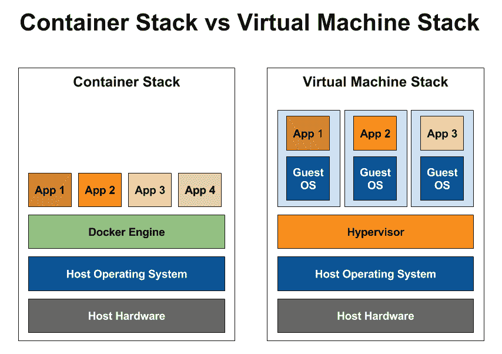
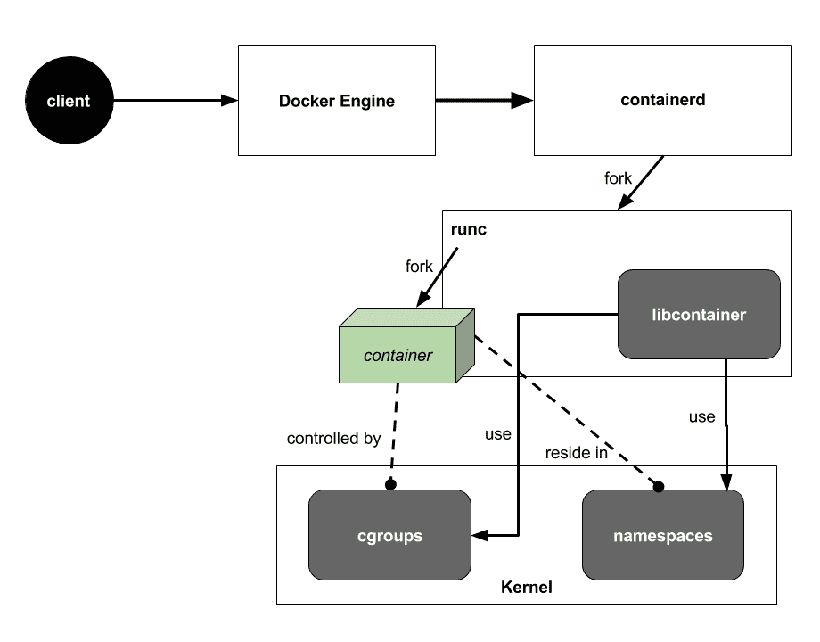
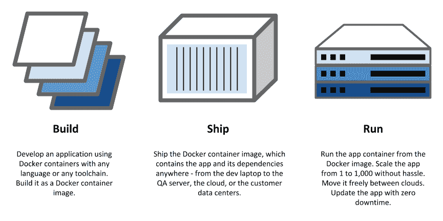
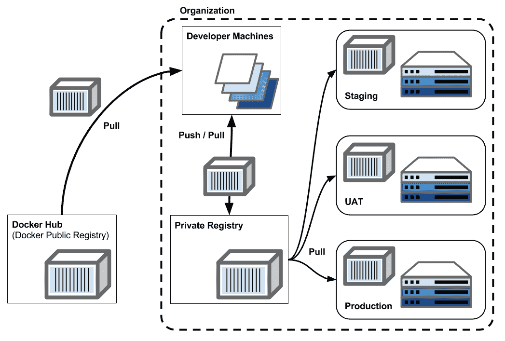
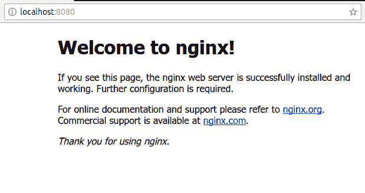
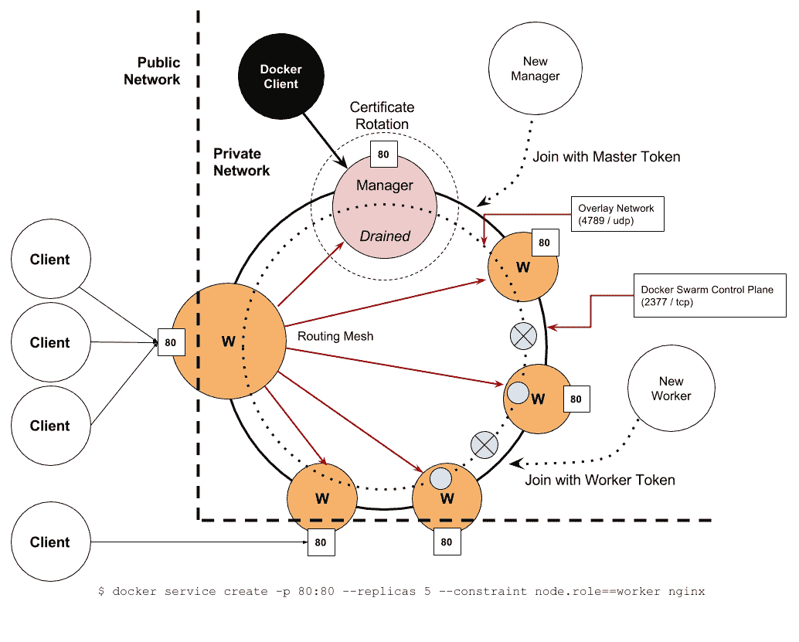
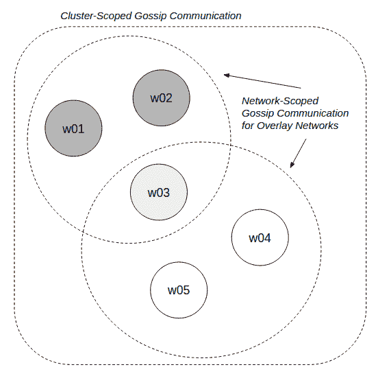
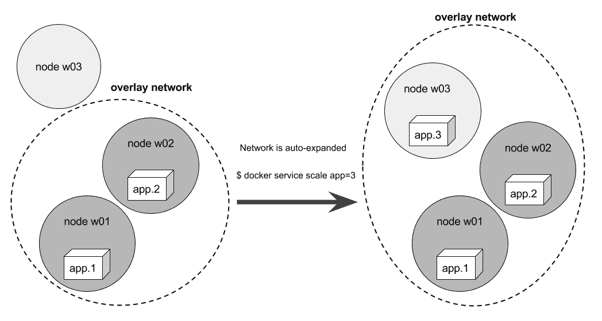

# 第二章：Docker 和 Swarm 集群

本章将回顾容器技术，并介绍 Docker 及其编排引擎，以及 Docker Swarm 模式。然后，我们将讨论为什么需要 Docker 基础设施来部署和运行无服务器（serverless）和函数即服务（FaaS）应用。 本章涵盖的主题如下：

+   容器与 Docker

+   设置 Docker Swarm 集群

+   使用 Docker 执行容器网络操作

+   为什么 Docker 适合无服务器和 FaaS 基础设施

# 什么是容器？

在讨论 Docker 之前，最好先了解一下软件容器背后的技术。

虚拟机是一种常见的虚拟化技术，并已被云服务提供商和企业广泛采用。实际上，软件容器（简称容器）也是一种虚拟化技术，但它们与虚拟机有所不同。关键的区别在于每个容器共享主机机器的内核，而每个虚拟机都有自己独立的内核。基本上，容器在操作系统级别使用虚拟化技术，而不是*虚拟机监控程序*。下图展示了容器和虚拟机堆栈的比较：



图 2.1：容器与虚拟机的对比

Linux 的容器技术依赖于两个重要的内核功能，**命名空间**和**控制组**（cgroups）。命名空间将一个进程隔离，使其拥有自己的一组全局资源，如进程 ID（PID）和网络。控制组或控制组提供了一种计量和限制资源的机制，如 CPU 使用率、内存、块 I/O 和网络带宽：



图 2.2：Linux 能力—容器使用的命名空间和控制组

使用 Linux 的**命名空间**和**控制组**（cgroups）功能的核心引擎叫做**runC**。它是一个用于启动和运行容器的工具，采用**开放容器倡议**（**OCI**）格式。Docker 在起草这个规范中起了重要作用，因此 Docker 容器镜像与 OCI 规范兼容，因此可以通过 runC 运行。Docker 引擎本身在底层使用*runC*来启动每个容器。

# 什么是 Docker？

过去，容器的管理和使用相当困难。Docker 基本上是一套帮助我们准备、管理和执行容器的技术。在虚拟机的世界里，我们需要一个虚拟机监控程序（hypervisor）来处理所有虚拟机实例。类似地，在容器的世界里，我们使用 Docker 作为*容器引擎*来处理与容器相关的一切事务。

不可否认，Docker 是目前最流行的容器引擎。使用 Docker 时，我们遵循 Docker 本身推荐的三个概念：构建（build）、运输（ship）和运行（run）。

+   **Build**-**Ship**-**Run**的工作流程是由 Docker 的理念优化的。在**Build**步骤中，我们可以快速构建和销毁容器镜像。作为开发者，我们可以将容器构建步骤作为我们开发周期的一部分。

+   在**Ship**步骤中，我们将容器镜像运送到不同的地方，从开发笔记本到 QA 服务器，再到预生产服务器。我们将容器镜像发送到公共集线器存储，或者存储到我们公司内部的私有注册中心。最终，我们将容器镜像送到生产环境中运行。

+   在**Run**步骤中，Docker 帮助我们使用 Swarm 集群准备生产环境。我们从容器镜像启动容器。我们可以调度容器在集群中的特定部分运行，并设置一些特定约束。我们使用 Docker 命令管理容器的生命周期：



图 2.3：Build-ship-run

# 安装 Docker

在开始构建-运送-运行步骤之前，我们需要在机器上安装 Docker。在 Linux 上，我们使用经典的安装方法，**Docker 社区版**（**CE**或**Docker-CE**）：

```
$ curl -sSL https://get.docker.com | sudo bash
```

本书中，我们将使用 Debian 或 Ubuntu 机器来演示 Docker。在 Debian/Ubuntu 机器上，我们将通过`apt-get`获取 Docker 的最稳定版本（截至写作时），并将其降级到版本 17.06.2。如果我们已经有了更新版本的 Docker，例如 17.12 或 18.03，它将被降级到 17.06.2：

```
$ sudo apt-get install docker-ce=17.06.2~ce-0~ubuntu
```

对于 macOS 和 Windows 系统，我们可以从 Docker 官网下载安装 Docker：

+   Docker for Mac: [`www.docker.com/docker-mac`](https://www.docker.com/docker-mac)

+   Docker for Windows: [`www.docker.com/docker-windows`](https://www.docker.com/docker-windows)

要检查已安装的 Docker 版本，我们可以使用`docker version`命令：

```

$ docker version

Client:
 Version: 17.06.2-ce
 API version: 1.30
 Go version: go1.8.3
 Git commit: cec0b72
 Built: Tue Sep 5 20:00:33 2017
 OS/Arch: linux/amd64

Server:
 Version: 17.06.2-ce
 API version: 1.30 (minimum version 1.12)
 Go version: go1.8.3
 Git commit: cec0b72
 Built: Tue Sep 5 19:59:26 2017
 OS/Arch: linux/amd64
 Experimental: true
```

`docker version`打印出来的信息分为客户端和服务器两个部分。客户端部分告诉我们关于`docker`二进制文件的信息，用于发出命令。服务器部分则告诉我们`dockerd`（Docker 引擎）的版本。

从前面的代码片段中我们可以看到，客户端和服务器的版本都是 17.06.2-ce*，即稳定版 17.06 Community Edition 的第二次更新。服务器允许最低版本为 1.12 的 Docker 客户端进行连接。*API 版本*告诉我们，`dockerd`实现了远程 API 版本 1.30。

如果我们预计将使用下一个稳定版本的 Docker，我们应该选择即将发布的 17.06.3、17.09.x 或 17.12.x 版本。

# 构建容器镜像

我们使用 Docker 准备软件及其执行环境，将它们打包到文件系统中。我们称这个步骤为构建容器镜像。好了，让我们开始吧。我们将在 Ubuntu 上构建我们自己的 NGINX 服务器版本`my-nginx`，作为 Docker 镜像。请注意，容器镜像和 Docker 镜像在本书中会互换使用。

我们创建一个名为`my-nginx`的目录并切换到该目录：

```
$ mkdir my-nginx
$ cd my-nginx

```

然后，我们创建一个名为 Dockerfile 的文件，内容如下：

```
FROM ubuntu
RUN apt-get update && apt-get install -y nginx
EXPOSE 80
ENTRYPOINT ["nginx", "-g", "daemon off;"]
```

我们将逐行解释 Dockerfile 的内容：

+   首先，它表示我们希望使用名为`ubuntu`的镜像作为我们的基础镜像。这个`ubuntu`镜像存储在 Docker Hub 上，这是一个由 Docker Inc.托管的中央镜像注册服务器。

+   其次，它表示我们希望使用`apt-get`命令安装 NGINX 和相关的软件包。这里的技巧是，`ubuntu`是一个普通的 Ubuntu 镜像，没有任何软件包信息，因此我们需要在安装软件包之前运行`apt-get update`。

+   第三，我们希望这个镜像为我们的 NGINX 服务器在*容器内*打开端口`80`。

+   最后，当我们从这个镜像启动一个容器时，Docker 将在容器内部为我们运行`nginx -g daemon off;`命令。

现在，我们已经准备好构建我们的第一个 Docker 镜像。输入以下命令来开始构建镜像。请注意，命令的末尾有一个*点*：

```
$ docker build -t my-nginx .
```

你现在会看到类似以下内容的输出，输出中会有不同的哈希值，所以不用担心。步骤 2 到 4 会花费几分钟时间完成，因为它会将 NGINX 软件包下载并安装到镜像文件系统中。只需确保有四个步骤，并且最后以`Successfully tagged my-nginx:latest`的消息结尾*：*

```
Sending build context to Docker daemon 2.048kB
Step 1/4 : FROM ubuntu
 ---> ccc7a11d65b1
Step 2/4 : RUN apt-get update && apt-get install -y nginx
 ---> Running in 1f95e93426d3
...
Step 3/4 : EXPOSE 8080
 ---> Running in 4f84a2dc1b28
 ---> 8b89cae986b0
Removing intermediate container 4f84a2dc1b28
Step 4/4 : ENTRYPOINT nginx -g daemon off;
 ---> Running in d0701d02a092
 ---> 0a393c45ed34
Removing intermediate container d0701d02a092
Successfully built 0a393c45ed34
Successfully tagged my-nginx:latest
```

我们现在在本地计算机上拥有一个名为`my-nginx:latest`的 Docker 镜像。我们可以使用`docker image ls`命令（或者使用旧版命令`docker images`）来检查该镜像是否真的存在：

```
$ docker image ls
REPOSITORY  TAG     IMAGE ID      CREATED         SIZE
my-nginx    latest  0a393c45ed34  18 minutes ago  216MB
```

基本上，这就是 Docker 的*构建*概念。接下来，我们继续讨论镜像发布。

# 镜像发布

我们通常通过 Docker 注册表发布 Docker 镜像。由 Docker Inc.托管的公共注册表称为**Docker Hub**。要将 Docker 镜像发布到注册表中，我们使用`docker push`命令。当我们启动一个容器时，它的镜像会在运行之前自动检查并下载到主机上。下载过程可以通过`docker pull`命令显式完成。下图展示了不同环境和注册表之间的推送/拉取行为：



图 2.4：镜像推送和拉取工作流

在前面的图示中，开发人员从 Docker 公共注册表（Docker Hub）拉取镜像，然后从他们自己的 Docker 私有注册表推送和拉取镜像。在开发环境中，每个环境会通过某种机制来触发拉取镜像并运行它们。

要检查我们的 Docker 守护进程是否允许通过非加密的 HTTP 与 Docker 注册表进行不安全的交互，我们可以执行`docker info`，然后用`grep`查找`Registries`关键字。

请注意，不建议在生产环境中使用不安全的 Docker 注册表。已经提醒过你了！

```
$ docker info | grep -A3 Registries
Insecure Registries:
 127.0.0.0/8
Live Restore Enabled: false
```

好的，看到`127.0.0.0/8`表示我们被允许这么做。我们将会在`127.0.0.1:5000`上运行一个本地的 Docker 注册表。让我们来设置它。

要启动本地 Docker 注册表，只需从 Docker 注册表 V2 镜像中运行：

```
$ docker container run --name=registry -d -p 5000:5000 registry:2
6f7dc5ef89f070397b93895527ec2571f77e86b8d2beea2d8513fb30294e3d10
```

我们应该检查它现在是否已经启动并运行：

```
$ docker container ls --filter name=registry
CONTAINER ID  IMAGE       COMMAND                CREATED        STATUS
6f7dc5ef89f0  registry:2  "/entrypoint.sh /e.."  8 seconds ago  Up
```

`container run`命令及其他相关命令将在*运行容器*部分再次讨论。

回想一下，我们已经构建了一个名为`my-nginx`的镜像。我们可以检查它是否仍然存在，这次我们使用`--filter reference`来选择仅以`nginx`结尾的镜像名称：

```
$ docker image ls --filter reference=*nginx
REPOSITORY  TAG     IMAGE ID      CREATED       SIZE
my-nginx    latest  a773a4303694  1 days ago    216MB
nginx       latest  b8efb18f159b  2 months ago  107MB
```

我们还可以通过简化命令为`docker image ls *nginx`，它会得到相同的结果。

让我们为镜像打标签。我们将`my-nginx`打标签为`127.0.0.1:5000/my-nginx`，这样它就可以推送到我们的私有 Docker 注册表中。我们可以使用`docker image tag`命令（对于旧版的顶级命令是`docker tag`）来完成这项操作：

```
$ docker image tag my-nginx 127.0.0.1:5000/my-nginx
```

我们可以再次使用`image ls`检查，确认`tag`命令已经成功执行：

```
$ docker image ls 127.0.0.1:5000/my-nginx
REPOSITORY               TAG     IMAGE ID      CREATED     SIZE
127.0.0.1:5000/my-nginx  latest  a773a4303694  1 days ago  216MB
```

好的，看来不错！我们现在可以将`my-nginx`镜像推送到本地仓库，当然使用`docker image push`，因为 Docker 仓库就在我们机器本地，整个过程非常快速。

你会发现当你尝试执行命令时，哈希值与下面列出的不同。这是正常现象，请忽略它。

现在，执行以下命令将`my-nginx`镜像推送到本地私有仓库：

```
$ docker image push 127.0.0.1:5000/my-nginx
The push refers to a repository [127.0.0.1:5000/my-nginx]
b3c96f2520ad: Pushed 
a09947e71dc0: Pushed 
9c42c2077cde: Pushed 
625c7a2a783b: Pushed 
25e0901a71b8: Pushed 
8aa4fcad5eeb: Pushed 
latest: digest: sha256:c69c400a56b43db695 ... size: 1569
```

最难的部分已经顺利完成。现在我们回到简单的部分：将镜像推送到 Docker Hub。在继续之前，如果你还没有 Docker ID，请先在[`hub.docker.com/`](https://hub.docker.com/)注册一个。

要将镜像存储到那里，我们必须使用`<docker id>/<image name>`格式为镜像打标签。要将`my-nginx`推送到 Docker Hub，我们需要将它打标签为`<docker id>/my-nginx`。我将在此使用我的 Docker ID。请将`<docker id>`替换为你注册的 Docker ID：

```
$ docker image tag my-nginx chanwit/my-nginx
```

在推送之前，我们需要先使用`docker login`命令登录 Docker Hub。请使用`-u`和你的 Docker ID 指定帐户。我们会被要求输入密码；如果一切正常，命令会显示`Login Succeeded`：

```
$ docker login -u chanwit
Password: 
Login Succeeded
```

请注意，我们的用户名和密码不安全地存储在`~/.docker/config.json`中，因此请尽量不要忘记输入`docker logout`。

# 运行容器

现在，让我们从`my-nginx`镜像启动一个容器。我们将使用`docker container run`命令（旧版的顶级命令是`docker run`）。这样做是为了以后台进程运行我们的容器，使用`-d`，并将主机的`8080`端口绑定到容器的`80`端口（`-p 8080:80`）。我们通过`--name`指定容器名称。如果容器启动成功，我们将得到一个哈希值，例如`4382d778bcc9`，它是我们运行的容器的 ID：

```
$ docker container run --name=my-nginx -d -p 8080:80 my-nginx
4382d778bcc96f70dd290e8ef9454d5a260e87366eadbd1060c7b6e087b3df26
```

打开网页浏览器并访问`http://localhost:8080`，我们将看到 NGINX 服务器正在运行：



图 2.5：容器内运行 NGINX 的示例

现在，我们的 NGINX 服务器作为后台容器运行，并通过主机的`8080`端口提供服务。我们可以使用`docker container ls`命令（或者老式的、顶层的`docker ps`）来列出所有正在运行的容器：

```
$ docker container ls
CONTAINER ID  IMAGE       COMMAND                 CREATED         ...
4382d778bcc9  my-nginx    "nginx -g 'daemon ..."  2 seconds ago   ...
6f7dc5ef89f0  registry:2  "/entrypoint.sh /e..."  2 hours ago     ...
```

我们可以使用命令`docker container start`、`stop`、`pause`或`kill`等来控制容器的生命周期。

如果我们希望强制移除正在运行的容器，可以使用`docker container rm -f <容器 ID 或名称>`命令。我们可以先移除所有正在运行的`my-nginx`实例和私有注册表，然后继续进行 Docker Swarm 集群的操作：

```
$ docker container rm -f my-nginx registry
my-nginx
registry
```

# Docker Swarm 集群

集群是由一组机器连接在一起共同完成工作的。Docker 主机是安装了 Docker 引擎的物理或虚拟机。我们通过将多个 Docker 主机连接在一起来创建 Docker Swarm 集群。我们将每个 Docker 主机称为 Docker Swarm 节点，简称节点。

在版本 1.12 中，Docker 引入了 Swarm 模式，这是一个新的编排引擎，用以替代旧的 Swarm 集群，现称为**Swarm 经典模式**。Swarm 经典模式和 Swarm 模式的主要区别在于，Swarm 经典模式使用外部服务，如 Consul、etcd 或 Apache ZooKeeper 作为其键/值存储，而 Swarm 模式则内置了这个键/值存储。因此，Swarm 模式能够保持最小的编排延迟，并且比 Swarm 经典模式更加稳定，因为它不需要与外部存储进行交互。Swarm 模式的单体架构有助于修改其算法。例如，我的一项研究工作实现了蚁群优化，以改进 Swarm 在非均匀集群上运行容器的方式。

根据我们实验室的实验，我们发现 Swarm 经典模式在扩展到 100–200 个节点时存在限制。而使用 Swarm 模式，我们与 Docker 社区合作进行的实验表明，它可以扩展到至少 4,700 个节点。

结果可以通过项目 Swarm2K ([`github.com/swarmzilla/swarm2k`](https://github.com/swarmzilla/swarm2k)) 和 Swarm3K ([`github.com/swarmzilla/swarm3k`](https://github.com/swarmzilla/swarm3k)) 在 GitHub 上公开获取。

Swarm 模式性能的关键在于它建立在嵌入式*etcd*库之上。嵌入式 etcd 库提供了一种机制，以分布式方式存储集群的状态。所有状态信息都保存在 Raft 日志数据库中，并采用 Raft 共识算法。

本节中，我们将讨论如何在 Swarm 模式下设置集群。

# 设置集群

要创建一个完全功能的单节点 Swarm 集群，我们只需输入以下命令：

```
$ docker swarm init Swarm initialized: current node (jbl2cz9gkilvu5i6ahtxlkypa) is now a manager.
To add a worker to this swarm, run the following command:
 docker swarm join --token SWMTKN-1-470wlqyqbsxhk6gps0o9597izmsjx4xeht5cy3df5sc9nu5n6u-9vlvcxjv5jjrcps4trjcocaae 192.168.1.4:2377
To add a manager to this swarm, run 'docker swarm join-token manager' and follow the instructions.
```

我们称这个过程为 Swarm 集群初始化。该过程通过准备`/var/lib/docker/swarm`目录来初始化新集群，该目录用于存储与集群相关的所有状态。以下是`/var/lib/docker/swarm`的内容，如果需要，可以进行备份：

```
$ sudo ls -al /var/lib/docker/swarm

total 28
drwx------ 5  root root 4096 Sep 30 23:31 .
drwx--x--x 12 root root 4096 Sep 29 15:23 ..
drwxr-xr-x 2  root root 4096 Sep 30 23:31 certificates
-rw------- 1  root root 124  Sep 30 23:31 docker-state.json
drwx------ 4  root root 4096 Sep 30 23:31 raft
-rw------- 1  root root 67   Sep 30 23:31 state.json
drwxr-xr-x 2  root root 4096 Sep 30 23:31 worker
```

如果主机上有多个网络接口，之前的命令将失败，因为 Docker Swarm 要求我们使用 IP 地址或某个特定网络接口来指定广播地址。

在以下示例中，我使用我的`wlan0` IP 地址作为集群的广播地址。这意味着任何在 Wi-Fi 网络上的机器都可以尝试加入这个集群：

```
$ docker swarm init --advertise-addr=192.168.1.4:2377
```

类似地，我们可以使用网络接口的名称进行广播，例如`eth0`：

```
$ docker swarm init --advertise-addr=eth0
```

选择最适合你工作环境的样式。

初始化后，我们获得了一个完全工作的单节点集群。为了强制某个节点离开当前集群，我们使用以下命令：

```
$ docker swarm leave --force
Node left the swarm.
```

如果我们在单节点集群上运行此命令，集群将被销毁。如果你在这里运行上述命令，请不要忘记在进入下一部分之前再次初始化集群，使用`docker swarm init`。

# 主节点和工作节点

回顾一下，我们曾用“Docker 主机”一词来指代安装了 Docker 的机器。当我们将这些主机组合在一起形成集群时，有时我们称它们中的每一个为 Docker 节点。

Swarm 集群由两种类型的 Docker 节点组成，主节点和工作节点。例如，我们说节点`mg0`具有主节点角色，节点`w01`具有工作节点角色。我们通过将其他节点加入主节点（通常是第一个主节点）来形成集群。`docker swarm join`命令要求安全令牌不同，以允许节点以主节点或工作节点身份加入。请注意，我们必须在每个节点上运行`docker swarm join`命令，而不是在主节点上运行：

```
# Login to each node
$ docker swarm join --token SWMTKN-1-27uhz2azpesmsxu0tlli2e2uhdr2hudn3e2x5afilc02x1zicc-9wd3glqr5i92xmxvpnzdwz2j9 192.168.1.4:2377
```

主节点负责控制集群。Docker 推荐的最佳实践是，主节点的数量应为奇数，这是最佳配置。我们应该从三个主节点开始，并且主节点数量应为奇数。如果有三个主节点，允许其中一个失败，集群仍然能够正常运行。

下表显示了从一个到六个主节点的可能配置。例如，一个包含三个主节点的集群允许一个主节点失败，集群仍然能够保持运行。如果两个主节点失败，集群将无法操作，无法启动或停止服务。然而，在这种状态下，正在运行的容器不会停止，仍然继续运行：

| **主节点** | **维持集群所需的主节点数量** | **允许失败的主节点数** |
| --- | --- | --- |
| 1 | 1 | 0 |
| 2 | 2 | 0 |
| 3 (最佳) | 2 | 1 |
| 4 | 3 | 1 |
| 5 (最佳) | 3 | 2 |
| 6 | 4 | 2 |

在失去大多数主节点后，恢复集群的最佳方法是尽可能快地将失败的主节点恢复上线。

在生产集群中，我们通常不在主节点上调度运行的*任务*。主节点需要有足够的 CPU、内存和网络带宽来正确处理节点信息和 Raft 日志。我们通过指挥一个主节点来控制集群。例如，我们可以通过向主节点发送以下命令来列出集群中的所有节点：

```
$ docker node ls

ID            HOSTNAME  STATUS  AVAILABILITY  MANAGER STATUS
wbb8rb0xob *  mg0       Ready   Active        Leader
```

结果中显示的是当前集群中所有节点的列表。我们可以通过查看`MANAGER STATUS`列来判断`mg0`节点是否为管理节点。如果一个管理节点是集群的主管理节点，`MANAGER STATUS`会显示它是`Leader`。如果这里有另外两个管理节点，状态会显示它们是`Follower`。下面是这个 leader/follower 机制的工作原理。当我们向领导节点发送命令时，领导节点会执行命令，并更改集群的状态。然后，集群状态会通过将此更改发送给其他管理节点（即 follower）来更新。如果我们向 follower 发送命令，它不会自己执行，而是将命令转发给领导节点。基本上，集群的所有命令都由领导节点执行，follower 只会将更改更新到它们自己的 Raft 日志中。

如果有新的管理节点想要加入，我们需要为其提供一个主令牌。输入`docker swarm join-token manager`命令来获取安全令牌，以便将节点加入到管理角色的集群中：

```
$ docker swarm join-token manager

To add a manager to this swarm, run the following command:

 docker swarm join --token SWMTKN-1-2c6finlm9d97q075kpwxcn59q93vbpfaf5qp13awjin3s3jopw-5hex62dfsd3360zxds46i6s56 192.168.1.4:2377
```

尽管任务作为容器可以在两种类型的节点上运行，但我们通常不会将任务提交到主节点上运行。我们仅使用工作节点来运行生产中的任务。为了将工作节点加入集群，我们将工作令牌传递给加入命令。使用`docker swarm join-token worker`来获取工作令牌。

# 服务与任务

随着新调度引擎的引入，Docker 在 1.12 版本中引入了服务和任务的新抽象。一个服务可以由多个任务实例组成。我们将每个实例称为副本。每个任务实例作为容器在 Docker 节点上运行。

可以使用以下命令创建服务：

```
$ docker service create \
 --replicas 3 \
 --name web \
 -p 80:80 \
 --constraint node.role==worker \
 nginx
```

该 web 服务由三个任务组成，这些任务通过`--replicas`进行指定。任务由调度引擎提交并在选定的节点上运行。服务的名称 web 可以通过虚拟 IP 地址解析。位于同一网络上的其他服务（例如反向代理服务）可以引用它。我们使用`--name`来指定服务的名称。

我们将在下面的图示中继续讨论此命令的细节：



图 2.6：Swarm 集群运行示意图

假设我们的集群由一个管理节点和五个工作节点组成。管理节点没有高可用性设置；这将留给读者自己解决。

我们从管理节点开始。由于我们不希望它接受任何计划任务，因此将管理节点设置为*drained*。这是最佳实践，我们可以通过以下方式使节点进入 drained 状态：

```
$ docker node update --availability drain mg0
```

此服务将在路由网格的`80`端口上发布。路由网格是 Swarm 模式内执行负载均衡的一种机制。每个工作节点的`80`端口将会开放，以提供此服务。当请求到达时，路由网格会自动将请求路由到某个节点的特定容器（任务）。

路由网格依赖于一个使用 overlay 驱动程序的 Docker 网络，即 `ingress`。我们可以使用 `docker network ls` 列出所有活跃的网络：

```
$ docker network ls
NETWORK ID    NAME             DRIVER    SCOPE
c32139129f45  bridge           bridge    local
3315d809348e  docker_gwbridge  bridge    local
90103ae1188f  host             host      local
ve7fj61ifakr  ingress          overlay   swarm
489d441af28d  none             null      local
```

我们找到一个 ID 为 `ve7fj61ifakr` 的网络，它是 `swarm` 范围下的一个 `overlay` 网络。正如信息所暗示的那样，这种网络仅在 Docker Swarm 模式下工作。要查看此网络的详细信息，我们使用 `docker network inspect ingress` 命令：

```
$ docker network inspect ingress
[
 {
 "Name": "ingress",
 "Id": "ve7fj61ifakr8ybux1icawwbr",
 "Created": "2017-10-02T23:22:46.72494239+07:00",
 "Scope": "swarm",
 "Driver": "overlay",
 "EnableIPv6": false,
 "IPAM": {
 "Driver": "default",
 "Options": null,
 "Config": [
 {
 "Subnet": "10.255.0.0/16",
 "Gateway": "10.255.0.1"
 }
 ]
 },
 }
]
```

我们可以看到，`ingress` 网络的子网是 `10.255.0.0/16`，这意味着默认情况下我们可以在该网络中使用 65,536 个 IP 地址。这个数字是通过 `docker service create -p` 在单个 Swarm 模式集群中创建的任务（容器）的最大数量。当我们在非 Swarm 环境中使用 `docker container run -p` 时，这个数字不会受到影响。

要创建一个 Swarm 范围的 overlay 网络，我们使用 `docker network create` 命令：

```
$ docker network create  --driver overlay appnet
lu29kfat35xph3beilupcw4m2

$ docker network ls
NETWORK ID    NAME             DRIVER    SCOPE
lu29kfat35xp  appnet           overlay   swarm
c32139129f45  bridge           bridge    local
3315d809348e  docker_gwbridge  bridge    local
90103ae1188f  host             host      local
ve7fj61ifakr  ingress          overlay   swarm
489d441af28d  none             null      local
```

我们可以使用 `docker network ls` 命令再次检查，看到 `appnet` 网络与 `overlay` 驱动程序和 `swarm` 范围。在这里你的网络 ID 会有所不同。要将服务附加到特定网络，我们可以将网络名称传递给 `docker service create` 命令。例如：

```
$ docker service create --name web --network appnet -p 80:80 nginx
```

上面的示例创建了 `web` 服务并将其附加到 `appnet` 网络。只有当 `appnet` 是 Swarm 范围时，这个命令才有效。

我们可以通过使用 `docker service update` 命令并配合 `--network-add` 或 `--network-rm` 选项，动态地将网络从当前正在运行的服务中移除或重新附加。请尝试以下命令：

```
$ docker service update --network-add appnet web
web
```

在这里，我们可以观察到 `docker inspect web` 命令的结果。你会发现一段 JSON 输出，最后一块看起来如下：

```
$ docker inspect web

...

 "UpdateStatus": {
 "State": "completed",
 "StartedAt": "2017-10-09T15:45:03.413491944Z",
 "CompletedAt": "2017-10-09T15:45:21.155296293Z",
 "Message": "update completed"
 }
 }
]
```

这意味着服务已经更新，并且更新过程已完成。现在，我们将看到 `web` 服务附加到 `appnet` 网络：



图 2.7：Swarm 范围覆盖网络的 Gossip 通信机制

Overlay 网络依赖于在端口 `7946` 上实现的 **gossip** 协议，支持 TCP 和 UDP，同时还使用 Linux 的 VXLAN，通过 UDP 端口 `4789` 实现。该 overlay 网络的实现是以性能为目标的。网络将仅覆盖必要的主机，并在需要时逐步扩展。

我们可以通过增加或减少副本数来扩展服务。扩展服务可以使用 `docker service scale` 命令来完成。例如，如果我们希望将 `web` 服务扩展到五个副本，可以执行以下命令：

```
$ docker service scale web=5
```

当服务扩展，并且其任务调度到新节点时，所有绑定到此服务的相关网络将自动扩展以覆盖新节点。在下图中，我们有两个应用服务副本，并且我们希望通过命令 `docker service scale app=3` 将其从两个扩展到三个。新的副本 **app.3** 将被调度到工作节点 **w03**。然后，绑定到此应用服务的覆盖网络也将扩展以覆盖节点 **w03**。网络范围的 gossip 通信负责网络扩展机制：



图 2.8：Swarm 范围的网络扩展

# Docker 与无服务器

Docker 将如何对我们有所帮助？在处理应用开发时，Docker 可以用来简化开发工具链。我们可以将编写无服务器应用所需的一切打包进一个单一的容器镜像中，并让整个团队使用它。这确保了工具版本的一致性，并确保它们不会弄乱我们的开发机器。

然后我们将使用 Docker 来准备我们的基础设施。实际上，无服务器（serverless）意味着开发人员不需要维护自己的基础设施。然而，在公共云不可选的情况下，我们可以使用 Docker 来简化基础设施的提供。使用与第三方无服务器平台相同的架构，在我们公司的基础设施上，我们可以最小化运维成本。后续章节将讨论如何操作我们自己的基于 Docker 的 FaaS 基础设施。

对于无服务器应用本身，我们使用 Docker 作为无服务器函数的封装器。我们将 Docker 作为工作单元，这样任何类型的二进制文件都可以集成到我们的无服务器平台中，从遗留的 COBOL、C 或 Pascal 程序，到用现代语言编写的程序，如 Node.js、Kotlin 或 Crystal。在 Docker 17.06+ 版本中，还可以跨多硬件架构形成 Swarm 集群。我们甚至可以在与主机 COBOL 程序相同的集群上托管基于 Windows 的 C# 函数。

# 练习

为了帮助你更好地记住和理解本章中描述的 Docker 概念和实践，尝试在不返回章节内容的情况下回答以下问题。开始吧：

1.  什么是容器？容器和虚拟机之间的关键区别是什么？

1.  启用容器技术的 Linux 内核主要功能有哪些？请至少列举其中两个。

1.  Docker 工作流的关键概念是什么？

1.  Dockerfile 是做什么的？你使用哪个 Docker 命令与其交互？

1.  Dockerfile 中的 ENTRYPOINT 指令是什么？

1.  我们使用哪个命令来列出所有 Docker 镜像？

1.  我们使用哪个命令来形成一个 Docker Swarm 集群？

1.  Swarm classic 和 Swarm mode 之间的主要区别是什么？

1.  请解释服务与任务之间的关系。

1.  我们如何创建一个包含五个副本的 NGINX 服务？

1.  我们如何将 NGINX 服务的副本数缩减到两个？

1.  形成具有高可用性属性的 Swarm 集群所需的最小节点数是多少？为什么？

1.  被称为路由网格一部分的网络是什么？它有多大？

1.  Swarm 集群使用哪些端口号？它们的用途是什么？

1.  网络范围的 Gossip 通信的主要优势是什么？

# 总结

本章首先讨论了容器的概念。然后我们回顾了 Docker 是什么，如何安装它，以及 Docker 的构建、分发和运行工作流程。接着，我们学习了如何形成 Docker Swarm 集群及 Swarm 主节点和工作节点。我们了解了如何通过设置奇数个主节点来正确构建一个稳健的 Swarm 集群。然后我们学习了 Docker Swarm 的服务和任务概念。最后，我们学习了 Docker 如何融入无服务器应用开发。

在下一章，我们将回顾无服务器框架和平台，以理解它们的整体架构和局限性。
