# 第四章：OpenFaaS 在 Docker 上

本章将介绍 OpenFaaS，这是一个使用软件容器作为部署单元的无服务器框架。OpenFaaS 最初是设计用来在 Docker Swarm 模式下运行并利用编排引擎的。

本章将从介绍 OpenFaaS 和解释其架构开始。然后，我们将讨论如何使用 OpenFaaS 来准备和部署函数。最后，本章将结束于如何为 OpenFaaS 安装 Grafana/Prometheus 仪表盘。

# 什么是 OpenFaaS？

OpenFaaS 是一个用于构建无服务器应用程序的框架和基础设施准备系统。它起源于 Docker Swarm 中的无服务器框架，现在支持其他类型的基础设施后端，如 Kubernetes 或 Hyper.sh。OpenFaaS 中的函数是容器。通过利用 Docker 的容器技术，任何用任何语言编写的程序都可以打包成一个函数。这使我们能够充分重用现有代码，消费各种 web 服务事件，而无需重写代码。OpenFaaS 是现代化旧系统以在云基础设施上运行的一个绝佳工具。

在云原生领域，有多个无服务器框架。然而，一些问题需要由 OpenFaaS 的原创作者 Alex Ellis 来解决。推动框架创建的动力在于塑造以下具有吸引力的特性：

+   **易用性**：基本上，许多无服务器框架由于由大公司构建并且是无服务器服务，天生就很复杂。另一方面，OpenFaaS 的目标是成为一个足够简单的无服务器技术栈，让开发者和小公司能够在自己的硬件上轻松部署和使用。OpenFaaS 还附带一个现成的 UI 门户，允许我们在浏览器中尝试函数调用。OpenFaaS 内置了自动扩展能力。它会自动测量函数调用的负载，并根据需求扩展或缩减实例。

+   **可移植性**：在容器生态系统中，有多个编排引擎，尤其是 Docker Swarm 和 Google 的 Kubernetes。OpenFaaS 最初设计时是为了在 Swarm 上运行，后来也支持 Kubernetes。它的功能在这些编排引擎之间是可移植的。OpenFaaS 不仅在运行时具有可移植性，它的功能实际上就是一个普通的 Docker 容器。这意味着任何类型的工作负载都可以作为函数容器重新打包，并简单地部署到 OpenFaaS 集群上。OpenFaaS 可以在任何基础设施上运行，包括本地硬件、私有云和公共云。

+   **架构与设计的简洁性**：OpenFaaS 的架构简单。它包括一个 API 网关，用于接受请求。然后，API 网关将请求传递给集群中的容器和带有*看门狗*的函数。看门狗是 OpenFaaS 的一个组件，稍后将在下一节中讨论。网关还会跟踪函数调用的次数。当请求量较大时，网关会触发编排引擎按需扩展函数的副本。

+   **开放且可扩展的平台**：OpenFaaS 设计为开放且可扩展的。凭借这种开放性和可扩展性，OpenFaaS 支持的 FaaS 后端数量随着时间的推移不断增加，因为任何人都可以为 OpenFaaS 提供新的后端。例如，如果我们想出于性能原因直接在容器运行时（如容器）中运行函数，我们可以通过为其编写一个新的 containerd 后端来扩展 OpenFaaS。

+   **与语言无关**：我们可以用任何 Linux 或 Windows 支持的语言编写 OpenFaaS 函数，然后将其打包为 Docker 或 OCI 容器镜像。

# 架构

我们曾经以**单体式**的方式构建系统。现在我们使用微服务。微服务可以被分解成更小的函数。显然，函数是架构演化的下一个步骤。

单体式是一种软件架构，其中包含可区分的软件关注点。每个服务都构建在一个单独的部署模块中。

微服务架构则将一个单一的庞大模块内的协调服务分离出来，形成外部松耦合的服务。

**函数即服务**（**FaaS**）是另一个分离层次。在这种架构中，微服务被拆分为更细粒度的单元，即*函数*：

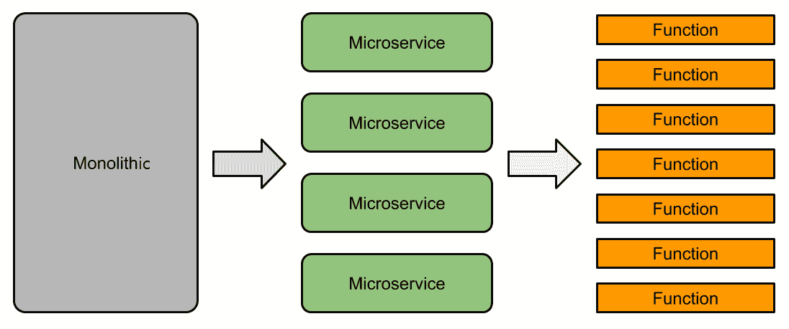

图 4.1：单体式、微服务和函数架构

# OpenFaaS 组件

本节解释了 OpenFaaS 的组成部分。这些组件包括 API 网关、函数看门狗以及 Prometheus 实例。它们都运行在 Docker Swarm 或 Kubernetes 编排引擎之上。API 网关和 Prometheus 实例作为服务运行，而函数看门狗作为函数容器的一部分运行。容器运行时可以是任何现代版本的 Docker 或 containerd：

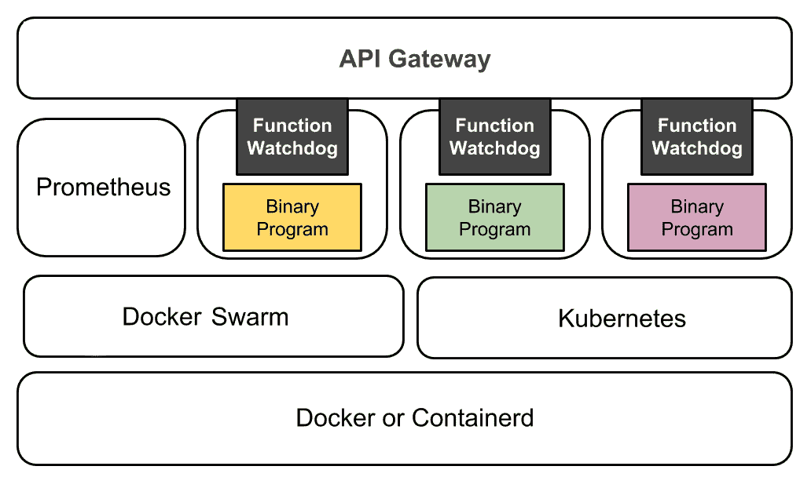

图 4.2：OpenFaaS 架构概述

客户端可以是 `curl`、`faas-cli` 或任何能够连接到 API 网关并调用函数的基于 HTTP 的客户端。函数容器在集群中由 API 网关管理，容器内有一个作为旁路进程（这种实现模式允许另一个旁路进程与主进程在同一个容器中运行）的函数看门狗。每个服务通过默认的主覆盖网络 `func_functions` 进行通信：

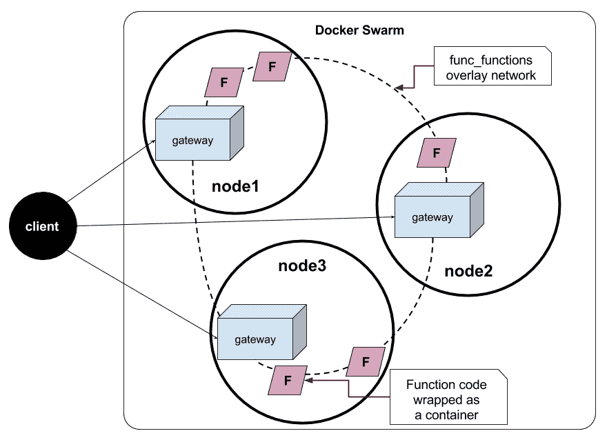

图 4.3：运行在 Docker Swarm 上的 OpenFaaS 内部架构

# 函数监控程序

函数监控程序是 OpenFaaS 的一个组件。它负责将实际的工作代码封装在函数程序周围。函数程序的要求仅仅是通过 **标准输入**（**stdin**）接受输入，并将结果输出到 **标准输出**（**stdout**）。

API 网关（`gateway`）通过覆盖网络连接到函数容器。每个函数容器包含以下内容：

+   函数监控程序，`fwatchdog`

+   用任何语言编写的某个函数程序

描述函数容器的 Dockerfile 必须有一个 `fprocess` 环境变量，指向函数程序名称和参数：

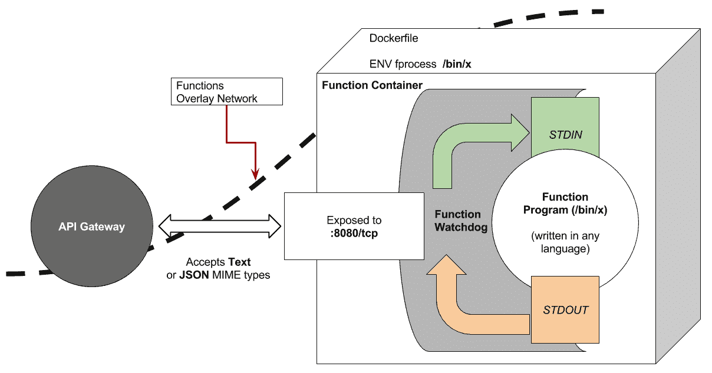

图 4.4：容器中函数监控程序与函数程序之间的交互

# 命令行界面

OpenFaaS 命令行界面是使用 OpenFaaS 的另一种方式。CLI 的最新版本可以直接从安装脚本 [`cli.openfaas.com`](https://cli.openfaas.com) 获取。对于 Linux 和 macOS，可以使用以下命令安装 CLI：

```
$ curl -sL https://cli.openfaas.com | sudo sh
```

当前，安装脚本支持运行在 ARM、ARM64 和 x64 芯片上的 macOS 和 Linux。CLI 被设计用来管理 OpenFaaS 函数的生命周期。我们可以使用 CLI 提供的子命令来构建、部署和调用函数。

CLI 实际上通过 API 网关暴露的一组控制平面 API 来控制 OpenFaaS。

# API 网关

OpenFaaS API 网关提供路由机制，将你的函数暴露给外部世界。

当一个函数被外部请求调用时，函数的度量指标将被收集并放入 Prometheus 实例中。API 网关持续监控每个函数的请求数量，并通过 Docker Swarm API 按需扩展服务副本。基本上，OpenFaaS 完全利用 Docker Swarm 的调度机制进行自动扩展。API 网关还配备了内置用户界面，称为 **UI 门户**。该界面允许我们通过浏览器定义和调用函数。

# 安装 OpenFaaS

在开发机器上安装 OpenFaaS 极其简单。确保你安装了 Docker 17.05 或更高版本，安装完成后就可以开始使用了。

首先，我们需要初始化一个 Swarm 集群。单节点 Swarm 就足够在开发环境中使用：

```
$ docker swarm init
```

如果由于机器具有 *多个网络接口* 而无法初始化 Swarm，我们必须为参数 `--advertise-addr` 指定一个 IP 地址或接口名称。

OpenFaaS 可以通过直接从 GitHub 克隆源代码并运行`deploy_stack.sh`脚本来启动。以下示例演示了如何启动 OpenFaaS 的版本 0.6.5。请注意，此目录中有`docker-compose.yml`，该文件将被`docker_stack.sh`用来部署 OpenFaaS Docker 堆栈：

```
$ git clone https://github.com/openfaas/faas \
 cd faas \
 git checkout 0.6.5 \
 ./deploy_stack.sh
Cloning into 'faas'...
remote: Counting objects: 11513, done.
remote: Compressing objects: 100% (21/21), done.
remote: Total 11513 (delta 16), reused 19 (delta 8), pack-reused 11484
Receiving objects: 100% (11513/11513), 16.64 MiB | 938.00 KiB/s, done.
Resolving deltas: 100% (3303/3303), done.
Note: checking out '0.6.5'.
HEAD is now at 5a58db2...

Deploying stack
Creating network func_functions
Creating service func_gateway
Creating service func_alertmanager
Creating service func_echoit
Creating service func_nodeinfo
Creating service func_wordcount
Creating service func_webhookstash
Creating service func_decodebase64
Creating service func_markdown
Creating service func_base64
Creating service func_hubstats
Creating service func_prometheus
```

我们现在看到，多个服务已部署到 Docker Swarm 集群中。实际上，这是通过在 bash 脚本中运行`docker stack deploy`命令实现的。OpenFaaS 使用的 Docker 堆栈名称是`func`。

为了检查`func`堆栈中的服务是否正确部署，我们使用`docker stack ls`列出堆栈及其运行的服务：

```
$ docker stack ls
NAME   SERVICES
func   11
```

现在我们知道有一个名为`func`的 11 个服务的堆栈。让我们使用`docker stack services func`查看它们的详细信息。我们使用格式化参数来让`docker stack services func`命令显示每个服务的名称和端口。你可以省略`--format`来查看每个服务的所有信息：

```
$ docker stack services func --format "table {{.Name}}\t{{.Ports}}"
NAME                PORTS
func_hubstats 
func_markdown 
func_echoit 
func_webhookstash 
func_prometheus     *:9090->9090/tcp
func_gateway        *:8080->8080/tcp
func_decodebase64 
func_base64 
func_wordcount 
func_alertmanager   *:9093->9093/tcp
func_nodeinfo
```

一切启动并运行后，可以通过`http://127.0.0.1:8080`打开 OpenFaaS 门户。以下截图显示了浏览器中运行的 OpenFaaS 门户。所有可用的函数都列在左侧面板中。点击某个函数名称后，主面板将显示该函数的详细信息。我们可以通过点击主面板上的 INVOKE 按钮来操作每个函数：

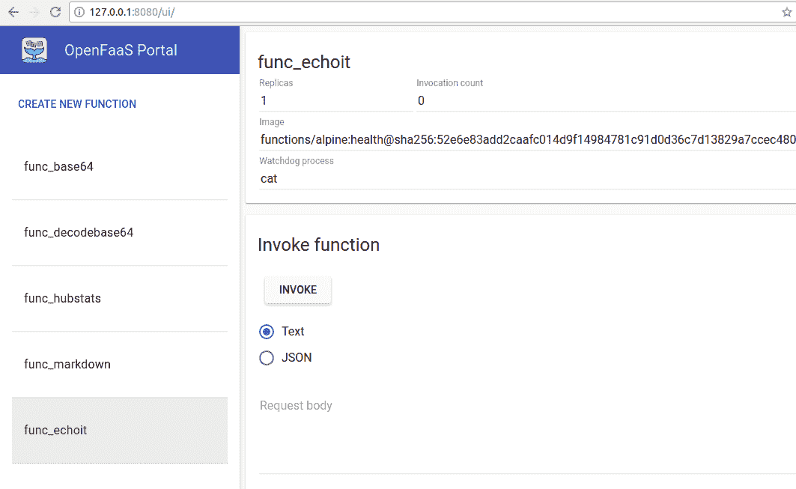

图 4.5：OpenFaaS 用户界面调用示例函数

我们将在下一节学习如何准备一个函数，以便在 OpenFaaS 平台上运行。

# 准备一个函数

在函数可以部署和调用之前，我们需要准备一个二进制程序并将其打包成函数容器。

以下是将程序打包成函数容器的步骤：

1.  创建一个包含`FROM`指令的 Dockerfile，以从基础镜像派生出它。你甚至可以使用 Alpine 基础镜像。

1.  使用`ADD`指令将函数监视程序二进制文件添加到镜像中。函数监视程序的名称是`fwatchdog`，可以在 OpenFaaS 发布页面找到。

1.  将函数程序添加到镜像中。我们通常使用`COPY`指令来完成此操作。

1.  使用`ENV`指令定义名为`fprocess`的环境变量，指向我们的函数程序。

1.  使用`EXPOSE`指令暴露`8080`端口给此容器镜像，当然，端口号是`8080`。

1.  定义此容器镜像的入口点。我们使用`ENTRYPOINT`指令指向`fwatchdog`。

我们将做一些稍微不寻常的操作，但这是正确的方法，以准备一个函数容器。我们使用 Docker 的一个特性，称为**多阶段构建**，通过一个 Dockerfile 来编译程序并打包函数容器。

什么是多阶段构建？多阶段构建特性允许一个 Dockerfile 在构建过程中有多个构建阶段连接在一起。

使用这项技术，我们可以通过丢弃来自前一个构建阶段的较大镜像层，来构建一个非常小的 Docker 镜像。此功能需要 Docker 17.05 或更高版本。

# 打包 C 程序

这是一个不寻常但简单的函数示例。在这个示例中，我们将尝试将 C 程序编译、打包并部署为一个函数。为什么是 C 程序？基本上，如果我们知道可以打包 C 程序，那么任何传统程序都可以以类似的方式进行编译和打包。

我们知道，当设计一个函数时，它从 `stdin` 接收输入并将输出发送到 `stdout`。然后，C 程序将通过 `printf()` 向 `stdout` 发送一条简单的语句：

```
#include <stdio.h>

int main() {
  printf("%s\n", "hello function");
  return 0;
}
```

通常情况下，这个 C 程序可以在复制并打包为容器之前使用 `gcc` 编译。但为了使 Dockerfile 自包含，将使用多阶段构建技术，通过单个 `docker build` 命令来编译和打包它作为一个函数。

以下多阶段的 Dockerfile 包含两个阶段。`State 0` 从 Alpine 3.6 镜像开始，然后安装 `gcc` 和 `musl-dev` 用于编译 C 程序。此阶段有一个命令来静态构建 C 程序，`gcc -static`，这样它就不需要任何共享对象库：

```
###############
# State 0
###############
FROM alpine:3.6

RUN apk update apk add gcc musl-dev

COPY main.c /root/
WORKDIR /root/

RUN gcc -static -o main main.c

###############
# State 1
###############
FROM alpine:3.6
ADD https://github.com/openfaas/faas/releases/download/0.6.5/fwatchdog /usr/bin/

RUN chmod +x /usr/bin/fwatchdog
EXPOSE 8080

COPY --from=0 /root/main /usr/bin/func_c
ENV fprocess="/usr/bin/func_c"

ENTRYPOINT ["/usr/bin/fwatchdog"]
```

**Stage 1** 同样从 Alpine 3.6 基础镜像开始。它直接从 OpenFaaS GitHub 发布页面添加 `fwatchdog` 二进制文件，并将其模式更改为可执行 (`chmod +x`)。此 Dockerfile 最重要的部分是在它从上一阶段 **Stage 0** 复制主二进制文件。这可以通过使用 `COPY` 指令与 `--from` 参数来完成。`func_c` 容器镜像的构建过程如下所示：

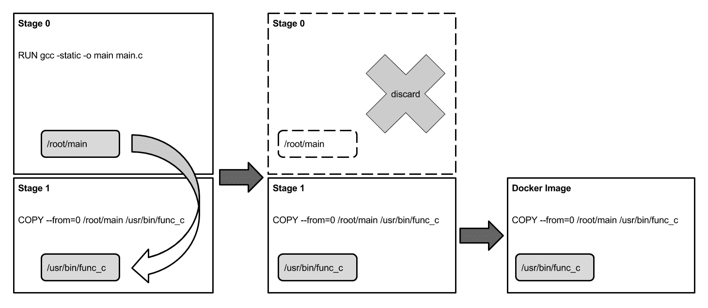

图 4.6：示例中的多阶段构建工作流程示意图

以下是之前 Dockerfile 中的代码，展示了如何使用 `COPY` 指令在阶段之间复制文件。在 **Stage 1** 中，`COPY --from=0` 表示该命令会将文件或一组文件从 **Stage 0** 复制到 **Stage 1**。在之前的示例中，它会将 `/root/main` 文件从 **Stage 0** 更改为 **Stage 1** 中的 `/usr/bin/func_c`：

```
COPY --from=0 /root/main /usr/bin/func_c
```

在多阶段 Dockerfile 准备好之后，下一步是使用该 Dockerfile 执行 `docker build`。

在执行此操作之前，将设置一个环境变量 `DOCKER_ID` 为你的 Docker ID。如果你没有 Docker ID，请访问 [`hub.docker.com`](https://hub.docker.com) 并在那里注册。使用此 `DOCKER_ID` 变量，你可以在不每次更改我的 Docker ID 为你的情况下执行这些命令：

```
$ export DOCKER_ID="chanwit"           # replace this to yours Docker ID.
$ docker build -t $DOCKER_ID/func_c .  # <- please note that there's a dot here.
```

函数容器的运行状态将类似于 *图 4.7* 中所示的镜像堆栈。最底层是操作系统内核之上的根文件系统。接下来的层次是基础镜像和依次叠加的镜像层，利用联合文件系统的能力。最上层是每个运行容器的可写文件系统，代表一个 OpenFaaS 函数：

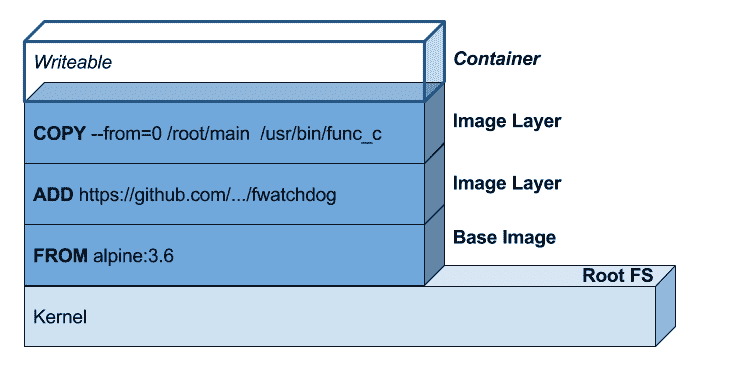

图 4.7：作为运行容器的函数，顶部有一个可写的文件系统层

使用多阶段构建时，我们可以创建一个非常小的镜像，仅包含作为函数所需的二进制文件。通过丢弃整个 **Stage 0** 的镜像层（包括所有编译器和依赖项），最终镜像的大小被减少到大约 11 MB。可以通过运行 `docker image ls $DOCKER_ID/func_c` 来检查：

```
$ docker image ls $DOCKER_ID/func_c
REPOSITORY      TAG     IMAGE ID      CREATED         SIZE
chanwit/func_c  latest  b673f7f37036  35 minutes ago  11.6MB
```

请注意，OpenFaaS 机制会首先从仓库查找镜像。因此，在将容器镜像用作函数之前，将镜像推送到 Docker Hub 或您的仓库会更安全。这可以通过 `docker image push` 命令简单完成。请注意，在推送镜像之前，可能需要使用 `docker login` 进行身份验证：

```
$ docker image push $DOCKER_ID/func_c
```

# 使用 UI 定义和调用函数

在 OpenFaaS 上定义和调用函数非常简单。在推送镜像后，可以通过 OpenFaaS UI 门户来定义函数。首先，打开 `http://127.0.0.1:8080/ui`。然后，你将在左侧面板中看到一个可点击的标签 **CREATE NEW FUNCTION**。点击后，将弹出定义函数的对话框。它需要该函数的 Docker 镜像名称；在这个例子中，镜像名称是 `chanwit/func_c`。再次提醒，请不要忘记将我的 Docker ID 改为你的 Docker ID。其次，定义时需要一个函数名称。就命名为 `func_c`。第三，我们需要定义 `fprocess` 字段的值，指向用于调用二进制程序的命令行。在这个示例中，命令行将在容器内简单地是 `/usr/bin/func_c`。如果函数程序需要某些参数，也请在这里包含它们。最后，函数定义需要一个 Docker 覆盖网络的名称，以便 API 网关连接到函数容器。只需在此处包含默认的网络 `func_functions`。需要特别注意的是，如果 OpenFaaS 堆栈部署到另一个环境，并且有不同的覆盖网络名称，必须记得指定正确的名称：

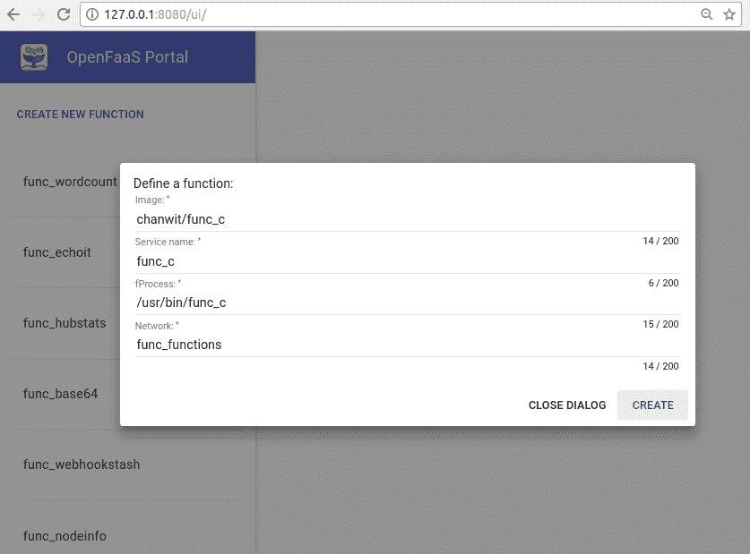

图 4.8：通过 UI 定义 OpenFaaS 函数

如果一切正常，点击 CREATE 来定义该函数。创建后，`func_c` 函数将显示在左侧面板中。点击函数名称将显示函数调用的主面板，如下所示：

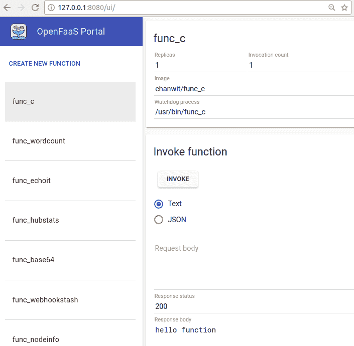

图 4.9：调用`func_c`函数及其响应体

如果一个函数需要任何输入，可以将文本或 JSON 格式的输入数据放置为请求体。然而，`func_c`函数不接受任何输入，因此只需按下 INVOKE 按钮，函数就会被调用。在此示例中，调用过程已完成，状态为 OK：`200`。API 网关从函数的二进制文件`/usr/bin/func_c`获取标准输出，并以文本格式显示为响应体。

# 使用 OpenFaaS CLI

OpenFaaS CLI（`faas-cli`）是一个命令行工具，帮助管理、准备和调用函数。在 Linux 上，可以使用以下命令安装 OpenFaaS CLI：

```
$ curl -sSL https://cli.openfaas.com | sudo sh
```

在 macOS 上，可以通过`brew`使用以下命令进行安装：

```
$ brew install faas-cli
```

或者，在 Windows 上，可以直接从 OpenFaaS GitHub 仓库下载`faas-cli.exe`并手动运行。

然而，我们假设每个示例都运行在 Linux 系统上。在以下示例中，将使用 OpenFaaS 的 Go 语言模板创建`hello`函数，该模板可以在 GitHub 的`openfaas/fass-cli`库中的`template/go`目录下找到。

本地所有模板将存储在工作目录的`template/`目录下。如果模板目录不存在，所有模板将从 GitHub 的`openfaas/faas-cli`获取。从 OpenFaaS 0.6 版本开始，那里提供了 10 个适用于五种不同编程语言的模板。

# 定义一个新函数

要创建一个 Go 语言编写的函数，我们使用`faas-cli new --lang=go hello`命令：

```
$ faas-cli new --lang=go hello

2017/11/15 18:42:28 No templates found in current directory.
2017/11/15 18:42:28 HTTP GET https://github.com/openfaas/faas-cli/archive/master.zip
2017/11/15 18:42:38 Writing 287Kb to master.zip

2017/11/15 18:42:38 Attempting to expand templates from master.zip
2017/11/15 18:42:38 Fetched 10 template(s) : [csharp go-armhf go node-arm64 node-armhf node python-armhf python python3 ruby] from https://github.com/openfaas/faas-cli
2017/11/15 18:42:38 Cleaning up zip file...
Folder: hello created.
 ___                   _____           ____
 / _ \ _ __   ___ _ __ |  ___|_ _  __ _/ ___|
| | | | '_ \ / _ \ '_ \| |_ / _` |/ _` \___ \
| |_| | |_) |  __/ | | |  _| (_| | (_| |___) |
 \___/| .__/ \___|_| |_|_|  \__,_|\__,_|____/
 |_|

Function created in folder: hello
Stack file written: hello.yml
```

创建函数后，我们可以通过运行`tree -L 2 .`命令检查函数目录的结构。该命令会显示两级深度的目录结构，如下所示：

```
$ tree -L 2 .
.
├── hello
│   └── handler.go
├── hello.yml
└── template
 ├── csharp
 ├── go
 ├── go-armhf
 ├── node
 ├── node-arm64
 ├── node-armhf
 ├── python
 ├── python3
 ├── python-armhf
 └── ruby
```

首先，我们将查看`hello.yml`文件中的函数定义。在`hello.yml`文件中，有两个顶级项，`provider`和`functions`。

`provider`块告诉我们其提供者的名称是`faas`，即 Docker Swarm 中的默认 OpenFaaS 实现。同时，它告诉我们网关端点位于`http://localhost:8080`，即 API 网关的一个实例正在运行。在生产环境中，这个 URL 可以更改为指向实际的 IP 地址。

`functions`块列出了所有已定义的函数。在这个例子中，只有`hello`函数。该块告诉我们这个函数是用 Go 编程语言编写的（`lang: go`）。函数的处理程序由`handler: ./hello`指定，指向包含真实工作函数源文件的目录（`./hello/handler.go`）。在此示例中，输出镜像的名称由`image: hello`指定。在构建函数之前，我们会将镜像名称更改为`<your Docker ID>/hello:v1`，因为不建议使用`:latest`标签，这是最佳实践。

```
############
# hello.yml 
############
provider:
  name: faas
  gateway: http://localhost:8080

functions:
  hello:
    lang: go
    handler: ./hello
    image: hello  # change this line to <your Docker ID>/hello:v1
```

# 构建并推送

我们将编辑最后一行，将其改为 `image: chanwit/hello:v1`。再次提醒，不要忘记将我的 Docker ID 替换为你自己的。然后我们使用 `faas-cli build` 命令进行构建。我们使用 `-f` 来指定函数定义文件。请注意，构建这个 Dockerfile 会有两个阶段和 17 个步骤：

```
$ faas-cli build -f ./hello.yml
[0] > Building: hello.
Clearing temporary build folder: ./build/hello/
Preparing ./hello/ ./build/hello/function
Building: chanwit/hello:v1 with go template. Please wait..

Sending build context to Docker daemon  6.144kB
Step 1/17 : FROM golang:1.8.3-alpine3.6
 ---> fd1ada53b403

...

Step 17/17 : CMD ./fwatchdog
 ---> Running in a904f6659c33
 ---> f3b8ec154ee9
Removing intermediate container a904f6659c33
Successfully built f3b8ec154ee9
Successfully tagged chanwit/hello:v1
Image: chanwit/hello:v1 built.
[0] < Builder done.
```

Go 函数模板将从 `template/go` 目录复制到 `build/hello` 目录。然后，处理器文件 `hello/handler.go` 会被复制到 `build/hello/function/handler.go`。程序的入口点在 `build/hello/main.go` 中定义，它又调用处理器函数。在构建过程中，`faas-cli` 会内部执行 `docker build` 命令。Dockerfile 中定义的步骤将用于编译和打包函数。

下图解释了 Dockerfile、源文件和模板之间的关系：

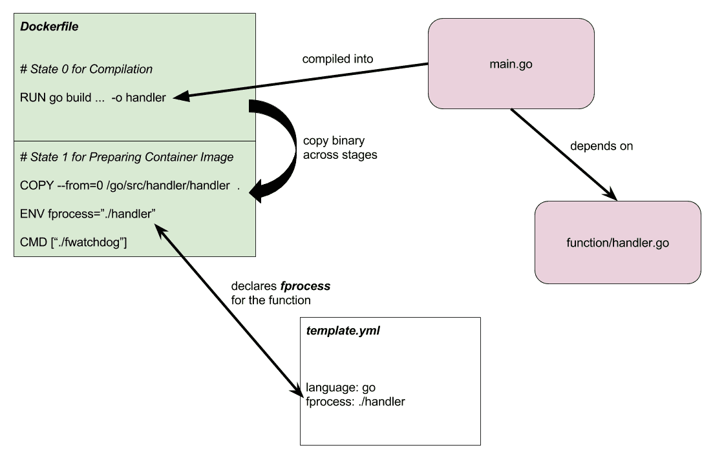

图 4.10：Go 语言的 OpenFaaS 模板及其相关组件

构建完成后，我们再次检查目录结构。这次运行 `tree -L 3 .` 来显示三层深度的目录，因为我们需要检查由 `faas-cli build` 命令创建的 `build` 目录的内容：

```
$ tree -L 3 .
.
├── build
│   └── hello
│       ├── Dockerfile
│       ├── function
│       ├── main.go
│       └── template.yml
├── hello
│   └── handler.go
├── hello.yml
└── template
```

我们可以直接将构建的镜像推送到 Docker 仓库，同样使用 `faas-cli push` 命令。使用 `-f` 来指定规范文件。规范文件中 `functions.image` 的值将用于推送：

```
$ faas-cli push -f hello.yml 
[0] > Pushing: hello.
The push refers to a repository [docker.io/chanwit/hello]
8170484ad942: Pushed 
071849fe2878: Pushed 
a2e6c9f93e16: Pushed 
76eeaa2cc808: Pushed 
3fb66f713c9f: Pushed 
v1: digest: sha256:fbf493a6bb36ef92f14578508f345f055f346d0aecc431aa3f84a4f0db04e7cb size: 1367
[0] < Pushing done.
```

# 部署与调用

要部署新构建的函数，我们使用 `faas-cli deploy` 命令。它通过 `-f` 参数读取函数规范，类似于其他子命令。在这个例子中，它使用提供者的网关值来部署函数。如果 Docker Swarm 上已经有一个以前运行的函数作为服务，旧的函数将在部署新函数之前被删除。部署完成后，手动调用该函数的 URL（例如通过 `curl`）将显示出来：

```
$ faas-cli deploy -f hello.yml 
Deploying: hello.
Removing old function.
Deployed.
URL: http://localhost:8080/function/hello

200 OK
```

要获取集群中所有正在运行的函数，我们可以运行 `faas-cli list` 命令。该命令还会显示每个函数的调用次数以及函数实例的副本数。当调用频率足够高时，副本数量会自动增加。所有这些信息都存储在 Prometheus 实例中。我们将在下一节通过 Grafana 仪表板更好地查看这些信息：

```
$ faas-cli list
Function                          Invocations        Replicas
func_echoit                       0                  1 
func_wordcount                    0                  1 
func_webhookstash                 0                  1 
func_markdown                     0                  1 
func_hubstats                     0                  1 
func_decodebase64                 0                  1 
hello                             0                  1 
func_base64                       0                  1 
func_nodeinfo                     0                  1 
```

`hello` 函数通过 `stdin` 接受输入，并通过 `stdout` 输出结果。为了测试函数的调用，我们将一句话回显并通过管道传递给 `faas-cli invoke` 命令的 `stdin`。这个调用通过 OpenFaaS 框架处理，所有的调用统计数据都会记录在集群中的 Prometheus 实例上：

```
$ echo "How are you?" | faas-cli invoke hello
Hello, Go. You said: How are you?
```

# 模板

预定义的模板对于字符串处理和开发简单函数来说可能足够了，但当事情变得复杂时，了解如何自己调整 OpenFaaS 模板就变得非常重要。

在这一部分，将调整 Go 模板以简化示例中的构建步骤数量。可以在`template/go/Dockerfile`找到以下 Go 模板的 Dockerfile。此 Dockerfile 已经使用了多阶段构建技术：

```
###################
# State 0
###################
FROM golang:1.8.3-alpine3.6

# ... lines removed for brevity

###################
# State 1
###################
FROM alpine:3.6
RUN apk --no-cache add ca-certificates

# Add non root user
RUN addgroup -S app adduser -S -g app app \
    mkdir -p /home/app \
    chown app /home/app

WORKDIR /home/app
COPY --from=0 /go/src/handler/handler    .
COPY --from=0 /usr/bin/fwatchdog         .

USER app
ENV fprocess="./handler"
CMD ["./fwatchdog"]
```

模板可以托管在自定义 Git 存储库中。以下是一个模板存储库的结构，可以通过`template`子命令获取。第一级必须是名为`template/`的目录。在`template`目录内，可能会有多个目录，例如，在以下结构中有`go/`目录：

```
$ tree .
.
├── README.md
└── template
 └── go
 ├── Dockerfile
 ├── function
 │   └── handler.go
 ├── main.go
 ├── README.md
 └── template.yml
```

将整个模板源代码存储在 GitHub 存储库中后，可以使用`faas-cli template pull`稍后进行拉取和调整：

```
$ faas-cli template pull https://github.com/chanwit/faas-templates
Fetch templates from repository: https://github.com/chanwit/faas-templates
2017/11/16 15:44:46 HTTP GET https://github.com/chanwit/faas-templates/archive/master.zip
2017/11/16 15:44:48 Writing 2Kb to master.zip

2017/11/16 15:44:48 Attempting to expand templates from master.zip
2017/11/16 15:44:48 Fetched 1 template(s) : [go] from https://github.com/chanwit/faas-templates
2017/11/16 15:44:48 Cleaning up zip file...
```

在拉取调整后的模板之后，可以重新构建镜像，并将构建步骤数量减少到*15*：

```
$ faas-cli build -f hello.yml 
[0] > Building: hello.
Clearing temporary build folder: ./build/hello/
Preparing ./hello/ ./build/hello/function
Building: chanwit/hello:v1 with go template. Please wait..
Sending build context to Docker daemon   7.68kB
Step 1/15 : FROM golang:1.8.3-alpine3.6
 ---> fd1ada53b403

...

Step 15/15 : CMD ./fwatchdog
 ---> Using cache
 ---> 23dfcc80a031
Successfully built 23dfcc80a031
Successfully tagged chanwit/hello:v1
Image: chanwit/hello:v1 built.
[0] < Builder done.
```

# OpenFaaS 仪表板

在 Grafana 平台上有一个良好的 OpenFaaS 仪表板。要使 Grafana 与 OpenFaaS 配合工作，Grafana 服务器必须在相同的网络上。我们可以使用以下命令通过`docker service create`在 OpenFaaS 堆栈外运行 Grafana 服务器。它通过`--network=func_functions`参数与 OpenFaaS 堆栈进行链接：

```
$ docker service create --name=grafana \
 --network=func_functions \
 -p 3000:3000 grafana/grafana
```

或者，可以在`http://localhost:3000`打开仪表板。使用用户名`admin`和密码`admin`登录：

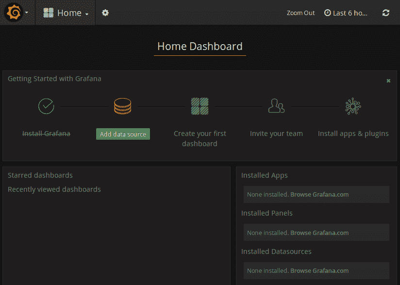

图 4.11：Grafana 主页仪表板

在将其用作仪表板数据源之前，必须创建并指向 Prometheus 服务器的数据源。首先，数据源名称必须为`prometheus`。其次，URL 需要指向`http://prometheus:9090`。之后，我们可以点击保存和测试按钮。如果数据源设置正确，将显示绿色弹出窗口：

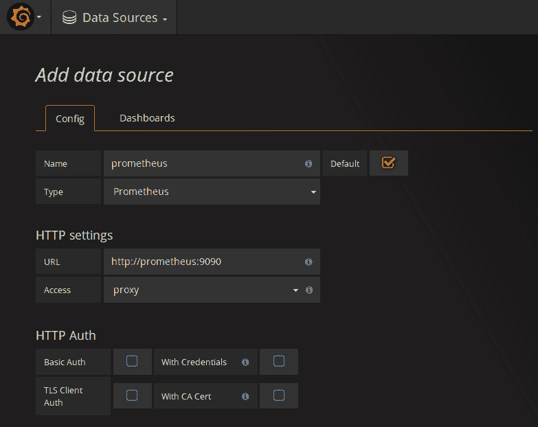

图 4.12：在 Grafana 中定义一个新的 Prometheus 数据源

接下来，可以使用仪表板的 ID 导入 OpenFaaS 仪表板。我们将使用仪表板号`3434`，然后点击加载以准备导入仪表板：

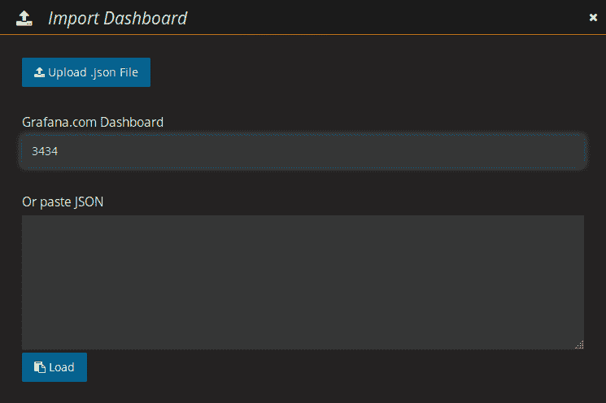

图 4.13：在 Grafana 中导入仪表板的屏幕

接下来，对话框将更改为从 Grafana.com 导入仪表板。在这里，它将要求我们包括仪表板名称。我们可以将其保留为默认名称。它还会询问我们想要使用哪个数据源。选择之前步骤中已定义的 Prometheus 数据源。之后，点击导入按钮完成导入过程：

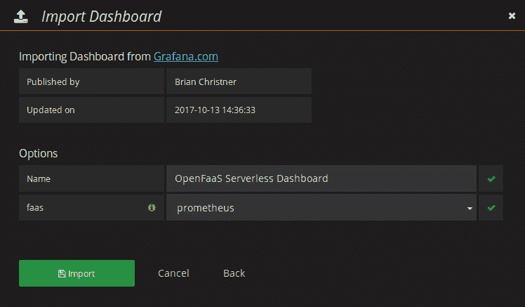

图 4.14：设置仪表板名称并选择其 Prometheus 数据源

以下是仪表板的展示。它在一个框中显示了网关的健康状态，并以仪表的形式显示网关服务的数量。总函数调用统计以线形图展示，配有数字。在测试中，Go 编写的 `hello` 函数被线性调用超过 20,000 次。在测试过程中，函数副本的数量从 5 个扩展到了 20 个。然而，由于测试是在单机上进行的，因此调用速率没有显著变化：

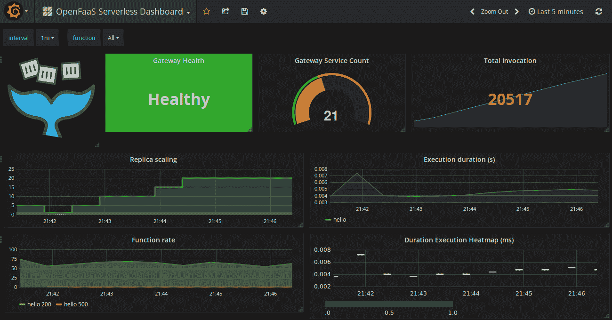

图 4.15：OpenFaaS 仪表板的实际操作

以下是允许 OpenFaaS 自动扩展函数副本的机制。首先，当客户端通过 API 网关请求函数调用时，该调用将存储在 Prometheus 中。在 Prometheus 内部，有一个 **Alert Manager**，它负责在预定义规则匹配时触发事件。OpenFaaS 为 **Alert Manager** 定义了一条规则，通过将事件与其 **Alert Handler** URL `http://gateway:8080/system/alert` 关联，来扩展副本数量。这个 **Alert Handler** 将负责计算副本数量，检查最大副本限制，并通过 Swarm 客户端 API 向集群发送 `scale` 命令，从而扩展某个函数的副本。下图展示了这个自动扩展机制背后的步骤：

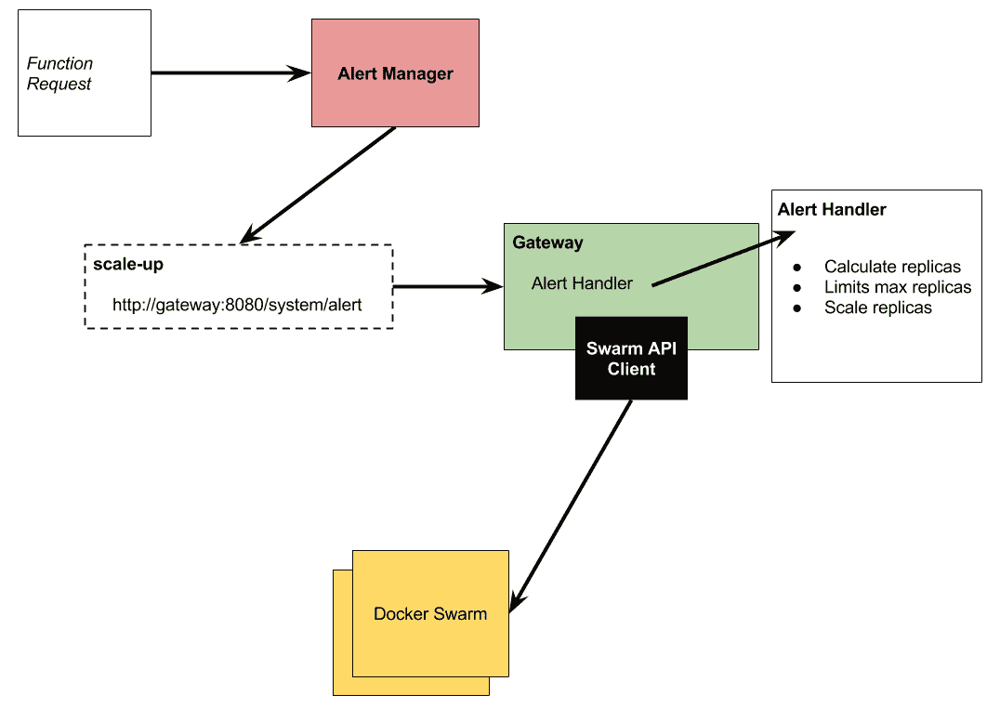

图 4.16：OpenFaaS 在 Docker Swarm 中自动扩展函数服务副本的告警机制

# 练习

以下是帮助你回顾本章中需要记住和理解的所有主题的问题列表：

1.  使用 OpenFaaS 有什么优势？

1.  请描述 OpenFaaS 的架构。各个组件是如何相互通信的？

1.  我们如何在 Docker Swarm 上部署 OpenFaaS 堆栈？

1.  为什么 OpenFaaS 使用多阶段构建？

1.  我们如何为 Node.js 创建一个新的 OpenFaaS 函数？

1.  我们如何构建并打包一个 OpenFaaS 函数？

1.  OpenFaaS 使用的覆盖网络的默认名称是什么？

1.  什么是函数模板？它的用途是什么？

1.  描述准备自定义模板并将其托管在 GitHub 上的步骤。

1.  我们如何为 OpenFaaS 定义 Grafana 仪表板？

# 摘要

本章讨论了 OpenFaaS 及其架构，以及我们如何将其作为无服务器框架在 Docker Swarm 上部署函数。OpenFaaS 具有多个令人信服的特性，特别是其易用性。本章展示了在 Docker Swarm 基础设施中部署 OpenFaaS 堆栈非常简单。接着，本章继续讨论了如何定义、构建、打包和部署 OpenFaaS 函数。它还讨论了如何调整和准备自定义模板的高级话题。

监控 OpenFaaS 非常简单，因为它内置了 Prometheus。我们只需要安装 Grafana 仪表板并将其连接到 Prometheus 数据源，就能获得一个现成的仪表板，帮助我们操作 OpenFaaS 集群。

下一章将介绍 Fn 项目，它允许我们在普通的 Docker 基础设施上部署 FaaS 平台。
