# 第七章：操作 FaaS 集群

让系统运行并稳定起来最困难的事情之一就是管理和维护我们自己的集群。尽管无服务器计算是一种旨在完全解决这个问题的范式，但实际上，在某些情况下，我们仍然需要自行配置和管理服务器。

无服务器计算和 Docker 背后的理念是，在减少集群维护和管理的同时，能够完全控制集群。使用 Docker 是一种帮助实现这一平衡的好方法。

除了这种平衡之外，最具吸引力的无服务器计算驱动力是*价格模型*。然而，我们发现，在 EC2 Spot 实例上使用 Docker，由于其具有竞争力的价格，有时甚至比 AWS Lambda 或其他云函数还便宜。因此，使用 Spot 实例时，我们可以获得更便宜的价格，同时我们的功能不会受到 AWS Lambda 或其他云平台所遇到的任何限制。

操作基于 Docker 的 FaaS 集群使用的技术与操作 Docker 集群相同。我们需要将独立运行 Docker 的技术与利用 Docker Swarm 模式的技术结合起来。本章重点介绍*配置稳定性*、如何准备新的入口层、如何使用网络插件、如何设置日志系统，以及如何使用 Golang 脚本操作集群。

# 稳定配置

让我们首先仔细稳定集群配置。在撰写本文时，Docker 集群在以下配置下表现最佳。本节中图*Figure: 7.1*展示了这一点：

+   **Ubuntu Server 16.04.3 LTS**：尽管 Red Hat Linux 或 CentOS 可能更适合你，但 Ubuntu Server 更容易处理。我们不断得知，Docker 在 Ubuntu Server 上的测试表现非常好。如果你选择使用 Red Hat 或 CentOS，请选择 7.4 版本。

+   **Linux Kernel 4.4 LTS**：4.4 内核是 LTS 版本，非常适合 Docker 使用。你也可以使用 4.9 内核，但像 4.13 这样的内核对于 Docker 来说仍然太新。

+   **Overlay2** **作为 Docker 存储驱动程序**：尽管**高级多层统一文件系统**（**AUFS**）已在 Docker 中使用了很长时间并且表现良好，但对于运行 4.4+内核的 Docker 来说，overlay2 应该是新的默认存储驱动程序。如果你有机会在 CentOS 或 RHEL 7.4 上运行生产集群，overlay2 也是这些发行版上的一个不错选择。

+   **Docker CE 17.06.2** **或 17.09.1**：如果你能负担得起企业版，Docker EE 17.06 也是一个不错的选择：

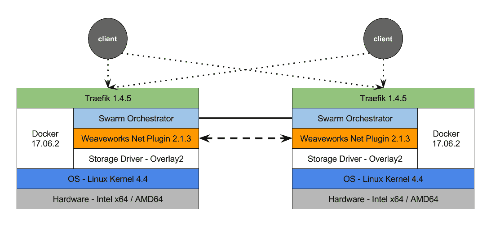

图 7.1：一个稳定的 Docker Swarm 堆栈，配有 Træfik 和 WeaveWorks 网络插件

# 选择合适的网络插件

长期以来，人们一直说默认的 Docker 覆盖网络不适合生产环境。尽管覆盖网络驱动程序的质量越来越好，但我们可能会考虑一些其他的网络插件，以获得最佳效果。我们可以将默认的覆盖驱动程序替换为其他插件，例如 WeaveWorks 或 Contiv。本章中我们使用的是 WeaveWorks 网络插件版本 2。

*为什么选择 WeaveWorks？*

WeaveWorks 网络插件用于 Docker，采用与 Kubernetes CNI 相同的底层网络实现。它还经过了开发团队 WeaveWorks Inc. 的严格测试。此外，它在我的生产集群中表现非常出色。

WeaveWorks 网络插件版本 2.1.3，为了避免当前版本的覆盖网络驱动程序中发现的断开连接 bug，建议在生产环境中完全移除默认的入口网络，该网络基于默认的覆盖网络驱动程序。这里可能会有人提出疑问。如果移除入口网络，我们将失去整个路由网格，那么我们该如何将流量路由到集群呢？答案在下一节中。

# 新的入口和路由

如前所述，我们将不使用默认的 Docker *入口网络*来进行 *请求路由*到正在运行的容器：

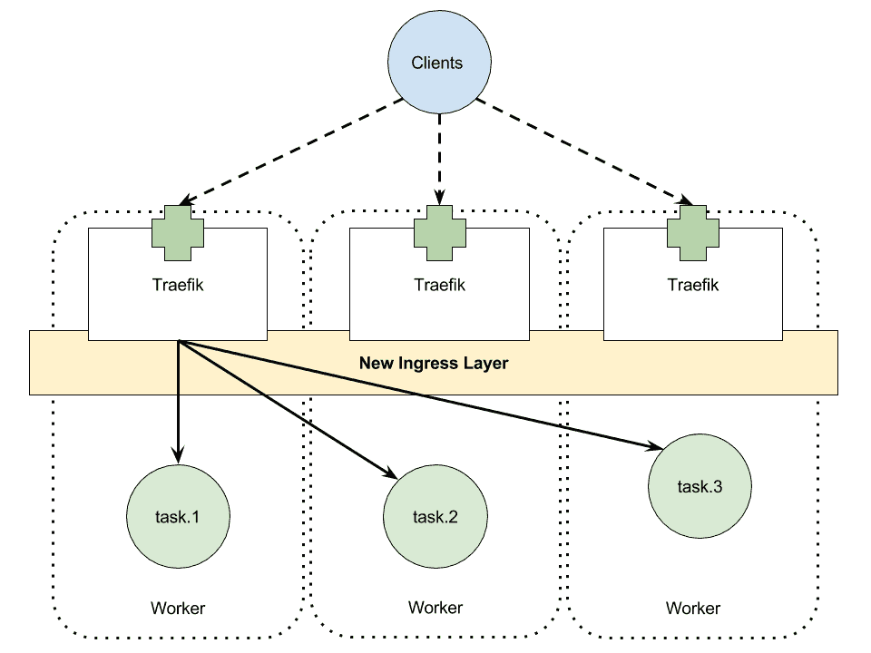

图 7.2：构建在 Træfik 上的新入口层，连接到底层的 Swarm 任务，形成路由网格

是的，我们将失去路由网格，但我们将建立我们自己的路由网格。如前图所示，我们将用构建在 L7 负载均衡器 **Træfik** 上的新入口层替代默认的路由网格。你可以从以下稳定版本列表中选择一个：

+   Træfik v1.4.5 (`traefik@sha256:9c299d9613`)

+   Træfik v1.4.6 (`traefik@sha256:89cb51b507`)

使用 Træfik 的优势在于，新的入口层得到了更好的稳定性。每个服务都会由 Træfik 自动解析为一组 IP 地址。因此，你可以选择使用 Docker Swarm 提供的基于 IPVS 的负载均衡器，或者使用 Træfik 本身提供的内置机制。

由于 Træfik 与 L7 层配合使用，我们还可以根据主机名来匹配服务，并将请求转发到匹配服务的某个任务。此外，通过这种新实现，我们可以灵活地重新启动或重新配置入口层，而无需触及正在运行的服务。这一直是 Docker 入口层的一个弱点。

# 跟踪组件

在本书提出的架构中，我们为每个部署的函数使用 Envoy 作为 sidecar 代理。有了 Envoy，即使这些函数是由不同的 FaaS 平台准备或部署的，它也能实现函数之间的分布式追踪调用，如下图所示。这实际上是避免厂商锁定的重要一步。Envoy 被编译并逐步推送到 Docker hub。我们为本书选择了某个特定版本的 Envoy：**EnvoyProxy**，`envoyproxy/envoy:29989a38c017d3be5aa3c735a797fcf58b754fe5`：

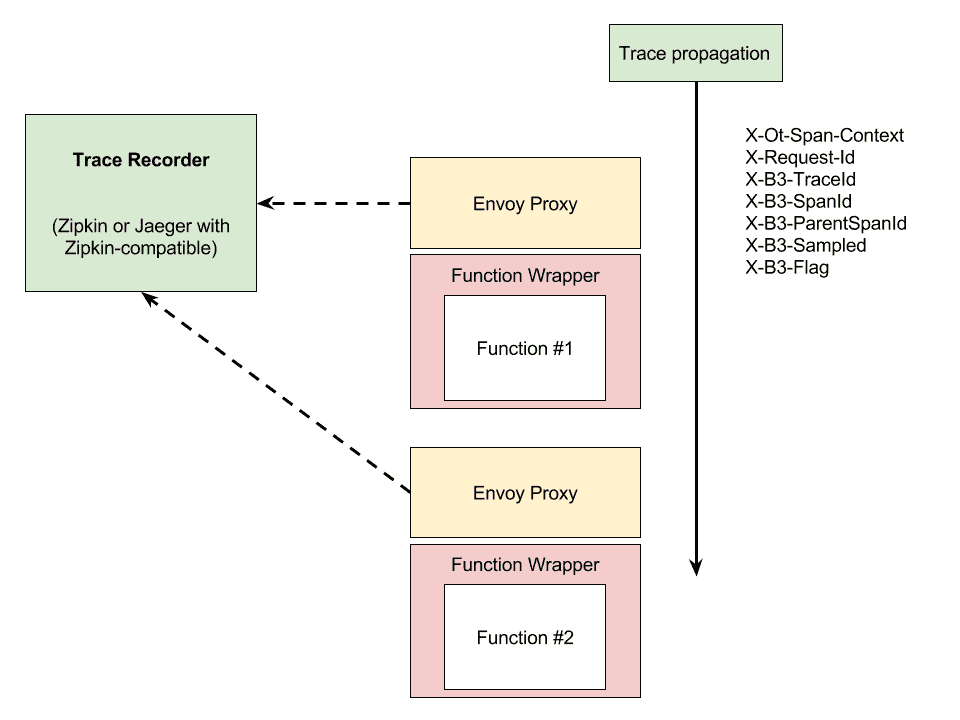

图 7.3：展示带有 Envoy 的分布式追踪机制的框图

下图展示了 sidecar 代理模式的两种实现级别。首先，我们直接通过将**EnvoyProxy**二进制文件嵌入到 Docker 镜像中来调整函数或服务的`Dockerfile`。这种技术提供了最佳的性能，因为**EnvoyProxy**通过容器内的**loopback**接口与函数程序进行通信。但当我们需要更改 Envoy 的配置，如*重试*或*断路器*时，我们需要重新启动**EnvoyProxy**和函数实例，如下图所示的第一种（**1**）配置：

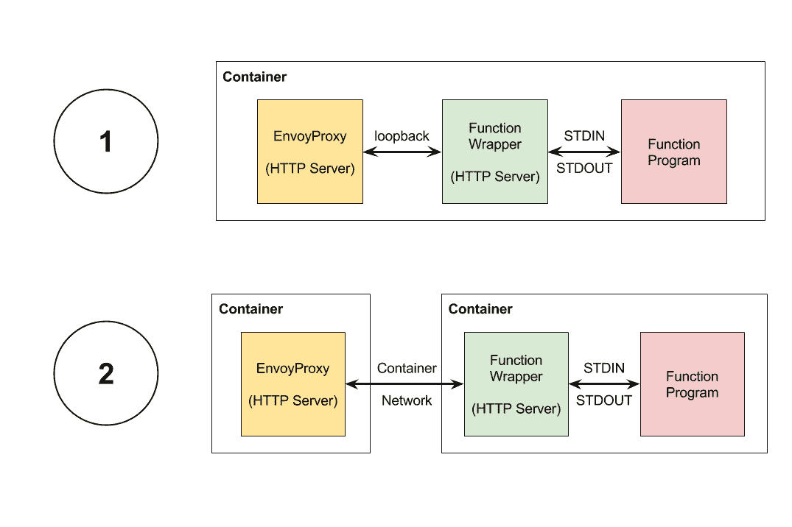

图 7.4：两种配置方式将 Envoy 实现为（1）sidecar 代理和（2）边缘代理

所以在灵活性和管理性方面，最佳的配置是第二种（**2**）配置，在这种配置中，我们将**EnvoyProxy**作为边缘代理从函数容器中分离出来。这里的权衡是它们之间的网络开销。

# 重试和断路器

在本节中，我们讨论一个迄今为止最有趣的话题：重试和断路器模式。在继续实现生产集群之前，熟悉这一概念会非常有帮助。

# 重试

重试和断路器解决的问题源于服务或链中某个函数变得不可用所引发的级联故障。在下图中，我们假设五个不同的函数或服务的可用性为 99%，因此它们每 100 次调用会失败一次。观察这个服务链的客户端将体验到的可用性为**A**，仅为**95.09%**：

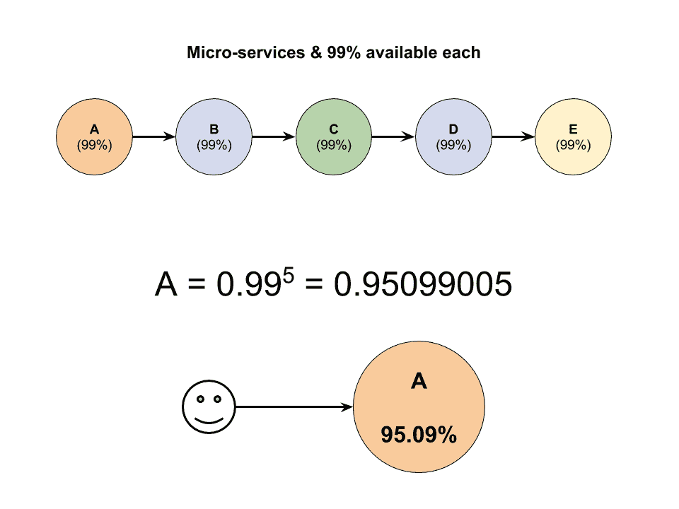

图 7.5：一系列函数或微服务将使它们的整体可用性降低

这意味着什么？这意味着当这个链条变成八个函数时，系统的可用性将降至 92.27%；如果链条长达 20 个函数，这个数字将降到 81.79%。为了降低故障率，当出现错误（如 HTTP 500）时，我们应该重试调用另一个实例的函数或服务。

但是，简单的或常规速率的重试是不够的。如果我们使用一个简单的策略，我们的重试调用会给已经故障的服务带来不必要的负载，这会引发比解决更多的问题。

# 电路断路器

为了解决这个问题，许多重试模式实现通常会使用**指数回退重试**。通过指数回退策略，我们逐步增加每次重试之间的延迟。例如，发生故障后，我们可能会在 3 秒钟后重试第二次调用。如果服务仍然返回错误，我们将延迟增加到 9 秒和 27 秒，分别对应第三次和第四次调用。这种策略给服务留出一定的时间来恢复临时故障。两种重试策略的区别如下图所示：

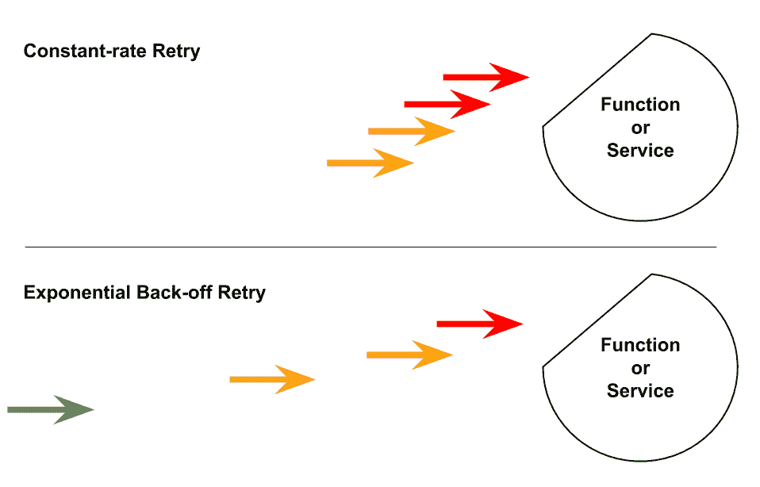

图 7.6：恒定速率重试与指数回退重试策略的区别

# 准备生产集群

在本节中，我们将讨论如何准备生产级 Docker Swarm 集群，以便以最低的成本在 AWS Spot 实例上运行 FaaS 平台。部署 Docker 集群的成本将与在 AWS Lambda 上运行代码的成本相当，但它让我们几乎可以控制集群中的所有内容。如果部署策略以成本为驱动，那么这是最佳的选择。

# 使用 Spot 实例节省成本

当我们谈论云时，它的按需实例实际上已经很便宜了。然而，从长远来看，使用云实例的价格将与购买实物机器相似。为了解决这个定价问题，主要的云服务提供商，如 Amazon EC2 和 Google Cloud Platform，提供了一种新的实例类型，在本书中统称为**Spot 实例**：

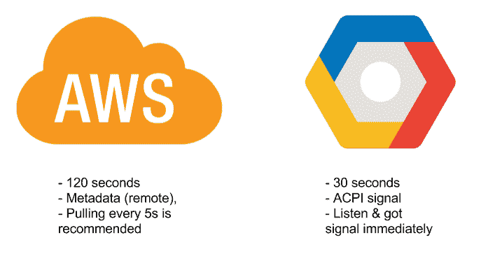

图 7.7：AWS 与 Google Cloud 上 Spot 实例的关机信号对比

Spot 实例比按需实例便宜得多。然而，它们的弱点是生命周期短且会意外终止。也就是说，Spot 实例可能随时被终止。当它终止时，你可以选择保留或完全丢弃卷。在 AWS 上，实例将在终止前约 120 秒通过远程元数据发出通知，而在 Google Cloud 上，则会在机器停止前 30 秒通过 ACPI 信号发送通知。粗略的对比如前图所示。

我们可以将无状态计算部署在这些实例上。微服务和函数本身都是无状态的，因此 Spot 实例非常适合微服务和函数的部署。

使用这种廉价实例的基础设施，其成本将与 AWS Lambda 或 Google Cloud Functions 相当，但我们对整个系统有更多的控制，这意味着在这种基础设施上运行的函数不会有调用超时问题。

# 使用 EC2 Spot 实例

在 Amazon EC2 上，访问 [`aws.amazon.com/ec2/spot/`](https://aws.amazon.com/ec2/spot/) 你将看到如下截图页面。登录 AWS 控制台，设置一些 Spot 实例：


图 7.8：AWS Spot 实例的首页

在导航栏上，我们看到了 Spot Requests。点击它进入 Spot Requests 屏幕，如下截图所示。在此屏幕上，点击请求 Spot 实例 开始请求流程：

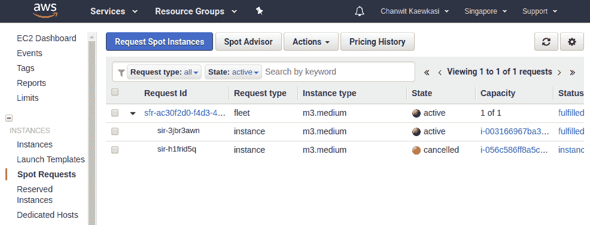

图 7.9：AWS 上显示请求及其相关实例的 Spot Requests 屏幕

请求 Spot 实例有三种模式：

+   一次性请求。这是一次性的请求，所以当实例消失时，我们需要再次请求。

+   请求一组实例，并让 AWS 保持目标实例的数量。当一些实例被终止时，AWS 将尝试根据我们的最高竞价价格分配实例，以满足每个舰队的目标数量。在本章中，我们选择了此请求模型。

+   请求一段固定时间内的实例。固定时间被称为**Spot block**，介于 1 到 6 小时之间。如果设置较长的时间段，我们将支付更多费用。

下图显示了正在准备中的集群的结构：

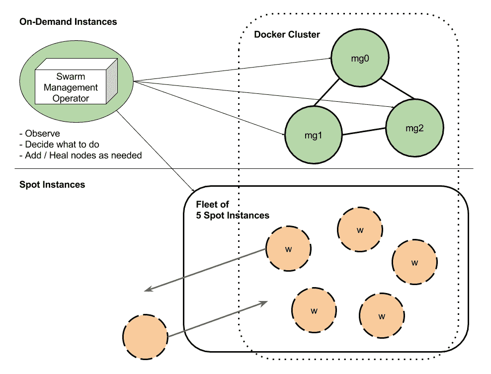

图 7.10：使用自动操作员在 Spot 实例上形成的 Docker 集群

假设我们已经准备好三个箱子作为管理者。为了获得最便宜的费率，建议使用三个按需 EC2 节点作为 Docker 管理者，以及 N-3 个 Spot 实例作为 Docker 工作节点。我们从三个 Spot 工作节点开始。

如果可能的话，请选择允许您创建私有网络和浮动 IP 的云服务提供商。我们将在私有网络上形成一个 Docker 集群。大多数云服务提供商都允许这样做，所以请不要担心。

# 让我们开始

首先，SSH 进入我们希望成为第一个管理节点的节点，安装 Docker，并在其上运行`docker swarm init`命令。`eth0`是云服务提供商提供的私有网络接口。在继续之前，请使用`ip addr`命令检查您的接口。如果您知道哪个接口是私有的，请使用以下命令初始化集群：

```
$ docker swarm init --advertise-addr=eth0
```

接下来，SSH 进入其他两个节点。安装 Docker，并使用`docker swarm join`命令加入集群。不要忘记我们需要使用*管理者*的加入令牌，而不是工作节点的。请注意，在此设置过程中，我的第一个管理者的 IP 是`172.31.4.52`。请将其替换为您的 IP 地址：

```
$ docker swarm join --token SWMTKN-1-5rvucdwofoam27qownciovd0sngpm31825r2wbdz1jdneiyfyt-b5bdh4i2jzev4aq4oid1pubi6 172.31.4.52:2377
```

对于这三个第一节点，不要忘记将它们标记为管理者，以帮助您记住。

在这里，请确保`docker info`显示包含所有管理器的私有 IP 地址列表。我们使用`grep -A3`来查看目标后的三行：

```
$ docker info | grep -A3 "Manager Addresses:"
Manager Addresses:
 172.31.0.153:2377
 172.31.1.223:2377
 172.31.4.52:2377
```

或者，如果您熟悉`jq`命令，可以尝试以下操作：

```
$ docker info --format="{{json .Swarm.RemoteManagers}}" | jq -r .[].Addr
172.31.4.52:2377
172.31.1.223:2377
172.31.0.153:2377
```

`docker info` 命令还支持 `--format` 选项，允许我们自定义输出。在前面的示例中，我们使用模板提供的 JSON 方法来生成 JSON 输出。然后，我们使用 `jq` 查询所有 Swarm 管理节点的 IP 地址。JSON 模板和 `jq` 的结合将是构建我们自己的基于 Docker 脚本来长期操作集群的一个好工具。

# Spot 实例上的工作节点

然后，我们将再配置三个节点作为 Spot 实例的舰队。在下图中，展示了请求一个包含三个 Spot 实例的舰队的设置。选择 "Request and Maintain" 选项，然后将目标容量设置为 `3` 个实例：

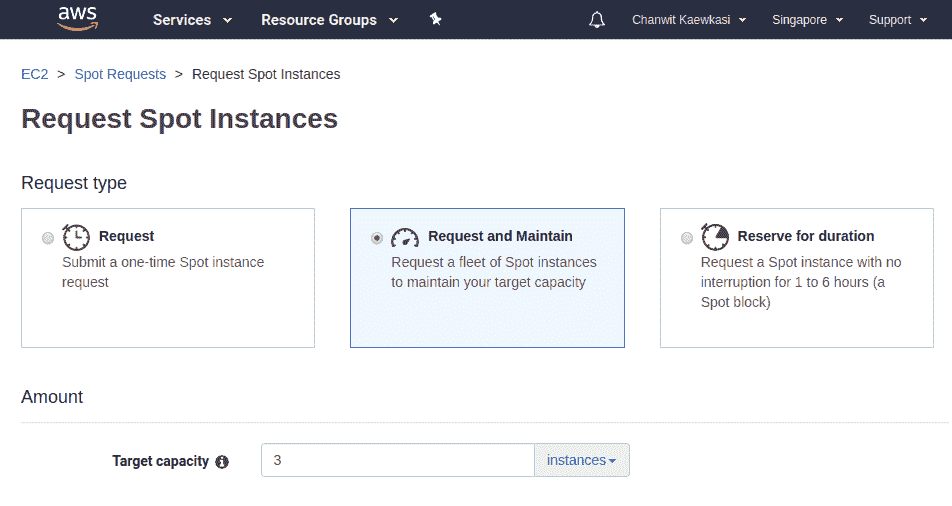

图 7.11：请求并维护一个包含 3 个实例的舰队

我们配置了设置脚本，以在实例创建时安装 Docker，加入节点到集群，并设置网络驱动程序。此设置必须放入舰队设置的用户数据部分，如下图所示：

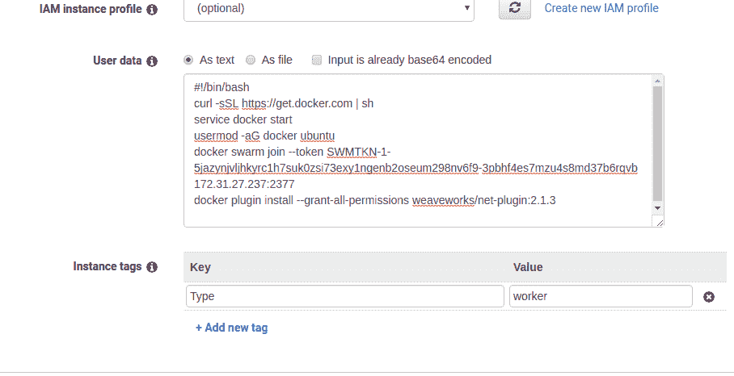

图 7.12：将连接指令放入请求的用户数据中

这是在用户数据部分使用的脚本。请将 `$TOKEN` 替换为您的工作节点令牌，将 `$MANAGER_IP` 替换为您的一个管理节点的私有 IP 地址：

```
#!/bin/bash
curl -sSL https://get.docker.com | sh
service docker start
usermod -aG docker ubuntu
docker swarm join --token $TOKEN $MANAGER_IP:2377
docker plugin install --grant-all-permissions weaveworks/net-plugin:2.1.3
```

现在，我们等待舰队请求完成。

如果我们进入第一个管理节点，可以使用 `docker node ls` 命令查看集群中的当前节点。如果一切正常，集群中应该有六个节点：

```
$ docker node ls
ID          HOSTNAME          STATUS  AVAILABILITY   MANAGER STATUS
btul0hbd    ip-172-31-11-209  Ready   Active 
etm8veip    ip-172-31-8-157   Ready   Active 
iwl4pxnf *  ip-172-31-4-52    Ready   Active         Leader
rsqsflmv    ip-172-31-1-223   Ready   Active         Reachable
uxd36bok    ip-172-31-15-229  Ready   Active 
xn7fz2q1    ip-172-31-0-153   Ready   Active         Reachable
```

使用此技术，我们可以通过简单地调整 Spot 实例的数量来轻松扩展集群。

# 使用网络插件

如我们在舰队设置中的用户数据部分所见，脚本中会有一行指令来为我们安装网络插件。它是 WeaveWorks 网络插件。WeaveWorks 网络插件使用来自 `docker info` 命令的信息来列出所有 Swarm 管理节点的 IP 地址。然后，插件利用这些 IP 地址来启动网络网格。

只有在成功形成集群中的管理节点集合后，才能安装 WeaveWorks 网络插件。

我们使用 WeaveWorks 网络插件 2.1.3。这是截至写作时最稳定的版本。如果有可用的版本，建议升级到此插件的下一个小版本。

要安装网络插件，我们使用 `docker plugin install` 命令：

```
$ docker plugin install --grant-all-permissions weaveworks/net-plugin:2.1.3
2.1.3: Pulling from weaveworks/net-plugin
82e7025f1f50: Download complete 
Digest: sha256:84e5ff14b54bfb9798a995ddd38956d5c34ddaa4e48f6c0089f6c0e86f1ecfea
Status: Downloaded newer image for weaveworks/net-plugin:2.1.3
Installed plugin weaveworks/net-plugin:2.1.3
```

我们使用 `--grant-all-permissions` 只是为了自动化安装步骤。如果没有此参数，我们必须手动授予每个插件所需的权限。

我们需要为集群中的每个节点安装插件，这意味着我们需要为我们的六个节点执行此操作六次。

我们可以使用以下命令检查网络插件是否正确安装：

```
$ docker plugin ls
ID            NAME                         DESCRIPTION                  ENABLED
f85f0fca2af9  weaveworks/net-plugin:2.1.3  Weave Net plugin for Docker  true
```

插件的`ENABLED`状态为`true`，表示它当前处于活动状态。要检查 WeaveWorks 插件及其网络网格的状态，可以通过 CURL 从`localhost:6782/status`获取纯文本状态信息。以下状态信息来自一个工作节点。我们可以从该 URL 检查对等节点之间的连接数或对等节点的数量，例如：

```
$ curl localhost:6782/status
 Version: 2.1.3

 Service: router
 Protocol: weave 1..2
 Name: e6:cc:59:df:57:72(ip-172-31-11-209)
 Encryption: disabled
 PeerDiscovery: enabled
 Targets: 3
 Connections: 5 (5 established)
 Peers: 6 (with 30 established connections)
 TrustedSubnets: none

 Service: ipam
 Status: idle
 Range: 10.32.0.0/12
 DefaultSubnet: 10.32.0.0/12

 Service: plugin (v2)
```

上述示例显示我们有六个对等节点，每个节点有五个连接。IP 范围和默认子网是我们在创建 Docker 网络时需要使用的重要信息。IP 范围是`10.32.0.0/12`，因此如果我们创建一个子网为`10.32.0.0/24`的网络，它将是有效的，而`10.0.0.0/24`则是无效的，例如。

下图展示了我们的 WeaveWorks 网络拓扑。每个节点与其他五个节点有五个连接，图中的实线从**mg**节点指向其他节点。为了使图示易于理解，图中仅展示一个**mg**节点和另一个**wk**节点，它们将五条连接线连接到集群中其他的对等节点：

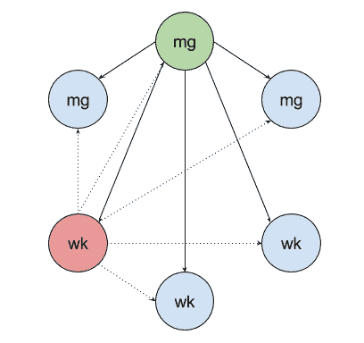

图 7.13：Swarm 节点通过 WeaveWorks 全网格网络相互连接

对于高级故障排除，我们可以检查插件的运行进程`weaver`：

```
$ ps aux | grep weaver
root   4097   0.0 3.4 418660 34968 ? Ssl 06:15 0:06 /home/weave/weaver --port=6783 --datapath=datapath --host-root=/host --proc-path=/host/proc --http-addr=127.0.0.1:6784 --status-addr=0.0.0.0:6782 --no-dns --ipalloc-range=10.32.0.0/12 --nickname ip-172-31-11-209 --log-level=debug --db-prefix=/host/var/lib/weave/weave --plugin-v2 --plugin-mesh-socket= --docker-api= 172.31.4.52 172.31.1.223 172.31.0.153
```

正如从`ps`的输出中 grep 到的内容所示，命令的最后部分是 Swarm 管理器 IP 地址的列表。如果它看起来像这样，我们的网络层已经准备就绪。但如果你在这里没有看到管理器 IP 地址的列表，请删除插件并重新开始。

# 创建网络

当我们使用 WeaveWorks 驱动程序准备网络时，请记住，我们始终需要指定`--subnet`和`--gateway`参数，因为我们不使用 Docker 的 libnetwork 提供的默认子网值。我们需要使网络可附加，使用`--attachable`，以便使用`docker run`命令启动的容器能够附加到该网络。如果没有这个选项，只有通过`docker service create`启动的 Swarm 服务才能加入该网络。

例如，我们可以使用以下命令创建一个*class C*网络：

```
$ docker network create -d weaveworks/net-plugin:2.1.3 \
 --subnet=10.32.0.0/24 \
 --gateway=10.32.0.1 \
 --attachable my_net
```

# 创建一个操作控制平面

操作控制平面是我们部署操作员容器以帮助操作集群的地方。它是源自 CoreOS 操作员模式的一个概念，[`coreos.com/blog/operators`](https://coreos.com/blog/operators)。

首先，我们创建控制网络，以便操作员代理能够连接到管理节点。将其命名为`control`。我们创建这个网络的大小为*class C*。因此，请注意操作员容器的数量不得超过`255`：

```
$ docker network create \
 --driver weaveworks/net-plugin:2.1.3 \
 --subnet 10.32.100.0/24 \
 --attachable \
 control
```

`control`平面中的操作员通常需要访问 Docker API，以观察集群的状态，决定采取什么措施，并将更改反馈到集群中。

为了使 Docker API 能够通过同一控制网络中的每个操作员访问，我们在控制平面中部署`docker-api`服务。

我们使用`rancher/socat-docker`作为`docker-api`服务的镜像，因为它被广泛使用，并且已证明在生产环境中稳定。`docker-api`将部署在每个管理节点上，使用`node.role==manager`。端点模式将设置为`dnsrr`，因为每个`docker-api`实例都是无状态的，Docker 管理器已经负责整个集群的状态。所以这里不需要`vip`端点模式。

每个`docker-api`实例绑定到其 Docker 主机上的`/var/run/docker.sock`，以连接到其本地管理器：

```
$ docker service create \
 --name=docker-api \
 --mode=global \
 --endpoint-mode=dnsrr \
 --network control \
 --constraint "node.role==manager" \
 --mount "type=bind,source=/var/run/docker.sock,target=/var/run/docker.sock" \
 rancher/socat-docker
```

我们将运行一个名为**服务平衡器**的操作容器，作为在生产环境中使用操作容器模式的示例。

# 服务平衡操作器

服务重平衡一直是 Docker 用户请求的功能之一。然而，最好将此功能运行在协调器之外，并作为操作容器运行。

问题在于，在新节点加入集群后，我们通常会重平衡正在运行的服务，以便将负载均匀分布到整个集群中。这个功能之所以没有内置到协调器中，是因为它是特定于应用的。而且，如果集群在节点动态加入和退出时不断进行重平衡，正在运行的服务可能会频繁中断，无法保持足够稳定的状态来处理请求。

然而，如果我们将这种功能实现为操作容器，当它在协调器之外运行时，我们可以在必要时选择禁用它。此外，我们可以选择仅对特定服务进行重平衡。

当前，服务平衡器可作为`chanwit/service-balancer`在 Docker Hub 上使用。我们将在任何管理节点上只运行一个服务平衡器实例：

```
$ docker service create \
 --name service-balancer \
 --network control \
 --constraint node.role==manager \
 --replicas 1 \
 chanwit/service-balancer
```

使用自动重平衡器时需要考虑的一点是，`--update-delay`必须设置为大于每个任务的启动时间。这一点非常重要，特别是对于基于 Java 的服务。这个延迟应该足够大，至少要大于健康检查机制使用的间隔时间。

此外，为了获得最安全的结果，`--update-parallelism`的值应该从`1`开始，并在系统能够稳定提供请求时逐步增加。

为了允许服务自动重平衡，服务平衡操作器会检查服务的标签`rebalance.on.node.create=true`。如果该标签存在于服务中，则每次新节点加入集群时，服务都会被重平衡。

# 日志记录

在日志记录方面，一种流行的解决方案是建立一个 Elasticsearch 堆栈。自然的组合是**Elasticsearch**-**Logstash**-**Kibana**（**ELK**）。

我们使用来自 [`github.com/deviantony/docker-elk`](https://github.com/deviantony/docker-elk) 的 ELK 堆栈，并对其进行修改，通过添加 Docker Swarm 配置来改进它，并使每个组件可以独立部署。原始的 Docker Compose 文件 `docker-compose.yml` 被拆分成三个 YML 文件，分别用于 **Elasticsearch**、**Kibana** 和 **Logstash**。**服务必须以这种方式部署，因为我们不希望在更改每个服务的配置时导致整个日志系统宕机。本章使用的分支可以在 [`github.com/chanwit/docker-elk`](https://github.com/chanwit/docker-elk) 获取。**

以下图示展示了堆栈的结构。所有 ELK 组件将位于 **elk_net** 中。**Logstash** 实例将在端口 **5000** 上暴露。在每个 Docker 主机上，它的本地 **Logspout** 代理将把 Docker 主机的日志消息转发到 **Logstash** 实例。然后，**Logstash** 将转换每条消息并将其存储到 **ElasticSearch** 中。最后，用户可以通过端口 **5601** 访问 **Kibana** 以可视化所有日志：

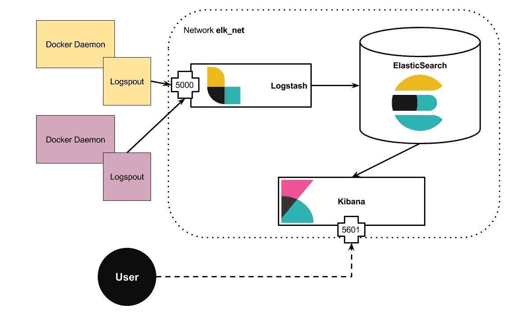

图 7.14：用于集群日志记录的 ELK 堆栈框图

我们首先准备一个专用的 ELK 堆栈网络。我们将此网络命名为 `elk_net` 并将其用于所有 ELK 组件：

```
docker network create \
 --driver weaveworks/net-plugin:2.1.3 \
 --subnet 10.32.200.0/24 \
 --attachable \
 elk_net
```

以下是 `elasticsearch.yml` 的源文件。我们在本章中使用 Docker Compose YML 规范版本 3.3。这是最低要求，因为我们将使用 Docker Swarm 配置来管理所有配置文件。

```
version: '3.3'

configs:
  elasticsearch_config:
    file: ./elasticsearch/config/elasticsearch.yml

services:
  elasticsearch:
    build:
      context: elasticsearch/
    image: chanwit/elasticsearch:6.1
    configs:
      - source: elasticsearch_config
        target: /usr/share/elasticsearch/config/elasticsearch.yml
    environment:
      ES_JAVA_OPTS: "-Xmx512m -Xms512m"

networks:
  default:
    external:
      name: elk_net
```

`docker stack` 需要在部署之前指定镜像名称，这是一个要求。因此，我们首先需要使用 `docker-compose` 构建容器镜像。

我们仅使用 `docker-compose` 来构建镜像。

让我们开始吧！我们使用 `docker-compose build` 准备 YML 文件中定义的镜像。`docker-compose` 命令还会为我们标记镜像。由于我们为每个服务都有一个单独的 YML 文件，因此我们使用 `-f` 来告诉 `docker-compose` 构建正确的文件：

```
$ docker-compose -f elasticsearch.yml build
```

当镜像准备好后，我们可以通过以下命令简单地部署堆栈 `es`：

```
$ docker stack deploy -c elasticsearch.yml es
```

接下来，我们开始准备和部署 Kibana。

这是 Kibana 的堆栈 YML 文件。我们有 `kibana_config` 指向我们的 Kibana 配置。Kibana 端口 `5601` 使用 Swarm 的主机模式发布，以绕过 ingress 层。请记住，我们的集群中实际上没有默认的 ingress 层。如前所述，我们使用 Træfik 作为新的 ingress：

```
version: '3.3'

configs:
  kibana_config:
    file: ./kibana/config/kibana.yml

services:
  kibana:
    build:
      context: kibana/
    image: chanwit/kibana:6.1
    configs:
      - source: kibana_config
        target: /usr/share/kibana/config/kibana.yml
    ports:
      - published: 5601
        target: 5601
        mode: host

networks:
  default:
    external:
      name: elk_net
```

与 Elasticsearch 类似，现在可以使用 `docker-compose build` 命令准备 Kibana 镜像：

```
$ docker-compose -f kibana.yml build
```

之后，我们使用堆栈名称 `kb` 部署 Kibana：

```
$ docker stack deploy -c kibana.yml kb
```

使用 Logstash 时，有两个配置文件需要考虑。最重要的一个是管道配置文件`logstash_pipeline_config`。我们需要在这个文件中添加自定义规则，用于日志消息转换。与 ELK 的前两个组件不同，这个文件会持续变化。Logstash 监听 `5000` 端口，包括 TCP 和 UDP，在 `elk_net` 网络内。稍后我们将把 Logspout 插入到该网络中，将 Docker 守护进程的日志消息传输到 Logstash 服务：

```
version: '3.3'

configs:
  logstash_config:
    file: ./logstash/config/logstash.yml
  logstash_pipeline_config:
    file: ./logstash/pipeline/logstash.conf

services:
  logstash:
    build:
      context: logstash/
    image: chanwit/logstash:6.1
    configs:
      - source: logstash_config
        target: /usr/share/logstash/config/logstash.yml
      - source: logstash_pipeline_config
        target: /usr/share/logstash/pipeline/logstash.conf
    environment:
      LS_JAVA_OPTS: "-Xmx256m -Xms256m"

networks:
  default:
    external:
      name: elk_net
```

接下来的步骤是构建和部署，类似于前两个组件：

```
$ docker-compose -f logstash.yml build
$ docker stack deploy -c logstash.yml log
```

我们将这三个组件作为独立堆栈，通过 `elk_net` 连接在一起。要检查所有组件是否正在运行，只需使用 `docker stack ls` 命令进行检查：

```
$ docker stack ls
NAME      SERVICES
es        1
kb        1
log       1
```

最后，我们可以使用 Logspout 将来自每个 Docker 守护进程的所有日志重定向到 ELK 堆栈中的中央服务。这可以通过将每个本地 `logspout` 容器连接到 `elk_net` 来实现，使它们都能连接到网络内的 Logstash 实例。我们通过以下命令启动每个 Logspout：

```
$ docker run -d \
 --name=logspout \
 --network=elk_net \
 --volume=/var/run/docker.sock:/var/run/docker.sock \
 gliderlabs/logspout \
 syslog+tcp+udp://logstash:5000
```

现在我们可以通过 Logspout 将所有日志消息发送到 Logstash，存储在 Elasticsearch 中，并通过 Kibana 进行可视化。

# 使用 Golang 脚本化 Docker

在操作和管理 Docker 时，我们可以通过 `docker` CLI 使用 `jq` 命令来控制集群。另一种强大且灵活的方式是通过脚本控制集群。当然，最适合脚本化 Docker 集群的编程语言是 Golang。

为什么不用 Python？静态编译语言 Golang 怎么适合脚本编程？

+   首先，Go 是 Docker 所用的编程语言。用 Go 语言编写的 Docker 库就是 Docker 本身所使用的代码。因此，使用该库编写的脚本自然具备高质量和极高的可靠性。

+   其次，语言的构造和习语非常契合 Docker 的工作方式。例如，Go 编程语言有通道（channel）构造，它非常适合处理 Docker 集群发出的事件消息。

+   第三，Go 编译器极其快速。此外，一旦所有相关库编译完成，编译时间大大缩短。我们通常可以像使用其他脚本语言解释器一样使用它来运行脚本。

在本节中，我们将讨论如何使用 Golang 编写的脚本通过 Docker 的 API 直接控制 Docker。这将成为管理集群运行的强大工具。

# 准备工具

安装 Go 编译器并使其准备好使用有时可能会有些棘手。然而，**Golang 版本管理器**（**GVM**）是一个帮助安装和卸载同一台机器上不同 Go 版本的工具。它还帮助有效管理 `GOPATH`。

什么是 GOPATH？它在 Wikipedia 中是这样定义的：

“GOPATH 环境变量用于指定 $GOROOT 之外的目录，这些目录包含 Go 项目的源代码及其二进制文件。”

要开始使用 GVM，我们首先使用在[`github.com/moovweb/gvm`](https://github.com/moovweb/gvm)上提供的代码片段安装`gvm`命令。只需一条命令就能安装：

```
$ bash < <(curl -s -S -L https://raw.githubusercontent.com/moovweb/gvm/master/binscripts/gvm-installer)
```

现在我们已经安装了 GVM，接下来安装 Go。

使用 Go 的最新版本 1.9.3 是很棒的。安装命令当然是`gvm install`。我们向`install`命令传递`-B`参数，这样它将仅下载并使用 Go 分发版的二进制文件：

```
$ gvm install go1.9.3 -B
Installing go1.9.3 from binary source
```

接下来，如果我们在管理集群时选择使用 Go v1.9.3，我们应该将其设为默认版本。使用`gvm use`命令并加上`--default`参数来实现：

```
$ gvm use go1.9.3 --default
Now using version go1.9.3
```

# 使 Go 可脚本化

接下来，准备下一个工具`gorun`，以便将 Go 程序脚本化。使用`gorun`，你可以在脚本的第一行添加 shebang，如以下命令所示：

```
#!/usr/bin/env gorun
```

正常的 Go 程序将允许直接从 shell 执行。

要安装`gorun`，只需执行`go get`。`gorun`二进制文件现在将在当前由 GVM 管理的`go1.9.3`提供的路径下。请注意，如果你通过 GVM 切换 Go 版本，需要重新执行`go get`：

```
$ go get github.com/erning/gorun
```

我们可以通过安装 Docker 客户端库本身，来安装所有必要的库以编程方式控制 Docker：

```
$ go get github.com/docker/docker/client
```

如果一切顺利，我们将准备开始编写一个 Golang 脚本。

# 简单的 Docker 脚本

让我们编写一个与 Docker 交互的简单脚本：

```
#!/usr/bin/env gorun
package main

import (
  "fmt"
  "context"

  "github.com/docker/docker/client"
)

func main() {
  ctx := context.Background()

  cli, err := client.NewClient(client.DefaultDockerHost, "1.30", nil, nil)
  if err != nil {
    panic(err)
  }

  info, err := cli.Info(ctx)
  if err != nil {
    panic(err)
  }

  fmt.Println(info.ServerVersion)
}
```

首先，脚本的第一行必须包含 shebang 和`gorun`。其次，导入 Docker 客户端库的代码行，`github.com/docker/docker/client`。尽管 Docker 已经迁移到`github.com/moby/moby`，但我们仍然需要通过`docker/docker`仓库名导入所有相关库。只需执行`go get github.com/docker/docker/client`，一切仍然可以正常工作。

然后我们开始编程集群，通过创建客户端并将 API 版本设置为 1.30。这个脚本随后调用`cli.Info(ctx)`来从 Docker 守护进程获取引擎信息，存储在`info`变量中。它简单地打印出我们正在交互的 Docker 守护进程的版本信息。版本信息保存在`info.ServerVersion`中。

将脚本保存为名为`server-version`的文件。我们现在可以将其作为普通的 shell 脚本运行：

```
$ chmod +x ./server-version
$ ./server-version
17.06.2-ce
```

# 响应 Docker 事件的脚本

接下来，我们将编写一个脚本，用于监控 Docker 集群中的变化，并在节点更新时打印输出：

```
#!/usr/bin/env gorun
package main

import (
  "context"
  "fmt"

  "github.com/docker/docker/api/types"
  "github.com/docker/docker/api/types/filters"
  "github.com/docker/docker/client"
)

func main() {
  ctx := context.Background()

  cli, err := client.NewClient(client.DefaultDockerHost, "1.30", nil, nil)
  if err != nil {
    panic(err)
  }

  filter := filters.NewArgs(filters.Arg("type", "node"))
  ch, _ := cli.Events(ctx, types.EventsOptions{
    Filters: filter,
  })

  for {

    fmt.Println("Waiting for event ...")
    message := <-ch
    action := message.Action

    switch action {
    case "create":
      fmt.Println(" - New node added.")
    case "update":
      fmt.Println(" - Node updated.")
    case "remove":
      fmt.Println(" - Node removed.")
    }

  }

}
```

这也是一个由`gorun`执行的脚本。脚本开始时创建一个指向本地套接字`/var/run/docker.sock`的 Docker 客户端 CLI。

然后它创建了一个过滤器，`filter` 变量。这个过滤器使事件发射器只选择我们感兴趣的事件类型，在这种情况下，就是事件的 `type` 为 `node`。这相当于在命令行中传递 `--filter type=node`。`cli.Events` 方法将返回一个 Go 通道，用于接收消息。消息将在 `for` 循环内部被获取。如果通道中没有消息，程序将自动阻塞。所以脚本就变成了单线程风格，且易于编程。

在循环内部，我们可以处理消息中的信息，例如检查某个事件的动作。通常，大多数类型的事件包含三种可能的动作：`create`、`update` 和 `remove`。对于一个节点，`create` 表示有一个新节点被添加到集群中。`update` 动作表示某个节点发生了变化。`remove` 动作表示节点从集群中移除。

只需将此脚本保存到 `./node-event`，然后执行 `chmod +x`。

```
$ chmod +x ./node-event
```

`chmod` 命令将更改脚本的可执行位。通过这些位，Linux 系统将能够检测到该文件应该被执行。然后，它将告诉 `gorun` 来处理这个执行。

尝试更改当前工作节点的一些属性。我们可能会看到文本 `- Node updated.` 被打印出来。

# 练习

请尝试回答以下问题，而不回头阅读本章内容：

1.  列出至少三个在稳定集群配置中描述的组件。

1.  为什么重试和断路器如此重要？

1.  我们如何用新的入口层替换默认的入口层？

1.  我们如何安装网络插件？

1.  ELK 堆栈最前端的部分是什么？

1.  为什么 Go 语言适合用于脚本化 Docker 系统？

1.  我们如何监听特定类型的 Docker 事件？

1.  我们如何设置控制平面？

1.  什么是操作符模式？为什么它很重要？

1.  Spot 实例的特点是什么，使它们比普通实例便宜？

# 总结

本章讨论了如何准备和操作 Docker 集群的各种主题，介绍了通过在 Spot 实例上部署 Docker 集群来提供 Lambda 的低成本替代方案。本章还介绍了 CoreOS 操作符模式的概念，并讨论了如何实用地使用它来自动平衡我们集群的任务。

在日志记录方面，ELK 堆栈通常是首选。本章还讨论了如何在 Docker Swarm 上高效地准备 ELK，并以如何通过 Golang 脚本操作集群为结尾，这种脚本技巧可以充分利用 Docker 及其生态系统。

在下一章中，我们将把所有 FaaS 平台放入同一个集群，并使它们协同工作，以展示一个基于 Docker 集群的事件驱动 FaaS 系统的使用案例。
