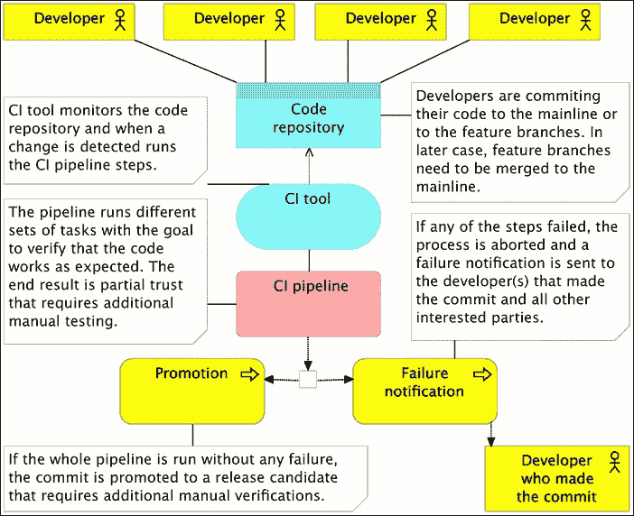

# 第二章 实现突破——持续部署、微服务和容器

初看之下，**持续部署**（**CD**）、**微服务**（**MS**）和*容器*似乎是三个不相关的主题。毕竟，*DevOps*运动并未规定微服务是持续部署所必需的，也没有要求将微服务打包成容器。然而，当这三者结合时，新的大门打开了，等待我们迈步而入。容器领域的最新发展和不可变部署的概念使我们能够克服微服务之前所面临的许多问题。另一方面，它们使我们能够获得灵活性和速度，而没有这些，持续部署将不可能实现，也无法在成本上做到高效。

在我们继续深入这个思路之前，我们将尝试正确地定义每一个术语。

# 持续集成

为了理解持续部署，我们首先需要定义它的前身——持续集成和持续交付。

项目开发的集成阶段往往是软件开发生命周期中最痛苦的阶段之一。我们会花费数周、数月甚至数年时间，在各自的团队中为不同的应用程序和服务而工作。每个团队都有他们自己的需求，并尽力满足它们。虽然定期验证每个应用程序和服务的独立性并不困难，但我们都害怕团队领导决定该是时候将它们集成到一个统一交付物中了。凭借从前期项目中积累的经验，我们知道集成将会遇到问题。我们知道，我们将发现问题、未满足的依赖关系、接口无法正确通信，而管理层将感到失望、沮丧和焦虑。通常情况下，这一阶段可能会花费数周甚至数月时间。最糟糕的是，在集成阶段发现的一个 bug 可能意味着我们需要回去重新做掉几天甚至几周的工作。如果有人问我对集成的看法，我会说这是我能体验到的最接近长期沮丧的感受。那时的情况不同，我们曾认为那是开发应用程序的“正确”方式。

从那时起，很多事情发生了变化。**极限编程**（**XP**）和其他敏捷方法变得广为人知，自动化测试变得频繁，持续集成开始占据重要地位。今天我们知道，当时我们开发软件的方式是错误的。自那时以来，行业已经走了很长一段路。

**持续集成**（**CI**）通常是指在开发环境中集成、构建和测试代码。它要求开发者频繁地将代码集成到共享代码库中。到底“频繁”是指多久，这可以有很多解释，取决于团队的大小、项目的规模以及我们投入的编程时间。在大多数情况下，这意味着开发者要么直接推送代码到共享代码库，要么将自己的代码合并到其中。无论是推送还是合并，这些操作在大多数情况下应该至少每天做几次。将代码推送到共享代码库本身还不够，我们还需要有一个管道，至少要检查代码并运行所有与该代码相关的测试，无论是直接还是间接的。管道执行的结果可以是*红色*或*绿色*。如果是前者，说明某些操作失败了；如果是后者，则说明所有操作都顺利执行。如果出现前者，最小的反应是通知提交代码的人。

持续集成管道应该在每次提交或推送时运行。与持续交付不同，持续集成没有明确的目标来定义该管道。仅仅说一个应用程序与其他应用程序集成并不能告诉我们它的生产准备情况。我们不知道还需要多少工作才能将代码交付到生产环境。我们真正追求的目标只是知道一次提交没有破坏任何现有的测试。尽管如此，正确实施持续集成（CI）仍然是一个巨大的进步。在许多情况下，这是一项非常难以实施的实践，但一旦大家都适应了，结果通常会令人印象深刻。

集成测试需要与实现代码一起提交，或者至少在其之前提交。为了获得最大的效益，我们应该采用**测试驱动开发**（**TDD**）的方式编写测试。这样，不仅测试可以与实现代码一起提交，而且我们知道这些测试是没有缺陷的，不管我们做什么，它们都不会通过测试。TDD 带来了许多其他好处，如果你还没有采用它，我强烈推荐你去使用。你可以参考[`technologyconversations.com/category/test-driven-development/`](https://technologyconversations.com/category/test-driven-development/) 这个博客。

测试并不是唯一的持续集成（CI）前提条件。最重要的一条规则是，当管道失败时，修复问题的优先级要高于任何其他任务。如果这个修复行动被推迟，管道的后续执行也会失败。人们会开始忽略失败通知，渐渐地，CI 过程会失去它的意义。我们越早修复在 CI 管道执行过程中发现的问题，就越好。如果立即采取纠正措施，那么问题的潜在原因仍然鲜明（毕竟，提交与失败通知之间的时间只有几分钟），修复问题应该是轻而易举的。

那么它是如何工作的呢？具体细节取决于工具、编程语言、项目以及许多其他因素。最常见的流程如下：

+   推送到代码仓库

+   静态分析

+   部署前测试

+   打包并部署到测试环境

+   部署后测试

## 推送到代码仓库

开发人员在单独的分支上开发功能。一旦他们觉得自己的工作稳定，所开发的分支就会与主干（或 trunk）合并。更高级的团队可能完全跳过功能分支，直接提交到主干。关键点是主干分支（或 trunk）需要经常接收提交（无论是通过合并还是直接推送）。如果几天或几周过去，变化会积累，使用持续集成的好处会减少。在这种情况下，没有快速反馈，因为与其他人的代码集成被推迟了。另一方面，CI 工具（我们稍后会讨论）正在监控代码库，每当检测到提交时，代码会被检出（或克隆），然后 CI 管道会运行。管道本身由一组自动化任务组成，这些任务可以并行或顺序执行。管道的结果要么是其中某个步骤的失败，要么是成功的提升。至少，失败应该导致某种形式的通知，发送给推送了导致管道失败的提交的开发人员。开发人员应该负责修复问题（毕竟，他最清楚如何修复几分钟前他自己造成的问题），并重新提交代码库，这反过来将触发管道的再次执行。这个开发人员应该把修复问题当作最优先任务，以便保持管道始终为“绿色”，并避免其他开发人员的提交导致失败。尽量将收到失败通知的人员数量保持在最低。整个从发现问题到修复问题的过程应该尽可能快。涉及人员越多，管理工作就越多，直到修复提交的时间就越长。另一方面，如果管道在所有任务中都成功运行，整个过程中生成的包将被提升到下一个阶段，并在大多数情况下交给测试人员进行手动验证。由于管道（几分钟）和手动测试（几小时或几天）之间的速度差异，并非每次管道执行都由 QA 执行：

图 2-1 – 持续集成过程

持续集成管道的第一步通常是静态分析。

## 静态分析

*静态分析* 是在不执行程序的情况下对计算机软件进行的分析。与其相反的是，执行程序时进行的分析被称为 *动态分析*。

静态分析的目标从突出可能的编码错误到确保遵循约定的格式不等。虽然使用静态分析的好处值得商榷，但实施它所需的努力非常小，因此没有真正的理由不使用它。

我不会提供工具的全面列表，因为它们因编程语言而异。`CheckStyle` 和 `FindBugs` 适用于 Java，`JSLint` 和 `JSHint` 适用于 JavaScript，`PMD` 适用于多种语言，这只是几个例子。

静态分析通常是流水线中的第一步，原因很简单，它的执行速度通常非常快，在大多数情况下比流水线中的任何其他步骤都要快。我们需要做的就是选择工具，并通常花一些时间设置我们希望它们使用的规则。从那以后，维护的成本几乎为零。由于执行此步骤不应该超过几秒钟，因此时间成本也微不足道：

图 2-2 – 持续集成流水线：静态分析

在设置好静态分析后，我们的流水线已经启动，可以进入部署前测试阶段。

## 部署前测试

与（可选的）静态分析不同，*部署前*测试应该是强制性的。我故意避免使用更具体的名称来描述这些测试，因为它们依赖于架构、编程语言和框架。一般来说，所有不需要将代码部署到服务器的测试类型都应该在这个阶段运行。*单元测试*总是属于这个类别，可能还会有其他几种测试。如果，例如，你可以在不部署代码的情况下执行*功能测试*，那么就现在执行它们。

部署前测试可能是*持续集成流水线*中最关键的阶段。虽然它不能提供我们所需要的所有确定性，也不能替代*部署后测试*，但在这个阶段运行的测试相对容易编写，执行速度非常快，而且它们通常能提供比其他类型的测试（例如集成测试和性能测试）更大的代码覆盖率：

图 2-3 – 持续集成流水线：部署前测试

## 打包与部署到测试环境

一旦我们完成了所有可以在不实际部署应用程序的情况下进行的验证，就该开始打包了。打包的方法取决于框架和编程语言。在 Java 环境中，我们会创建 JAR 或 WAR 文件，对于 JavaScript，我们会最小化代码，并可能将其发送到 CDN 服务器，等等。有些编程语言在此阶段不需要我们做任何事情，除了可能将所有文件压缩成 ZIP 或 TAR 文件，以便更方便地传输到服务器。一个可选的步骤，但在本书中是必须的，就是创建一个容器，其中不仅包含应用程序包，还包含应用程序可能需要的所有其他依赖项，比如库、运行时环境、应用服务器等。

一旦部署包创建完成，我们可以继续将其部署到测试环境中。根据服务器的容量，你可能需要将其部署到多个机器上，例如，一个机器专门用于性能测试，另一个机器则用于其他所有需要部署的测试：

图 2-4 – 持续集成流水线：打包和部署

## 部署后测试

一旦部署到测试环境中，我们就可以执行其余的测试；这些测试是那些无法在不部署应用程序或服务的情况下运行的测试，以及那些验证集成是否成功的测试。同样，能够在此阶段执行的测试类型取决于框架和编程语言，但作为一般规则，它们包括功能测试、集成测试和性能测试。

用于编写和运行这些测试的具体工具和技术将取决于许多方面。我个人的偏好是使用*行为驱动开发*进行所有功能测试，这些测试同时也作为验收标准，**Gatling**用于性能测试。

一旦部署后测试的执行成功完成，持续集成流水线通常也会完成。我们在*打包*和*部署到测试环境*过程中生成的包或工件，将等待进一步的验证，通常是手动验证。之后，流水线中的某个构建将被选中部署到生产环境。额外检查和部署到生产环境的方式和细节并不属于持续集成的范畴。每个通过整个流水线的构建都被视为已集成，准备好迎接接下来的任务：

图 2-5 – 持续集成流水线：部署后测试

在流水线中还可以做很多其他事情。这里展示的流水线是一个非常通用的示例，通常会因案例而异。例如，你可能会选择测量代码覆盖率，并在未达到某个百分比时失败。

我们现在不深入细节，而是尝试对这个过程进行总体概述，接下来我们将进入持续交付和部署。

# 持续交付与部署

连续交付流水线在大多数情况下与我们用于持续集成（CI）的流水线相同。主要区别在于我们对该过程的信心，以及在流水线执行后无需采取任何后续行动。持续集成假设在之后需要进行（大多是手动）验证，而成功实施连续交付（CD）流水线则意味着包或工件已经准备好进行生产部署。换句话说，每次成功运行的流水线都可以部署到生产环境中，毫无疑问。是否进行部署则更多取决于政治而非技术决策。市场部门可能希望等到某个特定日期，或者他们可能希望将一组功能一起发布。无论选择部署哪个版本以及何时部署，从技术角度来看，每个成功构建的代码都是完全完成的。持续集成与持续交付过程之间的唯一区别在于后者没有在包通过流水线之后进行的手动测试阶段。简而言之，流水线本身提供了足够的信心，认为无需手动操作。借助它，我们在技术上有能力部署每个已推广的构建。至于哪些构建将被部署到生产环境，这通常是基于业务或市场标准的决策，企业决定何时发布一组功能：

图 2-6 – 连续交付过程

请记住，我们在持续交付过程图中继续使用了*CI 工具*。之所以如此，是因为 CI 和 CD 工具之间没有任何实质性差异。这并不意味着没有被市场化的 CD 工具——其实有很多。然而，根据我的经验，这更像是一种市场营销手段，因为假设流程依赖于高度自动化，两者几乎是相同的。

关于流水线过程，持续集成和持续交付之间也没有实质性区别。两者都经历相同的阶段。真正的区别在于我们对该过程的信心。因此，持续交付过程没有手动质量保证（QA）阶段。决定哪个已推广的包将部署到生产环境是我们的任务。

持续部署流水线更进一步，自动部署每一个通过所有验证的构建。它是一个完全自动化的过程，始于代码库的提交，终于应用或服务被部署到生产环境。没有人工干预，没什么需要决定的，也没有什么需要做的，只需开始编写下一个功能，而你的工作成果正在向用户传递。当包被部署到 QA 服务器上，才会部署到生产环境时，部署后测试会进行两次（或根据部署到的服务器数量进行多次）。在这种情况下，我们可能选择运行不同子集的部署后测试。例如，我们可能在部署到 QA 服务器的软件上运行所有测试，而只在部署到生产环境后运行集成测试。根据部署后测试的结果，我们可能选择回滚或将发布版本开放给公众。当使用代理服务让新的发布对公众可见时，通常不需要回滚，因为新发布的应用程序在问题被检测到之前并未对外公开：

图 2-7 – 持续部署流水线

我们需要特别关注数据库（特别是关系型数据库），并确保从一个版本到另一个版本的更改是向后兼容的，并且能够在两个版本之间正常工作（至少在一段时间内）。

虽然持续集成欢迎但不一定要求在生产环境中测试已部署的软件，持续交付和部署则将生产环境中的（主要是集成）测试视为绝对必要，且在持续部署的情况下，这部分测试是完全自动化流水线的一部分。由于没有人工验证，我们需要尽可能确保部署到生产环境中的软件按预期工作。这并不意味着所有的自动化测试都需要重复进行。这意味着我们需要运行能证明部署软件与系统其余部分集成良好的测试。我们可能在其他环境中运行相同的集成测试，但这并不意味着由于某些差异，部署到生产环境的软件就能够继续与系统的其余部分“友好合作”。

在持续部署的背景下，另一个非常有用的技术是功能切换。由于每个构建都会部署到生产环境，我们可以使用功能切换来暂时禁用某些功能。例如，我们可能已经完全开发了登录界面，但没有注册功能。如果没有注册功能，向访客展示一个功能不完整的界面就没有意义。持续交付通过手动批准哪些构建部署到生产环境来解决这个问题，并选择等待。然而，在持续部署的情况下，这个决策过程不可用，因此功能切换是必须的，否则我们就需要延迟与主干的合并，直到所有相关功能完成。然而，我们已经讨论过与主干不断合并的重要性，这种延迟与 CI/CD 的逻辑背道而驰。虽然有其他方法可以解决这个问题，但我认为功能切换是所有选择应用持续部署的团队不可或缺的工具。我们不会深入讨论功能切换的细节。有兴趣了解更多信息的朋友，可以访问[`technologyconversations.com/2014/08/26/feature-toggles-feature-switches-or-feature-flags-vs-feature-branches/`](https://technologyconversations.com/2014/08/26/feature-toggles-feature-switches-or-feature-flags-vs-feature-branches/) 文章。

大多数团队从持续集成开始，逐渐向交付和部署过渡，因为前者是后者的前提条件。在本书中，我们将实践持续部署。不要害怕，我们所做的一切都可以轻松修改，以便进行暂停和手动干预。例如，我们将直接将容器部署到生产环境（实际上是模拟生产环境的虚拟机），而不经过测试环境。当应用本书中的技术时，你可以轻松选择在中间添加一个测试环境。

需要注意的重要一点是，我们讨论的流水线阶段是按特定顺序执行的。这个顺序不仅是逻辑上的（例如，我们不能在编译之前进行部署），而且是根据执行时间的顺序来安排的。执行时间较短的任务会先执行。例如，作为一般规则，部署前的测试通常比部署后的测试运行得要快。这个规则也应该在每个阶段内遵循。例如，如果你在部署前阶段有不同类型的测试，那么先运行那些较快的测试。追求速度的原因是为了尽早获得反馈。我们越早发现提交中有问题，越好。理想情况下，我们应该在开始下一个开发任务之前就得到反馈。提交代码，喝一杯快速的咖啡，检查你的收件箱，如果没有收到任何愤怒的邮件说明某些事情失败了，就可以继续下一个任务。

在本书的后续内容中，你会发现，由于微服务和容器带来的优势，所呈现的管道中的一些阶段和细节有所不同。例如，打包过程最终将以不可变（无法更改）容器的形式完成，可能完全不需要部署到测试环境，我们可能选择直接在生产环境中进行测试，使用蓝绿部署技术，等等。不过，我有点超前了，所有内容都会在适当的时机讲解。

在目前处理完 CI/CD 后（暂时），是时候讨论微服务了。

## 微服务

我们已经在持续部署的背景下讨论过速度。这里的速度是指从新功能的构思到它完全投入使用并部署到生产环境所花的时间。我们希望能够快速行动，并提供最短的上市时间。如果新功能能够在几个小时或几天内交付，业务就能比需要几周或几个月的交付时间更快看到收益。

速度可以通过多种方式实现。例如，我们希望管道尽可能快，这不仅是为了在发生故障时提供快速反馈，还能释放资源供其他排队的任务使用。我们应该目标是在几分钟内，而不是几小时内，从代码检查到部署到生产环境。微服务有助于实现这个时间目标。对于一个庞大的单体应用来说，整个管道的运行通常比较慢。测试、打包和部署也是如此。另一方面，微服务由于更小，通常要快得多。测试的代码更少，打包的代码更少，部署的代码也更少。

如果仅仅是这个原因，我们是不会切换到微服务架构的。稍后会有整整一章内容深入探讨微服务。目前需要注意的是，由于今天的竞争目标（如灵活性、速度等），微服务可能是我们可以应用的最佳架构类型。

## 容器

在容器普及之前，微服务的部署是非常痛苦的。相比之下，单体应用程序的处理相对简单。例如，我们会创建一个单一的工件（JAR、WAR、DLL 等），将其部署到服务器并确保所有必需的可执行文件和库（例如 JDK）都已经到位。这个过程大多数时候是标准化的，考虑的事情相对较少。一个微服务同样简单，但当它们的数量增加到十个、百个甚至千个时，事情就开始变得复杂了。它们可能使用不同版本的依赖、不同的框架、各种应用服务器等等。我们需要考虑的事项开始呈指数级上升。毕竟，微服务的其中一个原因就是能够为每项工作选择最合适的工具。有的可能在 GoLang 中写得更好，而另一些则更适合 NodeJS。一个可能使用 JDK 7，而另一个可能需要 JDK 8。安装和维护这些内容可能会很快让服务器变成垃圾堆，让负责管理的人抓狂。那个时候最常用的解决方案是尽可能标准化。每个人的后端都必须使用 JDK 7。所有前端必须使用 JSP。共有代码应该放在共享库中。换句话说，人们试图用他们多年来在开发、维护和部署单体应用程序中学到的逻辑来解决微服务部署的问题。为了标准化而扼杀创新。而我们不能怪他们。当时唯一的替代方案是不可变虚拟机，但这仅仅是将一组问题替换成另一组问题。直到容器变得流行，且更重要的是，变得大众可用。

Docker 使得我们能够在不受苦的情况下使用容器。它们让容器变得可访问且易于使用，适用于每个人。

什么是容器？容器一词的定义是用于容纳或运输某物的物体。大多数人将容器与*集装箱*联系在一起。它们应具备足够的强度，以承受运输、存储和搬运。你可以看到它们通过各种方式进行运输，其中最常见的是通过船只。在大型船厂，你可以看到数百甚至数千个集装箱堆叠在一起，既横向排布，也纵向叠放。几乎所有的商品都是通过集装箱运输的，这是有原因的。它们是标准化的，易于堆叠且不易损坏。大多数参与运输的人并不知道集装箱里装的是什么。没有人关心（除了海关），因为里面的内容并不重要。唯一重要的是知道在哪儿取货，在哪里交货。这是一个明确的关注点分离。我们知道如何从外部处理它们，而里面的内容只有最初打包的人知道。

“软件”容器背后的理念是相似的。它们是*隔离*和*不可变*的镜像，提供设计好的功能，在大多数情况下只能通过其 API 进行访问。它们是让我们的软件在（几乎）任何环境中可靠运行的解决方案。无论它们运行在哪里（开发者的笔记本电脑、测试或生产服务器、数据中心等），结果应该始终是相同的。最后，我们可以避免如下对话。

QA：登录屏幕存在问题。

开发者：在我的电脑上可以正常工作！

容器使这种对话变得过时的原因是，无论它们运行在何种环境中，容器的行为都是一样的。

容器实现这一壮举的方式是通过*自给自足*和*不可变性*。传统的部署方法会将一个工件放入现有的节点，期待其他所有东西都已就绪；例如应用服务器、配置文件、依赖项等等。而容器则包含了我们软件所需的一切。其结果是，一组镜像堆叠成一个容器，包含从二进制文件、应用服务器和配置到运行时依赖和操作系统包的所有内容。这一描述引出了容器与虚拟机之间的差异问题。毕竟，到目前为止，我们所描述的内容对两者来说都是有效的。

例如，一台物理服务器运行五个虚拟机时，除了*虚拟化管理程序*外，还需要五个操作系统，而虚拟化管理程序比*lxc*更占用资源。另一方面，五个容器共享物理服务器的操作系统，并在适当时共享二进制文件和库。因此，容器比虚拟机轻量得多。对于单体应用来说，这种差别不大，特别是当单个应用就占据整个服务器时。然而对于微服务来说，考虑到可能在单台物理服务器上有数十个甚至数百个容器，这种资源利用上的优势至关重要。换句话说，一台物理服务器可以托管更多的容器，而非虚拟机：

图 2-8 —— 虚拟机与容器资源利用比较

# 三剑客——持续部署、微服务与容器的协同作用

持续部署、微服务和容器是天作之合。它们就像三剑客，每个都能做出伟大的成就，但当它们联合在一起时，能做到更多。

通过持续部署，我们可以提供持续的、自动的反馈，告知应用的准备情况以及部署到生产环境的状态，从而提高交付质量并减少到达市场的时间。

微服务为我们提供了更多的自由，使我们能够做出更好的决策，加快开发进度，并且，正如我们很快将看到的那样，更容易扩展我们的服务。

最终，容器为许多部署问题提供了解决方案；一般来说，特别是在处理微服务时，它们也提高了可靠性，因为它们是不可变的。

它们可以将所有这些结合起来，并做更多的事情。在本书中，我们将以快速和频繁部署为目标，完全自动化，实现零停机时间，具备回滚能力，提供跨环境的一致性可靠性，能够轻松扩展，并创建能够从故障中恢复的自愈系统。这些目标中的任何一个都非常有价值。我们能否实现所有这些目标？可以！我们手头的实践和工具可以提供这一切，我们只需要正确地将它们结合起来。前方的旅程漫长而充满激情。有很多内容需要涵盖和探索，我们需要从头开始；接下来我们将讨论我们即将开始构建的系统架构。

|   | *知道还不够；我们必须应用。愿意还不够；我们必须行动。* |   |
| --- | --- | --- |
|   | --**约翰·沃尔夫冈·冯·歌德** |
