# 第三章 系统架构

从这里开始，整本书将会是一个大型项目。我们将经历所有阶段，从开发到生产部署和监控。每个阶段将从讨论我们可以采取的不同路径开始，以实现目标。我们将根据需求选择最佳路径并实施。目标是学习可以应用到你自己项目中的技术，所以请随时根据需要调整指引。

和大多数其他项目一样，这个项目将从高层次的需求开始。我们的目标是创建一个在线商店。完整的计划还没有出来，但我们知道销售图书是优先事项。我们应该以一种容易扩展的方式设计服务和 Web 应用。我们面前并没有完整的需求集，因此需要为未知做好准备。除了图书，我们还将销售其他类型的商品，并且会有其他功能，如购物车、注册和登录等等。我们的任务是开发书店并能够快速响应未来的需求。由于这是一个新项目，开始时预计不会有太多流量，但如果服务变得成功，我们应该能够轻松快速地扩展。我们希望能够尽快发布新功能，且没有任何停机时间，并且能够从故障中恢复过来。

让我们开始着手架构设计。显然，需求非常笼统，没有提供很多细节。这意味着我们应该为未来可能发生的变化以及新的功能请求做好准备。同时，业务要求我们构建一个小型的系统，但又要准备好扩展。我们该如何解决这些问题呢？

我们首先应该决定的是如何定义我们即将构建的应用的架构。哪种方法能够允许我们在未来可能发生方向变化、额外（但目前未知）需求以及需要准备扩展的情况下做出调整？我们应该从两种最常见的应用架构方法开始：单体架构和微服务架构。

# 单体应用

单体应用是作为一个整体单元进行开发和部署的。在 Java 中，结果通常是一个单独的 WAR 或 JAR 文件。C++、.Net、Scala 以及许多其他编程语言也有类似的情况。

软件开发的短短历史大多标志着我们正在开发的应用程序规模的不断增大。随着时间的推移，我们不断为应用程序添加更多内容，持续增加其复杂性和体积，同时降低我们的开发、测试和部署速度。

我们开始将应用程序分为不同的层：表示层、业务层、数据访问层等。这种分离更多的是逻辑上的，而非物理上的，每一层往往负责某一类特定操作。这种架构通常带来了即时的好处，因为它清晰地定义了每一层的责任。我们在高层次上实现了关注点的分离。生活变得美好，生产力提高，上市时间缩短，代码库的整体清晰度也更高。每个人似乎都很开心，至少有一段时间是这样：

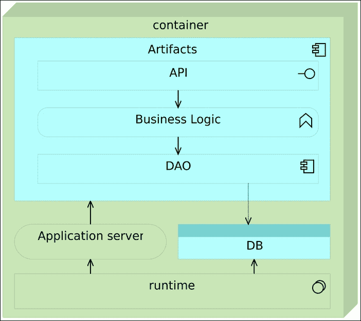

图 3-1 – 单体应用

随着时间的推移，我们应用程序需要支持的功能数量不断增加，而这也带来了更高的复杂性。一个 UI 层的功能需要与多个业务规则进行交互，而这些业务规则又需要多个 DAO 类来访问不同的数据库表。不管我们如何努力，每一层内部的细分和层与层之间的通信变得越来越复杂，并且如果时间足够长，开发人员开始偏离最初的设计路径。毕竟，最初设计的方案通常经不起时间的考验。因此，对任何给定子层的修改往往变得更加复杂、耗时且风险较大，因为这些修改可能会影响系统的多个部分，并且往往带来无法预见的影响：

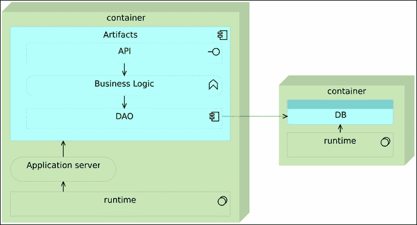

图 3-2 – 功能增加的单体应用

随着时间的推移，情况开始变得更糟。在许多情况下，层数增加了。我们可能会决定添加一个规则引擎层、API 层等等。正如通常的情况那样，层与层之间的流动在很多情况下是必须的。这样就导致了我们可能需要开发一个简单的功能，在不同的情况下可能只需要几行代码，但由于架构的原因，这几行代码最终变成了几百行甚至几千行，因为所有层都需要经过。

开发并不是唯一受到单体架构影响的领域。每次有变化或发布时，我们仍然需要对所有内容进行测试和部署。在企业环境中，应用程序的测试、构建和部署通常需要数小时之久并不罕见。测试，尤其是回归测试，往往是噩梦般的，在某些情况下，可能持续数月。随着时间的推移，我们对仅影响一个模块的更改的处理能力正在下降。层的主要目标是使它们能够轻松地被替换或升级。这个承诺几乎从未真正实现过。在大型单体应用中，替换某个部分几乎从来都不是容易且无风险的事情。

扩展单体应用通常意味着扩展整个应用程序，从而导致资源的极度不平衡。如果我们需要更多的资源，我们不得不将一切都复制到新的服务器上，即使瓶颈只是某一个模块。在这种情况下，我们最终常常会得到一个在多个节点上复制的单体应用，并在其上方加上负载均衡器。这种设置充其量只是次优的：

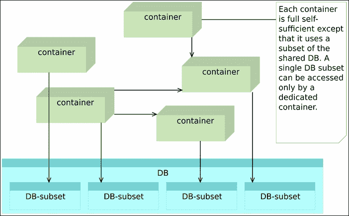

图 3-3 – 扩展单体应用

## 服务按水平进行拆分

**面向服务架构**（**SOA**）是为了解决由常常紧密耦合的单体应用所带来的问题而创建的。该方法基于我们应该实现的四个主要概念：

+   边界是显式的

+   服务是自治的

+   服务共享架构和合同，但不共享类

+   服务兼容性基于策略

SOA 取得了巨大的成功，许多软件供应商纷纷投入其中，创建了旨在帮助我们进行过渡的产品。由 SOA 运动产生的最常用类型是**企业服务总线**（**ESB**）。与此同时，曾经遇到单体应用和大规模系统问题的公司也加入了这一潮流，并以 ESB 作为引擎，开始了 SOA 的过渡。然而，这一转变的共同问题是，我们通常习惯的工作方式往往导致试图将 SOA 架构人为地应用到现有模型中。

我们依然保留之前的层次结构，但这次它们被物理上分隔开了。从这种方法中，至少可以看到一个明显的好处，那就是我们可以至少独立地开发和部署每一层。另一个改进是扩展性。通过对曾经是层的部分进行物理分离，我们能够更好地进行扩展。这种方法通常与**企业服务总线**（**ESB**）产品的购买相结合。在服务之间，我们会插入 ESB，它负责将请求从一个服务转发到另一个服务。ESB 和类似的产品各自是庞然大物，最终我们往往会得到另一个单体应用，它的规模与我们曾试图拆分的应用相同，甚至更大。我们真正需要的是通过边界上下文来拆分服务，并将它们物理上分开，每个服务在独立的进程中运行，并明确其之间的通信。于是，微服务应运而生。

## 微服务

微服务是构建由小型服务组成的单个应用程序的一种方法。理解微服务的关键在于它们的独立性。每个微服务都是单独开发、测试和部署的。每个服务作为一个单独的进程运行。不同微服务之间唯一的联系是通过它们暴露的 API 进行数据交换。从某种意义上说，它们继承了 Unix/Linux 中使用的小程序和管道的思想。大多数 Linux 程序都很小并生成一些输出。该输出可以作为其他程序的输入传递。当这些程序被链接在一起时，它们可以执行非常复杂的操作。这是由许多简单单元组合而成的复杂性。

从某种意义上说，微服务使用了 SOA 定义的概念。那么为什么它们被称为不同？SOA 的实现偏离了轨道。这在 ESB 产品出现后尤其明显，它们本身成为复杂的大型企业应用程序。在许多情况下，采用 ESB 产品后，业务仍然像以前一样，只是多了一个层次。微服务运动在某种程度上是对 SOA 误解的反应，并意图回归一切开始的地方。SOA 和微服务之间的主要区别在于后者应该是自给自足的，可以独立部署，而 SOA 倾向于以单体形式实现。

看看 Gartner 关于微服务的看法。虽然我不是他们预测的忠实拥护者，但他们确实触及了市场的重要方面，吸引了大型企业环境的注意。他们对市场趋势的评估通常意味着我们已经超越了新兴项目的采用阶段，技术已经准备好面向大型企业。以下是 Gary Olliffe 在 2015 年初对微服务的看法。

微服务架构承诺为基于服务的应用程序的开发和部署提供灵活性和可扩展性。但是这种承诺是如何实现的？简而言之，通过采用允许独立和动态构建和部署个别服务的架构；通过采纳 DevOps 实践的架构。

微服务更简单，开发人员更高效，系统可以快速且精确地扩展，而不是以大型单片机的形式。我甚至还没有提到多语言编码和数据持久性的潜力。

微服务的关键方面如下：

+   它们只做一件事或负责一个功能。

+   每个微服务可以由任何一组工具或语言构建，因为每个微服务都独立于其他服务。

+   它们真正是松耦合的，因为每个微服务都与其他服务物理分离。

+   不同团队开发不同微服务之间的相对独立性（假设它们暴露的 API 是预先定义的）。

+   更容易的测试和持续交付或部署。

微服务面临的一个问题是何时使用它们。在最初，当应用程序还很小的时候，微服务试图解决的问题并不存在。然而，一旦应用程序成长起来，并且微服务的应用场景成立，切换到另一种架构风格的成本可能会过高。经验丰富的团队倾向于从一开始就使用微服务，知道他们可能以后要付出的技术债务比从一开始就使用微服务的成本更高。通常，正如 Netflix、eBay 和 Amazon 的情况一样，单体应用会逐步向微服务演化。新的模块作为微服务开发并与系统的其余部分集成。一旦它们证明了自己的价值，现有单体应用的部分内容也会重构为微服务。

企业应用程序的开发者常常批评的一个问题是数据存储的去中心化。虽然微服务可以在使用集中式数据存储的情况下运行（只需做少许调整），但至少应该探索将这部分存储去中心化的选项。将与某个服务相关的数据存储在一个单独的（去中心化的）存储中，并将其与其他内容一起打包到同一个容器中，或者作为一个独立的容器进行链接，在很多情况下可能比将数据存储在集中式数据库中更为合适。我并不是建议总是使用去中心化存储，而是建议在设计微服务时考虑到这一选项。

最后，我们通常会使用某种轻量级代理服务器，负责协调所有请求，无论这些请求来自外部还是来自一个微服务到另一个微服务之间：

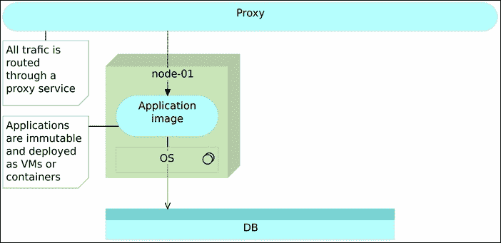

图 3-4 – 带代理服务的微服务

在了解了单体架构和微服务的基本知识之后，让我们比较这两者，评估它们的优缺点。

# 单体应用与微服务比较

从我们目前学到的内容来看，微服务比单体架构似乎是一个更好的选择。的确，在许多（但远非所有）情况下，它们是更好的选择。然而，世上没有免费的午餐。微服务也有一套缺点，其中增加的运维和部署复杂性，以及远程进程调用是最常见的问题。

## 运维和部署复杂性

反对微服务的主要论点是增加的运维和部署复杂性。这个论点是正确的，但由于相对较新的工具，运维复杂性可以得到缓解。**配置管理**（**CM**）工具能够相对轻松地处理环境设置和部署。使用 Docker 的容器显著减少了微服务可能带来的部署难题。CM 工具与容器结合使用，使得我们可以快速部署和扩展微服务。

在我看来，通常增加部署复杂性的论点没有考虑到我们在过去几年中看到的进展，并且被极大夸大了。这并不意味着工作的一部分没有从开发转移到 DevOps。事实上是有的。然而，在许多情况下，好处远大于这种变化产生的不便。

## 远程过程调用

另一个支持单体应用的论点是由微服务远程过程调用产生的性能降低。通过类和方法的内部调用更快，这个问题无法解决。这种性能损失对系统的影响程度因情况而异。重要因素是我们如何分割系统。如果我们朝着非常小的微服务方向发展（有些人建议它们的代码不应超过 10-100 行），这种影响可能是相当大的。我喜欢创建围绕界限上下文或功能（如用户、购物车、产品等）组织的微服务。这减少了远程过程调用的数量，但仍然保持服务组织在健康边界内。另外，重要的是要注意，如果一个微服务对另一个微服务的调用通过快速的内部局域网进行，负面影响相对较小。

那么，微服务相比单体应用有什么优势呢？以下列表绝不是最终版本，也不代表只有微服务才有的优势。虽然许多优点对其他类型的架构也是有效的，但它们在微服务中更为突出。

## 扩展

缩放微服务比单体应用程序容易得多。对于单体应用程序，我们将整个应用程序复制到新的机器中。另一方面，对于微服务，我们只复制那些需要扩展的部分。我们不仅可以扩展需要扩展的部分，而且可以更好地分配事物。例如，我们可以将 CPU 使用量大的服务与另一个使用大量内存的服务放在一起，同时将其他 CPU 需求服务移到不同的硬件上。

## 创新

一旦制定了单体应用程序的初始架构，就没有太多空间进行创新。我甚至可以进一步说，单体应用程序是创新的杀手。由于它们的性质，改变事物需要时间，而且试验是危险的，因为它可能影响到一切。例如，我们不能仅仅因为它更适合一个特定模块就将 Apache Tomcat 更改为 NodeJS。

我并不是建议我们为每个模块更换编程语言、服务器、持久化和其他架构方面的内容。然而，单体服务器往往走向另一个极端——如果没有不受欢迎的变化，那么变化就是风险。而在微服务中，我们可以为每个服务单独选择我们认为最合适的解决方案。一个服务可能使用 Apache Tomcat，另一个可能使用 NodeJS。一个可以用 Java 编写，另一个可以用 Scala 编写。我并不主张每个服务都与其他服务不同，而是每个服务可以根据我们认为最适合目标的方式来构建。除此之外，变更和实验变得更容易进行。毕竟，只要 API 得以遵循，我们所做的任何更改都只会影响众多微服务中的一个，而不会影响整个系统。

## 大小

由于微服务较小，因此更容易理解。要查看一个微服务的功能，所需查看的代码较少。这本身极大地简化了开发过程，尤其是在新成员加入项目时。除此之外，其他方面也往往更快。与用于单体应用程序的大型项目相比，IDE 在小型项目上运行更快。它们启动速度更快，因为没有庞大的服务器，也没有需要加载的大量库。

## 部署、回滚和故障隔离

微服务使部署变得更快、更容易。部署小的东西总是比部署大的东西更快（如果不是更容易的话）。如果我们意识到出现了问题，那么这个问题的影响可能是有限的，并且可以更容易地回滚。在我们回滚之前，故障被隔离在系统的一个小部分。持续交付或部署的速度和频率，是在大型应用程序中无法实现的。

## 承诺期限

单体应用程序的常见问题之一是承诺。我们通常从一开始就不得不选择架构和技术，这些选择会持续很长时间。毕竟，我们正在构建的是一个应持续很长时间的大型项目。而微服务则大大减少了对长期承诺的需求。改变一个微服务中的编程语言，如果证明这是一个不错的选择，那么可以将其应用到其他微服务。如果实验失败或不是最佳选择，只有系统中的一小部分需要重做。同样，框架、库、服务器等方面也可以如此处理。我们甚至可以使用不同的数据库。如果某些轻量级的 NoSQL 似乎最适合某个微服务，为什么不使用它并将其打包到容器中呢？

让我们回退一步，从部署的角度来看这个问题。当我们需要部署应用程序时，这两种架构方法有何不同？

## 部署策略

我们已经讨论过，持续交付和部署策略要求我们重新思考应用程序生命周期的各个方面。没有什么比一开始在面临架构选择时更能体现这一点了。我们不会深入讨论可能面临的每一种部署策略，而是将范围限定为我们应该做出的两个主要决策。第一个是与架构相关，涉及单体应用和微服务之间的选择。第二个与我们如何打包需要部署的工件有关。更准确地说，是我们应该执行可变部署还是不可变部署。

## 可变怪物服务器

今天，构建和部署应用程序的最常见方式是作为可变怪物服务器。我们创建一个包含整个应用程序的 Web 服务器，并在每次有新版本发布时更新它。更改可以涉及配置（属性文件、XML、数据库表等）、代码工件（JAR、WAR、DLL、静态文件等）以及*数据库模式和数据*。由于我们在每次发布时都会进行更改，因此它是可变的。

对于可变服务器，我们无法确定开发、测试和生产环境是否完全相同。即使是生产环境中的不同节点也可能存在不必要的差异。代码、配置或静态文件可能并没有在所有实例中都进行更新。

它是一个怪物服务器，因为它包含了我们需要的所有内容，作为一个单一实例。后端、前端、API 等等。此外，它会随着时间的推移而增长。过了一段时间后，没人能确定生产环境中所有组件的确切配置，而唯一能够准确复制它的方式（如新的生产节点、测试环境等）就是复制它所在的虚拟机，并开始调整配置（IP 地址、主机文件、数据库连接等）。我们不断地向其中添加内容，直到我们失去对其内容的跟踪。给足够的时间，你的“完美”设计和令人印象深刻的架构将变成另一种样子。新的层次会被添加，代码会被耦合，补丁层层叠加，人们开始迷失在代码的迷宫中。你那美丽的小项目将变成一个庞大的怪物。

你所拥有的骄傲将成为人们在咖啡休息时讨论的话题。人们会开始说，他们能做的最好的事情就是把它丢进垃圾桶，从头开始。然而，这个怪物已经太大，无法从头开始。投入了太多。重写它需要太多的时间。风险太大。我们的巨型单体应用可能会继续存在很长时间：

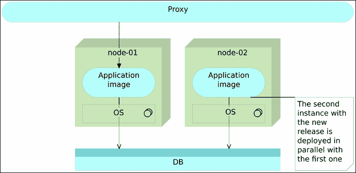

图 3-5 – 最初设计的可变应用程序服务器

可变部署看起来可能很简单，但实际上通常并非如此。通过将所有内容集中在一个地方，我们隐藏了复杂性，从而增加了不同实例之间出现差异的可能性。

当该服务器接收到新版本时，重新启动的时间可能会相当长。在这段时间里，服务器通常无法正常运行。新版本引起的停机时间会造成金钱和信任的损失。今天的商业环境要求我们 24/7 全天候运营，没有任何停机时间，并且在生产发布时，团队通常需要夜间工作，此时我们的服务不可用。在这种情况下，实施持续部署是一个无法触及的梦想。这是一个无法成为现实的梦想。

测试也是一个问题。无论我们在开发和测试环境中对发布做了多少测试，第一次在生产环境中尝试的时刻是我们部署它并使其不仅对测试人员可用，而且对所有用户可用的时刻。

此外，这样的服务器快速回滚几乎是不可能的。由于它是可变的，除非我们创建整个虚拟机的快照，否则无法获得前一个版本的“照片”，这会带来一系列新的问题。

通过这种架构，我们无法完成之前描述的所有要求，甚至可能连其中任何一项也无法实现。由于无法实现零停机和轻松回滚，我们无法经常进行部署。由于架构的可变性，完全自动化存在风险，从而使我们无法快速行动。

由于不经常部署，我们积累了需要发布的更改，从而增加了失败的可能性。

为了解决这些问题，部署应该是不可变的，并且由小型、独立且自给自足的应用程序组成。记住，我们的目标是频繁部署，实现零停机，能够回滚任何版本，实现自动化并提高速度。此外，我们还应该能够在用户看到发布之前，在生产环境中测试它。

### 不可变服务器和反向代理

每次传统部署都会引入与服务器上需要进行的更改相关的风险。如果我们将架构更改为不可变部署，我们将获得立即的好处。环境的配置变得更加简单，因为不需要考虑应用程序（它们是不可更改的）。每当我们将镜像或容器部署到生产服务器时，我们知道它与我们构建和测试的镜像完全相同。不可变部署降低了与未知相关的风险。我们知道每个部署实例与其他实例完全相同。与可变部署不同，当一个包是不可变的并且包含所有内容（应用服务器、配置和工件）时，我们就不再关心这些事情。它们在部署管道中已经为我们打包好，我们所要做的就是确保不可变的包被发送到目标服务器。它与我们在其他环境中已经测试过的包完全相同，因此，源自可变部署的那些不一致性已经消失。

可以使用反向代理来实现零停机。不可变服务器和反向代理结合使用，简化形式如下。

首先，我们从一个指向完全自给自足的不可变应用包的反向代理开始。这个包可以是虚拟机或容器。我们将这个应用称为应用镜像，以便与可变应用区分开来。在应用之上是一个代理服务，它将所有流量路由到最终目标，而不是直接暴露服务器：

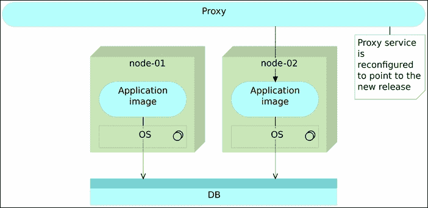

图 3-6：以镜像（虚拟机或容器）形式部署的不可变应用服务器

一旦决定部署新版本，我们通过将单独的镜像部署到单独的服务器来实现。在某些情况下，我们也可以将这个镜像部署到同一台服务器上，但通常情况下，单体应用非常占用资源，我们无法在同一节点上同时运行两个实例而不影响性能。此时，我们有两个实例。一个旧的（之前的版本）和一个新的（最新的版本）。所有流量仍然通过反向代理转发到旧服务器，因此我们的应用用户并不会注意到任何变化。对他们来说，我们仍然在运行旧版且经过验证的软件。这时正是执行最终测试的时机。理想情况下，这些测试是自动化的，并且是部署过程的一部分，但手动验证也是可以接受的。例如，如果对前端进行了修改，我们可能希望进行最后一轮用户体验测试。无论执行何种类型的测试，它们都应该直接攻击新的发布版本，绕过反向代理。这些测试的好处在于，我们正在与未来的生产版本软件进行工作，并且该软件已经在生产硬件上运行。我们正在测试生产软件和硬件，而不会影响我们的用户（他们仍然被重定向到旧版本）。我们甚至可以以 A/B 测试的形式，将新版本仅启用给有限数量的用户。

总结一下，在这个阶段我们有两个服务器实例，一个（之前的版本）供用户使用，另一个（最新的版本）用于测试：

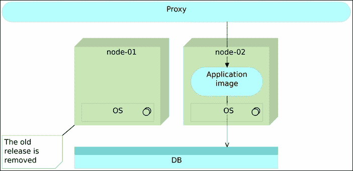

图 3-7 – 不可变应用的新版本已部署到单独的节点

一旦测试完成并且我们确信新版本按预期工作，所要做的就是更改反向代理，指向新版本。旧版本可以暂时保留，以防我们需要回滚更改。然而，对于我们的用户来说，它是不存在的。所有流量都被引导到新版本。由于在我们更改路由之前，最新版本已经正常运行，因此切换本身不会中断我们的服务（不同于例如，如果我们需要在可变部署的情况下重启服务器）。当路由更改时，我们需要重新加载反向代理。例如，*nginx* 会保持旧的连接，直到所有连接都切换到新路由：

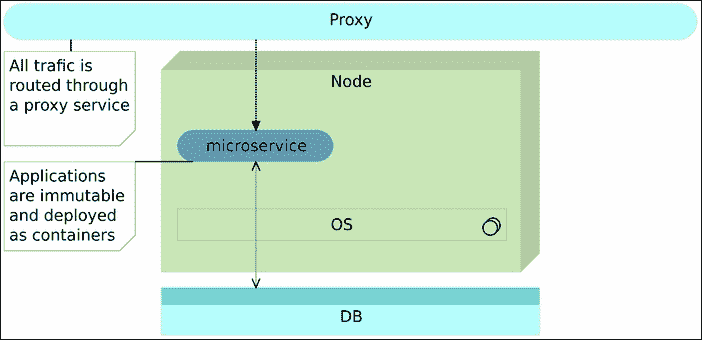

图 3-8：Poxy 被重定向到指向新版本

最后，当我们不再需要旧版本时，可以将其移除。更好的是，我们可以让下一个版本为我们移除它。在后一种情况下，当时间到来时，发布流程将删除旧版本并重新开始整个过程：

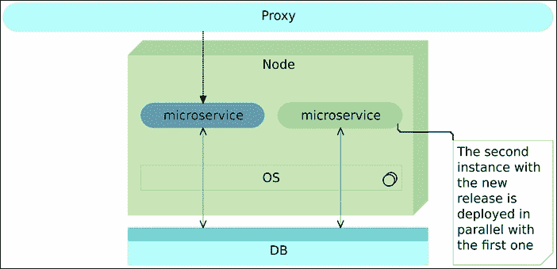

图 3-9 – 旧版本被移除

上述技术称为蓝绿部署，已经使用了很长时间。我们将在稍后的 Docker 打包和部署示例中进行实践。

### 不可变微服务

我们可以做得更好。通过不可变部署，我们可以轻松实现流程的自动化。反向代理为我们提供了零停机时间，且保持两个版本同时运行使得我们可以轻松回滚。然而，由于我们仍然在处理一个大型应用，部署和测试可能需要很长时间才能完成。这本身可能会阻碍我们的速度，从而无法按需频繁部署。此外，将一切都作为一个大型服务器来处理增加了开发、测试和部署的复杂性。如果可以将它们拆分成更小的部分，我们就可以将复杂性划分为更易管理的小块。作为额外好处，拥有小型独立服务将使我们能够更轻松地进行扩展。它们可以部署到同一台机器上，通过网络进行横向扩展，或者在某个服务的性能成为瓶颈时进行复制。微服务来拯救我们！

对于大型应用程序，我们通常会有解耦的层次结构。前端代码应该与后端分开，业务层与数据访问层分开，等等。随着微服务的出现，我们应该开始以不同的方向思考。与其将业务层与数据访问层分开，我们应该将服务进行拆分。例如，用户管理可以与销售服务分开。另一个区别在于物理层面。传统架构是在包和类的层次上进行分离，但仍然将所有内容部署在一起，而微服务则是物理上的拆分；它们甚至可能不在同一台物理机器上。

微服务的部署遵循与之前描述的相同模式。我们像部署其他软件一样部署微服务的不可变镜像：

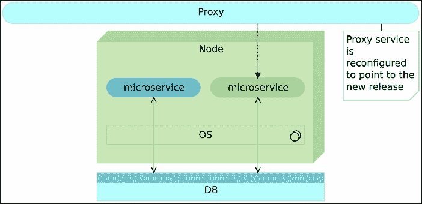

图 3-10 – 作为镜像（虚拟机或容器）部署的不可变微服务

当需要发布某个微服务的新版本时，我们将其与旧版本一起部署：

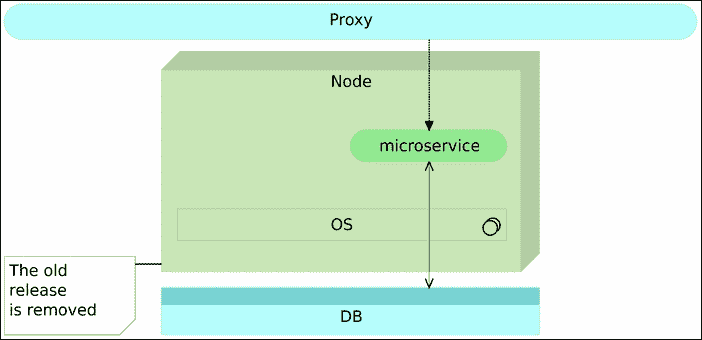

图 3-11 – 新版本的不可变微服务与旧版本并行部署

当微服务版本经过充分测试后，我们更改代理路由。

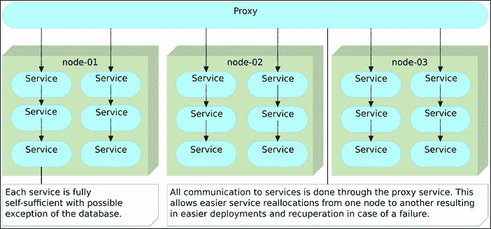

图 3-12 – 代理已重新配置为指向新版本

最后，我们移除旧版本的微服务。

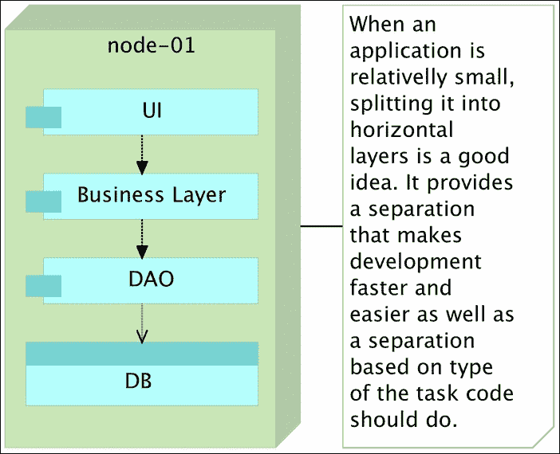

图 3-13 – 旧版本已被移除

唯一显著的区别是，由于微服务的大小，我们通常不需要单独的服务器来与旧版本并行部署新版本。现在我们可以真正实现频繁自动部署，快速零停机并且在出现问题时回滚。

从技术上讲，这种架构可能会带来一些特定的问题，这些问题将成为接下来章节的主题。现在我们只需说，这些问题可以通过我们现有的工具和流程轻松解决。

考虑到我们的需求最为简单，且微服务相较于单体应用带来了更多的优势，选择变得显而易见。我们将使用不可变微服务方法来构建我们的应用程序。这一决定需要讨论我们应遵循的最佳实践。

# 微服务最佳实践

以下大部分最佳实践可以应用于面向服务的架构。然而，对于微服务来说，它们变得更加重要或有益。接下来会对这些做简要描述，并在本书后续部分详细阐述。

## 容器

处理大量微服务可能迅速变成一项非常复杂的工作。每个微服务可能用不同的编程语言编写，可能需要不同的（最好是轻量级的）应用服务器，或使用不同的库集。如果每个服务都打包成一个容器，许多问题将迎刃而解。我们只需运行该容器，例如使用 Docker，并相信它里面包含了所需的一切。

容器是自给自足的打包单元，包含我们所需的一切（除了内核），在隔离的进程中运行，并且是不可变的。自给自足意味着容器通常具有以下组件：

+   运行时库（JDK、Python 或应用程序运行所需的其他库）

+   应用服务器（Tomcat、nginx 等）

+   数据库（最好是轻量级的）

+   工件（JAR、WAR、静态文件等）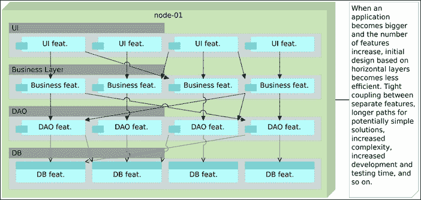

    图 3-14 – 容器内的自给自足微服务

完全自给自足的容器是部署服务的最简单方式，但在扩展时会带来一些问题。如果我们希望在集群的多个节点上扩展此类容器，就需要确保嵌入到这些容器中的数据库已同步，或者它们的数据卷位于共享驱动器上。第一个选项往往会引入不必要的复杂性，而共享卷可能会对性能产生负面影响。另一种选择是通过将数据库外部化到单独的容器中，使容器几乎自给自足。在这种设置下，每个服务将有两个不同的容器，一个用于应用程序，另一个用于数据库。它们将通过代理服务（最好是通过代理服务）连接。虽然这种组合稍微增加了部署复杂性，但它在扩展时提供了更大的自由度。我们可以根据性能测试结果或流量的增加，部署多个应用程序容器实例或多个数据库实例。最后，若需要，我们完全可以同时扩展两者。

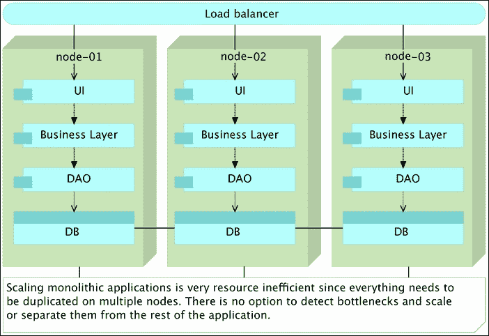

图 3-15 – 微服务与独立数据库容器内运行

自给自足和不可变性使我们能够在不同的环境（开发、测试、生产等）中移动容器，并始终期望相同的结果。这些特性与构建小型应用程序的微服务方法相结合，使我们能够以非常低的努力和比其他方法更低的风险来部署和扩展容器。

然而，在处理遗留系统时，有一个第三种常用的组合。尽管我们可能决定逐步从单体应用迁移到微服务，但数据库往往是系统中最后被批准重构的部分。虽然这远不是执行过渡的最佳方式，但现实情况，尤其是在大型企业中，数据是最有价值的资产。重写应用程序的风险远低于如果我们决定重构数据时所面临的风险。管理层通常对这种提案持怀疑态度是可以理解的。在这种情况下，我们可能会选择共享数据库（可能没有容器）。尽管这种决策在一定程度上与我们通过微服务实现的目标相悖，但最有效的模式是共享数据库，但确保每个模式或一组表仅由单一服务访问。其他需要这些数据的服务必须通过分配给它的服务的 API 来访问。在这种组合下，我们并没有实现明确的分离（毕竟，没有比物理分离更明确的了），但我们至少可以控制谁访问数据子集，并且可以清晰地确定它们与数据之间的关系。

实际上，这与通常所说的水平层次结构的概念非常相似。实际上，随着单体应用程序的增长（以及层次的增加），这种方法往往会被滥用或忽视。即使数据库是共享的，垂直分离帮助我们保持每个服务所负责的清晰边界。

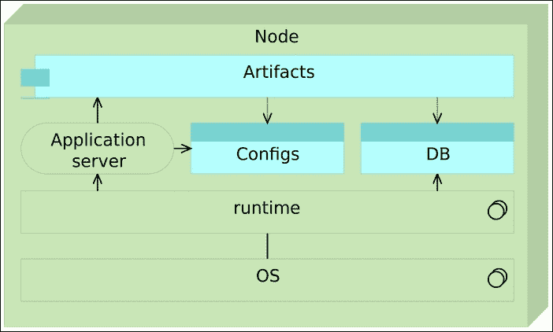

图 3-16 – 微服务在容器内访问共享数据库

# 代理微服务或 API 网关

大型企业的前端可能需要发起数十甚至数百个 HTTP 请求（比如亚马逊网站的情况）。请求的发起往往比接收响应数据所需的时间要长。这时候，代理微服务可能会有帮助。它们的目标是调用不同的微服务并返回聚合的服务。它们不应包含任何逻辑，只需将多个响应合并，并向消费者返回聚合后的数据。

## 反向代理

永远不要直接暴露微服务 API。如果没有一些协调机制，消费者和微服务之间的依赖关系会变得非常紧密，以至于可能会剥夺微服务应当带给我们的自由。像 *nginx*、*Apache Tomcat* 和 *HAProxy* 这样的轻量级服务器非常擅长执行反向代理任务，且可以以非常小的开销轻松部署。

## 极简主义方法

微服务应仅包含其真正需要的包、库和框架。它们越小越好。这与单体应用程序的做法有很大不同。以前，我们可能使用像 JBoss 这样的 JEE 服务器，打包了所有可能用到或者不一定用到的工具，而微服务则在极简主义解决方案中表现最佳。拥有数百个微服务，每个都配备完整的 JBoss 服务器，显然是过度的。比如，*Apache Tomcat* 就是一个更好的选择。我倾向于选择更小的解决方案，例如，*Spray* 作为一个非常轻量级的 RESTful API 服务器。不要打包你不需要的东西。

同样的做法也应应用于操作系统层面。如果我们将微服务作为 *Docker* 容器部署，*CoreOS* 可能比 *Red Hat* 或 *Ubuntu* 更合适。它去除了我们不需要的部分，让我们能够更好地利用资源。然而，正如我们稍后会看到的，选择操作系统并不总是那么简单。

## 配置管理

随着微服务数量的增加，**配置管理**（**CM**）的需求也在增加。没有像 *Puppet*、*Chef 或 Ansible*（仅举几个例子）这样的工具，快速部署大量微服务会变得像噩梦一样。实际上，除了最简单的解决方案外，不使用 CM 工具就是浪费，无论是否使用微服务。

## 跨职能团队

尽管没有规则规定使用什么样的团队，但当负责一个微服务的团队具备多功能时，微服务的效果最佳。一个团队应该从一开始（设计）到结束（部署和维护）负责整个过程。微服务太小，不适合由不同的团队来处理（架构/设计、开发、测试、部署和维护团队）。更倾向于由一个团队负责微服务的完整生命周期。在许多情况下，一个团队可能会负责多个微服务，但不应由多个团队共同负责一个微服务。

## API 版本控制

版本控制应该应用于任何 API，微服务也是如此。如果某些更改破坏了 API 格式，它应该作为一个独立版本发布。对于公共 API 以及其他内部服务使用的 API，我们无法确定是谁在使用它们，因此必须保持向后兼容性，或者至少给使用者足够的时间来适应。

## 最后的思考

微服务作为一种概念已经存在很长时间。看看以下示例：

```
ps aux | grep jav[a] | awk '{print $2}' | xargs kill

```

上述命令是 Unix/Linux 中使用*管道*的一个示例。它由四个程序组成。每个程序都期望有一个输入（`stdin`）和/或输出（`stdout`）。每个程序都高度专业化，只执行一个或很少的几个功能。虽然它们各自很简单，但当这些程序组合在一起时，它们能够执行一些非常复杂的操作。大多数今天在 Unix/Linux 发行版中找到的程序也是如此。在这个具体的例子中，我们运行 `ps aux` 来检索所有正在运行的进程，并将输出传递给下一个程序。这个输出被 `grep jav[a]` 使用，以仅限于 Java 进程。接下来，输出被传递给需要它的程序。在这个例子中，下一个程序是 `awk '{print $2}'`，它进一步过滤，并返回第二列，即进程 ID。最后，`xargs kill` 接受 *awk* 的输出作为输入，并杀死所有与我们之前获取的 ID 匹配的进程。

那些不熟悉 Unix/Linux 的人可能会认为我们刚才检查的命令有些过于复杂。然而，经过一段时间的练习，那些使用 Linux 命令的人会发现这种方法非常灵活和实用。与其拥有需要考虑所有可能用例的“大”程序，我们更喜欢有许多可以组合使用的小程序，几乎可以完成我们需要的任何任务。这是一种源自极致简洁的力量。每个程序都很小，旨在实现一个非常具体的目标。更重要的是，它们都接受明确定义的输入，并产生文档化良好的输出。

Unix 是我所知道的，至今仍在使用的最古老的微服务示例。它由许多小型、特定的、易于推理的服务组成，并具有明确的接口。

尽管微服务存在已久，但它们最近才变得流行并非偶然。许多事物需要成熟并对所有人开放，才能让微服务对少数选定的人有用。使微服务广泛使用的一些概念包括领域驱动设计、持续交付、容器、小型自主团队、可扩展系统等。只有当所有这些都结合成一个单一框架时，微服务才开始真正发光发热。

微服务用于创建由小型自主服务组成的复杂系统，这些服务通过其 API 交换数据，并将其作用范围限制在非常特定的界限上下文中。从某种意义上说，微服务是面向对象编程最初设计的目标。当你阅读一些行业领袖，尤其是面向对象编程领域的领袖们的观点时，当他们描述的最佳实践被吸收为其逻辑而不是作者最初实施的方式时，它们实际上是在提醒我们今天微服务的样子。以下引用准确描述了微服务的一些方面。

|   | *大思路是“消息传递”。设计出优秀且可扩展的系统的关键是更多地设计模块之间如何通信，而不是它们的内部属性和行为应该是什么。* |   |
| --- | --- | --- |
|   | --*艾伦·凯* |
|   | *将那些因相同原因而变化的事物聚集在一起，将那些因不同原因而变化的事物分开。* |   |
|   | --*罗伯特·C·马丁* |

在实施微服务时，我们倾向于将它们组织成只做一件事或执行一个特定功能。这样我们就可以为每个任务选择最佳工具。例如，我们可以用最适合目标的编程语言编写它们。由于微服务的物理分离，它们实际上是松耦合的，并且只要 API 事先清晰定义，它们提供了不同团队之间高度的独立性。除此之外，由于微服务的去中心化特性，我们的测试和持续交付或部署变得更快更简单。当我们讨论的这些概念与新工具，尤其是*Docker*的出现结合时，我们可以从新的角度看待微服务，并解决它们开发和部署早期所带来的一些问题。

尽管如此，不要把这本书中的建议视为适用于所有情况的标准。微服务并不是解决我们所有问题的答案。没有任何事物是。它们不是所有应用程序都应当采用的方式，也没有单一的解决方案适用于所有情况。通过微服务，我们试图解决非常具体的问题，而不是改变所有应用程序的设计方式。

决定将我们的应用程序围绕微服务进行开发后，是时候做些实际的事情了。没有开发环境就无法编写代码，因此我们的第一个目标将是创建一个开发环境。我们将为我们的书店服务创建一个开发环境。

我们已经掌握了足够的理论，现在是时候将这本书与计算机结合起来了。从现在开始，书中的大部分内容将是动手实践。
