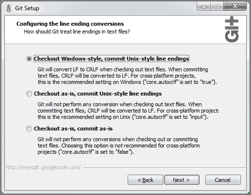

# 第四章：使用 Vagrant 和 Docker 设置开发环境

开发环境往往是项目中新手们首先需要面对的事情。虽然每个项目都不同，但他们花上一整天来设置环境，以及花更多的天数去理解应用程序是如何运作的，已经不是什么罕见的事情了。

比如，安装 JDK、设置本地的 JBoss 服务器实例、进行所有配置以及其他许多往往复杂的后端应用程序所需的事情需要多长时间？再加上如果前端与后端分离，做同样的事情需要多少时间。比如，理解一个单体应用程序的内部工作原理需要多长时间？这个应用程序可能有成千上万甚至百万行代码，分成了一层又一层，最初看似是一个好主意，但随着时间的推移却变得比带来的好处更多的是复杂性？

开发环境的设置和简化是**容器**和**微服务**可以大有帮助的领域之一。微服务本身很小，理解一千行（或者更少）代码需要多少时间？即便你从未使用过微服务所用的语言，也不应该花费太多时间去理解它的功能。另一方面，容器，特别是与 Vagrant 结合使用时，可以让开发环境的设置变得轻松自如。不仅设置过程可以快速且无痛，结果甚至可以和生产环境几乎一样。实际上，除了硬件外，它可以完全一样。

在开始搭建这样一个环境之前，让我们先来讨论一下我们正在构建的服务背后的技术。

### 注意

请注意，本书中将使用的代码可能会发生变化，因此可能无法完全反映本书中的代码片段。虽然这可能会偶尔引起困惑，但我认为您可能会从错误修复（每段代码都有错误）以及更新中受益。我们将使用的技术栈如此新颖，以至于每天都有变化和改进，我会尽量在代码中包含这些变化，即使本书已经发布。

# 结合微服务架构与容器技术

本书中我们将使用的微服务（`books-ms`）是以一种与大多数微服务支持者推荐的方式略有不同的方式创建的。

除了我们已经讨论过的服务需要小型化、限制在一个明确定义的边界上下文等内容外，还需要注意的是，大多数微服务只用于系统的后端部分。微服务的倡导者通常会将单体后端拆分为许多小的微服务，但往往会让前端保持不变。结果就是，整体架构中，前端依然是单体的，而后端被拆分成了微服务。为什么会这样？我认为答案在于我们使用的技术。我们开发前端的方式并不是为了将其拆分成更小的部分。

服务器端渲染正在成为历史。虽然企业可能不同意这个说法，并继续推动那些能够“神奇”地将 Java 对象转化为 HTML 和 JavaScript 的服务器端框架，但客户端框架将会继续增加流行度，逐渐将服务器端页面渲染送入遗忘的深渊。这就留下了我们客户端框架的使用空间。单页应用程序（SPA）是我们今天普遍使用的形式。AngularJS、React、ExtJS、ember.js 等框架证明了它们是前端开发演进的下一步。然而，无论是否是单页应用，大多数框架都在推广前端架构的单体化方法。

由于后端被拆分成微服务而前端仍然是单体的，我们所构建的服务并没有真正遵循每个服务应提供完整功能的理念。我们本应应用垂直拆分，创建小型的松耦合应用。然而，在大多数情况下，我们在这些服务中缺少了可视化的部分。

所有的前端功能（身份验证、库存、购物车等）都是单一应用的一部分，并与拆分成微服务的后端进行通信（大多数时候通过 HTTP）。与单体应用相比，这种方法是一个巨大的进步。通过保持后端服务的小巧、松耦合、单一目的且易于扩展，我们解决了许多单体架构带来的问题。尽管没有什么是完美的，微服务也有一系列问题，比如生产 bug 的排查、测试、理解代码、框架或语言的更替、隔离、责任分配等问题，但这些问题变得更易于处理。我们为此付出的代价是部署复杂性，但通过容器（如 Docker）和不可变服务器的概念，部署过程得到了显著改善。

如果我们看到微服务在后端带来的好处，难道如果我们也能将这些好处应用到前端，并设计使微服务不仅包含后端逻辑，还包括我们应用的可视部分，难道这不是一种进步吗？如果一个开发者或团队能够完全开发一个功能，并让其他人只需将其导入应用程序，这是不是有益的呢？如果我们能够以这种方式开展业务，那么前端（无论是 SPA 还是其他）将仅仅成为一个负责路由和决定导入哪些服务的框架。

我并不是说没有人以这样一种方式开发微服务，使得前端和后端都成为其中的一部分。我知道确实有一些项目是这样做的。然而，我并不认为将前端拆分成不同部分并将其与后端打包在一起的好处，能超过这种方法的缺点。直到 Web 组件出现，我才改变了看法。

我不会深入讲解 Web 组件是如何工作的，因为本书的目标之一是保持语言中立（尽可能做到这一点）。如果你有兴趣了解更多相关内容，请访问[`technologyconversations.com/2015/08/09/including-front-end-web-components-into-microservices/`](https://technologyconversations.com/2015/08/09/including-front-end-web-components-into-microservices/)文章。

目前需要注意的是，我们即将开始使用的`books-ms`包含了前端 Web 组件和后端 API，打包成一个单一的微服务。这使得我们能够将所有功能集中在一个地方，并根据需要使用它。有人可能会调用该服务的 API，而其他人可能决定将 Web 组件导入他们的网站。作为服务的作者，我们不应该过于关心谁在使用它，而应该关心的是它是否提供了潜在用户可能需要的所有功能。

该服务本身是使用 Scala 和 Spray 编写的，用于处理 API 请求和静态前端文件。Web 组件则使用 Polymer 完成。所有代码都采用测试驱动开发方法，产生了单元测试和功能/集成测试。源代码位于[`github.com/vfarcic/books-ms`](https://github.com/vfarcic/books-ms) GitHub 仓库中。

如果你从未使用过 Scala 或 Polymer，不用担心。我们不会深入讲解这些内容，也不会继续开发这个应用程序。我们将用它来演示概念和进行实践。目前，我们将使用该服务来设置开发环境。在此之前，让我们简要介绍一下我们将用于这个任务的工具。

## Vagrant 和 Docker

我们将使用**Vagrant**和**Docker**来设置我们的开发环境。

Vagrant 是一个通过像 VirtualBox 或 VMWare 这样的虚拟机监控程序来创建和管理虚拟机的命令行工具。Vagrant 本身不是虚拟机监控程序，它只是一个提供一致界面的驱动程序。通过一个 Vagrantfile，我们可以指定 Vagrant 所需的所有信息，利用 VirtualBox 或 VMWare 创建任意数量的虚拟机。由于它只需要一个配置文件，因此可以和应用程序代码一起保存在代码库中。它非常轻量且便携，可以让我们在任何底层操作系统上创建可重复的环境。虽然容器使得虚拟机的部分使用变得过时，但当我们需要开发环境时，Vagrant 依然大放异彩。它已经被使用并经过了多年的实战测试。

### 注意

请确保您的 Vagrant 版本至少是 1.8。部分读者在旧版本上遇到过问题。

请注意，容器并不总是能替代虚拟机。虚拟机提供了额外的隔离层（安全性）。它们还允许比容器更多的变体。使用虚拟机时，如果你愿意，甚至可以运行 Android。虚拟机与容器是互补的。正如 Kelsey Hightower（前 CoreOS，现在 Google）所说的 *“如果你用容器替代所有虚拟机，我期待看到你的站点如何在 HackerNews 的首页被黑客攻击”*。话虽如此，容器减少了虚拟机的使用。虽然我们是否应该在“裸金属”上运行容器还是在虚拟机内部运行容器仍然存在争议，但已经不再需要通过为每个应用程序或服务创建一个虚拟机来浪费资源。

Docker 容器允许我们将一些软件封装在一个完整的文件系统中。它们可以包含运行该软件所需的一切：代码、运行时库、数据库、应用服务器等。由于一切都被打包在一起，容器无论在哪个环境下运行都一样。容器共享宿主操作系统的内核，因此比虚拟机更轻量，因为虚拟机需要一个完整操作的操作系统。一个服务器可以托管比虚拟机更多的容器。另一个显著的特点是它们提供了进程隔离。虽然这种隔离性不如虚拟机提供的那么强大，但虚拟机比容器要重得多，把每个微服务打包成一个单独的虚拟机非常低效。而容器则非常适合这一任务。我们可以将每个服务打包成一个单独的容器，直接部署在操作系统上（不需要虚拟机中介），并且仍然保持它们之间的隔离。除了内核外，其他一切都不共享（除非我们选择共享），每个容器都是一个独立的世界。与此同时，与虚拟机不同，容器是不可变的。每个容器都是一组不可更改的镜像，部署新版本的唯一方法是构建一个新的容器，并替换掉运行中的旧版本实例。稍后，我们将讨论蓝绿部署策略，它将并行运行两个版本，但这将是下一章的内容。正如你很快会发现的，容器的使用范围远远超过了运行生产软件。

就像定义了创建虚拟机所需一切的 Vagrantfile，Docker 也有 *Dockerfile*，它包含了如何构建容器的指令。

这时，你可能会问，如果 Docker 做了相同的事且更多，为什么还需要 Vagrant？我们将用它来启动一个带有 Ubuntu 操作系统的虚拟机。我不能确定你使用的是哪种操作系统。你可能是 Windows 用户，也可能是 OS X 爱好者，或许你偏好某种 Linux 发行版。本书就是在 Ubuntu 上编写的，因为这是我选择的操作系统。决定使用虚拟机是为了确保本书中的所有命令和工具都能在你的计算机上正常运行，无论你使用的是哪种操作系统。现在，我们正准备启动一个虚拟机，作为设置开发环境的示例。以后，我们将创建更多的虚拟机，它们将模拟测试、预发布、生产等不同类型的环境。我们将使用 Ubuntu 及其他一些操作系统。这并不意味着你在应用所学知识时必须使用本书中介绍的 Vagrant 虚拟机。虽然它们对开发场景和尝试新事物很有用，但你应该重新考虑是否直接在“裸机”上安装的操作系统上部署容器，或部署到生产就绪的虚拟机中。

现在是时候停止讨论，转向更实际的部分了。在本书的其余部分，我将假设你的计算机上已经安装了 Git 和 Vagrant。不会有其他要求。你可能需要的其他内容将通过说明和脚本提供。

### 提示

如果你使用的是 Windows，请确保 Git 配置为使用`Checkout as-is`。可以在设置过程中通过选择图 4-1 中显示的第二个或第三个选项来实现。如果你没有安装 SSH，请确保`[PATH_TO_GIT]\bin`已添加到你的 PATH 中：



图 4-1 – 在 Windows 上，Git 设置过程中应该选择“Checkout as-is”选项

# 开发环境设置

让我们从克隆`books-ms` GitHub 仓库的代码开始：

```
git clone https://github.com/vfarcic/books-ms.git
cd books-ms

```

下载完代码后，我们可以继续创建开发环境。

## Vagrant

创建 Vagrant 虚拟机很简单：

```
vagrant plugin install vagrant-cachier
vagrant up dev

```

第一个命令不是强制性的，但它有助于加快新虚拟机（VM）的创建速度。它会缓存所有正在使用的包，这样下次我们需要它们时，可以直接从本地硬盘获取，而不是重新下载。第二个命令则执行“实际”工作。它会启动名为 dev 的虚拟机。第一次启动可能会需要一些时间，因为从基础镜像开始的所有内容都需要下载。之后每次启动这个虚拟机都会快得多。基于相同镜像（在此案例中是`ubuntu/trusty64`）启动的其他 Vagrant 虚拟机也会很快。

请注意，在本书中，我们执行的一些命令可能需要相当长的时间才能完成。一般而言，在命令运行时，您可以继续阅读（至少直到要求您运行新命令为止）。让我们利用启动虚拟机所需的时间，来浏览刚刚克隆的代码根目录下的 Vagrantfile。它包含了 Vagrant 创建开发环境虚拟机所需的所有信息，内容如下：

```
Vagrant.configure(VAGRANTFILE_API_VERSION) do |config|
  config.vm.box = "ubuntu/trusty64"
  config.vm.synced_folder ".", "/vagrant"
  config.vm.provider "virtualbox" do |v|
    v.memory = 2048
  end
  config.vm.define :dev do |dev|
    dev.vm.network "private_network", ip: "10.100.199.200"
    dev.vm.provision :shell, path: "bootstrap.sh"
    dev.vm.provision :shell,
      inline: 'PYTHONUNBUFFERED=1 ansible-playbook \/vagrant/ansible/dev.yml -c local'
  end
  if Vagrant.has_plugin?("vagrant-cachier")
    config.cache.scope = :box
  end
end
```

对于那些不熟悉 Ruby 的人来说，语法可能看起来有点神秘，但经过短暂的练习后，你会发现使用 Vagrant 定义一个或多个虚拟机是非常简单和直接的。在我们的案例中，我们首先指定了使用的镜像为`ubuntu/trusty64`。

Vagrant 镜像是 Vagrant 环境的包格式。任何人都可以在 Vagrant 支持的任何平台上使用镜像，来启动一个相同的工作环境。

换句话说，镜像就像是一个虚拟机，在其基础上我们可以添加我们需要的内容。你可以从`Atlas`浏览可用的镜像，或者`创建你自己的镜像`。

在镜像之后，接下来是指定本地目录应该与虚拟机同步的内容。在我们的例子中，我们设置了当前目录（`.`）应与虚拟机内的`/vagrant`目录同步。这样，当前目录中的所有文件将在虚拟机内自由使用。

接下来，我们指定了虚拟机应该配置 2 GB 的内存，并定义了一个名为 *dev* 的虚拟机。接下来，在本书的后续部分，我们将看到如何在同一个 *Vagrantfile* 中定义多个虚拟机。

在 dev 虚拟机的定义中，我们设置了 Vagrant 将暴露的 IP 地址，并指定它应该运行 Ansible playbook `dev.yml`。关于 Ansible 的细节我们不会深入探讨，因为这些内容将在后面的章节中讲解。只需知道，Ansible 会确保 **Docker** 和 **Docker Compose** 正常运行。

在本书中，我们将多次使用 Vagrant，所以你有很多机会进一步了解它。不过，本书没有提供详细的指南和文档。如果你需要更多信息和完整文档，请访问 [`www.vagrantup.com/`](https://www.vagrantup.com/)。

希望你有一个快速的互联网连接，并且此时执行 `vagrant up` 命令的过程可能已经完成。如果没有，去喝杯咖啡，休息一下吧。

让我们进入刚才创建的虚拟机，看看里面有什么：

```
vagrant ssh dev
ansible --version
docker --version
docker-compose --version
cd /vagrant
ll

```

第一个命令让我们进入 dev 虚拟机。你会看到 Ubuntu 的欢迎信息。接下来的三个命令仅仅是演示 Ansible、Docker 和 Docker Compose 是否已安装。最后，我们进入 /vagrant 目录并列出其内容。你会注意到，它与我们克隆 GitHub 仓库的宿主目录是一样的，这两个目录是同步的。

现在我们的虚拟机和所有软件都已经启动运行，让我们来看看本章的第二位明星。

## Docker

我们已经简要讨论了 Docker 和容器的一般概念。不过，我们可能还想深入探讨这个话题。很少有技术能够如此迅速地被广泛采用。是什么让 Docker 如此受欢迎？

虚拟机管理程序都基于虚拟硬件的仿真。虚拟机使用的大量资源都花费在这项仿真上。具体的资源占用比例取决于每个虚拟机的配置，但通常硬件虚拟化会占用 50% 或更多的硬件资源。换句话说，这意味着虚拟机对资源的需求非常高。

另一方面，Docker 使用的是共享操作系统。仅这一特性就使其效率大大提升。通过明确的容器定义，我们可以轻松地让 5 倍以上的应用程序同时运行，而无需部署到独立的虚拟机上。通过使用宿主机内核，容器能够在没有硬件虚拟化的情况下，保持进程之间几乎相同的隔离性。即使 Docker 没有带来其他任何好处，仅凭这一点，也足以让许多人开始使用它。

有趣的是，很多人认为容器是随着 Docker 而诞生的新事物。事实上，它们至少从 2000 年就开始被使用了。Oracle Solaris Zones、LXC 和 OpenVZ 就是其中的几个例子。Google 是最早在 Docker 出现之前就开始使用容器的公司之一。你可能会问，如果容器在其首次发布之前就存在，那么 Docker 有什么特别之处呢？Docker 使我们能够轻松使用容器，并建立在 LXC 之上。它使得有用的技术变得简单易用，并在其周围建立了一个非常强大的生态系统。

Docker 公司很快就与几乎所有软件行业领导者（Canonical、RedHat、Google、Microsoft 等）建立了伙伴关系，并设法标准化容器。这种合作关系也使容器几乎普及到所有操作系统。在撰写本文时，Windows Server 2016 技术预览版已发布，其中包含原生运行 Docker 引擎的功能。

开发人员和 DevOps 喜欢它，因为它为他们提供了一种非常简单可靠的方式来打包、运输和运行几乎可以在任何地方部署的自足应用程序。另一个重要的 Docker 工具是 Hub，其中包含官方、非官方和私有容器。无论您需要的是应用程序、服务器、数据库还是介于两者之间的任何东西，您都有可能在 Docker Hub 中找到并在几分钟内使用单个命令将其运行起来。

Docker（以及容器总体上）远比我们讨论的内容要多，您将在本书中看到许多不同的用途和测试案例。现在，让我们看看如何利用 Docker 来帮助我们处理开发环境。

## 开发环境的使用

目前，我们不会详细介绍如何编写 Dockerfile、构建容器并将其推送到公共或私有注册表。这些将是接下来章节的主题。目前，我们将专注于运行预制容器。特别是`vfarcic/books-ms-tests`容器。它包含了开发人员在使用我们克隆的 books-ms 服务时可能需要的一切。

该容器本身包含 MongoDB、NodeJS、NPM、Git、Java、Scala、SBT、FireFox、Chrome 和 Gulp。它包含了项目所需的所有 Java 和 JavaScript 库，配置也已正确设置，等等。如果你恰好使用所有这些语言和框架，你可能已经在电脑上安装了它们。然而，你很可能只使用其中的一部分，其他的可能缺失。即使你已经安装了所有东西，你还是需要下载 Scala 和 JavaScript 依赖项，调整一些配置，运行你的 MongoDB 实例，等等。对于这个单一的微服务，指令可能会显得有些复杂。现在，再考虑你们企业可能需要的成百上千个微服务。如果你只处理其中的一个或少数几个，可能还需要运行其他人写的服务。例如，你的服务可能需要与其他团队开发的服务进行通信。虽然我坚信这些情况应该通过定义良好的模拟来解决，但迟早你会遇到模拟不够好的情况。

我们可能需要在`books-ms`服务中执行不同类型的开发任务。记住，它同时包含后端（Scala 与 Spray）和前端（JavaScript/HTML/CSS 与 PolymerJS）。

例如，我们可以执行**Gulp**监视器，每次客户的源代码发生变化时，它都会运行所有前端测试。获取关于代码正确性的持续反馈，特别是在你实践测试驱动开发时，非常有用。有关前端开发方式的更多信息，请参考[`technologyconversations.com/2015/08/09/developing-front-end-microservices-with-polymer-web-components-and-test-driven-development-part-15-the-first-component/`](https://technologyconversations.com/2015/08/09/developing-front-end-microservices-with-polymer-web-components-and-test-driven-development-part-15-the-first-component/)一系列文章。

以下命令用于运行监视器：

```
sudo docker run -it --rm \
 -v $PWD/client/components:/source/client/components \
 -v $PWD/client/test:/source/client/test \
 -v $PWD/src:/source/src \
 -v $PWD/target:/source/target \
 -p 8080:8080 \
 --env TEST_TYPE=watch-front \
 vfarcic/books-ms-tests

```

有读者评论说，在少数情况下，测试可能会失败（可能是由于并发问题）。如果这种情况发生在你身上，请重新运行测试。

在运行此容器之前，需要下载多个层。容器大约占用 2.5GB 的虚拟空间（实际的物理大小要小得多）。与生产容器尽量小巧不同，开发用容器通常要大得多。例如，仅 NodeJS 模块就占用了将近 500MB，而这些仅是前端开发的依赖项。再加上 Scala 库、运行时可执行文件、浏览器等，东西加起来很快就多了。希望你有一个快速的互联网连接，这样拉取所有层的过程就不会太长。可以继续阅读直到下载完成，或者直到你看到运行另一个命令的指示。

输出的部分内容应如下所示（为了简洁，时间戳已删除）：

```
...
MongoDB starting : pid=6 port=27017 dbpath=/data/db/ 64-bit host=072ec2400bf0
...
allocating new datafile /data/db/local.ns, filling with zeroes...
creating directory /data/db/_tmp
done allocating datafile /data/db/local.ns, size: 16MB,  took 0 secs
allocating new datafile /data/db/local.0, filling with zeroes...
done allocating datafile /data/db/local.0, size: 64MB,  took 0 secs
waiting for connections on port 27017
...
firefox 43                Tests passed
Test run ended with great success
firefox 43 (93/0/0)
...
connection accepted from 127.0.0.1:46599 #1 (1 connection now open)
[akka://routingSystem/user/IO-HTTP/listener-0] Bound to /0.0.0.0:8080
...

```

我们刚刚使用 Firefox 运行了`93 tests`，同时运行了 MongoDB，并启动了带有 Scala 和 Spray 的 Web 服务器。所有的 Java 和 JavaScript 依赖项、运行时可执行文件、浏览器、MongoDB、JDK、Scala、sbt、npm、bower、gulp 以及我们可能需要的其他所有工具，都包含在这个容器内。所有这一切都是通过一个命令完成的。现在，随便更改位于 `client/components` 目录下的客户端源代码或 `client/test` 中的测试代码。你会看到，一旦保存更改，测试就会再次运行。就个人而言，我通常会将屏幕分成两半。一半显示代码，另一半显示运行测试的终端。在运行测试时，我们通过一个命令获得了持续反馈，无需任何安装或设置。

如上所述，我们通过此命令运行的不仅仅是前端测试，还有 Web 服务器和 MongoDB。通过这两者，我们可以在你喜欢的浏览器中打开[`10.100.199.200:8080/components/tc-books/demo/index.html`](http://10.100.199.200:8080/components/tc-books/demo/index.html)来查看我们的工作成果。你看到的是我们稍后将要使用的 Web 组件的演示。

我们不会详细解释刚才运行的命令中每个参数的含义。这部分内容会留到后续章节中，当我们深入探讨 Docker CLI 时再讲解。需要注意的重要一点是，我们运行的是从 Docker Hub 下载的容器。稍后，我们将安装自己的注册表，用于存储我们的容器。另一个重要的点是，几个本地目录被挂载为容器卷，这样我们就可以在本地修改源代码文件，并在容器内使用它们。

上述命令的主要问题在于它的长度。我个人是记不住这么长的命令的，而且我们也不能指望所有开发人员都能记住它。虽然到目前为止我们所做的比起其他搭建开发环境的方法要简单得多，但这个命令本身却与我们追求的简单性相冲突。运行 Docker 命令的更好方式是通过**Docker Compose**。再次声明，我们将在下一章节中深入讲解。现在，让我们先尝试一下。请通过按 *Ctrl* + *C* 停止当前正在运行的容器，并运行以下命令：

```
sudo docker-compose -f docker-compose-dev.yml run feTestsLocal

```

如你所见，结果是相同的，但这次命令要短得多。运行此容器所需的所有参数都存储在 `docker-compose-dev.yml` 文件中的目标 `feTestsLocal` 下。配置文件采用的是**另一种标记语言**（**YAML**）格式，对于熟悉 Docker 的人来说，这种格式既易于编写又易于阅读。

这只是容器众多用法中的一个。另一个用法（还有很多其他用法）是一次性运行所有测试（包括后端和前端），编译 Scala 代码，压缩并准备 JavaScript 和 HTML 文件以供发布。

在继续之前，请按*Ctrl* + *C*停止当前正在运行的容器，然后运行以下命令。

```
sudo docker-compose -f docker-compose-dev.yml run testsLocal

```

这一次，我们做了更多的事情。我们启动了 MongoDB，运行了后端的功能性和单元测试，停止了数据库，运行了所有前端测试，最后，创建了 JAR 文件，稍后将用于创建最终部署到生产环境（或者在我们案例中的生产环境仿真节点）上的分发包。稍后，当我们开始工作于持续部署管道时，我们将使用相同的容器。

我们不再需要开发环境了，所以让我们停止虚拟机：

```
exit
vagrant halt dev

```

这就是 Vagrant 的另一个优势。虚拟机可以通过一个命令启动、停止或销毁。然而，即使选择了后者，也可以像从头开始一样轻松地重新创建一个新的虚拟机。现在，虚拟机已经停止。我们可能稍后需要它，下次启动时也不会花那么长时间。使用`vagrant up dev`，它将在几秒钟内启动并运行。

本章有两个目的。第一个是向你展示，使用 Vagrant 和 Docker，我们可以比传统方法更简单、更快速地设置开发环境。第二个目的是让你提前了解接下来的内容。很快我们将更深入地探索 Docker 和 Docker Compose，开始构建、测试和运行容器。我们的目标是开始着手部署管道的工作。我们将首先手动运行命令。下一章将处理基础知识，之后我们将逐步过渡到更高级的技术。
