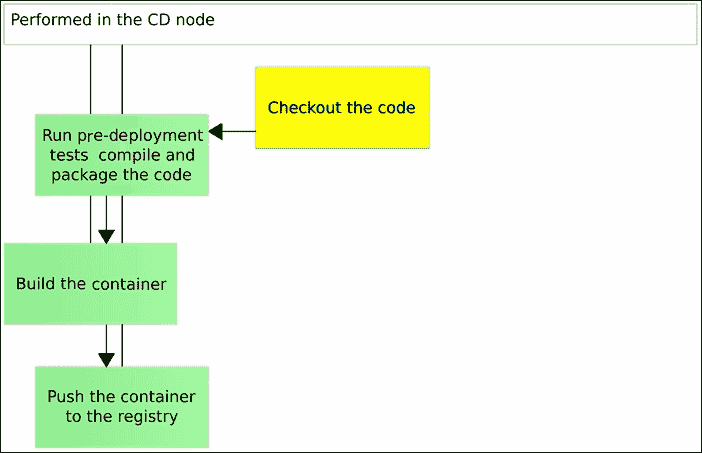

# 第五章：部署管道的实现 - 初始阶段

让我们从持续部署管道的一些基本（和最小）步骤开始。我们将查看代码，运行部署前的测试，如果测试成功，将构建一个容器并将其推送到 Docker 注册表。容器安全地保存在注册表中后，我们将切换到另一台虚拟机，作为生产服务器的模拟，运行容器并进行部署后的测试，以确保一切按预期工作。

这些步骤将涵盖被认为是持续部署流程中最基本的流程。在接下来的章节中，当我们对迄今为止所做的过程感到熟悉时，我们将进一步深入探讨。我们将探索所有必要的步骤，以确保我们的微服务能够安全可靠地无停机时间地到达生产服务器，并且可以轻松扩展，具备回滚能力，等等。

# 启动持续部署虚拟机

我们将从创建持续交付服务器开始。我们将通过使用 Vagrant 创建一个虚拟机来实现这一点。虽然使用虚拟机作为一种执行易于跟随的练习的手段很有用，但在实际场景中，你应该完全跳过虚拟机，直接在服务器上安装一切。请记住，在许多情况下，容器是我们习惯用虚拟机做的一些事情的更好替代品，而我们在本书中将同时使用虚拟机和容器，但通常来说，这样做只是浪费资源。话虽如此，让我们创建 `cd` 和 `prod` 虚拟机。我们将使用第一个作为持续部署服务器，第二个作为生产环境的模拟。

```
cd ..
git clone https://github.com/vfarcic/ms-lifecycle.git
cd ms-lifecycle
vagrant up cd
vagrant ssh cd

```

我们克隆了 GitHub 仓库，启动了 `cd` 虚拟机并进入了其中。

有一些基本的 Vagrant 操作你可能需要了解，以便跟上本书的内容。具体来说，如何停止虚拟机并再次启动它。你永远不知道什么时候你的笔记本电脑可能没电，或者你需要腾出资源处理其他任务。我不希望你在关闭笔记本电脑后无法重新进入到之前的状态，导致无法继续阅读本书。因此，让我们来了解两项基本操作：停止虚拟机和带有配置程序重新启动虚拟机。

如果你想停止这台虚拟机，只需运行 `vagrant halt` 命令：

```
exit
vagrant halt

```

完成后，虚拟机将停止，并且你的资源将释放出来，供其他任务使用。稍后，你可以使用 `vagrant up` 命令再次启动虚拟机：

```
vagrant up cd --provision
vagrant ssh cd

```

`--provision` 标志将确保我们需要的所有容器都已经启动并运行。与 `cd` 虚拟机不同，`prod` 虚拟机没有使用任何配置程序，因此不需要 `--provision` 参数。

# 部署管道步骤

虚拟机已经启动并运行（或者即将启动），让我们快速浏览一下这个过程。我们应该执行以下步骤：

1.  查看代码

1.  运行部署前的测试

1.  编译和/或打包代码

1.  构建容器

1.  将容器推送到注册中心

1.  将容器部署到生产服务器

1.  集成容器

1.  运行集成后测试

1.  将测试容器推送到注册中心！部署管道步骤

    图 5-1 – Docker 部署管道流程

目前我们将局限于手动执行，一旦我们对操作方式感到舒适，就会将这些知识迁移到其中一个 CI/CD 工具中。

### 检出代码

检出代码很简单，我们已经做了几次：

```
git clone https://github.com/vfarcic/books-ms.git
cd books
-ms

```

## 运行预部署测试、编译和打包代码

在检出代码后，我们应运行所有不需要服务已部署的测试。我们在尝试不同的开发环境操作时已经执行过这个过程。

```
docker build \
    -f Dockerfile.test \
    -t 10.100.198.200:5000/books-ms-tests \
    .
docker-compose \
    -f docker-compose-dev.yml \
    run --rm tests
ll target/scala-2.10/
```

首先，我们构建了在 Dockerfile.test 文件中定义的测试容器，并使用`-t`参数为它打了标签。容器的名称（或标签）是`10.100.198.200:5000/books-ms-tests`。这是一个特殊语法，第一部分是本地注册中心的地址，第二部分是容器的实际名称。稍后我们将讨论并使用注册中心。目前，重要的是要知道我们用它来存储和检索我们构建的容器。

第二个命令运行所有的预部署测试，并将 Scala 代码编译成一个准备分发的 JAR 文件。第三个命令仅用于演示，目的是让你确认 JAR 文件确实已创建，并且位于`scala-2.10`目录中。

请记住，构建容器所需的时间较长是因为许多东西需要第一次下载。每次之后的构建都会快得多。

到目前为止，我们所做的只是运行不同的命令，而没有尝试理解它们背后的原理。请注意，构建 Docker 容器的命令在失败时可以重复执行。例如，你可能会失去互联网连接，在这种情况下，构建容器会失败。如果你重复构建命令，Docker 会从上次失败的镜像继续。

我希望你能从那些仅使用预制容器或其他人创建的 Dockerfile 定义的角度，了解 Docker 是如何工作的。让我们改变节奏，深入研究用于定义容器的 Dockerfile。

## 构建 Docker 容器

所有测试通过并且 JAR 文件已创建后，我们可以构建要部署到生产环境的容器。在此之前，让我们先检查包含所有 Docker 构建容器所需信息的 Dockerfile。Dockerfile 的内容如下：

```
FROM debian:jessie
MAINTAINER Viktor Farcic "viktor@farcic.com"
RUN apt-get update && \
    apt-get install -y --force-yes --no-install-recommends openjdk-7-jdk && \
    apt-get clean && \
    rm -rf /var/lib/apt/lists/*
ENV DB_DBNAME books
ENV DB_COLLECTION books
COPY run.sh /run.sh
RUN chmod +x /run.sh
COPY target/scala-2.10/books-ms-assembly-1.0.jar /bs.jar
COPY client/components /client/components
CMD ["/run.sh"]
EXPOSE 8080
```

你可以在[`github.com/vfarcic/books-ms`](https://github.com/vfarcic/books-ms) GitHub 库中找到*Dockerfile*文件以及其他`books-ms`代码。

让我们逐行解析：

```
FROM debian:jessie

```

第一行指定了我们正在构建的容器应使用的基础镜像。在我们的案例中，我们使用的是*Debian*（版本*Jessie*）。这意味着我们应该拥有与 Debian 操作系统相同的大部分功能。然而，这并不意味着当我们拉取这个容器时会下载整个操作系统。请记住，Docker 使用的是主机内核，所以当我们指定容器应使用，例如 Debian 作为其基础时，我们仅下载包含我们指定操作系统特定内容的镜像，比如 Debian 的打包机制（在 Debian 中是*apt*）。不同的基础镜像之间有什么区别？为什么我们选择了*debian*镜像作为起点？

在大多数情况下，基础镜像的最佳选择是官方 Docker 镜像之一。由于 Docker 本身维护这些镜像，它们通常比社区创建的镜像更受控制。选择使用哪种镜像取决于需求。Debian 是我在许多情况下的首选。除了我喜欢基于 Debian 的 Linux 发行版外，它相对较小（大约 125MB），并且仍然是一个完整的发行版，包含你从 Debian 操作系统中可能需要的一切。另一方面，你可能熟悉 RPM 打包，偏好使用例如 CentOS。它的大小大约是 175MB（大约比 Debian 大 50%）。然而，也有一些情况，大小是最重要的，尤其是对于那些偶尔运行以执行特定操作的工具镜像。在这种情况下，Alpine 可能是一个不错的选择。它的大小为 5MB，非常小。然而，要注意，由于它的极简主义方式，当在其上执行更复杂的命令时，可能会比较难以理解。最后，在许多情况下，你可能希望使用更具体的镜像作为容器的基础。例如，如果你需要一个包含 MongoDB 的容器，并且需要在初始化时执行一些特定操作，那么你应该使用 mongo 镜像。

在托管多个容器的系统中，基础镜像的大小比使用多少种不同的基础镜像更不重要。记住，每个镜像都会被缓存到服务器上，并且在所有使用它的容器中重复使用。如果你的所有容器都，例如，继承自**debian**镜像，那么相同的缓存副本将在所有容器中被重用，这意味着它只会被下载一次。

我们作为基础镜像使用的也是一个容器，和其他容器没有区别。这意味着你可以使用你的容器作为其他容器的基础。例如，你可能有许多应用程序需要将 NodeJS 与 Gulp 结合使用，并且有一些特定于你组织的脚本。这种情况是一个很好的候选场景，适合使用容器并通过`FROM`指令被其他容器扩展。

让我们继续下一个指令：

```
MAINTAINER Viktor Farcic "viktor@farcic.com"

```

维护者字段纯粹是提供关于作者的信息；即维护该容器的人员。这里没什么可做的。继续：

```
RUN apt-get update && \
    apt-get install -y --force-yes --no-install-recommends openjdk-7-jdk && \
    apt-get clean && \
    rm -rf /var/lib/apt/lists/*
```

`RUN`指令执行的一组命令，就像这些命令在命令提示符下运行一样。你可能注意到，除了最后一行外，我们示例中的每一行都以`&& \`结尾。我们将多个独立的命令连接在一起，而不是将它们每个作为独立的`RUN`指令执行。从操作的角度来看，以下方式也能实现相同的结果：

```
RUN apt-get update
RUN apt-get install -y --force-yes --no-install-recommends openjdk-7-jdk
RUN apt-get clean
RUN rm -rf /var/lib/apt/lists/*
```

这确实看起来更干净且更易于维护。然而，它也有一系列问题。其中之一是，Dockerfile 中的每个指令都会生成一个单独的镜像。容器是由一层层叠加的镜像组成的。知道这一点后，最后两个`RUN`指令（`clean`和`rm`）并没有带来任何价值。我们可以通过假设每个镜像的大小来说明这一点（假设的数字）。前两个指令（`apt-get update`和`apt-get install`）是添加软件包（假设为 100 MB）。后两个指令（`apt-get clean`和`rm`）是删除文件（假设为 10 MB）。虽然在普通系统中删除文件确实会减少硬盘上存储的大小，但在 Docker 容器中，它仅仅是从当前镜像中删除了东西。由于每个镜像是*不可变的*，之前的两个镜像仍然保持 100 MB 的大小，因此即使删除的文件在容器内不可访问，整体容器的大小也没有减少。这四个镜像的大小依然是 100 MB。如果我们回到第一个示例，其中所有命令都在同一个`RUN`指令内执行，从而创建了一个单一的镜像，那么大小会更小（100 MB - 10 MB = 90 MB）。

需要注意的重要一点是，大小并不是唯一需要考虑的因素，我们应该尝试将其与可维护性进行平衡。*Dockerfile*需要具有可读性、易于维护，并且要有明确的意图。这意味着在某些情况下，如果一个巨大的`RUN`指令让后期维护变得困难，那么这种方式可能并不是最佳选择。

总的来说，我们示例中`RUN`命令的目的是更新系统中的最新软件包（`apt-get update`）、安装 JDK 7（`apt-get install`）以及删除在此过程中创建的不必要的文件（`apt-get clean`和`rm`）。

下一组指令为容器提供了可在运行时更改的环境变量：

```
ENV DB_DBNAME books
ENV DB_COLLECTION books
```

在这个特定的情况下，我们声明了`DB_DBNAME`和`DB_COLLECTION`变量并为其赋予了默认值。服务的代码使用这些变量来连接*Mongo DB*。如果出于某种原因，我们想要更改这些值，我们可以在执行`docker run`命令时进行设置（正如我们将在本书后续章节中看到的那样）。

在容器世界中，我们不鼓励将特定于环境的文件传递给在不同服务器上运行的容器。理想情况下，我们应该在没有任何外部文件的情况下运行容器。虽然在某些情况下这不太实际（例如，稍后我们将使用的*nginx*进行反向代理），但环境变量是传递特定于环境的信息到容器的首选方式。

接下来，在我们的示例中，有几个`COPY`指令：

```
COPY run.sh /run.sh
RUN chmod +x /run.sh
COPY target/scala-2.10/books-ms-assembly-1.0.jar /bs.jar
COPY client/components /client/components
```

`COPY`指令顾名思义，它会将文件从主机文件系统复制到我们正在构建的容器中。它的写法应该是`COPY <source>... <destination>`格式。`source`相对于*Dockerfile*的位置，并且必须在构建的上下文内。后者的意思是，你不能复制不在*Dockerfile*所在目录或其子目录中的文件。例如，`COPY ../something /something`是不允许的。源文件可以是单个文件或整个目录，并且可以使用符合 Go 的`filepath.Match`规则的通配符。目标可以是文件或目录。目标与源类型匹配。如果源是文件，目标也会是文件；如果源是目录，目标也会是目录。为了强制目标为目录，可以在目标路径末尾加上斜杠（`/`）。

虽然我们在示例中没有使用`ADD`指令，但值得注意的是，它与`COPY`非常相似。在大多数情况下，我鼓励你使用`COPY`，除非你需要`ADD`提供的额外功能（最明显的是`TAR`解压和 URL 支持）。

在我们的示例中，我们正在复制`run.sh`并通过`chmod RUN`指令使其可执行。接着，我们将复制其余的文件（后端的`JAR`文件和前端的*组件*）。

让我们一起了解一下我们 Dockerfile 中的最后两个指令。

```
CMD ["/run.sh"]
EXPOSE 8080

```

`CMD`指定容器启动时将执行的命令。格式为[`executable`, `parameter1`, `parameter2`，以此类推]。在我们的示例中，`/run.sh`将无参数运行。目前，脚本包含一个命令`java -jar bs.jar`，它将启动 Scala/Spray 服务器。请记住，`CMD`只提供默认的执行命令，在容器运行时可以轻松地被覆盖。

`EXPOSE`指令指定容器内哪个端口将在运行时可用。

我们解释的这个示例*Dockerfile*并不包含我们可以使用的所有指令。在本书中，我们将与其他一些指令一起工作，并更熟悉它们的格式。在此期间，请访问 Dockerfile 参考文档了解更多信息。

有了这些知识，让我们来构建容器。命令如下：

```
docker build -t 10.100.198.200:5000/books-ms .

```

让我们利用此命令的运行时间（第一次构建通常比其他构建花费更长时间），并回顾我们使用的参数。第一个参数是`build`，用于构建容器。参数`-t`允许我们为容器打上特定的标签。如果你想将容器推送到公共 Hub，标签应该使用`/`格式。如果你在 Docker Hub 上有账号，用户名用于标识你，并且可以在后续推送容器时使用，从而使容器在任何连接到互联网的服务器上都可以拉取。由于我不愿意分享我的密码，我们采取了不同的方法，使用*注册表*的 IP 和端口，而不是 Docker Hub 的用户名。这样我们就能将容器推送到私有注册表。这种方法通常更好，因为它能提供我们对容器的完全控制，通常在本地网络上速度更快，并且不会让你公司的 CEO 因将应用推送到云端而心脏病发作。最后，最后一个参数是一个点（`.`），表示 Dockerfile 位于当前目录。

还有一件重要的事情需要讨论，那就是*Dockerfile*中指令的顺序。一方面，它需要有逻辑性。例如，我们不能在安装可执行文件之前运行它，或者像我们例子中那样，在复制`run.sh`文件之前就改变它的权限。另一方面，我们需要考虑到 Docker 的缓存。当运行`docker build`命令时，Docker 会逐条检查指令，看看是否已有其他构建过程创建了镜像。一旦找到一个会创建新镜像的指令，Docker 不仅会执行该指令，还会执行所有后续的指令。这意味着，在大多数情况下，`COPY`和`ADD`指令应该放在*Dockerfile*的底部。即使在`COPY`和`ADD`指令的分组中，我们也应该确保把不太可能更改的文件放在上面。在我们的例子中，我们先添加`run.sh`，再添加`JAR`文件和前端组件，因为后者在每次构建时更可能发生变化。如果你第二次执行`docker build`命令，你会注意到 Docker 在所有步骤中输出`---> 使用缓存`。稍后，当我们更改源代码时，Docker 将继续输出`---> 使用缓存`，直到遇到最后两个`COPY`指令中的一个（具体是哪个，取决于我们是更改了`JAR`文件还是前端组件）。

我们将经常使用 Docker 命令，你将有很多机会更加熟悉它们。与此同时，请访问[使用命令行页面](https://example.org)获取更多信息。

希望到此时，容器已经构建完成。如果没有，请休息一下。我们即将运行我们新构建的容器。

### 运行容器

只要你知道使用哪些参数，运行容器就非常简单。我们刚刚构建的容器可以使用以下命令来运行：

```
docker run -d --name books-db mongo
docker run -d --name books-ms \
    -p 8080:8080 \
    --link books-db:db \
    10.100.198.200:5000/books-ms
```

第一个命令启动了我们的服务所需的数据库容器。参数`-d`让我们可以在分离模式下运行容器，意味着它将运行在后台。第二个命令`--name books-db`为容器指定了一个名称。如果不指定，Docker 会分配一个随机名称。最后，最后一个参数是我们想要使用的镜像名称。在我们的例子中，我们使用的是官方的 Docker MongoDB 镜像*mongo*。

这个命令展示了 Docker 的一个非常有用的功能。就像 GitHub 彻底改变了我们在不同开发者和项目之间共享代码的方式一样，Docker Hub 也改变了我们部署应用程序的方式，不仅是我们自己构建的应用程序，也包括其他人构建的应用程序。欢迎访问[`hub.docker.com/`](https://hub.docker.com/)并搜索你喜欢的应用、服务或数据库。你很可能会找到不仅是一个（通常是官方的 docker 容器），而且还有很多社区创建的其他容器。高效使用 Docker 通常是自己构建的镜像和其他人构建的镜像相结合的结果。即使没有一个镜像完全符合你的需求，通常也可以使用现有的镜像作为基础镜像。例如，如果你想要启用*复制集*的 MongoDB，最好的方法是将*mongo*作为`FROM`指令在你的*Dockerfile*中，并在其下方添加复制集命令。

第二个`docker run`命令稍微复杂一些。除了在分离模式下运行并指定名称外，它还暴露了 8080 端口并与`books-ms-db`容器进行连接。暴露端口非常简单。我们可以提供一个端口，例如`-p 8080`。在这种情况下，Docker 会将其内部端口`8080`暴露为一个随机端口。稍后我们在使用*服务发现工具*时会采用这种方法。在这个例子中，我们使用了两个端口，由冒号分隔（`-p 8080:8080`）。使用此参数时，Docker 会将其内部端口 8080 暴露为外部端口 8080。接下来的参数是`--link books-db:db`，它允许我们将两个容器连接起来。在这个例子中，我们要连接的容器名称是*books-ms-db*。在容器内部，这个链接将转换为环境变量。让我们看看这些变量是什么样的。

我们可以使用`exec`命令进入正在运行的容器：

```
docker exec -it books-ms bash
env | grep DB
exit

```

参数`-it`告诉 Docker 我们希望此执行为交互式并且带有终端。接着是运行中的容器名称。最后，我们通过`bash`覆盖了在*Dockerfile*中指定的默认命令`CMD`。换句话说，我们通过运行*bash*进入了正在运行的容器。进入容器后，我们列出了所有的环境变量并进行了筛选，仅输出包含`DB`的环境变量。运行容器时，我们指定它应当与`books-ms-db`连接，命名为`db`。由于所有环境变量通常都是大写的，Docker 创建了许多以`DB`开头的环境变量。`env`命令的输出如下：

```
DB_NAME=/books-ms/db
DB_PORT_27017_TCP=tcp://172.17.0.5:27017
DB_PORT=tcp://172.17.0.5:27017
DB_ENV_MONGO_VERSION=3.0.5
DB_PORT_27017_TCP_PORT=27017
DB_ENV_MONGO_MAJOR=3.0
DB_PORT_27017_TCP_PROTO=tcp
DB_PORT_27017_TCP_ADDR=172.17.0.5
DB_COLLECTION=books
DB_DBNAME=books

```

除最后两个外，其他都是通过与另一个容器的链接而得到的。我们获取了链接的名称、TCP、端口等信息。最后两个（`DB_COLLECTION` 和 `DB_DBNAME`）不是通过链接得到的，而是我们在 *Dockerfile* 中定义的变量。

最后，我们退出了容器。

还有一些其他操作可以确保一切正常运行：

```
docker ps -a
docker logs books-ms

```

`ps -a` 命令列出了所有 (`-a`) 容器。该命令应该输出 `books-ms` 和 `books-ms-db`。`logs` 命令顾名思义，输出容器 `books-ms` 的日志。

尽管运行 Mongo DB 和我们的容器 `books-ms` 非常简单，但我们仍然需要记住所有参数。实现相同结果的更简单方法是使用 **Docker Compose**。在看到它如何工作的之前，让我们先删除我们正在运行的容器：

```
docker rm -f books-ms books-db
docker ps -a

```

第一个命令（`rm`）删除所有列出的容器。`-f` 参数强制删除。如果没有它，只有停止的容器可以被删除。将 `rm` 命令与 `-f` 参数结合使用，相当于先通过 `stop` 命令停止容器，然后通过 `rm` 删除它们。

让我们通过 **Docker Compose** 运行相同的两个容器（`mongo` 和 `books-ms`）：

```
docker-compose -f docker-compose-dev.yml up -d app

```

命令的输出如下：

```
Creating booksms_db_1
Creating booksms_app_1

```

这次，我们通过一个 `docker-compose` 命令运行了两个容器。`-f` 参数指定了我们想要使用的配置文件。我倾向于在 `docker-compose-dev.yml` 中定义所有开发配置，在默认的 `docker-compose.yml` 中定义生产环境配置。使用默认文件名时，无需使用 `-f` 参数。接下来是 `up` 命令，它以分离模式 (`-d`) 启动了 `app` 容器。

让我们来看一下 `docker-compose-dev.yml` 文件的内容：

```
app:
  image: 10.100.198.200:5000/books-ms
  ports:- 8080:8080
  links:- db:db
db: image: mongo
...
```

上面的输出仅显示了我们现在关注的目标。还有其他主要用于测试和编译的目标。我们之前在设置开发环境时使用过它们，稍后我们还会使用它们。现在，让我们讨论一下 `app` 和 `db` 目标。它们的定义与我们已经使用过的 Docker 命令和参数非常相似，应该很容易理解。最有意思的是 `links`。与手动命令的链接不同，手动命令需要先启动源容器（在我们案例中是 `mongo`），然后再启动与之链接的容器（`books-ms`），而 `docker-compose` 会自动启动所有依赖的容器。我们运行 `app` 目标时，Docker Compose 发现它依赖于 `db` 目标，因此它首先启动了 `db`。

与之前一样，我们可以验证两个容器是否都已启动并运行。这次，我们将使用 Docker Compose 来验证：

```
docker-compose ps

```

输出应该类似于以下内容：

```
 Name               Command          State           Ports
----------------------------------------------------------------------
booksms_app_1   /run.sh                 Up      0.0.0.0:8080->8080/tcp
booksms_db_1    /entrypoint.sh mongod   Up      27017/tcp

```

Docker Compose 默认使用项目名称（默认为目录名称）、目标名称（`app`）和实例编号（`1`）来命名运行中的容器。稍后，我们将运行多个相同容器实例，分布在多个服务器上，你将有机会看到这个数字的增加。

两个容器都启动并运行后，我们可以检查 Docker Compose 运行的容器日志。

```
docker-compose logs

```

请注意，Docker Compose 的日志是以 `follow` 模式显示的，您需要按 *Ctrl* + *C* 来停止它。

我倾向于尽可能让测试自动化，但这个话题留到后续章节再讨论，所以目前只能进行简短的手动验证。

```
curl -H 'Content-Type: application/json' -X PUT -d \
  '{"_id": 1,"title": "My First Book","author": "John Doe","description": "Not a very good book"}' \
  http://localhost:8080/api/v1/books | jq '.'
curl -H 'Content-Type: application/json' -X PUT -d \
  '{"_id": 2,"title": "My Second Book","author": "John Doe","description": "Not a bad as the first book"}' \
  http://localhost:8080/api/v1/books | jq '.'
curl -H 'Content-Type: application/json' -X PUT -d \
  '{"_id": 3,"title": "My Third Book","author": "John Doe","description": "Failed writers club"}' \
  http://localhost:8080/api/v1/books | jq '.'
curl http://localhost:8080/api/v1/books | jq '.'
curl http://localhost:8080/api/v1/books/_id/1 | jq '.'
```

对于不熟悉 `curl` 的人来说，它是一个用于通过 URL 语法传输数据的命令行工具和库。在我们的案例中，我们用它向服务发送了三个 `PUT` 请求，服务随后将数据存储到 MongoDB 中。最后两个命令调用了服务的 API 来获取所有书籍的列表，以及与特定书籍（ID 为 1）相关的数据。通过这些手动验证，我们确认了该服务可以正常工作并与数据库进行通信。请注意，我们使用了 `jq` 来格式化 JSON 输出。

请记住，这个服务还包含前端 Web 组件，但我们暂时不会尝试它们。这些留待稍后，当我们将此服务与将导入它们的网站一起部署到生产环境时再进行。

我们运行的容器位置不对。我们使用的虚拟机本应专门用于持续部署，而我们构建的容器应该在一个独立的生产服务器上运行（或者在我们的案例中，一个独立的虚拟机模拟这样的服务器）。在开始部署到生产环境之前，我们应该进行 *配置管理*，以便不仅能简化部署，还能配置服务器。我们已经使用 `Ansible` 创建了 `cd` 虚拟机，但还没有时间解释它是如何工作的。更糟糕的是，我们还没有决定使用哪个工具。

现在，让我们停止并删除 `books-ms` 容器及其依赖项，从而释放 `cd` 服务器，让它能够执行最初的目的：启用持续部署管道。

```
docke
r-compose stop
docker-compose rm -f

```

### 推送容器到注册中心

Docker Registry 可用于存储和检索容器。我们已经在本章开始时创建的 `cd` 虚拟机上运行它。构建好 `books-ms` 后，我们可以将其推送到注册中心。这将使我们能够从任何可以访问 `cd` 服务器的地方拉取该容器。请运行以下命令：

```
docker push 10.100.198.200:5000/books-ms

```

在本章早些时候，我们使用 `10.100.198.200:5000/books-ms` 标签构建了容器。这是一个用于推送到私有注册中心的特殊格式；`:/`。在容器标记后，我们将其推送到运行在 IP `10.100.198.200` 和端口 `5000` 上的注册中心。`10.100.198.200` 是我们的 `cd` 虚拟机的 IP 地址。

容器安全地存储到注册表后，我们可以在任何服务器上运行它。不久之后，一旦我们通过配置管理，我们将拥有额外的服务器，在这些服务器上运行存储在此注册表中的容器。

让我们通过销毁所有虚拟机来结束本章。下一章将创建我们需要的虚拟机。这样，你可以在继续我们的冒险之前休息一下，或者跳到任何章节，不用担心之前做的任务会导致失败。每个章节都是完全独立的。虽然你会受益于之前章节获得的知识，但从技术上讲，每一章都是独立运作的。在我们销毁之前所做的一切之前，我们将推送测试容器，这样我们就不必从头开始重新构建它。注册表容器具有一个映射我们主机目录到内部路径的卷，该路径用于存储镜像。这样，所有推送的镜像都存储在主机（`registry`目录）上，并不依赖于运行它的虚拟机：

```
docker push 10.100.198.200:5000
/books-ms-tests
exit
vagrant destroy -f

```

### 清单

我们还差几个步骤就能完成部署流水线的基本实现。提醒一下，步骤如下：

1.  检出代码 - 完成

1.  运行预部署测试 - 完成

1.  编译和/或打包代码 - 完成

1.  构建容器 - 完成

1.  将容器推送到注册表 - 完成

1.  将容器部署到生产服务器 - 待处理

1.  集成容器 - 待处理

1.  运行后部署测试 - 待处理

1.  将测试容器推送到注册表 - 待处理

需要注意的是，迄今为止我们执行的所有步骤都是在`cd`虚拟机上完成的。为了尽量减少对生产环境的影响，我们将尽可能继续在目标服务器外运行步骤（或其一部分）。



图 5-2 – 使用 Docker 的部署流水线初始阶段

我们完成了前五个步骤，或者至少完成了它们的手动版本。其余的步骤将等到我们设置好生产服务器后再继续。在下一章中，我们将讨论完成此任务的可选方案。
