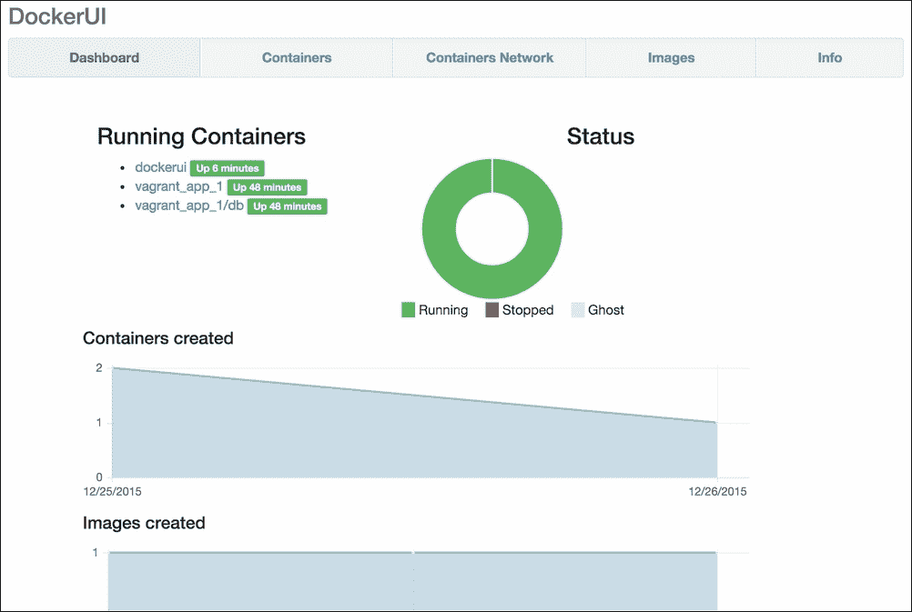
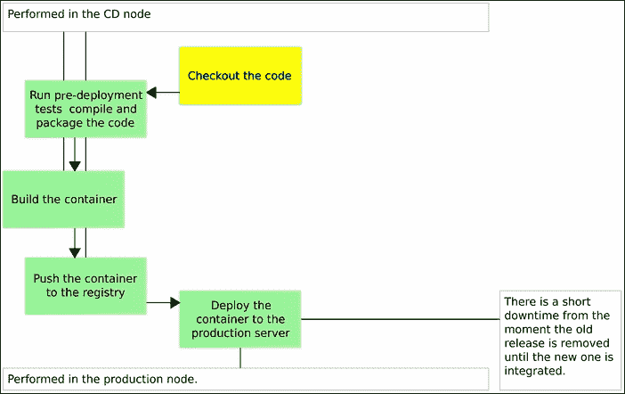

# 第七章 部署管道的实现 – 中间阶段

如果没有设置生产服务器，我们无法完成部署管道的基本实现。我们不需要太多。此时，Docker 是我们部署的唯一前提条件，这也为我们提供了一个很好的机会，深入了解配置管理的世界。现在，借助将设置我们的生产服务器的 Ansible playbook，我们可以继续之前的工作并将容器部署到生产服务器：

1.  检出代码 - 完成

1.  运行部署前测试 - 完成

1.  编译和/或打包代码 - 完成

1.  构建容器 - 完成

1.  将容器推送到注册表 - 完成

1.  将容器部署到生产服务器 - 待处理

1.  集成容器 - 待处理

1.  运行部署后测试 - 待处理

1.  将测试容器推送到注册表 - 待处理！部署管道的实现 – 中间阶段

    图 7-1 – 使用 Docker 部署管道的初始阶段

我们仅缺少手动部署管道中的四个步骤。

# 将容器部署到生产服务器

让我们创建并配置本章中将使用的虚拟机：

```
vagrant up cd prod
vagrant ssh cd
ansible-playbook /vagrant/ansible/prod.yml \
 -i /vagrant/ansible/hosts/prod

```

第一个命令启动了`cd`和`prod`虚拟机，第二个命令让我们进入`cd`虚拟机。最后，第三个命令配置了`prod`虚拟机。

现在生产服务器已正确配置，我们可以部署`books-ms`容器了。尽管我们还没有将其拉取到目标服务器，但我们已经将它推送到了`cd`节点的 Docker 注册表（该节点映射到主机目录）并可以从那里获取。然而，我们缺少的是 Docker Compose 配置文件，该文件指定了如何运行容器。我更倾向于将与服务相关的所有内容保存在同一个仓库中，`**docker-compose.yml**`也不例外。我们可以从 GitHub 获取它：

```
wget https://raw.githubusercontent.com/vfarcic\/books-ms/master/docker-compose.yml

```

下载了`docker-compo` `se.yml`后，我们来快速查看一下它（本章中不使用的目标已被排除）：

```
base:
  image: 10.100.198.200:5000/books-ms
  ports:- 8080environment: - SERVICE_NAME=books-ms
app:
  extends:
    service: base
  links: - db:db
db: image: mongo
```

`base` 目标包含我们容器的基础定义。下一个目标（`app`）是扩展了 `base` 服务，避免了定义的重复。通过扩展服务，我们可以覆盖参数或添加新参数。`app` 目标将运行我们存储在 `cd` 服务器上的注册表中的容器，并且与第三个目标相链接，该目标代表服务所需的数据库。你可能会注意到我们改变了端口的指定方式。在 `docker-compose-d` 的 `ev.yml` 文件中，我们有两个用冒号分隔的数字（`8080:8080`）。第一个是 Docker 会暴露给主机的端口，而第二个是容器内服务器使用的内部端口。`docker-compose.yml` 有点不同，只有内部端口被设置。这样做的原因是为了消除潜在的冲突。在开发环境中，我们倾向于只运行少量的服务（当前需要的那些），但在生产环境中，我们可能会同时运行数十、数百甚至数千个服务。预定义端口容易导致冲突。如果其中两个使用相同的端口，结果将是失败。因此，我们将让 Docker 为主机暴露一个随机端口。

让我们运行 Docker Compose 的 `app` 目标：

```
export DOCKER_HOST=tcp://prod:2375
docker-compose up -d app

```

我们导出了 `DOCKER_HOST` 变量，这告诉本地 Docker 客户端将命令发送到位于 `prod` 节点和端口 `2375` 上的远程 Docker。第二个命令运行了 Docker Compose 的 `app` 目标。由于 `DOCKER_HOST` 指向远程主机，`app` 目标和链接的容器 `db` 被部署到 `prod` 服务器。我们甚至不需要进入目标服务器，部署是远程完成的。

出于安全考虑，默认情况下禁用了调用远程 Docker API 的功能。不过，Ansible playbook 的一个任务是通过修改 `/etc/default/docker` 配置文件来改变这一行为。其内容如下：

```
DOCKER_OPTS="$DOCKER_OPTS --insecure-registry 10.100.198.200:5000 -H tcp://0.0.0.0:2375 -H unix:///var/run/docker.sock"

```

`--insecure-registry` 允许 Docker 从我们位于 `cd` 节点（`10.100.198.200`）的私有注册表中拉取镜像。`-H` 参数告诉 Docker 在端口 `2375` 上监听来自任何地址（`0.0.0.0`）的远程请求。请注意，在实际的生产环境中，我们需要更加严格，仅允许受信任的地址访问远程 Docker API。

我们可以通过执行另一个远程调用来确认这两个容器确实运行在 `prod` 虚拟机上：

```
docker-compose ps

```

输出如下：

```
 Name               Command          State            Ports
-----------------------------------------------------------------------
vagrant_app_1   /run.sh                 Up      0.0.0.0:32770->80
80/tcp
vagrant_db_1    /entrypoint.sh mongod   Up      27017/tcp

```

由于 Docker 为服务的内部端口 `8080` 分配了一个随机端口，我们需要找出它。可以通过 `inspect` 命令来完成这项工作。

```
docker inspect vagrant_app_1

```

我们感兴趣的输出部分应类似于以下内容：

```
...
"NetworkSettings": {
    "Bridge": "",
	"EndpointID": "45a8ea03cc2514b128448...",
	"Gateway": "172.17.42.1",
	"GlobalIPv6Address": "",
	"GlobalIPv6PrefixLen": 0,
	"HairpinMode": false,
	"IPAddress": "172.17.0.4",
	"IPPrefixLen": 16,
	"IPv6Gateway": "",
    "LinkLocalIPv6Address": "",
	"LinkLocalIPv6PrefixLen": 0,
	"MacAddress": "02:42:ac:11:00:04",
	"NetworkID": "dce90f852007b489f4a2fe...",
	"PortMapping": null,
	"Ports": {
		 "8080/tcp": [
			 {
                "HostIp": "0.0.0.0",
				"HostPort": "32770"
            }
        ]
    },
    "SandboxKey": "/var/run/docker/netns/f78bc787f617",
	"SecondaryIPAddresses": null,
	"SecondaryIPv6Addresses": null
}
...
```

原始输出比这大得多，包含了我们可能（或不可能）需要的所有信息。目前我们感兴趣的是`NetworkSettings.Ports`部分，在我的例子中，它给出了将`HostPort 32770`映射到内部端口`8080`的信息。我们可以做得更好，使用`--format`参数：

```
PORT=$(docker inspect \--format='{{(index (index .NetworkSettings.Ports "8080/tcp") 0).HostPort}}' \vagrant_app_1)
echo $PORT
```

不要被`--format`值的语法吓到。它使用了 Go 的`text/template`格式，确实可能让人有些畏惧。好消息是，一旦我们进入第八章，*服务发现 – 分布式服务的关键*章节时，我们将使用更好的方法。这个只是一个临时的变通方法。

我们已经得到了端口并将其存储到了`PORT`变量中。现在我们可以重复已经熟悉的`curl`命令，确认服务正在运行并且已连接到数据库：

```
curl -H 'Content-Type: application/json' -X PUT -d \
"{\"_id\": 1,
\"title\": \"My First Book\",
\"author\": \"John Doe\",
\"description\": \"Not a very good book\"}" \
http://prod:$PORT/api/v1/books \
| jq '.'
curl -H 'Content-Type: application/json' -X PUT -d \
"{\"_id\": 2,
\"title\": \"My Second Book\",
\"author\": \"John Doe\",
\"description\": \"Not a bad as the first book\"}" \
http://prod:$PORT/api/v1/books \
| jq '.'
curl -H 'Content-Type: application/json' -X PUT -d \
"{\"_id\": 3,
\"title\": \"My Third Book\",
\"author\": \"John Doe\",
\"description\": \"Failed writers club\"}" \
http://prod:$PORT/api/v1/books \
| jq '.'
curl http://prod:$PORT/api/v1/books \
| jq '.'
curl http://prod:$PORT/api/v1/books/_id/1 \
| jq '.'

```

上一条命令的输出如下：

```
{
    "_id": 1,
	"author": "John Doe",
	"description": "Not a very good book",
	"title": "My First Book"
}
```

和之前一样，当我们在开发环境中运行相同的命令时，我们将三本书插入数据库，并确认它们可以从数据库中检索出来。然而，这不是验证服务是否正确部署的高效方式。我们可以做得更好，运行集成测试。

需要注意的是，我们甚至没有进入`prod`节点。所有的部署命令都是通过远程 Docker API 完成的。

## Docker UI

这可能是一个很好的机会来介绍一个不错的开源项目 DockerUI。它是作为*docker* Ansible 角色的一部分定义的，因此它会在我们配置 Docker 的所有服务器上运行。我们可以，例如，通过在任何浏览器中打开`http://10.100.198.201:9000`来查看在`prod`节点上运行的实例。

请注意，通过 Vagrant 创建的所有 IP 都是私有的，意味着只能从主机机器访问。如果那恰好是你的笔记本电脑，你应该不会遇到问题，能够在浏览器中打开 DockerUI 地址。另一方面，如果你在公司服务器之一上运行示例，请确保你可以访问它的桌面，并且已安装浏览器。如果你需要远程访问该服务器，请尝试使用 VNC 等远程桌面解决方案：



图 7-2 – DockerUI 仪表盘屏幕

虽然通过 CLI 操作容器要高效得多，但 DockerUI 提供了一种非常有用的方式，可以获得系统的总体概览以及每个容器、网络和镜像的相关细节。当集群中运行大量容器时，它的真正用途会显现出来。它非常轻量，不会占用太多资源。

除非另有说明，否则你会发现它在我们设置的每个虚拟机上运行。

## 检查清单

在继续之前，让我们看看部署管道的基本实现进展如何：

1.  检出代码 - 完成

1.  运行部署前测试 - 完成

1.  编译和/或打包代码 - 完成

1.  构建容器 - 完成

1.  将容器推送到镜像仓库 - 完成

1.  将容器部署到生产服务器 - 完成

1.  集成容器 - 待完成

1.  运行部署后测试 - 待完成

1.  将测试容器推送到镜像仓库 - 待完成

    图 7-3 – 使用 Docker 部署管道的中间阶段

请注意，与我们在上一章所做的步骤不同，这次的部署是在生产环境中通过远程 Docker API 进行的。如果我们部署的是第二个版本，那么在一段时间内，旧版本和新版本都无法运行。一个需要停止，而另一个则需要一些时间才能启动。无论这段时间是否短暂，我们都会经历*停机时间*，这本身就会阻碍我们向*持续部署*的目标迈进。现在我们只需要记下这个问题，稍后我们将探索*蓝绿部署*流程，帮助我们克服这个问题，继续朝着零停机时间部署的目标前进。

我们正在取得进展，检查清单上只剩下三项任务。然而，应用程序尚未集成，因此我们无法运行集成测试。为了继续进行，我们需要探索两个概念：*服务发现*和*反向代理*。

我们将在实验服务发现工具时使用一组新的虚拟机，因此，让我们节省一些资源并销毁当前正在运行的虚拟机。我们将在下一章创建所需的虚拟机。

```
exit
vagrant destroy -f

```
