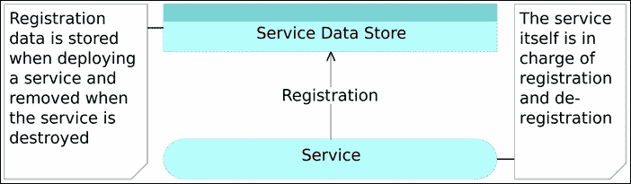

# 第八章：服务发现 – 分布式服务的关键

|   | *做事不需要太多力量，但决定做什么需要巨大的力量。* |   |
| --- | --- | --- |
|   | --*埃尔伯特·哈伯德* |

我们拥有的服务越多，如果使用预定义端口，发生冲突的可能性就越大。毕竟，不能有两个服务监听同一个端口。管理一个包含例如一百个服务的所有端口的准确列表本身就是一个挑战。如果再加上这些服务所需要的数据库，数量会更多。因此，我们应该部署服务时不指定端口，而是让 Docker 为我们分配随机端口。唯一的问题是，我们需要发现端口号并让其他人知道它：


图 8-1 – 单个节点上的服务作为 Docker 容器部署

当我们开始在分布式系统中工作时，情况会变得更加复杂，这时服务会部署到多个服务器中的某一台上。我们可以选择提前定义哪个服务部署到哪个服务器，但那会带来许多问题。我们应该尽可能地利用服务器资源，而如果提前定义每个服务的部署位置，这几乎是不可能的。另一个问题是，服务的自动扩展将变得困难，尤其是当我们需要自动从比如服务器故障中恢复时。另一方面，如果我们将服务部署到例如容器最少的服务器上，我们需要将 IP 地址添加到需要被发现和存储的数据列表中：


图 8-2 – 多个节点上的服务作为 Docker 容器部署

还有许多其他例子，在这些情况下，我们需要存储和检索（发现）与我们正在使用的服务相关的一些信息。

为了能够定位我们的服务，我们至少需要以下两个过程可用：

1.  **服务注册**过程，它至少会存储服务运行所在的主机和端口。

1.  **服务发现**过程，它允许其他人发现我们在注册过程中存储的信息：

    图 8-3 – 服务注册与发现

除了这些过程外，我们还需要考虑其他几个方面。如果服务停止工作，我们是否应该注销该服务并部署/注册一个新的实例？当同一个服务有多个副本时，应该怎么办？我们如何在它们之间进行负载均衡？如果某台服务器出现故障，会发生什么？这些以及其他许多问题与注册和发现过程紧密相关，并将是接下来的章节内容。目前，我们将范围限定在*服务发现*（这个术语涵盖了上述两个过程）和我们可能用于此任务的工具上。大多数工具都具有高可用的分布式键值存储。

# 服务注册中心

服务注册中心的目标很简单。提供存储服务信息的能力，要求快速、持久、容错等。从本质上讲，服务注册中心是一个范围非常有限的数据库。虽然其他数据库可能需要处理大量数据，但服务注册中心预期的负载较小。由于任务的性质，它应该暴露一些 API，以便需要其数据的人可以轻松访问。

目前没有更多需要说明的内容（直到我们开始评估不同的工具），所以我们将继续讨论服务注册。

## 服务注册

微服务通常非常动态。它们会被创建和销毁，部署到一台服务器上，然后移动到另一台服务器上。它们总是在变化和发展。当服务属性发生任何变化时，这些变化的信息需要存储在某个数据库中（我们称之为*服务注册中心*，或简称*注册中心*）。服务注册的逻辑很简单，尽管这种逻辑的实现可能会变得复杂。每当一个服务被部署时，它的数据（至少包括 IP 和端口）应该存储在服务注册中心。当一个服务被销毁或停止时，事情就变得有些复杂。如果这是由于人为操作所导致，服务数据应该从注册中心中删除。然而，也有一些情况是服务由于故障停止的，在这种情况下，我们可能会选择采取额外的措施来恢复该服务的正常运行。我们将在自愈章节中详细讨论这种情况。

服务注册可以通过多种方式进行。

## 自注册

*自注册*是一种常见的注册服务信息的方式。当一个服务被部署时，它会通知注册中心其存在并发送数据。由于每个服务都需要能够将数据发送到注册中心，这可以视为一种反模式。通过使用这种方式，我们破坏了我们在微服务中试图强制执行的*单一职责*和*有界上下文*原则。我们需要在每个服务中添加注册代码，从而增加了开发复杂度。更重要的是，这会将服务与特定的注册服务耦合。一旦服务数量增加，修改它们所有的代码，例如更改注册中心，将变得非常繁琐。而且，这也是我们摆脱单体应用程序的原因之一；即可以自由地修改任何服务而不影响整个系统。另一种选择是创建一个库来为我们完成注册，并将其包含在每个服务中。然而，这种方法会严重限制我们创建完全自给自足微服务的能力。我们将增加它们对外部资源（在本例中是注册库）的依赖。

注销甚至更加复杂，尤其是在自注册的概念下。当一个服务被故意停止时，它应该相对容易地将其数据从注册中心移除。然而，服务并非总是故意停止。它们可能会以意外的方式失败，或者运行它们的进程可能会停止。在这种情况下，可能很难（如果不是不可能的话）总是能够从服务本身注销它：



图 8-4 – 自注册

虽然自注册可能很常见，但这并不是一种最优或高效的操作方式。我们应该考虑其他替代方法。

## 注册服务

注册服务或第三方注册是一个管理所有服务注册和注销的过程。该服务负责检查哪些微服务正在运行，并相应地更新注册中心。当服务停止时，类似的过程也会应用。注册服务应当检测到某个微服务的缺失，并将其数据从注册中心删除。作为附加功能，它可以通知其他进程该微服务的缺失，进而执行一些纠正措施，比如重新部署缺失的微服务、发送电子邮件通知等。我们将称这个注册和注销过程为*服务注册器*，或者简称*注册器*（实际上，正如你很快会看到的，这个名字已经有一个相同名称的产品了）：


图 8-5 – 注册服务

一个单独的注册服务比自注册要好得多。它通常更加可靠，同时也不会在我们的微服务代码中引入不必要的耦合。

既然我们已经确定了服务注册过程的基本逻辑，现在是时候讨论服务发现了。

## 服务发现

服务发现是服务注册的对立面。当一个客户端想要访问一个服务时（客户端也可能是另一个服务），它至少需要知道该服务的位置。我们可以采取的一种方法是自我发现。

### 自我发现

自我发现使用与自我注册相同的原理。每个客户端或想要访问其他服务的服务，都需要查阅注册表。与主要与我们内部连接服务的方式相关的问题的自我注册不同，自我发现可能被我们无法控制的客户端和服务使用。一个例子是运行在用户浏览器中的前端。该前端可能需要向许多独立的后端服务发送请求，这些服务运行在不同的端口甚至不同的 IP 上。我们将信息存储在注册表中并不意味着其他人能够、应该或知道如何使用它。自我发现只能有效地用于内部服务之间的通信。即使如此有限的范围也带来了许多额外的问题，其中许多问题与自我注册所产生的问题相同。根据我们目前所了解的情况，这个选项应该被放弃。

### 代理服务

代理服务已经存在了一段时间，并且多次证明了它们的价值。下一章将更深入地探讨它们，因此我们这里只做简要介绍。其基本思想是每个服务都应该通过一个或多个固定地址进行访问。例如，我们的 `books-ms` 服务的书籍列表应该仅通过 `[DOMAIN]/api/v1/books` 地址访问。注意，这里没有 IP、端口或任何其他与部署相关的细节。由于没有服务会有这个精确的地址，因此必须有某种机制来检测此类请求并将其重定向到实际服务的 IP 和端口。代理服务往往是能够完成这一任务的最佳工具类型。

现在我们已经有了一个大致的、并且希望是清晰的目标，来了解我们想要完成的事情，让我们看一下可以帮助我们的工具。

## 服务发现工具

*服务发现工具*的主要目标是帮助服务彼此查找并进行通信。为了履行其职责，它们需要知道每个服务的位置。这个概念并不新颖，许多工具在 Docker 诞生之前就已经存在。然而，容器技术使得这种工具的需求达到了全新的高度。

*服务发现*的基本思想是每个新实例的服务（或应用程序）能够识别其当前环境并存储该信息。存储本身通常是在注册中心进行，通常采用键/值格式。由于服务发现常用于分布式系统，注册中心需要具备可扩展性、容错性，并在集群中的所有节点之间分布。这类存储的主要用途是至少向所有需要与其通信的相关方提供服务的 IP 和端口。此数据通常会扩展为其他类型的信息。

服务发现工具通常会提供一些 API，服务可以通过这些 API 注册自身，其他服务也可以通过这些 API 查询该服务的信息。

假设我们有两个服务，一个是提供者，另一个是它的消费者。一旦我们部署了提供者，我们需要将其信息存储在选定的*服务注册中心*中。稍后，当消费者尝试访问提供者时，它首先会查询注册中心，并使用从注册中心获得的 IP 和端口来调用提供者。为了将消费者与特定实现的注册中心解耦，我们通常会使用一些*代理服务*。这样，消费者始终会从固定地址请求信息，该地址会驻留在代理中，代理则会使用发现服务来获取提供者的信息并重定向请求。实际上，在许多情况下，如果有一个进程每次注册中心数据变化时都会更新配置，代理就无需查询服务注册中心了。我们将在本书后面介绍*反向代理*。现在，重要的是要理解，这一流程是基于三个角色的：消费者、代理和提供者。

我们在服务发现工具中寻找的是数据。至少，我们应该能够找出服务的位置，它是否健康且可用，以及它的配置是什么。由于我们正在构建一个分布式系统，涉及多个服务器，工具需要足够强大，单个节点的故障不应影响数据。同时，每个节点都应该有相同的数据副本。进一步说，我们希望能够按任意顺序启动服务，能够销毁它们，或用新版替换它们。我们还应该能够重新配置服务，并看到数据相应地变化。

让我们来看一下可以用来实现我们目标的几种工具。

## 手动配置

大多数服务仍然是手动管理的。我们提前决定服务的部署位置、配置，并寄希望于它能够一直正常工作直到天荒地老。这种方法不容易扩展。部署服务的第二个实例意味着我们需要重新开始手动过程。我们必须启动一台新服务器，或者找出哪一台服务器的资源利用率低，创建一套新的配置并部署它。假设出现硬件故障，情况就更复杂了，因为当一切都需要手动管理时，反应时间通常会很慢。可见性也是另一个痛点。我们知道静态配置是什么，毕竟是我们提前准备好的。然而，大多数服务都有大量动态生成的信息。这些信息并不容易查看。在需要这些数据时，我们没有一个可以咨询的统一位置。

反应时间不可避免地较慢，容错性充其量可疑，且由于许多部分需要手动操作，监控也难以管理。

虽然过去或者在服务和/或服务器数量较少时，手动完成这些工作还有借口，但随着服务发现工具的出现，这个借口迅速消失了。

## Zookeeper

Zookeeper 是这种类型中最古老的项目之一。它起源于 Hadoop 世界，最初是为了帮助维护 Hadoop 集群中的各种组件而构建的。它成熟、可靠，许多大公司（如 YouTube、eBay、Yahoo 等）都在使用它。它存储的数据格式类似于文件系统的组织方式。如果在服务器集群中运行，Zookeeper 将在所有节点之间共享配置的状态。每个集群会选举一个领导者，客户端可以连接到任何服务器以检索数据。

Zookeeper 带来的主要优点是它的成熟性、稳健性和功能丰富性。然而，它也有一系列的缺点，Java 和复杂性是主要的原因。虽然 Java 对许多使用场景来说很优秀，但对于这种类型的工作来说，它的体积庞大。Zookeeper 使用 Java，加上大量的依赖项，使得它比竞争对手更消耗资源。除了这些问题，Zookeeper 也很复杂。维护它需要的知识远远超过我们对这种类型应用的预期。这正是功能丰富性从优势转化为负担的地方。一个应用拥有的功能越多，我们就越有可能用不到其中的一些功能。于是，我们最终为不完全需要的功能付出了复杂性这个代价。

Zookeeper 为后来的其他工具铺平了道路，并做出了显著的改进。那些“巨头”之所以使用它，是因为当时没有更好的替代品。今天，Zookeeper 显露出它的老化，我们有更好的替代方案。

我们将跳过 Zookeeper 示例，直接进入更好的选项。

## etcd

etcd 是一个通过 HTTP 访问的键/值存储系统。它是分布式的，具有层次化配置系统，可以用于构建服务发现。它非常容易部署、设置和使用，提供可靠的数据持久性，安全且文档完善。

由于其简单性，etcd 比 Zookeeper 更具优势。然而，它需要与一些第三方工具结合，才能实现服务发现的目标。

### 设置 etcd

让我们设置*etcd*。首先，我们应该创建集群中的第一个节点（*serv-disc-01*），并且使用之前熟悉的*cd*虚拟机。

```
vagrant up cd serv-disc-01 --provision
vagrant ssh serv-disc-01

```

在集群节点*serv-disc-01*启动并运行后，我们可以安装`etcd`和`etcdctl`（etcd 命令行客户端）。

```
curl -L https://github.com/coreos/etcd/releases/\
download/v2.1.2/etcd-v2.1.2-linux-amd64.tar.gz \
    -o etcd-v2.1.2-linux-amd64.tar.gz
tar xzf etcd-v2.1.2-linux-amd64.tar.gz
sudo mv etcd-v2.1.2-linux-amd64/etcd* /usr/local/bin
rm -rf etcd-v2.1.2-linux-amd64*
etcd >/tmp/etcd.log 2>&1 &
```

我们下载、解压并将可执行文件移动到`/usr/local/bin`，使其易于访问。然后，我们删除了不需要的文件，最后将`etcd`运行，并将输出重定向到`/tmp/etcd.log`。

让我们看看我们能用 etcd 做些什么。

基本操作是`set`和`get`。请注意，我们可以在目录中设置键/值：

```
etcdctl set myService/port "1234"
etcdctl set myService/ip "1.2.3.4"
etcdctl get myService/port # Outputs: 1234
etcdctl get myService/ip # Outputs: 1.2.3.4
```

第一个命令将键`port`和值`1234`放入目录`myService`中。第二个命令将键`ip`也放入其中，最后两个命令用于输出这两个键的值。

我们还可以列出指定目录中的所有键，或删除某个键及其值：

```
etcdctl ls myService
etcdctl rm myService/port
etcdctl ls myService
```

最后一个命令只输出了`/myService/ip`的值，因为前一个命令已删除了端口。

除了`etcdctl`，我们还可以通过 HTTP API 运行所有命令。在尝试之前，我们先安装`jq`，以便查看格式化后的输出：

```
sudo apt-get install -y jq

```

比如，我们可以通过 HTTP API 将一个值放入`etcd`，并通过`GET`请求检索它。

```
curl http://localhost:2379/v2/keys/myService/newPort \
  -X PUT \
  -d value="4321" | jq '.'
curl http://localhost:2379/v2/keys/myService/newPort \
  | jq '.'
```

`jq '.'`不是必须的，但我经常使用它来格式化 JSON。输出应该类似于以下内容：

```
{
    "action": "set",
    "node": {
        "createdIndex": 16,
        "key": "/myService/newPort",
        "modifiedIndex": 16,
        "value": "4321"
    }
}
{
    "action": "get",
    "node": {
        "createdIndex": 16,
        "key": "/myService/newPort",
        "modifiedIndex": 16,
        "value": "4321"
    }
}
```

HTTP API 在我们需要远程查询 etcd 时特别有用。大多数时候，我更喜欢使用`etcdctl`，当执行临时命令时，而 HTTP 则是通过一些代码与`etcd`交互的首选方式。

现在我们已经简要了解了 etcd 在单个服务器上的工作原理，让我们在集群中试试看。集群的设置需要传递一些额外的参数给`etcd`。假设我们有一个包含三个节点的集群，IP 地址分别是`10.100.197.201`（`serv-disc-01`）、`10.100.197.202`（`serv-disc-02`）和`10.100.197.203`（`serv-disc-03`）。在第一台服务器上运行的 etcd 命令如下（请暂时不要运行）：

```
NODE_NAME=serv-disc-0$NODE_NUMBER
NODE_IP=10.100.197.20$NODE_NUMBER
NODE_01_ADDRESS=http://10.100.197.201:2380
NODE_01_NAME=serv-disc-01
NODE_01="$NODE_01_NAME=$NODE_01_ADDRESS"
NODE_02_ADDRESS=http://10.100.197.202:2380
NODE_02_NAME=serv-disc-02
NODE_02="$NODE_02_NAME=$NODE_02_ADDRESS"
NODE_03_ADDRESS=http://10.100.197.203:2380
NODE_03_NAME=serv-disc-03
NODE_03="$NODE_03_NAME=$NODE_03_ADDRESS"
CLUSTER_TOKEN=serv-disc-cluster
etcd -name serv-disc-1 \
 -initial-advertise-peer-urls http://$NODE_IP:2380 \
 -listen-peer-urls http://$NODE_IP:2380 \
 -listen-client-urls \
 http://$NODE_IP:2379,http://127.0.0.1:2379 \
 -advertise-client-urls http://$NODE_IP:2379 \
 -initial-cluster-token $CLUSTER_TOKEN \
 -initial-cluster \
 $NODE_01,$NODE_02,$NODE_03 \
 -initial-cluster-state new

```

我将会把从一个服务器（或集群）到另一个服务器可能会改变的部分提取成变量，这样你可以清楚地看到它们。我们不会深入讨论每个参数的具体含义。你可以在[`coreos.com/etcd/docs/latest/clustering.html`](https://coreos.com/etcd/docs/latest/clustering.html)找到更多信息。可以简单地说，我们指定了这个命令应该在哪个服务器上运行的 IP 地址和名称，以及集群中所有服务器的列表。

在我们开始在集群中部署`etcd`之前，让我们先终止当前正在运行的实例，并创建其余的服务器（总共有三个）：

```
pkill etcd
exit
vagrant up serv-disc-02 serv-disc-03

```

在多个服务器上手动执行相同的任务集既繁琐又容易出错。由于我们已经使用过 Ansible，我们可以用它在集群中设置 etcd。这应该是一个相对简单的任务，因为我们已经有了所有的命令，我们所要做的就是将已经运行的命令转换为 Ansible 格式。我们可以创建`etcd`角色，并将其添加到具有相同名称的 playbook 中。该角色相当简单，它将可执行文件复制到`/usr/local/bin`目录，并使用集群参数运行 etcd（我们上面分析过的非常长的命令）。在运行 playbook 之前，让我们先来看一下它。

`roles/etcd/tasks/main.yml`中的第一个任务如下：

```
- name: Files are copied
 copy:
 src: "{{ item.src }}"
 dest: "{{ item.dest }}"
 mode: 0755
 with_items: files
 tags: [etcd]

```

这个名称纯粹是描述性的，后面跟着的是复制模块。接下来，我们指定了一些模块选项。复制选项`src`表示我们要复制的本地文件的名称，它相对于角色内部的`files`目录。第二个复制选项（`dest`）是远程服务器上的目标路径。最后，我们将模式设置为`755`。运行角色的用户将拥有`读/写/执行`权限，而属于同一组和其他所有人的用户将被赋予`读/执行`权限。接下来是`with_items`声明，它允许我们使用一个值的列表。在这种情况下，值是在`roles/etcd/defaults/main.yml`文件中指定的，内容如下：

```
files: [
  {src: 'etcd', dest: '/usr/local/bin/etcd'},
  {src: 'etcdctl', dest: '/usr/local/bin/etcdctl'}
]
```

外部化变量是将可能在未来发生变化的内容与任务分离开来的好方法。例如，如果我们需要通过这个角色复制另一个文件，我们可以在这里添加它，而无需打开任务文件。使用`files`变量的任务将对列表中的每个值进行迭代，在这种情况下，它将运行两次；第一次是针对`etcd`，第二次是针对`etcdctl`。变量的值通过变量键被`{{`和`}}`包围，并使用 Jinja2 格式表示。最后，我们将`etcd`设置为与该任务相关联的标签。标签可以在运行 playbook 时用来过滤任务，非常方便，当我们只想运行其中一部分任务或想排除某些任务时，标签特别有用。

第二个任务如下：

```
- name: Is running
  shell: "nohup etcd -name {{ ansible_hostname }} \
    -initial-advertise-peer-urls \
    http://{{ ip }}:2380 \
    -listen-peer-urls \
    http://{{ ip }}:2380 \
    -listen-client-urls \
    http://{{ ip }}:2379,http://127.0.0.1:2379 \
    -advertise-client-urls \
    http://{{ ip }}:2379 \
    -initial-cluster-token {{ cl_token }} \
    -initial-cluster \
    {{ cl_node_01 }},{{ cl_node_02 }},{{ cl_node_03 }} \
    -initial-cluster-state new \
    >/var/log/etcd.log 2>&1 &"
  tags: [etcd]
```

Shell 模块通常是最后的手段，因为它不与状态一起工作。在大多数情况下，通过 shell 运行的命令不会检查某些东西是否处于正确的状态，而每次执行 Ansible playbook 时都会运行这些命令。然而，etcd 总是只运行单个实例，多个执行该命令不会导致多个实例的产生。我们有很多参数，其中可能会改变的参数都作为变量放置。像 ansible_hostname 这样的参数是由 Ansible 自动发现的，其他的参数则是我们定义的，并且放在了 `roles/etcd/defaults/main.yml` 文件中。定义好所有任务后，我们可以看看 playbook `etcd.yml`：

```
- hosts: etcd
 remote_user: vagrant
 serial: 1
 sudo: yes
 roles:
 - common
 - etcd

```

当运行这个 playbook 时，Ansible 会配置所有在清单中定义的服务器，使用 `vagrant` 作为远程用户，使用 `sudo` 执行命令，并执行 `common` 和 `etcd` 角色。

让我们看看 `hosts/serv-disc` 文件。它是我们的清单，包含了我们正在使用的所有主机列表：

```
[etcd]
10.100.194.20[1:3]

```

在这个示例中，您可以使用另一种方式来定义主机。第二行是 Ansible 的方式，表示应使用 `10.100.194.201` 和 `10.100.194.203` 之间的所有地址。总的来说，我们为此目的指定了三个 IP 地址。

让我们运行 `etcd` playbook，看看它是如何工作的：

```
vagrant ssh cd
ansible-playbook \/vagrant/ansible/etcd.yml \
    -i /vagrant/ansible/hosts/serv-disc
```

我们可以通过一个服务器发送一个值，并从另一个服务器获取它，来检查 etcd 集群是否正确设置：

```
curl http://serv-disc-01:2379/v2/keys/test \
  -X PUT \
  -d value="works" | jq '.'
curl http://serv-disc-03:2379/v2/keys/test \
  | jq '.'
```

这些命令的输出应该类似于以下内容：

```
{
    "action": "set",
    "node": {
        "createdIndex": 8,
        "key": "/test",
        "modifiedIndex": 8,
        "value": "works"
    }
}
{
    "action": "get",
    "node": {
        "createdIndex": 8,
        "key": "/test",
        "modifiedIndex": 8,
        "value": "works"
    }
}
```

我们向 `serv-disc-01` 服务器（`10.100.197.201`）发送了 HTTP PUT 请求，并通过 HTTP GET 请求从 `serv-disc-03`（`10.100.197.203`）节点获取了存储的值。换句话说，通过集群中任何服务器设置的数据都可以在所有服务器中访问。是不是很棒？

我们的集群（在我们部署几个容器之后）将如图 8-6 所示。


图 8-6 – 多节点 Docker 容器与 etcd

现在我们有了一个存储与服务相关信息的位置，我们需要一个工具来自动将这些信息发送到 etcd。毕竟，如果可以自动完成，为什么我们要手动将数据放入 etcd 呢？即使我们想手动将信息放入 etcd，我们通常也不知道这些信息是什么。记住，服务可能会部署到一个容器较少的服务器上，并且该服务器可能会分配一个随机端口。理想情况下，这个工具应该监控所有节点上的 Docker，并在运行新容器或停止现有容器时更新 etcd。可以帮助我们实现这个目标的工具之一是 *Registrator*。

### 设置 Registrator

Registrator 通过检查容器的状态，自动注册和注销服务，容器上线或停止时会触发这一过程。它当前支持 **etcd**、**Consul** 和 **SkyDNS 2**。

设置带有 etcd 注册表的 Registrator 很简单。我们可以按照以下方式运行 Docker 容器（请不要自己运行）：

```
docker run -d --name registrator \
    -v /var/run/docker.sock:/tmp/docker.sock \
    -h serv-disc-01 \
    gliderlabs/registrator \
    -ip 10.100.194.201 etcd://10.100.194.201:2379
```

使用此命令，我们将 `/var/run/docker.sock` 作为 Docker 卷共享。Registrator 会监控并拦截 Docker 事件，根据事件类型，将服务信息添加到或从 etcd 中移除。通过 `-h` 参数，我们指定了主机名。最后，我们传递了两个参数给 Registrator。第一个是 `-ip`，表示主机的 IP，第二个是协议（`etcd`）、IP（`serv-disc-01`）和注册服务的端口（`2379`）。

在我们继续之前，让我们创建一个新的 Ansible 角色，命名为 *registrator*，并将其部署到集群中的所有节点。`roles/registrator/tasks/main.yml` 文件如下。

```
- name: Container is running
  docker:
    name: "{{ registrator_name }}"
    image: gliderlabs/registrator
    volumes:
      - /var/run/docker.sock:/tmp/docker.sock
    hostname: "{{ ansible_hostname }}"
    command: -ip {{ facter_ipaddress_eth1 }} {{ registrator_protocol }}://{{ facter_ipaddress_eth1 }}:2379
  tags: [etcd]
```

这个 Ansible 角色相当于我们之前看到的手动命令。请注意，我们将硬编码的 `etcd` 协议替换为一个变量。这样，我们就可以将这个角色与其他注册表一起重用。请记住，除非值以 `{{` 开头（如 `hos` `tname` 的值），否则在 Ansible 中不强制要求使用引号。

让我们看看 `registrator-etcd.yml` playbook。

```
- hosts: all
  remote_user: vagrant
  serial: 1
  sudo: yes
  vars:
    - registrator_protocol: etcd
    - registrator_port: 2379
  roles:
    - common
    - docker
    - etcd
    - registrator
```

这个 playbook 大部分内容与我们之前使用过的类似，唯一不同的是 `vars` 键。在这种情况下，我们用它来定义 Registrator 协议为 `etcd`，并将注册表的端口设置为 `2379`。

一切就绪后，我们可以运行 playbook。

```
ansible-playbook \
    /vagrant/ansible/registrator-etcd.yml \
    -i /vagrant/ansible/hosts/serv-disc
```

一旦 playbook 执行完毕，Registrator 将在我们集群中的所有三个节点上运行。

让我们试一下 Registrator，并在三个集群节点中的一个上运行一个容器：

```
export DOCKER_HOST=tcp://serv-disc-02:2375
docker run -d --name nginx \
    --env SERVICE_NAME=nginx \
    --env SERVICE_ID=nginx \
    -p 1234:80 \
    nginx
```

我们导出了 `DOCKER_HOST` 变量，以便 Docker 命令发送到集群节点 2（`serv-disc-02`）并运行 `nginx` 容器，暴露端口 `1234`。我们稍后会使用 `nginx`，并且会有很多机会熟悉它。目前，我们不关心 nginx 的具体功能，而是 Registrator 是否检测到它并将信息存储在 etcd 中。在这种情况下，我们设置了一些环境变量（`SERVICE_NAME` 和 `SERVICE_ID`），供 Registrator 用来更好地识别服务。

让我们查看一下 Registrator 的日志。

```
docker logs registrator

```

输出应该类似于以下内容：

```
2015/08/30 19:18:12 added: 5cf7dd974939 nginx
2015/08/30 19:18:12 ignored: 5cf7dd974939 port 443 not published on host

```

我们可以看到，Registrator 检测到了 ID 为 `5cf7dd974939` 的 nginx 容器。我们还可以看到，它忽略了端口 `443`。`nginx` 容器内部暴露了端口 80 和 `443`，但是我们只向外界暴露了 `80` 端口，因此 Registrator 决定忽略端口 `443`。毕竟，为什么要存储一个对任何人都不可访问的端口信息呢？

现在，让我们来看一下存储在 etcd 中的数据：

```
curl http://serv-disc-01:2379/v2/keys/ | jq '.'
curl http://serv-disc-01:2379/v2/keys/nginx-80/ | jq '.'
curl http://serv-disc-01:2379/v2/keys/nginx-80/nginx | jq '.'

```

上一个命令的输出如下：

```
{
  "node": {
    "createdIndex": 13,
    "modifiedIndex": 13,
    "value": "10.100.194.202:1234",
    "key": "/nginx-80/nginx"
  },
  "action": "get"
}
```

第一个命令列出了根目录下的所有键，第二个列出了`nginx-80`中的所有键，最后一个命令检索了最终值。`Registrator`以与我们运行容器时使用的环境变量相匹配的`/`格式存储值。请注意，如果为某个服务定义了多个端口，`Registrator`会将其作为后缀添加（例如：nginx-`80`）。`Registrator`存储的值与容器运行所在主机的 IP 地址和我们暴露的端口相对应。

### 注意

请注意，尽管容器运行在节点 2 上，但我们查询的是运行在节点 1 上的`etcd`。这再次展示了数据是如何在所有运行`etcd`的节点之间复制的。

当我们删除容器时会发生什么？

```
docker rm -f nginx
docker logs registrator

```

`Registrator`日志的输出应与以下内容类似：

```
...
2015/08/30 19:32:31 removed: 5cf7dd974939 nginx

```

`Registrator`检测到我们删除了容器，并向`etcd`发送请求以删除相应的值。我们可以通过以下命令确认这一点：

```
curl http://serv-disc-01:2379/v2/keys/nginx-80/nginx | jq '.'

```

输出如下：

```
{
  "index": 14,
  "cause": "/nginx-80/nginx",
  "message": "Key not found",
  "errorCode": 100
}
```

服务 ID 为`nginx/nginx`的服务消失了。

`Registrator` 与 `etcd` 结合是一个强大而简单的组合，允许我们练习许多高级技术。每当我们启动一个容器时，数据将存储在`etcd`中，并传播到集群中的所有节点。我们将如何使用这些信息将是下一章的主题。


图 8-7 – 拥有多个节点的 Docker 容器、etcd 和 Registrator

还有一个缺失的部分。我们需要一种方式，用于创建包含存储在`etcd`中的数据的配置文件，并在这些文件创建时运行某些命令。

### 配置 confd

confd 是一个轻量级的工具，可以用来维护配置文件。该工具最常见的用途是使用存储在`etcd`、`consul`以及其他少数数据注册表中的数据来保持配置文件的最新状态。它还可以在配置文件更改时重新加载应用程序。换句话说，我们可以利用它作为重新配置服务的一种方式，依靠存储在`etcd`（或其他少数注册表）中的信息。

安装`confd`非常简单。命令如下（请勿立即运行）：

```
wget https://github.com/kelseyhightower/confd/releases\/download/v0.10.0/confd-0.10.0-linux-amd64
sudo mv confd-0.10.0-linux-amd64 /usr/local/bin/confd
sudo chmod 755 /usr/local/bin/confd
sudo mkdir -p /etc/confd/{conf.d,templates}

```

为了让`confd`正常工作，我们需要在`/etc/confd/conf.d/`目录下放置一个配置文件，并在`/etc/confd/templates`目录中放置一个模板。

示例配置文件如下：

```
[template]
src = "nginx.conf.tmpl"
dest = "/tmp/nginx.conf"
keys = [
    "/nginx/nginx"
]
```

至少，我们需要指定模板源、目标文件以及将从注册表中提取的键。

模板使用 GoLang 文本模板格式。一个示例模板如下：

```
The address is {{getv "/nginx/nginx"}};

```

当处理此模板时，它会用注册表中的值替换`{{getv "/nginx/nginx"}}`。

最后，`confd`可以以两种模式运行。在守护进程模式下，它会轮询注册表，并在相关值变化时更新目标配置文件。`onetime`模式则只运行一次。`onetime`模式的示例如下（请勿立即运行）：

```
confd -onetime -backend etcd -node 10.100.197.202:2379

```

该命令将在 `onetime` 模式下运行，并将 `etcd` 作为后台在指定节点上运行。执行时，目标配置将使用来自 `etcd` 注册表的值进行更新。

现在我们已经了解了 confd 的基本工作原理，接下来让我们看看 Ansible 角色 `confd`，它将确保在集群中的所有服务器上安装该工具。

`roles/confd/tasks/main.yml` 文件内容如下：

```
- name: Directories are created
 file:
 path: "{{ item }}"
 state: directory
 with_items: directories
 tags: [confd]
- name: Files are copied
 copy:
 src: "{{ item.src }}"
 dest: "{{ item.dest }}"
 mode: "{{ item.mode }}"
 with_items: files
 tags: [confd]

```

这个 Ansible 角色比我们为 `etcd` 创建的角色还要简单，因为我们甚至没有运行二进制文件。它确保了目录的创建，并将文件复制到目标服务器。由于涉及多个目录和文件，我们将它们定义为 `roles/confd/defaults/main.yml` 文件中的变量：

```
directories:
  - /etc/confd/conf.d
  - /etc/confd/templates

files: [
  { src: 'example.toml', dest: '/etc/confd/conf.d/example.toml', mode: '0644' },
  { src: 'example.conf.tmpl', dest: '/etc/confd/templates/example.conf.tmpl', mode: '0644' },
  { src: 'confd', dest: '/usr/local/bin/confd', mode: '0755' }
]
```

我们定义了存放配置和模板的目录。我们还定义了需要复制的文件：一个二进制文件、一个配置文件，以及一个模板文件，我们将使用它来尝试 confd。

最后，我们需要一个 `confd.yml` 文件，它将作为 Ansible 的 playbook：

```
- hosts: confd
 remote_user: vagrant
 serial: 1
 sudo: yes
 roles:
 - common
 - confd

```

由于该文件几乎与我们之前处理的其他 playbooks 相同，因此没有新内容需要讨论。

一切设置好后，我们可以将 confd 部署到所有集群服务器上：

```
ansible-playbook \
 /vagrant/ansible/confd.yml \
 -i /vagrant/ansible/hosts/serv-disc

```

在集群中的所有节点上安装了 `confd` 后，我们可以开始尝试了。

让我们重新启动 nginx 容器，这样 Registrator 就能将一些数据放入 etcd 中：

```
export DOCKER_HOST=tcp://serv-disc-01:2375

docker run -d --name nginx \
    --env SERVICE_NAME=nginx \
    --env SERVICE_ID=nginx \
    -p 4321:80 \
    Nginx
confd -onetime -backend etcd -node 10.100.194.203:2379
```

我们在 `serv-disc-01` 节点上运行了 nginx 容器，并暴露了端口 `4321`。由于 *Registrator* 已经在该服务器上运行，它将数据放入了 `etcd` 中。最后，我们运行了本地的 `confd` 实例，它检查了所有的配置文件，并将其中的键与存储在 etcd 中的键进行比较。由于 `nginx/nginx` 键在 etcd 中发生了变化，它处理了模板并更新了目标配置。输出结果应该类似于以下内容（为了简洁，已去掉时间戳）：

```
cd confd[15241]: INFO Backend set to etcd
cd confd[15241]: INFO Starting confd
cd confd[15241]: INFO Backend nodes set to 10.100.194.203:2379
cd confd[15241]: INFO Target config /tmp/example.conf out of sync
cd confd[15241]: INFO Target config /tmp/example.conf has been updated

```

它发现 `/tmp/example.conf` 与实际不符并进行了更新。让我们确认一下：

```
cat /tmp/example.conf

```

输出结果如下：

```
The address is 10.100.194.201:4321

```

如果模板或 `etcd` 数据中的任何更改已更新，运行 `confd` 将确保所有目标配置也会相应更新：


图 8-8 – 带有 Docker 容器、etcd、Registrator 和 confd 的多个节点

### 结合 etcd、Registrator 和 confd

当 etcd、Registrator 和 confd 结合使用时，我们就能得到一种简单而强大的方式来自动化所有的服务发现和配置需求。这在我们开始处理更高级的部署策略时将大有帮助。这个组合还展示了拥有正确的小工具组合的有效性。这三者完成了我们需要它们完成的工作。如果少了其中任何一个，我们将无法完成预定的目标。相反，如果它们是以更大范围的目标设计的，我们将引入不必要的复杂性，增加服务器资源和维护的负担。

在我们做出最终决定之前，让我们看一下另一个目标相似的工具组合。毕竟，我们永远不应该在没有调查其他选择的情况下就决定某个解决方案。

## Consul

Consul 是一个强一致性的数据库，它使用 gossip 协议形成动态集群。它具有层级化的键/值存储，不仅可以用于存储数据，还可以注册监控，用于各种任务，例如发送数据变化的通知、运行健康检查和根据输出运行自定义命令。

与 Zookeeper 和 etcd 不同，Consul 实现了内嵌的服务发现系统，因此无需自己构建或使用第三方的。此发现系统包括，除了其他功能外，还能检查节点及其上运行的服务的健康状态。

ZooKeeper 和 etcd 仅提供一个原始的 K/V 存储，并要求应用开发者构建自己的系统来提供服务发现。另一方面，Consul 提供了一个内建的服务发现框架。客户端只需注册服务，并通过 DNS 或 HTTP 接口进行发现。另两个工具则需要手动解决方案或使用第三方工具。

Consul 提供开箱即用的本地多数据中心支持，并且其 gossip 系统不仅能与同一集群中的节点协作，还能跨数据中心工作。

Consul 还有另一个使其与其他工具不同的优点。它不仅可以用来发现有关已部署服务和节点的信息，还提供了通过 HTTP 和 TCP 请求、TTL（生存时间）、自定义脚本甚至 Docker 命令的健康检查，且易于扩展。

### 设置 Consul

和以前一样，我们首先通过手动安装命令来开始，然后用 Ansible 自动化它们。我们将在 `cd` 节点上进行配置作为练习：

```
sudo apt-get install -y unzip
wget https://releases.hashicorp.com/consul/0.6.4/consul_0.6.4_linux_amd64.zip
unzip consul_0.6.4_linux_amd64.zip
sudo mv consul /usr/local/bin/consul
rm -f consul_0.6.4_linux_amd64.zip
sudo mkdir -p /data/consul/{data,config,ui}

```

我们首先安装了 `unzip`，因为它不包含在默认的 Ubuntu 发行版中。然后我们下载了 Consul 的 ZIP 文件，解压后将其移动到 `/usr/local/bin` 目录，删除了 ZIP 文件，因为我们不再需要它，最后创建了一些目录。Consul 会将其信息存放在 `data` 目录中，配置文件则放在 `config` 中。

接下来我们可以运行 `consul`：

```
sudo consul agent \
 -server \
 -bootstrap-expect 1 \
 -data-dir /data/consul/data \
 -config-dir /data/consul/config \
 -node=cd \
 -bind=10.100.198.200 \
 -client=0.0.0.0 \
 -ui \
 >/tmp/consul.log &

```

运行 Consul 非常直接。我们指定它应该作为 `server` 运行 `agent`，并且只会有一个服务器实例 `(-bootstrap-expect 1)`。接着是关键目录的路径：`ui`、`data` 和 `config`。然后我们指定了 `node` 的名称、它将 `bind` 的地址以及可以连接到它的 `client`（`0.0.0.0` 表示所有地址）。最后，我们将输出重定向并确保它在后台运行（`&`）。

让我们验证 Consul 是否正确启动。

```
cat /tmp/consul.log

```

日志文件的输出应该类似于以下内容（为了简洁，省略了时间戳）。

```
==> Starting Consul agent...
==> Starting Consul agent RPC...
==> Consul agent running!
 Node name: 'cd'
 Datacenter: 'dc1'
 Server: true (bootstrap: true)
 Client Addr: 0.0.0.0 (HTTP: 8500, HTTPS: -1, DNS: 8600, RPC: 8400)
 Cluster Addr: 10.100.198.200 (LAN: 8301, WAN: 8302)
 Gossip encrypt: false, RPC-TLS: false, TLS-Incoming: false
 Atlas: <disabled>
==> Log data will now stream in as it occurs:
[INFO] serf: EventMemberJoin: cd 10.100.198.200
[INFO] serf: EventMemberJoin: cd.dc1 10.100.198.200
[INFO] raft: Node at 10.100.198.200:8300 [Follower] entering Follower state
[WARN] serf: Failed to re-join any previously known node
[INFO] consul: adding LAN server cd (Addr: 10.100.198.200:8300) (DC: dc1)
[WARN] serf: Failed to re-join any previously known node
[INFO] consul: adding WAN server cd.dc1 (Addr: 10.100.198.200:8300) (DC: dc1)
[ERR] agent: failed to sync remote state: No cluster leader
[WARN] raft: Heartbeat timeout reached, starting election
[INFO] raft: Node at 10.100.198.200:8300 [Candidate] entering Candidate state
[INFO] raft: Election won. Tally: 1
[INFO] raft: Node at 10.100.198.200:8300 [Leader] entering Leader state
[INFO] consul: cluster leadership acquired
[INFO] consul: New leader elected: cd
[INFO] raft: Disabling EnableSingleNode (bootstrap)

```

我们可以看到，作为服务器模式运行的 Consul 代理自选为领导者（这也在预期之中，因为它是唯一的一个）。

启动并运行 Consul 后，让我们看看如何向其添加一些数据。

```
curl -X PUT -d 'this is a test' \
 http://localhost:8500/v1/kv/msg1
curl -X PUT -d 'this is another test' \
 http://localhost:8500/v1/kv/messages/msg2
curl -X PUT -d 'this is a test with flags' \
 http://localhost:8500/v1/kv/messages/msg3?flags=1234

```

第一个命令创建了`msg1`键，值为`this is a test`。第二个命令将`msg2`键嵌套到父键`messages`中。最后，最后一个命令添加了`flag`，值为`1234`。标志可以用来存储版本号或任何其他可以表示为整数的信息。

让我们看看如何检索我们刚刚存储的信息：

```
curl http://localhost:8500/v1/kv/?recurse \
 | jq '.'

```

命令的输出如下（顺序无法保证）：

```
[
    {
        "CreateIndex": 141,
        "Flags": 0,
        "Key": "messages/msg2",
        "LockIndex": 0,
        "ModifyIndex": 141,
        "Value": "dGhpcyBpcyBhbm90aGVyIHRlc3Q="
    },
    {
        "CreateIndex": 142,
        "Flags": 1234,
        "Key": "messages/msg3",
        "LockIndex": 0,
        "ModifyIndex": 147,
        "Value": "dGhpcyBpcyBhIHRlc3Qgd2l0aCBmbGFncw=="
    },
    {
        "CreateIndex": 140,
        "Flags": 0,
        "Key": "msg1",
        "LockIndex": 0,
        "ModifyIndex": 140,
        "Value": "dGhpcyBpcyBhIHRlc3Q="
    }
]
```

由于我们使用了`recurse`查询，键值是从根递归返回的。

在这里我们可以看到我们插入的所有键。但是，值是经过 base64 编码的。Consul 不仅能存储文本，实际上它在幕后存储所有内容为二进制数据。由于并非所有内容都可以表示为文本，因此你可以将任何内容存储在 Consul 的键值对中，但有大小限制。

我们还可以检索单个键：

```
curl http://localhost:8500/v1/kv/msg1 \
 | jq '.'

```

输出与之前相同，但仅限于键`msg1`：

```
[
    {
        "CreateIndex": 140,
        "Flags": 0,
        "Key": "msg1",
        "LockIndex": 0,
        "ModifyIndex": 140,
        "Value": "dGhpcyBpcyBhIHRlc3Q="
    }
]
```

最后，我们可以只请求值：

```
curl http://localhost:8500/v1/kv/msg1?raw

```

这次，我们添加了`raw`查询参数，结果仅返回请求的键的值：

```
this is a test

```

正如你可能猜到的，Consul 的键可以轻松地被删除。例如，删除`messages/msg2`键的命令如下：

```
curl -X DELETE http://localhost:8500/v1/kv/messages/msg2

```

我们也可以递归删除：

```
curl -X DELETE http://localhost:8500/v1/kv/?recurse

```

我们部署的 Consul 代理被设置为服务器模式。然而，大多数代理不需要在服务器模式下运行。根据节点数量，我们可以选择三个 Consul 代理运行在服务器模式下，其他非服务器代理加入它。另一方面，如果节点数非常多，我们可能会将运行在服务器模式下的代理数量增加到五个。如果只运行一个服务器，若其失败则会导致数据丢失。在我们的情况下，由于集群仅由三个节点组成，而且这是一个演示环境，一个运行在服务器模式下的 Consul 代理就足够了。

在`serv-disc-02`节点上运行代理并使其加入集群的命令如下（请不要立即运行）：

```
sudo consul agent \
 -data-dir /data/consul/data \
 -config-dir /data/consul/config \
 -node=serv-disc-02 \
 -bind=10.100.197.202 \
 -client=0.0.0.0 \
 >/tmp/consul.log &

```

与之前的执行相比，唯一的区别是移除了`-server`和`-bootstrap-expect 1`参数。然而，在集群服务器上运行 Consul 还不够，我们需要将其与运行在其他服务器上的 Consul 代理连接起来。完成这项工作的命令如下（请不要立即运行）。

```
consul join 10.100.198.200

```

执行此命令的效果是两个服务器的代理会聚集在一起，数据在它们之间同步。如果我们继续向其他服务器添加 Consul 代理并让它们加入，效果将是 Consul 中注册的集群节点数增加。无需加入多个代理，因为 Consul 使用 gossip 协议来管理成员身份并广播消息到集群。这是与`etcd`相比的一个有用改进，`etcd`要求我们指定集群中所有服务器的列表。而当服务器数量增加时，管理这样的列表会变得更加复杂。通过 gossip 协议，Consul 能够在不告知它节点位置的情况下自动发现集群中的节点。

在掌握 Consul 的基础知识后，让我们看看如何在集群中的所有服务器上自动化配置它。由于我们已经使用 Ansible，我们将为 Consul 创建一个新的角色。虽然我们即将探索的配置与之前的配置非常相似，但也有一些我们之前没有看到的新细节。Ansible 角色`roles/consul/tasks/main.yml`中的任务如下：

```
- name: Directories are created
  file:
    path: "{{ item }}"
    state: directory
  with_items: directories
  tags: [consul]
- name: Files are copied
  copy:
    src: "{{ item.src }}"
    dest: "{{ item.dest }}"
    mode: "{{ item.mode }}"
  with_items: files
  tags: [consul]
```

我们首先创建了目录并复制了文件。这两个任务都使用在`with_items`标签中指定的变量数组。

让我们来看看这些变量。它们在`roles/consul/defaults/main.yml`文件中定义：

```
logs_dir: /data/consul/logs
directories:
  - /data/consul/data
  - /data/consul/config
  - "{{ logs_dir }}"
files: [
  { src: 'consul', dest: '/usr/local/bin/consul', mode: '0755' },
  { src: 'ui', dest: '/data/consul', mode: '0644' }
]
```

即使我们可以在`roles/consul/tasks/main.yml`文件中指定所有这些变量，将它们分开存放可以让我们更容易地更改它们的值。在这种情况下，我们有一个简单的目录列表和一个以 JSON 格式表示的文件列表，其中包括源、目标和模式。然后继续执行`roles/consul/tasks/main.yml`中的任务。第三个任务如下：

```
- name: Is running
 shell: "nohup consul agent {{ consul_extra }} \
 -data-dir /data/consul/data \
 -config-dir /data/consul/config \
 -node={{ ansible_hostname }} \
 -bind={{ ip }} \
 -client=0.0.0.0 \
 >{{ logs_dir }}/consul.log 2>&1 &"
 tags: [consul]

```

由于 Consul 确保在任何时候只有一个进程在运行，因此多次执行此任务并不会造成危险。它相当于我们手动执行的命令，只是多了几个变量。

如果你还记得手动执行 Consul 的过程，应该有一个节点在服务器节点上运行 Consul，其余节点至少加入一个节点，以便 Consul 能够将这些信息传播到整个集群中。我们将这些差异定义为(`consul_extra`)变量。与之前定义的变量不同，这些变量定义在`roles/consul/defaults/main.yml`文件内，而`consul_extra`是在`hosts/serv-disc`清单文件中定义的。我们来看看它：

```
[consul]
10.100.194.201 consul_extra="-server -bootstrap"
10.100.194.20[2:3] consul_server_ip="10.100.194.201"

```

我们在服务器 IP 的右侧定义了变量。在这种情况下，`.201`作为服务器使用。其余部分定义了我们稍后将讨论的`consul_server_ip`变量。

让我们跳到`roles/consul/tasks/main.yml`文件中定义的第四个（也是最后一个）任务：

```
- name: Has joined
  shell: consul join {{ consul_server_ip }}
  when: consul_server_ip is defined
  tags: [consul]
```

这个任务确保除了在服务器模式下运行的 Consul 代理外，其他所有 Consul 代理都加入了集群。该任务执行与我们手动执行的相同命令，并添加了 `consul_server_ip` 变量，该变量有双重用途。第一个用途是为 `shell` 命令提供值。第二个用途是决定是否运行此任务。我们通过使用 `when: consul_server_ip is defined` 定义实现了这一点：

最后，我们有 `consul.yml` playbook，内容如下：

```
- hosts: consul
 remote_user: vagrant
 serial: 1
 sudo: yes
 roles:
 - common
 - consul

```

对于它没有太多要说的，因为它遵循了我们之前使用的 playbook 的相同结构。

现在我们有了 playbook，让我们执行它并查看 Consul 节点。

```
ansible-playbook \
 /vagrant/ansible/consul.yml \
 -i /vagrant/ansible/hosts/serv-disc

```

我们可以通过向其中一个代理发送 *nodes* 请求来确认 Consul 是否确实在所有节点上运行：

```
curl serv-disc-01:8500/v1/catalog/nodes \
 | jq '.'

```

命令的输出如下。

```
[
    {
        "Address": "10.100.194.201",
        "Node": "serv-disc-01"
    },
    {
        "Address": "10.100.194.202",
        "Node": "serv-disc-02"
    },
    {
        "Address": "10.100.194.203",
        "Node": "serv-disc-03"
    }
]
```

集群中的所有三个节点现在都在运行 Consul。现在可以回到 Registrator，看看它与 Consul 配合使用时的表现。


图 8-9 – 使用 Docker 容器和 Consul 的多个节点

## 设置 Registrator

Registrator 有两种 Consul 协议。我们先看一下 `consulkv`，因为它的结果应该与使用 etcd 协议时获得的结果非常相似：

```
export DOCKER_HOST=tcp://serv-disc-01:2375
docker run -d --name registrator-consul-kv \
 -v /var/run/docker.sock:/tmp/docker.sock \
 -h serv-disc-01 \
 gliderlabs/registrator \
 -ip 10.100.194.201 consulkv://10.100.194.201:8500/services

```

让我们查看 Registrator 日志，检查一切是否正常工作：

```
docker logs registrator-consul-kv

```

输出应该类似于以下内容（为了简洁，已移除时间戳）：

```
Starting registrator v6 ...
Forcing host IP to 10.100.194.201
consulkv: current leader  10.100.194.201:8300
Using consulkv adapter: consulkv://10.100.194.201:8500/services
Listening for Docker events ...
Syncing services on 1 containers
ignored: 19c952849ac2 no published ports
ignored: 46267b399098 port 443 not published on host
added: 46267b399098 nginx

```

结果与我们使用 etcd 协议运行 Registrator 时相同。它找到了运行中的 nginx 容器（就是我们之前在练习 `etcd` 时启动的那个），并将公开的端口 `4321` 发布到 Consul。我们可以通过查询 Consul 来确认这一点：

```
curl http://serv-disc-01:8500/v1/kv/services/nginx/nginx?raw

```

正如预期的那样，输出是通过 nginx 容器暴露的 IP 和端口：

```
10.100.194.201:4321

```

然而，Registrator 还有另一种协议叫做 `consul`（我们刚刚使用的是 `consulkv`），它利用 Consul 存储服务信息的格式。

```
docker run -d --name registrator-consul \
 -v /var/run/docker.sock:/tmp/docker.sock \
 -h serv-disc-01 \
 gliderlabs/registrator \
 -ip 10.100.194.201 consul://10.100.194.201:8500

```

让我们看看这次 Registrator 向 Consul 发送了什么信息：

```
curl http://serv-disc-01:8500/v1/catalog/service/nginx-80 | jq '.'

```

这次，数据更完整一些，但仍然保持非常简单的格式：

```
[
  {
    "ModifyIndex": 185,
    "CreateIndex": 185,
    "Node": "serv-disc-01",
    "Address": "10.100.194.201",
    "ServiceID": "nginx",
    "ServiceName": "nginx-80",
    "ServiceTags": [],
    "ServiceAddress": "10.100.194.201",
    "ServicePort": 4321,
    "ServiceEnableTagOverride": false
  }
]
```

除了通常与 `etcd` 或 `consulkv` 协议一起存储的 IP 和端口外，这次我们得到了更多的信息。我们知道服务运行的节点、服务 ID 和名称。通过添加几个额外的环境变量，我们甚至可以做得更好。让我们再启动一个 nginx 容器，看看 Consul 中存储的数据：

```
docker run -d --name nginx2 \
 --env "SERVICE_ID=nginx2" \
 --env "SERVICE_NAME=nginx" \
 --env "SERVICE_TAGS=balancer,proxy,www" \
 -p 1111:80 \
 nginx
curl http://serv-disc-01:8500/v1/catalog/service/nginx-80 | jq '.'

```

上一个命令的输出如下。

```
[
  {
    "ModifyIndex": 185,
    "CreateIndex": 185,
    "Node": "serv-disc-01",
    "Address": "10.100.194.201",
    "ServiceID": "nginx",
    "ServiceName": "nginx",
    "ServiceTags": [],
    "ServiceAddress": "10.100.194.201",
    "ServicePort": 4321,
    "ServiceEnableTagOverride": false
  },
  {
    "ModifyIndex": 202,
    "CreateIndex": 202,
    "Node": "serv-disc-01",
    "Address": "10.100.194.201",
    "ServiceID": "nginx2",
    "ServiceName": "nginx",
    "ServiceTags": [
      "balancer",
      "proxy",
      "www"
    ],
    "ServiceAddress": "10.100.194.201",
    "ServicePort": 1111,
    "ServiceEnableTagOverride": false
  }
]
```

第二个容器（`nginx2`）已注册，这次，Consul 获取了我们可能稍后会用到的标签。由于这两个容器都列在同一名称下，Consul 将它们视为同一服务的两个实例。

现在我们知道了 Registrator 如何与 Consul 配合工作，让我们在集群中的所有节点上配置它。好消息是角色已经创建，并且我们设置了通过 `protocol` 变量定义协议。我们还将容器的名称作为 `registrator_name` 变量，以便能够通过 Consul 协议启动 Registrator 容器，而不会与之前配置的 etcd 容器发生冲突：

playbook `registrator.yml` 如下所示。

```
- hosts: registrator
 remote_user: vagrant
 serial: 1
 sudo: yes
 vars:
 - registrator_name: registrator-c
onsul
 docker
 - consul
 - registrator

```

`registrator-etcd.yml` 文件中的 `registrator_protocol` 变量设置为 `etcd`，`registrator_port` 设置为 `2379`。在本例中我们不需要它，因为我们已经在 `roles/registrator/defaults/main.yml` 文件中设置了默认值为 `consul` 和 `8500`。另一方面，我们确实覆盖了 `registrator_name` 的默认值：

一切准备就绪后，我们可以运行 playbook：

```
ansible-playbook \
 /vagrant/ansible/registrator.yml \
 -i /vagrant/ansible/hosts/serv-disc

```

一旦此 playbook 执行完成，使用 Consul 协议的 Registrator 将在集群中的所有节点上配置完成：


图 8-10 – 多个节点与 Docker 容器、Consul 和 Registrator

模板化怎么样？我们应该使用 confd 还是其他工具？

### 设置 Consul Template

我们可以像在 etcd 中使用 confd 一样在 Consul 中使用它。然而，Consul 有自己独特的模板服务，其功能更符合 Consul 提供的功能。

Consul Template 是一种非常方便的方式，可以使用从 Consul 获得的值创建文件。作为额外的好处，它还可以在文件更新后运行任意命令。与 confd 一样，Consul Template 也使用 Go Template 格式。

到现在为止，你可能已经习惯了这个流程。首先我们将手动尝试 Consul Template。与本章中设置的所有其他工具一样，安装过程包括下载发布版本、解压缩并确保可执行文件位于系统路径中。

```
wget https://releases.hashicorp.com/consul-template/0.12.0/\
consul-template_0.12.0_linux_amd64.zip
sudo apt-get install -y unzip
unzip consul-template_0.12.0_linux_amd64.zip
sudo mv consul-template /usr/local/bin
rm -rf consul-template_0.12.0_linux_amd64*

```

在节点上安装了 Consul Template 后，我们应该创建一个模板：

```
echo '
{{range service "nginx-80"}}
The address is {{.Address}}:{{.Port}}
{{end}}
' >/tmp/nginx.ctmpl

```

当这个模板被处理时，它将对所有名为 `nginx-80` 的服务进行迭代（`range`）。每次迭代都会生成包含服务 `Address` 和 `Port` 的文本。模板已创建为 `/tmp/nginx.ctmpl`。

在运行 Consul Template 之前，让我们再看看我们在 Consul 中存储的 nginx 服务信息：

```
curl http://serv-disc-01:8500/v1/catalog/service/nginx-80 | jq '.'

```

输出如下：

```
[
  {
    "ModifyIndex": 185,
    "CreateIndex": 185,
    "Node": "serv-disc-01",
    "Address": "10.100.194.201",
    "ServiceID": "nginx",
    "ServiceName": "nginx-80",
    "ServiceTags": [],
    "ServiceAddress": "10.100.194.201",
    "ServicePort": 4321,
    "ServiceEnableTagOverride": false
  },
  {
    "ModifyIndex": 202,
    "CreateIndex": 202,
    "Node": "serv-disc-01",
    "Address": "10.100.194.201",
    "ServiceID": "nginx2",
    "ServiceName": "nginx-80",
    "ServiceTags": [
      "balancer",
      "proxy",
      "www"
    ],
    "ServiceAddress": "10.100.194.201",
    "ServicePort": 1111,
    "ServiceEnableTagOverride": false
  }
]
```

我们有两个 nginx 服务已经启动并在 Consul 中注册。让我们看看应用我们创建的模板后的结果：

```
consul-template \
 -consul serv-disc-01:8500 \
 -template "/tmp/nginx.ctmpl:/tmp/nginx.conf" \
 -once
cat /tmp/nginx.conf

```

第二个命令的结果如下：

```
The address is 10.100.194.201:4321
The address is 10.100.194.201:1111

```

我们执行的 Consul Template 命令找到了两个服务，并以我们指定的格式生成了输出。我们指定它应该只运行一次。另一种方式是以守护进程模式运行。在这种情况下，它将监视注册表的变化，并将这些变化应用到指定的配置文件中。

等到我们在部署流水线中开始使用 Consul 模板时，我们将详细介绍它的工作原理。在那之前，请自行查阅[`www.consul.io/docs/`](https://www.consul.io/docs/)。目前重要的是要理解，它可以获取存储在 Consul 中的任何信息，并将其应用到我们指定的模板中。除了创建文件之外，它还可以运行自定义命令。这将在我们下一章节讨论的反向代理中非常有用。

我们没有尝试将 Consul 模板应用于 Consul 的键/值格式。在这种组合中，与 confd 相比并没有显著的区别。

Consul 模板的主要缺点是与 Consul 的紧密耦合。与可以与许多不同的注册中心一起使用的 confd 不同，Consul 模板被创建为与 Consul 紧密集成的模板引擎。这一点既是优势，因为它理解 Consul 的服务格式。如果选择使用 Consul，Consul 模板非常合适。

在我们继续下一个主题之前，让我们创建 Consul 模板角色，并在所有节点上配置它。`roles/consul-template/tasks/main.yml`文件如下所示。

```
- name: Directory is created
 file:
 path: /data/consul-template
 state: directory
 tags: [consul-template]
- name: File is copied
 copy:
 src: consul-template
 dest: /usr/local/bin/consul-template
 mode: 0755
 tags: [consul-template]

```

这个角色并没有什么特别的。到目前为止，这可能是我们做过的最简单的一个角色。对于`consul-template.yml`playbook 也是一样：

```
- hosts: consul-template
 remote_user: vagrant
 serial: 1
 sudo: yes
 roles:
 - common
 - consul-template

```

最后，我们可以在所有节点上进行配置：

```
ansible-playbook \
 /vagrant/ansible/consul-template.yml \
 -i /vagrant/ansible/hosts/serv-disc

```

最终结果与 etcd/Registrator 组合非常相似，唯一的区别在于发送到 Consul 的数据格式：


图 8-11 – 使用 Docker 容器、Consul、Registrator 和 Consul 模板的多节点

到目前为止，我们已经涵盖了 Consul 的功能，这些功能在某种程度上类似于 etcd/registrator/confd 组合。现在是时候看看使 Consul 确实脱颖而出的特性了。

## Consul 健康检查、Web UI 和数据中心

监控集群节点和服务的健康状况和测试、部署本身一样重要。虽然我们应该努力实现稳定的环境，避免故障，但也应该承认意外的故障会发生，并做好相应的准备。例如，我们可以监控内存使用情况，如果达到某个阈值，可以将一些服务迁移到集群中的其他节点。这是发生“灾难”前采取的预防性措施。另一方面，并不是所有潜在的故障都能及时检测到，以便我们及时采取行动。一项服务可能会失败，一个节点可能因硬件故障而停止工作。在这种情况下，我们应该准备好尽快采取行动，例如，通过更换一个新节点并迁移失败的服务。我们不会详细讨论 Consul 如何帮助我们完成这项任务，因为有一整章专门讲解 `自愈系统`，而 Consul 在其中将发挥重要作用。现在，足以说 Consul 具有一种简单、优雅且强大的健康检查方式，可以帮助我们在健康阈值达到时确定应该采取的措施。

如果您谷歌过 `etcd ui` 或 `etcd dashboard`，您可能看到了一些现有的解决方案，您可能会问为什么我们没有展示它们。原因很简单：etcd 只是一个键/值存储，没什么更多的功能。拥有一个 UI 来展示数据并没有太大用处，因为我们可以通过 etcdctl 容易地获取数据。这并不意味着 etcd UI 没有用处，而是由于其功能范围有限，它并不会带来太大的区别。

Consul 不仅仅是一个简单的键/值存储。正如我们已经看到的，除了存储键/值对，它还包含与之关联的服务和数据。它还可以执行健康检查，因此成为一个理想的仪表板，可以用来查看我们节点和在其上运行的服务的状态。最后，它理解多个数据中心的概念。所有这些功能结合起来，让我们以不同的角度看待仪表板的需求。

通过 Consul Web UI，我们可以查看所有服务和节点，监控健康检查及其状态，读取和设置键/值数据，并在不同数据中心之间切换。要查看实际效果，请在您喜欢的浏览器中打开 `http://10.100.194.201:8500/ui`。您将看到顶部菜单中的项目，这些项目对应我们之前通过 API 执行的步骤。

`Services` 菜单项列出了我们注册的所有服务。目前没有多少，因为只有 Consul 服务器、Docker UI 和两个 nginx 服务实例正在运行。我们可以通过名称或状态进行过滤，并通过点击其中一个注册的服务来查看详细信息：


图 8-12 – Consul Web UI 服务

节点显示我们所选数据中心中所有节点的列表。在我们的例子中，我们有三个节点。第一个节点有三个注册服务：


图 8-13 – Consul Web UI 节点

`Key/Value` 屏幕可用于显示和修改数据。在该屏幕上，您可以看到由 Registrator 实例（已设置为使用 `consulkv` 协议）放入 Consul 的数据。请随意添加数据，并查看它们如何在 UI 中进行可视化。除了通过我们之前使用的 API 操作 Consul 键值数据外，您还可以通过 UI 管理这些数据。


图 8-14 – Consul Web UI 键值

### 注意

请注意，Consul 允许我们将节点分组到数据中心中。由于我们只有三个节点，因此并未使用此功能。当集群中的节点开始增加时，将它们分割到不同的数据中心通常是一个好主意，且 Consul 帮助我们通过其 UI 进行可视化。

### 将 Consul、Registrator、Template、Health Checks 和 Web UI 结合使用

与我们探索的工具一起，Consul 在许多情况下比 etcd 提供的解决方案更好。它是专为服务架构和发现设计的。它简单却强大，提供了一个完整的解决方案而没有牺牲简洁性，在许多情况下，它是服务发现和健康检查需求的最佳工具（至少在我们评估的工具中是这样）。

# 服务发现工具对比

所有这些工具都基于相似的原则和架构。它们运行在节点上，需要法定人数才能操作，并且具有强一致性。它们都提供某种形式的键值存储。

Zookeeper 是三者中最古老的，它的复杂性、资源利用和试图实现的目标都显现出它的年代感。它的设计时代与我们评估的其他工具不同（尽管它并不比其他工具早多少）。

`etcd` 与 Registrator 和 `confd` 的组合是一个非常简单，但又非常强大的组合，可以解决我们大多数（如果不是所有）服务发现的需求。它展示了当我们将简单且非常具体的工具组合时可以获得的强大功能。每个工具都执行一个非常具体的任务，通过成熟的 API 进行通信，并能够相对独立地工作。它们在架构和功能上都是 `微服务`。

`Consul`的独特之处在于它支持多个数据中心和健康检查，而无需使用第三方工具。这并不意味着使用第三方工具是错误的。事实上，在本书中，我们正尝试通过选择那些性能优于其他工具且不引入不必要的功能开销的工具，来将不同工具结合使用。当我们使用适合工作的工具时，可以获得最佳的结果。如果工具做得比我们要求的更多，它的效率会下降。另一方面，不能满足我们需求的工具则毫无用处。Consul 在这方面达到了平衡。它做的事情很少，而且做得很好。

Consul 通过使用 gossip 协议传播集群信息，使其比 etcd 更易于设置，尤其是在大数据中心的情况下。将数据作为服务存储的能力使其比 etcd 中使用的键值存储更加完整和实用（尽管 Consul 也有这个选项）。虽然我们可以通过在 etcd 中插入多个键来实现相同的效果，但 Consul 的服务实现了更紧凑的结果，通常只需要一次查询即可检索与该服务相关的所有数据。更重要的是，Registrator 对 Consul 协议有很好的实现，使得两者成为一个出色的组合，尤其是在将 Consul Template 加入其中时。Consul 的 Web UI 就像蛋糕上的樱桃，为你提供了一个很好的方式来可视化你的服务及其健康状态。

我不能说 Consul 是明显的赢家。相反，与 etcd 相比，它有一些优势。作为一个概念，服务发现以及我们可以使用的工具是如此新颖，以至于我们可以预期这个领域会发生很多变化。当你读到这本书时，可能会有新的工具出现，或者我们评估的工具发生足够的变化，以至于我们做的一些练习会变得过时。保持开放的心态，尝试以适当的批判态度接受本章的一些建议。我们使用的逻辑是坚实的，不太可能很快改变，但工具则不一定如此。它们很可能会迅速发展。

在我们回到部署过程之前，还剩下一个主题。集成步骤将要求我们了解`反向代理`。

在我们继续之前，先销毁我们为服务发现实践创建的虚拟机，并为下一章释放一些资源。

```
exit
vagrant destroy -f

```
